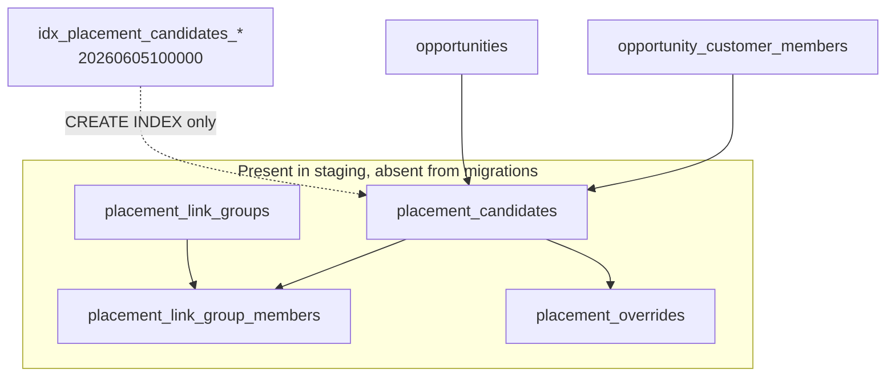

# Migration Dependency Graph

_Generated: 2026-06-14._

## How to read

- **createdIn**: migration that first declares `CREATE TABLE` for the object.
- **firstReference**: earliest migration that references the object via FK, JOIN/FROM, or trigger target.
- **violation**: reference appears before creation (ordering bug on clean replay).

## Critical gaps (staging tables with no CREATE in chain)

- placement_candidates
- placement_link_group_members
- placement_link_groups
- placement_overrides

## Tables — created vs first reference

| Table | Created in | First reference | Ordering issue |
|-------|------------|-----------------|----------------|
| `access_methods` | `20260329165048_remote_schema` | `20260329165048_remote_schema` |  |
| `action_links` | `20260329165048_remote_schema` | `20260329165048_remote_schema` |  |
| `activity_log` | `20260329165048_remote_schema` | — |  |
| `addon_frequencies` | `20260329165048_remote_schema` | `20260329165048_remote_schema` |  |
| `addon_types` | `20260329165048_remote_schema` | `20260329165048_remote_schema` |  |
| `app_users` | `20260329165048_remote_schema` | `20260329165048_remote_schema` |  |
| `assignment_statuses` | `20260329165048_remote_schema` | `20260329165048_remote_schema` |  |
| `assignments` | `20260329165048_remote_schema` | `20260329165048_remote_schema` |  |
| `campaigns` | `20260329165048_remote_schema` | `20260329165048_remote_schema` |  |
| `cleaning_job_addons` | `20260329165048_remote_schema` | — |  |
| `cleaning_job_details` | `20260329165048_remote_schema` | — |  |
| `cleaning_service_types` | `20260329165048_remote_schema` | `20260329165048_remote_schema` |  |
| `contact_tags` | `20260329165048_remote_schema` | `20260329165048_remote_schema` |  |
| `contacts` | `20260329165048_remote_schema` | `20260329165048_remote_schema` |  |
| `customer_member_contact_roles` | `20260329165048_remote_schema` | — |  |
| `customer_member_contacts` | `20260329165048_remote_schema` | — |  |
| `customer_member_relationship_types` | `20260329165048_remote_schema` | `20260423143000_opportunity_identity_seed_childcare_org` |  |
| `customer_members` | `20260329165048_remote_schema` | `20260329165048_remote_schema` |  |
| `customer_payment_methods` | `20260329165048_remote_schema` | — |  |
| `customer_person_role_types` | `20260329165048_remote_schema` | `20260403101000_customer_person_role_type_primary_contact_seed` |  |
| `customer_persons` | `20260329165048_remote_schema` | `20260602150000_demo_kurzman_cleanup_person_gender_options` |  |
| `customer_subscriptions` | `20260329165048_remote_schema` | `20260329165048_remote_schema` |  |
| `customer_tags` | `20260329165048_remote_schema` | `20260329165048_remote_schema` |  |
| `customer_vertical_job_counters` | `20260329165048_remote_schema` | `20260329165048_remote_schema` |  |
| `customers` | `20260329165048_remote_schema` | `20260329165048_remote_schema` |  |
| `departments` | `20260329165048_remote_schema` | `20260329165048_remote_schema` |  |
| `discount_applications` | `20260329165048_remote_schema` | `20260329165048_remote_schema` |  |
| `discount_codes` | `20260329165048_remote_schema` | `20260329165048_remote_schema` |  |
| `discount_commitments` | `20260329165048_remote_schema` | `20260329165048_remote_schema` |  |
| `discount_program_benefits` | `20260329165048_remote_schema` | `20260329165048_remote_schema` |  |
| `discount_program_commitment_rules` | `20260329165048_remote_schema` | `20260329165048_remote_schema` |  |
| `discount_program_qualifiers` | `20260329165048_remote_schema` | `20260329165048_remote_schema` |  |
| `discount_programs` | `20260329165048_remote_schema` | `20260328120000_firstfree4x120_discount_program` | yes — ref in 20260328120000_firstfree4x120_discount_program |
| `discount_redemptions` | `20260329165048_remote_schema` | — |  |
| `discounts` | `20260329165048_remote_schema` | — |  |
| `document_field_definitions` | `20260329165048_remote_schema` | `20260329165048_remote_schema` |  |
| `document_field_values` | `20260329165048_remote_schema` | — |  |
| `document_versions` | `20260329165048_remote_schema` | — |  |
| `documents` | `20260329165048_remote_schema` | `20260329165048_remote_schema` |  |
| `entity_labels` | `20260329165048_remote_schema` | — |  |
| `external_mappings` | `20260329165048_remote_schema` | — |  |
| `field_definitions` | `20260329165048_remote_schema` | `20260329165048_remote_schema` |  |
| `field_values` | `20260329165048_remote_schema` | `20260602150000_demo_kurzman_cleanup_person_gender_options` |  |
| `gl_account_mappings` | `20260329165048_remote_schema` | `20260329165048_remote_schema` |  |
| `gl_accounts` | `20260329165048_remote_schema` | `20260329165048_remote_schema` |  |
| `gl_journal_entries` | `20260329165048_remote_schema` | `20260329165048_remote_schema` |  |
| `gl_journal_lines` | `20260329165048_remote_schema` | `20260329165048_remote_schema` |  |
| `home_types` | `20260329165048_remote_schema` | `20260329165048_remote_schema` |  |
| `industries` | `20260329165048_remote_schema` | `20260329165048_remote_schema` |  |
| `industry_default_entity_labels` | `20260329165048_remote_schema` | — |  |
| `job_statuses` | `20260329165048_remote_schema` | `20260329165048_remote_schema` |  |
| `job_tags` | `20260329165048_remote_schema` | — |  |
| `jobs` | `20260329165048_remote_schema` | `20260329165048_remote_schema` |  |
| `ledger_transactions` | `20260329165048_remote_schema` | `20260329165048_remote_schema` |  |
| `location_tags` | `20260329165048_remote_schema` | — |  |
| `location_types` | `20260329165048_remote_schema` | `20260329165048_remote_schema` |  |
| `locations` | `20260329165048_remote_schema` | `20260329165048_remote_schema` |  |
| `messages` | `20260329165048_remote_schema` | `20260329165048_remote_schema` |  |
| `messages_outbox` | `20260329165048_remote_schema` | `20260329165048_remote_schema` |  |
| `opportunities` | `20260329165048_remote_schema` | `20260329165048_remote_schema` |  |
| `opportunity_tags` | `20260329165048_remote_schema` | — |  |
| `org_settings` | `20260329165048_remote_schema` | — |  |
| `orgs` | `20260329165048_remote_schema` | `20260329165048_remote_schema` |  |
| `payment_statuses` | `20260329165048_remote_schema` | `20260329165048_remote_schema` |  |
| `payments` | `20260329165048_remote_schema` | `20260329165048_remote_schema` |  |
| `permission_definitions` | `20260329165048_remote_schema` | `20260505164000_permission_grid_keys` |  |
| `permission_keys` | `20260329165048_remote_schema` | `20260329165048_remote_schema` |  |
| `permissions` | `20260329165048_remote_schema` | `20260329165048_remote_schema` |  |
| `person_locations` | `20260329165048_remote_schema` | — |  |
| `person_relationship_type_settings` | `20260329165048_remote_schema` | `20260430211000_childcare_mvp_control_plane_seed` |  |
| `person_relationships` | `20260329165048_remote_schema` | — |  |
| `persons` | `20260329165048_remote_schema` | `20260329165048_remote_schema` |  |
| `pipeline_stages` | `20260329165048_remote_schema` | `20260329165048_remote_schema` |  |
| `pipelines` | `20260329165048_remote_schema` | `20260329165048_remote_schema` |  |
| `pricing_addons` | `20260329165048_remote_schema` | `20260329165048_remote_schema` |  |
| `pricing_dimension_values` | `20260329165048_remote_schema` | `20260329165048_remote_schema` |  |
| `pricing_dimensions` | `20260329165048_remote_schema` | `20260329165048_remote_schema` |  |
| `pricing_first_clean_prices` | `20260329165048_remote_schema` | `20260329165048_remote_schema` |  |
| `pricing_frequencies` | `20260329165048_remote_schema` | `20260329165048_remote_schema` |  |
| `pricing_matrix` | `20260329165048_remote_schema` | `20260407120000_audit_cleaning_quote_pricing_matrix_legacy_parity` |  |
| `pricing_modes` | `20260329165048_remote_schema` | `20260329165048_remote_schema` |  |
| `pricing_recurring_prices` | `20260329165048_remote_schema` | `20260329165048_remote_schema` |  |
| `pricing_services` | `20260329165048_remote_schema` | `20260329165048_remote_schema` |  |
| `pricing_square_footage_tiers` | `20260329165048_remote_schema` | `20260329165048_remote_schema` |  |
| `quotes` | `20260329165048_remote_schema` | `20260329165048_remote_schema` |  |
| `recurrence_plans` | `20260329165048_remote_schema` | — |  |
| `role_definitions` | `20260329165048_remote_schema` | `20260329165048_remote_schema` |  |
| `role_permission_grants` | `20260329165048_remote_schema` | `20260505120100_settings_users_roles_permission` |  |
| `schedule_statuses` | `20260329165048_remote_schema` | `20260329165048_remote_schema` |  |
| `schedule_tags` | `20260329165048_remote_schema` | — |  |
| `schedules` | `20260329165048_remote_schema` | `20260329165048_remote_schema` |  |
| `service_offerings` | `20260329165048_remote_schema` | `20260329165048_remote_schema` |  |
| `service_plan_templates` | `20260329165048_remote_schema` | `20260329165048_remote_schema` |  |
| `service_price_dimensions` | `20260329165048_remote_schema` | — |  |
| `service_pricing_rules` | `20260329165048_remote_schema` | `20260329165048_remote_schema` |  |
| `sqft_bands` | `20260329165048_remote_schema` | `20260329165048_remote_schema` |  |
| `status_definitions` | `20260329165048_remote_schema` | `20260415120000_opportunity_record_chrome_and_status` |  |
| `tags` | `20260329165048_remote_schema` | `20260329165048_remote_schema` |  |
| `user_profiles` | `20260329165048_remote_schema` | `20260329165048_remote_schema` |  |
| `user_roles` | `20260329165048_remote_schema` | `20260329165048_remote_schema` |  |
| `vendor_statuses` | `20260329165048_remote_schema` | `20260329165048_remote_schema` |  |
| `vendor_tags` | `20260329165048_remote_schema` | — |  |
| `vendor_users` | `20260329165048_remote_schema` | `20260329165048_remote_schema` |  |
| `vendor_verticals` | `20260329165048_remote_schema` | — |  |
| `vendors` | `20260329165048_remote_schema` | `20260329165048_remote_schema` |  |
| `verticals` | `20260329165048_remote_schema` | `20260329165048_remote_schema` |  |
| `work_units` | `20260329165048_remote_schema` | `20260329165048_remote_schema` |  |
| `workflow_action_runs` | `20260329165048_remote_schema` | — |  |
| `workflow_actions` | `20260329165048_remote_schema` | `20260329165048_remote_schema` |  |
| `workflow_conditions` | `20260329165048_remote_schema` | `20260329165048_remote_schema` |  |
| `workflow_events` | `20260329165048_remote_schema` | `20260329165048_remote_schema` |  |
| `workflow_runs` | `20260329165048_remote_schema` | `20260329165048_remote_schema` |  |
| `workflows` | `20260329165048_remote_schema` | `20260329165048_remote_schema` |  |
| `job_line_items` | `20260329170000_job_line_items_job_pricing_snapshots_phase1` | `20260329170000_job_line_items_job_pricing_snapshots_phase1` |  |
| `job_pricing_snapshots` | `20260329170000_job_line_items_job_pricing_snapshots_phase1` | — |  |
| `payment_allocations` | `20260329210000_payments_payment_allocations` | `20260329210000_payments_payment_allocations` |  |
| `charges` | `20260331120000_charges_receivables_foundation` | `20260331120000_charges_receivables_foundation` |  |
| `charge_line_items` | `20260331120000_charges_receivables_foundation` | — |  |
| `IF` | `20260402140000_field_sections_public_visibility` | — |  |
| `field_section_definitions` | `20260402140000_field_sections_public_visibility` | `20260402143000_public_booking_field_config_seed` |  |
| `option_sets` | `20260404130000_option_sets_location_fields_sqft_tier_key` | `20260403120000_quote_intake_option_sets_specialty_opportunity` | yes — ref in 20260403120000_quote_intake_option_sets_specialty_opportunity |
| `option_set_items` | `20260404130000_option_sets_location_fields_sqft_tier_key` | `20260404130000_option_sets_location_fields_sqft_tier_key` |  |
| `record_overview_layouts` | `20260408140100_record_overview_layouts` | `20260408140100_record_overview_layouts` |  |
| `record_layouts` | `20260409140000_record_layouts_and_record_actions` | `20260409140000_record_layouts_and_record_actions` |  |
| `record_actions` | `20260409140000_record_layouts_and_record_actions` | `20260409140000_record_layouts_and_record_actions` |  |
| `agent_v0_proposals` | `20260412100000_agent_v0_audit` | `20260412100000_agent_v0_audit` |  |
| `agent_v0_apply_audit` | `20260412100000_agent_v0_audit` | `20260412100000_agent_v0_audit` |  |
| `agent_v1_record_layout_proposals` | `20260413100000_agent_v1_record_overview_layout_audit` | `20260413100000_agent_v1_record_overview_layout_audit` |  |
| `agent_v1_record_layout_apply_audit` | `20260413100000_agent_v1_record_overview_layout_audit` | `20260413100000_agent_v1_record_overview_layout_audit` |  |
| `agent_v2_field_visibility_proposals` | `20260414100000_agent_v2_field_visibility_audit` | `20260414100000_agent_v2_field_visibility_audit` |  |
| `agent_v2_field_visibility_apply_audit` | `20260414100000_agent_v2_field_visibility_audit` | `20260414100000_agent_v2_field_visibility_audit` |  |
| `action_definitions` | `20260427180000_action_definitions_and_placements` | `20260427180000_action_definitions_and_placements` |  |
| `action_placements` | `20260427180000_action_definitions_and_placements` | `20260427180000_action_definitions_and_placements` |  |
| `opportunity_customer_members` | `20260430133000_opportunity_customer_members_foundation` | `20260430133000_opportunity_customer_members_foundation` |  |
| `record_drawer_layouts` | `20260430140000_record_drawer_layouts_org_scoped` | `20260430140000_record_drawer_layouts_org_scoped` |  |
| `status_transition_rules` | `20260430231000_status_transition_rules_v1` | `20260430231000_status_transition_rules_v1` |  |
| `opportunity_persons` | `20260430240000_opportunity_persons_family_contacts` | `20260430240000_opportunity_persons_family_contacts` |  |
| `communication_provider_bindings` | `20260430254100_communications_v1_foundation` | `20260430254100_communications_v1_foundation` |  |
| `communication_threads` | `20260430254100_communications_v1_foundation` | `20260430254100_communications_v1_foundation` |  |
| `communication_messages` | `20260430254100_communications_v1_foundation` | `20260430254100_communications_v1_foundation` |  |
| `communication_message_reads` | `20260430254100_communications_v1_foundation` | `20260430254100_communications_v1_foundation` |  |
| `workspace_kpi_placement` | `20260501193000_workspace_kpi_placement` | `20260501193000_workspace_kpi_placement` |  |
| `user_access_profiles` | `20260504103000_user_access_scope_tables_v1` | `20260504103000_user_access_scope_tables_v1` |  |
| `user_department_access` | `20260504103000_user_access_scope_tables_v1` | `20260504103000_user_access_scope_tables_v1` |  |
| `user_site_access` | `20260504103000_user_access_scope_tables_v1` | `20260504103000_user_access_scope_tables_v1` |  |
| `form_definitions` | `20260506100000_forms_engine_v1_foundation` | `20260506100000_forms_engine_v1_foundation` |  |
| `form_definition_versions` | `20260506100000_forms_engine_v1_foundation` | `20260506100000_forms_engine_v1_foundation` |  |
| `form_public_links` | `20260506100000_forms_engine_v1_foundation` | `20260506100000_forms_engine_v1_foundation` |  |
| `form_submissions` | `20260506100000_forms_engine_v1_foundation` | `20260506100000_forms_engine_v1_foundation` |  |
| `form_submission_documents` | `20260506100000_forms_engine_v1_foundation` | `20260506100000_forms_engine_v1_foundation` |  |
| `form_submission_signatures` | `20260506100000_forms_engine_v1_foundation` | `20260506100000_forms_engine_v1_foundation` |  |
| `form_packet_definitions` | `20260510120000_forms_packet_foundation` | `20260510120000_forms_packet_foundation` |  |
| `form_packet_items` | `20260510120000_forms_packet_foundation` | `20260510120000_forms_packet_foundation` |  |
| `form_packet_sessions` | `20260510120000_forms_packet_foundation` | `20260510120000_forms_packet_foundation` |  |
| `form_packet_session_items` | `20260510120000_forms_packet_foundation` | `20260510120000_forms_packet_foundation` |  |
| `tour_availability_rules` | `20260511143000_tour_scheduling_v1_foundation` | `20260511143000_tour_scheduling_v1_foundation` |  |
| `tour_bookings` | `20260511143000_tour_scheduling_v1_foundation` | `20260511143000_tour_scheduling_v1_foundation` |  |
| `tour_public_booking_links` | `20260512140000_tour_public_booking_links` | `20260512140000_tour_public_booking_links` |  |
| `task_assist_proposals` | `20260521103000_task_assist_v1_1_foundation` | `20260521103000_task_assist_v1_1_foundation` |  |
| `communication_scheduled_sends` | `20260521103000_task_assist_v1_1_foundation` | `20260521103000_task_assist_v1_1_foundation` |  |
| `operational_tasks` | `20260521103000_task_assist_v1_1_foundation` | `20260521103000_task_assist_v1_1_foundation` |  |
| `config_layout_assist_proposals` | `20260523140000_config_layout_assist_proposals` | `20260523140000_config_layout_assist_proposals` |  |
| `entity_layouts` | `20260603120000_entity_layouts_v2` | — |  |
| `location_program_categories` | `20260610140001_location_program_categories` | `20260610140001_location_program_categories` |  |

## Ordering violations (confirmed blockers)

| Kind | Object | Created in | Referenced in |
|------|--------|------------|---------------|
| forward_table | `discount_programs` | 20260329165048_remote_schema | 20260328120000_firstfree4x120_discount_program |
| forward_table | `option_sets` | 20260404130000_option_sets_location_fields_sqft_tier_key | 20260403120000_quote_intake_option_sets_specialty_opportunity |
| missing_table | `placement_candidates` | — | 20260605100000_waitlist_queue_lane_query_indexes |

## Mermaid — placement/waitlist cluster (staging-only today)

