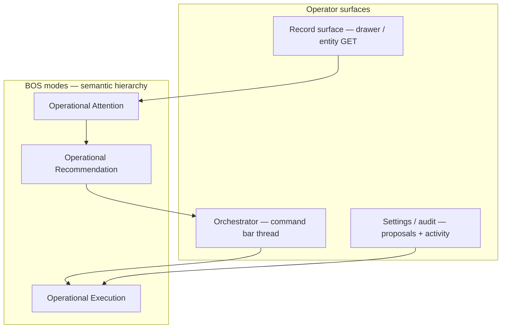
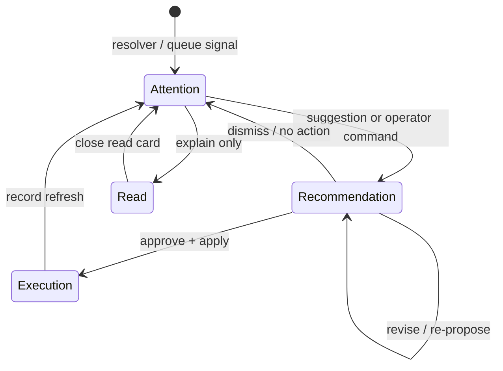

# BOS UX Coherence — Step 1 Design

**Path:** `docs/sprints/archive/05_2026/bos_ux_coherence_design.md`  
**Status:** Design complete — implementation tracked in **[`bos_ux_coherence_sprint.md`](./bos_ux_coherence_sprint.md)** (Step 2)  
**Date:** 2026-05-20  
**Prerequisite:** [`bos_ux_coherence_audit.md`](./bos_ux_coherence_audit.md) (Step 0)

**Aligned doctrine:**

| Doc | Role in this design |
|-----|-------------------|
| `docs/execution/operating-doctrine.md` | Behavior changes update topic docs; no parallel UX systems |
| `docs/product/bos-foundation.md` | Capability map, lifecycle invariants, permissions (canonical BOS) |
| `docs/product/ai-system.md` | Stub → `bos-foundation.md` |
| `docs/archive/2026-06-superseded-system/workspace-system.md` | Queue truth, attention lanes, count semantics |
| `docs/system/configuration-system.md` | Settings control plane; config-assist same PATCH paths |
| `docs/archive/2026-06-superseded-system/actions-and-workflows.md` | Placements vs execution; workflow spine |
| `docs/execution/roadmap-and-gaps.md` | BOS expansion paused; operational-first program |

**Preserved (non-negotiable):** proposal-first mutations; queue truth; AdminV2 workspace model; event/workflow architecture; permissions; `BosProposalEnvelopeV1` + adapters (`web/lib/bos/`); Orchestrator executes **no** side effects.

---

## 1. Executive Summary

### Design intent

This document defines **Alloy’s operational intelligence design language** — how BOS should feel embedded in AdminV2 operations, not layered on as a chat product.

**Strategic north star (from audit):** Operators should experience BOS as **context-aware operational reasoning** attached to records, queues, and workflows — calm, deterministic, governed, and reviewable.

**Not the goal:** “AI everywhere,” conversational clutter, autonomous agents, or a generalized copilot.

### What this design delivers

| Deliverable | Outcome |
|-------------|---------|
| **Formal BOS definition** | Product + UX boundary vs chatbots and automation bots |
| **Three BOS modes** | Attention → Recommendation → Execution hierarchy |
| **Unified proposal language** | One operator-facing proposal model mapped to existing envelopes |
| **Three integration surfaces** | Record · Orchestrator · Settings/Audit — single story per moment |
| **Standards packs** | Explainability, trust, attention placement, loading, AdminV2 rhythm |
| **Sprint boundaries** | V1 vs V1.5 vs future; explicit must-not-do list |

### Coherence thesis (binding)

BOS is **one layer** expressed through **three surfaces**:



Every UX change in the polish sprint must answer: **which surface owns this moment, which mode is it, and how do the other surfaces reflect the same record context?**

### Program fit

Per `roadmap-and-gaps.md`, this sprint **unifies and polishes** shipped assistive groundwork. It does **not** expand capability inventory, Config/Layout apply catalog, or Workflow Assist templates.

---

## 2. What BOS Is

### 2.1 Formal definition

**BOS (Business Orchestration System)** is Alloy’s **operational intelligence layer**: the product system that **reads operational state**, **explains what matters**, **proposes reviewable changes**, and **routes operator intent** to governed platform execution paths — without owning business truth, authorization, or side effects itself.

BOS is **workflow-native intelligence**: it sits on the same records, queues, layouts, workflows, and communications paths operators already use.

### 2.2 What BOS does

| Function | Description | Platform owner of truth |
|----------|-------------|-------------------------|
| **Observe** | Resolver attention, queue previews, workflow read models, config inventory | Entity GET, `QueueService`, workflow APIs |
| **Explain** | Why a record needs attention; what a proposal would change | Deterministic rules + registered templates |
| **Propose** | Immutable candidates (drafts, config deltas, workflow definitions) | Native proposal types + validation |
| **Route** | NL / UI intent → bounded capability | Orchestrator (`routeCommandSurface`) |
| **Gate** | Human approval, RBAC, org `ai_policy`, env flags | Server routes + audit tables |

### 2.3 What BOS is not

| Not BOS | Why |
|---------|-----|
| **Chatbot / copilot** | No open-ended conversation as the product; thread is an **audit trail of operational acts**, not social dialogue |
| **Automation bot** | No autonomous execution; no “run on my behalf” without explicit approve/apply |
| **Parallel admin** | No client DB writes; no bypass of `executeAdminAction` / `emitEvent` / canonical PATCH |
| **Queue authority** | Queue rows are selection/preview only (`workspace-system.md`) |
| **Config store** | JSON proposals are candidates; validated PATCH/RPC commits are truth (`configuration-system.md`) |

### 2.4 Relationship to shipped capabilities

BOS **names and bounds** existing capabilities (`bos-foundation.md`, `BOS_CAPABILITY_REGISTRY`). Operator-facing names:

| Capability | BOS role |
|------------|----------|
| **Orchestrator** | Routing and thread shell only |
| **Task Assist** | Operational recommendations → execution (comms, schedule, tasks) |
| **Workflow Assist** | Config-domain recommendations (workflow CRUD proposals) |
| **Config / Layout Assist** | Config-domain recommendations (layout/field proposals) |
| **Needs attention + enrich** | Operational attention + optional copy recommendation (insight only) |
| **Job overview layout** | Config-domain recommendation (layout commit) |

Engineering may retain `commandSurface*`, `/api/admin/ai/*`, and `TaskAssist*` identifiers; **operator copy** uses BOS vocabulary above.

### 2.5 One-line operator doctrine

> **BOS helps you see what needs attention, understand why, and act through review — the platform executes only what you approve.**

---

## 3. BOS Interaction Model

### 3.1 Interaction hierarchy (highest → lowest)

Operators encounter BOS in this **priority order**. Lower layers must not compete visually or semantically with higher layers on the same record.

| Rank | Layer | Operator question answered | Primary surfaces |
|------|-------|---------------------------|------------------|
| **1** | **Operational state** | What is true about this work right now? | Queue row, drawer fields, status, KPIs |
| **2** | **Operational Attention** | What requires awareness on this record or cohort? | Drawer chrome strip, workspace Needs Attention lanes, queue accent |
| **3** | **Operational Recommendation** | What does BOS suggest I review or draft? | Attention suggestion, proposal cards, read/explain cards |
| **4** | **Orchestrator routing** | How do I act in natural language on current context? | Command bar input, routing notice, entity candidates |
| **5** | **Review & approval** | What exactly will change if I proceed? | Proposal anatomy (§5), Settings review |
| **6** | **Operational Execution** | What was applied and when? | Apply confirmation, activity/audit, refreshed entity |

**Rule:** Attention **never** implies mutation. Recommendations **never** auto-apply. Execution **always** shows receipt or failure.

### 3.2 Orchestrator role (not a chat hub)

The command bar is an **Orchestrator** — an operational command rail, not a chat window.

| Orchestrator IS | Orchestrator IS NOT |
|---------------|---------------------|
| Intent parser + router | Free-form assistant personality |
| Thread of **operational turns** (user command, notice, card) | Message history for small talk |
| Place for proposal review/apply | Source of business truth |
| Continuation of record context | Disconnected AI panel |

**Thread turn types (canonical):**

- `operator_command` — what the operator asked
- `routing_notice` — one-line why a capability was selected (V1 required)
- `clarification` — disambiguation (entity, intent)
- `read_response` — workflow explain/summary (no mutation)
- `operational_proposal` — recommendation card (§5)
- `execution_receipt` — applied / failed / scheduled (V1.5 where missing today)

Avoid: typing indicators, persona avatars, “thinking” animations, suggested prompt chips that read like ChatGPT.

### 3.3 Three operator surfaces (integration contract)

| Surface | Owns | Must show | Must not own |
|---------|------|-----------|--------------|
| **Record** (`entity GET`, drawer) | Attention + deterministic suggestion + draft preview | Why / Next / Why-not-sent | Send, schedule, workflow writes |
| **Orchestrator** (bottom bar) | Route, propose, approve, apply for routed capabilities | Active record chip, workspace scope hint | Duplicate full attention panel |
| **Settings / audit** | Durable config proposals, permissioned review, history | Risk, operations list, integrity links | Ephemeral chat |

**Handoff rule (V1 required):** Opening a record drawer **seeds active operational context** (§6) so Orchestrator routing, chips, and explain paths align with the open record without re-search.

### 3.4 Capability invocation patterns

| Pattern | When | Example |
|---------|------|---------|
| **Embedded insight** | Record open | `OperationalAttentionHeaderStrip` |
| **Lane signal** | Workspace navigation | Needs Attention bucket, queue `_needs_attention` accent |
| **Command invocation** | Operator types intent | “Text Mitchell family about tour” |
| **Structured CTA** | From strip or compact ops chips | “Continue in command bar” / focus + seed |
| **Settings review** | Durable config proposal | `/adminV2/settings/config-proposals` |

---

## 4. BOS Modes

Canonical modes are **semantic**, not separate UI tabs. All shipped BOS UX should classify into one primary mode per visible block.

### 4.1 Mode definitions

#### Mode A — Operational Attention

**Meaning:** Something in operational state warrants awareness; **no mutation** is implied.

| Attribute | Standard |
|-----------|----------|
| **Trigger** | Resolver (`needs_attention`), SLA/stale signals, bucket membership |
| **Data authority** | Entity GET `_operational_attention`; queue preview enrichment |
| **Copy tone** | Factual, calm (“Needs attention: …”, “Activity signal”) |
| **Actions** | Navigate, filter, open drawer — **not** send/apply |
| **Visual** | Compact strip; subtle queue accent; lane tiles |

**Shipped anchors:** `OperationalAttentionHeaderStrip`, workspace Needs Attention lanes, `OpportunityAttentionLaneBlock`.

#### Mode B — Operational Recommendation

**Meaning:** BOS offers a **reviewable candidate** — draft text, config delta, workflow definition, layout preview — that may become execution after approval.

| Attribute | Standard |
|-----------|----------|
| **Trigger** | Deterministic templates, propose APIs, planner preview |
| **Data authority** | Native proposal payload; envelope for display (`BosProposalEnvelopeV1`) |
| **Copy tone** | “Proposal”, “Draft”, “Review required”, risk level |
| **Actions** | Review, edit fields, approve, reject, open Settings review |
| **Visual** | `CommandSurfaceActionCardShell` family; consistent proposal anatomy (§5) |

**Includes:** Task Assist draft, Config proposal, Workflow proposal, Job layout preview, attention **Enhance draft** (copy-only sub-recommendation).

**Excludes:** Auto-send, silent PATCH, “Apply all” without per-operation visibility for partial catalogs.

#### Mode C — Operational Execution

**Meaning:** An approved action **completed or was attempted** through a canonical platform path.

| Attribute | Standard |
|-----------|----------|
| **Trigger** | Successful apply, scheduled send creation, workflow CRUD commit |
| **Data authority** | API response + audit tables (`task_assist_proposals`, activity log) |
| **Copy tone** | Past tense, specific (“Message queued”, “Workflow created (disabled)”) |
| **Actions** | View record, open comms thread, open automations, view audit |
| **Visual** | Receipt line in thread or activity strip; no celebratory animation |

#### Mode D — Operational Read (supporting, non-mutating)

**Meaning:** Explain or summarize operational systems **without** a proposal.

| Examples | Workflow explain, failed runs summary, enrollment touch read card |
| **Never** | Imply apply or configuration change |

### 4.2 Mode transition diagram



### 4.3 Mode vs capability matrix

| Capability | Default mode | May transition to |
|------------|--------------|-------------------|
| Needs attention (resolver) | Attention | Recommendation (suggestion body) |
| Attention enrich | Recommendation (copy) | — (no Execution) |
| Task Assist | Recommendation | Execution |
| Workflow Assist read | Read | — |
| Workflow Assist propose | Recommendation | Execution |
| Config / Layout Assist | Recommendation | Execution (partial catalog: show skipped ops) |
| Job overview layout | Recommendation | Execution |
| Orchestrator | Routing (not a mode block) | Delegates to modes above |

### 4.4 Anti-patterns (forbidden in V1 polish)

- Attention block with dashed “future actions” placeholders
- Recommendation card without **Review required** or risk when `requires_approval`
- Execution language (“Sent”, “Applied”) before apply succeeds
- Multiple **Attention** blocks on one drawer (audit finding #7)

---

## 5. Unified Proposal System

**Scope:** Operator-facing **language and layout standards** only. Backend tables, native payloads, and `raw_payload` in envelopes **unchanged**.

### 5.1 Canonical term: Operational Proposal

Replace fragmented labels (“draft card”, “configuration proposal”, “action card”, “preview”) with:

> **Operational Proposal** — a reviewable BOS recommendation tied to a `capability_key`, with explicit approval and platform apply.

Specialist names remain secondary subtitles: “Task Assist · Draft message”, “Config Assist · Layout change”.

### 5.2 Proposal anatomy (required regions)

Every Operational Proposal UI **must** present these regions in consistent order (collapse optional regions, never reorder).

| Region | Purpose | Maps to envelope / native |
|--------|---------|---------------------------|
| **1. Header** | Capability subtitle + proposal type | `capability_key`, `summary` (short) |
| **2. Why shown** | Routing or trigger (1–2 lines) | `source.surface`, routing notice, resolver reason |
| **3. Summary** | Human outcome statement | `summary` |
| **4. Scope** | Records / surfaces affected | `affected_surfaces` |
| **5. Change detail** | Diff, operations, draft body | `diff`, `raw_payload` |
| **6. Risk & approval** | Risk badge + “Requires your approval” | `risk_level`, `requires_approval` |
| **7. Validation** | Errors block apply; warnings visible | `validation`, `warnings` |
| **8. Actions** | Primary: Review / Approve / Apply; Secondary: Reject, Open in Settings | capability-specific |
| **9. Status** | Draft / Ready / Applied / Failed | `status` (mapped native → BOS) |

**Compact proposals** (Task Assist) may collapse regions 4–5 into inline draft preview but **must** retain 6–8.

### 5.3 Review hierarchy

| Level | Where | Operator action |
|-------|-------|-----------------|
| **L1 — Inline preview** | Thread card or drawer popover | Read-only scan |
| **L2 — Card review** | Expand panel / review drawer in card | Edit proposal fields (where supported) |
| **L3 — Settings review** | Config proposals hub (durable config) | Full operation list, integrity, approve |
| **L4 — Audit** | AI Activity / proposal history | Post-hoc verification |

**Config Assist rule (V1):** Mutating config proposals default to **L3** for apply when org lacks in-thread apply permission OR when any operation is outside apply catalog. In-thread ready card is **shortcut**, not a second product path — copy must say “Same proposal as Settings → Config proposals”.

### 5.4 Apply semantics

| Rule | Standard |
|------|----------|
| **Apply label** | Use “Approve and apply” / “Approve and send” — not “Run” / “Go” |
| **Pre-apply** | Disable primary when `validation.ok === false` |
| **Partial apply** | List each operation: Applied / Skipped (not supported) / Failed |
| **Post-apply** | Transition card to **Execution** receipt; refresh entity/activity |
| **Idempotency** | Show `proposal_id` in debug/support areas, not hero copy |

### 5.5 Reasoning placement

| Content type | Placement | Label convention |
|--------------|-----------|------------------|
| Deterministic resolver reasoning | Record Attention / suggestion | **Why** · **Next** |
| Routing explanation | Thread `routing_notice` | “Routed to Task Assist — message + family name detected” |
| Workflow explain | Read card body | “Explanation” (not “AI says”) |
| LLM enrich | Subordinate to deterministic draft | **Enhanced draft (preview only)** — never “BOS recommends sending” |
| Policy denial | Before submit or on card mount | **Not available** + reason code |

**Confidence:** Do not show faux probability scores. Use **deterministic** language (“Based on enrollment rules”, “From workflow run logs”).

### 5.6 Approval semantics

| `requires_approval` | UI requirement |
|---------------------|----------------|
| `true` | Explicit primary approve control; no auto-apply on Enter |
| `false` (rare) | Still show confirmation for mutating ops |

Org policy off → card never mounts propose UI; show **Policy** denial (§8).

### 5.7 Execution confirmation standards

After apply:

- **One sentence outcome** in thread (Execution mode)
- **Entity label** affected
- **Timestamp** (org timezone)
- **Link** to audit or relevant surface (comms tab, workflows hub)
- On failure: **Failed** status + server message + proposal remains reviewable

### 5.8 Mapping from today’s fragmented cards

| Current UI | Unified treatment |
|------------|-------------------|
| `TaskAssistCompactDraftCard` | Operational Proposal · Task Assist · compact anatomy |
| `WorkflowAssistProposalActionCard` | Operational Proposal · Workflow Assist · full anatomy + in-card rename (no `window.prompt`) |
| `ConfigLayoutAssistProposalThreadCard` / `ReadyCard` | Same proposal ID; Ready = status **validated/approved**; CTA clarifies L3 |
| Job layout `SurfaceCard` | Operational Proposal · Job layout · Preview = L1, Apply = L8 |
| Attention suggestion draft popover | Sub-recommendation under Attention — **not** a proposal with apply |
| `Enhance draft` | Recommendation (copy-only), child of Attention |

### 5.9 Mutation visibility

Operators must always see:

- **What record types** change (opportunity, workflow definition, layout JSON)
- **What does not change** (explicit “Does not send messages” on insight/enrich)
- **Disabled-by-default** for new workflows (existing rule — surface in Execution receipt)

---

## 6. Contextual Intelligence Standards

### 6.1 Active operational context (single source per session)

**Active operational context** is the minimal struct Orchestrator and capabilities use for routing and chips:

| Field | Source | Persisted? |
|-------|--------|------------|
| `entity_type`, `entity_id`, `label` | Drawer open, queue open, candidate pick | **Session** (in-memory); re-seed on drawer open |
| `source_surface` | drawer \| queue \| command_bar \| workspace | No |
| `workspace_scope` | Dept/WU page | Session until unmount |
| `available_actions` | Entity capability hints | Derived |

**V1 required:** Drawer open for `opportunities` **sets** context; drawer close **clears** or soft-clears per product choice (recommended: clear on close to avoid stale chips).

### 6.2 Context behavior by situation

| Situation | Expected BOS behavior |
|-----------|----------------------|
| **Open drawer from queue** | Seed context; Attention mode in chrome; Orchestrator chip shows label |
| **Switch entity in drawer** | Replace context; thread **unchanged** but chip updates; optional one-line notice “Context: {label}” |
| **Navigate dept/WU** | Set `workspace_scope`; Workflow Assist create inherits scope |
| **Change queue filter** | No thread mutation; Attention lanes reflect filter only |
| **Clear command thread** | Clears thread + job card UI; **does not** clear record context if drawer still open |
| **Command without entity** | Route to search/clarify; no faux “ambient” explain for workflow |

### 6.3 Thread continuity expectations

| Expectation | Standard |
|-------------|----------|
| Thread survives AdminV2 in-tab navigation | Yes (`sessionStorage`) |
| Thread is authoritative history of **commands** | Yes |
| Thread is **not** authoritative business state | Entity GET always wins |
| Stale candidate in thread after context switch | Show chip for **current** context; old cards labeled “Earlier · {label}” (V1.5) or prevent apply if ID mismatch (V1 minimum: disable apply) |

### 6.4 Command surface awareness

Orchestrator chrome displays:

- **Active record** chip when `entity_id` set (truncated label)
- **Workspace** hint when `workspace_scope` set (dept/WU names)
- **No mode tabs** (Interaction Layer V1 preserved)

Remove or repurpose dead `commandSurfaceMode` from operator-visible behavior (V1.5: remove from focus API).

### 6.5 Contextual recommendation rules

| Rule | Rationale |
|------|-----------|
| Recommendations **reference** active context by default | Avoid re-search friction |
| Do not auto-inject unsolicited proposals on drawer open | Calm, non-chatty |
| Attention suggestion may include **Continue** CTA to Orchestrator with seeded command | Embedded → operational handoff |
| Queue row gesture: open drawer first; command bar second | Queue truth → entity GET |

### 6.6 “Aware without chatty”

Allowed:

- One-line routing notices
- Compact Attention strip
- Silent context chip update

Forbidden:

- Proactive “Hi, I noticed…” messages
- Multiple assistant bubbles on drawer open
- Auto-expand thread on navigation

---

## 7. Operational Explainability Standards

### 7.1 Mandatory questions (checklist)

Every BOS Recommendation or Proposal must make these answerable **without support docs**:

| # | Question | Required when |
|---|----------|---------------|
| 1 | **Why am I seeing this?** | Always |
| 2 | **What triggered this?** | Attention, policy blocks |
| 3 | **What changes if I approve?** | All proposals |
| 4 | **What records are affected?** | All proposals |
| 5 | **Does this require my approval?** | All mutating proposals |
| 6 | **What already executed?** | Execution mode, enrich (explicitly **nothing** sent) |
| 7 | **Can I review first?** | Always yes for mutations; path named (card vs Settings) |

### 7.2 Explainability hierarchy (visual priority)

| Tier | Content | Max visual weight |
|------|---------|-------------------|
| **T0** | Primary operational fact (status, attention headline) | Highest |
| **T1** | Next step / proposal summary | High |
| **T2** | Why / reasoning (deterministic) | Medium |
| **T3** | Secondary factors, debug, correlation IDs | Low / collapsed |
| **T4** | LLM-enhanced copy | Subordinate, labeled preview |

### 7.3 Surface-specific explainability

| Surface | T0 | T1 | T2 |
|---------|----|----|-----|
| Drawer chrome | Needs attention headline | Next | Why (truncated) |
| Orchestrator card | Proposal summary | Approve outcome | Routing notice |
| Workspace lane | Bucket label + count | — | Tooltip: count scope (V1.5) |
| Settings review | Proposal title | Operations table | Integrity warnings |

### 7.4 Policy denial semantics (V1 required)

Structured denial copy template:

```
Not available — {reason}
· Org: {feature} is off for your organization}
· Access: you need {permission}}
· Environment: {gate} is disabled in this deployment}
```

Never generic “Something went wrong” for policy gates.

### 7.5 Before / after visibility

| Domain | Before | After |
|--------|--------|-------|
| Config layout | `diff.summary_lines` + link to effective preview | Receipt + “View in Settings → Layouts” |
| Task comms | Recipient summary + channel | “Queued / Sent at …” |
| Workflow | Disabled flag visible **before** apply | Workflow name + link to Automations |

### 7.6 Count / cohort explainability (workspace)

When showing Needs Attention counts on dept lanes:

- Tooltip or footnote: **Count scope:** work-unit aligned (cap 5000) vs org preview (cap 500) — per `workspace-system.md`
- Never imply queue count equals drawer authority

---

## 8. Operational Trust + Governance Standards

### 8.1 Trust principles

| Principle | UX expression |
|-----------|---------------|
| **Human delegates** | Operator is actor; BOS never “acts alone” |
| **Proposal-first** | No mutation without proposal + approve (except platform actions outside BOS) |
| **Fail closed** | Validation errors block apply; stale config versions error |
| **Honest partiality** | Partial apply lists skipped operations |
| **No speculative UI** | No dashed future placeholders in production |

### 8.2 Proposal lifecycle visibility (operator map)

Map native statuses → single operator words (align `BosProposalStatus`):

| Operator label | Meaning | Typical native sources |
|----------------|---------|------------------------|
| **Draft** | Proposed, not validated | draft |
| **Ready for review** | Validated | validated / reviewed |
| **Approved** | Cleared to apply | approved |
| **Applied** | Succeeded | applied |
| **Failed** | Apply attempted, failed | failed |
| **Rejected** | Declined | rejected |
| **Superseded** | Replaced | superseded / rolled_back |

Pending vs applied must **never** share the same badge color without label.

### 8.3 Review-required patterns

| Risk | Pattern |
|------|---------|
| `low` | Inline approve acceptable |
| `medium` | Prominent approve + summary |
| `high` | Require expanded review panel; Workflow duplicate warning |

### 8.4 Mutation boundaries (copy standards)

| Boundary | Required copy |
|----------|---------------|
| Insight → Execution | “Copy only — does not send” |
| Proposal → Platform | “Applies through {Admin settings / Communications / Automations}” |
| Queue preview | Never “Update record” from queue row without drawer GET |
| Enrich | “Preview only — not saved to record” |

### 8.5 System confirmation language

| Event | Preferred label | Avoid |
|-------|-----------------|-------|
| Message send queued | “Outbound message queued” | “AI sent” |
| Schedule created | “Send scheduled for {time}” | “AI scheduled” |
| Workflow created | “Workflow created (starts disabled)” | “AI created automation” |
| Config applied | “Configuration updated” | “AI changed settings” |

### 8.6 Execution receipts & audit

| Channel | V1 | V1.5 |
|---------|-----|------|
| Thread receipt turn | Task/Workflow where feasible | All capabilities |
| Recent activity strip | Label honestly; retry on failure | Capability badges |
| Settings proposal row | Status + actor + time | Link to thread correlation |

### 8.7 Governance visibility

Operators with config review permission see **who can apply** in Settings; others see read-only review path.

---

## 9. AdminV2 Integration Standards

### 9.1 Design principle

BOS visuals **inherit AdminV2 workspace rhythm** — not a separate “AI theme.” Command rail may use subtle wash (`inspectorCommandRailWash`) but typography, borders, and fact weights align with `workspace.css` tokens.

### 9.2 Surface integration matrix

| AdminV2 area | BOS integration | Mode | Placement |
|--------------|-----------------|------|-----------|
| **Drawer header** | Attention strip (chrome) | Attention | Below title / status |
| **Drawer inquiry summary** | Reference or slim Attention — **not duplicate premium block** | Attention | Single section |
| **Drawer ops strip** | Compact task/schedule chips | Handoff to Recommendation | Horizontal chips |
| **Queue rows** | Attention accent, optional actions | Attention | Badge only |
| **Dept/WU workspace** | Needs Attention lanes | Attention | Right paired lane |
| **Bottom command rail** | Orchestrator + thread | Routing / Recommendation | Fixed bottom, `z-20`, content `pb` reserve |
| **Settings** | Config proposals | Recommendation → Execution | Workflows & automation neighborhood |
| **Automations hub** | Workflow Assist read/propose entry | Read / Recommendation | Existing blocks + focus seed |

### 9.3 Spacing & hierarchy

| Element | Standard |
|---------|----------|
| Attention strip | Compact: 11–12px body, max 2 lines Why before truncate |
| Proposal card | 13px title, 12px supporting, 11px meta |
| Command rail height reserve | Match `AdminV2Shell` padding; min-height thread region (V1) |
| Drawer vs rail | Drawer never covered; card navigation collapses thread only |

### 9.4 Action placement

| Action type | Placement |
|-------------|-----------|
| **Awareness** | Open drawer, filter queue | Queue/lane |
| **Review proposal** | Primary on card | Thread or Settings |
| **Approve / apply** | Primary on card after review | Thread |
| **Platform actions** | Record header / section (`action_placements`) | Distinct visual family from BOS proposals — do not merge button styles |
| **Continue in command bar** | Secondary CTA on Attention / ops strip | Drawer |

### 9.5 Inline vs modal

| Use inline | Use modal / popover |
|------------|---------------------|
| Draft preview (short) | Enhance draft preview |
| Proposal review panel | AI Activity detail |
| Routing notice | — |
| Full Task workspace | Only via explicit “More options” (V1.5: de-emphasize) |

**No `window.prompt`** — all edits in-card (audit #3).

### 9.6 Command surface role

The command surface is the **only** NL entry for Orchestrator. Top nav does not host a competing Assistant entry (Interaction Layer V1). Optional: “Command” hint in keyboard shortcuts doc.

### 9.7 Z-index & interaction

- Command rail below modals, above content
- Clicks on card controls stop propagation (existing `CommandSurfaceCardLink` pattern)
- Opening drawer does not close thread

---

## 10. Operational Attention Standards

### 10.1 Canonical primitive

**Operational Attention** is the highest-priority BOS signal: resolver-backed awareness of operational risk or delay on a record or cohort.

It is **always Mode A** — never conflated with Execution.

### 10.2 Placement hierarchy (one primary per record view)

| Priority | Location | Use |
|----------|----------|-----|
| **P1** | Drawer title chrome (`variant="chrome"`) | Default — always when payload present |
| **P2** | Workspace lane tile | Cohort awareness |
| **P3** | Queue row accent | Preview signal only |
| **P4** | Inquiry summary body | **Reference P1** or slim summary — **no second premium block** |

**Deduplication rule:** Max **one** premium Attention treatment per drawer viewport.

### 10.3 Severity semantics

| Signal | Presentation |
|--------|--------------|
| `needs_attention` + primary reason | Premium left accent (existing honey/orange gradient) |
| `activity_stale` only | Subtle honey border, no Sparkles hero |
| Resolver error | Amber inline error, no suggestion |
| Queue accent | Icon/badge only, no paragraph copy |

### 10.4 Relationship to Recommendation

| Step | Flow |
|------|------|
| 1 | Attention surfaces **that** awareness exists |
| 2 | Optional **suggestion** promotes to Recommendation (Next, draft popover) |
| 3 | Operator invokes Task Assist or platform action → separate proposal path |
| 4 | **Enhance draft** stays Recommendation (copy-only), visually under Attention |

**Forbidden:** Linked platform actions placeholder until wired (audit #2). V1: remove placeholder; optional CTA “Draft message in command bar” seeds Orchestrator.

### 10.5 Relationship to queues & workflows

| System | Relationship |
|--------|--------------|
| **Queues** | Attention explains **why** row appears in Needs Attention lens; queue does not store reason authority |
| **Workflows** | Attention reasons may reference workflow gaps; Workflow Assist **configures** reactions, not attention membership |
| **Buckets** | Metadata-driven lenses; counts follow `workspace-system.md` semantics |

### 10.6 `OperationalAttentionDrawerSection`

**Decision:** **Do not mount** a second collapsible attention panel in V1. Factors belong in P1 strip (collapsed “Factors” toggle if needed) or V1.5 detail drawer. Delete or archive unused section component after design sign-off.

---

## 11. Performance + Perceived Responsiveness Standards

### 11.1 Design intent

BOS should feel **stable and intentional** — intelligence is computed, not “typing.” Prefer **quiet reserves** over pulsing skeletons in persistent chrome.

### 11.2 Loading state vocabulary

| State | Pattern | Where |
|-------|---------|-------|
| **Initial command rail** | Fixed min-height empty reserve | Orchestrator shell |
| **Command working** | Disabled input + “Working…” label | No spinner in input |
| **Entity search** | Immediate `routing_notice` “Searching records…” turn | Thread |
| **Capability gates** | Disabled propose with skeleton **button shape** only — not full card flash | V1.5: resolve gates before render |
| **Drawer attention** | Inline with entity GET — no separate AI spinner | Drawer |
| **Workspace lanes** | `DeptPairedOperQuietReserve` / bootstrap | Dept page |
| **Recent activity** | Reserved 1-line height + retry link on failure | Above command rail |

### 11.3 Skeleton rules

| Do | Don't |
|----|-------|
| Quiet geometry reserve on cold nav | Pulse skeleton in command thread |
| Row-level queue refresh skeleton | Collapse command rail height to zero |
| Match workspace shimmer tokens when skeleton used | Introduce new AI-only animation language |

### 11.4 Async transitions

| Transition | Standard |
|------------|----------|
| Propose → card | Replace notice with proposal card; no typewriter |
| Apply → receipt | In-place card status change + optional toast (V1.5) |
| Navigate from card CTA | Collapse thread; `aria-busy` on link |
| Drawer refresh after apply | Invalidate entity GET; strip updates |

### 11.5 Optimistic acknowledgement

| Allowed | Forbidden |
|---------|-----------|
| Disable button + “Applying…” on apply | Optimistic “Sent” before server ok |
| Show scheduled time from server response | Guess send time client-side |

### 11.6 Response timing expectations (UX copy, not SLAs)

| Action | Operator expectation set by UI |
|--------|-------------------------------|
| Search | Sub-second notice; results within typical network |
| Propose | “Working…” until card or error notice |
| Enrich | Explicit “Enhancing…” on button only |
| Dept lanes | Bootstrap may lag counts; show quiet loading on tiles not global flash |

### 11.7 Anti-jank checklist (V1)

- [ ] Command rail min-height reserved
- [ ] Searching notice before entity-search returns
- [ ] Recent activity strip does not silently disappear
- [ ] Apply buttons not popping in after paint without label change
- [ ] Drawer attention does not layout-shift header title block

---

## 12. V1 Required vs V1.5 vs Future

Mapped from audit §10 with design ownership.

### V1 required (this polish sprint)

| ID | Design standard | Audit # |
|----|-----------------|---------|
| V1-CTX | Active operational context on drawer open/close + chip | 1, 8 |
| V1-ATT | Single Attention placement; remove future placeholder | 2, 7 |
| V1-WF | Workflow proposal edits in-card | 3 |
| V1-CFG | Config apply path copy + partial apply visibility | 4 |
| V1-ROUTE | Routing notice after specialist route | 5 |
| V1-POL | Policy denial template | 6 |
| V1-OPS | Ops strip → focus command bar + context | 8 |
| V1-ACT | Activity strip retry + honest label | 9 |
| V1-LOAD | Command rail reserve + searching turn | 10 |
| V1-DOC | CRM/docs alignment (drawer entry) | 11 |
| V1-DEAD | Remove unmounted attention section pattern | 12 |
| V1-PROP | Operational Proposal anatomy on Task/Workflow/Config cards | §5 |
| V1-MODE | Mode-appropriate copy (no execution language on insight) | §4 |

### V1.5 optional

| ID | Design standard | Audit # |
|----|-----------------|---------|
| V1.5-INBOX | Read-only open proposals list (envelope-backed) | 13 |
| V1.5-VIS | Token harmonization command ↔ workspace | 14 |
| V1.5-COUNT | Bucket count scope tooltips | 15 |
| V1.5-INT | Integrity link from config cards | 16 |
| V1.5-MODE | Remove `commandSurfaceMode` from API | 17 |
| V1.5-TASK | De-emphasize full workspace in thread | 18 |
| V1.5-CLAR | Workflow clarification cards | 19 |
| V1.5-EXP | Expand workflow proposal collapse | 20 |
| V1.5-ACT2 | Capability badges on activity | 21 |
| V1.5-STALE | Stale thread card labeling on context switch | §6 |

### Future phase (explicitly out of scope)

| Item | Reason |
|------|--------|
| Unified proposal inbox UI | Requires API/activity aggregation — audit #22 |
| `next_action` → action placements | Product design for linked actions — #23 |
| Autonomous agents / multi-agent | Program paused — #24 |
| LLM slot parsing | Deterministic routing preserved — #25 |
| Full Config apply catalog | Program paused — #26 |
| Workflow template expansion | Program paused — #27 |
| Director dashboards / LLM queue rank | — #28 |

---

## 13. Implementation Boundaries

### 13.1 What this sprint SHOULD do

- Apply **design language** in §3–§11 to existing components (no new capabilities).
- Implement **context handoff** drawer ↔ `GlobalAssistantContext`.
- **Unify proposal card anatomy** and copy across Task / Workflow / Config / Job layout within existing payloads.
- **Remove prototype chrome** (placeholders, `window.prompt`, duplicate attention).
- **Harden trust copy**: policy denials, partial apply, routing notices, execution receipts where missing.
- **Align loading** command rail with workspace quiet-reserve patterns.
- Update **active topic docs** in same commits per `operating-doctrine.md` (minimal deltas to `bos-foundation.md` UX section if needed — prefer this sprint doc + audit until behavior ships).

### 13.2 What this sprint MUST NOT do

| Must not | Rationale |
|----------|-----------|
| Add autonomous agents or “run for me” | Program pause |
| Expand Config/Layout apply catalog | Program pause |
| Add Workflow Assist templates | Program pause |
| Merge proposal database tables | Backend boundary |
| Replace Orchestrator with chatbot UX | Strategic direction |
| LLM-required routing | Determinism |
| New MCP / AI infra / memory systems | Scope |
| Large-scale rename migrations (`commandSurface` → orchestrator in code) | Optional later; operator copy only in V1 |
| Build full proposal inbox (V1.5 at earliest) | Scope |
| Change queue resolver semantics without product approval | Platform ownership |
| Bypass RLS, events, or `executeAdminAction` | Doctrine |

### 13.3 Technical constraints (implementation phase)

- Reuse `BosProposalEnvelopeV1` for display-only mapping where cards already wire `bos_envelope`.
- Keep `raw_payload` authoritative for apply handlers.
- Orchestrator remains side-effect free.
- Tests: extend interaction contracts (`commandSurfaceInteractionLayerContract`, proposal card contracts, drawer context contract).

### 13.4 Definition of done (UX)

An informed operator can pass audit §11.6 success criteria **without coaching** on:

- Attention → command bar continuation on same inquiry
- Approve boundary on Task Assist
- Deterministic vs enhance vs send
- Config review path clarity
- No prototype placeholders in drawer/command flows

---

## 14. Recommended Sprint Structure

High-level phases only — **no build cards in this document.**

### Phase 0 — Design sign-off (complete with this doc)

- Audit + design alignment
- Engineering review of §13 boundaries

### Phase 1 — Context & attention cohesion

**Theme:** Embedded intelligence starts at the record.

- Active operational context on drawer/queue open
- Attention deduplication + placeholder removal
- Ops strip handoff to Orchestrator
- Docs: drawer entry pattern

**Exit:** Drawer → command bar works without re-search; one attention block per drawer.

### Phase 2 — Unified proposal language

**Theme:** One operational proposal model across specialists.

- Proposal anatomy on Task / Workflow / Config / Job cards
- Workflow in-card edit fields
- Config apply path + partial visibility copy
- Routing notices

**Exit:** Cards share regions 1–8 (§5.2); no browser prompts.

### Phase 3 — Trust, policy, and execution receipts

**Theme:** Governed and honest.

- Policy denial component/copy
- Execution receipt turns (minimum Task + Workflow)
- Recent activity strip reliability + labeling

**Exit:** Policy and apply outcomes are explicit.

### Phase 4 — Perceived performance & visual alignment

**Theme:** Calm and premium.

- Command rail min-height + searching turn
- Activity strip reserve/retry
- Token pass on command cards (as far as V1 allows without redesign project)

**Exit:** No major layout shift on first command; loading vocabulary consistent.

### Phase 5 — Verification & doc closeout

- Contract tests updated
- Pilot demo script validation (audit §9.5)
- Topic doc touch-ups (`crm-system.md`, optional `bos-foundation.md` UX subsection pointer to this design)

**Optional V1.5 track** runs after V1 demo sign-off: inbox read model, tooltips, integrity links, API cleanup (`commandSurfaceMode`).

---

## Appendix A — Terminology standards (operator-facing)

| Use | Avoid (UI) |
|-----|------------|
| BOS | AI magic, copilot |
| Orchestrator (command bar) | Assistant tab, Agent #1 |
| Task Assist | Agent #2 |
| Workflow Assist | Agent #3 |
| Operational Attention | AI alert |
| Operational Proposal | Action card (generic), suggestion card |
| Approve and apply | Run, Go, Execute now |
| Review required | Auto-apply implied |
| Deterministic draft | AI wrote |
| Enhanced draft (preview only) | AI recommends sending |
| Routed to {capability} | — |
| Configuration updated | AI changed your settings |

Engineering/docs may retain legacy names in code paths until a dedicated rename sprint.

---

## Appendix B — Traceability to audit

| Design section | Audit sections |
|----------------|----------------|
| §2 What BOS is | §2 strengths, §8 embedded |
| §3 Interaction model | §3 fragmentation, §11.1 thesis |
| §4 Modes | §3, §6 cards |
| §5 Proposals | §3.2, §6.2, §6 proposals |
| §6 Context | §3.3, §4.2, §8.3 diagram |
| §7 Explainability | §5 |
| §8 Trust | §4 |
| §9 AdminV2 integration | §6, §8, §9 |
| §10 Attention | §2.3, §3.3, §9.1 |
| §11 Performance | §7 |
| §12 Priorities | §10 |
| §13 Boundaries | §11.5, roadmap pause |
| §14 Phases | §11 recommendations |

---

*End of Step 1 design. **Implementation:** [`bos_ux_coherence_sprint.md`](./bos_ux_coherence_sprint.md) (Cards 1–24, Gates A–C).*
