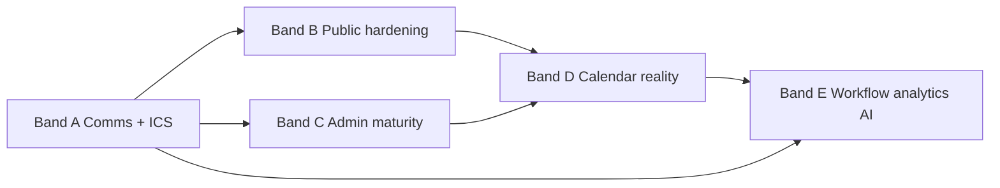

# Tour Scheduling Phase 2 — Foundation (Audit, Doctrine & Implementation Plan)

**Status:** **Band A complete** (May 2026). Planning audit + Band A implementation (Batches 1–6). **Closeout:** [`tour_scheduling_phase2_band_a_closeout.md`](./tour_scheduling_phase2_band_a_closeout.md).  
**Date:** 2026-05-27 (Band A closeout: 2026-05-27)  
**Supersedes for implementation planning:** [`tour_scheduling_phase_2.md`](./tour_scheduling_phase_2.md) (roadmap sketch retained as sibling; Band B+ tracks remain there).  
**V1 reference:** [`tour_scheduling_v1.md`](./tour_scheduling_v1.md) (shipped, manual QA May 2026).

---

## 1. Sprint purpose

Define **Phase 2 architecture, doctrine, risks, sequencing, and implementation cards** before any code changes. Phase 2 evolves tours from **internal + secret-link booking** into **operational scheduling intelligence**: fewer manual steps, calendar reality (including stakeholder calendar blocking), confirmation/reminder communications, hardened public booking, auditability, reporting readiness, and a path to AI-assisted scheduling — **without violating** Alloy platform boundaries (booking SoT, opportunity CRM SoT, queue preview-only, locked workflow event names).

**Deliverable of this sprint:** This document only. Next implementation prompt should be able to start **Band A** with minimal product middleman, subject to human gates listed in §20.

---

## 2. V1 shipped foundation recap

| Layer | Role | V1 state |
|-------|------|----------|
| **`tour_bookings`** | Scheduling source of truth | Shipped — `start_at`, `end_at`, IANA `timezone`, `status_key`, `location_id`, provenance (`source`, form/link FKs), cancel audit fields |
| **`tour_availability_rules`** | Data-driven recurring availability | Shipped — DOW + wall times, slot duration/buffer, `max_bookings_per_slot`, `approval_required`, optional `location_id` / `user_id` |
| **`tour_public_booking_links`** | Token-scoped public booking | Shipped — hashed token, org/opportunity/location scope, optional `expires_at`, `is_active` |
| **`opportunities`** | CRM lifecycle SoT | Shipped — `status_key` via `validateStatusTransition` + `updateOpportunityStatusWithEvent` |
| **`opportunities.metadata.tour_date` / `tour_time`** | Compatibility mirror | Shipped — written on confirm/reschedule mirror paths; **not** cleared on cancel (V1) |
| **Queue rows** | Preview / selection only | Shipped — enrichment may read active `tour_bookings`; Needs Attention still uses `metadata.tour_date` for `tour_scheduled` |
| **Workflow events** | Audit + workflow fan-out | Shipped — locked types on `entity_type = tour_bookings`; **no** `tour_scheduled` as `event_type` |
| **Operator UX** | Schedule / lifecycle | Shipped — inquiry “Tour date” row + header modal + lifecycle bar; standalone `tour_scheduling` drawer section **suppressed** |
| **Public UX** | V1-basic page | Shipped — `/tour-booking/[token]` + resolve/slots/book APIs; in-process rate limits |

**Explicit V1 non-ship (unchanged):** external calendar sync; tour confirmation/reminder comms; ICS invites; AI slot suggestions; distributed rate limits / CAPTCHA; branded public marketing site; configurable per-org status mapping (hardcoded constants today); mirror repair jobs; resource/room capacity beyond `max_bookings_per_slot`.

---

## 3. Current implementation audit

### 3.1 Schema (`docs/supabase/reference/*.csv`, migrations)

**Tables (all org-scoped, RLS enabled, `anon` revoked on tour tables):**

| Table | Purpose | Notable constraints / indexes |
|-------|---------|------------------------------|
| **`tour_availability_rules`** | Recurring bookable windows | `day_of_week` 0–6; `end_time > start_time`; `max_bookings_per_slot > 0`; location org trigger |
| **`tour_bookings`** | Scheduling SoT | `status_key` CHECK (`requested`, `pending_approval`, `confirmed`, `rescheduled`, `canceled`, `completed`, `no_show`); `source` CHECK; **`ux_tour_bookings_one_active_non_terminal_per_opportunity`** partial unique on `(org_id, opportunity_id)` for active statuses; org-integrity trigger (opportunity, location, form FKs, reschedule parent) |
| **`tour_public_booking_links`** | Public tokens | **`ux_tour_public_booking_links_token_hash`**; scope trigger (opportunity + location org match) |

**Migrations (authoritative):**

- `supabase/migrations/20260511143000_tour_scheduling_v1_foundation.sql`
- `supabase/migrations/20260512140000_tour_public_booking_links.sql`
- Drawer/layout seeds: `20260513103000_childcare_opportunity_drawer_append_tour_scheduling.sql`, `20260513140000_opportunity_drawer_remove_tour_scheduling_section.sql`

**RLS pattern:** `*_select/insert/update/delete_by_org_role` for `authenticated`; `*_all_service_role` for `service_role`. Public routes use **service role server-only** (`createServiceRoleClient`).

**Not present in schema:** tour reminder schedules, calendar connection tables, blackout/exception tables, ICS artifact storage, tour-specific audit table, single-use link consumption column, staff calendar busy cache.

### 3.2 Core libraries (`web/lib/tours/`)

| Module | Responsibility |
|--------|----------------|
| `constants.ts` | Blocking statuses, active statuses, **locked** `TOUR_LIFECYCLE_EVENT_TYPES`, `TOUR_BOOKING_ENTITY_TYPE` |
| `bookings/tourBookingService.ts` | create, confirm, reschedule, cancel, complete, no-show; slot validation; opportunity integration + events |
| `events/tourLifecycleEvents.ts` | `emitEvent` + `executeWorkflowRun` fan-out for matching `workflows` rows |
| `opportunity/tourBookingOpportunityIntegration.ts` | Mirror + hardcoded `TOUR_BOOKING_OPPORTUNITY_STATUS`; **cancel is no-op** for opportunity |
| `availability/computeAvailableTourSlots.ts` | Rules + blocking `tour_bookings` only — **no external busy times** |
| `public/resolveTourPublicBookingLink.ts` | Token hash resolve; honors `expires_at`, `is_active` |
| `public/tourPublicRateLimit.ts` | **In-memory** per-process limits (`resolve`/`slots` 120/min, `book` 30/min) |
| `public/tourPublicSlotsWindow.ts` | Max **45-day** public slot query span |
| `queue/opportunityQueueTourPreview.ts` | Booking-backed preview over metadata when booking present |

### 3.3 Admin API routes (`web/app/api/admin/tours/`)

| Method / path | Behavior |
|---------------|----------|
| `GET/POST` `availability-rules` | List/create rules (`getAdminContextCached`, org-scoped) |
| `PATCH/DELETE` `availability-rules/[ruleId]` | Update/delete rule |
| `GET` `slots` | Computed slots for org/location/date range |
| `POST` `bookings` | Create booking (documents queue non-authority) |
| `POST` `bookings/[id]/confirm` | pending → confirmed |
| `POST` `bookings/[id]/reschedule` | Time/location change + events |
| `POST` `bookings/[id]/cancel` | Cancel + `tour_canceled` (no opportunity rewind) |
| `POST` `bookings/[id]/complete` | → `tour_completed` + opp `tour_completed` |
| `POST` `bookings/[id]/no-show` | → `tour_no_show` + opp `tour_no_show` |
| `GET` `opportunities/[opportunityId]/bookings` | List bookings for drawer/hooks |
| `POST` `public-booking-links` | Mint link (`expires_at` optional); returns plaintext token once |

**Auth:** `requireAdminOrOps` + `getAdminContextCached` on admin tour routes (pattern per route files).

### 3.4 Public API routes

| Route | Notes |
|-------|-------|
| `GET /api/public/tour-booking/[token]/resolve` | Limited labels; org-scoped queries; rate limited |
| `GET .../slots` | Window guard + rate limit |
| `POST .../book` | Creates via `createTourBooking`; generic errors on failure |

**Page:** `web/app/tour-booking/[token]/page.tsx` + `TourBookingPublicClient.tsx` — functional but minimal (21-day default slot fetch, basic list UI, limited a11y/branding).

### 3.5 Operator UI

| Surface | Path / component | Notes |
|---------|------------------|-------|
| Availability settings | `web/app/adminV2/settings/tours/availability/` | CRUD table form (`TourAvailabilitySettingsClient`) |
| Inquiry tour date | `OpportunityInquiryTourDateBlock`, `OpportunityTourBookingLifecycleBar` | Booking-backed readout; lifecycle actions |
| Schedule modal | `OpportunityTourScheduleActionModal`, `OpportunityTourSlotSchedulePanel` | Slot picker → admin APIs |
| Legacy metadata tour | `ScheduleTourActionFormModal` | Still tied to enrollment **`schedule_tour`** action / metadata + `opportunity_schedule_tour_followup` workflow — **parallel path**; Phase 2 should not expand metadata-only scheduling |
| Suppressed layout section | `OpportunityTourDrawerSection` | `tour_scheduling` key exists but overview section filtered in drawer |

### 3.6 Workflow event emission

**Emitter:** `emitTourBookingLifecycleEvent` → `workflow_events` with `entity_type = tour_bookings`, `entity_id = booking.id`.

**Locked `event_type` values (do not add without governance):**  
`tour_requested`, `tour_booking_pending`, `tour_confirmed`, `tour_rescheduled`, `tour_canceled`, `tour_no_show`, `tour_completed`.

**Opportunity status events:** `opportunity_status_changed` only via `updateOpportunityStatusWithEvent` when `status_key` changes (confirm/complete/no-show paths).

**Existing enrollment workflow (different contract):** `opportunity_schedule_tour_followup` on **`opportunities`** (migration `20260430217000_enrollment_schedule_tour_workflow.sql`) — metadata/form driven, **not** subscribed to `tour_confirmed` today. Phase 2 may add **new** workflows on tour events but must not rename locked tour events or use `tour_scheduled` as `event_type`.

**Repo search:** No seeded workflows in migrations subscribing to `tour_confirmed` etc. — fan-out works if org enables workflows in DB.

### 3.7 Communications touchpoints (tours today)

| Capability | Tour integration |
|------------|------------------|
| `enqueueCanonicalOutboundMessage` / `executeCommunicationsSend` | **Not called** from tour booking service |
| `communication_scheduled_sends` + `processDueCommunicationScheduledSends` | Exists for Task Assist; **no tour reminder model** |
| Workflow `send_message` | Generic; could be wired via new workflows on tour events — **not wired in V1** |
| Enrollment packet email path | Separate product path; pattern reference for canonical enqueue |

**Gap:** No confirmation email on public book, no reminder schedule, no reschedule/cancel templates, no quiet hours, no tour-specific template registry.

### 3.8 Status mapping & mirror behavior (actual code)

**Hardcoded opportunity targets** (`TOUR_BOOKING_OPPORTUNITY_STATUS`):

- Confirm / reschedule mirror → `tour_scheduled` + metadata mirror from booking wall time
- Complete → `tour_completed`
- No-show → `tour_no_show`
- **Cancel → no opportunity update** (`kind === "canceled"` returns early)

**Mirror:** `deriveTourMetadataMirrorFromBooking` uses booking `start_at` + IANA `timezone` only.

**Queue / Needs Attention:** `QueueService` uses `metadata->>tour_date` for `tour_scheduled` “tour date passed” branches; optional batch fetch of active `tour_bookings` for `_tour_context` / `_tour_queue_display` (preview only).

### 3.9 Tests (V1 coverage)

`web/tests/tours/` — 12 files including `tourBookingService`, `tourLifecycleEvents`, `tourBookingOpportunityIntegration`, public hardening (`tourCard8`), queue preview, batch A/B. **No tests** for comms, calendars, or distributed limits.

### 3.10 Gaps / risks (audit summary)

| Risk | Severity | Notes |
|------|----------|-------|
| No tour comms | High | Parents/operators get no automated confirmation/reminder |
| Cancel leaves stale mirror + `tour_scheduled` status | Medium | Queue attention uses mirror date; operator confusion |
| Non-transactional booking + opportunity updates | Medium | Partial failure could desync mirror vs booking |
| In-memory public rate limits | Medium | Weak under multi-instance / abuse |
| No external calendar / ICS | High for Phase 2 goal | Staff time not blocked on calendars |
| Legacy metadata `schedule_tour` path | Medium | Two scheduling paths until deprecated |
| No workflow templates for tour events | Low–Med | Events emit but few default automations |
| `expires_at` without single-use | Low | Link reusable until expired/disabled |
| Mirror drift over time | Medium | No repair job |

---

## 4. Phase 2 product goals

1. **Operational comms** — confirmation, reminders, reschedule/cancel/no-show notifications via Communications V1 (canonical enqueue), timezone-aware scheduling, deduplicated reminders.
2. **Calendar reality** — generate ICS/calendar invites on confirm/reschedule; read external busy times for conflict-aware slots; block stakeholder calendars (doctrine: Alloy booking remains SoT unless explicit future two-way policy).
3. **Public booking maturity** — accessible picker, branding, parent confirmation email, add-to-calendar, stronger abuse controls.
4. **Admin scheduling maturity** — exceptions/blackouts, preview generated slots, overlap warnings, holiday library (config-driven).
5. **Lifecycle automation** — configurable booking → opportunity mapping; post-tour workflows/tasks (config, not hardcoded org behavior).
6. **Reporting & AI readiness** — event/hygiene for metrics; later bands for suggestions and risk signals.
7. **Platform hardening** — transactional boundaries where required, mirror repair, audit, distributed limits, workflow observability.

**North-star operator outcome:** A confirmed tour **blocks the right people's calendars** and **notifies families and staff** with minimal manual steps.

---

## 5. Non-goals (Phase 2 foundation scope)

- Replacing **`schedules`** (job-bound) with tours.
- Using **queue rows** to drive booking mutations or comms sends.
- **Pricing / deposits** for tour holds (explicit defer).
- **Full two-way calendar sync** as Phase 2 default (design in Band D; ship read-only + ICS first unless product gate opens write-back).
- **Multi-booking per opportunity** without explicit doctrine + schema change (V1 enforces one active non-terminal).
- **Autonomous AI booking** (suggestions only in Band E; human confirms).
- **Childcare-only hardcoding** in `QueueService` / core booking service (presets/org config only).

---

## 6. Source-of-truth doctrine

### 6.1 Booking source of truth

**`tour_bookings`** is the **only** scheduling authority for enrollment/sales tours: absolute instants (`start_at`, `end_at`), IANA `timezone`, booking `status_key`, `location_id`, provenance. All slot validation, capacity, and “what time is the tour?” answers **must** read from this table (or server modules that read it). **`public.schedules`** is out of scope for tours.

### 6.2 Opportunity lifecycle source of truth

**`opportunities.status_key`** and pipeline metadata remain CRM authority. Booking transitions **may propose** opportunity updates through **`validateStatusTransition`** + **`updateOpportunityStatusWithEvent`** — never by writing queue preview fields or mirror alone.

### 6.3 Metadata mirror lifecycle

**`opportunities.metadata.tour_date` / `tour_time`** are a **compatibility projection** for queues, Needs Attention, legacy actions, and filters.

| Event | Phase 2 default (proposed; gate on cancel semantics) |
|-------|------------------------------------------------------|
| Confirm / firm reschedule | Write mirror from booking wall time (same as V1) |
| Cancel | **Clear mirror** when no other firm booking exists; optional keep for audit in booking row only |
| Complete / no-show | Mirror may remain for historical display; status moves to terminal opportunity keys |
| Public / operator read | If active non-terminal booking exists, **UI readout prefers booking** over mirror (V1 behavior) |

**Repair:** Band E includes backfill job comparing mirror to latest firm booking.

### 6.4 External calendar precedence

**Default (Phase 2):** External calendars are **advisory for availability** and **downstream for blocking** — they do **not** override `tour_bookings` on conflict.

| Situation | Winner |
|-----------|--------|
| Alloy confirmed booking vs external “free” | **Alloy** |
| External busy vs Alloy-generated slot offer | **Hide slot** (advisory busy) unless operator override |
| External cancel vs Alloy booking | **No auto-cancel** in Alloy without explicit two-way policy (Band D future) |
| ICS invite sent | Reflects **Alloy booking** snapshot at send time; updates on reschedule via cancel+new UID strategy (TBD card) |

### 6.5 Calendar invite / ICS ownership

- **Owner of invite content:** Alloy-generated ICS / provider API payload derived from **`tour_bookings`** + org branding config.
- **Organizer / attendee model:** Product gate — typically **location calendar** or **assigned host `user_id`** on rule; store `calendar_event_id` / `ics_uid` on booking `metadata` or child table (Band D).
- **Updates:** Reschedule **updates or replaces** provider event; cancel **cancels** provider event. Idempotency keys per booking version.

### 6.6 Reminder ownership and deduplication

- **Owner:** Server-side **tour_reminder_schedules** (new) or reuse **`communication_scheduled_sends`** with `entity_type = tour_bookings` and typed `metadata.reminder_kind`.
- **Dedup key:** `(org_id, booking_id, reminder_kind, scheduled_for_bucket)` — only one pending send per kind per booking revision (`booking.updated_at` or `reminder_generation` monotonic counter).
- **Cancel/reschedule:** Cancel pending reminders on booking cancel; recompute on reschedule (human gate for “short notice” policy).

### 6.7 Public booking trust model

- **Primary auth:** High-entropy secret token (hashed at rest) scoped to org + opportunity + location.
- **Defense in depth:** Rate limits (distributed in Band B), optional CAPTCHA/PoW (gate), optional `expires_at`, optional **single-use** (`consumed_at` on link or booking) — human gate.
- **Data minimization:** Public resolve returns **labels only**; no PII beyond what marketing needs; org-scoped queries (V1 pattern).
- **Booking integrity:** Server validates slot against rules + capacity; never trust client-selected times without server re-validation (V1).

### 6.8 Timezone source hierarchy

1. **Booking row `timezone`** (IANA) — authoritative for wall mirror and parent-facing comms for that tour.
2. **Rule `timezone`** — slot generation boundary for that rule.
3. **Site/location default** (future config) — suggested when creating rules/bookings only.
4. **Viewer timezone** — display-only in admin/queue previews (`viewerDisplayTimeZoneIana`); **not** for persisting booking instants.
5. **`UTC_FALLBACK_IANA`** — invalid IANA only; log/telemetry when used.

### 6.9 Cancellation / reschedule semantics

- **Reschedule:** Same booking row (V1 in-place time update); emits `tour_rescheduled`; mirror update when firm; reminders/ICS regenerated.
- **Cancel:** `status_key = canceled` + audit fields; emits `tour_canceled`; **Phase 2 proposes** mirror clear + optional opportunity status policy (configurable, not hardcoded).
- **Pending:** Still blocks capacity (V1); comms may differ (requested vs confirmed templates).

### 6.10 Single active booking vs future multi-booking

**V1 / Phase 2 default:** At most **one active non-terminal** booking per opportunity (DB partial unique + service check).  
**Future:** Requires new doctrine, constraint migration, and UI — **human gate** before implementation.

### 6.11 Queue / runtime boundaries

- Queue rows and `_tour_*` preview fields are **non-authoritative**.
- Mutations: **entity GET** or dedicated booking APIs only.
- Workflow payloads should include **`booking_id`** and read fresh row when side effects matter.

### 6.12 Workflow event naming boundaries

- **Do not** add `tour_scheduled` as `workflow_events.event_type` (collides with opportunity `status_key`).
- **Do not** rename locked V1 tour event strings without migration + workflow author communication.
- New side effects prefer **subscribing** to existing tour events or `opportunity_status_changed` — not new synonymous event types.

### 6.13 Communications compliance assumptions

- **SMS:** TCPA/consent — use person-linked recipients via `assertRecipientPersonEligibleForDrawerSms` patterns; org must have binding; **human gate** for marketing vs transactional classification.
- **Email:** CAN-SPAM — transactional tour emails generally allowed; marketing content requires unsubscribe strategy (org-level).
- **Quiet hours:** Org/location policy window suppresses **reminder** sends (not necessarily instant confirmation) — human gate on override for confirm.
- **Templates:** Registry stores versioned bodies with variable contract; no secrets in templates.

### 6.14 Resource-aware scheduling future

Phase 2 **foundation only** in Band C: model **resources** (room, staff) as rule metadata or `tour_scheduling_resources` table; capacity beyond flat `max_bookings_per_slot`. Full optimization in Band E. Evaluator remains **rules + bookings + external busy** — not queue-driven.

---

## 7. Calendar integration doctrine

**Phase 2 staged approach:**

| Stage | Capability | SoT impact |
|-------|------------|------------|
| **2D-1** | ICS file generation + email attachment / download link | None — derived artifact |
| **2D-2** | Google / Microsoft **read** busy for `user_id` on rules | Advisory only |
| **2D-3** | Create/update calendar events on confirm/reschedule (provider API) | Store external ids on booking; Alloy times still SoT |
| **2D-4** | Two-way sync | **Human gate** — conflict matrix required |

**Conflict detection:** Slot engine accepts `external_busy[]` input; slots overlapping busy intervals are suppressed unless `operator_override` flag on admin create.

**Staff blocking:** On `tour_confirmed`, create hold on host calendar(s) defined by rule `user_id` + location policy. Attendees: family email from opportunity primary person when available.

---

## 8. Communications / reminder doctrine

**Channels:** Email + SMS via **`enqueueCanonicalOutboundMessage`** (same as Communications V1). Workflow `send_message` is legacy-parallel — **prefer canonical** for new tour automations.

**Trigger points (proposed):**

| Trigger | Recipients | Notes |
|---------|------------|-------|
| `tour_confirmed` / auto-confirm create | Primary person / contact email & SMS | Confirmation + ICS |
| `tour_booking_pending` | Internal distribution optional | Approval queue comms |
| `tour_rescheduled` | Family + host | Include old/new time |
| `tour_canceled` | Family + host | |
| `tour_no_show` | Family optional follow-up | Gate: marketing vs transactional |
| Reminder offsets | Family | e.g. T-24h, T-2h; timezone = booking TZ |

**Template registry:** Org-scoped keys (`tour_confirmation_email`, `tour_reminder_sms`, …) with variable schema: `booking.*`, `opportunity.*`, `location.*`, `add_to_calendar_url`.

**Implementation note:** Prefer extending **`communication_scheduled_sends`** with `entity_type = tour_bookings` before inventing a parallel queue — unless reminder volume requires dedicated table (card decision).

---

## 9. Public booking doctrine

Build on **`tour_public_booking_links`**:

- **Expiring links:** `expires_at` exists — admin UX + defaults (Band B).
- **Single-use:** Add `consumed_at` or deactivate link on successful book — **human gate**.
- **Post-book:** Parent confirmation email (Band A/B) with ICS.
- **Abuse:** Distributed rate limit + optional CAPTCHA on `book` — **human gate** for CAPTCHA vendor.
- **Branding:** Org-level public page config (logo, colors, copy) — no hardcoded childcare strings in shared components.
- **a11y/mobile:** WCAG-focused picker component; explicit timezone label on every slot.

**Do not** weaken org-scoped label queries or return cross-tenant data on resolve.

---

## 10. Admin scheduling doctrine

- **Rules editor:** Copy rule, template packs (vertical seed), inline validation preview (Band C).
- **Exceptions / blackouts:** Date-scoped tables or rule `metadata.exceptions[]` — prefer **first-class blackout table** if reporting needs it (card).
- **Holiday library:** Org opt-in federal/regional sets → blackout generator.
- **Overlap warnings:** Client-side + server-side on rule write (same location/DOW/time overlap).
- **Preview slots:** Admin-only endpoint reusing `computeAvailableTourSlots` with “what-if” rule payload.
- **Capacity:** Extend rules with `resource_id` or metadata keys before hardcoding room logic in engine.

---

## 11. Workflow / lifecycle doctrine

- **Configurable status map:** Replace hardcoded `TOUR_BOOKING_OPPORTUNITY_STATUS` with org/vertical policy document (table or `org_integration_policies` JSON) — **human gate** on default seeds for childcare.
- **Post-tour:** Workflows on `tour_completed` for tasks, enrollment packet prompt — use existing **`operational_tasks`** / forms patterns.
- **Cancel behavior:** Policy flags: `clear_mirror`, `suggest_status`, `no_op` (V1 = no_op on opportunity).
- **Legacy `schedule_tour` action:** Deprecate in favor of booking modal; keep read compatibility for metadata-only rows.

---

## 12. Reporting / analytics doctrine

**Metrics definitions (warehouse-friendly):**

| Metric | Numerator / denominator | Source |
|--------|-------------------------|--------|
| Tour scheduled rate | Opportunities with ≥1 firm booking / eligible inquiries | `tour_bookings` + `opportunities` |
| Completion rate | `completed` / firm bookings past `end_at` | `tour_bookings.status_key` |
| No-show rate | `no_show` / eligible past tours | `tour_bookings` |
| Tour → enrollment conversion | `enrolled` opportunities with prior `tour_completed` | opportunities + bookings join |
| Time-to-tour | `start_at - opportunity.created_at` | bookings |
| Breakdowns | `source`, `location_id`, program metadata | booking + opportunity |

**Do not** compute KPIs from queue JSON alone. Emit **telemetry** on comms send/skipped/reminder_deduped for observability.

---

## 13. AI scheduling doctrine

**Band E — advisory only:**

- Rank available slots by lead priority, staff load, historical conversion (when data exists).
- No-show risk **labels** on drawer (non-blocking).
- Anomaly flags (e.g. completed tour + no progression) → BOS/attention, not auto status change.
- All AI outputs require **human selection** to call `createTourBooking` / reschedule APIs.

---

## 14. Platform hardening doctrine

- **Transactional bundles:** When product requires, wrap `tour_bookings` update + opportunity patch + reminder schedule creation in a single DB transaction (service-role RPC or Postgres function) — card-level decision.
- **Mirror repair:** Cron/job: per org, compare firm bookings to metadata mirror; fix or report.
- **Audit:** Use `adminAuditLog` pattern or `workflow_events` paper trail; add explicit `tour_booking_mutation` audit entries for admin/public actions.
- **Rate limits:** Move public limits to Redis/Upstash or edge — **human gate** on vendor.
- **Workflow observability:** Log `executeWorkflowRun` failures with `event_type` + `booking_id` tags (existing warn path in `tourLifecycleEvents`).

---

## 15. Resource-aware scheduling future

**Phase 2C foundation:** Introduce optional `resource_key` on rules/bookings metadata → engine groups capacity by `(location_id, resource_key, slot_start)`. **Phase 2E:** AI load-balances across resources. Do not conflate with **waitlist placement** (`placement_candidates`) — separate domains.

---

## 16. Risk register

| ID | Risk | Mitigation |
|----|------|------------|
| R1 | Calendar two-way conflicts | Advisory read first; explicit precedence doc (§6.4) |
| R2 | SMS compliance violation | Person eligibility checks; org consent flags; legal review gate |
| R3 | Reminder duplicate spam | Dedup keys + cancel on reschedule (§6.6) |
| R4 | Mirror/status drift | Repair job + cancel clear policy |
| R5 | Public abuse | Distributed limits + CAPTCHA gate |
| R6 | Dual scheduling paths (metadata vs booking) | Deprecation plan for `schedule_tour` metadata writes |
| R7 | Non-transactional multi-write | Transaction card in Band A/E |
| R8 | Workflow event sprawl | Locked names; subscribe don’t rename |
| R9 | Childcare hardcoding | Presets + org policy tables |
| R10 | Multi-instance rate limit bypass | Band B infra |

---

## 17. Open decisions

| # | Decision | Options | Default recommendation | Gate |
|---|----------|---------|------------------------|------|
| D1 | Cancel mirror + opportunity status | Clear mirror only / rewind status / no-op | Clear mirror; status no-op unless org policy | Human |
| D2 | Reminder storage | `communication_scheduled_sends` vs `tour_reminder_schedules` | Reuse scheduled sends first | Eng |
| D3 | ICS UID strategy on reschedule | Same UID update vs cancel+new | Provider-specific card | Human |
| D4 | Calendar read scope | Per-host user vs shared site calendar | Per `tour_availability_rules.user_id` | Human |
| D5 | Single-use public links | Burn on book vs N attempts | Burn on successful book | Human |
| D6 | CAPTCHA | None vs Turnstile vs hCaptcha | Turnstile on `book` only | Human |
| D7 | Configurable status map storage | JSON org setting vs dedicated table | Table for auditability | Human |
| D8 | Confirmation on `pending_approval` | Notify on pending vs only on confirm | Both templates | Product |
| D9 | Multi-booking | Stay single vs siblings parallel | Stay single in Phase 2 | Human |
| D10 | TCPA classification | Transactional vs marketing SMS copy | Separate templates; legal review | Human |

---

## 18. Phase sequencing

| Order | Band | Rationale |
|-------|------|-----------|
| **1** | **A — Communications + reminders + ICS** | Highest operator/parent value; uses existing Communications V1; unblocks calendar invites as attachments |
| **2** | **B — Public hardening** | Abuse + UX before scaling link distribution |
| **3** | **C — Admin maturity** | Parallel-friendly; reduces bad rules before external calendar reads |
| **4** | **D — Calendar reality** | Depends on ICS/comms patterns from A; needs D1–D4 decisions |
| **5** | **E — Workflow config + analytics + AI** | Needs stable events, comms telemetry, clean data |

**Recommended first implementation band:** **Band A**.

---

## 19. Implementation card plan

Cards are **dependency-ordered**; each card should ship with tests + doc updates per `operating-doctrine.md`.

### Band A — Communications + Reminder Foundation

| Card | Title | Scope |
|------|-------|-------|
| A1 | Tour comms doctrine + template variable contract | Doc + types; template keys registry shape |
| A2 | Org tour comms settings | Per-org/per-location: enable channels, quiet hours, default offsets |
| A3 | Template registry CRUD | Store bodies for email/SMS keys; validation of variables |
| A4 | Reminder schedule model | Create/cancel schedules on booking lifecycle; dedup |
| A5 | Confirmation notifications | On `tour_confirmed` (+ optional pending); canonical enqueue |
| A6 | Reminder processor wiring | Hook `processDueCommunicationScheduledSends` or dedicated worker |
| A7 | Reschedule/cancel notifications | Family + host templates |
| A8 | No-show follow-up | Single optional send; gate template |
| A9 | ICS generation | `text/calendar` VEVENT from booking; attach to confirmation |
| A10 | Add-to-calendar public/admin links | Signed URL or data URI policy |
| A11 | Comms audit + telemetry | `metadata.source=tour_*`, dedup metrics, failure logs |

**Band A exit:** Confirm tour → parent receives confirmation email with add-to-calendar links; reminder fires once per offset via `communication_scheduled_sends`; reschedule cancels old reminders. **Default off** until org enables `metadata.tour_comms.enabled`.

**Band A shipped (Batches 1–6):** Config/types, template rendering, ICS/add-to-calendar helpers, reminder scheduling + quiet hours, orchestrator + booking hooks, process-due tour metadata passthrough. See [`tour_scheduling_phase2_band_a_closeout.md`](./tour_scheduling_phase2_band_a_closeout.md) (canonical closeout) and [`tour_scheduling_phase2_band_a_readiness.md`](./tour_scheduling_phase2_band_a_readiness.md) § Band A closeout (implementation detail).

**Not shipped in Band A:** External calendar OAuth, two-way sync, public booking redesign, host/internal notifications, ICS download API routes, settings UI for templates/config.

### Band B — Public Booking Hardening

| B1 | Distributed rate limits | Redis/edge; preserve generic errors |
| B2 | Single-use / expiring links | `consumed_at` migration; admin UX |
| B3 | Public calendar picker v2 | a11y, mobile, TZ labels |
| B4 | Branded public page | Org config-driven chrome |
| B5 | CAPTCHA on book | Feature flag + server verify |
| B6 | Parent confirmation UX | Post-book screen + email trigger (may overlap A5) |

### Band C — Admin Scheduling Maturity

| C1 | Rule editor v2 | Copy rule, templates, validation |
| C2 | Blackout / exception dates | Schema + engine filter |
| C3 | Holiday closure library | Seed + apply blackouts |
| C4 | Overlap detection | Warn on conflicting rules |
| C5 | Preview generated slots | Admin what-if UI |
| C6 | Resource/capacity foundation | metadata or resource table |

### Band D — Calendar Reality

| D1 | ICS invite send via provider | Google/Microsoft send API design spike |
| D2 | External busy read model | Cache busy intervals per user |
| D3 | Engine integration | Feed busy into slot computation |
| D4 | Conflict detection + operator override | Admin API flag |
| D5 | Create/update calendar event on confirm/reschedule | Store `calendar_event_id` |
| D6 | Two-way sync future doc | Conflict matrix only unless D gate opens |

### Band E — Workflow + Analytics + AI

| E1 | Configurable status mapping | Replace hardcoded constants |
| E2 | Post-tour workflow recipes | Seed optional `tour_completed` workflows |
| E3 | Auto follow-up tasks | `operational_tasks` creation |
| E4 | Reporting views / export hooks | SQL or API for metrics §12 |
| E5 | Mirror repair job | Batch fix drift |
| E6 | Transactional mutation RPC | Optional bundle writes |
| E7 | AI best-slot suggestions | Advisory API |
| E8 | No-show risk heuristics | Drawer badge |
| E9 | Anomaly detection | Attention integration |

---

## 20. Cursor autonomy rules

### Safe for Cursor autonomous batching

- Documentation updates (`docs/system/*`, sprint records) when behavior changes.
- UI polish (picker a11y, admin preview surfaces, branded public CSS variables).
- Reminder worker **scaffolding** after §6.6–§8 doctrine locked (tables, types, tests with mocks).
- Template registry wiring to existing communications tables.
- ICS generation (pure functions + unit tests).
- Audit logging and telemetry fields.
- Rate limit adapter behind feature flag.
- Vitest coverage for pure slot/reminder logic.
- Admin “preview slots” read-only endpoint.

### Requires human / product gate

- Lifecycle **status semantics** on cancel (D1, D7).
- External calendar **write-back** and conflict winner (D3–D4, §6.4).
- New **`workflow_events.event_type`** names or renames.
- **SMS compliance** classification and copy (D10).
- **Two-way sync** behavior (Band D6).
- **Multi-booking** support (D9).
- **CAPTCHA** vendor and UX (D6).
- **Single-use** link policy (D5).
- **Pricing/deposit** logic.
- Changing default **childcare** status map for all orgs.
- Deprecating **`schedule_tour`** metadata path without operator comms plan.

---

## 21. Acceptance gates

**Planning doc (this sprint) complete when:**

- [x] Reflects current code/schema (§3 audit).
- [x] Clearly separates shipped V1 vs Phase 2.
- [x] Defines SoT boundaries (§6).
- [x] Sequences bands (§18).
- [x] Lists implementation cards (§19).
- [x] Cursor autonomy + human gates (§20).

**Phase 2 implementation complete (future) when:**

- Band A acceptance in §19 met in staging.
- No regression: `tour_bookings` remains scheduling SoT; queues preview-only.
- `npx tsc --noEmit` + targeted `vitest run tests/tours/` + comms tests green.
- `export:supabase-schema` run after migrations.
- Manual QA: book → confirm → receive confirmation + ICS → reminder fires → reschedule updates comms + calendar artifact.

---

## 22. QA plan

### Automated

- `cd web && npx tsc --noEmit`
- `cd web && npx vitest run tests/tours/`
- New: `tests/tours/tourComms*.test.ts`, `tests/tours/ics*.test.ts` (Band A)
- Contract tests: reminder dedup, cancel clears schedules, public rate limit (Band B)

### Manual — Band A (priority)

**Staging QA checklist** (full steps in [`tour_scheduling_phase2_band_a_closeout.md`](./tour_scheduling_phase2_band_a_closeout.md) and [`tour_scheduling_phase2_band_a_readiness.md`](./tour_scheduling_phase2_band_a_readiness.md) § Band A closeout):

1. Apply migration `20260527150000_tour_scheduling_comm_scheduled_sends_source.sql`.
2. Enable `org_settings.metadata.tour_comms.enabled = true` for test org; keep SMS disabled initially.
3. Confirm a tour booking → verify confirmation `communication_messages` row and reminder `communication_scheduled_sends` rows.
4. Reschedule → verify reschedule notification + reminder replacement (old pending rows canceled).
5. Cancel → verify cancel notification + pending reminder cancellation.
6. Run process-due cron or `POST /api/admin/communication-scheduled-sends/process-due` → verify reminder enqueues with `metadata.source = tour_scheduling` (not Task Assist).
7. Retry orchestration / process-due → no duplicate immediate sends (idempotency key).
8. Disable `tour_comms.enabled` → confirm no new sends/reminders.

**Acceptance scenarios:**

1. Admin confirms tour → opportunity `tour_scheduled` + mirror updated.
2. Parent receives confirmation email with correct site-local time + Google/Outlook add-to-calendar link (not ICS attachment).
3. Reminder sends at configured offset; second cron pass does not duplicate.
4. Reschedule updates notification; old reminder canceled.
5. Cancel sends cancel notification; mirror policy per D1 decision.
6. Pending approval path: no parent reminders until confirm (default).

### Manual — Band B

1. Expired/consumed link returns generic error.
2. Rate limit returns 429 + `Retry-After` under load test.
3. Public picker usable on mobile VoiceOver/NVDA smoke.

### Manual — Band D (when scheduled)

1. Host calendar shows hold after confirm.
2. External busy hides conflicting slots.
3. Alloy booking wins when external shows free but slot taken in Alloy.

### Regression guards

- Grep: no `event_type.*tour_scheduled` in workflow event emitters.
- Queue mutation tests still pass without booking writes from queue payloads.
- Entity GET shows booking-backed tour time after confirm.

---

## References

| Doc | Use |
|-----|-----|
| [`tour_scheduling_v1.md`](./tour_scheduling_v1.md) | Shipped V1 contract |
| [`tour_scheduling_phase_2.md`](./tour_scheduling_phase_2.md) | Original roadmap sketch |
| [`docs/system/entity-model.md`](../../system/entity-model.md) | Tour vs schedules |
| [`docs/system/record-system.md`](../../system/record-system.md) | Queue vs entity GET |
| [`docs/system/workspace-system.md`](../../system/workspace-system.md) | Queue preview doctrine |
| [`docs/system/actions-and-workflows.md`](../../system/actions-and-workflows.md) | Events + workflows |
| [`docs/product/communications.md`](../../product/communications.md) | Canonical comms path |
| [`docs/execution/roadmap-and-gaps.md`](../../execution/roadmap-and-gaps.md) | Program priority |

**Primary code map:** `web/lib/tours/**`, `web/app/api/admin/tours/**`, `web/app/api/public/tour-booking/**`, `web/components/admin/opportunity/tours/**`.
