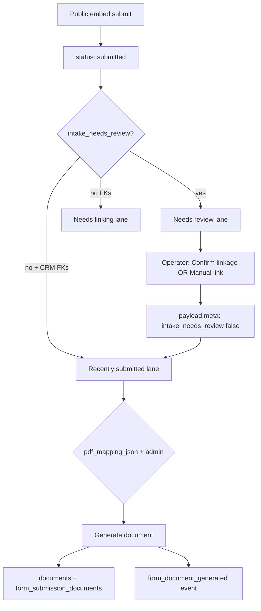

# Forms Runtime Test 2 — Submission review / finalize lifecycle

**Status:** Ready for manual QA (audit complete · May 2026)  
**Scope:** Operator-side review/finalize loop for a **single standalone submission** after external intake. No new features.

**Depends on:** [Runtime Test 1](./forms_runtime_test_1_external_intake_opportunity.md) (Test 1C/1D fixtures on Alloy Bend staging).

**Related:** [forms-intake-runtime-phase.md](../system/forms-intake-runtime-phase.md) · [forms-intake-runtime-validation.md](../system/forms-intake-runtime-validation.md)

---

## Step 1 — Current runtime capability (audit)

### Operator surfaces

| Surface | Path | Component / API |
|---------|------|-----------------|
| **Submission review (case file)** | `/adminV2/forms/{formId}/submissions/{submissionId}` | `FormSubmissionDetailClient` → `SubmissionIntakeCaseFileContent` |
| **Intake hub / lanes** | `/adminV2/forms` | `IntakeWorkspaceHubView` — lanes from `resolveSubmissionInboxLane` |
| **Confirm linkage** | `POST /api/admin/forms/submissions/{id}/confirm-linkage` | Admin or ops role |
| **Correct linkage** | `POST /api/admin/forms/submissions/{id}/manual-link` | Admin only |
| **Generate document** | `POST /api/admin/forms/submissions/{id}/generate-document` | Admin only; stub PDF via `pdf_mapping_json` |

There is **no** separate `finalized` submission status. Recipient submit → `status = submitted` (immutable answers). Operator “finalize” is a **two-step operational loop**: (1) clear intake review / confirm linkage, (2) generate document when policy allows.

### Lifecycle flow (standalone submission)



**Not in scope for Test 1C/1D:** packet session advance, `operator_review_status` on `form_packet_sessions` (packet path uses `PATCH …/packet-sessions/{id}/review`).

### Answers to audit questions

1. **What happens when an operator reviews a submission?**  
   Operator opens the **Intake review** case file. UI shows lifecycle headline, entity connection rows, intake section, linkage callout (when doc gen blocked), optional **Confirm record linkage**, optional **Correct linked records** (CRM search / UUID paste), read-only **FormEngineRenderer** answers, signatures, technical panel (link metadata debug), and **Generate document** when unblocked. Review is **read + confirm/correct linkage + optional PDF** — not editing captured answers.

2. **What changes state?**  
   | Action | DB changes |
   |--------|------------|
   | **Confirm linkage** | `payload.meta` only: `intake_needs_review: false`, `intake_review_result: "confirmed"`, `intake_reviewed_at`, `intake_reviewed_by`, `intake_resolution_review: "review_confirmed"`. CRM FK columns unchanged. |
   | **Manual link** | CRM FK columns + `payload.meta`: `intake_needs_review: false`, `intake_review_result: "corrected"`, `intake_resolution_path: "manually_linked"`, reviewer stamps. |
   | **Generate document** | New or reused `documents` row, `form_submission_documents` junction (`role: generated_pdf`), storage upload (stub bytes). Submission row unchanged except via reload of linked docs. |
   | **Void** (out of Test 2) | `status → void` only allowed transition from submitted. |

   Captured answers (`payload.values`, `payload.signatures`) remain immutable per trigger `enforce_form_submissions_submitted_immutability`.

3. **What marks a submission “finalized”?**  
   - **Recipient-side:** `status = submitted` + `submitted_at` (already true after embed submit).  
   - **Operator-side:** No persisted `finalized` flag. Operational completion is **derived**: `intake_needs_review === false` + CRM attach parent exists + optional linked document. UI `readyToFinalize` (`submissionIntelligencePresentation.ts`) = recently submitted lane + doc gen unblocked + no missing requirements.

4. **Are review actions persisted?**  
   **Yes, in `payload.meta`** (reviewer user id, timestamp, result). **No** dedicated audit-log table write or `workflow_events` row on confirm-linkage / manual-link today.

5. **Are workflow events emitted?**  
   | Event | When |
   |-------|------|
   | `form_submitted` | Public (or admin) final submit — **already fired for Test 1C/1D** |
   | `form_signed` | Submit when signature rows inserted |
   | `form_document_generated` | First successful **Generate document** (skipped if idempotent reuse) |
   | *(none)* | Confirm linkage / manual link |

6. **Does finalize affect packets/sessions?**  
   **No** for standalone submissions (Test 1C/1D). Packet submits additionally run `advancePacketSessionAfterSubmit`, session CRM snapshot sync, and optional `form_packet_completed` — not applicable here.

7. **What queues/lanes change after operator review?**  
   Inbox resolver (`resolveSubmissionInboxLane`): clearing `intake_needs_review` moves row from **Needs review** → **Recently submitted** (when CRM FKs present). **Generate document** does not change inbox lane. Opportunity queue placement is unchanged by review — opportunity was created at submit time (Test 1C).

---

## Step 2 — Prepared review test path (Test 1C primary)

Use **Test 1C** — only submission still in **Needs review** after intake.

| Item | Value |
|------|-------|
| **Org** | Alloy Bend `7803388d-cdee-4afb-89cf-23a137f39423` |
| **Form** | `e68e0160-3157-44fd-b207-2c0f14d1764f` |
| **Submission** | `c5e2e078-97ee-4e17-9d66-1527a9f0c46b` |
| **Opportunity** | `d8452586-23ea-4862-894c-9f500f390f70` |
| **Test identity** | `forms-test-002@example.com` · child Daffy Duck |

### Exact URL

```
http://localhost:3000/adminV2/forms/e68e0160-3157-44fd-b207-2c0f14d1764f/submissions/c5e2e078-97ee-4e17-9d66-1527a9f0c46b
```

(Replace host for staging/production.)

### Pre-conditions (expected before operator action)

| Check | Expected |
|-------|----------|
| `form_submissions.status` | `submitted` |
| `payload.meta.intake_needs_review` | `true` |
| `payload.meta.intake_resolution_path` | `created_records` |
| `payload.meta.intake_opportunity_match` | `created` |
| CRM FKs on submission | person, customer, customer_member, opportunity populated |
| Hub lane | **Needs review** |
| Generate document button | **Disabled** — blocked until linkage confirmed |
| `form_submitted` event | Present from original submit (not re-emitted on review) |

### Expected review actions (in order)

1. **Open case file** — verify Records connected (4 green links), intake section, linkage callout with review reason (new person / auto-created member).
2. **Confirm record linkage** — primary CTA `data-testid="confirm-linkage-primary"`. Requires **admin or ops** role.
3. **Generate document (PDF stub)** — after confirm; requires **admin** role. Medication demo published version includes `pdf_mapping_json`.

**Optional regression (Test 1D):** submission `50ac6911-5887-4934-9ae8-a221d61f81f6` is already **Recently submitted** (`intake_needs_review: false`) — skip confirm, test generate-only path.

### Expected state transitions

| Step | `payload.meta` | Inbox lane | Doc gen |
|------|----------------|------------|---------|
| Start (1C) | `intake_needs_review: true` | Needs review | Blocked |
| After confirm | `intake_needs_review: false`, `intake_review_result: confirmed`, `intake_reviewed_at/by` set | Recently submitted | Unblocked |
| After generate | unchanged meta | Recently submitted | Linked doc count ≥ 1 |

Submission `status` stays **`submitted`** throughout. Opportunity row **unchanged** by review (already routed at submit).

### Expected events / side effects

| Step | Side effect |
|------|-------------|
| Confirm linkage | None on `workflow_events`; meta stamps only |
| Generate document | `documents` row; `form_submission_documents`; **`form_document_generated`** with `document_id` + opportunity/person FKs in payload |
| Packet/session | None |

---

## Step 3 — Manual test checklist

### A. UI walkthrough

- [ ] Open submission URL as **admin**
- [ ] Header shows **Intake review** + breadcrumbs (Form → Submissions → Review)
- [ ] **Records connected** — Person, Customer, Member, Opportunity show Linked + Open drawer works
- [ ] **Intake & record linking** — status reflects needs review; technical panel shows link metadata debug
- [ ] **Record linkage review** — Confirm panel visible; reason text explains auto-created records
- [ ] Click **Confirm record linkage** — success, no error toast
- [ ] Confirm CTA disappears; Generate document enables
- [ ] Click **Generate document (PDF stub)** — success message with document id
- [ ] **Documents & PDF** section lists linked document; open from drawer if wired

### B. Hub / lane

- [ ] `/adminV2/forms` → filter or scan lanes — Test 1C submission moves **Needs review** → **Recently submitted**

### C. Database verification (psql)

```sql
-- Submission meta after confirm + generate
SELECT id, status, person_id, opportunity_id,
       payload->'meta'->>'intake_needs_review' AS needs_review,
       payload->'meta'->>'intake_review_result' AS review_result,
       payload->'meta'->>'intake_reviewed_by' AS reviewed_by
FROM form_submissions
WHERE id = 'c5e2e078-97ee-4e17-9d66-1527a9f0c46b';

-- Linked document
SELECT fsd.document_id, fsd.role, d.name, d.status
FROM form_submission_documents fsd
JOIN documents d ON d.id = fsd.document_id
WHERE fsd.form_submission_id = 'c5e2e078-97ee-4e17-9d66-1527a9f0c46b';

-- Workflow events (submit already present; document after generate)
SELECT event_type, entity_id, created_at, payload->>'document_id' AS document_id
FROM workflow_events
WHERE org_id = '7803388d-cdee-4afb-89cf-23a137f39423'
  AND entity_type = 'form_submissions'
  AND entity_id IN ('c5e2e078-97ee-4e17-9d66-1527a9f0c46b')
ORDER BY created_at;
```

### D. Pass criteria

- [ ] Confirm linkage clears review flag without breaking FKs
- [ ] Lane moves to Recently submitted
- [ ] Generate document succeeds (mapping present)
- [ ] Document junction + `form_document_generated` event recorded
- [ ] Captured answers unchanged after review actions

---

## Step 4 — UX evaluation (audit)

### Strengths (operational, not raw CRUD)

- Case-file layout (`IntakeCaseFileLayout`, `CaseFileSection`) with clear sections
- Guided copy on Confirm vs Correct linkage
- Entity connection rows with drawer deep-links
- Progressive disclosure technical panel (`SubmissionReviewTechnicalPanel`)
- Blocked Generate document with explicit reason (`documentGenerationBlockedByIntake`)
- Read-only form renderer for answers — not JSON dump

### UX gaps (document separately from runtime)

| Gap | Notes |
|-----|-------|
| No explicit “Finalize intake” milestone | Operator must infer completion from lane + doc presence |
| Lifecycle headline stays generic **Submitted** | Does not reflect review confirmed / document generated |
| Role split | Ops can confirm; only admin can generate or manual-link — may confuse mixed-role operators |
| No activity feed on case file | Review stamps live in meta only — not surfaced as timeline |
| BOS assist placeholder | `BosReviewSummaryPlaceholder` — deterministic hints only, not full assist |
| Test 1D path invisible in hub | Recently submitted row skips confirm — good runtime, but operators may not know why |

---

## Remaining lifecycle gaps (post-audit)

| Gap | Severity | Notes |
|-----|----------|-------|
| No `form_intake_reviewed` (or similar) workflow event | Medium | Downstream automations cannot subscribe to operator acceptance |
| Review metadata only in `payload.meta` | Low | No first-class audit log row |
| No CRM field promotion from submission values | Expected | Doctrine: values are proposals until separate promote path |
| No submission-level `operator_review_status` | Low | Packets have approve/reject; singles use meta flag only |
| Opportunity queue unchanged on review | Expected | Queue placement at create time; Test 4 validates visibility |
| Real PDF engine | Future | Stub PDF only today |

---

## Out of scope (Test 2)

- OCR, drag/drop, composition editor, AI document recreation
- Packet batch approve (`PATCH …/packet-sessions/…/review`)
- DCP apply / entity field promotion
- New workflow definitions

---

## Related

- [forms_runtime_test_1_external_intake_opportunity.md](./forms_runtime_test_1_external_intake_opportunity.md)
- [forms-intake-runtime-phase.md](../system/forms-intake-runtime-phase.md) — Test 2 plan §
