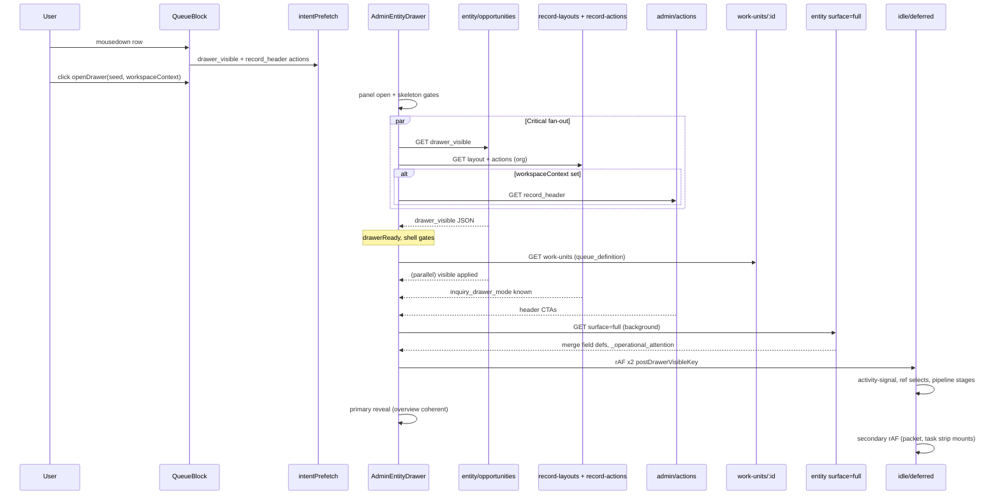
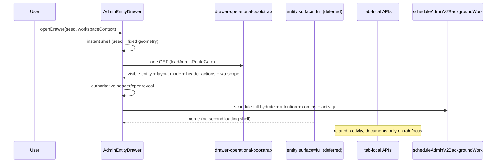

# AdminEntityDrawer Runtime Replication — Phase 0 Audit + Design

**Date:** 2026-05-20  
**Status:** Audit/design only (implementation gate)  
**Canonical references:** [`adminv2_dept_runtime_closeout_handoff.md`](./completed/adminv2_dept_runtime_closeout_handoff.md), [`adminv2_work_unit_runtime_cards_1_3_plan.md`](./adminv2_work_unit_runtime_cards_1_3_plan.md) (AdminV2 Runtime Contract V1)

**Scope:** Replicate proven `/dept` + `/work-unit` orchestration into drawer surfaces. **No implementation in this document.**

---

## Executive summary

`AdminEntityDrawer` already implements **partial** AdminV2 runtime ideas (queue preview seed, staged `drawer_visible` → `full`, gated reveals, intent prefetch, deferred comms/activity). The critical gap versus locked workspace runtime is **request fragmentation**: **5–8 parallel HTTP families** on opportunity open, **duplicate auth resolution** across routes, and **split authority** between entity truth, record chrome config, registry header actions, and work-unit metadata.

**Recommendation:** Introduce **`GET /api/admin/opportunities/{id}/drawer-operational-bootstrap`** (name TBD) as the single oper-critical HTTP with **`loadAdminRouteGate`**, bundling: `drawer_visible` entity shell fields, effective drawer layout (`inquiry_drawer_mode`), `record_header` resolved actions (when workspace context present), work-unit `queue_definition` + `department_id`, and optional lane-scoped hints from queue preview seed. Keep **`surface=full`** as a **deferred** second entity pass for field defs / relationships / operational attention attachment — not on the primary-reveal gate.

---

## 1. Runtime diagrams

### 1.1 Current opportunity open (happy path, AdminV2 queue row)



### 1.2 Target drawer runtime (replication doctrine)



### 1.3 Reveal gate state machine (opportunity, workflow v1)

```txt
OPEN
  → [queue seed?] title/subtitle/timeline reserves (no "Inquiry" flash)
  → drawer_visible OR bootstrap.shell arrives
  → shellSettled = entity row + recordChrome.configResolved
  → overviewRevealReady = shellSettled ∧ ¬fullHydratePending
  → PRIMARY REVEAL (tabs + overview body, reportDrawerPrimaryReady)
  → secondaryReady (+2 rAF): packet status, embedded task strip regions
  → full hydrate complete: field sections, attention attachment, soft emphasis
```

---

## 2. Critical path timing analysis

| Phase | Markers / gates | Blocked on | Typical parallel work |
|-------|-----------------|------------|------------------------|
| T0 click | `markDrawerRowClickStart`, `markDrawerOpenStart` | — | Intent prefetch may already be in flight |
| T1 panel visible | Drawer mount, fixed modal geometry | — | `scheduleDeferredCommunicationsDrawerPrefetch` |
| T2 entity shell | `drawer_opportunity_visible_req` → `drawer_visible` response | `GET entity?surface=drawer_visible` | `useRecordChromeConfig` layout+actions (2 HTTP) |
| T3 header scope | `record_header` actions | `work_unit_id` + `department_id` | Prefetch may dedupe; else waits on entity `_work_unit_department_id` or `opportunityWorkspaceContext` |
| T4 chrome mode | `opportunityInquiryWorkflowDrawer` | `record-layouts` resolve | Until then: `opportunityInquiryWorkflowDrawerShell` keeps workflow-shaped chrome |
| T5 WU metadata | Timeline buckets | `fetchAdminWorkUnitDrawerJson(wuid)` | Separate from workspace bootstrap; not deduped with WU oper-bootstrap |
| T6 primary reveal | `opportunityDrawerOverviewRevealReady` | **`surface=full` merge** (workflow inquiry) | Record chrome still required for shell gate even if actions come from registry |
| T7 post-visible | `postDrawerVisibleKey` (+2 rAF) | drawerReady | activity-signal (idle), deletion-eligibility, ref field option fetches |
| T8 secondary | `opportunityDrawerSecondaryReady` (+2 rAF) | overview reveal | Heavy overview sub-surfaces |

**Primary reveal is gated on full hydrate** for workflow opportunities (`opportunityFullHydratePending`). That makes T6 dominated by the **second full entity GET**, not drawer_visible — the largest divergence from workspace doctrine (oper reveal before heavy hydrate).

**Perf instrumentation:** [`web/lib/perf/adminV2DrawerPerf.ts`](../../web/lib/perf/adminV2DrawerPerf.ts) — `row_click_to_drawer_visible`, `drawer_visible_to_primary_ready`, `drawer_visible_to_full_hydrated`.

---

## 3. Fragmentation analysis

### 3.1 HTTP fan-out on opportunity open (critical + near-critical)

| # | Request | Auth path | Purpose | Deduped? |
|---|---------|-----------|---------|----------|
| 1 | `GET /api/admin/entity/opportunities/:id?surface=drawer_visible` | `getAdminContextCached` + `getAdminAccessContextCached` | Fast entity shell | Intent prefetch + `dedupeAdminFetch` |
| 2 | `GET /api/admin/record-layouts?entity_type=opportunity` | `getAdminContextCached` | `inquiry_drawer_mode`, section order | TTL 1500ms |
| 3 | `GET /api/admin/record-actions?entity_type=opportunity` | (same) | Static chrome placements | TTL 1500ms; **not used for header when registry resolves** |
| 4 | `GET /api/admin/actions?surface=record_header&…` | `loadAdminRouteGate` | Conditional header CTAs | Intent prefetch + sig ref |
| 5 | `GET /api/admin/work-units/:wuId` | route-specific | `queue_definition`, `department_id` | `fetchAdminWorkUnitDrawerJson` inflight map |
| 6 | `GET /api/admin/entity/opportunities/:id?surface=full` | dual context | Field defs, relationships, **operational attention** | In-flight ref per open |
| 7 | `GET …/activity-signal` | — | Header activity line | **idle** after postDrawerVisible |
| 8 | `useOpportunityActiveTourBookings` | — | Reschedule label on schedule_tour | Parallel hook |

**Not oper-critical but often concurrent:** comms drawer prefetch (deferred inside helper), `location-options` / `person-options` / `pipeline-stages` after visible.

### 3.2 Auth / context duplication

| Route | Pattern |
|-------|---------|
| `entity/[type]/[id]` | **Two** cached resolves: `getAdminContextCached` + `getAdminAccessContextCached` |
| `admin/actions` | **One** `loadAdminRouteGate` |
| `record-layouts`, `record-actions` | `getAdminContextCached` only |
| `work-units/:id` | Typically gate per route (not unified with drawer bundle) |
| Workspace `operational-bootstrap` | **One** `loadAdminRouteGate` (reference) |

Opening one opportunity drawer can hit **3 different auth entry patterns** across 5+ routes → same class of “auth storm” dept bootstrap eliminated.

### 3.3 Layout / action fragmentation

| Source | Consumer | Issue |
|--------|----------|-------|
| `record-layouts` + `record-actions` | `useRecordChromeConfig` | 2 HTTP; blocks `configResolved` for shell gate |
| `admin/actions` `record_header` | Header quick actions (registry) | Third action resolution path; **record-actions chrome computed but not rendered in header** (`opportunityChromePrimary` unused) |
| `record-actions` chrome | Legacy fallback concept | Dead path for inquiry workflow when registry has rows |
| Queue preview seed | Title, subtitle, timeline reserve | **Correct** — prevents generic “Inquiry” title |
| Workspace oper-bootstrap rows | Queue list only | **Must not** become drawer entity truth (doctrine) |

### 3.4 Stale-risk points

| Risk | Mechanism | Mitigation today | Target |
|------|-----------|------------------|--------|
| Queue preview ≠ entity | Seed from row; entity refetch later | Title holds seed until `overviewRevealReady` | Seed is preview-only; entity/bootstrap authoritative for status |
| Header actions stale after mutation | `adminv2:opportunity-updated` refetches entity + actions | Event listener | Keep; bundle invalidates header slice only |
| Wrong WU scope | Actions use `opportunityWorkspaceContext` OR entity `work_unit_id` | Context passed from queue open | Bundle stamps scope from open context; ignore stale entity WU on first paint |
| Attention from queue row | BOS context uses seed when present | `buildOpportunityOperationalContext` | Drawer oper context from bootstrap, not queue row resolver |
| Full hydrate merge race | `mergeOpportunityFullHydrate` | id match guard | Same + abort on drawer id change |
| Tab activity cache | Refetch on tab + nonce | Tab-local | Tab-local only |

### 3.5 Body flash / layout jump causes

| Symptom | Cause |
|---------|-------|
| Giant body skeleton | Pre-overview `DrawerOpportunityQueueBootstrapBodySkeleton` until `overviewRevealReady` |
| Header action pop-in | `record_header` finishes after visible; skeleton bars until registry ready |
| Title swap | Seed title → enrollment-formatted entity title at primary reveal |
| Tab strip empty then filled | `drawerTabStripKeys` returns `[]` until `overviewRevealReady` |
| Timeline region swap | Queue preview reserve → workflow timeline after shell settled |
| Classic vs workflow mode flip | `recordChromeOpportunity.configResolved` transitions `opportunityInquiryWorkflowDrawer` |
| Full hydrate emphasis | CSS soft emphasis when `drawer_initial`/`full` replaces visible (workflow.css) |

---

## 4. Proposed drawer bootstrap structure

### 4.1 Endpoint sketch

`GET /api/admin/opportunities/{id}/drawer-operational-bootstrap`

**Query:** `department_id`, `work_unit_id`, optional `hint_*` from queue row (status, metadata), optional `queue_key` / `bucket_key` for timeline hints.

**Single `loadAdminRouteGate`.** Server phases (mirror WU loader):

```txt
shared context (org, scope dim, viewer TZ if needed)
→ drawer_visible entity slice (reuse respondOpportunityEntityGet drawer_visible branch)
→ effective drawer layout (fetchEffectiveRecordDrawerLayout)
→ resolve record_header actions (resolveActionsForContext) when WU+dept present
→ work_unit row (queue_definition, department_id) when WU present
→ return bundle
```

### 4.2 Response shape (illustrative)

```ts
{
  entity: { /* drawer_visible-shaped payload, authoritative for drawer shell */ },
  record_layout: { config_json, inquiry_drawer_mode, … },
  record_header_actions: ResolvedActionsBySlot | null,
  work_unit: { id, department_id, queue_definition } | null,
  workspace_scope: { department_id, work_unit_id },
  timing?: { phases_ms, … }
}
```

**Explicitly omit from bootstrap:** `surface=full` field catalogs, inquiry_children batch, member person graph, activity feed, workflow runs, comms threads, operational tasks strip API, documents, related records, AI payloads.

### 4.3 Client apply (mirror work-unit page)

```txt
openDrawer(seed, workspaceContext)
→ render drawer shell immediately (seed + ADMINV2_DRAWER_* geometry)
→ dedupeAdminFetch(drawer-operational-bootstrap)
→ apply entity + layout resolved + header actions + wu scope
→ set overviewRevealReady (no wait for full)
→ scheduleAdminV2BackgroundWork:
      - surface=full entity hydrate
      - relationship_member_persons overlay if flagged
      - activity-signal, comms prefetch, ref selects
```

### 4.4 Entity truth doctrine (unchanged)

| Layer | Authority |
|-------|-----------|
| Bootstrap `entity` | Presentation-authoritative for **drawer shell** (header, tabs gating, timeline mode) |
| `surface=full` hydrate | Authoritative for **field defs, relationships, inquiry children, operational attention attachment** |
| Mutations | Existing PATCH/execute paths + `adminv2:opportunity-updated` invalidation |
| Queue row seed | **Preview only** — never mutation truth |

---

## 5. Deferred / background / tab-local candidates

### 5.1 Defer (`scheduleAdminV2BackgroundWork` or post-primary rAF)

| Load | Rationale |
|------|-----------|
| `surface=full` entity hydrate | Heavy enrich + attention attachment |
| `relationship_member_persons` | Pass 6 overlay |
| `activity-signal` | Header line; already idle — standardize on AdminV2 defer helper |
| `deletion-eligibility` | Power-user edge |
| `prefetchWorkspaceChildcareInquiryOptionSets` | Overview edit selects |
| `location-options`, `person-options`, `customer-options`, `contact-options` | Form edit |
| `pipeline-stages` | Status edit |
| `scheduleDeferredCommunicationsDrawerPrefetch` | Already deferred |
| `useOpportunityActiveTourBookings` | Only needed for schedule/reschedule CTA — defer until header actions render or on hover |
| `OpportunityOperationalCompactStrip` / task assist fetches | Already behind `opportunityDrawerSecondaryReady` in workflow body — keep |

### 5.2 Tab-local only

| Tab | Fetches |
|-----|---------|
| `activity` | `workflow-runs`, `activity` |
| `related` | `/api/admin/related/opportunity/:id` |
| `documents` | related + documents sections |
| `communications` | CommunicationsDrawerSection mounts |

### 5.3 Oper-critical (bootstrap bundle)

- `drawer_visible` entity slice  
- Effective drawer layout / workflow mode  
- `record_header` actions (when scoped)  
- Work-unit `queue_definition` + `department_id`  
- Queue preview seed applied **client-side** at open (no HTTP)

---

## 6. Suggested reveal gates

Align naming with dept/WU split readiness:

| Gate | Condition | Unlocks |
|------|-----------|---------|
| `drawerShellInstant` | Panel open + (seed title **or** bootstrap requested) | Modal chrome, backdrop, fixed min-heights |
| `drawerEntityShellReady` | Bootstrap `entity` applied (or visible fetch fallback) | Title/subtitle from entity rules; drop generic loading copy |
| `drawerLayoutReady` | `record_layout` in bootstrap | Workflow vs classic decision stable |
| `drawerHeaderActionsReady` | `record_header_actions` resolved **or** explicit empty | Title-rail CTAs; no action skeleton bars |
| `drawerOperRevealReady` | `entityShell` + `layout` + (`headerActions` or non-workflow) | **Primary reveal** — tabs + overview body |
| `drawerSecondaryReady` | oper reveal + 2 rAF | Packet probes, embedded strips |
| `drawerFullHydrateReady` | `surface=full` merged | Field sections, attention strip data, relationship panels |

**Change from today:** Decouple `drawerOperRevealReady` from `surface=full` for workflow v1. Full hydrate upgrades content; it must not block tab strip or overview shell.

---

## 7. Replication matrix (`/dept` + `/work-unit` → drawer)

| Doctrine | `/dept` (locked) | `/work-unit` | Drawer target |
|----------|------------------|--------------|---------------|
| Shell-first | Bridge shell, no route card loader | Parent shell + lane reserve | **Instant drawer panel + seed/header reserves** |
| Oper-region-only loader | DeptOperationalRegionLoader | WorkspaceQuietQueueLaneReserve | **Section-shaped body reserve only** (not full-card spinner) |
| One bootstrap HTTP | `operational-bootstrap` | `work-units/.../operational-bootstrap` | **`drawer-operational-bootstrap`** |
| One `loadAdminRouteGate` | Yes | Yes | Yes |
| Bundled actions | `right_rail_actions` | Same | **`record_header_actions`** in bundle |
| Bundled layout config | N/A (workspace) | N/A | **`record_layout`** in bundle |
| No duplicate resolver passes | `attention_resolver_passes: 1` | Same | **Do not attach attention in bootstrap**; single attach on full hydrate |
| Queue preview truth | Row authority for list | Bootstrap rows presentation-only | **Seed preview-only**; entity/bootstrap for drawer |
| Deferred P2 | `scheduleAdminV2BackgroundWork` | Same | full hydrate, comms, activity, ref data |
| Stale purge on context change | nav purge | `useLayoutEffect` | **Reset drawer state on `type:id` change** (already partial) |
| Attention metadata stable across lane | `queue.attention` always when NA defined | Same | N/A in drawer; **WU scope in open context** stable for actions |

### Direct reuse candidates

| Module | Reuse in drawer bootstrap |
|--------|---------------------------|
| `loadAdminRouteGate` | Route entry |
| `fetchEffectiveRecordDrawerLayout` | Layout slice |
| `resolveActionsForContext` | Header actions slice |
| `respondOpportunityEntityGet` drawer_visible branch | Entity slice (call in-process, not second HTTP) |
| `buildQueueSummariesSharedBootstrap` | **Only if** drawer timeline needs queue summaries (likely **no** — timeline uses `queue_definition` only) |
| `dedupeAdminFetch` / `workspaceDataFetchInit` | Client |
| `scheduleAdminV2BackgroundWork` | Deferred passes |
| `adminV2DrawerPerf` marks | Same phases, new bootstrap mark |
| `prefetchOpportunityDrawerOnRowIntent` | Point at bootstrap URL + deprecate separate visible/actions prefetch |

---

## 8. Risks / doctrine constraints

| Constraint | Implication |
|------------|-------------|
| Entity truth | Bootstrap does **not** replace `surface=full` for mutations, field defs, or audit |
| Queue doctrine | Row seed + list bootstrap rows are previews |
| No optimistic incorrect records | Drawer must not show stale entity from previous id (keep `entityDataMatchesDrawer`) |
| No route-wide collapse | Drawer loading isolated to header/body regions |
| RLS / org scope | Bootstrap route must use same gates as entity + actions |
| Payload budget | Target **< ~100 KB compressed** for bootstrap (smaller than WU oper — no queue rows) |
| `/dept` / `/work-unit` regression | Drawer routes must not alter workspace loaders |
| `drawer_initial` surface | Server supports; **client default is `drawer_visible`** — do not revive `drawer_initial` without explicit contract |
| Record-actions dead fetch | Bundling layout may allow **dropping record-actions** from critical path if registry is canonical for AdminV2 |

---

## 9. Specific audit questions (answers)

### Q1. Can visible/full staged entity fetches collapse into one authoritative bootstrap?

**Partially.** They should **not** merge into a single entity surface for truth reasons:

- **Bootstrap** = oper-critical **shell** slice (`drawer_visible` equivalent) + layout + header actions + WU scope.  
- **`surface=full`** remains a **deferred authoritative hydrate** for heavy merge + `_operational_attention`.

Collapse **3 HTTP** (visible + layout + actions) into **one bootstrap**. Keep full as **second scheduled pass**, not second gate.

### Q2. Which drawer payloads are truly oper-critical?

- Queue preview seed (client)  
- `drawer_visible` entity (header identity, status shells, WU/dept stamps)  
- Effective drawer layout (`inquiry_drawer_mode`)  
- `record_header` resolved actions (workspace-scoped)  
- Work-unit `queue_definition` + `department_id` (timeline)  

**Not oper-critical:** full field defs, related, activity, comms, documents, task-assist strip APIs, tour bookings, ref selects, deletion eligibility, member-person overlay (until overview edit).

### Q3. Which loads should become deferred / idle / tab-local?

See §5. Summary: move **full hydrate + attention** to deferred; keep **activity/related/documents** tab-local; standardize idle work on `scheduleAdminV2BackgroundWork`.

### Q4. Can layout + actions + entity header unify into one bootstrap?

**Yes** — primary Card 5 deliverable. Server composes in one gate; client single apply.

### Q5. What causes body flashes, layout jumps, delayed header stabilization?

See §3.5. Root: **primary reveal waits on full hydrate**; **triple parallel config** (visible, chrome, registry actions); **WU fetch** after entity.

### Q6. What duplicate action fetches exist?

1. `record-actions` (chrome) — **fetched, unused in header** when registry resolves  
2. `record_header` via `/api/admin/actions` — **used**  
3. Intent prefetch duplicates (1) and (2) — mitigated by dedupe  
4. Mutation refetch re-queries actions + entity refetch  

### Q7. What duplicate layout/config fetches exist?

- `record-layouts` on every open (TTL helps)  
- `effective-preview` is settings-only, not drawer runtime  
- WU GET duplicates metadata already in workspace bootstrap when opening from WU page (not deduped across surfaces)

### Q8. What is the current auth/context fan-out?

Per open: entity route (**2×** context): layouts (**1×**), actions (**1×** gate), work-unit (**1×**), full entity (**2×** again) → **up to 7 auth resolutions** across 5–6 HTTP requests.

### Q9. What can reuse `/dept` + `/work-unit` bootstrap doctrine directly?

- `loadAdminRouteGate` single entry  
- Phased loader with perf logging (`[drawer-bootstrap-perf]`)  
- `scheduleAdminV2BackgroundWork` for non-critical  
- Client dedupe + stale purge patterns  
- Queue preview / presentation-only row doctrine  
- Split readiness gates (shell vs oper reveal vs secondary)  

**Do not reuse:** queue summaries, attention bucket builder, primary_lane items (drawer is not a queue lane).

---

## 10. Recommended Cards 4–7

| Card | Title | Deliverable |
|------|-------|-------------|
| **4** | Drawer shell + geometry | Align drawer panel reserves with `adminV2LoadingGeometry`; instant open with seed; no full-body route collapse; contract tests in `adminV2DrawerLoadingCoherence` |
| **5** | Drawer operational bootstrap (server + client) | `drawer-operational-bootstrap` route + loader; client happy path; legacy fan-out fallback; intent prefetch → bootstrap URL; **decouple primary reveal from full hydrate** |
| **6** | Deferred hydrate + secondary | `scheduleAdminV2BackgroundWork` for full + member overlay + activity-signal; remove `record-actions` from critical path if registry-only; tour bookings lazy; tab-local guarantees |
| **7** | Oper header + attention coherence | Single `OperationalAttentionHeaderStrip` (already chrome-only); attach attention on full hydrate only; BOS `buildOpportunityOperationalContext` uses bootstrap entity not seed; optional: pass workspace oper context from parent page without extra WU GET |

**Implementation order:** 4 → 5 → 6 → 7 (same as work-unit Cards 1–3 sequencing).

**Out of scope (this sprint):** Non-opportunity entity types (jobs/schedules can follow same pattern later), SQL tuning, dept/WU page changes.

---

## 11. Verification checklist (pre-implementation gate)

- [ ] Happy path: **one** drawer bootstrap HTTP before primary reveal  
- [ ] **One** `loadAdminRouteGate` per bootstrap  
- [ ] Primary reveal **does not** wait on `surface=full`  
- [ ] Queue seed never overrides entity title after bootstrap apply  
- [ ] No `record-actions` HTTP on happy path (if registry canonical)  
- [ ] `attention_resolver_passes` N/A in drawer bootstrap; attention appears after full hydrate only  
- [ ] Tab switch does not refetch entity shell  
- [ ] `[drawer-bootstrap-perf]` phase timings present  
- [ ] `adminV2DrawerLoadingCoherence` + `workUnitOperationalBootstrap` / `deptOperationalBootstrap` remain green  
- [ ] Staging payload size documented  

---

## 12. Key file map (audit)

| Area | Path |
|------|------|
| Drawer UI | `web/components/admin/AdminEntityDrawer.tsx` |
| Drawer context | `web/contexts/AdminDrawerContext.tsx` |
| Intent prefetch | `web/lib/admin/opportunityDrawerIntentPrefetch.ts` |
| Entity surfaces | `web/lib/admin/opportunityEntityRecord.ts` |
| Record chrome hook | `web/hooks/useRecordChromeConfig.ts` |
| Header actions API | `web/app/api/admin/actions/route.ts` |
| WU drawer fetch | `web/lib/admin/adminWorkUnitDrawerFetch.ts` |
| Perf | `web/lib/perf/adminV2DrawerPerf.ts` |
| Coherence tests | `web/tests/admin/adminV2DrawerLoadingCoherence.test.ts` |
| Workspace reference | `web/lib/workspace/loadWorkUnitOperationalBootstrap.ts`, `loadDeptOperationalBootstrap.ts` |

---

## 13. Suggested commit message (when implementing later)

`perf(adminv2): drawer operational bootstrap and reveal gates (cards 4–7)`
