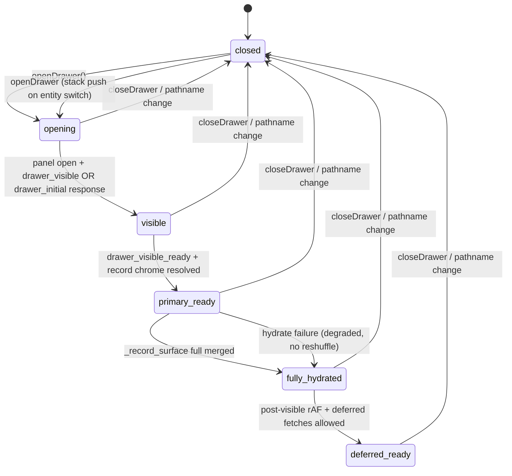

# AdminV2 Performance — Phase 1 Navigation & Interaction Contracts

**Date:** 2026-05-19  
**Status:** Doctrine freeze (contract phase — no optimization implementation)  
**Authority:** Governs all Phase 2+ performance work on AdminV2 workspace surfaces  

**Baseline evidence:**
- [`adminv2_performance_deep_dive_phase0_audit.md`](./adminv2_performance_deep_dive_phase0_audit.md) — performance map, bottlenecks, instrumentation
- [`adminv2_performance_rebuild_audit.md`](./adminv2_performance_rebuild_audit.md) — navigation matrix, Build Pass history
- **Load-path architecture (Phase 2):** [`adminv2_performance_phase2_load_path_architecture.md`](./adminv2_performance_phase2_load_path_architecture.md)

**Enforcement (automated):** `web/tests/admin/adminV2NavigationContracts.test.ts`, `adminV2QueueRowClick.test.ts`, `adminV2WorkUnitLaneLocalState.test.ts`, `adminV2DrawerLoadingCoherence.test.ts`, `opportunityDrawerQueuePreviewSeed.test.ts`

**Contract source code (read before changing behavior):**
`web/lib/adminV2/shellNavigation.ts`, `AdminV2NavLink.tsx`, `AdminDrawerContext.tsx`, `Drawer.tsx`, `workUnitInitialLocation.ts`, `workUnitLaneQueryUrl.ts` (helpers only — not wired on work-unit page)

---

## Purpose

AdminV2 workspace performance work must not trade reliability for speed. A prior optimization pass caused **routing instability** (dead first-clicks, cancelled soft transitions, shallow URL fights, overlay capture). Navigation was repaired with explicit, **non-uniform** patterns.

Phase 1 **freezes architectural truth**: what owns routes, what may change without navigation, how the shell and drawer behave, and which optimizations are permitted. Phase 2+ implementation PRs must cite compliance with this document or update contracts + tests in the same change.

This document is **governance**, not a rewrite proposal.

---

## 1. Navigation architecture doctrine

### 1.1 Three navigation classes

AdminV2 uses **three distinct navigation classes**. They must not be collapsed into one mechanism without an explicit product decision, contract test updates, and manual QA.

| Class | Definition | When to use | Primary mechanism |
|-------|------------|-------------|-------------------|
| **Hard navigation** | Full document load to a new URL | Shell hierarchy, dept drill-in, any path where soft transitions were cancelled under RSC load | `adminV2CommitNavigation` → `window.location.assign` |
| **Soft navigation** | Next.js App Router client transition | Workspace root dept tiles, settings hub tiles, low-risk path-only changes | Next `<Link prefetch={false}>` or `router.push` (exception paths only) |
| **Local-state navigation** | UI changes with **unchanged pathname** | Work-unit queue tabs, drawer tabs, filters, modals | React state in page/drawer scope |

### 1.2 Hard navigation — rules

**Approved pattern**

```text
User primary-click (button 0, no modifiers)
  → optional onClick (must not set defaultPrevented before commit)
  → AdminV2NavLink: preventDefault
  → adminV2CommitNavigation(href, { closeDrawer })
    → adminV2BeforeRouteNavigation (markWorkUnitNavigationStart, closeDrawer)
    → window.location.assign(href)  // skip if same path+search
```

**Requirements**

- Use native `<a href="...">` with real `href` (accessibility, middle-click, open in new tab).
- `AdminV2NavLink` is the standard shell link; it must **not** import `next/link` or call `router.push`.
- Modifier keys (meta/ctrl/shift/alt) or non-primary button: **do not** `preventDefault`; browser default stands.
- `adminV2BeforeRouteNavigation` must **never** call `preventDefault`.

**Surfaces (non-exhaustive):** sidebar, workspace/settings breadcrumb parents, dept oper cards (`DeptOperConsoleQueueRow`), config-assist review CTAs that use `adminV2CommitNavigation`.

**Rationale:** Hard nav pays a full layout cost but guarantees the navigation **commits** when workspace RSC + client hydration is heavy. Dead UI from cancelled soft transitions is a **P0 regression**.

### 1.3 Soft navigation — rules

**Approved pattern**

```text
<Link href={path} prefetch={false} onClick={markWorkUnitNavigationStart}>
```

- `prefetch={false}` on heavy AdminV2 routes (`adminV2HeavyRoutePrefetch.ts`).
- Perf `onClick` hooks may run; they must **not** call `adminV2CommitNavigation` unless migrating that surface to hard nav explicitly.
- Pathname changes; search params on drill-in hrefs are allowed **only** as static link targets (e.g. dept card `?queue=` for **initial** work-unit land).

**Surfaces:** `WorkspaceRootDepartmentGrid`, settings hub cards, some settings child pages.

**Forbidden on soft-nav surfaces (without migration plan):** wrapper `div` click handlers that call `router.push`; global capture-phase listeners; `preventDefault` on primary click.

### 1.4 Local-state navigation — rules

**Approved:** `setState` for queue lane, drawer tab, attention bucket filter, unmapped toggle — while `window.location.pathname` is unchanged.

**Forbidden on work-unit queue page:**

- `useSearchParams()` for lane selection
- `scheduleWorkUnitLaneUrlSync` / `replaceWorkUnitBrowserSearch` after mount
- `popstate` listeners to sync tabs
- Two-way sync between URL search params and `selectedQueueKey`

**Deep link contract:** `readWorkUnitInitialLocationParams()` runs **once** at bootstrap. Browser back/forward across **routes** is supported; back/forward for tab changes **within** the same work-unit URL is **not** reflected in UI after mount (documented product behavior).

### 1.5 Forbidden navigation patterns (global)

| Pattern | Why forbidden |
|---------|----------------|
| `<span onClick={router.push}>` for primary workspace hierarchy | Breaks href semantics, regressions on first click |
| Uniform hard nav on workspace root dept tiles without UX review | Removes middle-click / native link behavior operators expect |
| Uniform soft nav on sidebar/dept cards | Revives cancelled transitions |
| Custom navigation framework parallel to Next.js | Competing route stores |
| `preventDefault` on all clicks inside a link wrapper | Breaks modifier-key and auxiliary clicks |
| `stopPropagation` on parent of `<Link>` / `<a>` for “fixing” double handlers | Hides real handler bugs; breaks nested controls |
| `useLinkStatus` / pending link chrome on heavy routes | False stuck states |
| `prefetch={true}` on workspace/settings/workflow routes | Background RSC competes with active navigation |

---

## 2. Route ownership rules

### 2.1 Pathname ownership

| Owner | Scope |
|-------|--------|
| **Next.js App Router** | Canonical pathname for workspace routes (`/adminV2/workspace/...`) |
| **Server layouts** | Auth redirect, org bootstrap — no client override |
| **Hard nav** | Only mechanism that **must** change pathname for shell/dept drill-in |
| **Soft nav** | May change pathname via `<Link>` / `router.push` on approved surfaces |

**No client module** may “mirror” pathname in global store for navigation decisions. `usePathname()` is read-only input for highlighting and drawer close.

### 2.2 Search params ownership

| Route / surface | Who owns `?query` | After mount |
|-----------------|-------------------|-------------|
| Work-unit queue page | Bootstrap reads `queue`, `unmapped`, `attention_bucket` once | **Local state owns lanes** — URL is not updated on tab change |
| Dept drill-in cards | Static `href` includes initial `?queue=` / `?attention_bucket=` | Hard nav — new document load reads bootstrap |
| Legacy dept sub-routes (`needs-attention`, etc.) | `useSearchParams` allowed for **exception filters only** | Not a template for work-unit v2 page |
| Drawer | **No** entity/tab state in URL | Tabs are local `drawerTab` |
| Site filter | `WorkspaceSiteFilterContext` + API query append | Must fingerprint caches (`workspaceViewCacheFingerprint`) |

### 2.3 Local UI state boundaries

State must live in the **narrowest** owner:

| State | Owner component / context |
|-------|-------------------------|
| `selectedQueueKey`, `laneUnmappedOnly`, attention bucket | Work-unit `page.tsx` only |
| Drawer entity, stack, preview seed | `AdminDrawerContext` |
| Drawer tab, edit mode, section expand | `AdminEntityDrawer` |
| Sidebar collapse, canvas zoom (non-workspace) | `AdminV2Shell` local state |
| Org principal, access fingerprint | `WorkspaceOrgProvider` (server-seeded) |

**Synchronization restrictions**

- Do **not** sync local queue tab state ↔ URL after mount.
- Do **not** sync drawer open ↔ URL (drawer closes on **pathname** change only).
- Do **not** duplicate server queue data in a global client store “for perf” without a cache contract (use `dedupeAdminFetch`, `queueRowClientCache`).

### 2.4 `history.replaceState` policy

Helpers in `workUnitLaneQueryUrl.ts` exist for tests and legacy call sites. **Wiring them into the work-unit page is forbidden** unless this document, navigation tests, and manual QA are updated together.

Shallow `replaceState` with unchanged pathname must **not** close the drawer (`AdminDrawerContext` intentionally ignores pathname-stable updates).

---

## 3. Shell persistence contract

### 3.1 Persistent regions (must survive workspace route changes within AdminV2)

These regions must **not** unmount or reset identity on workspace → dept → work-unit transitions:

| Region | Location | Persistence rule |
|--------|----------|------------------|
| Sidebar + collapse state | `AdminV2Shell` | Same React tree while staying in AdminV2 layout |
| Top nav bar | `AdminV2Shell` / `TopNavBar` | `Suspense` boundary allowed; fallback must match **height** (~48px) |
| Site filter gate | `WorkspaceSiteFilterGate` | Scope persists across workspace child routes |
| AI command surface shell | `AdminV2Shell` | Must remain interactive; z-index above drawer backdrop |
| Workspace provider stack | `AdminV2WorkspaceClientProviders` | Auth, TZ, org, drawer provider — one mount per workspace layout |
| `AdminEntityDrawer` | Sibling to scroll surface | Always mounted; visibility from drawer state |

**Hard navigation** reloads the document — shell React state (e.g. sidebar collapsed) resets. That is accepted. **Forbidden:** unnecessary full reload triggers from workspace **within** the same route class (e.g. queue tab must not reload shell).

### 3.2 Transitional regions (may swap content, not chrome geometry)

| Region | Rule |
|--------|------|
| Workspace scroll surface (`adminv2-workspace-scroll-surface`) | Page content swaps; padding and scroll container stable |
| Breadcrumbs / page title | Update with route; use `WorkspaceChrome` |
| KPI strip | May skeleton → data; reserved height via `KpiStripSkeleton` / placement pending flags |
| Dept paired oper panels | Coordinated skeleton (`DeptPairedOperQueuesSkeleton`) until both lanes ready |
| Queue list body | Prior rows may remain visible during refresh |

### 3.3 Forbidden shell resets

- Blanking the entire workspace to a spinner on queue tab change
- Remounting `AdminV2Shell` on client-only state changes
- Changing sidebar `z-index` below drawer backdrop
- Removing `AdminDrawerProvider` from workspace subtree
- Route `loading.tsx` that does **not** match cold shell geometry (causes CLS)

### 3.4 Shell loading rules

| Layer | Blocking? | Skeleton |
|-------|-----------|----------|
| `workspace/layout.tsx` server auth | Yes for first byte of workspace | “Loading context…” only when org missing |
| `loading.tsx` per route | Brief RSC transition | `WorkspaceRootColdShell`, `DepartmentWorkspaceColdShell`, etc. |
| TopNav `Suspense` | Non-blocking for page body | Fixed-height “Loading…” bar |
| Page client fetch | Page-owned | Cold shells until `shell_ready` / cache seed |

**Doctrine:** Shell chrome loads **before** or **in parallel with** page content; chrome must not wait for queue rows or drawer hydrate.

---

## 4. Drawer lifecycle contract

### 4.1 State machine (normative vocabulary)

Phase 1 defines **doctrine states**. Implementation maps to `AdminDrawerContext`, `AdminEntityDrawer`, and entity API `_record_surface` values.



| State | User-visible meaning | Implementation anchors |
|-------|----------------------|---------------------------|
| **closed** | No drawer panel | `drawer.type === null` |
| **opening** | Panel animating; header may show queue preview seed | `openDrawer` dispatched; fetch started |
| **visible** | Panel interactive; overview shell readable | `drawer_visible` or initial row; panel `pointer-events-auto` |
| **primary_ready** | Title, workflow subtitle, primary header actions trustworthy | `opportunityDrawerShellSettled`; `alloyPerfSet("drawer_visible_ready")` |
| **fully_hydrated** | Relationship/inquiry-heavy fields from `full` surface | `_record_surface === "full"` (or `drawer_initial` legacy complete) |
| **deferred_ready** | Non-critical fetches permitted | `postDrawerVisibleKey` after 2× `requestAnimationFrame` |

### 4.2 Timing expectations (staging budgets — see §8)

| Transition | Target (p75) | Measurement |
|------------|----------------|-------------|
| openDrawer → visible panel | < 100ms client | User-perceived; no blocking overlay on shell |
| openDrawer → `drawer_visible` API | < 500ms | `[timing][opportunity-api-visible]` |
| visible → primary_ready | < 800ms cumulative | `drawer_visible_ready`, shell settled gate |
| primary_ready → fully_hydrated | < 2.5s from open | `[perf.drawer.full_hydrate]` |
| deferred_ready → tab lazy loads | Best-effort idle | Must not block primary_ready |

### 4.3 Reserved layout rules

- Drawer panel: right-docked, max-width class stable per entity type — **no** full-viewport hit target.
- Header: title/subtitle/actions slots reserved; use skeleton until `opportunityDrawerShellSettled`, not generic “Loading…” swap.
- Tab strip: empty until shell settled for opportunities — **prohibited** flashing default “Related” before resolver.
- Body: single scroll region; sticky header/tabs per `Drawer.tsx` contract.

### 4.4 Prohibited reshuffling

- Reordering sections when `full` arrives (merge in place; use placeholders for pending blocks).
- Switching default tab on hydrate completion.
- Unmounting entire drawer body between `drawer_visible` and `full`.
- Replacing preview-seeded title with empty string before entity row arrives.

### 4.5 Deferred surface guidance

**Allowed after `deferred_ready`:** activity-signal, deletion check, first-visit tab payloads (communications, notes, related), member-person graph overlay.

**Forbidden as drawer open gate:** communications thread list, documents tab, financials, workflow automation panels.

**Prefetch on intent:** `communicationsDrawerPrefetch` may warm data on hover/focus — must not block `opening → visible`.

### 4.6 Close semantics

| Trigger | Behavior |
|---------|----------|
| Pathname change | `closeDrawer` + clear stack (skip initial mount; ignore pathname-only-stable `replaceState`) |
| Close button / Escape | `closeDrawer` |
| Outside mousedown (AdminV2) | Close if target passes `shouldCloseAdminV2DrawerOnOutsideTarget` |
| Hard nav before route | `closeDrawer` via `adminV2BeforeRouteNavigation` |

**Backdrop:** `pointer-events-none` — **not** a click-capture layer. Outside dismiss uses document `mousedown`, not backdrop click.

### 4.7 Stack navigation

Opening a linked record from inside the drawer pushes the previous entity onto `stack`. `goBack` restores without route change. Stack depth must not remount shell.

---

## 5. Queue interaction contract

### 5.1 Row click timing

```text
pointerdown/up on row card
  → QueueBlock fireQueueRowOpenRecord (no preventDefault on card click)
  → work-unit onAction: open_record branch BEFORE registry branches
  → openWorkUnitQueueRecord
  → openDrawer (+ opportunityQueuePreviewSeed when row in buffer)
```

**First-click reliability:** Row must remain `pointer-events: auto` during refresh (`adminv2-ws-wu-queue-card-interactive`). **Forbidden:** `pointer-events: none` on list during background fetch.

**Keyboard:** `preventDefault` only for Space/Enter on row focus — not for primary click.

**Quick actions:** `stopPropagation` on chip buttons — required; do not wrap row in `<Link>`.

### 5.2 Optimistic selection

- **No** optimistic URL updates for selection.
- **Allowed:** Keep prior `queueRowsBuffer` visible while new lane fetch runs.
- **Allowed:** Preview seed for drawer header before entity GET returns.
- **Forbidden:** Highlighting a row as “selected” in URL or global store without product spec.

### 5.3 Drawer open behavior from queue

| Entity | Drawer type | Notes |
|--------|-------------|-------|
| opportunity | `opportunities` + `opportunityWorkspaceContext` + optional `opportunityQueuePreviewSeed` | Header actions primed with work-unit scope |
| job | `jobs` + `jobRecordSurface: "drawer"` | |
| schedule | `schedules` | |

Drawer open does **not** change pathname. Pathname change closes drawer.

### 5.4 Queue tab behavior

| Rule | Detail |
|------|--------|
| Tab change mechanism | `setSelectedQueueKey` (local) |
| Fetch | `fetchQueueItems` — respect lease/sig; `force: true` on invalidation |
| URL | Must not update address bar after mount |
| User override | `userLaneTouchedRef` prevents bootstrap from clobbering tab after interaction |
| Top nav “Queue” on WU route | No-op `<span aria-current="page">` — not a link |

### 5.5 Refresh ownership

| Event | Who refetches |
|-------|----------------|
| Tab change | Work-unit page `fetchQueueItems` |
| Site filter change | Summaries + rows (`viewScopeFingerprint`) |
| Registry action success | Action-specific invalidation; must not blanket-clear all lanes without cause |
| Workflow automation event | `ADMIN_V2_WORKFLOW_AUTOMATION_REFRESH` listener — scoped to page |
| Drawer mutation | Entity/drawer effects — **not** full queue list unless action contract requires |

### 5.6 Cache continuity

| Cache | Scope | Invalidation |
|-------|-------|--------------|
| `dedupeAdminFetch` | In-flight GET dedupe | Per URL + init |
| `queueRowClientCache` | Row payloads per lane | Work-unit change, explicit delete keys, scope fingerprint |
| Session shell cache | Dept/WU metadata — **not** scope-sensitive counts on dept | Org + principal + `accessScopeFingerprint` |

**Forbidden:** Caching queue row totals in sessionStorage when site filter can narrow scope (dept summaries doctrine).

---

## 6. Suspense and loading rules

### 6.1 Where Suspense is allowed

| Location | Fallback requirement |
|----------|---------------------|
| `TopNavBar` in `AdminV2Shell` | Fixed height (~48px), non-interactive placeholder |
| Settings / workflows layouts (if present) | Must not collapse shell |

### 6.2 Where Suspense is forbidden (without new contract)

- Wrapping entire workspace page content
- Wrapping `AdminEntityDrawer` body per tab in nested boundaries that remount children
- Wrapping queue row list during tab switch (causes blank flash)
- Using Suspense as a substitute for staged drawer hydrate

### 6.3 Skeleton policy

**Principles**

1. Skeleton geometry must match final layout (row count, strip height, tab pill shape).
2. Prefer **one** coordinated skeleton phase over multiple mismatched placeholders.
3. Do not show numbers that will be replaced by a different resolver (KPI placement pending flags).
4. Dept paired panels: same row count for throughput and attention (`DEPT_PAIRED_OPER_QUEUE_SKELETON_ROW_COUNT`).

**Approved skeletons:** `WorkspaceRootColdShell`, `DepartmentWorkspaceColdShell`, `DeptPairedOperQueuesSkeleton`, `KpiStripSkeleton`, `WorkUnitQueueCompactRowSkeleton*`, drawer header skeleton gated on `opportunityDrawerShellSettled`.

**Forbidden:** Generic full-page spinners; oversized gray boxes; skeleton count that does not match final list length.

### 6.4 Layout reservation requirements

- KPI strip: reserve height while `workspaceKpiPlacementPending` / `deptPlacementRows === undefined`.
- Queue tab badges: pulse bars instead of per-pill spinners during summary load.
- Drawer header: skeleton slots for subtitle and actions until `primary_ready`.
- Shell: `z-[100]` chrome stable — no layout jump when drawer opens.

### 6.5 Loading boundary ownership

| Boundary | Owner |
|----------|-------|
| Route `loading.tsx` | Next.js — must mirror cold shell |
| Page `loading` state | Client page — gates cold shell vs content |
| Drawer loading | `AdminEntityDrawer` — staged surfaces, not full unmount |
| Queue rows loading | `rowsLoading` on queue model — prior buffer visible |

---

## 7. Overlay and pointer-event rules

### 7.1 Z-index ownership (normative)

| Layer | Z-index constant | Pointer events |
|-------|------------------|----------------|
| Workspace content | default / `z-0` scroll surface | auto |
| Drawer backdrop | `ADMINV2_DRAWER_BACKDROP_Z` (60) | **none** |
| Drawer panel | `ADMINV2_DRAWER_PANEL_Z` (70) | auto |
| Drawer-adjacent modals | 80+ | auto |
| Shell chrome (sidebar, top nav) | `ADMINV2_SHELL_CHROME_Z` (100) | auto |

**Rule:** Any interactive shell navigation must be **above** drawer backdrop.

### 7.2 Backdrop behavior

- Dim layer is visual only — `pointer-events-none`.
- Outside dismiss: `document.mousedown` + `shouldCloseAdminV2DrawerOnOutsideTarget`.
- Ignore: drawer panel, `[data-adminv2-ai-command-bar]`, `[data-adminv2-ai-command-surface]`.

**Forbidden:** Full-screen `pointer-events: auto` overlay under shell chrome; backdrop `onClick` that competes with link navigation.

### 7.3 Navigation-safe click regions

With drawer open, these must work on **first click** without closing drawer first:

- Sidebar links (`AdminV2NavLink`)
- Settings entry from sidebar
- Top nav overview / workspace links
- Site filter controls in shell

### 7.4 Overlay restrictions

- Modals inside drawer: scoped z-index, must not cover shell.
- Command surface: explicit ignore selectors for outside-click.
- Queue rows: never covered by transparent full-bleed layers during load.
- No capture-phase document listeners for navigation except opt-in debug (`alloy_click_debug`).

---

## 8. Performance budget table

Budgets are **governance targets** for staging/demo org. Phase 2 work should measure before/after against these. Adjust only with written rationale in sprint docs.

### 8.1 Route transitions

| Journey | Metric | p75 target | Instrumentation |
|---------|--------|------------|-----------------|
| Hard nav: sidebar → dept | Time to `shell_ready` | < 600ms | `[perf.dept.load]` |
| Hard nav: dept → work-unit | Time to first queue row useful | < 1.5s | `alloyPerfSet`, `[perf.queue.rows]` |
| Soft nav: workspace → dept | Time to interactive dept shell | < 1.2s | `[perf.dept.load]` |
| Full document reload (hard nav) | Layout auth complete | < 800ms server + client | layout logs, `critical_deps` |

### 8.2 Queue interactions

| Interaction | p75 target | Instrumentation |
|-------------|------------|-----------------|
| Tab switch (warm cache) | < 300ms | `[perf.queue.rows]` `client_cache_hit=true` |
| Tab switch (cold) | < 1.2s | `client_cache_hit=false` |
| Row click → drawer opening | < 100ms to panel visible | UX + `open_drawer` debug |
| Row click → drawer_visible API | < 500ms | `[timing][opportunity-api-visible]` |

### 8.3 Drawer timing

| Phase | p75 target | Instrumentation |
|-------|------------|-----------------|
| visible → primary_ready | < 800ms from open | `drawer_visible_ready`, shell settled |
| open → fully_hydrated | < 2.5s | `[perf.drawer.full_hydrate]` |
| deferred tab first paint | < 1.5s after tab select | Per-tab (future tagging) |

### 8.4 Shell stabilization

| Surface | Metric | Target |
|---------|--------|--------|
| Workspace root | `critical_deps` | p75 < 800ms |
| Workspace root | Tiles interactive | p75 < 1.2s from nav start |
| Dept paired panels | No skeleton/content row mismatch | 0 CLS events on lane reveal |
| KPI strip | No baseline→placement number flash | `kpiPlacementPending` gate honored |

### 8.5 Reliability (non-negotiable)

| Metric | Target |
|--------|--------|
| First-click navigation failure | 0 / 20 manual hops |
| Dead queue row during refresh | 0 |
| Sidebar blocked with drawer open | 0 |

---

## 9. Dangerous optimization inventory

Do **not** implement these without explicit exception process (§ Governance).

| Risk category | Manifestation | Historical failure mode |
|---------------|---------------|-------------------------|
| **Shallow routing** | `router.replace` with shallow, query-only updates | Drawer/tab desync; false pathname-close |
| **history.replaceState** | Lane URL sync on work-unit page | Address bar changes without navigation; popstate fights |
| **Click interception** | Capture-phase handlers on `document` or shell | Dead first-clicks; links never receive target |
| **Route synchronization** | `useEffect` syncing URL ↔ `selectedQueueKey` | RSC churn; infinite replace loops |
| **Over-Suspense** | Boundary around queue list or drawer | Blank flash; remount loss of buffer |
| **Client state duplication** | Global Zustand/Context mirror of queue rows + URL + server | Stale triple-source truth |
| **Backdrop pointer-events** | “Fix” outside click with auto backdrop | Shell navigation blocked |
| **Prefetch storms** | `prefetch={true}` on heavy routes | Cancels in-flight navigations |
| **Uniform hard nav** | `adminV2CommitNavigation` on root tiles | Breaks expected link behavior |
| **Uniform soft nav** | `router.push` on sidebar | Cancelled transitions |
| **Scope-blind session cache** | Persist dept summary counts | Wrong totals after site filter |
| **Drawer mount thrash** | Key={entityId} on entire drawer tree | Layout reset; tab loss |
| **open_record ordering** | Registry handler before open_record | Drawer never opens |
| **Blanking transitions** | `loading && null` on shell children | CLS + disorientation |
| **Memoization carpet** | `memo` every child without measure | Complexity; stale props |

---

## 10. Safe optimization inventory

Approved categories for Phase 2+ **without** changing navigation class boundaries:

| Category | Description | Constraints |
|----------|-------------|-------------|
| **In-flight dedupe** | `dedupeAdminFetch`, TTL variant | Same cache keys + site fingerprint |
| **Parallel independent GETs** | `Promise.all` after shell identity known | Do not block shell on optional panels |
| **Bounded concurrency** | `mapWithConcurrency` for N dept calls | Cap concurrency; cancel on unmount |
| **Session shell seed** | `read*PageCache` in `useLayoutEffect` | Never seed scope-sensitive counts on dept |
| **Stable layout reservation** | Skeletons with correct dimensions | Match `DEPT_PAIRED_OPER_QUEUE_SKELETON_ROW_COUNT` etc. |
| **Queue row buffer** | Keep prior rows during refresh | No pointer-events regression |
| **Preview seed** | `opportunityQueuePreviewSeed` on open | Must not block on full entity GET |
| **Staged drawer hydrate** | `drawer_visible` → `full` | No second loading shell |
| **Deferred idle work** | `requestIdleCallback` / idle after row settle | Workflow KPIs, adjacent lane prefetch |
| **Background hydration** | Placements, rollup after first paint | Use pending flags to avoid number swap |
| **Server layout parallelization** | Parallel server awaits in `workspace/layout.tsx` | No change to nav class |
| **Instrumentation** | `emitAdminV2Perf`, `__WS_PERF_DEBUG__` | Phase boundaries only — no render loops |
| **Intent prefetch** | Communications drawer prefetch | On hover/focus — not on queue tab change |
| **Server-side aggregation** | Combined growth KPI endpoint | Removes N client calls — API contract required |

**Extension points (safe to touch):** `workspaceAdminFetchDedupe.ts`, `adminV2WorkspaceSessionCache.ts`, `queueRowClientCache.ts`, `opportunityEntityRecord.ts` surface phases, idle timing refs on work-unit page.

---

## Governance

### Change process

1. **Behavior change** to navigation, drawer close, URL ownership, or overlay rules → update this document + contract tests + manual checklist in same PR.
2. **Performance-only change** → cite §10 category; confirm §9 not violated; include before/after metrics.
3. **New surface** → classify as hard / soft / local-state in PR description using §1 table.

### PR checklist (copy for reviewers)

- [ ] Navigation class identified (hard / soft / local)
- [ ] No new `useSearchParams` on work-unit queue page
- [ ] No `scheduleWorkUnitLaneUrlSync` on work-unit page
- [ ] Shell z-index ≥ drawer backdrop; backdrop `pointer-events-none`
- [ ] Queue rows clickable during refresh
- [ ] `open_record` before registry handlers on work-unit `onAction`
- [ ] Skeleton matches final layout
- [ ] Contract tests pass
- [ ] Manual checklist (below) if touching nav/drawer/queue

### Relationship to Phase 0

| Phase 0 artifact | Phase 1 artifact |
|------------------|------------------|
| Performance map | §3 shell, §5 queue, §8 budgets |
| Bottleneck list | §10 safe optimizations (prioritized implementation) |
| Risk inventory | §9 dangerous optimizations |
| Navigation matrix | §1–2 navigation + route ownership |

---

## Validation

### Automated (required before Phase 2 kickoff)

```bash
cd web && npx tsc --noEmit
cd web && npx vitest run \
  tests/admin/adminV2NavigationContracts.test.ts \
  tests/admin/adminV2QueueRowClick.test.ts \
  tests/admin/adminV2WorkUnitLaneLocalState.test.ts \
  tests/admin/adminV2DrawerLoadingCoherence.test.ts \
  tests/admin/opportunityDrawerQueuePreviewSeed.test.ts
```

### Manual navigation & interaction checklist

Human verification on staging before merging any Phase 2 nav/drawer/queue change:

- [ ] **Sidebar** — Workspace, dept, work unit, Settings, Automations: first click navigates
- [ ] **Settings** — Hub card (soft) and sidebar entry (hard): first click works
- [ ] **Workspace root** — Dept tile (soft Link): first click lands dept
- [ ] **Dept page** — Throughput / Needs Attention oper cards: first click lands work-unit with expected initial lane from href
- [ ] **Work-unit** — Queue tab switch: no address-bar query churn; rows stay usable during refresh
- [ ] **Queue row** — First click opens drawer; header shows preview when available
- [ ] **Drawer** — Close button, outside mousedown (not blocking shell), Escape
- [ ] **Drawer + shell** — With drawer open, sidebar link navigates (hard nav) without dead click
- [ ] **Browser back/forward** — Across workspace → dept → work-unit routes restores sensible page
- [ ] **Overlay safety** — No full-screen invisible blocker; command bar remains usable

### Phase 1 exit criteria

- [x] Navigation architecture doctrine (§1)
- [x] Route ownership rules (§2)
- [x] Shell persistence contract (§3)
- [x] Drawer lifecycle contract (§4)
- [x] Queue interaction contract (§5)
- [x] Suspense + loading rules (§6)
- [x] Overlay / pointer-event rules (§7)
- [x] Performance budget table (§8)
- [x] Dangerous optimization inventory (§9)
- [x] Safe optimization inventory (§10)
- [x] Validation commands documented
- [ ] Team sign-off on budgets (staging baselines — Phase 2 entry)

**Next phase:** Phase 2 — measured optimizations that cite §10 and verify against §8 budgets without violating §9.

---

## Appendix A — Quick reference matrix

| User action | Nav class | Pathname changes? | Drawer |
|-------------|-----------|-------------------|--------|
| Sidebar → dept | Hard | Yes | Closes before nav |
| Dept tile (root) | Soft | Yes | N/A |
| Dept oper card → WU | Hard | Yes (+ initial query on href) | Closes |
| Queue tab | Local | No | Unchanged |
| Queue row | Local | No | Opens / switches stack |
| Drawer tab | Local | No | Unchanged |
| Breadcrumb parent | Hard | Yes | Closes |

## Appendix B — Instrumentation tags

| Tag | Use |
|-----|-----|
| `[perf.workspace.load]` | Workspace root phases |
| `[perf.dept.load]` | Department page phases |
| `[perf.queue.rows]` | Queue row client/server |
| `[timing][opportunity-api-visible]` | Drawer visible shell |
| `[perf.drawer.full_hydrate]` | Drawer full merge |
| `alloyPerfSet(...)` | Cross-phase timestamps in Performance API |
| `window.__WS_PERF_DEBUG__` | Verbose workspace timing (dev/staging) |
