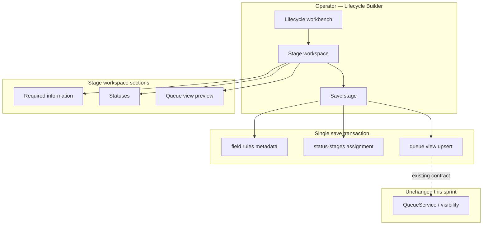

# Lifecycle Builder Hardening — Execution Plan

**Path:** `docs/sprints/archive/06_2026/lifecycle_builder_hardening_execution_plan.md`  
**Status:** Implementation planning — **do not implement** from this document until sprint kickoff  
**Date:** 2026-06-02  
**Scope:** Lifecycle Builder configuration plane only — **not** Lifecycle V2 features (Needs Attention, Tasks, Orchestration, workflows, runtime visibility, status ownership)

**Inputs:**

- [`lifecycle_v2_discovery_and_operating_model.md`](./lifecycle_v2_discovery_and_operating_model.md)
- [`lifecycle_builder_hardening_and_v2_canonical_model.md`](./lifecycle_builder_hardening_and_v2_canonical_model.md)
- [`lifecycle_builder_configuration_completion_fixes.md`](./lifecycle_builder_configuration_completion_fixes.md)

**North star:** Lifecycle Builder feels like a **polished production product** — operators configure **Stages**, trust saves, and never see implementation vocabulary.

---

## Executive summary

| Card | Theme | Primary deliverable |
|------|-------|---------------------|
| **1** | Stage Workspace Consolidation | Single stage shell replacing three disconnected save cards |
| **2** | Save Experience Hardening | One **Save stage** transaction + stable client state |
| **3** | Stage Defaults | Explicit empty baseline; optional template apply |
| **4** | Terminology Review | Operator copy map (no platform-wide renames) |
| **5** | Internal Leakage Removal | Remove `(config only)`, `needs_sync`, `lifecycle_wu_*` from UI |
| **6** | Lifecycle Activation UX | Single primary surface; demote legacy hub |

**Proposed implementation order:** 5 → 4 → 3 → 2 → 1 → 6 (copy/leakage first, then save plumbing, then layout consolidation, then activation cleanup).

Rationale: terminology and leakage fixes are low-risk and build trust immediately; unified save API must land before UI consolidation to avoid rework.

---

## Out of scope (explicit)

- Needs Attention authoring, task templates, orchestration links
- Workflow engine, event types, `operational_tasks` creation paths
- `lifecycleVisibilityEvaluator`, `QueueService` membership semantics
- Child-grain status filters, case/child rollup
- New tables or migrations (metadata + API composition only)
- Platform-wide rename of `work_units` table or routes

---

## Card 1 — Stage Workspace Consolidation

### 1.1 Current-state findings

**Primary surface:** `LifecycleActivationBoard` → `LifecycleStageConfiguration` → `LifecycleStageGuidedBoard`.

**Current layout:** Horizontal grid of **three equal cards** (plus validation slot), each with:

| Card | Component | Save button | Depends on |
|------|-----------|-------------|------------|
| Required Information | `LifecycleStageFieldRequirementsEditor` | Save Required Information | None |
| Statuses | `LifecycleStatusesCard` | Save Statuses | None |
| Work Unit Queue | `LifecycleStageWorkUnitCard` | Save Work Unit Queue | Saved statuses |

**Problems:**

1. **Three products, one stage** — operators complete card 2 and assume the stage is done; queue remains unpublished.
2. **Work Unit Queue** title reinforces wrong mental model (separate object vs stage output).
3. **Fixed 380px cards** — nested scroll; status lists cramped; validation relegated to fourth column.
4. **Actions Matrix** lives outside the stage workspace (department-level tab in board header).
5. **Auto-advance** after each card save (`confirmStep` → scroll to next) trains sequential saves but not unified completion.
6. **Duplicate legacy path** — `LifecycleHubClient` accordion wizard repeats Required / Statuses / Work Unit / Forms / Attention with different step order.

**Existing server capability (reuse):**

- `POST …/enrollment-process/stage-runtime-config` → `saveLifecycleStageRuntimeConfig` already atomically persists **status assignment + queue upsert + filter sync**.
- Field rules still use separate `PATCH …/lifecycle-requirements`.

### 1.2 UX recommendation — unified Stage Workspace

Replace the three-card grid with a **single stage shell**:

```
┌─────────────────────────────────────────────────────────────────────────┐
│  STAGE: Tour                                    [ Save stage ]  Saved ✓ │
│  Families visit your center — record outcomes and follow up.            │
├─────────────────────────────────────────────────────────────────────────┤
│  Progress:  Required info ○   Statuses ●   Queue view ○   (optional)   │
├─────────────────────────────────────────────────────────────────────────┤
│  ▾ Required information                                                 │
│     [entity dropdown]  field list Off / Rec / Req                       │
├─────────────────────────────────────────────────────────────────────────┤
│  ▾ Statuses                                                             │
│     Which CRM statuses belong in this stage?  [checkbox list]          │
├─────────────────────────────────────────────────────────────────────────┤
│  ▾ Queue view                                                           │
│     Display name: [ Tours          ]                                    │
│     Preview: Shows leads with Tour Scheduled, Tour Completed, …         │
│     (read-only — updates when you save)                                 │
├─────────────────────────────────────────────────────────────────────────┤
│  ▸ Actions for this stage          → opens drawer or scrolls to matrix  │
└─────────────────────────────────────────────────────────────────────────┘
```

**Interaction model:**

| Element | Behavior |
|---------|----------|
| **One primary CTA** | **Save stage** — disabled when nothing dirty; shows **Saving…** / **Saved** with timestamp |
| **Sections** | Accordion (default: expand first incomplete section) |
| **Progress strip** | Derived from saved state, not draft — avoids false “complete” |
| **Queue view** | No separate save; preview updates from draft statuses before save (client-side label list) |
| **Dirty indicator** | Header badge: “Unsaved changes” when any subsection dirty |
| **Stage switch** | Confirm dialog if dirty |

**Wireframe — mobile / narrow:**

```
┌──────────────────────────┐
│ ← Lead          [ Save ] │
│ Unsaved changes          │
├──────────────────────────┤
│ ▾ Required information   │
│ ▾ Statuses (2 selected)  │
│ ▸ Queue view             │
└──────────────────────────┘
```

**Wireframe — after save success (no flash):**

```
┌─────────────────────────────────────────────────────────────────────────┐
│  STAGE: Tour                         Saved just now ✓    [ Save stage ] │
│                                              (disabled — nothing to save)│
└─────────────────────────────────────────────────────────────────────────┘
```

### 1.3 Component mapping (implementation reference)

| Current | Target |
|---------|--------|
| `LifecycleStageGuidedBoard` + `GuidedCard` × 3 | `LifecycleStageWorkspace` (new shell) |
| `LifecycleStageFieldRequirementsEditor` | Section child — expose draft state upward |
| `LifecycleStatusesCard` | Section child — draft already in reducer |
| `LifecycleStageWorkUnitCard` | Section child — display name only; remove standalone save in guided mode |
| Per-card footers | Remove — single footer on shell |

### 1.4 Acceptance criteria (Card 1)

- [ ] Operator sees **one screen per stage** with clear stage name in header.
- [ ] No more than **one primary save button** per stage workspace.
- [ ] Queue view is labeled **Queue view**, not Work Unit Queue.
- [ ] Validation / Ready check remains accessible without occupying equal-width card grid.
- [ ] Legacy guided board grid removed or feature-flagged off after parity.

---

## Card 2 — Save Experience Hardening

### 2.1 Current-state findings

**Save paths today:**

| Domain | API | Post-save client behavior |
|--------|-----|---------------------------|
| Field rules | `PATCH …/lifecycle-requirements` | `loadConfig()` full refetch when no prefetch |
| Statuses | `PATCH …/status-stages` (+ optional WU sync) | Updates draft reducer; may reload pipeline |
| Queue only | `POST …/stage-runtime-config` | `onPipelineUpdated(snapshot)` |
| Status + queue (atomic) | Same POST | Used by WU card — **not** used for status-only save |
| Builder stages | `PATCH …/lifecycle-builder` | Catalog refresh |
| Actions matrix | `PATCH …/lifecycle-actions-matrix` | Full `load()` |
| Activation audit | `PATCH …/lifecycle-activation` | Metadata bump — parallel track |

**Flash / remount sources:**

1. `bootstrapLoading && !bootstrap` → **full skeleton grid** (`animate-pulse`) on stage switch.
2. Field requirements `loadConfig` after PATCH → editor state reset flicker.
3. `useLifecycleStageBootstrap` module cache — stale until `force` refresh; inconsistent with local edits.
4. `saveActivation` calls on many sub-saves — extra network; obscures what persisted.
5. Pipeline load (`loadingPipeline`) → WU card shows “Loading…”.
6. Multiple `setSaving` flags (`statusesSaving`, `fieldSaving`, `queueSaving`) — inconsistent global save state.

**What already works (keep):**

- `lifecycleStatusDraftReducer` + dirty guards (June 2026 fixes).
- `savingRef` double-submit guards on field requirements and actions matrix.
- `saveLifecycleStageRuntimeConfig` transactional server path.
- Bootstrap `patch()` helper for partial cache update.

### 2.2 Recommendation — single save experience

**Server: compose one endpoint (or orchestrate client-side with strict ordering)**

Preferred: extend `POST …/stage-runtime-config` (or new `POST …/stage-config`) body:

```typescript
{
  department_id: string;
  stage_key: string;
  field_rules?: { required_rule_ids: string[]; recommended_rule_ids: string[] };
  selected_status_keys: string[];
  queue_display_name?: string;
}
```

Server transaction order:

1. Persist field rules (`lifecycle_builder_stage_field_rules_v1` or progression override).
2. Persist status assignments (`persistEnrollmentStageStatusAssignments`).
3. Upsert queue view + filters (`upsertLifecycleStageWorkUnitForDepartment`).
4. Return unified snapshot: `{ field_requirements, status_keys, queue_view, saved_at }`.

**Client: save orchestration**

```
User clicks Save stage
  → set saveState = 'saving'
  → disable stage nav + section edits
  → POST unified payload (draft from all sections)
  → on success:
       - patch bootstrap cache (no full reload)
       - commit status draft reducer (commitSaved)
       - update pipeline snapshot from response
       - set saveState = 'saved' (auto-clear to idle after 3s)
       - notifyWorkspaceDepartmentsChanged (tile counts)
  → on error:
       - saveState = 'error' with message; draft preserved
```

**Optimistic updates (limited — config plane only):**

| Surface | Optimistic? | Notes |
|---------|-------------|-------|
| Field toggles | Local draft immediate | Already true |
| Status checkboxes | Local draft immediate | Already true |
| Queue display name | Local draft immediate | Already true |
| Progress strip / Saved badge | **After server OK only** | Do not optimistically mark complete |
| Workspace counts | After server OK | Bust cache event |

**Stable state handling:**

| Rule | Implementation |
|------|----------------|
| No skeleton if prior bootstrap exists | Stale-while-revalidate: show previous stage data dimmed while fetching |
| No `loadConfig()` after save | Merge PATCH/POST response into `stageData` |
| Stage switch | Block with modal if `isStageDirty` |
| Single `saveMutex` on board | One in-flight save for entire workspace |
| Refetch bootstrap | Only `force` on explicit “Refresh” or after external repair |

### 2.3 Acceptance criteria (Card 2)

- [ ] **No full-page or full-grid flash** on save success.
- [ ] **No full-page reload** (`router.refresh`, `window.location`, remounting board) on save.
- [ ] Operator always knows: **idle | unsaved | saving | saved | error** — one banner, one place.
- [ ] Save success does **not** clear status checkbox selections.
- [ ] Stage switch with dirty state shows **confirm discard** dialog.
- [ ] Double-click Save does not duplicate writes (`saveMutex`).
- [ ] Dev-only timing logs remain; no new production console noise.

---

## Card 3 — Stage Defaults

### 3.1 Current-state findings

**Stage creation (`add_stage`):**

- Creates metadata row with `key`, `label`, `description`, `sort_order` only.
- Does **not** assign statuses, field rules, actions, or queue view.
- `syncWorkUnitSortOrderFromBuilder` runs on reorder — not on create.

**Template lifecycle (first GET seeds Enrollment):**

- `defaultLifecycleBuilderV1()` adds **six platform stages** (Lead → Enrolled) with labels.
- Platform **field rules** still appear for enrollment operator keys via `effectiveFieldRulesForBuilderStage` → `effectiveFieldRulesForStage` → **platform defaults** even when department has **no override** (`source: "platform"`).
- UI shows these as **effective** requirements — operator may think they configured them.
- Status assignments: **empty** until operator saves.
- Queue view: **not created** until save (`not_created` state).
- Actions matrix: loads platform rows — enabled/disabled per org, not per new stage.

**Custom stages (non-enrollment keys):**

- Field palette: custom catalog subset (no stage filter on some rules).
- No platform field rule fallback unless operator-stage alias matches.
- Truly empty required info until operator sets toggles.

### 3.2 Gap vs product goal

Goal: *“New stages start with no statuses, no required info, and no actions selected unless intentionally configured.”*

| Default type | Statuses | Required info (UI) | Queue view | Actions |
|--------------|----------|-------------------|------------|---------|
| **Custom new stage** | Empty ✓ | Empty ✓ | Not created ✓ | Matrix independent |
| **Template stage (lead, tour, …)** | Empty until save ✓ | **Shows platform effective rules** ✗ | Not created ✓ | May show enabled rows ✗ |

### 3.3 Recommendations

**A. Explicit empty baseline (recommended)**

For builder UI **display**, treat “saved configuration” separately from “platform suggestions”:

| State | Operator sees |
|-------|---------------|
| Never saved field rules for stage | All fields **Off**; optional link: **Apply suggested requirements for {stage}** |
| Never saved statuses | Empty selection; helper: “Choose which statuses belong in this stage.” |
| Never saved queue | Queue view section collapsed with: “Save stage to publish queue view.” |

Implementation notes:

- API already exposes `has_department_override` / `field_rules_source` in requirements payload — use for UI gating.
- Platform defaults move to **suggestion panel**, not pre-toggled Req/Rec.
- Template lifecycles on create: offer **blank lifecycle** vs **Enrollment template** on create flow (template applies stage *names* only, not rules).

**B. Actions defaults**

- Actions Matrix: new stages do not auto-enable rows.
- Optional per-stage: “Suggested actions” chips (read-only) linking to matrix — no V2 scope expansion.

**C. Queue view naming**

- Default display name from `defaultWorkUnitQueueNameForStageKey` prefill in draft only — not persisted until Save stage.

### 3.4 Acceptance criteria (Card 3)

- [ ] New **custom** stage: all field toggles Off; zero statuses selected; queue unpublished.
- [ ] New **template** stage (e.g. Lead): same empty **saved** baseline; suggestions optional and clearly labeled.
- [ ] No automatic status assignment on stage create.
- [ ] No automatic queue row creation on stage create (only on Save stage).
- [ ] Creating a stage does not enable new action matrix rows.

---

## Card 4 — Terminology Review

### 4.1 Findings — operator-facing strings to change (builder scope only)

| Current | Problem | Recommended copy | Where |
|---------|---------|------------------|-------|
| Work Unit Queue | Implies separate product object | **Queue view** | Guided board, hub, WU card |
| Work Unit Queue name | Same | **Queue display name** | Input label |
| Save Work Unit Queue | Same | *(remove — use Save stage)* | Guided footer |
| Work unit | Internal | **Queue view** or omit | Errors, validation |
| work units visible | Internal | **Stage queues visible on workspace** | Ready check compact row |
| Activation validation | Jargon | **Ready check** | Validation card title |
| Activation | Implies publish event | **Setup** or **Ready check** | Audit metadata can stay internal |
| Required Information | OK but long | **Required information** (sentence case) | Section title |
| Save Required Information | Fragmented save | *(remove — Save stage)* | Footer |
| config only | Implementation | **Guidance only** or remove badge | Field editor |
| Primary record | Abstract | **{entity label}** e.g. Lead | Use `entity_display_labels` |
| Status key | Developer | **Status** | All builder copy |
| Operational Queue | Deprecated | Remove if any remain | Grep cleanup |
| Advanced configuration | OK | **Legacy setup** ( clearer ) | Settings shell toggle |
| Repair / dedupe | Support language | **Fix setup issue** (operator); keep Repair in dev | Conflict state |
| lifecycle_wu_* | Internal | Never show | WU card not-created message |

### 4.2 Terms to keep (familiar)

| Term | Why keep |
|------|----------|
| **Lifecycle** | Matches workspace tile |
| **Stage** | Core mental model |
| **Status** | CRM-familiar |
| **Actions** | Matches Settings → Action buttons |
| **Automations** | Do not rename (external hub) |

### 4.3 Queue vs status — helper copy (one canonical blurb)

> **Statuses** label where each lead is in your CRM. **Stages** group statuses for your team. The **queue view** is what staff see on the workspace for this stage — it includes leads whose status you selected above.

Place in Stage Workspace header or Statuses section footnote.

### 4.4 Acceptance criteria (Card 4)

- [ ] Glossary applied to all components in §4.1 table (builder + ready check + catalog list).
- [ ] No new user-facing strings contain “work unit” except Advanced/legacy link title if unavoidable.
- [ ] Platform route names, DB columns, test ids unchanged (`data-testid` may keep `work-unit` for stability).

---

## Card 5 — Internal Leakage Removal

### 5.1 Inventory of leaks (operator-visible today)

| Leak | Location | Operator-facing replacement |
|------|----------|----------------------------|
| `(config only)` | `LifecycleStageFieldRequirementsEditor.tsx` | Remove badge; optional **Guidance only** tooltip on enforced tiers (Card 2 hardening doc) |
| `needs_sync` / `not_created` / `synced` | `LifecycleStageWorkUnitCard` testids + copy | **Unpublished** / **Out of date — save again** / **Up to date** |
| `lifecycle_wu_{key}` monospace | WU card not-created message | Remove entirely |
| “Multiple active work unit rows…” | Conflict message | “Multiple queues found for this stage — use **Fix setup** in Ready check.” |
| `font-mono` internal keys | WU card | Remove |
| Debug panels | `LifecycleRuntimeIdentityDebug`, status JSON, `NEXT_PUBLIC_LIFECYCLE_DEBUG_UI` | Dev role or env only — never default |
| Technical validation lines | `lifecycleActivationTechnicalDetailLines` | Collapsed **Details for support** accordion |
| `needs_sync` in drift audit UI | `LifecycleQueueFilterDriftAudit` | Admin/debug route only |
| Enrollment pipeline snapshot jargon | Board load errors | Plain language |

### 5.2 `config_only` — technical meaning (implementers)

Keep `config_only` / `runtime_enforced` in **API payloads and tests**; remove from **rendered UI**. Enforcement tiers (future): Guidance vs Blocks actions — out of scope for hardening except removing the leak.

### 5.3 Acceptance criteria (Card 5)

- [ ] Grep `config only`, `needs_sync`, `lifecycle_wu_` in `web/components/adminV2/settings` → **zero operator-visible matches** (testids exempt with comment).
- [ ] WU card states use plain-English labels only.
- [ ] Ready check default view shows compact rows only; technical lines behind disclosure.
- [ ] Existing tests updated for copy (`lifecycleBuilderConfigurationCompletion.test.ts` pattern).

---

## Card 6 — Lifecycle Activation UX

### 6.1 Current-state findings

**Settings route:** `/adminV2/settings/lifecycle` → `LifecycleSettingsShell`:

```
LifecycleActivationClient → LifecycleBuilderPrimary → LifecycleActivationBoard   ← PRIMARY
[Advanced configuration toggle] → LifecycleHubClient                              ← LEGACY
```

**Naming debt:**

- Component names use **Activation** (`LifecycleActivationBoard`, `LifecycleActivationClient`) but product header says **Lifecycle**.
- `LifecycleActivationClient` is a thin wrapper — misleading name.
- Legacy hub duplicates: Required, Statuses, Work Unit, Forms, Attention cards with wizard nav.

**Catalog flow:**

- `LifecycleBuilderPrimary` → catalog select → board.
- Create lifecycle → department POST → builder metadata seed.

**Ready check:**

- Embedded in guided board column 4 / board footer as `LifecycleActivationValidation`.
- Compact checks: workspace tile, work units visible, queue filters, records query, actions configured.

### 6.2 Recommendations — single activation experience

**IA target:**

```
Settings → Lifecycle
  ├── Lifecycle catalog (list / create)
  └── Lifecycle workbench
        ├── Header: name, description, stages nav, Ready check link
        ├── Stage workspace (Card 1)
        └── Lifecycle menu: Actions matrix · Ready check
```

**Demote legacy hub:**

1. Rename toggle: **Advanced configuration** → **Legacy setup (deprecated)**.
2. Add banner inside legacy: “This setup path is deprecated. Use the stage workspace above.”
3. Remove duplicate Forms/Attention from legacy default path — link out to existing settings.
4. Phase 2 (post-hardening): remove legacy component entirely.

**Rename components (internal, optional sprint task):**

| Current | Suggested |
|---------|-----------|
| `LifecycleActivationBoard` | `LifecycleWorkbenchBoard` |
| `LifecycleActivationClient` | *(inline into shell)* |
| `LifecycleActivationValidation` | `LifecycleReadyCheck` |

Operator copy stays **Ready check** regardless of component rename.

**Remove parallel activation audit confusion:**

- `saveActivation` on every sub-save creates perception of multiple “activations.”
- After unified save: single audit bump on **Save stage** + lifecycle rename/delete only.

### 6.3 Wireframe — top-level Lifecycle settings

```
┌─────────────────────────────────────────────────────────────────────────┐
│ Lifecycle                                                                │
│ Configure stages and queue views for the workspace.                     │
├─────────────────────────────────────────────────────────────────────────┤
│ [ Enrollment ▼ ]  [ + New lifecycle ]                    [ Ready check ]│
├──────────┬──────────────────────────────────────────────────────────────┤
│ Stages   │  STAGE WORKSPACE (Card 1)                                    │
│ · Lead   │                                                              │
│ · Tour   │                                                              │
│ · Wait…  │                                                              │
│ [+ Add]  │                                                              │
├──────────┴──────────────────────────────────────────────────────────────┤
│ Actions matrix (lifecycle-wide)                                         │
└─────────────────────────────────────────────────────────────────────────┘
│ Legacy setup (deprecated) ▸  — collapsed by default                       │
└─────────────────────────────────────────────────────────────────────────┘
```

### 6.4 Acceptance criteria (Card 6)

- [ ] Default route shows **one** configuration experience (workbench).
- [ ] Legacy hub hidden behind collapsed deprecated toggle.
- [ ] Page subtitle updated — no “activation” jargon.
- [ ] Ready check reachable in ≤2 clicks from any stage.
- [ ] No duplicate status/requirements editors visible simultaneously.

---

## Proposed implementation order

### Slice 0 — Prep (0.5 day)

- Add feature flag or env `LIFECYCLE_BUILDER_HARDENING_V1` for incremental rollout.
- Inventory test files to update (list in PR template).

### Slice 1 — Card 5 + 4: Copy & leakage (1–2 days)

**Files (expected):**

- `LifecycleStageFieldRequirementsEditor.tsx`
- `LifecycleStageWorkUnitCard.tsx`
- `LifecycleStageGuidedBoard.tsx` (titles only)
- `LifecycleCatalogList.tsx`, `LifecycleStageWhereAppears.tsx`
- `EnrollmentProcessStageStatusesCard.tsx` (legacy hub string)
- `lifecycleActivationValidationCompact.ts` (compact labels)
- Tests: `lifecycleBuilderConfigurationCompletion.test.ts`, update snapshots

**Exit:** No implementation vocabulary in operator UI.

### Slice 2 — Card 3: Empty defaults UX (1–2 days)

**Files (expected):**

- `lifecycle-requirements/route.ts` — clarify `source` vs `saved` in payload
- `LifecycleStageFieldRequirementsEditor.tsx` — render Off when no override; suggestion panel
- Optional: lifecycle create flow “Blank vs Enrollment template”
- Tests: new `lifecycleStageEmptyDefaults.test.ts`

**Exit:** Custom stages truly empty; template stages show suggestions separately.

### Slice 3 — Card 2: Unified save API + client (2–3 days)

**Files (expected):**

- `saveLifecycleStageRuntimeConfig.ts` — accept optional `field_rules`
- New or extended route `stage-runtime-config` / `stage-config`
- `LifecycleActivationBoard.tsx` — `saveStageWorkspace()` orchestrator
- `useLifecycleStageBootstrap.ts` — merge response; stale-while-revalidate
- `LifecycleStageFieldRequirementsEditor.tsx` — stop post-save full reload
- Tests: extend `lifecycleStageRuntimeConfigContract.test.ts`; save idempotency

**Exit:** One save path; no flash; mutex + dirty guard.

### Slice 4 — Card 1: Stage Workspace shell (2–3 days)

**Files (expected):**

- New `LifecycleStageWorkspace.tsx`
- Replace `LifecycleStageGuidedBoard` usage in `LifecycleStageConfiguration`
- Remove per-card footers; single header CTA
- Tests: `lifecycleStageWorkspace.test.ts` (RTL); update guided board tests

**Exit:** Unified stage UX wireframe parity.

### Slice 5 — Card 6: Activation / shell cleanup (1 day)

**Files (expected):**

- `LifecycleSettingsShell.tsx` — deprecated legacy banner
- `lifecycle/page.tsx` — subtitle copy
- Reduce `saveActivation` calls to lifecycle-level events only
- Optional component renames + re-exports for compatibility

**Exit:** Single clear settings experience.

### Slice 6 — QA & polish (1–2 days)

Manual test plan from [`lifecycle_builder_configuration_completion_fixes.md`](./lifecycle_builder_configuration_completion_fixes.md) plus:

- [ ] Create lifecycle → add custom stage → configure → Save stage → Ready check pass → workspace counts
- [ ] Dirty switch stage → confirm dialog
- [ ] Rapid double Save → one network transaction
- [ ] No flash on save (visual recording / perf trace)
- [ ] Legacy hub still works when expanded

---

## Global acceptance criteria (sprint exit)

| # | Criterion |
|---|-----------|
| G1 | Operator configures a stage in **one workspace** with **one save** |
| G2 | **No page flash, reload, or full-grid skeleton** on successful save |
| G3 | Save state is always clear: unsaved / saving / saved / error |
| G4 | New stages start **empty** (with optional suggestions for templates) |
| G5 | **No implementation terms** in operator UI (Card 5 table) |
| G6 | Terminology follows Card 4 glossary in builder + ready check |
| G7 | Legacy hub deprecated and collapsed — primary path only by default |
| G8 | `cd web && npx tsc --noEmit` clean |
| G9 | Focused lifecycle builder test suite green (see slice tests) |
| G10 | **No runtime visibility / queue membership behavior changes** (config plane only) |

---

## Risk register

| Risk | Mitigation |
|------|------------|
| Unified save partial failure | Server transaction with ordered steps; return which step failed |
| Template empty-defaults confuse enrollment pilots | “Apply enrollment suggestions” one-click; document in Ready check |
| Test id churn | Keep `data-testid` stable where tests depend on old names |
| Legacy hub removal breaks power users | Keep deprecated toggle one release |
| Field rules + status save regression | Extend existing contract tests; no QueueService edits |

---

## Appendix A — Canonical diagram (configuration plane)



---

## Appendix B — File touch list (estimated)

| Area | Files |
|------|-------|
| Stage shell | `LifecycleStageWorkspace.tsx` (new), `LifecycleStageConfiguration.tsx`, `LifecycleStageGuidedBoard.tsx` |
| Save | `saveLifecycleStageRuntimeConfig.ts`, `stage-runtime-config/route.ts`, `LifecycleActivationBoard.tsx` |
| Field rules | `LifecycleStageFieldRequirementsEditor.tsx`, `lifecycle-requirements/route.ts` |
| Queue UI | `LifecycleStageWorkUnitCard.tsx` |
| Statuses | `LifecycleStatusesCard.tsx`, `lifecycleStatusDraftReducer.ts` |
| Shell | `LifecycleSettingsShell.tsx`, `lifecycle/page.tsx` |
| Ready check | `LifecycleActivationValidation.tsx`, `lifecycleActivationValidationCompact.ts` |
| Tests | `lifecycleStageRuntimeConfigContract.test.ts`, `lifecycleBuilderConfigurationCompletion.test.ts`, new workspace tests |

---

## Appendix C — Related docs (do not duplicate)

- V2 feature scope: [`lifecycle_v2_discovery_and_operating_model.md`](./lifecycle_v2_discovery_and_operating_model.md) §3–6
- Work unit doctrine: [`lifecycle_builder_hardening_and_v2_canonical_model.md`](./lifecycle_builder_hardening_and_v2_canonical_model.md) §3
- Prior bugfixes: [`lifecycle_builder_configuration_completion_fixes.md`](./lifecycle_builder_configuration_completion_fixes.md)

---

*End of execution plan — ready for sprint kickoff and ticket breakdown.*
