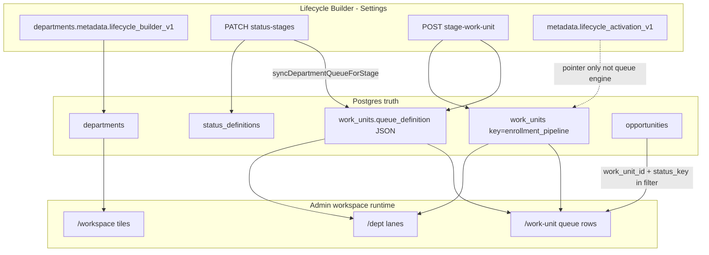

# Lifecycle Runtime Binding Audit

**Path:** `docs/sprints/archive/06_2026/lifecycle_runtime_binding_audit.md`  
**Status:** Audit only — **no fixes** in this document  
**Date:** 2026-06-02  
**Example under review:** Lifecycle **Lead Management**, stage **Lead**, status **New Lead**, work unit name **New Leads**

---

## Executive answer

Lifecycle Builder creates **both**:

| Layer | Created? | Where it lives |
|-------|----------|----------------|
| **A) Configuration / metadata** | Yes | `departments.metadata` (`lifecycle_builder_v1`, `lifecycle_activation_v1`, `lifecycle_builder_owned_v1`) + `status_definitions.metadata` |
| **B) Runtime operational rows** | Yes (when steps complete) | `departments`, `work_units`, `status_definitions` (org rows), `opportunities` (only when leads exist) |

Runtime **does not** read `lifecycle_builder_v1` or `lifecycle_activation_v1` to render queues. It reads **`work_units`** (especially `key`, `name`, `queue_definition`) and **`opportunities`** (`work_unit_id`, `status_key`) plus **`status_definitions`** for stage assignment metadata.

The mismatch in the example is almost always one or more of:

1. **Wrong department** on `/workspace` or `/dept` (shared **Enrollment** dept vs builder-owned **Lead Management** dept).
2. **Naming confusion** — “New Leads” in the builder is often the **queue lane label** (`new_leads`), while `/dept` shows the **work unit container** name (`work_units.name`), which defaults to **Enrollment pipeline** / title-cased **Enrollment Pipeline** when not saved.
3. **Zero records** — `opportunities.work_unit_id` is null or points at a different work unit; and/or `status_key` on rows does not match the **lane filter** after status save (e.g. Create Lead uses `new_inquiry`, custom status uses `new_lead`).

---

## 1. What drives each runtime surface

### 1.1 `/workspace` — department tiles

| Concern | Source of truth | Table / field |
|---------|-----------------|----------------|
| Tile visible | Active department in org + access scope | `departments.is_active`, `departments.id` |
| Tile title | Department display name | `departments.name` |
| Tile subtitle | Optional description | `departments.description` |
| Which rows appear | Server list + scope filter | `GET /api/admin/departments` → `fetchWorkspaceActiveDepartments` (`web/lib/workspace/workspaceActiveDepartments.ts`) |

**Lifecycle Builder linkage:**

- Creating a lifecycle (activation mode) inserts a **new** `departments` row (`POST /api/admin/departments`) with `metadata.lifecycle_builder_owned_v1` and process config in `metadata.lifecycle_builder_v1`.
- Tile name should match **process name** (e.g. “Lead Management”) on `departments.name`, not the legacy shared “Enrollment” department.
- `lifecycle_builder_v1` is **not** read when painting workspace tiles.

**Catalog vs runtime ID:** Settings catalog entries use `department_id` + `process_id`. Runtime workspace uses **`departments.id`** only. If catalog “Use runtime department” drift exists, operators can open the wrong tile while believing they configured Lead Management.

---

### 1.2 `/dept/{departmentId}` — work unit list / throughput panel

| Concern | Source of truth | Table / field |
|---------|-----------------|----------------|
| Department context | Row by route id | `departments` (`id`, `name`, `metadata`) |
| Work units listed | All WUs for department | `work_units` where `work_units.department_id = departmentId` |
| “Pipeline” detection | Fixed key + queue JSON layout | `work_units.key = 'enrollment_pipeline'` + `work_units.queue_definition` (v2 `domain_with_attention` coerced to pipeline layout in runtime bundle) |
| Throughput lane cards | **Queues inside one WU**, not separate WUs | `queue_definition.queues[]` + `ui.sections` (`web/lib/workspace/extractPipelineExecutionLanes.ts`) |
| Panel title (header) | **Prefer** `work_units.name`, else title-case `key` | `resolveDeptWorkUnitDisplayLabel` (`web/lib/workspace/workUnitShellDisplayTitle.ts`) |
| Lane labels (e.g. “New Leads”) | Queue lane `label` in JSON | e.g. `queues[].key = 'new_leads'`, `label = 'New Leads'` in `enrollmentPipelineQueueDefinitionV2.ts` |
| Lane counts | Filtered opportunity counts | `QueueService.getWorkUnitQueueSummaries` → `opportunities` filtered by `work_unit_id` + lane filters |

**Important:** Lifecycle Builder does **not** create one work unit per stage. It creates **one** `enrollment_pipeline` work unit per lifecycle department. Stages map to **lanes** inside that unit’s `queue_definition` (for operator stage `lead` → lane key `new_leads` per `ENROLLMENT_STAGE_QUEUE_KEYS` in `web/lib/lifecycle/enrollmentProcessStageQueueKeys.ts`).

**Why “Enrollment Pipeline” appears on `/dept`:**

| Cause | Mechanism |
|-------|-----------|
| Default name on create | `POST …/stage-work-unit` uses `name` body or fallback **`"Enrollment pipeline"`** (`web/app/api/admin/enrollment-process/stage-work-unit/route.ts`) |
| Key-based label | If `work_units.name` is empty, `resolveDeptWorkUnitDisplayLabel` title-cases `key` → **`Enrollment Pipeline`** from `enrollment_pipeline` |
| Not the lane label | Lane **“New Leads”** is `queues[new_leads].label` inside JSON — shown as a **card under** the pipeline panel, not as the panel title |
| Wrong department | Shared org **Enrollment** department still has its own `enrollment_pipeline` WU named “Enrollment Pipeline” |
| Settings-only copy | `lifecycleStageWorkspaceMapping.ts` hardcodes `workUnitName: "Enrollment Pipeline"` for **Settings preview** — not used by `/dept` bootstrap |

---

### 1.3 `/dept/.../work-unit/{workUnitId}` — queue records

| Concern | Source of truth | Table / field |
|---------|-----------------|----------------|
| Work unit row | Primary key | `work_units.id` |
| Must belong to dept | FK | `work_units.department_id` |
| Queue tabs / lanes | Parsed from | `work_units.queue_definition` |
| Row membership (hard gate) | SQL equality | `opportunities.work_unit_id = workUnitId` |
| Row status filter | Lane filters | `queue_definition.queues[key].filters` / `filters_compat_v1` (types `case_status` / `status`) |
| Status allow-list values | After builder status save | Keys assigned to stage in `status_definitions.metadata.enrollment_operator_stage` + synced into lane filters via `applyStageStatusKeysToQueueDefinition` |

**Entry path:** `getWorkUnitQueueItems` / `getWorkUnitQueueSummaries` in `web/lib/queues/QueueService.ts` — always scopes opportunities to **`org_id` + `work_unit_id`**, then applies lane filter ops.

**Needs Attention** lanes use a separate resolver path (`loadOpportunityNeedsAttentionRows`) but still require `work_unit_id` on opportunities for the attention work unit.

---

## 2. Lifecycle-created objects — config vs runtime vs queue filters

For one builder-owned lifecycle (example: **Lead Management**):

### 2.1 Config record (not executed by QueueService)

| Artifact | Storage | Purpose |
|----------|---------|---------|
| Process + stages | `departments.metadata.lifecycle_builder_v1` | Builder UI: process `id`, `name`, `stages[].key` / `label` |
| Activation wizard state | `departments.metadata.lifecycle_activation_v1` | Points at `process_id`, `stage_key`, `status_keys[]`, `work_unit_id`, `work_unit_name` — **audit / validation**, not queue execution |
| Builder-owned marker | `departments.metadata.lifecycle_builder_owned_v1` | Delete/repair guards |

**IDs:** Process and stage IDs are **UUIDs inside JSON**, not foreign keys in Postgres.

### 2.2 Runtime record (what workspace executes)

| Artifact | Table | Typical values (Lead Management example) |
|----------|-------|------------------------------------------|
| Department | `departments` | `id` = runtime dept UUID, `name` = “Lead Management”, `key` = slugified name |
| Work unit | `work_units` | `department_id` = above, **`key` = `enrollment_pipeline` (fixed)**, `name` = operator-entered or default “Enrollment pipeline”, `queue_definition` = v2 JSON blob |
| Status definitions | `status_definitions` | `entity_type = 'opportunities'`, `status_key` = e.g. `new_lead` or `new_inquiry`, `metadata.enrollment_operator_stage` = `lead` after status save |
| Opportunities | `opportunities` | Only if created — must have **`work_unit_id`** = pipeline WU id and **`status_key`** matching lane filter |

**Missing link:** `lifecycle_activation_v1.work_unit_id` is **not** applied automatically to new opportunities. Create Lead sets `work_unit_id` only from **action context** (`executeCreateLeadAction` in `web/lib/admin/actions/entryLifecycleActions.ts`).

### 2.3 Queue filter record (inside work unit JSON)

| Artifact | Location | Lead stage behavior |
|----------|----------|---------------------|
| Lane key | `queue_definition.queues[].key` | Operator stage `lead` → lane **`new_leads`** only (`ENROLLMENT_STAGE_QUEUE_KEYS`) |
| Lane label | `queues[new_leads].label` | Default **“New Leads”** (canonical template) |
| Executable filters | `filters` (`case_status`) + `filters_compat_v1` (`status`) | **Replaced** on status save with selected `status_keys` for that stage |

Sync paths:

1. `PATCH /api/admin/enrollment-process/status-stages` → `syncDepartmentQueueForStage` (`web/lib/lifecycle/syncDepartmentQueueForStage.ts`)
2. Optional repair: `PATCH …/stage-work-unit` with `sync_statuses: true`

Validation compares activation `status_keys` to lane filters via `queueStatusKeysForOperatorStage` (`web/lib/lifecycle/parseEnrollmentPipelineQueues.ts`).

---

## 3. Builder creates metadata only, or real `work_units`?

**Answer: B — real runtime rows**, plus metadata.

| Step | API / action | Writes |
|------|----------------|--------|
| Create lifecycle | `POST /api/admin/departments` + `PATCH …/lifecycle-builder` `create_process` | **`departments`** row + `metadata.lifecycle_builder_v1` |
| Assign statuses | `PATCH …/status-stages` | **`status_definitions.metadata`** (`enrollment_operator_stage`) |
| Create / name queue | `POST …/stage-work-unit` | **`work_units`** insert (`key` always `enrollment_pipeline`) |
| Save activation bundle | `PATCH …/lifecycle-activation` | **`metadata.lifecycle_activation_v1`** only |
| Save actions matrix | `PUT …/lifecycle-actions-matrix` | **`action_placements`** + **`action_definitions`** (org-scoped) |

Nothing in `lifecycle_builder_v1` is consulted when loading queue rows on `/work-unit`.

---

## 4. End-to-end trace (binding chain)



| Step | What operator does | Persisted | Runtime consumer |
|------|-------------------|-----------|------------------|
| 1 | Create lifecycle “Lead Management” | `departments` + `lifecycle_builder_v1` | `/workspace` → `departments.name` |
| 2 | Add stage `lead` (platform key) | Stage in JSON | Status-stages API validates stage key |
| 3 | Save status “New Lead” on stage | `status_definitions.metadata.enrollment_operator_stage = lead` | Grouping in status-stages payload |
| 3b | (automatic) | `queue_definition` lanes for `lead` updated with **status key strings** | `QueueService` lane filters |
| 4 | Save work unit name “New Leads” | `work_units.name` (key stays `enrollment_pipeline`) | `/dept` panel title via `resolveDeptWorkUnitDisplayLabel` |
| 5 | Open `/dept` | — | Loads `work_units` for dept; picks pipeline WU; renders **lane** “New Leads” |
| 6 | Open `/work-unit/{id}` | — | Queries `opportunities` where `work_unit_id = id` AND status in lane filter |
| 7 | Create lead (if any) | `opportunities` row | Default `status_key = new_inquiry` unless context passes WU id |

---

## 5. Why “Enrollment Pipeline” instead of “New Leads”

| Expectation | Actual runtime model |
|-------------|----------------------|
| `/dept` shows work unit named “New Leads” | **One** pipeline work unit; **“New Leads”** is usually the **lane** (queue key `new_leads`), not `work_units.name` |
| Renaming in builder changes dept title | Only if `work_units.name` was saved (POST/PATCH `stage-work-unit`); otherwise title falls back to **Enrollment pipeline** / **Enrollment Pipeline** |
| New lifecycle gets a new pipeline **key** | Key is **always** `enrollment_pipeline` — custom lifecycles do not get a new `work_units.key` |

**Concrete checks (for debugging, not implemented here):**

```sql
-- Replace IDs from Settings / activation debug
SELECT id, name, key, description FROM departments WHERE name ILIKE '%Lead Management%';
SELECT id, department_id, key, name FROM work_units WHERE department_id = '<dept_id>';
SELECT status_key, metadata->>'enrollment_operator_stage' AS stage
  FROM status_definitions WHERE org_id = '<org_id>' AND entity_type = 'opportunities';
```

Compare `work_units.id` to `opportunities.work_unit_id` for the same org.

---

## 6. Why the queue shows zero records

Runtime requires **all** of the following:

| # | Requirement | Common failure |
|---|-------------|----------------|
| 1 | Correct `departmentId` in URL | Viewing shared Enrollment dept instead of Lead Management dept |
| 2 | `opportunities.work_unit_id` = lifecycle pipeline `work_units.id` | Leads created without `work_unit_id` in action context; legacy rows on another WU |
| 3 | `opportunities.status_key` ∈ lane filter set | Create Lead uses **`new_inquiry`** (`NEW_LEAD_STATUS_KEY`); builder assigned custom **`new_lead`** only → filter mismatch |
| 4 | Lane filter synced after status save | Stale `queue_definition` if sync failed (non-operator stage key, no WU yet); repair via `sync_statuses` |
| 5 | Operator stage `lead` for lane mapping | Custom stage slug not in `LIFECYCLE_STAGE_ORDER` → `syncDepartmentQueueForStage` skipped in status-stages PATCH |
| 6 | Access scope | `recordScopeConstraints` excludes all rows (restricted site/dept scope) |
| 7 | Active status definitions | Status inactive or org override missing |

**Filter mechanics (lane `new_leads`):**

- After save, `filters_compat_v1` contains `{ type: 'status', values: [<selected status_keys>] }`.
- `QueueService` applies `eq('work_unit_id', …)` **before** status filter.
- Records with **null** `work_unit_id` never appear regardless of status.

**Canonical vs custom status (Lead stage):**

| Source | Typical keys |
|--------|----------------|
| Platform canonical (`enrollmentProcessStageBindings.ts`) | `new_inquiry`, `open`, `new` |
| Custom builder assignment | Any valid `status_key` regex — e.g. `new_lead` |
| Create Lead action | **`new_inquiry`** always |

If the operator selected only `new_lead` in the builder but leads were created via Create Lead, counts will be **0** until status or filter alignment changes.

---

## 7. ID and mapping reference (Lead Management example)

Use placeholders; resolve from DB for your org.

| Concept | Typical storage | Notes |
|---------|-----------------|-------|
| Lifecycle name | `departments.name` | Workspace tile |
| Process id | `lifecycle_builder_v1.processes[].id` | UUID in metadata |
| Stage key | `stages[].key` | Must be platform `lead` for queue sync |
| Stage label | `stages[].label` | Display only |
| Status key | `status_definitions.status_key` | Drives filters + opportunity rows |
| Status → stage | `status_definitions.metadata.enrollment_operator_stage` | Set by status-stages PATCH |
| Pipeline WU id | `work_units.id` where `key = enrollment_pipeline` | **The** runtime queue container |
| Activation pointer | `lifecycle_activation_v1.work_unit_id` | Should match pipeline WU id after queue step |
| Lane | `queue_definition.queues[key=new_leads]` | Label “New Leads”; not a separate WU |
| Opportunity binding | `opportunities.work_unit_id`, `opportunities.status_key` | **Authoritative for row visibility** |

---

## 8. Missing links summary

| Link | Expected by operator | Actual binding |
|------|---------------------|----------------|
| Lifecycle config → queue rows | Builder JSON drives rows | **Only** via `work_units` + `status_definitions` + `opportunities` |
| Work unit display name → `/dept` title | “New Leads” | **Lane label** unless `work_units.name` saved |
| Stage setup → automatic leads | Records appear after config | **No** opportunities created by builder |
| Activation `work_unit_id` → new opps | Implicit | **Only** if create/action context passes WU id |
| Custom status label “New Lead” | Matches Create Lead | Create Lead uses **`new_inquiry`** key unless changed |
| Separate WU per stage | Multiple queues on `/dept` | **Single** `enrollment_pipeline` with multiple **lanes** |

---

## 9. Related docs

- `docs/sprints/archive/06_2026/lifecycle_runtime_orchestration_audit.md` — workflows/actions (side effects), not queue binding
- `docs/sprints/archive/06_2026/lifecycle_actions_matrix_and_validation_cleanup.md` — builder actions + validation behavior
- `docs/archive/2026-06-superseded-system/workspace-system.md` — workspace queue semantics (if present in repo)

---

## 10. Suggested verification checklist (manual, no code changes)

1. On Settings lifecycle board, note **runtime department id** and **work unit id** from activation / validation debug.
2. On `/workspace`, confirm tile **name** is Lead Management and open **that** `departmentId`.
3. Query `work_units` for that department: confirm one row, `key = enrollment_pipeline`, note `name` vs expected “New Leads”.
4. Inspect `queue_definition` for `new_leads` lane filter values vs assigned status keys.
5. Count `opportunities` where `work_unit_id` = pipeline id and `status_key` in those filter values.
6. Create a test lead from **that** dept/work-unit surface with explicit `work_unit_id` in context and re-check count.

This audit explains the observed gap without changing runtime behavior.
