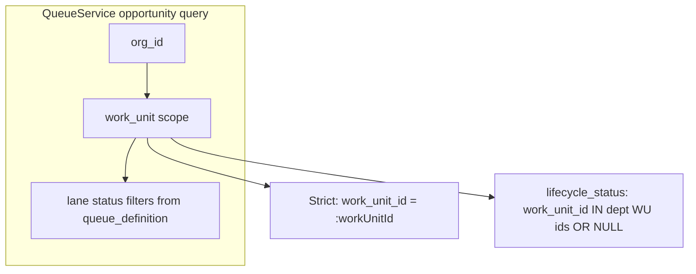

# Lifecycle runtime visibility — architecture decision review

**Path:** `docs/sprints/archive/06_2026/lifecycle_runtime_visibility_architecture_decision.md`  
**Status:** **Decision pending** — no implementation until approved  
**Date:** 2026-06-02  
**Related:** [lifecycle_runtime_visibility_model_review.md](./lifecycle_runtime_visibility_model_review.md) (operational audit)

**Hard stop:** No queue refactors, attach/migrate automation, visibility patches, or assignment work until this decision is reviewed and accepted (or amended).

---

## Decision context

Alloy is moving from:

```text
Department → Work Unit → Enrollment Pipeline (single execution container, lane filters)
```

toward:

```text
Lifecycle Builder → Process → Stages → Status mappings → Operational views (primary configuration)
```

Before more runtime code accumulates, we must decide whether **`opportunities.work_unit_id`** is allowed to remain the **visibility gate** for lifecycle queues, or whether **lifecycle rules** become the primary visibility authority with assignment as a separate concern.

**Example forcing the question:**

| Fact | Value |
|------|--------|
| Lead Management lifecycle, Lead stage filter | `new_inquiry` |
| Org opportunities with `status_key = new_inquiry` | **17** |
| Their `work_unit_id` | Enrollment department pipeline (`5ba90557-…`) |
| Lead Management queue count | **0** |

Is that exclusion **correct product behavior** (separate operational workspaces), or **accidental coupling** (assignment mistaken for visibility)?

This document does **not** assume the current code path is correct.

---

## Executive recommendation (for review)

| Horizon | Model | Summary |
|---------|--------|---------|
| **North star (3–5y)** | **Model C — Hybrid** | **Visibility** from lifecycle configuration (process, stage, status, rules, orchestration). **Assignment** (`work_unit_id` or successor) for execution home, actions, audit, and default BOS scope — **decoupled** where lenses differ. |
| **Near term (next runtime phase)** | **Model B within lifecycle department** | Stage work units are **filtered operational views**: `status` lane filters + **lifecycle department boundary**. Do **not** org-wide status-inbox all `new_inquiry` into every lifecycle. |
| **Explicit non-goal (until policy)** | Auto-show Enrollment cohort in Lead Management | Cross-department visibility requires **cutover policy** or **federation config**, not another queue patch. |

**Verdict on the 17 rows:** Excluding them from **Lead Management** is **correct** if Lead Management is a **new operational workspace** (greenfield). It is **incorrect** only if product defines **Lead Management as the org-wide inbox for all `new_inquiry`** regardless of department — that is Model B at org scope and **breaks multi-lifecycle coexistence**.

---

## Current model (as built today)

### Configuration vs execution

| Layer | Storage | Runtime reads it for queues? |
|-------|---------|-------------------------------|
| Lifecycle Builder process/stages | `departments.metadata.lifecycle_builder_v1` | **No** (indirect via created WUs) |
| Activation wizard state | `lifecycle_activation_v1` | **No** (Settings/validation; Create Lead entry binding now uses process config) |
| Stage work units | `work_units` (`lifecycle_wu_*`, `queue_definition`, metadata) | **Yes** |
| Opportunity row | `opportunities.status_key`, `opportunities.work_unit_id` | **Yes** |

Opportunities have **no `department_id`**. Department is inferred via `work_units.department_id` on the assigned work unit.

### Queue visibility (inconsistent hybrid)



| Route | Scope mode | Effective behavior |
|-------|------------|-------------------|
| `/dept` bootstrap summaries | `lifecycle_status` + dept WU id list | Status lens **within department** |
| `/work-unit` bootstrap / `GET …/work-units/:id/queues` (often) | Missing preload → **strict** | Assignment lens only |
| Legacy Enrollment `/work-unit` | `work_unit_id` | Assignment container |

**Lane filters always apply** — visibility is never “all rows on the work unit”; it is **scope ∩ status filter**.

### Writes

| Action | Sets `work_unit_id`? | Sets `status_key`? |
|--------|----------------------|-------------------|
| Create Lead (builder-owned) | Yes → `lifecycle_wu_{entryStage}` | Yes → `new_inquiry` |
| Status transitions / admin actions | Often implied | Yes |
| Attach-records (manual) | Yes (reassign) | No |

### Diagnosis

The platform **behaves like Model A** on several hot paths while **partially implementing Model B** on dept bootstrap. That inconsistency produces “0 records” confusion and pushes **attach/repair** as a tactical fix for what is actually an **undeclared architecture**.

---

## Alternative models

### Model A — Assignment driven

**Visibility ≈ `opportunities.work_unit_id` (plus lane filters inside that cohort).**

```text
Visible in queue  ⇔  work_unit_id = :workUnitId  AND  status_key ∈ laneFilter
```

| Pros | Cons |
|------|------|
| Simple; matches early hierarchy schema (“operational cohort”) | Empty lifecycle until mass reassignment |
| One home per record; easy KPI/reporting by WU | **Cannot** show same opp in two lifecycle depts without moving FK |
| Aligns with jobs pattern | Lifecycle Builder becomes “labeling containers” after the fact |
| Predictable BOS scope from drawer row | Status-only operators see “broken” queues |

**Long-term fit with Lifecycle Builder as primary:** **Poor** unless every lifecycle transition **must** move `work_unit_id` (high friction, workflow-heavy).

---

### Model B — Lifecycle filter driven

**Visibility ≈ lifecycle rules (status, stage, orchestration, attention) with weak or no `work_unit_id` gate.**

```text
Visible in Lead Management Lead lane  ⇔  lifecycle_rules_match(opp, LeadManagement, leadStage)
```

| Pros | Cons |
|------|------|
| Lifecycle Builder is **source of truth** for who sees what | **Today:** no `lifecycle_id` on opportunity — rules must be inferred |
| Same opp can appear in multiple lenses **if rules allow** | BOS/actions still need a **home** — assignment cannot disappear silently |
| Supports oversight, regional lenses, AI views | Org-wide status inbox **collides** across lifecycle departments |
| Matches “operational view” language | Reporting/KPI semantics explode without second dimension |

**Variants (must pick explicitly):**

| Variant | Boundary | 17 Enrollment `new_inquiry` in Lead Management? |
|---------|----------|--------------------------------------------------|
| **B-org** | Status only, org-wide | **Yes** — also still in Enrollment (duplicate UX) |
| **B-dept** | Status + lifecycle **department** | **No** — same as current dept-scoped partial impl |
| **B-multi** | Status + explicit lifecycle membership table | Policy-driven per lifecycle |

**Long-term fit:** **Strong** if Alloy commits to **lifecycle as first-class runtime identity** (not only JSON on `departments`).

---

### Model C — Hybrid (recommended north star)

**Separate assignment from visibility.**

| Concept | Purpose | Example |
|---------|---------|---------|
| **Assignment** | Execution home, action routing, audit, default drawer context, KPI anchor | `work_unit_id = lifecycle_wu_qualification` |
| **Visibility** | Which operational lenses include the row | Lead Management Lead lane: `new_inquiry` + rules |
| **Orchestration / BOS** | May use **either** or **derived lifecycle context** | Recommend follow-up on opp open in any matching lens |

**Target behavior (illustrative — not implemented):**

```text
Assignment:     work_unit_id → lifecycle_wu_qualification
Visible in:
  - Lead Management / Qualification lane     (status + lifecycle dept rules)
  - Enrollment / legacy lane                (until cutover removes membership)
  - Needs Attention overlay                 (resolver, not WU equality)
  - BOS “stale new inquiry” lens            (rule on status + age, not WU)
```

**Requirements Model C implies (platform gaps today):**

1. **Lifecycle identity on the opportunity** — e.g. `primary_lifecycle_department_id`, `lifecycle_memberships[]`, or derived registry from Builder — not only `work_unit_id`.
2. **Visibility engine** — evaluates Builder process/stage/status rules per lens; `QueueService` calls it instead of hard `.eq(work_unit_id)`.
3. **Assignment policy** — when status changes, whether WU auto-moves, stays until operator confirms, or diverges intentionally.
4. **Single implementation** on dept, work-unit, API, validation — no strict fallback.

| Pros | Cons |
|------|------|
| Supports Builder as **primary config** | Requires schema and/or rule engine investment |
| Multi-lens, BOS, oversight without duplicate rows | Temporary **drift** between assignment and visible lenses |
| Clean cutover story (policy, not queue hacks) | Migration + operator training |
| Legacy pipeline can fade via **rule sunset**, not row moves only | Harder to explain in v1 operator docs |

---

## Answers to required questions

### 1. What was the original purpose of `work_unit_id`?

From schema doctrine (`work_units` table comment, consolidation audit, workspace-system):

| Original intent | Description |
|-----------------|-------------|
| **Operational cohort** | Group jobs/opportunities for queue execution **within a department** |
| **Queue definition anchor** | `work_units.queue_definition` defines lanes; membership was **rows pointing at this WU** |
| **Org integrity** | FK + triggers: opportunity `org_id` must match work unit’s org |
| **Department proxy** | Opportunities lack `department_id`; WU → `department_id` routes dept scope |
| **Not originally “lifecycle”** | Enrollment used **one** `enrollment_pipeline` WU with **many status lanes**, not one WU per stage |

Lifecycle Builder **reused** `work_units` as stage containers (`lifecycle_wu_*`), stretching the cohort metaphor into **per-stage ownership** without a separate visibility layer.

---

### 2. What runtime surfaces currently depend on `work_unit_id`?

**High coupling (behavior changes if FK ignored):**

| Surface | Dependence |
|---------|------------|
| **QueueService** (summaries, items, needs_attention fetch) | Primary filter `.eq(work_unit_id)` or partial dept-scoped OR |
| **Dept operational bootstrap** | Summaries per WU id; pipeline detection by `enrollment_pipeline` key |
| **Work-unit operational bootstrap** | Route `workUnitId`; queue cache keyed by WU |
| **Create Lead / entry lifecycle actions** | Writes `work_unit_id` on insert |
| **Attach-records** | Updates `work_unit_id` only |
| **Record scope constraints** (site filter) | Often `.in(work_unit_id, …)` |
| **Child-grain enrollment queues** | Join filters on `opportunities.work_unit_id` |
| **Drawer bootstrap / prefetch** | Context from row or opportunity GET |
| **Action placements / contextual actions** | `action_placements.work_unit_id`, resolved from WU context |
| **KPI placements** | `workspace_kpi_placement.work_unit_id` for work-unit surface |
| **Workflow scope metadata** | `workflow_scope.work_unit_id` matching |
| **Workflow Assist / workspace scope** | Publishes `work_unit_id` into assist context |
| **BOS operational recommendations** | `work_unit_id` on recommendation payload / grounding |
| **Intake / forms routing** | Default `work_unit_id` on submit paths |
| **Placement / waitlist candidate rows** | Tied to opportunity WU in enrollment grains |
| **Status transition rules** (where scoped) | Can be WU-scoped in catalog |
| **Validation / attach tooling** | Counts split “on WU” vs “in dept scope” |

**Moderate coupling (uses WU for context, not always membership):**

| Surface | Dependence |
|---------|------------|
| **Needs Attention resolver** | Fetches candidates from **execution** WU; reasons cross status |
| **BOS routing** | Workspace scope seeding |
| **Reporting / exports** (where present) | Often group by WU or dept-via-WU |

**Low coupling (should not depend on WU, but may read it for display):**

| Surface | Dependence |
|---------|------------|
| **Entity GET / RRS** | Authoritative row includes `work_unit_id` field |
| **Workflow event emission** | May carry WU in payload from context |

**Conclusion:** **`work_unit_id` is deeply embedded as assignment and as queue cohort gate.** Decoupling visibility requires a **central visibility contract** used by `QueueService`, not one-off lifecycle patches.

---

### 3. Should lifecycle visibility be derived from assignment, filters, or hybrid?

| Option | Recommendation |
|--------|----------------|
| Assignment only (A) | **Reject** as primary lifecycle model — blocks Builder vision |
| Filters only (B) | **Reject** as sole model without assignment home — breaks actions/KPI/BOS |
| **Hybrid (C)** | **Accept** as target |

**Phased interpretation:**

1. **Now (policy):** Treat builder `lifecycle_wu_*` as **stage lenses** (B-dept): visibility = **status filters ∩ lifecycle department boundary**; assignment still written on create.
2. **Next (engineering):** Unify queue entry points on one scope function; document operator copy for greenfield vs cutover.
3. **Later (platform):** Introduce explicit **lifecycle visibility membership** (see §4) so Model C multi-lens is data-backed, not SQL OR hacks.

---

### 4. Can the platform support multiple lifecycle views, oversight, reporting, AI — without coupling visibility to assignment?

| Capability | With **only** `work_unit_id` today | With **Model C** (explicit visibility layer) |
|------------|--------------------------------------|---------------------------------------------|
| Multiple lifecycle **departments** on same opp | **No** (one FK) | **Yes** via membership or rule evaluation |
| Oversight / director lens | Only via Needs Attention overlay or duplicate rows | **Yes** — rule-based lens |
| Reporting lenses | By WU or status (conflicting) | **Yes** — `GROUP BY lifecycle, stage` from rules |
| BOS / AI operational views | Scoped to drawer `work_unit_id` | **Yes** — can recommend across matching rules |
| Same opp in Lead + Qualification **simultaneously** | Only if status in both filters **and** scope allows — still one FK | **Yes** at visibility layer; assignment shows “current home” |

**Honest answer:** **Not adequately today.** Single FK forces visibility ≈ assignment on strict paths. Partial `lifecycle_status` scope is a **step toward B-dept**, not full Model C.

**Minimum platform additions for true decoupling (decision inputs, not proposals to build now):**

- **Lifecycle registry** — runtime resolution from Builder config (process id, stage keys, status sets per stage).
- **Visibility predicate API** — `matchesLifecycleLens(opp, lensId)` used by queues, BOS, reporting.
- **Assignment field** — keep `work_unit_id` as **current execution home** OR add `primary_assignment_id` + history.

---

### 5. If we continue the current implementation, what future constraints do we introduce?

| Constraint | Impact |
|------------|--------|
| **Lifecycle Builder is secondary** | Operators must attach/reassign rows for queues to “work”; Builder config is cosmetic until FK moves |
| **Every new lifecycle dept needs cutover project** | Enrollment → Lead Management style migrations become mandatory playbook |
| **Multi-lens product is blocked** | Regional manager + site + lifecycle dashboards cannot share cohort without duplicate rows |
| **BOS intelligence tied to wrong home** | Recommendations follow `work_unit_id` while operator sees row in different dept lens |
| **Inconsistent routes** | Dept shows N, work-unit shows 0 → trust erosion, more “fixes” |
| **Status-as-global, WU-as-local confusion** | `new_inquiry` is org-wide vocabulary; WU is dept-local — current code hides cross-dept without stating policy |
| **Legacy pipeline removal is harder** | Cannot sunset `enrollment_pipeline` until every opp FK moved |
| **AI / workflow assist scope drift** | Assist proposes for WU A while queue displayed under dept B rules |
| **Technical debt compounding** | Each queue “fix” adds branches (preload ids, attach, debug) without unified visibility engine |

**These constraints are acceptable only if product explicitly chooses:** “Each lifecycle department owns its cohort via `work_unit_id`” (Model A with extra WUs) — which **contradicts** the stated Builder-primary, lens-based vision.

---

### 6. If we move to Hybrid, what migration impact exists?

| Area | Impact |
|------|--------|
| **Schema** | Optional: `opportunity_lifecycle_visibility`, `primary_lifecycle_department_id`, or keep derived-only initially |
| **Existing opportunities** | **No automatic change** required for greenfield policy; cutover uses **explicit** operator or batch job with audit |
| **17 Enrollment `new_inquiry`** | Unchanged in Enrollment until **cutover policy**; Lead Management visibility requires **membership rule** or **import**, not queue tweak |
| **Create Lead** | Continue setting assignment; visibility follows rules immediately |
| **QueueService** | Replace ad-hoc scope with shared predicate (behavior change, test matrix) |
| **KPI placements** | May need lifecycle surface or remain WU-scoped with clear “assignment metrics” label |
| **BOS** | Enrich context with `visible_lenses[]` vs single WU |
| **Reporting** | New dimensions; old WU-based reports remain valid for assignment |
| **Operator docs** | “Home” vs “appears in” vocabulary |
| **Performance** | Rule evaluation must stay within guardrails (no page-load full-table scan); indexed predicates |

| Migration strategy | Description |
|--------------------|-------------|
| **Greenfield default** | New lifecycle depts only show records created there or explicitly imported |
| **Cutover import** | Manual Settings action with preview counts (existing attach-records direction) |
| **Dual-run period** | Enrollment + Lead Management both operational; operators trained on two homes |
| **Legacy sunset** | Disable Enrollment dept rules when FK + policy say complete |

---

## Long-term recommendation

### Product architecture (align with Lifecycle Builder primary)

Adopt **Model C** with explicit vocabulary:

| Term | Meaning |
|------|---------|
| **Lifecycle** | Configured process on a **department** (runtime workspace tile) |
| **Stage** | Step in process with **status filter set** |
| **Operational view** | Stage work unit row = **lens UI** (`lifecycle_wu_*`), not exclusive container |
| **Assignment** | Current execution home (`work_unit_id` until evolved) |
| **Visibility** | Computed from Builder rules + status (+ optional membership) |

**Lifecycle chain (target):**

```text
Lifecycle (department + builder process)
  → Stages (ordered)
    → Status filters (configured mappings)
      → Operational views (queue lanes / work-unit routes)
```

**Not:**

```text
Lifecycle → Ownership container → Only assigned records exist
```

### Policy decision required before code (Lead Management example)

| Policy | 17 rows in Lead Management? |
|--------|----------------------------|
| **P1 — Greenfield workspace** | **No** — correct exclusion today |
| **P2 — Org-wide new_inquiry inbox** | **Yes** — requires Model B-org (not recommended with multiple lifecycles) |
| **P3 — Federated cutover** | **After operator import** — Model C + manual/batch membership |

**Recommendation:** **P1** until business requests cutover; document that **status match ≠ lifecycle membership**.

### Engineering sequence (after decision approval only)

1. **Freeze** queue/attach/migrate PRs.
2. **Publish** visibility predicate contract (inputs: org, lifecycle dept, stage, lane filters; output: SQL or filter AST).
3. **Unify** all queue paths on predicate (dept bootstrap, WU bootstrap, public API).
4. **Keep** Create Lead assignment write; add optional “also visible in” later only if schema supports.
5. **Evaluate** schema for lifecycle membership vs pure rule derivation.

---

## Decision matrix (summary)

| Criterion | Model A | Model B (dept-scoped) | Model C |
|-----------|---------|------------------------|---------|
| Builder as primary config | Weak | Strong | **Strongest** |
| Multi-lifecycle same opp | No | Partial | **Yes** |
| BOS / oversight lenses | Weak | Medium | **Strong** |
| Implementation cost now | Low (status quo) | Medium | **High** |
| Operator confusion risk | High (empty queues) | Medium | Low (if vocabulary clear) |
| Legacy pipeline removal | Painful | Moderate | **Manageable** |
| Matches “operational view” principle | No | **Mostly** | **Fully** |

---

## Open decisions (sign-off checklist)

- [ ] **Greenfield vs cutover** for Lead Management vs Enrollment `new_inquiry` cohort
- [ ] **Model C** accepted as north star vs **Model B-dept** as permanent end state
- [ ] Whether `work_unit_id` remains **the** assignment field or gains a renamed successor
- [ ] Whether visibility rules are **derived only** or backed by **persisted membership**
- [ ] Auto-move assignment on status transition vs manual alignment
- [ ] Treatment of `work_unit_id IS NULL` cohort in lifecycle depts
- [ ] Freeze confirmation on queue/attach work until predicate contract exists

---

## References

- `docs/archive/2026-06-superseded-system/workspace-system.md` — queue truth boundary, enrollment pipeline doctrine
- `docs/sprints/archive/05_2026/work_unit_runtime_consolidation_audit.md` — cohort gate history
- `docs/product/bos-foundation.md` — BOS scope, queue non-authority
- `web/lib/lifecycle/lifecycleOpportunityQueueScope.ts` — partial lifecycle_status scope
- `web/lib/queues/QueueService.ts` — opportunity query paths
- `docs/sprints/archive/06_2026/lifecycle_runtime_visibility_model_review.md` — Lead Management data trace

**No code, schema, or fixes in this document.** Approval of this decision record is the gate for the next implementation phase.
