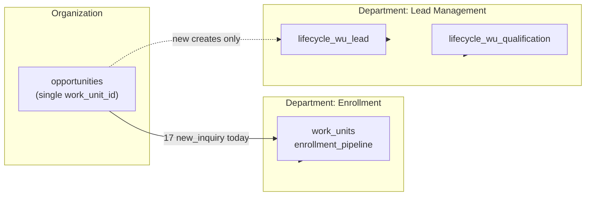

# Lifecycle runtime visibility model review

**Path:** `docs/sprints/archive/06_2026/lifecycle_runtime_visibility_model_review.md`  
**Status:** Architecture review — **no code changes** until reviewed  
**Date:** 2026-06-02  
**Trigger:** Lead Management shows 0 `new_inquiry` rows while org has 17 on Enrollment `enrollment_pipeline`; recent queue/attach fixes may be solving the wrong problem.

---

## Executive summary

Alloy today uses a **hybrid model**:

| Layer | Model | What drives visibility |
|-------|--------|-------------------------|
| **Platform default** | **Ownership container (cohort)** | `opportunities.work_unit_id` is a single FK; `QueueService` historically gates lists with `.eq("work_unit_id", workUnitId)`. |
| **Builder-owned lifecycle (partial)** | **Filtered operational view within a department** | For `lifecycle_wu_*` rows, queue base query can use `lifecycle_status` scope: `status_key` lane filters **plus** `work_unit_id IN (this department’s work unit ids)` or `NULL`. |
| **Create Lead** | **Ownership write** | New rows get `work_unit_id = lifecycle_wu_{entryStage}` and `status_key = new_inquiry` (entry stage from process config, not activation wizard). |

The 17 existing `new_inquiry` records **do not satisfy Lead Management’s department boundary** — they sit on **Enrollment** department work unit `5ba90557-…` (`enrollment_pipeline`, “New Leads”). They are not “missing” from a broken status filter; they are **outside this lifecycle’s operational department**.

**Recommendation:** Treat lifecycle stage work units as **filtered operational views within a lifecycle department**, with `work_unit_id` as **primary cohort assignment** for creates, actions, BOS context, and reporting — **not** as the sole queue membership gate inside that department. Do **not** org-wide auto-surface legacy Enrollment rows into Lead Management without an explicit **operator-initiated** migrate/copy policy. Finish making the filtered-view path **consistent on all runtime routes** (dept + work-unit) before more attach/repair tooling.

---

## Observed situation (database truth)

**Lead Management** (`3933ac47-077a-4de8-aaac-8aed48d80413`):

| Work unit | Key | Active | Queue status filter |
|-----------|-----|--------|---------------------|
| Lead | `lifecycle_wu_lead` | yes | `new_inquiry` |
| Qualification | `lifecycle_wu_qualification` | yes | `qualification`, `contact_attempted` |
| Legacy pipeline | `enrollment_pipeline` | **no** | legacy multi-lane pipeline JSON |

**Org opportunities** (`status_key = new_inquiry`): **17** rows, **all** `work_unit_id = 5ba90557-…` → Enrollment department `04958a78-…`, **not** Lead Management work unit ids.

**Lead Management queue count 0** is therefore expected under:

- Strict `work_unit_id = lifecycle_wu_lead`, **or**
- Department-scoped status view (`new_inquiry` + `work_unit_id IN (Lead Management WU ids)`), because Enrollment’s pipeline id is **not** in that set.

---

## 1. Intended runtime ownership model (as implemented + documented)

### 1.1 Platform doctrine (pre-lifecycle)

From `docs/archive/2026-06-superseded-system/workspace-system.md` and `docs/sprints/archive/05_2026/work_unit_runtime_consolidation_audit.md`:

- A **work unit** is an “operational queue/cohort within a department.”
- **`opportunities.work_unit_id`** is the **cohort gate** for opportunity queue queries in `QueueService`.
- **Queue lane filters** (`queue_definition.queues[].filters`, e.g. `status IN (…)`) apply **inside** that cohort.
- Queues are **preview/selection surfaces**; authoritative truth is entity GET / RRS / workflows.

Canonical **Enrollment** (legacy) modeled **one execution work unit** (`enrollment_pipeline`) with **many lanes** (domains), not one WU per lifecycle stage — see workspace-system § Enrollment execution.

### 1.2 Builder-owned lifecycle (current code path)

Builder-owned departments add **per-stage work units** (`lifecycle_wu_{stageKey}`) plus JSON config in `departments.metadata` (`lifecycle_builder_v1`, `lifecycle_activation_v1`).

**Queue visibility** (`web/lib/lifecycle/lifecycleOpportunityQueueScope.ts`, wired in `QueueService`):

When scope mode is `lifecycle_status`:

```text
org_id = :org
AND status_key IN (:laneFilterKeys)   -- from queue_definition
AND (
  work_unit_id IS NULL
  OR work_unit_id IN (:departmentWorkUnitIds)  -- all WUs on THIS department
)
```

**Not** org-wide status-only. **Not** “any `new_inquiry` anywhere.”

**Create Lead** (`lifecycleCreateLeadEntryBinding.ts`): writes **ownership** — sets `work_unit_id` to the stage work unit that owns `new_inquiry` in process config (typically `lifecycle_wu_lead`).

**Attach-records** (Settings, manual): **reassigns ownership** — `UPDATE opportunities.work_unit_id` to a lifecycle WU without changing `status_key`.

**Runtime validation** distinguishes:

- `matching_by_status` — status + department scope (view-visible under filtered model)
- `assigned_to_lifecycle_work_unit` — strict FK on the stage WU (ownership-aligned)

### 1.3 Intended model in one sentence

**Inside a lifecycle department:** stage work units are **operational lenses** (status + department boundary); **`work_unit_id` is still the single cohort assignment** the platform uses for actions, drawer context, KPI placements, and cross-surface consistency — but queue membership **should not** require FK equality to the lens work unit when the filtered-view path is active.

**Across departments:** each lifecycle department is a **separate operational workspace**; records on another department’s work units **do not** appear unless operators migrate them or product defines an org-wide inbox (not implemented).

---

## 2. Role of `work_unit_id`

| Role | Today | Should it stay? |
|------|--------|------------------|
| **Queue cohort (legacy default)** | Hard `.eq(work_unit_id, workUnitId)` on many paths | Relax **inside** builder-owned lifecycle dept only |
| **Department proxy** | Opportunities have no `department_id`; dept inferred via `work_units.department_id` | Yes — until schema adds explicit dept on opportunity |
| **Action / Create Lead target** | Set on create and many transitions | Yes — operators need a stable “home” WU for BOS and rail actions |
| **KPI / placement scoping** | `workspace_kpi_placement.work_unit_id`, `action_placements.work_unit_id` | Yes |
| **Needs Attention resolver** | Attention fetch scoped to execution WU | Yes — overlay still WU-scoped |
| **Multi-lifecycle coexistence** | **One FK per opportunity** — cannot be in two WUs at once | Limits “same record in two lifecycles” without reassignment or future membership table |

**Conclusion:** `work_unit_id` should remain **primary cohort assignment**, not be replaced by status-only queries org-wide. For builder-owned lifecycles, it should **not** be the **only** queue visibility predicate within the same department when lane status filters already define the lens.

---

## 3. Should a record be visible in multiple lifecycle views?

### 3.1 Within one lifecycle department

**Yes, in principle** — under a **filtered view** model:

- Same opportunity could match **Lead** lane (`new_inquiry`) and later **Qualification** lane (`qualification`) as `status_key` changes — **one row, one FK, different lenses over time**.
- At a single point in time, usually **one stage’s status set** matches (unless overlapping status assignment is configured — avoid).

### 3.2 Across two lifecycle departments (e.g. Enrollment + Lead Management)

**Not with current schema** unless:

- `work_unit_id` is updated to point at the other department’s WU (migration / attach), or
- Product introduces **org-wide status inbox** (no department boundary) — **not recommended** without explicit rules.

**Same opportunity in two operational workflows** today = **one `work_unit_id`** → pick which department “owns” operational execution. The other lifecycle sees **zero** unless FK moves or a future **many-to-many membership** model exists.

### 3.3 Same record in Enrollment pipeline and Lead Management Lead queue

The 17 rows are a **cross-department** case, not a within-lifecycle filter bug:

| Field | Enrollment record | Lead Management expectation |
|-------|-------------------|---------------------------|
| `status_key` | `new_inquiry` | Matches Lead lane filter |
| `work_unit_id` | Enrollment `enrollment_pipeline` | Would need `lifecycle_wu_lead` **or** dept-scoped view that includes other dept WUs (not implemented) |

**Product choice required:** Are these the **same population** Lead Management should operate, or is Lead Management **greenfield** for new work only?

---

## 4. Queue visibility: `work_unit_id`, status filters, or both?

| Model | Query shape | Lead Management shows 17 Enrollment rows? |
|-------|-------------|---------------------------------------------|
| **A. Ownership only** | `work_unit_id = lifecycle_wu_lead` | **No** |
| **B. Status only (org-wide)** | `status_key = new_inquiry` | **Yes** (also shows in Enrollment, reporting, every lifecycle with that status — **collision**) |
| **C. Status + department boundary (current partial)** | `status IN (lane)` AND `work_unit_id IN (dept WU ids) OR NULL` | **No** (Enrollment WU not in Lead Management dept) |
| **D. Status + department + optional cross-dept rules** | Configurable inclusion of legacy WU ids / source dept | **Only if explicitly configured** |

**Current implementation:** **D without cross-dept rules** ≈ **C** on dept bootstrap when `departmentWorkUnitIdsForLifecycleScope` is passed; **A** on standalone `/work-unit` API when preload ids are empty (`lifecycle_runtime_performance_guardrails.md`).

**Lane filters always apply** — visibility is never “all opportunities on the WU”; it is **WU scope (varies by path) ∩ lane status filter**.

---

## 5. How Enrollment Lifecycle and another Lifecycle coexist

Today both are **`departments` rows** in the same `org_id`:



| Scenario | Behavior |
|----------|----------|
| Operator works in **Enrollment** `/dept` | Sees records on `5ba90557-…` |
| Operator works in **Lead Management** `/dept` | Sees records on Lead Management WU ids (or null in dept scope) — **not** Enrollment WU ids |
| **Create Lead** from Lead Management | New row → `lifecycle_wu_lead` + `new_inquiry` — appears in Lead Management |
| **Same opp, two lifecycles simultaneously** | **Unsupported** without duplicate rows or FK reassignment |

**Coexistence strategy (recommended):**

1. **Parallel lifecycles** = parallel **departments** + disjoint cohorts by default (greenfield creates go to the lifecycle dept that created them).
2. **Cutover / convergence** = explicit operator tool (“move matching records into this lifecycle”) — already sketched as attach-records; treat as **migration policy**, not runtime default.
3. **Shared status vocabulary** (`new_inquiry`) does **not** imply **shared operational home** — status is global; work unit is departmental execution home.

---

## 6. Tradeoffs

### Model A — Ownership container (strict `work_unit_id`)

| Pros | Cons |
|------|------|
| Simple mental model; matches jobs WU pattern | Zero rows after lifecycle setup until mass reassignment |
| Clear BOS/KPI/action placement | Hides status-eligible rows “stuck” on legacy WU |
| Easy reporting by WU | Operators think queue is “broken” |
| | Poor for multi-lifecycle cutover |

### Model B — Filtered operational view (status + department boundary)

| Pros | Cons |
|------|------|
| Lanes match Settings status configuration | `work_unit_id` can disagree with “where row appears” → attach repair pressure |
| New lifecycle dept useful before bulk migrate | Standalone `/work-unit` must receive same scope as dept bootstrap |
| Within-dept stage transitions visible as status changes | Cross-dept records **still** invisible (Enrollment vs Lead Management) |
| Aligns with “queue = lens” language | Reporting “by work unit” ambiguous until FK synced |

### Model B′ — Status-only org-wide (not recommended)

| Pros | Cons |
|------|------|
| All `new_inquiry` appear everywhere instantly | **Breaks multi-lifecycle isolation** |
| No attach tool needed | Duplicate operator confusion across dept tiles |
| | BOS/actions still need a single `work_unit_id` |
| | Cannot run Enrollment + Lead Management as separate workspaces |

### Hybrid (recommended direction)

| Element | Choice |
|---------|--------|
| **Queue membership (in-dept)** | **Status lane filters + department WU boundary** (Model B) |
| **Create / actions / KPIs** | **Set and respect `work_unit_id`** (Model A write path) |
| **Cross-dept legacy** | **No auto-show**; optional manual migrate |
| **Consistency** | One scope implementation on **all** queue entry points |

---

## Current implementation (code map)

| Concern | Module / behavior |
|---------|-------------------|
| Scope resolution | `resolveLifecycleOpportunityQueueScope` → `lifecycle_status` vs `work_unit_id` |
| Dept scope ids | `loadDeptOperationalBootstrap` → `departmentWorkUnitIdsForLifecycleScope` (all dept WU rows, incl. inactive pipeline id in id list) |
| Queue queries | `QueueService.getWorkUnitQueueSummaries` / `getWorkUnitQueueItems` → `applyOpportunityQueueWorkUnitScope` then lane ops |
| Work-unit-only gap | `/api/admin/work-units/:id/queues` without preload → strict `eq(work_unit_id, lifecycleWorkUnitId)` |
| Create Lead binding | `lifecycleCreateLeadEntryBinding.ts` — entry stage owns `new_inquiry`, not `lifecycle_activation_v1.stage_key` |
| Manual ownership repair | `attachMatchingRecordsToLifecycleWorkUnits` |
| Validation counts | `countLifecycleOpportunityRecordsForWorkUnit` — view vs assigned split |
| Performance guardrails | No page-load migrate; attach manual only |

Related sprint docs (may lag code): `lifecycle_record_assignment_to_work_units.md`, `lifecycle_runtime_performance_guardrails.md`, `lifecycle_create_lead_entry_binding_fix.md`, `lifecycle_runtime_binding_audit.md` (partially outdated on single-pipeline-per-dept).

---

## Alternative models (decision matrix)

| ID | Name | Visibility rule | Cross-dept legacy 17 rows | Multi-lifecycle |
|----|------|-----------------|---------------------------|-----------------|
| **A** | Strict ownership | `work_unit_id = lens WU` | Hidden until attach | One WU per opp |
| **B** | Dept filtered view | `status` + `work_unit_id IN dept` | Hidden (different dept) | One WU per opp; lenses by status |
| **B+** | Dept view + null cohort | B, treat `NULL` WU as in-dept | Hidden unless null | Same |
| **C** | Org status inbox | `status` only per org | **Visible everywhere** | Collision |
| **D** | Explicit federation | B + configured legacy WU id map | Visible if configured | Policy-driven |
| **E** | Multi-membership (future) | Junction `opportunity_work_units` | Visible per membership row | True multi-home |

---

## Recommendation

### Product architecture

1. **Declare lifecycle stage work units as filtered operational views (B)** within a **lifecycle department**, not as exclusive ownership containers for queue membership.
2. **Retain `work_unit_id` as primary cohort assignment (A)** for creates, actions, BOS, drawer bootstrap, and reporting — sync over time via operator tools or status-driven “suggested home,” not page-load repair.
3. **Treat Enrollment’s 17 `new_inquiry` rows as a different department cohort** — Lead Management showing 0 is **correct** until product policy says otherwise (cutover vs greenfield).
4. **Do not org-wide auto-include status matches** across departments — that breaks Enrollment + Lead Management coexistence.

### Implementation priorities (after review — not in this doc)

1. **Consistency:** Same `lifecycle_status` + `departmentWorkUnitIdsForLifecycleScope` on dept bootstrap, work-unit bootstrap, and `GET /api/admin/work-units/:id/queues` (no silent fallback to strict FK).
2. **Operator messaging:** Empty queue = “No records belong to this lifecycle yet” when dept-scoped count is 0; distinguish “records exist on Enrollment” in Settings validation only.
3. **Defer** additional attach/repair automation until visibility model is signed off.
4. **Future (optional):** Explicit “Import from Enrollment pipeline” / cutover wizard (Model D) — manual, policy-driven, not navigation-time.

### Answer to the A vs B question

| Work unit type | Answer |
|----------------|--------|
| **Legacy `enrollment_pipeline`** | Historically **one ownership container, many lane views** inside one WU |
| **Builder `lifecycle_wu_*`** | Should be **filtered operational views (B)** within the lifecycle department, with **writes** still setting `work_unit_id` (hybrid) |
| **Why not pure B org-wide?** | Multi-lifecycle departments, BOS, and single-FK schema require a **department boundary** and a **canonical home WU** per record |

The 17 records **satisfy the Lead stage status filter** but **fail the Lead Management department boundary** — that is why “filtered view” does **not** mean they appear automatically, and why attach/migrate is a **product policy** tool, not a queue bug fix.

---

## Migration impact

| Population | If we adopt recommended hybrid + route consistency | If we only add attach/repair |
|------------|---------------------------------------------------|------------------------------|
| **New Create Lead (Lead Management)** | Appears in Lead queue (FK + status) | Same |
| **17 Enrollment `new_inquiry`** | **Unchanged** in Enrollment; invisible in Lead Management until operator runs explicit migrate | Moves only when operator attaches |
| **Reporting / KPIs by WU** | May count by FK until migrated | Same |
| **BOS / actions** | Use drawer `work_unit_id` context | Misaligned if view shows row but FK elsewhere |
| **Performance** | No page-load scans (guardrails hold) | Risk if repair expands |
| **Schema** | No migration required for recommendation | Future `opportunity_work_unit_memberships` only if Model E |

---

## Open questions for product sign-off

1. **Lead Management vs Enrollment:** Greenfield lifecycle only, or **cutover** of existing `new_inquiry` cohort?
2. **When status moves** (e.g. `new_inquiry` → `qualification`): should `work_unit_id` **auto-move** to `lifecycle_wu_qualification`, or only lane visibility change with lazy FK repair?
3. **Null `work_unit_id`:** Should null cohort appear in **all** lifecycle depts with matching status, or only the dept that created the record?
4. **Reporting lens:** Report by **status**, by **work_unit_id**, or by **lifecycle department + stage** (derived)?

---

## References

- `docs/archive/2026-06-superseded-system/workspace-system.md` — queue truth boundary, enrollment pipeline doctrine
- `docs/sprints/archive/05_2026/work_unit_runtime_consolidation_audit.md` — `work_unit_id` cohort gate
- `docs/sprints/archive/06_2026/lifecycle_record_assignment_to_work_units.md` — status-derived scope + attach
- `docs/sprints/archive/06_2026/lifecycle_runtime_performance_guardrails.md` — no auto-migrate on navigation
- `docs/sprints/archive/06_2026/lifecycle_create_lead_entry_binding_fix.md` — Create Lead entry binding
- `web/lib/lifecycle/lifecycleOpportunityQueueScope.ts` — scope implementation

**Next step:** Review this document with product/platform owners. **No further queue fixes** until visibility model (B + dept boundary + hybrid writes) is approved.
