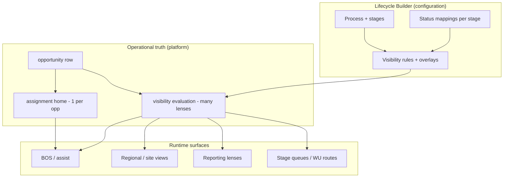

# Lifecycle visibility vs ownership — long-term architecture

**Path:** `docs/sprints/06_2026/lifecycle_visibility_vs_ownership_architecture.md`  
**Status:** **Approved direction** (architecture only — no implementation in this document)  
**Date:** 2026-06-02  

**Prerequisites (approved product policy):**

- [lifecycle_greenfield_vs_cutover_decision.md](./lifecycle_greenfield_vs_cutover_decision.md) — **greenfield** lifecycle creation; **no** automatic migration; **no** automatic record reassignment on navigation
- [lifecycle_runtime_visibility_architecture_decision.md](./lifecycle_runtime_visibility_architecture_decision.md) — Model **C (hybrid)** as north star

**Question this document resolves:**

Should **Lifecycle Builder** define **(A) record ownership containers** or **(B) operational visibility lenses**?

**Hard constraints for this review:**

- No implementation proposals
- No queue fixes
- Long-term Alloy architecture only (Lifecycle Builder primary; Enrollment Pipeline retired)

---

## Executive answer

| Builder defines | Does not define |
|-----------------|-----------------|
| **B — Operational visibility lenses** | **A — Exclusive ownership containers** |

Lifecycle Builder configures **which records appear in which operational views** (process → stages → status sets → lenses → orchestration overlays).

**Assignment** (exactly one **execution home** per opportunity at a time) remains a **separate platform concern**, initially carried by `opportunities.work_unit_id`, later possibly renamed or supplemented — but **must not** be the sole visibility gate for lifecycle lenses.

**Direct answer — Lifecycle A and B both include `new_inquiry`:**

> **Yes.** The same opportunity **should be visible** in both lifecycle views **when each lifecycle’s visibility rules include that status** (and any other predicates such as site, program, or explicit membership).  
> **No.** Visibility in both lifecycles **does not require** moving `work_unit_id`.  
> **Yes.** The opportunity still has **one assignment home** at a time; BOS actions that “execute here” use assignment (or an explicit per-action target), not “whichever lens opened the drawer.”

---

## Why not A (ownership containers)

Treating each `lifecycle_wu_*` (or lifecycle department) as an **exclusive container** implies:

```text
Visible in lifecycle L  ⇔  work_unit_id ∈ work_units(L)
```

That model:

| Failure | Consequence |
|---------|-------------|
| Equates Builder stages with **physical row homes** | Every lens change requires **reassignment** |
| Blocks **multi-lifecycle oversight** | Same backlog cannot appear in regional + central lifecycles |
| Makes Builder **secondary** to FK moves | Configuration follows data migration, not leads it |
| Fights **Enrollment sunset** | Cutover becomes the only way to “see” legacy cohort |
| Collapses **status-global vocabulary** with **dept-local execution** | `new_inquiry` means different things per tile without saying so |

Ownership containers are a **valid legacy pattern** for `enrollment_pipeline` (one WU, many lanes). They are **not** the long-term model when **multiple lifecycles** and **multiple lenses** (BOS, reporting, regional) are first-class.

---

## Why B (operational visibility lenses)

Lifecycle Builder should define **rules for operational lenses**:

```text
Lifecycle (department + process config)
  → Stages (ordered semantics)
    → Status sets per stage (CRM vocabulary mapping)
      → Operational views (queue / work-unit UI surfaces)
        → Optional overlays (Needs Attention, BOS, regional filters)
```

A **lens** answers: *“Should this opportunity appear in this operator surface right now?”*

It does **not** answer: *“Which single container owns this record for all time?”* — that is **assignment**.

---

## Recommended architecture (long-term)

### Layered model



| Layer | Authority | Mutable by |
|-------|-----------|------------|
| **Lifecycle configuration** | Builder JSON on `departments.metadata` + status definitions | Settings / Builder |
| **Visibility** | Derived from config + opp attributes (+ optional membership rows) | Rule engine; not queue SQL ad hoc |
| **Assignment** | `work_unit_id` (until evolved field) | Operator actions, explicit import/cutover, governed transitions |
| **Status** | `status_key` on opportunity | Workflow / admin actions |

### Builder-owned lifecycle department

Each activated lifecycle is a **`departments` row** (workspace tile) with:

- `lifecycle_builder_v1` — process, stages, status mappings
- `lifecycle_wu_*` work units — **lens anchors** (UI routes, `queue_definition` lane filters), **not** exclusive cohort locks
- Retired `enrollment_pipeline` — **inactive**, not the visibility authority for new work

### Single assignment, many lenses

| Concept | Cardinality | Purpose |
|---------|-------------|---------|
| **Assignment home** | **1** per opportunity (at a time) | Action routing, audit default, KPI “where work is executed,” drawer primary context |
| **Visibility in lifecycle lens** | **0..N** lifecycles / lenses | Operator surfaces, reporting slices, BOS eligibility |
| **Status** | **1** per opportunity (at a time) | Drives stage-aligned lenses; global CRM vocabulary |

---

## Visibility predicate (canonical)

**Purpose:** Decide if opportunity `o` appears in **lens** `L`.

**Inputs (conceptual):**

| Input | Source |
|-------|--------|
| `o.org_id` | Opportunity |
| `o.status_key` | Opportunity |
| `o.location_id` / site | Opportunity (regional) |
| `o.work_unit_id` | Opportunity (optional predicate only — not default gate) |
| `L.lifecycle_department_id` | Route / lens context |
| `L.stage_key` | Stage work unit / lane |
| `L.status_allowlist` | Builder stage + lane `queue_definition` |
| `L.site_allowlist` | Optional regional lens |
| `L.membership` | Optional explicit `opportunity_lifecycle_membership` (future) |
| Operator access scope | RLS / site / department restrictions |

**Recommended predicate (default lens — lifecycle stage queue):**

```text
visible(o, L) :=
  o.org_id = L.org_id
  AND access_allowed(operator, o)
  AND (
    explicit_membership(o, L.lifecycle_id) = true    -- optional future
    OR (
      o.status_key ∈ L.status_allowlist
      AND lifecycle_active(L.lifecycle_department_id)
      AND (L.site_constraint satisfied by o.location_id)
      AND NOT excluded_by_terminal_policy(o)
    )
  )
```

**Explicitly not required (default):**

```text
o.work_unit_id = L.work_unit_id   -- assignment gate; use only in "assignment-aligned" lenses
```

**Department boundary (transition period):**

During Enrollment sunset, optional **conservative** predicate variant for **intra-org** lenses:

```text
AND (
  greenfield_mode(L) → no cross-dept WU requirement
  OR o.work_unit_id IS NULL
  OR o.work_unit_id ∈ work_units(L.lifecycle_department_id)
)
```

That variant is a **migration-era guard**, not the long-term definition of visibility. Long-term, **Lifecycle A** and **Lifecycle B** visibility must **not** require `work_unit_id ∈ A` vs `B` if both include `new_inquiry`.

**Enrollment Pipeline retirement:** Remove `work_unit_id ∈ enrollment_pipeline` as implicit visibility; replace with **lifecycle rule** + optional **membership** after cutover.

---

## Assignment predicate (canonical)

**Purpose:** Resolve **execution home** for actions, default BOS routing, and “where this record lives operationally.”

**Recommended predicate:**

```text
assignment_home(o) := o.work_unit_id   -- FK to work_units; nullable

assigned_to_lifecycle_stage(o, stage) :=
  assignment_home(o) = work_unit_id(lifecycle_wu_{stage, dept})
```

| Use case | Uses assignment? |
|----------|------------------|
| Create Lead | **Writes** assignment to entry stage WU (`lifecycle_wu_lead` for lead-entry lifecycle) |
| Stage transition action | **May update** assignment when policy says “home follows stage” (governed; never automatic on navigation) |
| Cutover import | **Moves** assignment (approved manual only) |
| Queue visibility (long-term) | **No** (uses `visible(o, L)`) |
| BOS “run action on this record” | **Yes** — default placement from assignment + action catalog |
| Reporting “backlog by execution home” | **Yes** — assignment dimension |
| Reporting “backlog in lifecycle lens” | **No** — visibility dimension |

**Assignment vs status:**

- Assignment can point to **Qualification WU** while status is still `new_inquiry` during transition — lens visibility and assignment **may diverge** intentionally until policy aligns them via operator action or governed transition.

---

## Multi-lifecycle `new_inquiry` (Lifecycle A and B)

### Scenario

| Lifecycle | Department | Lead stage includes |
|-----------|------------|---------------------|
| **A** — e.g. Enrollment (legacy) | Dept A | `new_inquiry` |
| **B** — e.g. Lead Management | Dept B | `new_inquiry` |

Same opportunity `o`: `status_key = new_inquiry`, `work_unit_id` → Enrollment pipeline on Dept A.

### Visibility (recommended)

| Question | Answer |
|----------|--------|
| Visible in A’s Lead lane? | **Yes** — `status ∈ A’s lead status set` and A’s lens rules |
| Visible in B’s Lead lane? | **Yes** — `status ∈ B’s lead status set` and B’s lens rules |
| Requires `work_unit_id` move to B? | **No** |
| Requires duplicate opportunity row? | **No** |

### Assignment (recommended)

| Question | Answer |
|----------|--------|
| `assignment_home(o)` | **One** FK — e.g. remains on Dept A until operator or **approved cutover** moves it |
| B opened from B’s lens | Shows recommendation; **actions** that mutate home must declare target or use assignment policy |
| Operator confusion | Mitigated by UI: “Visible here · Assigned to Enrollment pipeline” |

### Greenfield policy interaction

Approved **greenfield** for B means:

- B’s queue may show **zero** until creates/imports — **expected**
- A’s `new_inquiry` rows are **not auto-visible in B** — not because visibility forbids it, but because **product chose no cross-lifecycle surfacing until import** — implement as **optional lens rule** `include_external_assignment: false` default for greenfield, not as `work_unit_id` equality

**Long-term:** Visibility allows both; **greenfield defaults** hide cross-lifecycle cohort until operator imports.

---

## Evaluation by downstream system

### 1. BOS

| Need | Architecture |
|------|----------------|
| Suggest next action on open record | Read **entity truth** + attention resolver; eligibility from **visibility** into assist lens, not queue preview |
| Route actions | **Assignment home** + action placements on WU/dept |
| Cross-lifecycle intelligence | Compare **status, staleness, requirements**; optional `visible_in_lenses[]` on payload |
| Avoid duplicate recommendations per lens | Dedupe by `entity_id`, not by `work_unit_id` |

**Coupling visibility to assignment?** **No** for eligibility; **yes** for default execution target unless action specifies otherwise.

### 2. Reporting

| Report type | Dimension |
|------------|-----------|
| “Backlog in Lifecycle B / Lead stage” | **Visibility** (`visible(o, L)` snapshot) |
| “Work executed by home WU” | **Assignment** (`work_unit_id`) |
| “Funnel conversion by status” | **Status** (org-wide) |
| Cross-lifecycle duplicate metrics | Count distinct `opportunity_id` — same row may appear in multiple lifecycle lenses |

Reporting must **label** whether a metric is **lens backlog** vs **assignment home** to avoid double-counting the same population under different names.

### 3. Regional views

Regional lens = **visibility predicate** + site:

```text
visible(o, L_regional) :=
  visible(o, L_base)
  AND o.location_id ∈ L_regional.site_allowlist
```

**No** requirement to reassign `work_unit_id` to a regional WU. Regional WU rows (if any) are **UI anchors**, not ownership.

### 4. Multi-site management

| Concern | Approach |
|---------|----------|
| Sticky site filter on workspace | Filters **visibility evaluation** for operator; does not change assignment |
| Site opening / closing | Status + site rules in Builder per stage |
| Same opp, multiple sites | Typically one `location_id`; regional lenses filter visibility |

Assignment remains **one home**; site affects **which operators see** the row in which lenses.

### 5. Future CRM use cases

| Use case | Lens vs ownership |
|----------|-------------------|
| Parallel programs (infant + preschool) | Different lifecycles; **shared status keys possible**; visibility per program rules; assignment policy picks home |
| Partner / B2B pipeline | Separate lifecycle department; visibility by status + account metadata |
| Marketing nurture vs ops queue | Overlay lens (BOS / campaign) **visible** without moving ops assignment |
| Account-level 360 | **Not** a work unit problem — entity APIs; lifecycle lenses are **views** on opportunities |
| Automation / AI agents | Agents register **lens keys**; read visibility contract; write via actions changing status/assignment explicitly |

CRM long-term needs **stable status vocabulary** and **explicit assignment transitions**, not N duplicate rows per lifecycle.

### 6. Department / work-unit retirement strategy

| Phase | Ownership containers (legacy) | Visibility lenses (target) |
|-------|--------------------------------|-----------------------------|
| **Parallel** | Legacy `enrollment_pipeline` active | New lifecycle greenfield |
| **Sunset** | Pipeline WU `is_active = false` | Lenses read Builder only |
| **Archive dept** | Dept hidden from workspace | Config retained read-only |
| **Data** | Assignment may still point at retired WU until cutover | Visibility can still evaluate rules; UI shows “assigned to retired home” |

Retiring a **department** retires its **lens definitions**, not necessarily **reassigning every row immediately**. Cutover remains **manual/approved** per greenfield policy.

Retiring a **`lifecycle_wu_*` stage route** is a **UI/config change** — visibility rules updated in Builder; assignment policy may map old homes to new stage WU via governed transition or import.

---

## Migration implications (approved constraints respected)

| Topic | Implication |
|-------|-------------|
| **No auto migration** | Historical rows stay on legacy assignment until explicit cutover |
| **Greenfield lifecycles** | Zero visibility count is correct; not a filter bug |
| **Cutover (manual)** | May **move** `assignment_home`; visibility in target lifecycle follows rules immediately after |
| **17 Enrollment `new_inquiry`** | Visible in Enrollment lens; not in Lead Management until import or rule enables cross-lifecycle surfacing |
| **Schema** | Long-term optional `opportunity_lifecycle_membership` for audit/explicit multi-lens; not required day one if visibility is rule-derived |
| **Enrollment Pipeline** | Retire WU row; **do not** delete; deactivate and remove from default predicates |
| **Operator training** | “Appears in” ≠ “Assigned to” |

**No automatic reassignment on navigation** means visibility expansion **must never** side-effect `work_unit_id` — only explicit actions/imports change assignment.

---

## Runtime implications (conceptual, not implementation)

| Surface | Long-term behavior |
|---------|-------------------|
| **Stage queue / work-unit page** | Enumerate `o` where `visible(o, L)`; sort/paginate as today; queue rows remain preview-only |
| **Dept throughput cards** | Count by visibility per stage lens, not strict FK |
| **Create Lead** | Set `status_key` + **assignment home** to entry stage WU; row becomes visible in entry lens and any other lens whose rules match |
| **Drawer** | Entity GET authoritative; show **assignment home** + **visible lifecycles** for operator clarity |
| **Settings validation** | Pass on zero visible rows (greenfield); informational copy; detect “visible elsewhere” vs “assigned elsewhere” separately |
| **BOS** | Eligibility from visibility + attention; execution from assignment |
| **Performance** | Visibility predicates must be index-friendly (`org_id`, `status_key`, `location_id`); no full-table scan on navigation; membership table indexed by `opportunity_id` if added |

**Transition risk:** Any code path that still uses `work_unit_id = :lensWuId` as the only gate **misimplements** architecture B — produces greenfield false negatives and blocks multi-lifecycle visibility.

---

## Decision record

| Decision | Resolution |
|----------|------------|
| Builder defines | **B — Operational visibility lenses** |
| Builder does not define | **A — Exclusive ownership containers** |
| Same opp in A and B with same status | **Visible in both** under rules; **one assignment home** |
| `work_unit_id` role | **Assignment predicate** only (long-term) |
| Greenfield empty queues | **Expected**; separate from visibility theory |
| Auto migration / reassignment | **Forbidden** (approved) |

---

## Related documents

| Document | Role |
|----------|------|
| [lifecycle_greenfield_vs_cutover_decision.md](./lifecycle_greenfield_vs_cutover_decision.md) | When rows enter a lifecycle |
| [lifecycle_runtime_visibility_architecture_decision.md](./lifecycle_runtime_visibility_architecture_decision.md) | Model A/B/C comparison |
| [lifecycle_runtime_visibility_model_review.md](./lifecycle_runtime_visibility_model_review.md) | Lead Management data trace |

---

## Sign-off

- [x] Architecture recommends **visibility lenses** (Builder-primary)
- [x] **Multi-lifecycle same status** — visible in both without FK move
- [ ] Platform team accepts visibility vs assignment predicates for future design specs
- [ ] Reporting/BOS consumers agree on metric labeling (lens vs home)

**No code changes in this document.**
