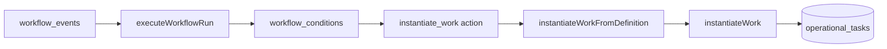

# Operational Work V1 Phase C — `instantiate_work` Workflow Action Plan

**Path:** `docs/sprints/06_2026/operational_work_v1_phase_c_instantiate_work_plan.md`  
**Date:** 2026-06-03  
**Status:** **Planning complete — no code, no migrations**  
**Scope:** Design the workflow action that instantiates Operational Work from Work Definitions via the existing workflow engine.

**Prerequisites (shipped):**

- Phase A — `operationalWorkService.instantiateWork(...)` + dedupe
- Phase B1 — platform catalog + resolver
- Phase B2 — `instantiateWorkFromDefinition(...)`
- Phase B3 — create modal definition picker + API `work_definition_key`

**Frozen doctrine:**

```
Workflow event → Workflow engine → instantiate_work action → instantiateWorkFromDefinition → instantiateWork → operational_tasks
```

Work Definitions define **what** work is. Workflows define **when** it is created. The Operational Work Service defines **how** it is created, deduped, rejected, or aggregated.

**Authority:** Phase C coding PRs must follow §1–§10 unless product records an exception in §11.

---

## Executive summary

Alloy already has a durable **event → workflow → action** spine (`emitEvent` → `executeWorkflowRun` → `workflow_actions`). Operational Work already has a single creation authority (`instantiateWork` / `instantiateWorkFromDefinition`). Phase C adds **one new workflow action type** — `instantiate_work` — as a thin delegate into the existing service chain.

**Do not** add trigger logic, schedules, or automation flags inside Work Definitions. **Do not** write directly to `operational_tasks` from the workflow handler.

**Smallest useful slice:**

1. Register `instantiate_work` in `workflowRun.ts` action switch
2. Validate action payload schema (catalog key, subject mapping)
3. Map workflow context → `InstantiateWorkFromDefinitionParams`
4. Persist provenance (`source: workflow`, `workflow_run_id`, `idempotency_key`)
5. Treat **deduped** as soft success; treat **rejected** as action failure
6. Unit + integration tests; optional seed workflow for one enrollment event

---

## 1. Current workflow engine audit

### 1.1 Tables and config shape

| Table | Role |
|-------|------|
| `workflow_events` | Canonical business facts (`emitEvent`) — `event_type`, `entity_type`, `entity_id`, `payload`, `org_id` |
| `workflows` | Trigger binding — `event_type`, `entity_type`, `enabled`, `org_id`, `metadata` |
| `workflow_conditions` | Pre-action gates — `target_entity`, `field_path`, `operator`, `value` |
| `workflow_actions` | Ordered steps — `action_order`, `action_type`, `target_entity`, `payload` (jsonb) |
| `workflow_runs` | Run record — `event_id`, `org_id`, `status`, `event_payload` |
| `workflow_action_runs` | Per-step audit — `inputs`, `outputs`, `status`, `error` |

Schema reference: `docs/supabase/reference/supabase_schema_columns.csv` (`workflows`, `workflow_actions`, `workflow_runs`, `workflow_action_runs`, `workflow_events`).

### 1.2 Execution spine

```text
Server mutation or emit helper
  → emitEvent (workflow_events insert)
  → query enabled workflows (event_type + entity_type + org/global)
  → executeWorkflowRun(supabase, workflowId, eventPayload, { event_id, org_id })
       → enrichWorkflowEventPayloadEntities (load job/schedule/opportunity/location)
       → validateWorkflowEventMatch
       → evaluate workflow_conditions
       → for each workflow_actions row: switch(action_type)
       → workflow_action_runs audit row per step
```

**Key files:**

| Concern | Location |
|---------|----------|
| Event insert | `web/lib/emitEvent.ts` |
| Status fan-out | `web/lib/admin/emitStatusChangedEvent.ts` |
| Runner | `web/lib/workflowRun.ts` (~2.6k lines, monolithic switch) |
| Template resolution | `web/lib/workflowTemplate.ts` (`renderTemplate`, `getByPath`) |
| Editor vocabulary | `web/lib/workflowVocab.ts` (partial catalog; may lag runtime event keys) |
| Manual run API | `POST /api/admin/workflows/[id]/run` (no `event_id` by design) |

Audit references: `docs/system/actions-and-workflows.md`, `docs/audits/workflow-execution-consistency-audit.md`.

### 1.3 Registered workflow action types (today)

Handled in `executeWorkflowRun` switch (`web/lib/workflowRun.ts`):

| `action_type` | Behavior summary |
|---------------|------------------|
| `create_message` | Insert legacy `messages` row; optional comm mirror |
| `send_message` | Trigger outbound delivery for queued messages |
| `update_entity` | Patch entity table via template-resolved id + fields |
| `create_assignment` | Schedule/vendor assignment side effects |
| `apply_job_vendor_to_upcoming` | Propagate vendor to future schedules |
| `create_action_link` | Tokenized customer action links |
| `log` | Render template message into run logs |
| **default** | **Skipped** — `workflow_action_runs.status = skipped`, workflow continues |

**Gap:** No `instantiate_work`, `complete_work`, or operational-task mutation actions.

### 1.4 Event payload shape (runtime)

After merge + enrichment, `executeWorkflowRun` payload typically includes:

| Field | Availability | Notes |
|-------|--------------|-------|
| `org_id` | ✅ Usually present | Required for org-scoped writes |
| `event_type` | ✅ Event-driven runs | Matches workflow trigger |
| `entity_type` / `entity_id` | ✅ Event-driven | Patched from workflow row if missing on nested payload |
| `occurred_at` | ✅ | ISO timestamp |
| `opportunity` | ⚠️ When id known | Full row loaded when `opportunity.id` or `job.opportunity_id` resolvable |
| `job`, `schedule`, `customer`, `contact`, `person`, `vendor`, `location` | ⚠️ Context-dependent | Enrichment loads related rows |
| `new_status_key` / `old_status_key` | ⚠️ Status events | On `opportunity_status_changed` / `entity_status_changed` |
| `actor_user_id` | ⚠️ Optional | Set by `emitStatusChangedEvent` when staff performs change; **not universal** |
| `department_id` | ❌ Not standard | Not enriched by default |
| `lifecycle_stage_key` | ❌ Not standard | Not on workflow payload; may exist in opportunity metadata or require resolver fetch |
| `workflow_run_id` | ✅ In action loop | Local `runId` variable; not on payload until action writes outputs |

Template helpers: `resolveId(value, payload)`, `resolvePath(payload, path)`, `renderTemplate(string, payload)`.

### 1.5 Handler context access matrix

| Context needed for `instantiate_work` | Available today? | Phase C approach |
|---------------------------------------|------------------|------------------|
| Org id | ✅ `payload.org_id` | Pass to service |
| Actor / user id | ⚠️ Partial | Prefer `payload.actor_user_id`; fallback **system workflow actor** (org service user or explicit null + policy) |
| Event type | ✅ | Copy into `context_snapshot.event_type` |
| Entity type / id | ✅ | Primary subject mapping source |
| Lifecycle / stage | ❌ | Optional: resolve from opportunity presentation helper or pass via event metadata; include in `resolveParams.stageKey` when known |
| Department id | ❌ | Optional fetch from work unit / opportunity dept hint for `resolveParams.departmentMetadata` |
| Record owner | ✅ After enrichment | `opportunity.assigned_to` — B2 `record_owner` policy |
| Event payload | ✅ Full payload | Template paths for overrides |
| Idempotency / run id | ✅ | `runId` + `action_order` (+ optional `actionRunId`) |

### 1.6 Error and skip semantics (existing)

| Outcome | Workflow run | Sibling actions |
|---------|--------------|-----------------|
| Condition fail | `skipped` | Not executed |
| Unknown `action_type` | `completed` | Step `skipped` |
| Action throw | **`failed`** | Remaining actions **not executed** |
| Action soft skip (e.g. missing link params) | `completed` | Continues |

**Implication for Phase C:** Hard validation errors (missing subject, invalid definition key in strict mode) should **throw** or explicitly fail the action. **Deduped** and **disabled definition (soft mode)** should **not** fail the workflow run.

### 1.7 Test coverage (workflow)

| Area | Coverage |
|------|----------|
| `executeWorkflowRun` unit tests | **Sparse** — no dedicated `workflowRun.test.ts` |
| Integration | Tour lifecycle, form submission, status fan-out tests **mock** `executeWorkflowRun` |
| Workflow Assist | Read/explain/apply tests; operational trace builder |
| Operational work | 94+ tests on service chain; API route tests for definition path |

Phase C must add **focused handler tests** — do not rely on full E2E workflow runs alone.

### 1.8 Known gaps / risks (engine)

1. **`workflowVocab.ts` stale** — e.g. `opportunity_status_changed` not listed; editor catalog ≠ all runtime emitters.
2. **Monolithic `workflowRun.ts`** — new action increases file size; consider extracting `executeInstantiateWorkAction` module (implementation detail, not new engine).
3. **No workflow action registry abstraction** — switch statement is the registry.
4. **Manual workflow run** lacks `event_id` — subject mapping must tolerate synthetic payloads.
5. **Circular import risk** — `workflowRun` already dynamic-imports in comm paths; instantiate handler should import service leaf module, not vice versa.
6. **Actor identity** — workflow runs are server-side; `created_by_user_id` for workflow-created work needs explicit policy (actor vs system).

---

## 2. `instantiate_work` action contract

### 2.1 Action type

```text
action_type: "instantiate_work"
target_entity: optional — ignored for v1 (subject comes from payload mapping)
payload: InstantiateWorkWorkflowActionPayloadV1
```

### 2.2 Payload schema (v1)

```typescript
type InstantiateWorkWorkflowActionPayloadV1 = {
  version: 1;

  /** Required — platform catalog key (not manual_ad_hoc). */
  work_definition_key: string;

  /** How to resolve Operational Work subject. */
  subject: InstantiateWorkSubjectMappingV1;

  /** Optional overrides — omit to use definition defaults. */
  title?: string | null;           // template string allowed
  description?: string | null;    // template string allowed
  due_at?: string | null;         // ISO override; omit → definition due policy
  assigned_to_user_id?: string | null; // UUID override; omit → definition assignee policy

  /** Passed to instantiateWorkFromDefinition.resolveParams + metadata context_snapshot. */
  context_snapshot?: {
    lifecycle_stage_key?: string | null;
    attention_reason_codes?: string[];
    readiness_gap_ids?: string[];
  };

  /** For definition_subject_period dedupe policies. Template allowed. */
  period_key?: string | null;

  /** Resolve department lifecycle_work_definitions_v1 overrides. */
  department_metadata_path?: string | null; // e.g. "metadata.department" — future; v1 may fetch by dept id

  /** Failure policy toggles */
  on_disabled_definition?: "skip" | "fail";   // default: skip
  on_deduped?: "soft_success" | "fail";       // default: soft_success
  on_rejected?: "fail" | "skip";            // default: fail
};
```

### 2.3 Subject mapping (see §3)

Embedded in `subject` field — not free-form SQL.

### 2.4 Provenance written by handler

```typescript
provenance: {
  source: "workflow",
  workflow_run_id: runId,
  idempotency_key: `${runId}:${action_order}`, // canonical v1
  created_by_user_id: actorUserId ?? systemFallback,
}
```

Legacy `operational_tasks.source` column maps `workflow` → stored provenance source (verify `mapInstantiateProvenanceToTaskSource` at implementation time).

### 2.5 Action outputs (workflow_action_runs.outputs)

```typescript
{
  outcome: "created" | "deduped" | "skipped" | "rejected";
  task_id?: string;
  work_definition_key: string;
  dedupe_key?: string | null;
  error?: string;        // when skipped/rejected
  reason?: string;
}
```

Optional: write `payload._last_instantiated_work_id` for downstream template steps (mirrors `_last_workflow_message_id` pattern).

### 2.6 Validation rules (config time + run time)

| Rule | When |
|------|------|
| `work_definition_key` known in platform catalog | Run time (`isKnownWorkDefinitionKey`) |
| Key ≠ `manual_ad_hoc` | Run time — ad hoc is operator-only |
| Subject resolves to allowed entity for definition | Run time via `isSubjectAllowedForWorkDefinition` |
| Templates render to valid UUID / ISO when overrides present | Run time |
| `version === 1` | Run time |

**Config-time validation (stretch):** Automations hub / Workflow Assist apply path rejects unknown keys before save.

---

## 3. Subject mapping model

### 3.1 Principles

- Map **workflow event context** → `OperationalWorkSubject` (`entityType`, `entityId`).
- Phase B catalog allows `{ entity_type: "opportunities" }` and `{ entity_type: null }` only — design for extension without enrollment-only branching.
- Prefer **declarative mapping** in action payload over hardcoded event-type switches in handler.

### 3.2 Mapping modes (v1)

```typescript
type InstantiateWorkSubjectMappingV1 =
  | { mode: "event_primary_entity" }
  | { mode: "path"; entity_type: "opportunities" | null; entity_id_path: string }
  | { mode: "static"; entity_type: "opportunities" | null; entity_id: string | null };
```

| Mode | Use case |
|------|----------|
| `event_primary_entity` | Default for opportunity-scoped workflows — uses normalized `payload.entity_type` + `payload.entity_id` when compatible |
| `path` | Cross-entity events — e.g. `entity_id_path: "opportunity.id"` on job/schedule events |
| `static` | Manual workflow run / tests — fixed subject |

### 3.3 Resolution algorithm (normative)

1. Resolve mapping mode → candidate `(entityType, entityId)`.
2. If `entity_id_path` / path mode: `resolvePath(payload, path)` then trim.
3. If `event_primary_entity`: read top-level `entity_type` + `entity_id`; if entity type not allowed, try enriched primary entity (`opportunity.id` when workflow entity is opportunities).
4. Validate against definition `allowed_subjects`.
5. Build fingerprint via service (`buildOperationalWorkSubjectFingerprint`) — handler does not invent fingerprint format.

### 3.4 Future subject types (plan-only)

| Entity | When catalog adds allowed_subject | Mapping example |
|--------|-----------------------------------|-----------------|
| `customers` | Billing / household work | `customer.id` path |
| `documents` | Compliance collection | `document.id` path |
| Unlinked | Manager checklists | `{ entity_type: null, entity_id: null }` + assignee policy |

**Anti-pattern:** Hardcoding `if (event_type === 'tour_completed')` inside handler instead of workflow conditions + mapping config.

### 3.5 Examples

| Event | Workflow entity | Mapping | Result subject |
|-------|-----------------|---------|----------------|
| `opportunity_status_changed` | opportunities | `event_primary_entity` | opportunity from event |
| `schedule_created` | schedules | `path: opportunity.id` | linked opportunity |
| `form_submitted` | form_submissions | `path: opportunity_id` from form payload | opportunity if present |
| Manual run | opportunities | `static` | test UUID |

---

## 4. Idempotency and dedupe model

### 4.1 Layers (compose, do not replace)

| Layer | Mechanism | Owner |
|-------|-----------|-------|
| **Workflow retry** | `provenance.idempotency_key = ${workflow_run_id}:${action_order}` | Handler |
| **Definition dedupe** | `dedupe_policy` on definition → Phase A open-instance lookup | Service |
| **Period scope** | Optional `period_key` on request | Handler template → service |

### 4.2 Idempotency key rules

- **Required** for workflow-created work in Phase C v1.
- Stable across retries of the **same** workflow run step — use run id + action order (not action_run id, which may differ on re-execution unless run is reused).
- Include in `InstantiateWorkFromDefinitionParams.idempotencyKey` and provenance metadata.
- Do **not** use idempotency key alone as dedupe key — service dedupe uses definition policy + subject fingerprint (+ period).

### 4.3 Workflow retry scenarios

| Scenario | Expected |
|----------|----------|
| Same run retried after transient failure before action completed | Idempotency key identical → dedupe or no-op if open instance exists |
| New event → new run | New idempotency key → new work allowed (unless definition dedupe blocks) |
| Completed prior instance | Dedupe allows new open instance |

### 4.4 period_key

- Required when definition `dedupe_policy === "definition_subject_period"`.
- Source: action payload template (e.g. billing period, week key) — **not** computed inside Work Definition.
- Example: `period_key: "{{new_status_key}}"` for stage-entry once-per-transition (product choice).

---

## 5. Error handling model

### 5.1 Service outcomes → workflow step outcomes

| `InstantiateWorkResult.status` | Default workflow behavior | `workflow_action_runs.status` | Workflow run |
|--------------------------------|---------------------------|-------------------------------|--------------|
| `created` | Success | `completed` | Continues / completes |
| `deduped` | **Soft success** (default) | `completed` | Continues |
| `rejected` | **Fail** (default) | `failed` → throw | **`failed`** |
| `aggregated` | Success (future checklist) | `completed` | Continues |

### 5.2 Specific failure cases

| Condition | Recommended behavior |
|-----------|---------------------|
| Definition disabled / unknown / out of stage | **`skip`** (default) — log reason; configurable `fail` for strict automations |
| Subject missing or not allowed | **`fail`** — misconfiguration |
| Assignee policy cannot resolve | Service falls back (B2: creator / record owner fetch) — **success path** |
| Due policy `none` without override | **`fail`** — misconfiguration unless workflow supplies `due_at` |
| `instantiateWork` rejected (validation) | **`fail`** |
| Deduped | **`soft_success`** — not an operator error |

### 5.3 Actor / user id failures

| Case | Policy |
|------|--------|
| `actor_user_id` present | Use as `userId` + `created_by_user_id` |
| Absent | Use org **workflow system actor** constant (implementation: dedicated system user id or first admin — product decision) |
| Assignee `creator` policy with system actor | Creates work assigned to system user — document in Builder help |

### 5.4 Logging

- Append human-readable line to run logs: `instantiate_work: created task {id}` / `deduped` / `skipped (disabled definition)`.
- Structured console log with `workflow_run_id`, `work_definition_key`, `outcome`.

---

## 6. Lifecycle integration notes (future path)

### 6.1 Separation of concerns

| Layer | Configures |
|-------|------------|
| **Work Definitions** (`lifecycle_work_definitions_v1`) | What templates exist, enabled, stage **availability** for picker |
| **Workflows** | When to call `instantiate_work` with a given `work_definition_key` |
| **Lifecycle Builder (future)** | Visibility + deep links — not a second trigger engine |

### 6.2 Builder evolution (no UI in Phase C)

1. **Read-only (B4):** Show enabled definitions + stage bindings.
2. **Editor (B5+):** Toggle definition enabled, overrides — still no triggers inside definitions.
3. **Lifecycle automation panel (Phase C+):** "On stage entry → run workflow X" — workflow graph holds `instantiate_work` step.
4. **Stage key on instantiate:** Pass `context_snapshot.lifecycle_stage_key` + `resolveParams.stageKey` from event (`new_status_key` mapped through lifecycle presentation).

### 6.3 Example (enrollment, illustrative)

```text
Event: opportunity_status_changed (new_status_key = tour)
Workflow condition: new_status_key eq tour
Action: instantiate_work { work_definition_key: record_tour_outcome, subject: event_primary_entity }
```

Definition stage binding still applies at resolve time — disabled/out-of-stage → skip per §5.

---

## 7. Attention / readiness signal path

### 7.1 Doctrine (unchanged)

| Layer | Creates work? |
|-------|---------------|
| Readiness evaluator | **No** |
| Needs Attention evaluator | **No** |
| Workflow on signal-derived event | **Yes** (via action) |
| Operator manual create | **Yes** (via API/modal) |

### 7.2 Recommended pattern

```text
Attention reason detected (runtime evaluator)
  → does NOT insert operational_tasks
  → may emit event (future: attention_reason_activated) OR match existing event
       → workflow condition includes reason / stage / entity predicates
            → instantiate_work action
```

### 7.3 Context snapshot

When event payload carries attention/readiness context, copy into `context_snapshot`:

```typescript
{
  attention_reason_codes: ["tour_date_passed"],
  readiness_gap_ids: ["program_interest_missing"],
  lifecycle_stage_key: "tour",
  event_type: "opportunity_status_changed"
}
```

**Explain-only data** — does not satisfy readiness or clear attention by itself.

### 7.4 Anti-patterns

- Needs Attention lane "Create work" button that bypasses service (use modal/API instead).
- Readiness gap → direct SQL insert.
- Work Definition `triggers[]` array (deferred indefinitely).

---

## 8. Testing plan

### 8.1 Unit tests (new modules)

| Module | Cases |
|--------|-------|
| `validateInstantiateWorkWorkflowActionPayload` | Valid v1; missing key; unknown key; bad subject mapping |
| `resolveInstantiateWorkSubjectFromWorkflowPayload` | event_primary_entity; path; static; incompatible entity |
| `buildInstantiateWorkFromWorkflowAction` | Maps to `InstantiateWorkFromDefinitionParams` with provenance |

### 8.2 Handler tests (mock service)

| Scenario | Assert |
|----------|--------|
| Successful instantiation | `instantiateWorkFromDefinition` called once; action run `completed`; outputs `outcome: created` |
| Deduped | Soft success; workflow run completes; outputs `outcome: deduped` |
| Disabled definition + skip policy | Action `skipped`; workflow completes |
| Disabled definition + fail policy | Workflow `failed` |
| Missing subject | Action throws; workflow `failed` |
| Idempotency key | `${runId}:${actionOrder}` passed |
| No direct DB insert | Mock supabase — no insert into `operational_tasks` from handler |

### 8.3 Integration tests

| Scenario | Assert |
|----------|--------|
| `emitStatusChangedEvent` → workflow with `instantiate_work` | End-to-end with mocked or test DB |
| Retry same run | Dedupe prevents duplicate open work |
| API compatibility | Unchanged — workflow path separate from POST `/operational-tasks` |

### 8.4 Regression guards

- Task Assist / manual create paths unchanged.
- Unknown action types still skipped (no collision with `instantiate_work` string).
- `workflowRun.ts` import graph — no cycle with `operationalWorkService`.

---

## 9. Risks / anti-patterns

| Risk | Mitigation |
|------|------------|
| Second create path bypassing service | Handler imports **only** `instantiateWorkFromDefinition` |
| Triggers inside Work Definitions | Reject in review — workflows only |
| Workflow failure on benign dedupe | Default `on_deduped: soft_success` |
| Silent skip on misconfiguration | Default `on_rejected: fail` for true errors |
| Missing actor id | Document system actor; test assignee policies |
| Stage/dept context missing | Resolve when possible; optional strict mode later |
| `workflowRun.ts` growth | Extract handler module early in PR1 |
| Enrollment-only subject assumptions | Mapping modes + catalog `allowed_subjects` |
| Attention → direct create | Code review + architecture test |
| Rate storms on hot events | Rely on dedupe + workflow condition specificity; rate limits Phase E |

---

## 10. Recommended PR breakdown

| PR | Scope | Exit criteria |
|----|-------|---------------|
| **C1 — Contract + validation** | Payload types, validator, subject resolver, provenance builder | Unit tests green; no runtime wiring |
| **C2 — Handler** | `instantiate_work` case in `workflowRun.ts` (or extracted module) | Handler tests with mocked service |
| **C3 — Provenance + metadata polish** | **Shipped** — workflow provenance fields, actor vs executor distinction, standardized handler outputs, tests | See §12 |
| **C4 — Integration + seed** | **Shipped** — `tour_scheduled` → `record_tour_outcome` per-org seed + E2E tests | See §13 |
| **C5 — Automations UX (stretch)** | Action type in workflow editor dropdown + payload form | Operator can configure without JSON |

**Stop line after C4** unless product prioritizes editor UX.

---

## 12. C3 shipped — provenance, actor policy, handler outputs

**Status:** Shipped (2026-06-03). No seed workflows, no editor UX, no migrations.

### Provenance persisted on workflow-created work (`metadata.provenance`)

| Field | When set |
|-------|----------|
| `source` | Always `"workflow"` |
| `workflow_id` | From workflow config row |
| `workflow_run_id` | Current run |
| `workflow_action_order` | Action step order |
| `workflow_action_id` | When `workflow_actions.id` is available on the action row |
| `workflow_event_id` | When `event_id` passed into runner |
| `workflow_event_type` | From enriched event payload `event_type` |
| `idempotency_key` | `${workflow_run_id}:${action_order}` |
| `created_by_user_id` | **Only** when `payload.actor_user_id` is a valid UUID (event actor) |
| `executor_user_id` | Service `userId` — actor or record-owner fallback |
| `workflow_subject_mapping_mode` | From action payload `subject.mode` |
| `workflow_action_payload_version` | From action payload `version` |

Chain: `buildWorkflowInstantiateOperationalProvenance` → `instantiateWorkFromDefinition` → `normalizeInstantiateProvenance` → `buildOperationalWorkMetadataForInstantiate`.

### Actor / executor policy (intentional)

1. Prefer `payload.actor_user_id` as both executor and `created_by_user_id`.
2. Else fallback `payload.opportunity.assigned_to` as **executor only** — does **not** set `created_by_user_id`.
3. Fail with a clear message if neither exists. **No synthetic system user.**

### Handler output shape (`workflow_action_runs.outputs`)

Standard fields: `outcome`, `work_definition_key`, `subject_fingerprint`, `dedupe_key`, `work_id` / `existing_work_id`, `reason`, `message`, `error`. Log line via `formatInstantiateWorkWorkflowActionLog`.

### Remaining gaps (post-C3)

| Gap | Notes |
|-----|-------|
| No system user | Events without actor and unassigned opportunity fail — by design |
| `executorSource` not persisted | `record_owner` vs `actor` is inferable from presence of `created_by_user_id` |
| `operational_tasks.source` column | Workflow work still maps to `manual` on row source (CHECK constraint); true source is `metadata.provenance.source` |
| Department metadata fetch | Stage-based assignee/due resolution still depends on `resolveParams.stageKey` from event snapshot |
| C4 seed workflow | **Shipped** — migration `20260605120000_enrollment_record_tour_outcome_instantiate_work.sql` |
| Builder editor | Action type dropdown / payload form deferred (C5) |

---

## 13. C4 shipped — first end-to-end seed workflow

**Status:** Shipped (2026-06-03). One proof-path workflow only; no editor UX.

### Seed workflow

| Field | Value |
|-------|-------|
| Name | `Enrollment: Record tour outcome on tour scheduled` |
| `metadata.seed_key` | `c4_enrollment_record_tour_outcome_v1` |
| Event | `opportunity_status_changed` on `opportunities` |
| Condition | `new_status_key` eq `tour_scheduled` |
| Action | `instantiate_work` → `record_tour_outcome`, subject `event_primary_entity` |

**Why `tour_scheduled` not `tour_completed`:** The `record_tour_outcome` admin action sets status to `tour_completed`. Triggering on completion would create redundant work after the outcome was captured. `tour_scheduled` fires when a tour is confirmed — work prompts staff to record the visit result afterward.

### Verification (local / staging)

1. Apply migration: `supabase db push` or deploy migrations.
2. Confirm workflow row exists: Automations → **Enrollment: Record tour outcome on tour scheduled** (enabled).
3. Open an enrollment opportunity; schedule/confirm a tour so `status_key` becomes `tour_scheduled`.
4. Open opportunity drawer → Work strip should show **Record tour outcome** task.
5. Inspect `operational_tasks.metadata.provenance` — expect `source: workflow`, `workflow_run_id`, `idempotency_key`, etc.
6. Repeat status transition (or re-run workflow) — open work should **dedupe**, not duplicate.
7. Optional SQL checks:
   - `SELECT * FROM workflow_runs WHERE event_id IN (SELECT id FROM workflow_events WHERE event_type = 'opportunity_status_changed' ORDER BY occurred_at DESC LIMIT 5);`
   - `SELECT outputs FROM workflow_action_runs WHERE action_type = 'instantiate_work' ORDER BY created_at DESC LIMIT 5;`

### Code references

- Seed spec: `web/lib/admin/operationalWork/workflowInstantiateWork/enrollmentRecordTourOutcomeWorkflowSeed.ts`
- Migration: `supabase/migrations/20260605120000_enrollment_record_tour_outcome_instantiate_work.sql`
- Tests: `web/tests/admin/operationalWork/enrollmentRecordTourOutcomeWorkflowSeed.test.ts`

**Stop line after C4** unless product prioritizes editor UX (C5).

**Explicitly not Phase C:** Builder CRUD for definitions, attention subscriptions, recurrence scheduler, checklist shape, BOS apply wiring, new event types (unless required by C4 seed — prefer existing `opportunity_status_changed`).

---

## 11. Open decisions (product sign-off before C1)

| # | Decision | Options | Recommendation |
|---|----------|---------|----------------|
| 1 | System actor when no `actor_user_id` | Fixed system user vs nullable creator | **Org-scoped system user** for audit clarity |
| 2 | Disabled definition in automation | skip vs fail | **skip** default |
| 3 | Deduped in automation | soft success vs fail | **soft_success** |
| 4 | Idempotency key format | run:order vs run:action_id | **`${workflow_run_id}:${action_order}`** |
| 5 | Subject default mode | event_primary_entity vs path | **event_primary_entity** for entity-scoped workflows |
| 6 | Stage key source | new_status_key vs resolver fetch | **Both** — snapshot from event; resolveParams when dept metadata needed |
| 7 | C4 seed workflow | tour vs intake | **One** stage-entry example on existing event |
| 8 | Editor in Phase C | C5 stretch vs defer | **Defer** if C1–C4 slip |

---

## Appendix A — Chain diagram



---

## Appendix B — Related docs

- `docs/sprints/06_2026/operational_work_creation_model_discovery.md` — §6 instantiate_work behavior
- `docs/sprints/06_2026/operational_work_v1_phase_b_implementation_plan.md` — Phase C pointer
- `docs/system/actions-and-workflows.md` — engine spine
- `docs/audits/workflow-execution-consistency-audit.md` — fan-out patterns
