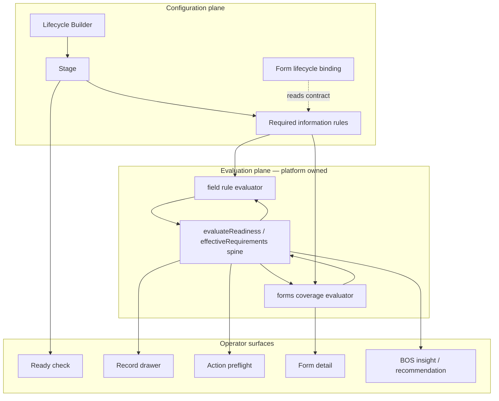

# Required Information V2 — Operational Readiness Framework

**Path:** `docs/sprints/06_2026/required_information_v2_operational_readiness_framework.md`  
**Date:** 2026-06-02 (enhancement pass: 2026-06-02)  
**Status:** **Operating model frozen — enhancement pass complete** (architecture only; no implementation)  
**Scope:** Define Alloy's **operational readiness framework**. Not a field-configuration sprint, UI sprint, Needs Attention sprint, Tasks sprint, or Orchestration sprint.

**Canonical inputs (frozen unless major architectural issue):**

- [`completed/lifecycle_builder_hardening_closeout.md`](./completed/lifecycle_builder_hardening_closeout.md)
- [`completed/lifecycle_canonical_vocabulary.md`](./completed/lifecycle_canonical_vocabulary.md)
- [`lifecycle_builder_hardening_and_v2_canonical_model.md`](./lifecycle_builder_hardening_and_v2_canonical_model.md)
- [`lifecycle_v2_discovery_and_operating_model.md`](./lifecycle_v2_discovery_and_operating_model.md)
- [`completed/forms_lifecycle_requirement_coverage.md`](./completed/forms_lifecycle_requirement_coverage.md)
- [`lifecycle_required_info_child_fields_audit.md`](./lifecycle_required_info_child_fields_audit.md)

**Authority:** This document is the canonical reference for Required Information V2 implementation planning. Product copy, APIs, and evaluators should align with §2–§9 unless an explicit exception is recorded in §12.

---

## Executive summary

**Required Information V2** reframes lifecycle field rules as Alloy's **operational readiness framework** — a single, composable model for answering: *Is this configuration, record, form, or action ready for the next step?*

Today, readiness logic is **fragmented**:

- Stage field rules in department metadata (config)
- Catalog + bindings with inconsistent `runtime_enforced` flags (platform)
- Action preflight for four lifecycle actions (runtime gate)
- Forms coverage adapter (form ↔ lifecycle contract)
- Object-label progression snapshots (display)
- Layout requiredness on drawer PATCH (separate system)
- Ready check (structural go-live only — **no field-rule proof**)

V2 **does not invent a parallel rules engine**. It **unifies vocabulary, ownership, enforcement levels, and evaluation surfaces** around one readiness spine that existing engines compose.

| V2 delivers | V2 does not deliver (separate sprints) |
|-------------|----------------------------------------|
| Readiness hierarchy and ownership | Needs Attention authoring UI |
| Four enforcement levels (Off → Enforced) | Task template CRUD |
| Unified evaluator contract | Orchestration linkage card |
| Requirement type scopes (framework) | Packet / freshness implementation |
| Readiness state model (runtime output) | Schema migrations |
| Consumption doctrine for downstream systems | New tables |
| BOS explanation framework | |

**Enhancement pass (approved):** Adds requirement **type** scopes (record / packet / relationship / freshness), readiness **states** (distinct from enforcement **levels**), and downstream **consumption doctrine** — without expanding V2 implementation scope or renaming frozen vocabulary.

**Target architecture (locked):**

```
Lifecycle → Required Information → Readiness Engine (platform evaluator)
                                        ↓
              ┌─────────────────────────┼─────────────────────────┐
              ▼                         ▼                         ▼
           Tasks                  Needs Attention                  BOS
              │                         │                         │
              └─────────────────────────┼─────────────────────────┘
                                        ▼
                              Automations · Forms
                                        ↓
                                     Actions
                                        ↓
                                   Progression
```

Downstream systems **consume** readiness signals. They do **not** own readiness truth.

---

## 1. Current-state audit

### 1.1 Metadata structures

All durable Required Information config lives on **`departments.metadata`** (no dedicated table).

| Metadata key | Shape | Written by | Notes |
|--------------|-------|------------|-------|
| `lifecycle_progression_requirements_v1` | `stages.{operatorStage}.field_rules.{required,recommended}_rule_ids` + legacy object labels | `PATCH …/lifecycle-requirements`; unified Save stage via `persistLifecycleStageFieldRules` | Operator-stage keys (`lead`, `tour`, …) |
| `lifecycle_builder_stage_field_rules_v1` | `by_stage_key.{builderStageKey}.{required,recommended}_rule_ids` | Same API; builder-stage path for custom stages | Precedence over operator-stage row when present |
| `lifecycle_builder_v1` | Process + stages | `PATCH …/lifecycle-builder` | Stage list; not field rules |
| `lifecycle_activation_v1` | Last-touch audit | Stage saves | Audit only — not requirement truth |

**Precedence (effective rules for a builder stage):**

```
builder stage row (lifecycle_builder_stage_field_rules_v1.by_stage_key)
  → operator-stage department override (lifecycle_progression_requirements_v1.stages)
    → platform defaults (lifecycleProgressionRequirementsCatalog)
```

**API surfaces:**

| Route | Role |
|-------|------|
| `GET/PATCH …/lifecycle-requirements` | Read/write field rules; palette merge; entity labels |
| `POST …/enrollment-process/stage-runtime-config` | Unified Save stage — optional `field_rules` alongside statuses + queue view |
| `GET …/lifecycle-builder/stage-bootstrap` | Aggregated stage payload including effective field rules |

**Internal rule identity:** Stable ids (`person:first_name`, `child:program_interest`, `custom:child:{field_key}`). Never operator-facing.

---

### 1.2 Field rule model

#### Catalog (platform definitions)

`LIFECYCLE_FIELD_REQUIREMENT_CATALOG` (`lifecycleFieldRequirementsCatalog.ts`):

- Entity buckets: **Person**, **Child**, **Opportunity**, **Customer**
- Each entry: `rule_id`, `field_label`, `runtime_enforced` (catalog flag), optional `stages[]` palette filter
- Org extensions merged from `field_definitions` (`inquiry_child` → Child entity)

#### Bindings (runtime resolution)

`LIFECYCLE_FIELD_RULE_BINDINGS` (`lifecycleFieldRuleBindings.ts`):

- Maps `rule_id` → `value_source` (`primary_person`, `inquiry_child`, `opportunity`, `opportunity_metadata`)
- OCM column mapping for Child fields (`inquiry_child` grain — not `customer_members`)
- `form_capture_keys` for forms coverage matching
- **`runtime_enforced`** per binding (may differ from catalog)
- `form_coverage_supported` flag

#### Palette merge (builder UI)

`lifecycleFieldPaletteMerge.ts` derives operator palette entry:

```typescript
runtime_enforced: binding?.runtime_enforced ?? entry.runtime_enforced
config_only: !(binding?.runtime_enforced ?? entry.runtime_enforced)  // internal only post-hardening
```

**Known inconsistency:** Catalog may mark `person:*` as `runtime_enforced: false` while bindings mark `true`. Evaluator uses **binding** flag — so person identity fields **do block** when configured required and binding is enforced. Hardening removed `(config only)` from UI but did not resolve catalog/binding drift.

#### Config shape (saved)

```typescript
type LifecycleStageFieldRules = {
  required_rule_ids: string[];
  recommended_rule_ids: string[];  // mutually exclusive with required
};
```

**No persisted enforcement level** beyond required vs recommended membership. Enforcement depth is inferred from binding `runtime_enforced` — invisible to operators.

---

### 1.3 Runtime behavior

#### Primary evaluator

`lifecycleFieldRuleEvaluator.ts`:

- `evaluateFieldRulesForStage(ctx, stage, rules)` — iterates required → `hard_block`, recommended → `recommendation`
- `evaluateSingleFieldRule` — **skips** rules where `!binding.runtime_enforced`
- Custom org fields (`custom:*`) — **skipped** at field-rule level (no binding path)
- Returns `RequirementViolation[]` with labels, missing_reason, blocking_level

#### Action preflight (hard gate today)

`lifecycleActionRequirementCatalog.ts` + `adminActionPreflight.ts`:

| Action key | Evaluates |
|------------|-----------|
| `approve_enrollment` | Field rules + legacy object-label checks |
| `move_to_waitlist` | Field rules + waitlist-specific labels |
| `schedule_tour` | Field rules + tour labels |
| `record_tour_outcome` | Field rules + outcome labels |

Flow: `executeAdminAction` → `preflightOpportunityActionOrNull` → `evaluateOpportunityActionPreflight` → `evaluateEffectiveRequirements` → `evaluateLifecycleActionRequirements` + completion rules.

Only **`LIFECYCLE_PREFLIGHT_ACTION_KEYS`** participate. Other actions bypass lifecycle field-rule preflight.

#### Unified requirements spine (partial)

`evaluateEffectiveRequirements.ts` merges:

| Source | Tag | Today |
|--------|-----|-------|
| Completion rules | `completion` | Object-label progression |
| Lifecycle action rules | `action` | Four preflight actions |
| Layout rules | `layout` | Drawer PATCH policy (separate) |
| Transition rules | `transition` | `status_transition_rules` (async path) |

**Gap:** Lifecycle **stage field rules** are not yet a first-class source in `evaluateEffectiveRequirements` for all triggers — only via action preflight and legacy completion paths.

#### Progression display

`evaluateLifecycleStageProgression` (`lifecycleProgressionRequirementsCatalog.ts`):

- Object-label grain (`Child`, `Program`, `Tour Date`, …)
- `missing_required`, `ready_to_advance` — **display checklist**, not enforcement authority
- Includes labels even when underlying field rules are config-only (legacy fallback via `objectLabelsNeedingLegacyFallback`)

#### Status transitions

`validateStatusTransitionStructured` — separate transition rule store. **Does not** consume lifecycle field rules today.

---

### 1.4 Lifecycle integration

| Integration point | Behavior today |
|-------------------|----------------|
| **Lifecycle Builder** | Per-stage Required Information section; Off / Recommended / Required toggles; Suggested template panel; saved on Save stage |
| **Stage bootstrap** | Effective rules in `buildLifecycleStageBootstrap` |
| **Queue visibility** | Independent — status keys only; field rules do not affect queue membership |
| **Actions Matrix** | Independent save; preflight reads dept metadata at execute time |
| **Assignment** | `work_unit_id` unaffected by readiness |
| **Ready check** | Structural only (see §1.6) — **does not validate field-rule wiring or enforcement coherence** |

**Builder hardening state (shipped):**

- Unified Save stage persists field rules with statuses + queue view
- `(config only)` removed from operator UI
- Suggested ≠ configured until Save stage
- Entity labels from org config (Lead, Guardian, Child)

---

### 1.5 Ready Check behavior

**Operator name:** Ready check  
**Internal:** `GET …/lifecycle-activation/validate` → `validateLifecycleActivationRuntime`

**Compact checks (operator-facing):**

| Check | Validates |
|-------|-----------|
| Workspace tile | Lifecycle visible on `/adminV2/workspace` |
| Queue views published | Per-stage `lifecycle_wu_{stage}` rows exist |
| Queue filters | Status filters match assigned status keys |
| Records query | Queue query executes (zero records = informational pass) |
| Actions configured | Optional — placements exist for lifecycle scope |

**Ready check does NOT validate:**

- Field rules configured vs platform defaults
- Enforcement level coherence (guidance vs enforced)
- Forms coverage for linked forms
- Whether required fields would block actions on sample records
- Needs Attention or task wiring

**V2 implication:** Ready check remains **lifecycle go-live proof** (structural). **Record readiness** and **form readiness** are separate readiness kinds (§2).

---

### 1.6 Forms integration

Forms lifecycle coverage shipped (Cards 0–6, June 2026). Doctrine: **Lifecycle defines the contract; Forms prove coverage.**

| Component | Module | Role |
|-----------|--------|------|
| Contract resolver | `resolveFormsLifecycleRequirementContract.ts` | Merges `effectiveFieldRulesForStage` + action intake spec + org fields |
| Coverage evaluator | `evaluateFormsLifecycleFieldCoverage.ts` | Maps form schema fields → requirement ids via bindings |
| Settings presentation | `buildFormLifecycleCoveragePresentation.ts` | `ready` / `missing_required` / `partial` |
| Public submit gate | `validatePublicSubmissionLifecycleRequirements.ts` | Blocks record-creating intake when enforced required fields missing from submission |
| Form usage metadata | `formLifecycleUsageMetadata.ts` | `lifecycle · stage · intent` binding on form |

**Enforcement today on forms:**

- Public submit blocks on **required** rules where binding is enforced and field not covered
- Publish/share readiness shows coverage status — does not block publish in all paths
- Custom org fields: palette visible, evaluator skips at field-rule level — coverage may show `unknown`

**Gap:** Forms contract uses same required/recommended split but **no explicit enforcement level** in UI. Operator cannot see which missing fields would block intake vs guidance only.

---

### 1.7 Enforcement limitations (summary)

| Limitation | Impact |
|------------|--------|
| **Dual enforcement flag** (catalog vs binding) | Operator Required toggle may not match runtime block behavior; trust erosion |
| **Custom org fields always guidance-only at evaluator** | Required custom fields saved but never hard-block |
| **Four actions only** | Other actions ignore lifecycle field rules |
| **No status transition integration** | Status change allowed despite missing required info |
| **Object-label legacy parallel path** | Display and preflight may disagree on what's "missing" |
| **Layout requiredness separate** | Drawer PATCH policy ≠ lifecycle progression rules |
| **No expiry / staleness** | Cannot express "information expired" |
| **No packet / document requirements** | Enrollment packet completeness out of scope |
| **Child grain only for Child entity** | OCM paths; no canonical `customer_members` rules |
| **No lifecycle-wide requirements** | All rules stage-scoped only |
| **No action-scoped requirements in builder** | Action intake spec exists in code (`resolveActionIntakeSpec`) but not builder-authored |
| **Ready check blind to readiness rules** | Go-live proof ≠ operational readiness proof |

---

## 2. Readiness model

### 2.1 Definition

**Operational readiness** is the deterministic answer to whether a **subject** satisfies the **requirements** configured for a **context** at a **point in time**.

```
Readiness = evaluate(requirements, subject, context) → { ready | not_ready, gaps[], level }
```

- **Deterministic first** — BOS may explain; BOS does not define readiness truth.
- **Layered** — multiple readiness kinds compose; no single boolean for "the record."
- **Config-driven** — requirements originate in Lifecycle Builder (stage scope today); platform owns evaluator.
- **Two output dimensions** — requirement **type scopes** (§3) and runtime **states** (§6), separate from config **levels** (§5).

### 2.2 Readiness kinds (hierarchy)

```
Alloy Operational Readiness Framework
│
├── Lifecycle readiness          (is this lifecycle configured to operate?)
│   └── Stage readiness          (is this stage wired: statuses, queue view, rules?)
│
├── Record readiness             (does this record satisfy stage requirements?)
│   ├── Field readiness          (required information present on entities)
│   ├── Packet readiness         (documents/forms complete — future)
│   └── Freshness readiness      (information not expired — future)
│
├── Form readiness               (does this form satisfy lifecycle contract?)
│
├── Action readiness             (may this action execute now?)
│
└── Transition readiness         (may status change to target?)
```

#### Lifecycle readiness

| | |
|---|---|
| **Question** | Can staff use this lifecycle on the workspace? |
| **Subject** | Department + lifecycle builder config |
| **Owner** | Lifecycle Builder + Ready check |
| **Today** | Ready check (structural) |
| **V2** | Ready check unchanged; optional sub-check: "Required information configured" (informational) |

#### Stage readiness

| | |
|---|---|
| **Question** | Is this stage publishable and coherent? |
| **Subject** | Single builder stage |
| **Owner** | Lifecycle Builder Save stage |
| **Signals** | Statuses assigned, queue view published, field rules saved (including enforcement levels V2) |
| **Not** | Whether any record passes field rules |

#### Record readiness (field)

| | |
|---|---|
| **Question** | Does this record have the information required for its current stage? |
| **Subject** | Opportunity (+ related person, inquiry children, metadata) |
| **Owner** | Platform evaluator (`lifecycleFieldRuleEvaluator` → unified spine) |
| **Surfaces** | Drawer progression, preflight panel, future NA reason, BOS explanation |
| **Stage resolution** | From `opportunity.status_key` → operator stage → effective field rules |

#### Form readiness

| | |
|---|---|
| **Question** | Does this form capture enough to satisfy lifecycle requirements for its bound stage/intent? |
| **Subject** | Form definition + lifecycle usage metadata |
| **Owner** | Forms module; contract from lifecycle |
| **Surfaces** | Form Detail coverage badge, share readiness, public submit gate |

#### Action readiness

| | |
|---|---|
| **Question** | May this specific action run on this record now? |
| **Subject** | Action key + opportunity + payload |
| **Owner** | `evaluateEffectiveRequirements` with `trigger: action_execute` |
| **Today** | Four lifecycle actions + completion rules |
| **V2** | Expand action catalog participation; same evaluator |

#### Transition readiness

| | |
|---|---|
| **Question** | May status change from A → B? |
| **Subject** | Status transition + record |
| **Owner** | Transition rules + (V2) lifecycle field rules for target stage |
| **Today** | Transition rules only |
| **V2 phase** | Merge target-stage enforced requirements into transition evaluation |

### 2.3 Ownership matrix

| Readiness kind | Config owner | Evaluation owner | Display owner |
|----------------|--------------|------------------|---------------|
| Lifecycle | Lifecycle Builder | Ready check | Builder Ready check section |
| Stage | Lifecycle Builder | Save stage validation | Builder stage summary |
| Record (field) | Lifecycle Builder (stage rules) | Platform evaluator | Drawer, preflight, queue row hints |
| Form | Forms (usage binding) | Forms coverage engine | Form Detail, share UI |
| Action | Actions registry + lifecycle rules | Preflight / execute path | ActionPreflightBlockedPanel |
| Transition | Automations / status rules | Transition validator | Status change UI |

**Doctrine:** Lifecycle Builder **configures** record field requirements. It does **not** execute checks at runtime. Runtime engines **consume** the same effective-rules contract.

### 2.4 Relationship diagram



---

## 3. Requirement Scope Model

Requirements are classified along two **orthogonal** dimensions:

| Dimension | Question | Section |
|-----------|----------|---------|
| **Type scope** | *What kind* of requirement is this? | §3 (this section) |
| **Config placement** | *Where* is it configured in lifecycle? | §4 |

**Type scope** is first-class in the framework. V2 Phase 1 implements **record scope** only. Other scopes are framework placeholders with explicit roadmap slots — not V2 deliverables.

### 3.1 Record scope

| | |
|---|---|
| **Definition** | A value on a field or metadata key tied to a record entity at a known grain. |
| **Examples** | Parent phone, parent email, child date of birth, tour date, program interest |
| **Config today** | Required Information — stage field rules (`person:*`, `child:*`, `opportunity:*`) |
| **Evaluator today** | `lifecycleFieldRuleEvaluator` + bindings → OCM / person / opportunity paths |
| **Forms link** | Form fields satisfy record-scope requirements via `form_capture_keys` |
| **Framework verdict** | **First-class.** Core of V2 Phase 1. |

Record scope is what operators mean by **Required information** today. All V2 enforcement-level work applies here first.

### 3.2 Packet scope

| | |
|---|---|
| **Definition** | A requirement that a **collection of documents or form artifacts** reaches a completion state — not a single scalar field. |
| **Examples** | Enrollment packet complete, waiver signed, contract received, immunization form on file |
| **Config today** | **None** in Lifecycle Builder. Documents/forms modules may track packet status independently. |
| **Evaluator today** | **None** unified. Future: documents module + form submission sets. |
| **Framework verdict** | **First-class concept; Phase 5+ implementation.** |

**Belongs in framework because:** Enrollment and compliance workflows routinely gate progression on packet completeness, not field presence alone. Without a framework slot, packet checks will reappear as ad hoc attention rules, workflow branches, or task templates.

**Does not belong in V2 because:** Requires documents/packet truth model, not field-rule metadata extension alone.

**Roadmap placement:** Phase 5 — packet rule kind in evaluator; optional stage configuration surface; NA reason `enrollment_packet_incomplete` consumes evaluator output.

**Internal shape (conceptual):**

```typescript
type PacketRequirement = {
  requirement_id: string;           // e.g. packet:enrollment_packet
  packet_key: string;               // documents module reference
  completion_predicate: "all_signed" | "all_submitted" | "approved";
  level: RequirementLevel;          // same enforcement levels as record scope
};
```

### 3.3 Relationship scope

| | |
|---|---|
| **Definition** | A requirement about **entity presence or linkage** — cardinality or relationship type, not a field value. |
| **Examples** | At least one guardian, at least one child, at least one emergency contact, customer linked to opportunity |
| **Config today** | **Partial** — legacy object-label rules (`Child`, `Program`) in progression catalog; not field-rule ids |
| **Evaluator today** | Object-label checks in `lifecycleActionRequirementCatalog` + `evaluateLifecycleStageProgression` |
| **Framework verdict** | **First-class concept; Phase 4 unification.** |

**Belongs in framework because:** Relationship requirements are semantically distinct from field rules. "Child first name present" (record) ≠ "at least one child exists" (relationship). Collapsing both into field rules produces awkward bindings and duplicate legacy paths.

**Does not belong in V2 Phase 1 because:** Unification requires deprecating object-label legacy and adding relationship rule ids to catalog — after record-scope levels stabilize.

**Roadmap placement:** Phase 4 — relationship rule ids (`relationship:min_children`, etc.); migrate object-label checks; same enforcement levels.

**Distinction from Needs Attention:** Relationship **conflicts** (e.g. mixed child disposition) remain **attention signals**, not relationship **presence** requirements.

### 3.4 Freshness scope

| | |
|---|---|
| **Definition** | A requirement that information or an artifact **remain valid within a time window** — satisfaction can decay. |
| **Examples** | Physical expires, immunization record expires, background check expires, tour outcome stale after N days |
| **Config today** | **None** in Required Information. SLA/stale attention reasons approximate time sensitivity without field binding. |
| **Evaluator today** | Partial overlap via NA (`stale_*`, `tour_date_passed`) — not tied to configured requirement levels |
| **Framework verdict** | **First-class concept; Phase 5+ implementation.** |

**Belongs in framework because:** Expiry is not "missing" — it is **was satisfied, now invalid**. Mixing freshness into record scope produces ambiguous "Required information missing" copy when the issue is expiration.

**Readiness state link:** Freshness failures map to **Expired** state (§6) — distinct from **Needs information** (never captured).

**Roadmap placement:** Phase 5+ — freshness rule kind with `valid_until` or `max_age_days`; NA reason `required_info_stale`; orchestration reminders on expiry events.

### 3.5 Scope summary matrix

| Type scope | First-class in framework? | V2 Phase 1? | Config surface ( eventual ) | Primary consumer |
|------------|---------------------------|-------------|----------------------------|------------------|
| **Record** | Yes | **Yes** | Required Information (stage) | Preflight, drawer, forms |
| **Relationship** | Yes | No | Required Information or stage rules | Preflight, progression |
| **Packet** | Yes | No | Stage rules + documents link | NA, transition, action |
| **Freshness** | Yes | No | Stage rules + time policy | NA, automations |

### 3.6 Orthogonality with config placement

Every requirement has **both** a type scope and a config placement:

```
Example: "Enrollment packet complete before approve"
  type scope:     packet
  config placement: stage (enrollment) + action (approve_enrollment)
  level:            enforced

Example: "Parent phone"
  type scope:     record
  config placement: stage (lead)
  level:            required
```

The readiness engine evaluates **all configured requirements** for the active trigger regardless of type scope. Phase 1 evaluates record scope only; the result shape accommodates future scopes without schema migration (gap entries carry `scope_type`).

---

## 4. Requirement config placement

*Where* requirements attach in lifecycle configuration — distinct from type scope (§3).

### 4.1 Placement levels (phased)

| Placement | Description | Config surface | Phase |
|-----------|-------------|----------------|-------|
| **Lifecycle-wide** | Requirements applying regardless of stage (e.g. primary contact always) | Lifecycle settings (future) | **Phase 4** |
| **Stage** | Rules for records in this stage | Required Information section | **Phase 1** (exists; V2 levels) |
| **Action** | Additional requirements when executing specific action | Action intake spec → builder Actions (future) | **Phase 3** |
| **Status transition** | Requirements to enter target status | Automations transition rules + lifecycle merge | **Phase 4** |
| **Form** | Capture contract for intake | Form lifecycle usage | **Phase 2** (coverage exists; level-aware) |
| **Task** | Completion criteria for task template | Task template config (future sprint) | **Phase 5** |

**Phase 1 focus:** Stage-placed **record-scope** requirements with explicit enforcement levels. Do not expand type scope or placement until evaluator spine is level-aware.

### 4.2 Entity grain (record scope)

| Operator entity | Value source | Notes |
|-----------------|--------------|-------|
| Person / Guardian | `primary_person` | Identity fields |
| Child | `inquiry_child` / OCM | Not canonical household child |
| Lead / Opportunity | `opportunity`, `opportunity_metadata` | Case-level |
| Customer | Future | Minimal catalog today |

Cross-grain **conflicts** (e.g. mixed child disposition) belong in **Needs Attention**, not Required Information.

---

## 5. Enforcement model

### 5.1 Recommended requirement levels

Replace implicit `runtime_enforced` + required/recommended membership with **explicit four-level model**:

| Level | Operator label | In required list? | Blocks actions | Blocks form intake | Surfaces NA | Blocks transition |
|-------|----------------|---------------------|----------------|--------------------|-------------|-------------------|
| **Off** | — | No | No | No | No | No |
| **Suggested** | Suggested | No (template only) | No | No | No | No |
| **Recommended** | Recommended | No (`recommended_rule_ids`) | No (warning) | No | Optional soft | No |
| **Required** | Required | Yes | No — **guidance** | No | Yes | No |
| **Enforced** | Required | Yes | **Yes** | **Yes** (record-creating) | Yes | Future |

**Operator simplification (UI):** Show three configurable levels — **Recommended**, **Required**, **Enforced** — plus Off. **Suggested** remains template-only (hardening behavior).

**Internal representation (recommended):**

```typescript
type RequirementLevel = "off" | "recommended" | "required" | "enforced";

type StageRequirementRule = {
  rule_id: string;
  level: RequirementLevel;
};

// Migration from V1:
// recommended_rule_ids → level: recommended
// required_rule_ids + !binding.enforceable → level: required
// required_rule_ids + binding.enforceable → level: enforced
```

**Platform binding adds `enforceable: boolean`** (rename from `runtime_enforced`) — whether the platform *can* enforce this rule. Operator **Enforced** level only available when `enforceable === true`. If operator selects Required for non-enforceable rule, persist as **Required (guidance)**.

### 5.2 Evaluation semantics by level

| Level | `blocking_level` in violations | Participates in `ready_to_advance` | Participates in action preflight |
|-------|-------------------------------|-----------------------------------|----------------------------------|
| Recommended | `recommendation` | Optional display | Warning only |
| Required | `recommendation` or soft flag | Yes — missing shown | No hard block |
| Enforced | `hard_block` | Yes | Yes |

### 5.3 UX implications

| Surface | Change |
|---------|--------|
| **Lifecycle Builder** | Replace implicit enforcement with level picker or stepped toggle (Rec → Req → Enforced where available); badge on non-enforceable Required: "Guidance only" without saying "config only" |
| **Drawer** | Group gaps: "Required information" with severity chips (Recommended / Required / Enforced) |
| **Action preflight** | Only Enforced gaps block; Required gaps shown as "Complete before advancing" |
| **Forms coverage** | Distinguish enforced-required vs guidance-required in coverage summary |
| **Ready check** | Optional informational row: "N stages have enforced requirements configured" |

### 5.4 Runtime implications

| Component | V2 change |
|-----------|-----------|
| `lifecycleFieldRuleEvaluator` | Accept level per rule; map Enforced → hard_block |
| `evaluateEffectiveRequirements` | Add `source: "lifecycle_stage"` for all triggers |
| `lifecycleActionRequirementCatalog` | Expand beyond four keys incrementally |
| `validatePublicSubmissionLifecycleRequirements` | Block on Enforced only (configurable org policy later) |
| `evaluateLifecycleStageProgression` | Prefer field-rule labels over object-label legacy |
| Event emission | `requirement_violated` / `requirement_satisfied` when enforced set changes (Phase 3) |

### 5.5 BOS implications (summary)

BOS **reads** readiness evaluation output — never overrides it. Full consumption rules: §9.

| BOS capability | Readiness use |
|----------------|---------------|
| **Insight** | Explain readiness state and gaps |
| **Recommendation** | Suggest next action to resolve top enforced gap |
| **Proposal** | Draft task or message to collect missing info |
| **Execution** | Apply action only after operator approval; preflight re-runs |

---

## 6. Readiness State Model

### 6.1 States vs levels (critical distinction)

| Concept | Plane | Purpose | Examples |
|---------|-------|---------|----------|
| **Requirement level** | Configuration | How strictly an admin configured a rule | Off, Suggested, Recommended, Required, Enforced |
| **Readiness state** | Runtime output | What the evaluator reports for a subject + trigger | Ready, Needs information, Blocked, Warning, Expired |

**Levels are configured.** **States are computed.** Never conflate them in UI or APIs.

```
Admin configures:  child:program_interest → Enforced (level)
Runtime evaluates:  record + approve_enrollment trigger
Runtime returns:   Blocked (state) + gap[] (child · Program Interest)
```

### 6.2 Canonical readiness states

| State | Internal key | Definition | Typical gap source |
|-------|--------------|------------|-------------------|
| **Ready** | `ready` | No gaps at or above the evaluation threshold for this trigger | — |
| **Needs information** | `needs_information` | Required or Enforced gaps exist; trigger not hard-blocked (e.g. record view, guidance-only context) | Record, relationship scope |
| **Blocked** | `blocked` | Enforced gaps block the current trigger (action execute, transition, form submit) | Record, packet scope |
| **Warning** | `warning` | Recommended gaps only; no Required/Enforced gaps | Record scope |
| **Expired** | `expired` | Freshness-scope requirement was satisfied but is past validity window | Freshness scope |

**Composite rule:** A subject may hold **multiple states simultaneously** at different scopes (e.g. `warning` for recommended gaps + `expired` for immunization). The **primary state** for a trigger is the most severe:

```
severity order:  blocked > expired > needs_information > warning > ready
```

### 6.3 State derivation by trigger

| Trigger | Primary state when… |
|---------|---------------------|
| `record_view` | Enforced gaps → **Needs information**; Recommended only → **Warning**; none → **Ready** |
| `action_execute` | Enforced gaps → **Blocked**; Required gaps → **Needs information** (shown, non-blocking); Recommended → **Warning** |
| `status_transition` | Target-stage Enforced gaps → **Blocked** |
| `form_submit` | Enforced gaps in contract → **Blocked** |
| `lifecycle_validate` | Config incoherent → **Needs information** (builder context only) |

**Expired** applies when any evaluated freshness-scope gap has `failure_kind: expired` — can elevate **Needs information** → **Expired** on record view.

### 6.4 Operator implications

Operators do **not** need a new vocabulary word for "readiness state." Map states to existing frozen copy:

| State | Operator-facing copy (examples) |
|-------|----------------------------------|
| Ready | "Required information complete" / stage checklist satisfied |
| Needs information | "Required information missing" (list gaps) |
| Blocked | Preflight panel — action cannot proceed |
| Warning | "Recommended" chip / non-blocking guidance |
| Expired | "Information expired" / "Update required" (future; not "missing") |

**Ready check** (lifecycle/stage config) uses **Ready** / **Needs fix** — a separate **configuration readiness** boolean, not record readiness state.

### 6.5 BOS implications

BOS receives `ReadinessResult` including `primary_state`, `gaps[]`, and `scope_types[]`.

| State | BOS behavior |
|-------|--------------|
| Ready | Optional positive insight; recommendation focuses on next operational step |
| Needs information | Insight lists gaps by entity; recommendation suggests collection path |
| Blocked | Insight explains block reason; recommendation must not imply bypass |
| Warning | Insight mentions recommended gaps after enforced summary |
| Expired | Insight cites expiry date/policy; recommendation suggests renewal action |

BOS **never assigns** state — it narrates evaluator output. Enrich may polish copy only.

### 6.6 Reporting implications

Metrics and dashboards consume **aggregated state counts**, not raw gap lists.

| Metric (examples) | Source |
|-------------------|--------|
| Records with enforced gaps by stage | `primary_state IN (blocked, needs_information)` + stage |
| Form coverage rate | Form readiness state |
| Time-to-ready (stage entry → ready) | State transition timestamps (future event log) |
| Expired compliance items | `primary_state = expired` by freshness rule |

**Doctrine:** Reporting reads evaluator snapshots or `requirement_violated` / `requirement_satisfied` events — not Needs Attention counts alone (NA is overlay, may lag).

### 6.7 Needs Attention implications

NA **consumes** readiness state — does not compute parallel truth.

| Readiness state | NA mapping (future) |
|-----------------|---------------------|
| Needs information (Required/Enforced gaps) | `missing_required_info` reason |
| Expired | `required_info_stale` reason |
| Warning (optional policy) | Soft signal only if `include_recommended_gaps` |
| Blocked | Not an NA reason — NA is not a gate; preflight handles block |
| Ready | No readiness-derived NA reason |

**Locked:** NA reasons are **projections** of readiness evaluation, not independent triggers.

### 6.8 Runtime result shape (conceptual)

```typescript
type ReadinessResult = {
  primary_state: "ready" | "needs_information" | "blocked" | "warning" | "expired";
  trigger: ReadinessTrigger;
  subject: { entity_type: string; entity_id: string };
  context: { stage_key?: string; action_key?: string };
  gaps: ReadinessGap[];
  by_level: { recommended: number; required: number; enforced: number };
};

type ReadinessGap = {
  requirement_id: string;
  scope_type: "record" | "relationship" | "packet" | "freshness";
  level: RequirementLevel;
  label: string;                    // operator-facing
  missing_reason: string;
  failure_kind?: "missing" | "expired" | "incomplete";
  blocking: boolean;                // for this trigger
};
```

---

## 7. Requirement ownership model

### 7.1 Who defines requirements?

| Actor | Can define | Cannot define |
|-------|------------|---------------|
| **Platform (Alloy)** | Catalog rule ids, bindings, enforceable flags, default stage templates | Per-org business rules |
| **Org administrator** | Stage levels per rule, custom org fields (guidance default) | New rule ids without field definitions |
| **Operator (staff)** | — | Requirements (config is admin) |
| **BOS** | — | Requirements — explains only |
| **Workflows** | Transition rules (Automations) | Lifecycle field rules |

### 7.2 Who evaluates?

**Single platform evaluator family** — `evaluateOperationalReadiness()` (conceptual name; implemented by extending `evaluateEffectiveRequirements`):

```
Input: { org_id, department_id, subject, trigger, context }
Output: ReadinessResult { primary_state, gaps[], by_level, by_source }
```

| Trigger | Evaluates |
|---------|-----------|
| `record_view` | Stage field rules for current stage |
| `action_execute` | Stage rules + action-specific rules |
| `status_transition` | Target stage enforced rules + transition rules |
| `form_submit` | Form contract enforced rules |
| `lifecycle_validate` | Config coherence only |

### 7.3 Who displays?

| Surface | Data source |
|---------|-------------|
| Lifecycle Builder | Saved config + palette enforceable flags |
| Record drawer | `record_view` readiness |
| Action button | Preflight on click |
| Form Detail | Forms coverage engine |
| Needs Attention | Resolver consumes gap signals (future) |
| BOS | Snapshot of readiness result on record |

### 7.4 Config vs runtime boundary

```
┌─────────────────────────────────────┐
│  SAVE (admin PATCH / Save stage)     │  ← Configuration truth
│  departments.metadata field rules    │
└──────────────────┬──────────────────┘
                   │ effectiveFieldRulesForBuilderStage()
                   ▼
┌─────────────────────────────────────┐
│  EVALUATE (read-only, request-scoped)  │  ← Runtime truth
│  platform evaluator + record snapshot  │
└──────────────────┬──────────────────┘
                   │ gaps[], primary_state
                   ▼
┌─────────────────────────────────────┐
│  DISPLAY / GATE / ASSIST               │
│  drawer · preflight · forms · BOS · NA │
└─────────────────────────────────────┘
```

**No client-side enforcement authority.** Drawer PATCH layout rules are a separate, complementary layer.

---

## 8. BOS integration model

### 8.1 Principle

BOS is the **explainer and guide**, not the **readiness authority**.

```
Readiness evaluator (deterministic) → ReadinessResult
                                            ↓
                              BOS insight / recommendation (assistive)
                                            ↓
                              Operator → Action / Task / Form (human apply)
```

### 8.2 BOS readiness inputs (framework)

| Input field | Source |
|-------------|--------|
| `readiness_kind` | `record` \| `form` \| `action` \| `transition` |
| `primary_state` | `ready` \| `needs_information` \| `blocked` \| `warning` \| `expired` |
| `stage_key` / `stage_label` | Status → stage resolution |
| `gaps[]` | `{ rule_id, label, level, entity, missing_reason, resolution_hint? }` |
| `enforced_gap_count` | Count where level = enforced |
| `recommended_actions[]` | Catalog actions that resolve gaps (e.g. open form, edit field) |
| `forms[]` | Forms that cover missing enforced fields |

### 8.3 BOS explanation patterns

| Operator question | BOS layer | Example copy |
|-------------------|-----------|--------------|
| Why is this blocked? | Insight | "Schedule tour is blocked: **Child · Program Interest** is required." |
| What is missing? | Insight | List gaps grouped by entity; enforced first |
| What can I do next? | Recommendation | "Suggested next step: collect **Desired Start Date** in the drawer or send the Waitlist form." |
| Readiness summary | Insight | "3 of 5 required fields complete for **Waitlist** stage." |

### 8.4 BOS non-overlap (locked)

| BOS must not | Because |
|--------------|---------|
| Mutate readiness config | Save stage is admin PATCH |
| Auto-fill required fields | Execution requires governed PATCH |
| Create Needs Attention rows | NA is resolver overlay |
| Bypass preflight | Platform gate on execute |
| Conflate recommendation with enforced gap | Recommendation is judgment; gap is fact |

### 8.5 BOS capability mapping (future implementation)

| Capability | Readiness role |
|------------|----------------|
| `readiness_explain` (new) | Insight — gap list + stage context |
| `operational_recommendation` | Suggest action keyed to top gap |
| `task_assist` | Propose follow-up to collect missing docs/info |
| `orchestrator` | Route "what's missing?" → readiness explain |

**Phase 2+ implementation.** Consumption boundaries: §9.

---

## 9. Readiness Consumption Doctrine

**Locked principle:** The **Readiness Engine** (platform evaluator extending `evaluateEffectiveRequirements`) is the **single source of operational readiness truth**. Downstream systems **consume** its output. They **do not** re-derive, override, or own readiness.

```
Lifecycle Builder → Required Information (config)
                         ↓
                  Readiness Engine (evaluate)
                         ↓
            ReadinessResult { primary_state, gaps[] }
                         ↓
     ┌──────────┬──────────┬──────────┬──────────┐
     ▼          ▼          ▼          ▼          ▼
  Needs      Tasks        BOS    Automations   Forms
 Attention  (consume)  (explain)  (react)   (satisfy)
     └──────────┴──────────┴──────────┴──────────┘
                         ↓
                      Actions (gate)
                         ↓
                    Progression
```

### 9.1 Tasks

| Question | Answer |
|----------|--------|
| Should readiness **create** tasks? | **No** — not directly. |
| Should tasks **consume** readiness signals? | **Yes** — task templates and Task Assist use gap lists and state. |

**Doctrine:**

- The readiness engine **never inserts** `operational_tasks` rows.
- **Automations** (Phase 3+) may create tasks in response to `requirement_violated` events or persistent `needs_information` state — that is orchestration, not evaluation.
- **Task Assist** (BOS) proposes task drafts from gaps — human apply through task API.
- **Task completion ≠ requirement satisfaction** unless a workflow explicitly PATCHes fields or documents.

| Pattern | Owner | Mechanism |
|---------|-------|-----------|
| "Collect missing documents" task | Automation + template config | `requirement_violated` → workflow → create task |
| Task Assist draft from gaps | BOS proposal | Operator apply |
| Stage-entry task template | Lifecycle task config (future) | Fires on stage entry — independent of readiness state |

### 9.2 Needs Attention

| Question | Answer |
|----------|--------|
| Should readiness **directly generate** attention items? | **No** — NA is a resolver overlay, not a write path from evaluator. |
| Should attention systems **consume** readiness signals? | **Yes** — NA reasons are **projections** of readiness evaluation. |

**Doctrine:**

- `resolveOpportunityAttention` calls readiness evaluator (or reads cached snapshot) and maps `ReadinessResult` → platform reason codes.
- **No parallel "missing field" math** in the attention resolver.
- NA **does not block** actions — preflight does. NA **highlights**; gates **enforce**.
- Stale SLA timers (`stale_new_inquiry`, etc.) remain platform-owned — orthogonal to readiness unless freshness-scope rules exist (Phase 5+).

| Readiness signal | NA reason (projection) |
|------------------|------------------------|
| `needs_information` + enforced/required gaps | `missing_required_info` |
| `expired` | `required_info_stale` |
| `warning` only | Optional soft signal if policy enabled |
| `blocked` | **Not** an NA reason |

### 9.3 BOS

| Question | Answer |
|----------|--------|
| Can BOS **determine** readiness? | **No.** |
| Can BOS **explain** evaluator output? | **Yes** — only role. |

**Doctrine:**

- BOS inputs are **ReadinessResult snapshots** — never recomputed from LLM inference.
- Enrich may polish explanation copy; it **cannot** change `primary_state`, gap list, or blocking flags.
- BOS **Recommendation** is judgment about *what to do next* given readiness — not a second readiness verdict.
- BOS **Proposal** (Task Assist) creates drafts — applying a task does not imply readiness satisfied.

### 9.4 Automations

| Question | Answer |
|----------|--------|
| Should automations **own** readiness? | **No.** |
| Should automations **react** to readiness events? | **Yes.** |

**Doctrine:**

- Workflows **react** to canonical events: `requirement_violated`, `requirement_satisfied`, `opportunity_status_changed`.
- Workflows **do not** embed readiness evaluation logic — they call platform evaluators or trust event payloads.
- Automations **may cause** side effects that *change* readiness (PATCH field, submit form, send message) — after which **re-evaluation** occurs on next read.
- Lifecycle Builder **Orchestration** section (future) suggests triggers — does not execute them.

| Anti-pattern | Why forbidden |
|--------------|---------------|
| Workflow JSON-path "if missing phone" | Duplicates evaluator; drifts from Required Information config |
| Workflow as readiness authority | No single truth; admin confusion |

### 9.5 Forms

| Question | Answer |
|----------|--------|
| Should forms **define** readiness? | **No.** |
| Should forms **satisfy** readiness requirements? | **Yes.** |

**Doctrine:**

- **Lifecycle Required Information** defines the contract (`effectiveFieldRulesForBuilderStage`).
- Forms declare **lifecycle · stage · intent** usage and prove **coverage** against that contract.
- Form submit **satisfies** record-scope requirements when captured values populate bound fields — evaluator re-run confirms.
- Forms **do not** add requirements beyond the lifecycle contract (no form-local required rules that override lifecycle).
- Public submit **gate** consumes form readiness evaluation — blocks when enforced contract gaps remain in submission payload.

| Role | Owner |
|------|-------|
| Define what's required | Lifecycle Builder |
| Prove capture coverage | Forms module |
| Evaluate record after intake | Readiness Engine |

### 9.6 Actions and progression

| Consumer | Relationship |
|----------|--------------|
| **Actions** | **Gate** — `action_execute` trigger; Blocked state prevents execute |
| **Progression** | **Display** — stage checklist, `ready_to_advance` derived from record readiness state |
| **Status transition** | **Gate** — transition trigger; target-stage enforced gaps → Blocked |

Actions and progression **consume** readiness at execution time. They **do not** configure requirements.

### 9.7 Consumption summary

| System | Consumes readiness? | Creates readiness truth? | Creates side effects from readiness? |
|--------|---------------------|--------------------------|-----------------------------------|
| Readiness Engine | — | **Yes** | No |
| Lifecycle Builder | — | Config only | No (Save stage) |
| Needs Attention | Yes | No | No |
| Tasks | Yes | No | Via automation only |
| BOS | Yes | No | No (proposals only) |
| Automations | Yes (events) | No | Yes |
| Forms | Yes (coverage) | No | Yes (intake PATCH) |
| Actions | Yes (preflight) | No | Yes (execute) |

---

## 10. Future integration reference

*Detailed integration patterns — ownership boundaries in §9.*

### 10.1 Needs Attention config (future)

```typescript
lifecycle_attention_profile_v1: {
  flag_missing_required: boolean;
  include_recommended_gaps: boolean;
}
```

| NA reason code | Readiness source | Phase |
|----------------|------------------|-------|
| `missing_required_info` | `needs_information` + enforced/required gaps | Phase 3 |
| `required_info_stale` | `expired` (freshness scope) | Phase 5+ |
| `enrollment_packet_incomplete` | packet scope gap | Phase 5+ |

### 10.2 Events (future)

| Event | Emitted when |
|-------|--------------|
| `requirement_violated` | Enforced gap appears (was satisfied → not) |
| `requirement_satisfied` | Enforced gap cleared |

### 10.3 Forms enhancements (V2)

| Enhancement | Phase |
|-------------|-------|
| Level-aware coverage badges | Phase 2 |
| Builder link-back to forms | Phase 2 |
| Block Enforced only on submit | Phase 1 |

---

## 11. Target architecture evaluation

### 11.1 Proposed stack

```
Lifecycle
    ↓
Required Information
    ↓
Readiness Engine
    ↓
────────────────────────────
Tasks · Needs Attention · BOS · Automations · Forms
────────────────────────────
    ↓
Actions
    ↓
Progression
```

### 11.2 Verdict: **Appropriate — with clarifications**

| Layer | Verdict | Clarification |
|-------|---------|---------------|
| Lifecycle → Required Information | **Correct** | Lifecycle Builder configures; Required Information is the operator-facing config surface for record-scope rules (Phase 1). |
| Required Information → Readiness Engine | **Correct** | Engine reads effective rules; config never evaluated client-side. |
| Readiness Engine → downstream | **Correct** | One-way flow; consumption doctrine (§9) prevents drift. |
| Downstream → Actions | **Correct** | Actions are the **execution gate**, not a readiness consumer that defines truth. |
| Actions → Progression | **Correct** | Progression is **outcome display** (stage checklist, advance readiness) — not a separate engine. |

### 11.3 Refinements (not replacements)

1. **Readiness Engine is not a new product module name** — it is the conceptual role of `evaluateOperationalReadiness` / extended `evaluateEffectiveRequirements`. Internal name only; operators never see "Readiness Engine."

2. **Forms sit in two positions** — they **satisfy** requirements (intake path) and **consume** contract for coverage UI. Both paths read the same lifecycle contract.

3. **Needs Attention is parallel to queue membership**, not below Actions — diagram shows consumption layer correctly; NA overlays workspace, does not sit in execution path.

4. **Ready check is outside record readiness stack** — lifecycle/stage **configuration** proof; does not replace Readiness Engine for records.

### 11.4 Alternative considered: readiness owned by each consumer

**Rejected.** Tasks, NA, BOS, and workflows each computing "what's missing" independently guarantees drift. The approved model centralizes evaluation once, projects many times.

### 11.5 Alternative considered: BOS as readiness engine

**Rejected.** Violates BOS doctrine (assistive only), breaks auditability, and prevents deterministic preflight.

---

## 12. Risks and architectural traps

| Risk | Trap | Mitigation |
|------|------|------------|
| **Parallel rules engine** | Building lifecycle-specific evaluator separate from `evaluateEffectiveRequirements` | Extend unified spine; one `ReadinessResult` type |
| **BOS as enforcement** | AI decides record is "ready" | Deterministic evaluator only; BOS reads snapshot |
| **Required = blocks** | Operator expects all Required toggles to block | Four levels; Enforced vs Required guidance |
| **Catalog/binding drift** | UI shows wrong enforceability | Single `enforceable` on binding; palette derives from it |
| **Custom fields forever guidance** | Org Required custom fields never enforce | Phase 2: custom field binding path or cap Enforced to platform rules |
| **Object-label legacy** | Two missing-field stories | Deprecate object labels; field rules authoritative |
| **NA duplication** | NA reason fires independently of evaluator | NA reasons derived from evaluator output |
| **Form/lifecycle divergence** | Form coverage uses different rules than preflight | Single `effectiveFieldRulesForBuilderStage` contract |
| **Transition bypass** | Status changes skip field rules | Phase 4: target stage enforced in transition path |
| **Child grain confusion** | Operators configure household child fields | Keep OCM grain documented; future entity split if needed |
| **Ready check scope creep** | Ready check tries to prove record readiness | Keep structural; add optional config completeness row |
| **Over-engineering scope** | Lifecycle-wide, packet, freshness in Phase 1 | Phased roadmap (§13); record scope + levels first |
| **State/level conflation** | Showing enforcement level as readiness state in UI | §6 distinction; states are runtime, levels are config |
| **Tasks created by evaluator** | Readiness engine inserts tasks on gap detection | §9.1 — automations create tasks; evaluator read-only |
| **NA as gate** | Attention overlay blocks actions | NA consumes only; preflight blocks |
| **Workflow readiness JSON** | Automations duplicate field checks | React to events; call evaluator |
| **Packet scope in Phase 1** | Scope creep into documents | Framework slot only until Phase 5 |

---

## 13. Phased implementation roadmap

### Phase 0 — Discovery + enhancement (this document)

- [x] Current-state audit
- [x] Readiness model + hierarchy
- [x] Enforcement levels
- [x] Requirement type scope model (§3)
- [x] Readiness state model (§6)
- [x] Consumption doctrine (§9)
- [x] Target architecture evaluation (§11)
- [x] Product sign-off on framework direction
- [ ] Product sign-off on §15 open decisions before Phase 1 coding

### Phase 1 — Enforcement levels + evaluator truth (foundation)

**Goal:** Operators understand what Required means; runtime matches config.

| Work | Type |
|------|------|
| Unify catalog/binding → `enforceable` flag | Platform catalog |
| Persist level in metadata (or derive with migration map) | Metadata schema (JSON only) |
| Builder UI: Recommended / Required / Enforced | UI |
| Evaluator: level-aware violations | Runtime |
| Extend `evaluateEffectiveRequirements` with `lifecycle_stage` source | Runtime |
| `ReadinessResult` with `primary_state` + `scope_type: record` | Runtime |
| Deprecate object-label display path for new UI | Runtime |
| Tests: level → preflight → forms contract parity | QA |

**Exit:** No `(config only)` ambiguity; Enforced blocks on four preflight actions + form submit.

### Phase 2 — Readiness surfaces (record + form)

**Goal:** Staff see readiness consistently.

| Work | Type |
|------|------|
| Drawer readiness panel (grouped gaps by level + state) | UI |
| Form coverage level-aware badges | UI |
| Builder: forms link-back per stage | UI |
| `evaluateOperationalReadiness` export for BOS snapshot | API/lib |
| Optional Ready check row: stages with enforced rules | Builder |

**Exit:** Record and form readiness visible; same gaps everywhere.

### Phase 3 — Events + Needs Attention bridge

**Goal:** Missing info surfaces in NA; orchestration can react.

| Work | Type |
|------|------|
| Platform reason code `missing_required_info` | Resolver |
| Evaluator → NA bridge via consumption doctrine | Runtime |
| `requirement_violated` / `requirement_satisfied` events | Events |
| `lifecycle_attention_profile_v1.flag_missing_required` | Metadata |
| BOS `readiness_explain` insight (deterministic template + optional enrich) | BOS |

**Exit:** NA lane shows missing required info; BOS explains gaps.

### Phase 4 — Relationship scope + action + transition expansion

**Goal:** Relationship rules unified; readiness gates status changes and more actions.

| Work | Type |
|------|------|
| Relationship rule ids; migrate object-label legacy | Platform + evaluator |
| Expand preflight action catalog | Platform |
| Action-scoped requirements in builder (intake spec authoring) | Builder + metadata |
| Target-stage enforced rules in transition validator | Runtime |
| Lifecycle-wide requirement slice (optional) | Metadata + evaluator |

**Exit:** Status changes respect enforced requirements; relationship scope live.

### Phase 5 — Packet, freshness, task integration

**Goal:** Non-field scopes enter framework; orchestration reacts.

| Work | Type |
|------|------|
| Packet requirement rule kind | Documents + evaluator |
| Freshness / expiry requirements | Evaluator |
| `expired` state on record view | Runtime + UI |
| Task template triggers via `requirement_violated` (automation) | Tasks + orchestration sprint |
| Orchestration suggested triggers in builder | Orchestration sprint |

**Exit:** Operational readiness covers documents and time — not just record fields.

---

## 14. Success criteria (framework freeze)

| Criterion | Status |
|-----------|--------|
| Current state documented | Yes — §1 |
| Readiness hierarchy defined | Yes — §2 |
| Requirement type scope model | Yes — §3 |
| Requirement config placement phased | Yes — §4, §13 |
| Enforcement model recommended | Yes — §5 |
| Readiness state model defined | Yes — §6 |
| Ownership model clear | Yes — §7 |
| BOS integration defined | Yes — §8 |
| Consumption doctrine explicit | Yes — §9 |
| Target architecture validated | Yes — §11 |
| NA / Tasks / Orchestration boundaries | Yes — §9, §10 |
| Risks enumerated | Yes — §12 |
| Implementation roadmap | Yes — §13 |
| Aligned with canonical vocabulary | Yes — Appendix B |

---

## 15. Open decisions (require product sign-off before Phase 1)

| # | Decision | Options | Recommendation |
|---|----------|---------|----------------|
| 1 | Operator-facing Enforced label | "Required (blocks actions)" vs single Required with lock icon | **Required** level with enforceable badge; internal level `enforced` |
| 2 | Persist level in metadata vs derive | New `levels` map vs infer from binding | **Persist** `{ rule_id, level }` per stage for explicit config |
| 3 | Custom org field enforceability | Guidance only vs build bindings | **Guidance only** Phase 1–2; binding work Phase 4 |
| 4 | Required gaps in NA | Enforced only vs Required + Enforced | **Enforced only** initially; optional include Required |
| 5 | Form submit on guidance gaps | Block vs allow + review queue | **Allow**; block Enforced only (current behavior extended) |
| 6 | Unified API name | Keep `lifecycle-requirements` vs `operational-readiness` | Keep route; add `primary_state` in readiness payload |
| 7 | Expired operator copy | "Information expired" vs "Update required" | **Information expired** for compliance; **Update required** for operational staleness |

---

## Appendix A — Key files (current implementation)

| Area | Paths |
|------|-------|
| Catalog + entities | `web/lib/lifecycle/lifecycleFieldRequirementsCatalog.ts` |
| Bindings | `web/lib/lifecycle/lifecycleFieldRuleBindings.ts` |
| Evaluator | `web/lib/lifecycle/lifecycleFieldRuleEvaluator.ts` |
| Builder stage rules | `web/lib/lifecycle/lifecycleBuilderStageFieldRules.ts` |
| Progression config | `web/lib/completion/lifecycleProgressionRequirementsConfig.ts` |
| Action preflight | `web/lib/completion/lifecycleActionRequirementCatalog.ts` |
| Unified spine | `web/lib/completion/evaluateEffectiveRequirements.ts` |
| Forms contract | `web/lib/forms/lifecycle/resolveFormsLifecycleRequirementContract.ts` |
| Forms submit gate | `web/lib/forms/lifecycle/validatePublicSubmissionLifecycleRequirements.ts` |
| Ready check | `web/lib/lifecycle/validateLifecycleActivationRuntime.ts` |
| Builder UI | `web/components/adminV2/settings/lifecycle/LifecycleStageFieldRequirementsEditor.tsx` |
| Unified save | `web/lib/lifecycle/persistLifecycleStageFieldRules.ts`, `saveLifecycleStageRuntimeConfig.ts` |
| API | `web/app/api/admin/departments/[departmentId]/lifecycle-requirements/route.ts` |

---

## Appendix B — Vocabulary alignment

Per [`completed/lifecycle_canonical_vocabulary.md`](./completed/lifecycle_canonical_vocabulary.md):

| Use | Avoid |
|-----|-------|
| Required information | Field rules, progression requirements (operator) |
| Recommended / Required / Enforced | Config only, runtime enforced |
| Ready check | Activation validation (for go-live) |
| Operational readiness | Requirement engine, rules engine |
| Gap / missing information | Violation (operator) |
| Readiness state | Internal/runtime primarily — map to existing copy (§6.4) |

---

## Appendix C — Enhancement pass summary (2026-06-02)

### Changes added

| Section | Content |
|---------|---------|
| **§3 Requirement Scope Model** | Record, packet, relationship, freshness type scopes; first-class framework concepts; V2 limited to record scope |
| **§6 Readiness State Model** | Ready, Needs information, Blocked, Warning, Expired — distinct from enforcement levels |
| **§9 Readiness Consumption Doctrine** | Explicit ownership: engine evaluates; downstream consumes |
| **§11 Target architecture evaluation** | Validates Lifecycle → Required Information → Readiness Engine → consumers → Actions → Progression |

### Decisions reinforced

- Platform **evaluates** once; Tasks, NA, BOS, Automations, Forms **consume** — none own readiness truth.
- **Enforcement levels** (config) ≠ **readiness states** (runtime output).
- **Record scope** only in V2 Phase 1; packet/relationship/freshness are framework slots with phased delivery.
- Target architecture is **appropriate**; Readiness Engine is internal role of existing evaluator spine, not a new operator product.
- BOS **never determines** readiness; NA **projects** evaluator output; tasks **created by automations**, not evaluator.

### New risks discovered

| Risk | Mitigation |
|------|------------|
| State/level conflation in UI | §6.1 distinction; map states to frozen operator copy |
| Evaluator creating tasks | §9.1 locked — automation path only |
| NA mistaken as execution gate | §9.2 — preflight blocks; NA highlights |
| Workflow JSON duplicate checks | §9.4 — react to events, no embedded field math |
| Expired vs missing copy collision | Separate **Expired** state; not "missing information" |

### Recommended implementation order

1. **Phase 1** — Enforcement levels + `ReadinessResult` with `primary_state` (record scope only)
2. **Phase 2** — Readiness surfaces (drawer, forms) using state model
3. **Phase 3** — Events + NA consumption bridge (doctrine §9.2)
4. **Phase 4** — Relationship scope + transitions + action expansion
5. **Phase 5** — Packet + freshness scopes + automation-driven tasks

Do **not** implement packet, freshness, or relationship scopes before Phase 1–2 record-scope levels and consumption doctrine are live in code.

---

*End of operating model — implementation planning may begin after §15 sign-off.*
