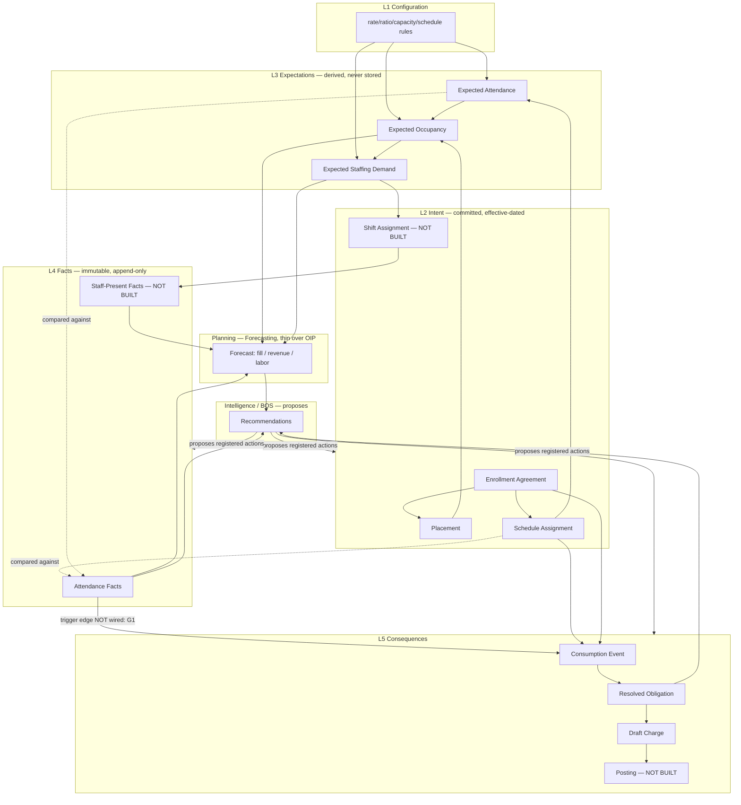

# Operational Expansion Architecture Audit — Phase A

**Status:** Architectural audit (Phase A). Read-only. **Not** an implementation sprint or a redesign.
**Audit base:** `origin/staging` @ `a3fdc946f` (latest staging at time of audit).
**Date:** 2026-07-10.
**Mission:** Determine whether the next operational expansion — **Enrollment → Scheduling → Attendance → Capacity → Staffing → Billing → Forecasting → Recommendations** — can be implemented primarily by **consuming** the existing platform, thereby proving Alloy's architecture rather than replacing it.

**Method:** Full read of platform doctrine under `/docs` (foundation, core, runtime, modules, operator, experience, analytics), then three independent code-verification passes (process engine boundary; operational-spine implementation inventory; UI/interaction reuse map). Where doctrine and implementation diverge, both are recorded.

---

## 1. Executive Summary

**The expansion is a consumption exercise, not a build. The architecture already anticipated it — and, in the L1→L4 range, already implemented it.**

Alloy is not "an enrollment CRM about to grow features." It is already an **Operational Execution Platform** organized on two ratified, orthogonal axes:

- **Surface axis (five planes):** Configuration / Planning / Operations / Records / Intelligence-BOS — *where an operator stands when they act* (`operational-ux-doctrine.md`).
- **Truth-flow axis (five layers):** L1 Configuration → L2 Intent → L3 Expectations (derived) → L4 Facts (immutable) → L5 Consequences (financial) — *what is true and what it derives from* (`operational-truth-flow-doctrine.md`).

Every item in the expansion chain is already a named coordinate on both axes. The doctrine's own tables enumerate Scheduling, Attendance, Capacity, Staffing, Billing, Subsidy, and Forecasting as *consumers* of the existing primitives, with their Operations surface, drawer tab, Startable actions, Planning input, and BOS role pre-specified.

**What the code audit found (the decisive result):**

| Layer | Capability | State |
|---|---|---|
| **L1 Config** | ratio / capacity / schedule / operating-window rules + one most-specific-wins effective-dated resolver | **Implemented** (`web/lib/childcareOperational/config/*`) |
| **L2 Intent** | agreements, effective-dated placements & schedule assignments, provenance FKs, supersede-not-patch | **Implemented** (`childPlacementService.ts`, `scheduleAssignmentService.ts`, migration `…enrollment_slice1.sql`) |
| **L3 Expectations** | expected attendance / occupancy / **staffing demand** — pure, derived, never persisted | **Implemented** (`expectations/scheduleExpectationCore.ts`) |
| **L4 Facts** | attendance fact stream — DB-enforced immutable/append-only, event-emitting, expected-vs-actual + actual compliance | **Implemented** (`attendance/*`, `child_attendance_events`) |
| **L5 Consumption** | Fact → Consumption Event → Resolved Obligation → draft Charge, incl. attendance & schedule interpreters + Draft Obligation Review | **Implemented as a library** (`operationalConsumption/*`, Slices 1–4) |
| **Commercial resolver** | subject-neutral pricing `evaluate()` (child/prospect/cohort/projected_seat — **not `job_id`**) + rate plans/rules | **Implemented** |

The expansion's genuine remaining build is **narrow and concentrated at three seams**, none of which is a new platform:

1. **The fact→consumption trigger edge is not wired.** The consumption pipeline is only ever invoked by a manual simulate route; no attendance/schedule/placement write calls `previewConsumption`/`draftConsumption`. Real facts do not yet flow to obligations automatically. *This is wiring, not a new engine.*
2. **Staffing exists only as demand, not as supply.** L3 derives *required* staff from occupancy (`requiredStaffForChildren`), but there is no staff roster / shift / actual-staff-present fact stream. "Staffed capacity" is explicitly deferred in code. *This is one new L2/L4 domain following the enrollment template.*
3. **Forecasting and a Scheduling *process* are the only true greenfield.** No forecasting code and no scheduling process definition exist — but the measurement substrate (OIP metrics, snapshots, trends) and the process engine to host them do.

**Answer to the mission:** Yes. Scheduling, Attendance, and Capacity can ship almost entirely by consuming implemented code (surface + wiring). Billing is convergence/adapter work over an already-built, subject-neutral pricing engine plus one missing authoritative layer (Posting). Staffing and Forecasting are the two places that add genuinely new operational facts — and even they add *definitions and facts*, not runtimes. The single most valuable action is **not to build anything new first, but to wire the fact→consumption edge and prove one non-enrollment process end-to-end** to flush out the real (localized) genericization cost.

---

## 2. Platform Consumption Audit

For each capability: what it owns today, and how each expansion module consumes it. Every capability below already exists; none should be redesigned.

### 2.1 Business Process Engine — *agnostic core, verified*

**Owns today:** A grain-neutral participation/stage/state model. The Process Engine core (`web/lib/process/engine/*`) is **grep-proven free of enrollment coupling**: its entire contract is four fields (`processKey`, `subjectType`, `contextType`, `inheritsContextStage`), and it consumes a `ProcessParticipant[]` returned by a per-process `ProcessParticipantProjection` — it never names a table. The Execution Runtime (`web/lib/mutations/*`) is a 4-phase mutation executor (Resolve → Evaluate → Preview → Commit) with an **additive domain registry**: "Future domains (billing, attendance, document, schedule) are added to the registry — not to a new runtime" (doctrine, verified in `domainRegistry.ts`).

**How each module consumes it:**
- **Scheduling / Attendance / Billing** each add a sibling `definitions/<process>/` folder (contract + projection + semantics — the enrollment three-part pattern) and, for any state mutation, a `domains/<x>.ts` handler + one `COMMAND_DOMAIN_MAP` row. **Zero engine edits.**
- **Capacity / Forecasting** are read/projection surfaces; they need no process of their own.

**Real cost (not a blocker):** the ~180-file `web/lib/lifecycle/*` builder/stage-work layer around the engine is enrollment-named and has only ever run one process. This is where a second process first reveals hidden enrollment assumptions — plus a few enrollment-flavored enums to widen (`WorkViewGrain`, `PARTICIPATION_VIEW_KEYS`, `MutationDomainKey`, `participant_creation`).

### 2.2 Current Work — *config-driven, process-agnostic*

**Owns today:** Operational progression on the Focus Panel (`current_work` card), projecting the org's published `stage_operating_plan_v1` — labels, outcomes, checklist, handoff routing. Explicitly "not enrollment-specific." Canonical July 2026 (PR #95).

**How each module consumes it:** any process that publishes a stage operating plan gets Current Work "for free." An Attendance daily-roster stage or a Billing-review stage reuses the same work runtime and handoff grammar (`resolveWorkItemHandoff` + `coordination.requestFocus()`) — no parallel work system.

### 2.3 Actions & Operational Command Runtime — *one mutation path*

**Owns today:** The event spine (`emitEvent → workflow_events → workflowRun → effects`) and the Operational Command Runtime: every mutation is a registered capability with placement, context resolution (`current_record` / `user_selection` / `queue_selection` / `bos_proposal` / …), eligibility, required subjects/inputs, preview, execution, audit, and refresh — all rendered through one platform-owned Command Surface (`CommandSurfaceShell`, identical across work-unit rail / Focus Panel Manage / queue row / BOS).

**How each module consumes it:** every expansion mutation — `record_attendance`, `set_schedule`, `assign_room`, `create_shift`, `add_charge`, `post_charges` — registers as **one** capability and is *placed* on many surfaces. "Never duplicate a command because it appears on another surface." The `operationalIntent.ts` fan-out (e.g. "Enroll Child" → `assign_room` + `create_contract` + `generate_documents`) is the enrollment→scheduling/billing seam already in code.

### 2.4 Queue System — *previews, extensible strategies*

**Owns today:** `work_units.queue_definition` JSON (sections/grains/filters/attention overlay), `QueueService`, the condensed queue→Focus-Panel Operational Mode, and a **Default Operational Subject Strategy** catalog whose keys already include **`Largest Balance` (Billing)**, `Earliest Due` (SLA), `Highest Risk`.

**How each module consumes it:** Attendance = a daily-roster queue at child grain; Billing = an AR queue with `Largest Balance` selection; Scheduling = a conflicts queue. All are `queue_definition` config + grain, not new list runtimes. Guardrail inherited: **queues are preview/selection only; never business or financial math.**

### 2.5 Focus Panel + Card Composition + Surface/Experience Builder — *one composition engine*

**Owns today:** One Focus Panel composed per operational subject; a card library of platform primitives; a frozen **Universal Surface Composition** model (`Surface → Canvas → Component → Evidence Group → Composition Item`; a Card is one Component; Expanded = Open Surface, recursively). Adding a surface family = register component type + renderer + content source + persistence adapter — **no new builder**. The composition doctrine's own examples already show *Attendance ▸ Summary*, *Billing ▸ Summary*, *Scheduling ▸ Summary*, *Staff ▸ Summary* composing from the same engine.

**How each module consumes it:** each module contributes cards/tabs that compose into the existing Focus Panel and get built in the existing Surface Composer. A `billing_preview` card already exists (read-only). Scheduling/Attendance/Staffing cards are added as primitives, not screens.

### 2.6 Configuration Platform + Field Platform — *shared config runtime*

**Owns today:** Four-plane settings + a Configuration Runtime (scope, ownership, `resolveInherited()`) with effective-dated versioning already proven on rate authoring. Field Platform separates Business Fields (`field_definitions`) from Runtime Signals (`computedFieldCatalog.ts`).

**How each module consumes it:** doctrine names "Fields V2, Layouts V2, **Scheduling, Billing**" as future consumers of the same config primitives. Rate/ratio/capacity/schedule rules are already first-class config entities with the shared effective-dated editor (`EffectiveDatedConfigurationEditor`), explicitly "slated to power capacity/ratio/operating-window/schedule authoring."

### 2.7 Communications Platform — *templates + scheduled sends*

**Owns today:** Canonical threads/messages, Template Library (immutable versions), scheduled sends (tour reminders), the Focus Panel Activity **Preview VM embed** pattern (frozen).

**How each module consumes it:** billing reminders, schedule-change notices, absence follow-ups reuse scheduled sends + template references. Guardrail: **do not duplicate message bodies** — reference `template_id`.

### 2.8 Operational Intelligence + Operational Calculations — *the measurement/forecast substrate*

**Owns today:** `Events → Metrics → KPIs → Snapshots → (Insights/Dashboards/Reports planned)`. A governed **Operational Calculation** descriptor layer wraps OIP resolvers ("one fact, one definition, many consumers"); Optimization Centers wrap `childcareOperational/*` read models. Snapshots + trends shipped.

**How each module consumes it:** Capacity/attendance/billing/staffing KPI packs are the declared-but-empty next packs. Forecasting is the **Planning plane** consuming L3 + L4 through this substrate — *register calculations, don't compute locally.*

### 2.9 AI / BOS — *proposal placement, not a system*

**Owns today:** Human-in-the-loop assist; BOS is a **placement** (`bos_proposal` context) on the same Command Runtime — it proposes registered actions, never invents behavior. Autonomous agents explicitly paused.

**How each module consumes it:** "Recommendations" = BOS reading resolved calculations + read models (absence patterns, delinquency, coverage gaps) and proposing registered actions. No new AI runtime; Phase-4 BOS aggregate queries (planned) call `MetricEngine.resolve()` only.

---

## 3. Platform Reuse Opportunities

Highest-leverage reuse, in order:

1. **The whole L1→L4 spine is already built for childcare** — agreements, effective-dated placements/schedules, config rules + resolver, immutable attendance facts, and pure expected/actual occupancy & staffing read models. Scheduling, Attendance, and Capacity **consume implemented code**; the new work is surfaces + wiring.
2. **The consumption pipeline (L4→L5) already understands attendance and schedule facts** (Slices 2–3) and produces reviewable draft obligations. Billing does **not** need a pricing engine — it needs the trigger edge wired and the authoritative Posting layer added.
3. **The commercial resolver is already subject-neutral** (`SubjectRef.type` includes `child/prospect/cohort/projected_seat`, never `job_id`). Billing convergence is adapter work.
4. **One shared config resolver powers both L3 expected and L4 actual** (`roomConfigResolvers.ts`) — ratios/capacity never drift between projection and fact.
5. **Every UI surface is a composition of existing primitives** — Focus Panel cards, queue rows, Command Surface, the five-planes tabs-vs-actions rule. No new interaction model is permitted or needed.
6. **Effective-dated versioning + supersede** is a solved, reusable pattern (`effectiveDating.ts`, `EffectiveDatedConfigurationEditor`) — placement, schedule, rate, and future staffing/capacity all reuse it.

---

## 4. Implementation Gaps

Genuine gaps (code-verified), separated from doctrine that merely awaits a consumer.

| # | Gap | Kind | Evidence |
|---|---|---|---|
| G1 | **Fact→Consumption trigger edge not wired.** Consumption pipeline invoked only by `…/consumption/simulate`; attendance/schedule/placement writes never call it. Real facts → no obligations. | **Wiring** | `attendance/*` has 0 refs to consumption; only caller is the simulate route |
| G2 | **Consequence reactors absent.** Facts emit events; nothing subscribes to turn them into consequences. | **Wiring** | no reactor/subscriber on `workflow_events` for billing/compliance/forecasting |
| G3 | **Staffing-as-supply missing.** Only *required* staff is derived; no staff roster / shift / actual-presence facts. "Staffed capacity" explicitly deferred. | **New facts (L2/L4)** | `capacityRules.ts` comment; no staff dirs |
| G4 | **No Scheduling *process*.** Only `enrollment` process definition exists. (Per-child `schedule_assignments` + occupancy projection *do* exist.) | **New definition** | `definitions/` has only `enrollment` |
| G5 | **Forecasting has no code.** Planning plane, forecast calculations, scenario modeling not built. | **New (thin, over OIP)** | no forecast code |
| G6 | **Posting layer absent (by design).** Everything left of Posting is built & non-authoritative; Posting/invoices/AR/payments/GL-posting/subsidy deferred. | **New authoritative layer** | `operational-consumption-platform.md`, `billing-financials-platform.md` |
| G7 | **Two commercial substrates coexist** — neutral `evaluate()` and older childcare tuition resolver. | **Convergence debt** | `commercial/execution/*` vs `resolveEnrollmentTuitionRate.ts` |
| G8 | **Focus Panel edit substrate incomplete.** Focus Panel is read-only for most operational data until the edit stack lands (Household → Children first). Write-capable cards (billing responsibility, schedule edits) are gated behind it. | **UI substrate** | `universal-card-system.md` editing gap |
| G9 | **V3 runtime adoption deferred.** Recursion/stacking/`visibleWhen` authored & persisted but not rendered live; Default Operational Subject Strategy is doctrine-only. | **UI runtime** | `presentation-runtime-carry-forward.md` |

**Gaps that are wiring or definitions (G1–G5) dwarf gaps that are new platforms (only G6).** That is the architectural proof.

---

## 5. Canonical Operational Model (Entity Audit)

The mission asked whether Agreement / Operational Commitment / Plan / Expected Occurrence / Observed Event / Exception / Resolution / Projection should become canonical entities. Verdict per concept — **challenged, and mostly already answered by existing durable facts.** Prefer durable operational facts over new abstractions.

| Proposed concept | Verdict | Canonical home (existing) |
|---|---|---|
| **Agreement** | **Adopt — already canonical.** | `child_enrollment_agreements` (L2). Generalize the *name* to "Operational Commitment" only in doctrine; keep per-domain tables. |
| **Operational Commitment / Plan / Schedule Assignment** | **Already canonical.** | `child_placements` + `schedule_assignments` (effective-dated, provenance FKs). A "Plan" is not a new entity — it is a committed L2 assignment. |
| **Expected Occurrence** (expected attendance/occupancy) | **Reject as an entity.** | L3 is **derived, never persisted** (`scheduleExpectationCore.ts`). Making it an entity violates ratified Law 2. Materialize only as a marked, recomputable cache. |
| **Observed Event** (attendance/presence) | **Already canonical.** | `child_attendance_events` — immutable, append-only, event-emitting. The keystone fact. Every future module copies this template. |
| **Exception / Variance** | **Reject as an entity.** | Variance is an *observational read model* over L3 vs L4 (`expectedVsActual.ts`), not stored. An operator-actioned exception is a **new fact** (correction/override), not a mutable exception row. |
| **Resolution** (commercial meaning of a fact) | **Adopt — already canonical.** | `consumption_events` + `resolved_obligations` (the named L4→L5 runtime contract). Do not reinvent as "Charge Event." |
| **Projection** | **Reject as an entity; adopt as a platform *concept*.** | Projections are deterministic pure functions (L3, occupancy, staffing demand). Govern them via **Operational Calculations**, don't table them. |

**Minimum canonical operational model (platform-level, industry-neutral):**

```
Configuration Rule (L1, effective-dated, most-specific-wins)
Operational Commitment (L2, effective-dated, supersede, provenance FK to source)
   └─ Assignment (placement / schedule / shift) — a commitment detail
Operational Fact (L4, immutable, append-only, event-emitting, corrects-by-reference)
Consumption Event → Resolved Obligation (L4→L5 interpretation contract)
Consequence (L5, append-only, authoritative only at Posting)
```

Everything else — Expectation, Variance, Occupancy, Staff Demand, Forecast — is a **derived projection**, not an entity. This is the durable-fact-first discipline the mission asked for, and it is already the shape of the code.

---

## 6. Consumer Dependency Graph

For each operational fact: creator, consumers, modifier, and what it can generate. (Operator = human action; BOS = proposal.)

| Fact / object | Created by | Consumed by | Modified by | Current Work | Actions it generates | Communications | AI recommendations |
|---|---|---|---|---|---|---|---|
| **Enrollment Agreement** (L2) | `approve_enrollment` handoff | placements, schedules, consumption scope, billing responsibility | operator (end/cancel; never patch) | "Confirm placement" | Place child, Build schedule, End agreement | Welcome / agreement notices | flag missing required info |
| **Placement** (L2, eff-dated) | handoff / operator supersede | expected occupancy, ratios, capacity, room roster | supersede only | "Assign room" | Change placement, Transfer | placement-change notice | placement vs capacity conflict |
| **Schedule Assignment** (L2, eff-dated) | handoff / operator supersede | expected attendance/occupancy, schedule consumption | supersede only | "Set schedule" | Set pattern, Adjust days, Drop-in | schedule-change notice | schedule/capacity conflict |
| **Attendance Fact** (L4, immutable) | `record_attendance` action | fold → summary; expected-vs-actual; actual occupancy/staffing/compliance; **(should) consumption** | correction/reversal (new row) | "Record what happened" | Mark present/absent, Correct, Room transfer | absence follow-up (scheduled) | absence-pattern detection, late-pickup |
| **Consumption Event → Resolved Obligation** (L4→L5) | consumption pipeline (currently manual) | Draft Obligation Review; (future) Posting | recompute (preview); review actions | "Review obligation" | Mark reviewed, Flag, Suppress, Recompute | balance/statement (future) | "why charged" explanation, delinquency (future) |
| **Draft Charge** (L5 non-authoritative) | charge resolution / consumption | obligation review; (future) Posting | recalc while draft; skip if posted | — | Add charge, Apply discount (future) | invoice (future) | balance explanation |
| **Required-Staff Demand** (L3 derived) | occupancy → `requiredStaffForChildren` | capacity binding, staffing gap read model | — (derived) | "Cover the gap" | (future) Create shift, Assign staff | coverage request (future) | coverage-gap suggestion |
| **Shift / Staff-Present Fact** (L4) — **not built (G3)** | (future) staff actions | actual staffing compliance, labor cost | correction (new row) | "Confirm coverage" | Create shift, Assign staff, Clock in/out | shift reminders | over/under-staffing warning |
| **Metric Snapshot** (measurement) | OIP snapshot writer | KPI strips, trends, forecast inputs, BOS | append-only | — | — | — | trend / forecast grounding |

---

## 7. Operational Dependency Graph

Distinguishing **operational facts** (immutable), **derived projections** (recomputable), **operator actions**, and **AI recommendations**.



**Legend:** Solid = implemented data flow. `compared against` = observational read model (no authorship). `NOT BUILT` = greenfield (G3/G6). `trigger edge NOT wired` = the G1 seam. Operator actions author only L2 and L4; projections (L3, forecast) author nothing; BOS proposes and humans commit.

---

## 8. Projection Model

**Should Alloy formally introduce deterministic projection engines?** — **They already exist and should be *governed*, not newly introduced.** Every projection below is a pure, deterministic function today; the platform decision is to register each as an **Operational Calculation** so no consumer re-derives it.

| Projection | Inputs | Implemented? | Governance home |
|---|---|---|---|
| Schedule → Expected Attendance | L2 schedules + patterns + placements + L1 | **Yes** — `expandExpectedAttendance` | register as calculation |
| Expected Attendance → Expected Occupancy | above, aggregated by room/date | **Yes** — `aggregateExpectedOccupancyByRoomDate` | register as calculation |
| Occupancy → Staff Demand | occupancy + L1 ratio tiers | **Yes** — `computeExpectedStaffingByRoomDate` / `requiredStaffForChildren` | register as calculation |
| Attendance → Actual Occupancy/Compliance | L4 facts + L1 | **Yes** — `actualCompliance.ts` | register as calculation |
| Attendance → Billing Impact | L4 facts → interpreter | **Yes (library)** — `attendanceInterpretation.ts` | consumption pipeline (wire G1) |
| Everything → Forecast | L3 + L4 + snapshots projected forward | **No (G5)** | Planning plane over OIP |

**Doctrine to ratify:** projections are **platform concepts governed by Operational Calculations**, never authoritative entities (Law 2). Materialization is permitted only as a marked, recomputable cache for forecasting/performance. This is already the code's posture; make it explicit doctrine so Forecasting doesn't invent a store.

---

## 9. Recommended Platform Additions

Additions only where genuinely necessary; each is an **extension**, not a new platform.

1. **Consumption trigger edge (G1/G2) — highest priority, smallest change.** A thin, idempotent event reactor that subscribes to attendance/schedule/agreement events and invokes the already-built `draftConsumption`. This is the single change that makes Billing "real" without building Billing. *Extension of the event spine, not a new runtime.*
2. **Staffing domain (G3).** One new L2 commitment (`shift_assignment`) + one new L4 fact stream (`staff_presence_events`) following the enrollment template exactly (effective-dated, immutable, event-emitting, provenance FK). Then `computeActualStaffing` gains a real *supply* input and the existing gap read model completes. *New domain, existing patterns.*
3. **Scheduling process definition (G4).** A `definitions/scheduling/` folder (contract + projection + semantics) so scheduling work has stages/queues/Current Work — hosted by the agnostic engine. *New definition, zero engine edits.*
4. **Posting layer (G6).** The one authoritative-write layer left of which everything is built: post draft obligations → immutable charges → invoices/AR/payments/GL. Gate this last; it is the only place that writes authoritative money. *New layer, cleanly bounded by existing doctrine.*
5. **Forecasting calculations (G5).** Register forward-projection Operational Calculations over L3 + L4 + snapshots; render in the Planning plane. *Thin layer over OIP, no new engine.*
6. **Commercial substrate convergence (G7).** Retire `resolveEnrollmentTuitionRate.ts` behind the neutral `evaluate()` via a typed adapter. *Convergence, not rebuild.*

**Explicitly do NOT add:** a new drawer/record module, a new navigation spine, a second ledger/GL, a per-domain builder, a projection store, a parallel metric engine, or a new AI runtime. Doctrine forbids each, and each already exists once.

---

## 10. Implementation Risks

| Risk | Severity | Mitigation |
|---|---|---|
| **`web/lib/lifecycle/*` genericization cost** — single-process-proven; a second process may surface hidden enrollment assumptions. | **High** | Prove one thin non-enrollment process (e.g. Schedule Tour as a second domain, or a minimal Scheduling process) *before* committing all modules. Widen the four enrollment-flavored enums first. |
| **Focus Panel read-only edit substrate (G8)** blocks write-capable cards (billing responsibility, schedule edits). | **High** | Sequence write-capable module cards *after* the edit substrate (Household → Children) lands; ship read-only cards (billing preview exists) meanwhile. |
| **Wiring the trigger edge could double-charge** if not idempotent. | **Medium** | Idempotency already designed (`idempotency_key`, `resolution_key`, per-period keys). Enforce at the reactor; recompute-in-preview before draft. |
| **Two commercial substrates** drift. | **Medium** | Converge via adapter early; freeze the neutral `evaluate()` as canonical. |
| **Posting is authoritative and irreversible.** | **High (but deferred)** | Keep everything left of Posting non-authoritative and recomputable (already the posture); build Posting last with reversal-by-reference only. |
| **Doctrine drift** — foundation docs (roadmap, release-history) lag module docs (see §11). | **Medium** | Reconcile before implementation so teams don't treat built capabilities as "Future." |
| **Baseline test suite is red** (memory: ~750 red in `web/`). | **Medium** | Gate on `typecheck:build` + isolated-worktree regression diff, not absolute green; solo agents (git races). |

---

## 11. Recommended Doctrine Updates

The audit found **implementation ahead of the top-level docs** — the opposite of the usual drift. Reconcile:

1. **`product-roadmap.md` and `release-history.md` are stale.** Both still list Attendance/labor and Billing under "Future," but `attendance-system.md`, `billing-financials-platform.md`, and `operational-consumption-platform.md` describe substantial *shipped* backend (attendance facts P2/P2.1, financial substrate P3.1–3.3, commercial Slices A–D, consumption Slices 1–4). Update the foundation docs to reflect the truth-flow expansion that is demonstrably underway.
2. **`placement-system.md` self-contradicts on `child_placements`.** It frames the table as both "future" (§Future placement runtime) and already-committed (§Enrollment proposal vs operational contract). The code confirms it exists. Remove the "future" framing.
3. **Ratify "Projections are governed calculations, never entities"** as an explicit line in `operational-truth-flow-doctrine.md` (§8 here) so Forecasting cannot introduce a store.
4. **Record the fact→consumption trigger edge as a named, pending platform seam** in `operational-consumption-platform.md` (today the pipeline reads as complete; it is complete as a *library* but unwired in product flows).
5. **Generalize "Agreement" → "Operational Commitment"** in doctrine vocabulary (keep per-domain tables) so Staffing's shift-commitment reads as the same template.
6. **`operational-mutation-platform.md` is marked superseded** by `business-process-execution-platform.md` — ensure the domain-registry extension story (billing/attendance/schedule) lives canonically in the successor.

---

## 12. Recommended Phase Sequencing

Ordered to **prove the architecture cheaply, then extend**, respecting the UI substrate gate.

- **Phase 0 — Reconcile & prove (no new platform).**
  Update stale doctrine (§11). Widen the four enrollment enums. Prove one **non-enrollment process** end-to-end (thin Scheduling process or second mutation domain) to flush out `lifecycle/*` genericization cost. *Exit criterion: a second process runs through the agnostic engine with no engine edit.*

- **Phase 1 — Wire what's already built (G1/G2).**
  Add the idempotent consumption trigger reactor so attendance/schedule facts auto-produce Resolved Obligations into the existing Draft Obligation Review. **This makes Billing visible with zero new Billing code.** Register attendance/occupancy/staffing-demand Operational Calculations.

- **Phase 2 — Attendance & Capacity surfaces (consume L4/L3).**
  Attendance daily-roster queue + Focus Panel Attendance tab (Startable → Active); Capacity/occupancy read-model surfaces. Read-only cards first (edit substrate not required for recording via actions).

- **Phase 3 — Scheduling process & edit substrate.**
  Ship the Scheduling process definition; land the Focus Panel edit substrate (Household → Children) that unblocks write-capable cards (schedule edits, billing responsibility).

- **Phase 4 — Staffing (new facts, existing patterns) (G3).**
  Add `shift_assignment` (L2) + `staff_presence_events` (L4); complete actual-staffing compliance; coverage-gap BOS proposals.

- **Phase 5 — Posting (the only authoritative layer) (G6).**
  Post obligations → immutable charges → invoices/AR/payments/GL. Reversal-by-reference only.

- **Phase 6 — Forecasting & Recommendations (G5).**
  Planning-plane forecast calculations over L3+L4+snapshots; BOS delinquency/fill/labor recommendations (Phase-4 BOS aggregate queries).

**Note the ordering inverts the naive chain:** Billing *value* appears in Phase 1 (wiring), not last, because its engine is already built.

---

## 13. Capabilities to Freeze Before Implementation

Freeze these contracts before the expansion touches them, so consumers build against stable seams:

1. **The Process Engine contract** (`processParticipationContract.ts`, `ProcessParticipantProjection`) and the **Execution Runtime domain-registry recipe** — the agnostic core new processes depend on.
2. **The truth-flow four ratified laws** (complementary axes; expectations-derived; financials-from-facts; facts-immutable) — plus the new "projections are governed calculations, never entities" line.
3. **The effective-dated supersede pattern** (`effectiveDating.ts`) — the universal L2/L4 mutation discipline every new domain copies.
4. **The immutable append-only fact contract** (attendance as reference: DB trigger + corrects-by-reference + event emission) — the template for staff-presence and any new fact.
5. **The Operational Consumption runtime contract** (`consumption_events` → `resolved_obligations`, idempotency keys, recompute-in-preview) — freeze *before* wiring the trigger edge.
6. **The neutral Commercial `evaluate()` subject model** (`SubjectRef.type`, no `job_id`) — freeze as the one pricing substrate; converge substrate A behind it.
7. **The Operational Command Runtime + Command Surface** contract — one capability, many placements; the single mutation path.
8. **The Universal Surface Composition model** + Surface Composer seams (component type / renderer / content source / persistence adapter) — the one way surfaces are built.
9. **The five-planes tabs-vs-actions rule** and Hidden/Startable/Active states — the one interaction model for every new domain surface.
10. **Operational Calculations as the sole fact-definition layer** — freeze "no consumer re-derives a fact" before Capacity/Staffing/Forecast add measurements.

---

## Appendix — Evidence base

- **Doctrine read:** `operational-truth-flow-doctrine.md`, `operational-ux-doctrine.md`, `business-process-system.md`, `entity-model.md`, `placement-system.md`, `status-and-state-system.md`, `operational-calculations.md`, modules (`attendance-system`, `operational-consumption-platform`, `billing-financials-platform`, `operational-intelligence-platform`, `operational-mutation-platform`, `business-process-execution-platform`, `actions-and-workflows`, `communications-platform`, `ai-platform`, `configuration-platform`, `field-concepts`), operator/experience UI docs, `platform-event-catalog`, `product-roadmap`, `release-history`, `platform-capabilities`.
- **Code verified:** `web/lib/process/{engine,definitions/enrollment}/*`, `web/lib/mutations/domainRegistry.ts`, `web/lib/childcareOperational/{config,expectations,attendance}/*`, `web/lib/operationalConsumption/*`, `web/lib/financials/*`, `web/lib/commercial/execution/*`, `web/lib/emitEvent.ts`, `web/lib/workflowRun.ts`, and migrations `20260625…slice1` → `20260709…slice4` plus commercial/rate/consumption tables.
- **Key discrepancies recorded:** foundation docs lag module docs (§11.1); `placement-system.md` self-contradiction (§11.2); consumption pipeline complete-as-library but unwired (§4 G1, §11.4).
