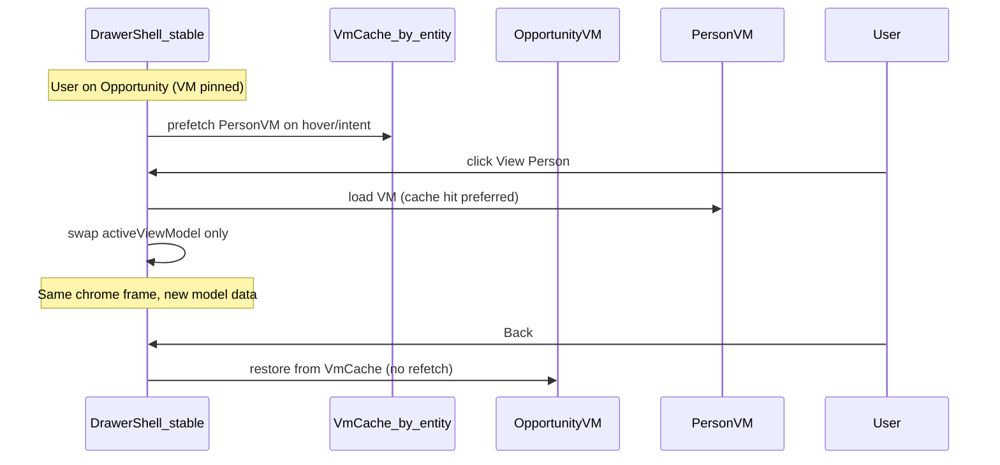

# Drawer-to-drawer navigation audit (Loop 4)

**Status:** Audit only — no implementation in this batch.

## Current navigation paths

### Opportunity → Person (parent/guardian)

1. User clicks View Person on primary contact / family card.
2. `openViewPersonFromOpportunity` (`web/lib/admin/drawer/openViewPersonFromOpportunity.ts`) may seed cache, then `openDrawer({ type: "persons", parent: opportunity })`.
3. `AdminDrawerContext` pushes opportunity onto stack, sets drawer to `persons`.
4. `AdminEntityDrawer` runs entity open effect: seed paint → legacy `GET /api/admin/entity/persons/:id` or composed-payload refetch loop until `evaluateComposedPersonDrawerPayload` ready.
5. **Back** pops stack → opportunity drawer remounts/rehydrates from cache.

### Opportunity → Child

1. Inquiry children View Person → `openInquiryChildPersonFromOpportunitySync` with child seed.
2. Same stack push; child chrome detected via `openSource: opportunity_inquiry_child` + seed emphasis.
3. Composed child payload gates block reveal until full entity + section registry satisfied.

### Person → Person (household links)

- `openPersonDrawerFromHousehold` — new stack entry or in-place navigation depending on source.

## Problems today (vs desired Excel-tab UX)

| Issue | Cause |
|-------|--------|
| Full drawer teardown on nested open | `openDrawer` replaces `drawer.type/id`; opportunity unmounts |
| Skeleton / second beat on person open | Seed → full GET → composed refetch loop |
| Header/status flicker on back | Opportunity remount; cache may not pin pipeline/VM |
| Cold person open from opportunity | No VM preload at click time (prefetch is best-effort) |
| Separate loading shells | Person uses `personDrawerComposedPreparing` / overview skeletons |

## Desired model: model-swap navigation

**Invariants:**

- Drawer shell (width, overlay, back affordance) stays mounted.
- Active record swaps by replacing pinned VM + paint record, not `type/id` tear-down.
- Next VM prepared before visual swap (prefetch on hover or synchronous VM hit).
- No skeleton if VM `first_paint.settled` in cache.

## Required VM prefetch/cache model (proposal)

### Cache key

`drawerVm:{entity}:{id}:{surface}` where `surface` is `opportunity | person:parent | person:generic | child`.

### Storage

- Extend `drawerEntitySnapshotCache` or parallel `drawerViewModelCache` with TTL + generation match.
- Store full VM + preload shape; warm reopen skips network when `generation` unchanged.

### Prefetch triggers

| Trigger | Action |
|---------|--------|
| Hover View Person in opportunity | `fetchPersonDrawerViewModelClient` or `fetchChildDrawerViewModelClient` |
| Pointer down | Same, higher priority |
| Opportunity VM open | Optional adjacent person prefetch for linked IDs in first viewport |
| Back navigation | Read cache only — no GET |

### Shell stability

- Refactor `AdminDrawerContext` to `{ shellOpen, activeModel, stack: ModelRef[] }` instead of replacing entire drawer state.
- `AdminEntityDrawer` renders from `activeModel.entityType + viewModel` without unmounting shell chrome.

## Implementation plan (future batch)

1. **Phase A — VM cache layer** — `drawerViewModelSessionCache.ts` with get/put/peek, generation check.
2. **Phase B — Intent prefetch** — wire person/child VM fetch into hover paths (`openViewPersonFromOpportunity`, inquiry children).
3. **Phase C — Model-swap open** — `navigateDrawerModel(next)` pushes model ref, does not clear opportunity VM refs.
4. **Phase D — Shell pin** — split `AdminEntityDrawer` shell from entity body; swap body props only.
5. **Phase E — Back without remount** — stack stores VM snapshot + scroll/tab state.

## Tests needed (future)

- Cache hit on second open same person — zero network.
- Opportunity → Person → Back — opportunity header generation unchanged, no bootstrap GET.
- Prefetch on hover — VM in cache before click.
- Model swap — shell DOM stable (single drawer root, no unmount count increase).
- Child vs parent cache keys — no cross-contamination.
- Hard cutover — swap still respects VM failure (no legacy fallback).

## Out of scope (this batch)

- Work Unit / Department VM cutover
- Full shell refactor (Phase D) — audit only
- Replacing drawer stack semantics in `AdminDrawerContext`
