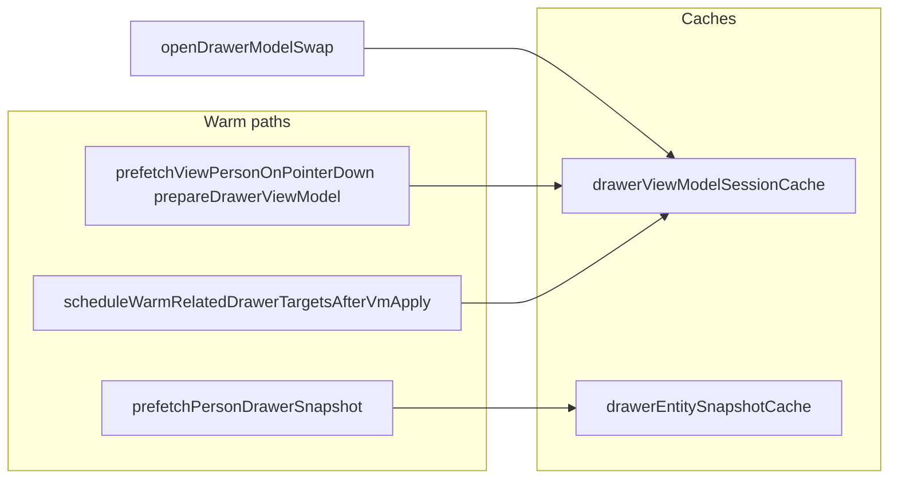

# VM Drawer Transition & Performance Audit

**Status:** Audit only — no implementation in this pass.  
**Date:** 2026-06-04  
**Context:** Drawer-to-drawer navigation (Opportunity ↔ Person/Child) feels broken or slow after Phase C atomic-swap work. Reported QA timings and failures are incorporated as evidence; this document traces the **current code** to explain where time goes and what to fix next.

---

## Executive summary

| Symptom | Likely root cause (code-backed) |
|--------|----------------------------------|
| Opportunity → Person extreme delay (~6.4s) | Click blocks on **`prepareDrawerViewModel` → full HTTP compose** (`/api/admin/v2/view-models/drawer/person/[id]`). Server work is heavy (`buildPersonDrawerEntityPayloadForViewModel` + `attachPersonDrawerVisibility` + status defs). Warm path often **does not populate VM session cache before click**. |
| Opportunity → Child delay + **500** (~6s) | Same VM prepare path via **`/api/admin/v2/view-models/drawer/child/[id]`**; 500 = **uncaught exception** in `composeChildDrawerViewModel` (route catch), not 422 composed-not-ready. |
| Person → Back to Lead slow | `goBack` restores drawer state from stack but **only rehydrates `opportunityDrawerPreloadRef` from `peekDrawerViewModelPreloadSync`**. Cache miss → Opportunity runtime **cold-fetches** composed/VM again. |
| Warm-loading ineffective | Post–first-paint warm is **microtask-scheduled** and uses **`record.primary_person_id`** for primary contact; Opportunity VM `above_fold.record` may **not** expose that top-level field → primary Person warm may **never run**. Parallel **legacy** warm (`prefetchPersonDrawerSnapshot` → entity API) does **not** feed VM swap cache. |
| Person status “disappeared” | VM path uses **`VmPersonStatusControl`** (readonly pill). Status renders only when `displayVm.header.status_label` is set; if falsy, **`statusControl` is `null`** (no pill, not even “—”). Legacy interactive status control is not on VM runtime. |
| Queue status far from household | Header grid uses **`minmax(360px, 1fr)` on the attention column**, which reserves a wide third column between status and attention text — reads as large whitespace between household/status and the rest of the row. |

---

## 1. Current architecture map

### 1.1 Entry router

| File | Role |
|------|------|
| `web/components/admin/AdminEntityDrawer.tsx` | Routes by `resolveVmDrawerDisplayRoute(drawer, pathname, phase, previousDrawer)` → `OpportunityDrawerVmRuntime`, `PersonsDrawerVmRuntime`, or `AdminEntityDrawerLegacy`. |
| `web/lib/adminV2/viewModel/drawer/vmRuntime/vmDrawerTransitionCoordinator.ts` | During `swap_preparing`, **`resolveDrawerVmRenderDrawer`** keeps **source** drawer mounted until commit. |
| `web/lib/adminV2/viewModel/drawer/vmRuntime/vmDrawerRuntimeRoute.ts` | Maps drawer state + pathname to `opportunity` \| `person` \| `child` \| `legacy`. |

### 1.2 How each VM opens

#### Opportunity VM (default-on)

| Step | Function / route |
|------|------------------|
| Cutover | `opportunityDrawerHardCutoverEnabled()` — default **on**; opt-out via `NEXT_PUBLIC_ADMINV2_DRAWER_VM_KILL_SWITCH`. |
| Cold / queue open | `loadOpportunityDrawerComposedOpen` / `loadOpportunityDrawerViaViewModel` from `web/lib/admin/opportunityDrawerOpenCoordinator.ts`. |
| Server compose | `GET /api/admin/v2/view-models/drawer/opportunity/[id]` → `composeOpportunityDrawerViewModel`. |
| Client runtime | `useOpportunityDrawerVmPayload` in `OpportunityDrawerVmRuntime.tsx` — applies VM, then **`scheduleWarmRelatedDrawerTargetsAfterVmApply`**. |

#### Person VM (default-on)

| Step | Function / route |
|------|------------------|
| Cutover | `personDrawerHardCutoverEnabled()` — default **on**; opt-out via `NEXT_PUBLIC_ADMINV2_PERSON_DRAWER_VM_KILL_SWITCH`. |
| Prepare / fetch | `prepareDrawerViewModel` → `loadPersonDrawerViaViewModel` → `fetchPersonDrawerViewModelClient`. |
| Server compose | `GET /api/admin/v2/view-models/drawer/person/[id]?open_source=&presentation_emphasis=` → `composePersonDrawerViewModel`. |
| Client runtime | `PersonsDrawerVmRuntime` + `usePersonsDrawerVmPayload` (parent/generic surfaces). |

#### Child VM (default-on)

| Step | Function / route |
|------|------------------|
| Cutover | `childDrawerHardCutoverEnabled()` — default **on**; opt-out via `NEXT_PUBLIC_ADMINV2_CHILD_DRAWER_VM_KILL_SWITCH`. |
| Surface resolution | `resolvePersonDrawerViewModelSurface` → cache surface **`child`** when `open_source=opportunity_inquiry_child` or `presentation_emphasis=child_lifecycle`. |
| Server compose | `GET /api/admin/v2/view-models/drawer/child/[id]` → `composeChildDrawerViewModel` (reuses `buildPersonDrawerEntityPayloadForViewModel`). |
| Client runtime | Same `PersonsDrawerVmRuntime` / `usePersonsDrawerVmPayload` with `isChildSurface`. |

### 1.3 Drawer-to-drawer navigation (today)

```mermaid
sequenceDiagram
    participant UI as Contact/Child link
    participant Ctx as AdminDrawerContext
    participant Prep as prepareDrawerViewModel
    participant Cache as drawerViewModelSessionCache
    participant API as VM API route
    participant Router as AdminEntityDrawer

    UI->>Ctx: openDrawer(persons, id, source, parent, workspace)
    Ctx->>Ctx: isDrawerModelSwapEligible → openDrawerModelSwap
    Ctx->>Ctx: pushDrawerToStack(current)
    Ctx->>Ctx: phase = swap_preparing (visible drawer unchanged)
    Ctx->>Cache: peekDrawerViewModelPreloadSync
    alt cache hit
        Ctx->>Ctx: commitDrawerModelSwap(preload)
        Ctx->>Ctx: applyDrawerTargetNavigation + phase showing
    else cache miss
        Ctx->>Prep: prepareDrawerViewModelForOpen (async)
        Prep->>API: loadPerson/ChildDrawerViaViewModel (fetch)
        API-->>Prep: viewModel JSON (~seconds)
        Prep->>Cache: putDrawerViewModelCacheEntry
        Prep-->>Ctx: preload
        Ctx->>Ctx: commitDrawerModelSwap(preload)
    end
    Router->>Router: route switches to PersonsDrawerVmRuntime
    Note over Router: drawerVmRender still source until commit; then target id
```

**Key files**

| Concern | File |
|---------|------|
| Swap eligibility | `isDrawerModelSwapEligible` in `drawerModelSwapNavigation.ts` |
| Swap start / commit | `openDrawerModelSwap`, `commitDrawerModelSwap` in `AdminDrawerContext.tsx` |
| Atomic visible drawer | `resolveDrawerVmRenderDrawer` in `vmDrawerAtomicSwap.ts` |
| Prepare + cache | `prepareDrawerViewModel`, `prepareDrawerViewModelDeduped` in `drawerModelSwapNavigation.ts` |
| Sync cache peek | `peekDrawerViewModelPreloadSync` in `drawerShellPinnedModelSwap.ts` |

### 1.4 Warm-loading schedule

| When | What |
|------|------|
| After Opportunity/Person/Child VM **apply** (first paint) | `scheduleWarmRelatedDrawerTargetsAfterVmApply` in `drawerVmPayloadWarmRelated.ts` — **`queueMicrotask`**, deduped by `warmKey` per entity+generation. |
| Microtask body | `warmRelatedDrawerViewModels` in `drawerModelSwapNavigation.ts` — calls `prepareDrawerViewModelDeduped` for related targets (no await in UI). |
| Hover / pointer on contact | `prefetchViewPersonOnPointerDown` → **`prefetchPersonDrawerSnapshot`** (legacy **`/api/admin/entity/persons/:id`**) + fire-and-forget `prepareDrawerViewModel`. |
| Child row click prep | `openInquiryChildPersonFromOpportunity` → `prepareDrawerViewModel` (child surface) before `openViewPersonFromOpportunity`. |

**Important:** Legacy snapshot warm **does not** write `drawerViewModelSessionCache`. Only successful **`prepareDrawerViewModel`** does.

### 1.5 Cache storage

| Store | Location | TTL | Contents |
|-------|----------|-----|----------|
| VM session cache | `drawerViewModelSessionCache.ts` in-memory `Map` | 5 min default | `DrawerViewModelPreload` per `entityType` + `entityId` + **surface** + org/dept/wu context key |
| Opportunity preload ref | `opportunityDrawerPreloadRef` in `AdminDrawerContext` | Until consumed / close | `OpportunityDrawerOpenPreload` set on swap commit |
| Person preload ref | `personDrawerPreloadRef` | Until consumed / close | Person/Child preload on swap commit |
| Legacy entity snapshot | `drawerEntitySnapshotCache` | Separate | Full entity JSON from `/api/admin/entity/...` — **not used for VM atomic swap commit** |

Cache key example: `drawerVm:persons:{personId}:person:parent:{org}:{dept}:{wu}`.

### 1.6 Back to Lead (stack restore)

| Step | Behavior |
|------|----------|
| `goBack` | `AdminDrawerContext.tsx` — pops `stack`, calls **`restoreVmPreloadFromStackItem`**, sets `drawer` from stack item, `drawerRuntimePhaseForShowing`. |
| Restore preload | `peekDrawerViewModelPreloadSync(buildPrepareParamsFromOpenDrawer(stackItem))` → if hit, copies into `opportunityDrawerPreloadRef` or `personDrawerPreloadRef`. |
| **No** `commitDrawerModelSwap` on back | Navigation is immediate `setDrawer`; Opportunity runtime must consume preload or sync cache in `useOpportunityDrawerVmPayload` / layout effect. |
| Back link UI | `resolvePersonDrawerOperatingBackLink` → label e.g. “Back to Lead”; `goBack()` in `PersonsDrawerVmRuntime.tsx`. |

If Opportunity VM cache expired or was never written (e.g. only legacy snapshot warmed), **Back to Lead triggers another full Opportunity compose/fetch**.

### 1.7 Cutover flags (default-on vs kill-switch)

| Entity | Default | Opt-out env |
|--------|---------|-------------|
| Opportunity | **On** | `NEXT_PUBLIC_ADMINV2_DRAWER_VM_KILL_SWITCH` |
| Person | **On** (recent gate alignment) | `NEXT_PUBLIC_ADMINV2_PERSON_DRAWER_VM_KILL_SWITCH` |
| Child | **On** | `NEXT_PUBLIC_ADMINV2_CHILD_DRAWER_VM_KILL_SWITCH` |

Legacy `NEXT_PUBLIC_ADMINV2_PERSON_DRAWER_VM` / `CHILD` env **no longer gate** cutover in `drawerViewModelFeatureGates.ts` (kill-switch model matches Opportunity).

Shadow / diagnostics: `NEXT_PUBLIC_ADMINV2_DRAWER_VM_SHADOW` — logging only, not route selection.

---

## 2. Actual click-path trace (Opportunity → Person)

### 2.1 UI origin

| Surface | Component | Handler |
|---------|-----------|---------|
| Primary contact (Kevin) | `EditablePersonContactCard` | `handleViewPersonClick` → `openViewPersonFromOpportunity` |
| Inquiry child (Mia/Liam) | `openInquiryChildPersonFromOpportunity` (async) → `openViewPersonFromOpportunity` with `PERSON_DRAWER_CHILD_OPEN_SOURCE` |
| Household panel (if used) | `OpportunityHouseholdPeoplePanel` | `openDrawer({ type: "persons", id })` directly |

**Files:**  
`web/components/admin/opportunity/EditablePersonContactCard.tsx`  
`web/lib/admin/drawer/openViewPersonFromOpportunity.ts`  
`web/lib/admin/drawer/openInquiryChildPersonFromOpportunity.ts`

### 2.2 openViewPersonFromOpportunity

1. Optional seed / `putDrawerEntitySnapshot` when snapshot cold.  
2. **`openDrawer({ type: "persons", id, source: "opportunity_primary_contact", parent: { opportunities, opportunityId }, personDrawerOpenSeed, opportunityWorkspaceContext })`**.  
3. **`prefetchPersonDrawerSnapshot`** on cold path → **`GET /api/admin/entity/persons/:id`** (includes **`attachFieldDefinitionsAndValues`** — explains ~330ms × 3 field registry queries in logs **in parallel with VM path**, not inside VM compose).

### 2.3 AdminDrawerContext.openDrawer

1. `isDrawerModelSwapEligible(opportunity, person)` → **`openDrawerModelSwap`**.  
2. `pushDrawerToStack(current opportunity)`.  
3. `drawerRuntimePhase` → **`swap_preparing`** (Opportunity UI remains mounted via `drawerVmRender`).  
4. `peekDrawerViewModelPreloadSync(prepareParams)` — sync cache hit → instant commit; else async `prepareDrawerViewModelForOpen`.  
5. **`commitDrawerModelSwap`**: if `preload` null → **no navigation**, `swapFallbackFetch`; if preload present → `personDrawerPreloadRef`, **`applyDrawerTargetNavigation`**, phase **`showing`**.

### 2.4 prepareDrawerViewModel (miss path)

1. `vmCutoverEnabled` → person/child hard cutover.  
2. Cache miss → **`loadPersonDrawerViaViewModel`**.  
3. Client: **`fetch`** ` /api/admin/v2/view-models/drawer/person/[id]?open_source=opportunity_primary_contact&presentation_emphasis=...`.  
4. Server: **`composePersonDrawerViewModel`**.  
5. `putDrawerViewModelCacheEntry` → return preload.

### 2.5 Final render

1. `AdminEntityDrawer` → `PersonsDrawerVmRuntime`.  
2. `usePersonsDrawerVmPayload`: consume preload ref / sync cache / or cold fetch.  
3. **`committedVisible`** gates title, subtitle, body (no partial header-only swap).  
4. Status: `VmPersonStatusControl` only if `header.status_label` truthy.

### 2.6 Where delay occurs (ordered)

| Phase | Typical cost (reported / inferred) | Blocking? |
|-------|-----------------------------------|-----------|
| Click → `openDrawerModelSwap` | &lt;1ms | — |
| `swap_preparing` (hold Opportunity UI) | 0 visible change | User still sees Opportunity |
| **`prepareDrawerViewModel` HTTP** | **~6.4s** (QA) | **Yes — commit waits for preload** |
| Parallel legacy `prefetchPersonDrawerSnapshot` | ~1s+ (3× ~330ms field queries + entity payload) | **No** for VM commit (different cache) |
| `commitDrawerModelSwap` + React render | **~5.4s render** (QA) — likely large VM JSON + React tree (PersonsDrawerVmBody) | After preload |
| **Total perceived** | ~6–12s | Dominated by server compose + main-thread render |

**Conclusion:** Delay is **not** primarily in the click handler; it is **server VM compose** on cache miss, then **heavy client render** of the returned record.

---

## 3. Performance bottleneck audit

### 3.1 Person VM API — `composePersonDrawerViewModel`

**Route:** `web/app/api/admin/v2/view-models/drawer/person/[id]/route.ts`  
**Composer:** `web/lib/adminV2/viewModel/drawer/person/composePersonDrawerViewModel.ts`

#### DB / server work (sequential unless noted)

| Phase | Calls | Notes |
|-------|-------|------|
| Gate | `loadAdminRouteGate`, `assertRowOrg(persons)` | |
| `record_full_ms` | `buildPersonDrawerEntityPayloadForViewModel` | See table below |
| `status_definitions_ms` | `fetchEffectiveStatusDefinitionsTagged(persons)` | Org status defs |
| Composed gate | `evaluateComposedPersonDrawerPayload` | CPU; registry section readiness |

#### `buildPersonDrawerEntityPayloadForViewModel` (parallel batch + visibility)

| Query / work | Parallel? |
|--------------|-----------|
| `persons` select `*` | First |
| `resolveStatusLabel` (person `status_key`) | After person row |
| `customer_persons` + nested `customers`, `customer_person_role_types` | Parallel slot 1 |
| `person_relationships` | Parallel slot 2 |
| `contacts` + `customer_members` | Parallel slot 3 |
| `person_locations` | Parallel slot 4 |
| `opportunities` by `primary_person_id` | Parallel slot 5 |
| **`attachPersonDrawerVisibility`** | **After** parallel batch — **large sequential graph** |

#### `attachPersonDrawerVisibility` (high cost — main suspect for multi-second compose)

Runs **enrollment mirror**, **enrollment opportunities** (opportunity_persons + opportunities + role types + parallel status label resolves), **sibling links**, **household adult/child links** (more persons/customer_members/customer_persons queries), **household addresses**, merges, site-scope filtering.

**File:** `web/lib/admin/person/attachPersonDrawerVisibility.ts` (~550+ lines of Supabase access).

**Not called in VM compose today:** `attachFieldDefinitionsAndValues` (`entityFieldRegistryAttach.ts`).  
Reported **`field_definitions.list_active` / `field_section_definitions.list` / `field_values.by_entity`** (~329–340ms each) align with **`GET /api/admin/entity/persons/:id`** from **`prefetchPersonDrawerSnapshot`**, not the VM route.

### 3.2 Child VM API — `composeChildDrawerViewModel`

**Route:** `web/app/api/admin/v2/view-models/drawer/child/[id]/route.ts`

Same **`buildPersonDrawerEntityPayloadForViewModel`** + **`attachPersonDrawerVisibility`** as Person, then:

| Step | Risk |
|------|------|
| `fetchEffectiveStatusDefinitionsTagged` | Same as person |
| `evaluateComposedPersonDrawerPayload` (child surface) | Requires registry sections: `child_summary`, `child_header_chips`, `child_household`, `child_medical`, `child_bos_panel` |
| Readiness helpers | e.g. `childDrawerHouseholdCoordinatedReady` needs **`_household_adult_links` in record** (visibility must succeed) |

#### Why 500 (not 422)

Route returns **500** only in **`catch`** with exception message. **422** is returned for `!result.ok` skipped (composed not ready / not found).

**Implication:** Child failures are likely **thrown errors** inside:

- `attachPersonDrawerVisibility` (enrollment mirror, household graph),
- `buildPersonEnrollmentMirrorRowsForMemberIds`,
- or unexpected null access in compose — **needs server log / `X-Alloy-Server-Duration` + stack** on failing requests.

**Not** the same as “composed not ready” (422).

### 3.3 Sequential vs parallel opportunities

| Already parallel | Still sequential / duplicated |
|------------------|-------------------------------|
| Initial 5-way batch in `buildPersonDrawerEntityPayloadForViewModel` | Visibility graph after batch |
| `field_definitions` + `field_sections` in entity API (Promise.all) | Person + Child warm each **full compose** |
| Status label resolves inside visibility (batched per section) | **Opportunity → Person + Child** warms = **2× full composes** if both clicked |
| | **Status defs** fetched per person compose (could share org-level cache per request) |

### 3.4 Why render ~5.4s (client)

| Factor | Detail |
|--------|--------|
| Payload size | Full `record` on VM includes visibility mirrors, household links, enrollment rows, etc. |
| React tree | `PersonsDrawerVmBody` + operating sections / household / BOS panels |
| No field defs on VM | UI may still assume keys; gender/address helpers read `_field_definitions` — often **empty on VM path** → less work but possible layout churn |
| `committedVisible` gate | Reduces flicker but does not reduce mount cost once committed |
| Diagnostics | `logDrawerVmRuntime` / React dev mode add overhead in dev |

Recommend measuring: Performance tab → “Main” after preload, React Profiler on `PersonsDrawerVmRuntime` mount.

### 3.5 Per-drawer field registry fetches

| Path | Fetches field definitions? |
|------|---------------------------|
| VM Person/Child compose | **No** |
| Legacy `/api/admin/entity/persons/:id` | **Yes** — `attachFieldDefinitionsAndValues` |
| Hover/click prefetch | **Yes** (legacy entity API) |

So field registry slowness **hurts warm perception and duplicates work** but is **orthogonal** to VM swap commit unless we mistakenly wait on entity snapshot (we do not for commit).

### 3.6 Bundling Person/Child from Opportunity first paint

**Opportunity VM record** already carries inquiry children (`_inquiry_children`), identity, and much inquiry summary data from `buildOpportunityDrawerVisiblePayload` / above-fold compile.

**Gap:** Person/Child VM compose **re-queries the full person graph** instead of reusing:

- `primary_person_id` / `_identity.primary_person` / inquiry child `person_id`s already on the opportunity record,
- partial person rows already hydrated on opportunity open.

**Warm bug:** `warmRelatedDrawerViewModels` uses:

```ts
const primaryPersonId = trimId(params.record.primary_person_id);
```

Opportunity VM `above_fold.record` is built from opportunity entity pipelines that often expose **`_primary_person_id`** / **`_identity.primary_person`**, not necessarily top-level **`primary_person_id`**. Tests use synthetic `primary_person_id` in `drawerVmPayloadWarmRelated.test.ts`; production record shape may **skip primary Person warm entirely**.

**Files to fix in implementation:** `drawerModelSwapNavigation.ts` (`warmRelatedDrawerViewModels`), opportunity record shape docs in `opportunityEntityRecord.ts`.

---

## 4. Warm-loading feasibility

| Question | Answer |
|----------|--------|
| Does warm fire after Opportunity first paint? | **Yes**, when `useOpportunityDrawerVmPayload.applyVm` runs → `scheduleWarmRelatedDrawerTargetsAfterVmApply` (microtask). |
| Are Person/Child requests made before click? | **Only if** warm resolves IDs from record + user hovers (`prefetchViewPersonOnPointerDown`). Otherwise **after** first paint microtask, **async** `prepareDrawerViewModelDeduped`. |
| Are successful warms stored and reused? | **Yes**, in `drawerViewModelSessionCache` + `personDrawerPreloadRef` on commit. **No** if warm never ran or wrong surface/key. |
| Why does click still wait? | **Cache miss at click** → `openDrawerModelSwap` awaits **`prepareDrawerViewModelForOpen`** before commit. Typical causes: warm not finished, wrong cache surface (parent vs child), missing `primary_person_id` on record, deduped prepare still in flight, first open before microtask. |
| Excel-tab / Comms instant feel | Requires **sync cache hit** at click (`peekDrawerViewModelPreloadSync` returns preload) **or** sub-200ms compose. Today compose is **seconds**; Comms tab uses different data path (already on opportunity VM / tabs). |

### 4.1 Dual-stack problem



**Atomic swap only reads VM cache.** Legacy entity warm is **misleading** for QA (“we prefetched but click is slow”).

---

## 5. Recommended architecture (durable, minimal)

Design goal: **Excel-like tabs** — source stays mounted; target payload ready before visible swap; back is stack + cache only.

1. **Single preload pipeline** — All warms and clicks use `prepareDrawerViewModelDeduped` → VM cache. Deprecate entity snapshot for drawer-to-drawer (keep only for legacy non-VM surfaces).

2. **Eager related preload after Opportunity VM apply** — Resolve person IDs from `_identity`, `_primary_person_id`, `_inquiry_children`, `metadata.inquiry_children`; fan out **deduped** prepares immediately (not only microtask if queue is congested). Log `related_prefetch_start/ready` with cache key hits.

3. **Click = sync cache or hold** — Keep current atomic swap: `peekDrawerViewModelPreloadSync` → commit; else hold Opportunity + show **no** title-only mutation until preload (already intended; verify no header leaks).

4. **Slim VM compose for swap** — Split **“swap preload”** (above-fold + status + household links required for first paint) from **“tab enrich”** (enrollment mirror depth, BOS, medical). Target **&lt;500ms** server for preload.

5. **Back to Lead** — On Opportunity commit, ensure `putDrawerViewModelCacheEntry` + keep `opportunityDrawerPreloadRef`; on `goBack`, **require** sync cache hit or ref-only restore without refetch. Optionally pin stack item generation to cache key.

6. **Person status** — VM header should expose same status contract as legacy (mutable control or guaranteed `status_label` + defs for dropdown). Today readonly pill + missing label = “disappeared”.

7. **Queue header** — Four columns: household \| status \| attention \| location; **attention column `minmax(0, 1fr)` max ~40%** or `auto` so status sits adjacent to household (see §7).

---

## 6. Concrete implementation plan (approval order)

| Step | Focus | Success criteria |
|------|--------|------------------|
| **A** | Fix Child VM **500** | Server logs + reproduce; fix throw in visibility/compose; child returns 200 + `structureSettled: true` for inquiry children. |
| **B** | Reduce Person/Child compose time | Profile `attachPersonDrawerVisibility`; add slim preload endpoint or phase split; org-level status/field registry request cache per compose. Target &lt;1s server (stretch &lt;500ms preload). |
| **C** | Prove background warm before click | Fix `primary_person_id` resolution; log cache hit at click; DevTools: warm starts &lt;2s after opp open, completes before user click. |
| **D** | Prove instant swap on cache hit | Click with warm cache: commit &lt;100ms, no 6s wait; `drawer_vm_model_swap_cache_hit` diagnostic. |
| **E** | Restore person status | `status_label` always from `_status_display`; restore interactive status on VM parent surface or document readonly parity. |
| **F** | Queue row spacing | CSS grid: remove **360px min** on attention; optional `subgrid` or paired columns `household status` in one cell. |

**Do not** expand scope to Work Unit pill performance, `AdminEntityDrawerVmShell`, or new loading shells.

---

## 7. Queue row layout audit

**Markup:** `QueueRowCompactOperationalHeader` in `QueueRowOperationalBands.tsx` — `data-queue-header-layout="four-column"`.

**CSS:** `workspace.css` (work unit surfaces):

```css
grid-template-columns:
  minmax(220px, 320px)
  max-content
  minmax(360px, 1fr)   /* ← problem */
  max-content;
grid-template-areas: "household status attention location";
```

### Why status feels “far” from household

- Columns 1–2 (household, status) are only **`12px`** apart — correct.
- Column 3 **attention** has **`minmax(360px, 1fr)`** — forces at least **360px** width for the attention column **between** status and location.
- Short attention copy still occupies a wide column; visually reads as a **large empty band** after status before attention text (or pushes location to the far right).

### Recommended CSS change (implementation phase F)

```css
grid-template-columns:
  minmax(220px, 320px)
  max-content
  minmax(0, 1fr)      /* was minmax(360px, 1fr) */
  max-content;
column-gap: 12px;    /* keep */
align-items: start;  /* keep — no vertical center on attention */
```

Optional stronger pairing:

```css
grid-template-columns: minmax(220px, auto) max-content minmax(200px, 1fr) max-content;
```

Or place household + status in one grid cell with internal `display: flex; gap: 8px` and three columns: `leading | attention | location`.

**Target layout:** `[Mitchell household][Contact Attempted][Urgent… / Commitment…][South Campus]` with status **immediately** after household.

---

## 8. Risks

| Risk | Mitigation |
|------|------------|
| Slim preload breaks composed section contracts | Keep `evaluateComposedPersonDrawerPayload` in sync; add tests for child/parent required keys |
| Fixing warm IDs warms wrong person | Resolve IDs from same helper as inquiry UI (`resolveLeadSummaryPrimaryPersonId`, inquiry children rows) |
| Removing entity prefetch breaks legacy | Gate legacy prefetch to non-VM routes only |
| Faster compose via caching stale data | TTL + generation on VM cache already exists; invalidate on mutations |
| Child 500 root cause diverse | Capture first server stack trace before batch fixes |

---

## 9. Order of operations (recommended)

1. **A** — Child 500 (unblocks QA on Mia/Liam).  
2. **C + warm ID fix** — Prove preload completes before click.  
3. **B** — Server compose budget (biggest win for 6.4s).  
4. **D** — Verify atomic swap + cache hit metrics.  
5. **E** — Person status UX parity.  
6. **F** — Queue CSS (`minmax(360px, 1fr)` → `minmax(0, 1fr)`).

---

## 10. Key file index

| Area | Paths |
|------|------|
| Drawer context / swap | `web/contexts/AdminDrawerContext.tsx` |
| Prepare / warm | `web/lib/adminV2/viewModel/drawer/drawerModelSwapNavigation.ts` |
| VM cache | `web/lib/adminV2/viewModel/drawer/drawerViewModelSessionCache.ts` |
| Atomic swap | `web/lib/adminV2/viewModel/drawer/vmRuntime/vmDrawerAtomicSwap.ts` |
| Warm schedule | `web/lib/adminV2/viewModel/drawer/vmRuntime/drawerVmPayloadWarmRelated.ts` |
| Person compose | `web/lib/adminV2/viewModel/drawer/person/composePersonDrawerViewModel.ts`, `buildPersonDrawerEntityPayloadForViewModel.ts` |
| Child compose | `web/lib/adminV2/viewModel/drawer/child/composeChildDrawerViewModel.ts` |
| Visibility / DB graph | `web/lib/admin/person/attachPersonDrawerVisibility.ts` |
| Legacy entity prefetch | `web/lib/admin/prefetchPersonDrawerSnapshot.ts`, `web/lib/admin/entityFieldRegistryAttach.ts` |
| Open from opportunity | `web/lib/admin/drawer/openViewPersonFromOpportunity.ts`, `openInquiryChildPersonFromOpportunity.ts` |
| VM runtimes | `web/components/admin/vmDrawer/OpportunityDrawerVmRuntime.tsx`, `PersonsDrawerVmRuntime.tsx` |
| Payload hooks | `web/lib/adminV2/viewModel/drawer/vmRuntime/usePersonsDrawerVmPayload.ts`, `useOpportunityDrawerVmPayload.ts` |
| Queue header | `web/app/adminV2/components/workspace/blocks/QueueRowOperationalBands.tsx`, `workspace.css` |

---

## 11. Timing evidence (reported QA — not re-measured in this audit)

| Metric | Value | Interpretation |
|--------|-------|----------------|
| Person drawer VM request | ~6.4s | Server compose + network (matches heavy `attachPersonDrawerVisibility`) |
| Child drawer VM | 500 @ ~6s | Server exception after long work — investigate logs |
| `field_definitions.list_active` etc. | ~329–340ms each | Legacy entity API registry (parallel to VM) |
| Render | ~5.4s | Client mount of full VM record + sections |

**Next measurement pass (when implementing):** Use response headers `X-Alloy-Drawer-VM-Compose-Ms`, `X-Alloy-Server-Duration`, and client `logDrawerVmRuntime` events (`cold_fetch_start`, `swap_cache_hit`, `related_prefetch_ready`).

---

## Approval

No code changes were made for this audit. Approve plan sections **A–F** (or subset) before implementation.
