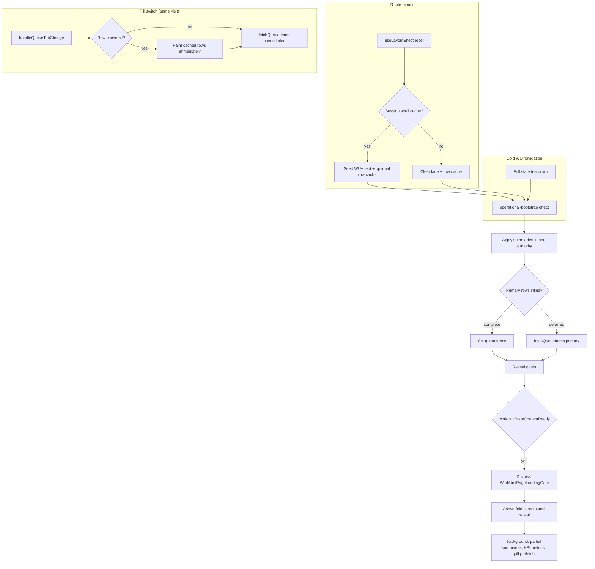
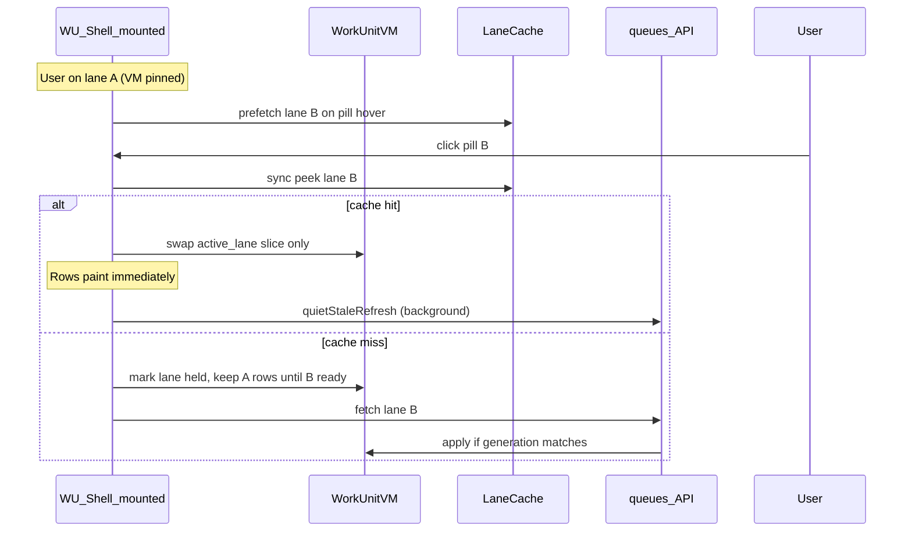

# Work Unit Runtime Cutover — Audit & Architecture Plan

**Path:** `docs/audits/work_unit_runtime_cutover_audit.md`  
**Status:** Audit + design complete — **no implementation in this batch**  
**Date:** 2026-06-03  
**Supersedes (for runtime cutover scope):** incremental fixes only; historical context in `docs/sprints/05_2026/work_unit_runtime_consolidation_audit.md`  
**Canonical doctrine:** `docs/system/adminv2-runtime-performance-doctrine.md`  
**Drawer VM reference:** `docs/sprints/06_2026/adminv2_drawer_runtime_phase_d_speed_pass.md`, `docs/audits/drawer-to-drawer-navigation-vm-audit.md`

---

## Executive summary

Opportunity / Person / Child drawers now follow a **ViewModel-first runtime**: composed first paint, session VM cache, shell-pinned model swap, and explicit `first_paint` contracts. Work Unit is **not yet on that architecture**.

Work Unit today is a **page-owned orchestration layer** (~6k lines in `page.tsx`) coordinating:

- operational-bootstrap
- reveal gates (shell → summaries → actions → rows → above-fold)
- pill-driven queue fetches with client row cache
- dual presentation models (`WorkUnitAboveFoldRenderModel` + inline `queueModel` / `WorkUnitWorkspaceModel`)
- deferred KPI / workflow supplements

The target is **Work Unit opens once, queue appears immediately, KPI/pill switches feel instant, no visible reloads**. That requires a **WorkUnitViewModel** cutover analogous to drawer VM — not a UI or KPI redesign sprint.

---

# Phase 1 — Runtime Audit

## 1. Current first-paint path

### Navigation entry

| Step | Location | Behavior |
|------|----------|----------|
| Route mount | `web/app/adminV2/workspace/dept/[departmentId]/work-unit/[workUnitId]/page.tsx` | `AdminV2OpportunityWorkUnitPage` |
| Location freeze | `readWorkUnitInitialLocationParams()` | URL params frozen — no search-param subscription churn |
| Nav reset | `useLayoutEffect` (~L1226) | Cold: clears lane state, row cache, request seqs. Warm: seeds shell from session cache |

### Session shell cache (warm path)

| Module | Function | Cached |
|--------|----------|--------|
| `web/lib/workspace/adminV2WorkspaceSessionCache.ts` | `readWorkUnitPageCache` / `writeWorkUnitPageCache` | `dept`, `workUnit` identity + `queue_definition` metadata only |
| Key | `alloy:v5:admV2:ws:wu:{org}:{dept}:{wu}:{user}:{scopeFp}` | **Does not** cache summaries, rows, or KPIs |

Warm hit → `setWorkUnit`, `setDept`, `setLoading(false)`, `setWorkUnitPageSeededFromCache(true)`. Optional row restore via `touchCachedQueueItemsForPill`.

### Bootstrap (authoritative cold/warm path)

| Module | Function | API |
|--------|----------|-----|
| `web/lib/adminV2/workUnitBootstrapClientSession.ts` | `fetchWorkUnitOperationalBootstrapSession` | `GET /api/admin/work-units/{id}/operational-bootstrap` |
| Prefetch join | `web/lib/adminV2/navigation/prefetchWorkUnitOperationalBootstrap.ts` | Same inflight session as page mount |

**Bootstrap applies in one effect (~L2650):**

- Work unit + department identity
- `queueSummaries` from `b.queue.summaries` (embedded — not a separate round-trip on happy path)
- `wuQueueLaneAuthorityReady = true`
- Primary lane rows inline from `b.queue.primary_lane` when complete
- KPI placements from `b.kpi_placements` or deferred `loadWuKpiPlacements`
- Right rail actions from `b.right_rail_actions` or deferred fetch
- Lifecycle sibling snapshot via `writeLifecycleWorkUnitSwitchSnapshot`

**Fallback (bootstrap failure):** legacy fan-out — separate WU GET, dept GET, `queues?summary_mode=all`, right rail — then schedules primary row fetch.

### Reveal gates (what blocks first paint)

| Gate | Module | Opens when |
|------|--------|------------|
| Full-page | `workUnitPageRevealPolicy.ts` → `workUnitPageContentReady` | `shell_ready && (initial_lane_settled \|\| lane_settled)` |
| Above-fold coordinated | `workUnitRevealGate.ts` → `computeWorkUnitRevealGate` | shell + summaries + actions + rows |
| UI shell | `WorkUnitPageLoadingGate.tsx` | Shown while `!workUnitPageContentReady` |

**Phases logged:** `gate_start` → `shell_ready` → `summaries_ready` → `actions_ready` → `rows_ready` → `above_fold_ready` (`[wu-reveal-gate]`).

### First paint today vs drawer VM

| Aspect | Drawer (Opp/Person/Child) | Work Unit (today) |
|--------|---------------------------|-------------------|
| Authoritative payload | Composed VM + preload | Page state + bootstrap JSON peel |
| First viewport contract | `DrawerFirstPaintContract` | Implicit via reveal gate inputs |
| Session cache | VM preload + shell pin | Shell identity only + row LRU |
| Hard cutover flag | `NEXT_PUBLIC_ADMINV2_*_DRAWER_VM` | None |
| Render binding | VM → paint record | `queueModel` useMemo + `buildWorkUnitAboveFoldRenderModel` |

---

## 2. Current queue loading path

| Function | Role |
|----------|------|
| `fetchQueueItems()` | Main row fetch; cache, lease dedupe, stale guards |
| `runBootstrapPrimaryRowFetch()` | One-shot primary lane after bootstrap |
| `resolveWorkUnitFetchQueueKeyFromPill()` | Pill key → API queue key + attention bucket |
| `shouldApplyWorkUnitQueueRowsResponse()` | Stale seq / lane-changed guard |
| `hydrateWorkUnitQueueRowActions()` | Row inline actions |

**API:** `GET /api/admin/queues/{workUnitId}/{queueKey}?limit=…&count_mode=exact&omit_total_count=true`

**Lane reveal:** `resolveWorkUnitQueueLaneRevealState()` → `hidden_until_settled | ready_with_cache | ready_with_rows | ready_empty | ready_error`

**Effect-driven fetch (~L3726):** fires on `selectedQueueKey` change after `wuQueueLaneAuthorityReady`, unless suppressed by bootstrap or pill handlers.

**Client row cache:** `queueRowClientCacheRef` keyed by `queueRowLogicalCacheKey(viewScope, workUnitId, apiQueueKey, unmappedOnly, attentionBucket)` in `web/lib/workspace/queueRowClientCache.ts`.

---

## 3. KPI loading path

KPI strip is **separate from queue filter pills** (header pills = queue lanes; KPI strip = metrics below).

| Step | Function / state | API / source |
|------|------------------|--------------|
| Placements load | `loadWuKpiPlacements(wu)` | `GET /api/admin/workspace-kpi-placements?surface=work_unit` |
| Deferred from bootstrap | inline `b.kpi_placements` | operational-bootstrap |
| Resolution | `resolveKpisForWorkUnit()` | `web/lib/kpi/resolver.ts` |
| Baseline fallback | `buildDefaultWorkUnitKpis()` | When no placements |
| Pending UX | `wuPlacementRows === undefined` | `workUnitKpiStripShowsPlaceholder()` after lane settled |

**State:** `wuPlacementRows`, `wuScopeHasPlacements`, `workUnitKpiMetricsPending`, `workflowKpis` (deferred footer).

KPI values may require **additional metric fetches** after placements resolve — not fully bundled in bootstrap today.

---

## 4. Summary loading path

| Path | Function | When |
|------|----------|------|
| Bootstrap inline | peel `b.queue.summaries` | Happy path — primary |
| Standalone | `fetchQueueSummaries()` | Invalidation, legacy fallback, events |
| Partial hydrate | `hydrateDeferredQueueSummaryCounts()` | After above-fold reveal (background) |

**API:** `GET /api/admin/work-units/{id}/queues?summary_mode=all|partial`

**Dedupe:** `fetchQueueSummaries` skips when bootstrap already hydrated summaries for current route (`queueSummariesRef` + route match).

**Pill badges:** authoritative count may reconcile from row fetch total (`workUnitChipBadgeContext`).

---

## 5. Queue rebuild triggers

### Full teardown (cold WU navigation)

`useLayoutEffect` when `!warmLaneRetain`:

- Bumps `queueItemsRequestSeq`, `queueSummariesRequestSeq`
- Clears `queueRowClientCacheRef`, `queueRowsBufferRef`, lease set
- Resets `queueSummaries`, `queueItems` to null

### Partial rebuild (pill switch)

- Does **not** clear full client cache
- Cache hit → `setQueueItems(cachedLane)` immediately
- `fetchQueueItems(..., { userInitiated: true })` — lease bypass
- May set `queueItems` null if lane key mismatches (unless lifecycle retain)
- `queueRowsBufferRef` retains last settled rows for transitions

### Force rebuild

| Trigger | Action |
|---------|--------|
| `invalidate()` | Delete row cache keys + force rows + summaries |
| `adminv2:opportunity-updated` | Patch in-place or cache delete + refetch |
| Record filter search (≥2 chars) | Refetch active lane |
| Site scope change | Full bootstrap re-run |
| Pill click | User-initiated fetch |

### Suppression (duplicate work avoided)

| Ref | Purpose |
|-----|---------|
| `suppressQueueFetchEffectOnceRef` | Skip effect after bootstrap owns fetch |
| `skipNextQueueFetchEffectRef` | Skip after pill handler owns fetch |
| `queueItemsLastFetchSigRef` | Skip redundant GET same sig |
| `queueRowLeaseSigsRef` | Dedupe in-flight row fetches |
| `fetchWorkUnitOperationalBootstrapSession` | Dedupe bootstrap inflight |

---

## 6. Duplicate fetches & repeated data sources

| Pattern | Status | Notes |
|---------|--------|-------|
| Bootstrap summaries + `fetchQueueSummaries` | Guarded | Skips if bootstrap hydrated |
| Bootstrap primary rows + `selectedQueueKey` effect | Mostly guarded | `suppressQueueFetchEffectOnceRef`, scheduled ref |
| Parallel cache warm + bootstrap inline rows | **Risk** | May double-fetch primary lane; inline schedules idle refresh instead when complete |
| Dept prefetch bootstrap + page mount | Joined | Same bootstrap session |
| Right rail bootstrap + deferred supplement | Guarded | Skips if bootstrap hydrated rail |
| Pill prefetch + user click | Isolated | `prefetchOnly` vs `userInitiated` |
| KPI placements bootstrap + `loadWuKpiPlacements` | Partial | Deferred path when not in bootstrap |
| Partial summary hydrate after reveal | By design | Background badge refresh |
| Legacy fallback fan-out | **High cost** | 3+ parallel GETs when bootstrap fails |

**Repeated data sources on one visit:**

1. operational-bootstrap (WU + dept + summaries + optional primary rows + KPI placements + rail)
2. Primary row fetch (if bootstrap rows incomplete or cache miss)
3. Deferred queue summary counts (`summary_mode=partial`)
4. KPI metric resolution (post-placements)
5. Workflow KPIs (deferred supplement)
6. Adjacent pill prefetch (cap 6, concurrency 2)
7. Row actions hydration (post-rows)

---

## 7. Work Unit shell lifecycle



**Shell preservation today:**

- AdminV2 **layout** persists (providers, chrome) — work unit **page state** does not survive WU id change
- Lifecycle in-page switch uses `readLifecycleWorkUnitSwitchSnapshot` to retain rows across sibling WU pills without full route reload
- No WorkUnitViewModel session cache analogous to `drawerViewModelSessionCache`

**Presentation layer (not yet VM):**

| Artifact | Builder | Consumer |
|----------|---------|----------|
| `WorkUnitAboveFoldRenderModel` | `buildWorkUnitAboveFoldRenderModel` | Header pills, actions rail, lane slot |
| `WorkUnitWorkspaceModel` | inline `queueModel` useMemo | QueueBlock body, KPI slot |
| `enrollmentWorkUnitViewModel` | row-level helpers only | CRM compact row slots — not page VM |

---

## Phase 1 — P0 / P1 / P2 Rankings

Estimates are **static projections** from code structure and bootstrap contract size — replace with `[wu-reveal-gate]` / alloy perf marks in Phase 0 measurement.

### P0 — blocks “opens once / instant queue” target

| ID | Issue | Est. cost | Fix direction |
|----|-------|-----------|-------------|
| **WU-P0-1** | No authoritative **WorkUnitViewModel** — page owns 40+ state vars/refs | Entire visit feels like re-orchestration | Introduce composed WU VM + hard cutover gate |
| **WU-P0-2** | Cold navigation **full lane teardown** even when session could retain VM | 200–600 ms re-bootstrap feel | WU VM session cache keyed by ownership (org/dept/wu/site/selection) |
| **WU-P0-3** | **Dual presentation pipelines** (above-fold builder + queueModel useMemo) re-derive from raw state | 50–150 ms + inconsistency risk | Single VM → render adapters |
| **WU-P0-4** | Pill switch still schedules **network fetch** even on cache hit (background refresh visible as `rowsRefreshing`) | 100–400 ms perceived churn | Model swap: cache-first paint, background refresh invisible |
| **WU-P0-5** | KPI strip **placeholder → real** transition after lane settled | 150–350 ms second beat | KPI contract inside WU VM first_paint or background slot |
| **WU-P0-6** | Bootstrap failure → **legacy fan-out** (3+ GETs) | 800–2000 ms | Bootstrap reliability + VM degrade path with pinned shell |

### P1 — warm path / operator-frequency friction

| ID | Issue | Est. cost | Fix direction |
|----|-------|-----------|-------------|
| **WU-P1-1** | Session cache stores **shell only** — summaries/rows not in VM cache | 200–500 ms warm reopen | Extend cache: summaries + primary lane VM slice |
| **WU-P1-2** | **Partial summary hydrate** after reveal updates pill badges | 50–120 ms badge flicker | Include deferred counts in VM or SWR background |
| **WU-P1-3** | **Deferred supplements** (workflow KPIs, row actions, lane preview bundle) race with pill switch | Variable | Serialize via VM generation + stale guards |
| **WU-P1-4** | `queueRowsBufferRef` cross-lane buffer — implicit, not VM-owned | Transition flash | Lane swap = VM queue slice swap |
| **WU-P1-5** | KPI metric fetches **decoupled** from bootstrap | 100–300 ms KPI strip populate | Bundle metric snapshots in operational-bootstrap or VM compose |
| **WU-P1-6** | Pill prefetch cap 6 — cold adjacent pills still fetch on first click | 200–600 ms first click | Intent prefetch + VM cache write (mirror drawer) |

### P2 — polish / future surfaces

| ID | Issue | Est. cost | Notes |
|----|-------|-----------|-------|
| **WU-P2-1** | Record filter search refetches lane | 150–400 ms | Client filter first; server when needed |
| **WU-P2-2** | Site scope change full bootstrap | 400–1000 ms | Scoped VM invalidation, not full teardown |
| **WU-P2-3** | Lifecycle sibling switch snapshot separate from page cache | Complexity | Unify under WU VM ownership key |
| **WU-P2-4** | Dept → WU navigation duplicate bootstrap if prefetch missed | 200–500 ms | Already joined when prefetch hits — improve hit rate |
| **WU-P2-5** | Queue row actions hydration post-rows | 50–150 ms | Defer to background contract |
| **WU-P2-6** | `enrollmentWorkUnitViewModel` naming collision | Dev confusion | Rename row helpers; reserve `WorkUnitViewModel` |

---

# Phase 2 — Canonical Runtime Contract (Design Only)

## WorkUnitViewModel — purpose

A **single composed payload** per work-unit **ownership scope** that owns first paint for the entire `/work-unit` route — analogous to `OpportunityDrawerViewModel`, not a rename of `WorkUnitWorkspaceModel`.

**Hard cutover gate (proposed):** `NEXT_PUBLIC_ADMINV2_WORK_UNIT_VM`  
**Shadow mode (proposed):** `NEXT_PUBLIC_ADMINV2_WORK_UNIT_VM_SHADOW` — compose + log diff without binding UI

## Ownership key

Mirror drawer VM cache determinism:

```
workUnitVm:{orgId}:{departmentId}:{workUnitId}:{siteScopeFp}:{queueSelectionSig}
```

Where `queueSelectionSig` encodes `selectedQueueKey + attentionBucket + laneUnmappedOnly + focus_queue URL params`.

**Navigation without teardown:** changing only `queueSelectionSig` performs a **queue model swap** inside the same WU shell session — not a full page re-bootstrap.

## ViewModel shape (proposed)

```typescript
type WorkUnitViewModel = {
  generation: string;                    // bootstrap + selection epoch
  entity: {
    work_unit_id: string;
    department_id: string;
    work_unit_key: string;
  };
  first_paint: WorkUnitFirstPaintContract;
  header: WorkUnitHeaderVm;              // title, breadcrumbs, lifecycle chips
  queue: WorkUnitQueueVm;                // active lane + pill catalog
  kpi: WorkUnitKpiVm;                    // strip metrics (may background)
  actions: WorkUnitActionsVm;            // right rail / header actions
  summary: WorkUnitSummaryVm;            // pill counts authoritative source
  background: WorkUnitBackgroundVm;        // deferred keys + refresh policy
  timing: { compose_ms: number; server_ms?: number };
};
```

## First viewport

**First viewport** = above-fold operator surface visible when `WorkUnitPageLoadingGate` dismisses:

| Slot | Includes |
|------|----------|
| `shell` | WU + dept identity, route chrome |
| `header_pills` | Queue filter pills with counts (summaries ready) |
| `actions_rail` | Enrollment / lifecycle header actions when reserved |
| `queue_lane` | Active lane rows **or** known-empty **or** cached rows — never skeleton |
| `kpi_strip` | Placeholder acceptable if metrics deferred; strip shell visible |

**Excludes from first viewport:** workflow footer KPIs, below-fold queue preview bundles, partial summary badge refresh, row action hydration completion.

## First paint contract

Reuse drawer pattern from `web/lib/adminV2/viewModel/drawer/firstPaintTypes.ts`:

```typescript
type WorkUnitFirstPaintContract = {
  settled: boolean;
  viewport_slots: Array<
    | "shell"
    | "header_pills"
    | "actions_rail"
    | "queue_lane"
    | "kpi_strip"
  >;
  dependencies: DrawerFirstPaintDependencyState<WorkUnitFirstPaintDependencyKey>[];
  data: Partial<Record<WorkUnitFirstPaintDependencyKey, unknown>>;
  deferred: WorkUnitFirstPaintDependencyKey[];
  background: WorkUnitFirstPaintDependencyKey[];
};
```

**Proposed dependency keys:**

| Key | Disposition | Satisfied by |
|-----|-------------|--------------|
| `work_unit_identity` | first_paint_required | bootstrap |
| `department_identity` | first_paint_required | bootstrap |
| `queue_summaries` | first_paint_required | bootstrap summaries |
| `enrollment_actions` | first_paint_required (when reserved) | bootstrap rail |
| `active_lane_rows` | first_paint_required | bootstrap primary_lane OR cache OR settled fetch |
| `kpi_placements` | first_paint_required OR background | bootstrap or deferred |
| `kpi_metric_values` | background_deferred | metric API |
| `partial_summary_counts` | background_deferred | partial summaries API |
| `row_actions` | background_deferred | hydrate per row |
| `adjacent_lane_prefetch` | background_deferred | prefetch |

**Settled rule:** all `first_paint_required` dependencies are `ready` or known-empty — same doctrine as drawer (`null !== empty`).

## Queue contract

```typescript
type WorkUnitQueueVm = {
  selection: WorkUnitQueueSelection;
  pill_catalog: WorkUnitQueuePillVm[];     // from summaries
  active_lane: {
    queue_key: string;
    rows: QueuePreviewItemVm[];
    total_count: number | null;
    reveal: WorkUnitQueueLaneRevealState;
    rows_loading: boolean;                  // background refresh only after first paint
    rows_held: boolean;
    known_empty: boolean;
  };
  lanes_cache: Record<string, WorkUnitLaneCacheEntry>; // keyed by logical cache key
};
```

**Invariants (carry forward from doctrine):**

- `rows_loading` after first paint must not clear valid rows
- `rows_held` while `hidden_until_settled`
- Stale fetch apply blocked by generation + `shouldApplyWorkUnitQueueRowsResponse`
- Row skeleton never settled state (`adminV2QueueMayShowRowSkeleton → false`)

## KPI contract

```typescript
type WorkUnitKpiVm = {
  placements: WorkspaceKpiPlacementRow[];
  metrics: KpiMetricVm[] | null;           // null = background pending
  metrics_pending: boolean;
  strip_visible: boolean;
};
```

KPI strip may show **shell + placeholder labels** at first paint while `metrics` resolves in background — but must not block queue lane reveal.

## Summary contract

```typescript
type WorkUnitSummaryVm = {
  summaries: QueueSummaryVm[];
  summaries_complete: boolean;
  deferred_queue_keys: string[];
  authoritative_badge_by_pill: Record<string, number>;
};
```

Summaries are **authoritative for pill catalog** at first paint. Partial count hydration updates VM in background without rebuilding pill catalog.

## Background refresh contract

```typescript
type WorkUnitBackgroundVm = {
  refresh_policy: "stale_while_revalidate";
  inflight: Partial<Record<WorkUnitBackgroundTask, boolean>>;
  last_refresh_ms: Partial<Record<WorkUnitBackgroundTask, number>>;
};

type WorkUnitBackgroundTask =
  | "partial_summary_counts"
  | "kpi_metrics"
  | "row_actions"
  | "adjacent_lane_prefetch"
  | "workflow_kpis"
  | "lane_preview_bundle";
```

Background tasks **must not** regress `first_paint.settled` or clear active lane rows.

## Server compose path (proposed)

| Stage | Owner |
|-------|-------|
| Bootstrap peel | Existing `operational-bootstrap` route — remains server truth |
| VM compose | New `composeWorkUnitViewModel()` — client or server endpoint |
| Open preload | `buildWorkUnitOpenPreloadFromViewModel()` — mirror drawer preload |
| Session cache | `workUnitViewModelSessionCache.ts` — mirror `drawerViewModelSessionCache` |

**Non-goal:** replace `QueueService` or queue SQL in this cutover — VM wraps existing APIs.

## Render binding (proposed)

| Consumer | Today | Target |
|----------|-------|--------|
| `WorkUnitPageLoadingGate` | page reveal inputs | `vm.first_paint.settled` (page) + lane contract |
| `buildWorkUnitAboveFoldRenderModel` | 20+ raw inputs | `projectWorkUnitAboveFoldFromVm(vm)` |
| `queueModel` useMemo | raw rows + summaries | `projectWorkUnitWorkspaceFromVm(vm)` |
| `QueueBlock` | unchanged props | same `QueueVm` — adapter only |

## Migration phases (implementation plan — not started)

| Phase | Scope | Exit criteria |
|-------|-------|---------------|
| **WU-VM-0** | Measurement + `[wu-vm:*]` diagnostics | Baseline cold/warm/pill timings recorded |
| **WU-VM-1** | Compose + shadow diff | VM matches production output |
| **WU-VM-2** | Session cache + preload | Warm WU reopen from cache |
| **WU-VM-3** | Hard cutover first paint | Gate dismisses from VM contract |
| **WU-VM-4** | Queue model swap | Pill switch without page orchestration reset |
| **WU-VM-5** | KPI background contract | No KPI-triggered loading gate |
| **WU-VM-6** | Delete legacy fan-out path | Bootstrap-only + VM degrade |

---

# Phase 3 — KPI / Queue Model Swap Design

## Terminology

| UI element | Runtime meaning |
|------------|-----------------|
| **Header queue pills** | Queue lane selection — **primary model swap target** |
| **KPI strip** | Metric placements below header — **background slot**, not a shell swap |
| **Lifecycle sibling pills** | In-page WU switch — already partial snapshot retain |

## Queue pill as model swap (recommended)

Queue pill switching should behave like Opportunity → Person drawer swap:

| Drawer swap | Queue pill swap (analog) |
|-------------|--------------------------|
| Drawer shell stays mounted | WU route shell + header stay mounted |
| VM cache keyed by entity | Lane cache keyed by `queueRowLogicalCacheKey` |
| `prepareDrawerViewModel` on intent | `prepareWorkUnitLaneViewModel` on hover/focus |
| `applyDrawerModelSwap` sync cache hit | Apply cached lane rows to VM instantly |
| Background compose if stale | `quietStaleRefresh` row fetch |

### Required cache

| Layer | Key | Stores |
|-------|-----|--------|
| **WU VM session** | ownership key | Full VM snapshot at last settled state |
| **Lane slice cache** | existing `queueRowLogicalCacheKey` | Row payload + actions + preview metadata |
| **Lane VM entry** | `{ownership}:{laneKey}` | Sub-slice: rows, total, reveal state, generation |
| **Bootstrap session** | existing `workUnitBootstrapOwnershipKey` | Prevents duplicate bootstrap |

**New module (proposed):** `web/lib/adminV2/viewModel/workUnit/workUnitViewModelSessionCache.ts`

### Preload opportunities

| Trigger | Action |
|---------|--------|
| Dept row hover → WU link | `prefetchWorkUnitOperationalBootstrap` (exists) |
| WU mount | Bootstrap + compose VM + cache write |
| Pill hover / focus | `prepareWorkUnitLaneViewModel({ queueKey })` |
| Pill mousedown | Same, higher priority |
| After lane settle | `workUnitQueuePillPrefetchTargets` → cache write (exists, bind to VM) |
| Above-fold ready | Adjacent pill prefetch (cap 6) |

### Queue swap mechanics



**Must not happen on pill switch:**

- Full `useLayoutEffect` teardown
- `queueSummaries` reset to null
- `WorkUnitPageLoadingGate` re-show
- Header pill skeleton reload
- KPI strip reset to `undefined`

### Shell preservation

| State | Pill switch | Cold WU nav |
|-------|-------------|-------------|
| WU + dept identity | **Retain** | Re-bootstrap |
| Queue summaries | **Retain** | Re-bootstrap |
| Actions rail | **Retain** | Re-bootstrap |
| Active lane rows | **Swap slice** | Primary lane from VM/cache |
| KPI placements | **Retain** | Re-bootstrap |
| KPI metric values | **Retain** (background refresh OK) | Re-bootstrap |
| Request seq guards | **Increment** per fetch | Full reset |

### Lifecycle sibling pills

Already use `writeLifecycleWorkUnitSwitchSnapshot` + `lifecyclePillRetainRows`. **Unify** under WU VM:

- Sibling switch = **WU ownership key change** with optional row retain flag
- Avoid separate snapshot system long-term

## KPI strip — not a model swap

KPI metrics should **never** gate queue reveal or trigger full-page loading.

| Behavior | Design |
|----------|--------|
| Placements | first_paint_required if bootstrap includes them; else placeholder strip |
| Metric values | background_deferred — refresh in place |
| Pill switch | KPI strip **unchanged** — no refetch unless WU ownership changes |
| Config change event | Invalidate KPI slice only |

**Anti-pattern to eliminate:** `wuPlacementRows === undefined` blocking perceived readiness after first visit — VM should carry last-known placements across pill switches within same WU session.

---

# Phase 4 — Speed Targets

Estimates from bootstrap contract analysis, drawer VM benchmarks, and `[wu-reveal-gate]` structure. **Measure in WU-VM-0** before holding teams accountable.

## Current vs target

| Scenario | Current (est.) | Target | Primary lever |
|----------|----------------|--------|---------------|
| **Cold open** (no cache) | 600–1200 ms to `workUnitPageContentReady` | **<400 ms perceived** | Bootstrap-only path + VM first_paint; backend payload phase |
| **Warm open** (same WU revisit) | 300–700 ms (shell cache + bootstrap) | **<50 ms perceived** | WU VM session cache — paint without bootstrap |
| **KPI strip populate** | 150–350 ms after lane settled | **0 ms block** (background) | KPI background contract |
| **Queue pill switch** (cached lane) | 50–200 ms paint + background refresh shimmer | **<16 ms perceived** (instant) | Lane model swap from cache |
| **Queue pill switch** (cold lane) | 200–600 ms held → rows | **<150 ms perceived** | Prefetch on hover + held rows |
| **Dept → WU nav** (prefetch hit) | 400–900 ms | **<200 ms perceived** | Bootstrap session join + VM cache |
| **Site scope change** | 500–1200 ms full re-bootstrap | **<300 ms perceived** | Scoped VM invalidation (P2) |

## Drawer parity reference

| Drawer scenario | Post Phase-D drawer | WU target |
|-----------------|---------------------|-----------|
| Cold open | <500 ms perceived | <400 ms |
| Warm reopen | instant (VM cache) | instant |
| Model swap (cached) | instant | instant (pill switch) |

## Instrumentation (required before cutover)

| Mark | Source |
|------|--------|
| `wu_reveal_gate_*` | existing `workUnitRevealGate.ts` |
| `wu_vm_compose` | new |
| `wu_vm_cache_hit` / `wu_vm_cache_miss` | new |
| `wu_lane_swap_apply` | new |
| `wu_bootstrap_session_hit` | extend bootstrap session logs |

---

# Implementation Plan Summary

## Do not start until

- [ ] WU-VM-0 baseline measurements captured on staging
- [ ] This audit reviewed / approved
- [ ] Hard cutover flag strategy agreed (`NEXT_PUBLIC_ADMINV2_WORK_UNIT_VM`)

## Recommended build order

1. **Diagnostics + shadow compose** — `composeWorkUnitViewModel` diff against live page output  
2. **Session cache** — ownership-keyed VM + lane slices  
3. **First paint hard cutover** — gate + above-fold bind to VM  
4. **Queue model swap** — pill switch without summaries/actions reset  
5. **KPI background contract** — decouple metrics from reveal  
6. **Legacy path removal** — fan-out fallback, dual adapters, redundant refs  

## Files likely touched (future — not now)

| Area | Paths |
|------|-------|
| VM compose | `web/lib/adminV2/viewModel/workUnit/*` (new) |
| Session cache | `web/lib/adminV2/viewModel/workUnit/workUnitViewModelSessionCache.ts` (new) |
| Page cutover | `web/app/adminV2/workspace/dept/.../work-unit/[workUnitId]/page.tsx` |
| Adapters | `buildWorkUnitAboveFoldRenderModel.ts`, `realWorkUnitFromOpportunities.ts` |
| Bootstrap | `workUnitBootstrapClientSession.ts`, operational-bootstrap route |
| Tests | mirror drawer determinism + `workUnitCoordinatedRevealRegression.test.ts` |
| Doctrine | update `adminv2-runtime-performance-doctrine.md` when cutover lands |

## Explicit non-goals (this sprint)

- KPI visual redesign  
- Queue row UI changes (related-record icons, CRM compact layout)  
- Backend SQL / QueueService optimization (see `adminv2_backend_query_payload_optimization_phase.md`)  
- Dept runtime cutover (reuse WU VM patterns later)  
- Lifecycle / configuration product work  

---

## Related documents

| Doc | Relevance |
|-----|-----------|
| `docs/system/adminv2-runtime-performance-doctrine.md` | Locked reveal/queue rules |
| `docs/sprints/06_2026/completed/adminv2_runtime_performance_consistency_closeout.md` | Pre-cutover baseline |
| `docs/sprints/06_2026/adminv2_drawer_runtime_phase_d_speed_pass.md` | Drawer VM target pattern |
| `docs/audits/drawer-to-drawer-navigation-vm-audit.md` | Model swap reference |
| `docs/sprints/05_2026/work_unit_runtime_consolidation_audit.md` | Domain model / queue definition (historical) |
| `docs/sprints/06_2026/adminv2_runtime_navigation_performance_audit_v1.md` | Cross-surface perf context |

---

## Verification commands (existing contract — run before any runtime edit)

```bash
cd web && npm run test -- \
  tests/adminV2/workUnitQueueLaneRevealState.test.ts \
  tests/adminV2/workUnitPageRevealPolicy.test.ts \
  tests/adminV2/workUnitCoordinatedRevealRegression.test.ts \
  tests/lib/workspace/routeSessionCacheAndReveal.test.ts

cd web && npx tsc --noEmit
```

When WU VM lands, add: `tests/adminV2/viewModel/workUnitViewModel*.test.ts` (determinism + first_paint + lane swap).
