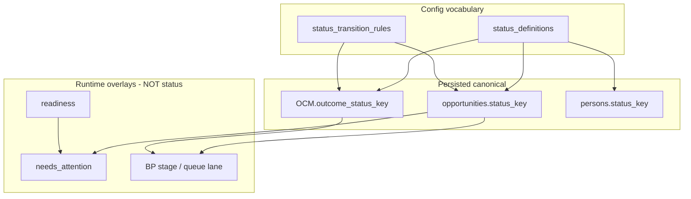

# Canonical Data System Audit

**Path:** `docs/canonical-data-system-audit.md`  
**Date:** 2026-06-25  
**Status:** Audit only — no migrations, no runtime or configuration UI changes  
**Sprint:** Alloy OS — Canonical Data System + Database Cleanup (Track A + Track B discovery)

---

## Executive summary

Alloy has **strong platform doctrine** for enrollment status grains, entity identity, and configuration ownership, but **implementation reality is fragmented**. The database holds 165 base tables with multiple legacy verticals (home services / GHL import residue). Field identity flows through **21+ parallel catalogs**; status vocabulary is better centralized via `status_definitions` but still split across legacy columns, TS vocabularies, and runtime overlays. Relationship modeling is converging on `persons` + `customer_persons` + `customer_members` + `opportunity_customer_members`, but **contacts**, duplicate name/DOB columns, and layout `child.*` namespace collapse create drift.

**North star (already documented, not yet enforced end-to-end):**

```
field_definitions (+ status_definitions, action_definitions, relationship vocab)
        ↓
Layouts / Forms / Business Processes / Workflows / Analytics / BOS
        ↓
Runtime surfaces (queues, drawers, cards) — read only, never invent
```

**Highest-risk gaps:**

| Gap | Impact |
|-----|--------|
| **Child grain split** (`customer_member` profile vs `inquiry_child` / OCM enrollment vs lifecycle `child` entity) | Same business fact (name, DOB, health) stored/read from different tables and catalogs |
| **Parallel field catalogs** (lifecycle, forms, layout manifests, drawer policy maps) | Operators and runtime disagree on field identity, labels, and enforcement |
| **Legacy `status` text columns** alongside `status_key` | Analytics and imports may read wrong column |
| **Contacts compatibility layer** | Duplicate human identity paths (`contacts` vs `persons`) |
| **Home-services schema residue** | 165 tables; childcare-primary product carries dead weight and naming noise |
| **`customer_member` config fields seeded but PATCH incomplete** | Registry promises fields runtime cannot write |

**Recommendation:** Proceed with a **staged reconciliation sprint** — inventory → map → freeze → backfill → cutover reads → guards → deprecate → drop (last). **Do not drop anything in pass 1.**

---

## Audit scope & methodology

### In scope

- Postgres schema (`docs/schema/*`, `supabase/migrations/`, generated CSV reference)
- Platform docs (`docs/platform/core/*`, `docs/system/*`, `docs/archive/2026-06-runtime-convergence/archive/2026-06-runtime-convergence/platform_convergence/*`)
- Runtime consumers: drawer/queue/focus panel, actions, workflows, metrics/OIP, BOS
- Configuration consumers: Fields, Statuses, Layouts, Business Processes, Forms, Actions

### Out of scope (this sprint)

- Runtime UI redesign
- Configuration UI redesign
- New field system invention (extend existing `field_definitions` + `status_definitions`)
- Column drops or renames without dependency mapping

### Sources read

| Source | Role |
|--------|------|
| `docs/platform/core/entity-model.md` | Frozen entity grains |
| `docs/platform/core/status-and-state-system.md` | Two-grain enrollment status |
| `docs/system/field-model-convergence-doctrine.md` | Field registry north star |
| `docs/system/configuration-ownership-doctrine.md` | Config surface ownership |
| `docs/archive/2026-06-runtime-convergence/archive/2026-06-runtime-convergence/platform_convergence/field_catalog_convergence_audit.md` | 17-system field inventory (June 2026) |
| `docs/schema/schema-tables.md`, `schema-columns.md` | Generated schema reference |
| `web/lib/fields/*`, `web/lib/layout/*`, `web/lib/admin/actions/*`, `web/lib/lifecycle/*` | Code registries |

---

## 1. Current schema inventory

**Generated snapshot:** 165 base tables, 7 views, all RLS-enabled (2026-06-12 export).

### 1.1 Domain groupings

| Domain | Primary tables | Notes |
|--------|------------------|-------|
| **Identity & household** | `persons`, `customers`, `customer_persons`, `customer_members`, `contacts`, `person_relationships`, `person_locations`, `customer_person_role_types`, `person_relationship_type_settings` | No `children` table — child = `customer_members` + optional `person_id` |
| **CRM / enrollment** | `opportunities`, `opportunity_customer_members`, `opportunity_persons`, `tour_bookings`, `placement_candidates`, `placement_*` | Case vs child enrollment grains frozen |
| **Field & status config** | `field_definitions`, `field_values`, `field_section_definitions`, `option_sets`, `option_set_items`, `status_definitions`, `status_transition_rules` | Closest to canonical contract tables |
| **Experience config** | `record_drawer_layouts`, `record_layouts`, `record_overview_layouts`, `action_definitions`, `action_placements`, `action_links`, `record_actions` | Presentation + capability placement |
| **Business process runtime** | `departments`, `work_units`, `workflows`, `workflow_*`, `workflow_events` | Stage/lane in JSON metadata + queue_definition |
| **Forms & documents** | `form_definitions`, `form_definition_versions`, `form_submissions`, `document_field_definitions`, `document_field_values`, `documents` | Separate schema stores (by design) |
| **Communications** | `communication_threads`, `communication_messages`, `messages`, `messages_outbox` | V1 canonical + legacy |
| **Locations & placement** | `locations`, `location_types`, `service_offerings`, `service_plan_templates` | School → program → room via location hierarchy |
| **Financial / billing** | `payments`, `charges`, `ledger_*`, `gl_*`, `customer_subscriptions` | Adjacent to enrollment; own status columns |
| **Jobs / home services (legacy vertical)** | `jobs`, `job_*`, `cleaning_*`, `home_types`, `sqft_bands`, `pricing_*`, `assignments`, `vendors` | Vertical residue — not childcare-primary |
| **Platform / access** | `orgs`, `org_settings`, `app_users`, `permission_*`, `role_*`, `user_*` | Tenancy + ACL |

### 1.2 Enrollment-critical columns (authoritative storage)

#### `opportunities`

| Column | Classification | Notes |
|--------|----------------|-------|
| `status_key` | **Keep — canonical case grain** | Household coordination / family-track pipeline |
| `status` | **Deprecate → backfill** | Legacy GHL/import text |
| `pipeline_id`, `pipeline_stage_id` | **Archive** | GHL-era; unrelated to BP operator stages |
| `primary_person_id` | **Keep** | Canonical human link (prefer over `primary_contact_id` on related tables) |
| `location_id` | **Keep** | Lead-level site (child placement is OCM `location_id`) |
| `work_unit_id` | **Keep** | Runtime execution host |
| `metadata` | **Keep — audit keys** | Tour/enrollment notes keys; not a parallel field registry |

#### `opportunity_customer_members`

| Column | Classification | Notes |
|--------|----------------|-------|
| `outcome_status_key` | **Keep — canonical child enrollment grain** | Per-child lifecycle SoT |
| `location_id` | **Keep** | Per-child site authority |
| `desired_start_date`, `desired_program_type`, `desired_schedule_type` | **Keep — native enrollment fields** | Must have `field_definitions` rows (`inquiry_child` entity) |
| `program_room_cohort_key` | **Keep** | Placement cohort |
| `fit_status` | **Keep — separate concept** | Fit assessment ≠ lifecycle status |
| `customer_member_id` | **Keep — FK** | Links enrollment row to durable child profile |

#### `customer_members`

| Column | Classification | Notes |
|--------|----------------|-------|
| `first_name`, `last_name`, `dob`, `display_name` | **Keep — durable child profile** | Layout catalog uses these as native storage |
| `person_id` | **Keep** | Optional link to `persons` when child has identity row |
| `status_key` | **Deprecate (Settings)** | Roster status; explicitly excluded from Status Management |
| `relationship` | **Rename candidate → `relationship_type_key`** | Align with `customer_persons.role_type` pattern |

#### `persons`

| Column | Classification | Notes |
|--------|----------------|-------|
| `first_name`, `last_name`, `email`, `phone`, `date_of_birth` | **Keep — canonical human identity** | |
| `status_key` | **Keep** | Person/child roster status (profile-filtered) |
| `status` | **Deprecate → backfill** | Legacy text alongside `status_key` |
| `full_name` | **Merge → computed** | Should be derived, not independently written |
| `metadata` | **Keep — bounded** | Avoid new business facts here without registry row |

#### `customers`

| Column | Classification | Notes |
|--------|----------------|-------|
| `name` | **Keep** | Household label |
| `primary_contact_id` | **Deprecate reads** | Prefer `customer_persons` + `primary_person_id` on opportunities |
| `status_key`, `status` | **Keep / deprecate text** | Household account status |

#### `contacts`

| Column | Classification | Notes |
|--------|----------------|-------|
| All identity columns | **Archive path** | Compatibility for messaging/workflows keyed by `contact_id`; not forward CRM path |
| `person_id` | **Keep during transition** | Bridge column |
| `status_key` | **Deprecate** | |

### 1.3 Config tables (canonical contract anchors)

#### `field_definitions`

Org-scoped field registry: `entity_type`, `field_key`, `field_type`, labels, `config` (option bindings, native reference metadata), visibility flags, `requirement_policy`, `interaction_policy`.

**Supported entity types (Settings API):** `person`, `customer`, `job`, `opportunity`, `vendor`, `schedule`, `location`, `customer_member`, `inquiry_child`.

#### `field_values`

EAV storage for custom (non-native-column) fields per `(org_id, entity_type, entity_id, field_definition_id)`.

#### `status_definitions`

Org/industry catalog: `(entity_type, status_key)` → label, sort, `metadata` (stage binding, terminal flags, layers).

#### `status_transition_rules`

Transition guardrails scoped by org, department, work unit, action.

#### `action_definitions` + `action_placements`

Executable capability catalog + surface placement rows.

---

## 2. Current canonical-looking sources

These are the **best existing anchors** — the sprint should extend and enforce them, not replace them.

| Layer | Canonical candidate | Maturity | Consumers |
|-------|---------------------|----------|-----------|
| **Entity fields** | `field_definitions` + `field_section_definitions` + `option_sets` | Primary control plane; incomplete coverage | Drawer attach, Settings, layouts, public booking, lifecycle palette merge |
| **Custom field values** | `field_values` | Active | Drawer GET/PATCH, public book-v2 |
| **Native column parity** | TS manifests → migration seeds (`inquiryChildFieldRegistry`, `customerMemberFieldRegistry`, `opportunityFieldRegistry`) | Seed layer; should be generated from registry | PATCH partition, reserved-key guards |
| **Legacy ID bridge** | `fieldRegistryReferenceMatrix.ts` | Shipped F1 convergence | Maps lifecycle `rule_id`, forms `sys:*`, layout `refKey` → `{ entity_type, field_key }` |
| **Status vocabulary** | `status_definitions` + `statusCategoryRegistry.ts` | Strong for enrollment + persons | Settings, drawer dropdowns, queue filters, transition preflight |
| **Status transition rules** | `status_transition_rules` | Active | `validateStatusTransition`, enrollment preflight |
| **Enrollment vocabulary (code)** | `enrollmentProcessStatusVocabulary.ts`, `enrollmentProcessStageBindings.ts` | Frozen reference; should fully migrate to `status_definitions.metadata` | Queue aliases, BP builder |
| **Actions** | `action_definitions` (DB) + `canonicalActionRegistry.ts` (code) | Dual layer — DB is runtime authority | executeAdminAction, layout/BOS pickers |
| **Relationships** | `customer_persons`, `person_relationships`, `person_relationship_type_settings`, `customer_person_role_types` | Converging | Relationship actions, person drawer |
| **Entity model docs** | `docs/platform/core/entity-model.md`, `status-and-state-system.md` | Frozen June 2026 | Agent + engineer load order |
| **Config ownership** | `configuration-ownership-doctrine.md`, `field-model-convergence-doctrine.md` | Active planning | Settings surface boundaries |
| **Metrics** | `metricSourceRegistry.ts` + `metrics/registry.ts` | Adapter layer over canonical columns | OIP cards, workspace KPIs |
| **Documents** | `document_field_definitions` | Separate domain (intentional) | Document-type metadata only |

---

## 3. Duplicate & conflicting fields

### 3.1 Parallel field catalogs (21+ sources)

| # | Source | Storage | Overlap risk |
|---|--------|---------|--------------|
| 1 | `field_definitions` | Postgres | Anchor |
| 2 | `field_values` | Postgres | Custom storage |
| 3 | `inquiryChildFieldRegistry` | Code | Native OCM columns |
| 4 | `customerMemberFieldRegistry` | Code | Native + config child profile |
| 5 | `opportunityFieldRegistry` | Code | Native refs |
| 6 | `systemFieldRegistry` | Code | Forms intake ids |
| 7 | `fieldCatalog.ts` | Code + DB merge | Layout picker bootstrap |
| 8 | `childcareLayoutFieldCatalog.ts` | Code | ~70 layout refKeys + storage audit |
| 9 | `lifecycleFieldRequirementsCatalog.ts` | Code | BP palette `rule_id`s |
| 10 | `lifecycleFieldRuleBindings.ts` | Code | Preflight / readiness |
| 11 | `fieldRegistryReferenceMatrix.ts` | Code | Bridge only |
| 12 | `drawerFieldPolicyAdapter.ts` | Code | Hardcoded storage/PATCH maps |
| 13 | `field_placements_v1` | Layout JSON | Behavior overlay |
| 14 | `document_field_definitions` | Postgres | Separate product domain |
| 15 | `form_definition_versions.schema_json` | Postgres | Form field tree |
| 16 | Person drawer hardcoded specs | Code | Parent address, operating sections |
| 17 | Workflow field catalog API | RPC + code | Schema introspection |
| 18 | `workflowVocab.ts` | Code | Legacy path list |
| 19 | `configurablePlacementFieldCatalog.ts` | Code | School/program/room templates |
| 20 | `locationMetadataFieldKeys.ts` | Code | Location drawer / public booking |
| 21 | Queue/tenant layout pickers | Code | Tenant-specific subsets |

### 3.2 High-traffic field overlap examples

| Business concept | Registry | Lifecycle | Forms | Layout refKey | Physical storage | Issue |
|------------------|----------|-----------|-------|---------------|------------------|-------|
| Child first name | Often absent as `inquiry_child` | `child:first_name` | `child_first_name` | `child.first_name` | **`customer_members.first_name`** | Lifecycle binding targets OCM `first_name` but column is on `customer_members` |
| Desired start | `inquiry_child.desired_start_date` | `child:desired_start_date` | `desired_start_date` | `inquiry_child.desired_start_date` | OCM column | Aligned when seeded |
| Guardian email | `person.email` | `person:email` | `guardian_email` | `person.email` | `persons.email` | Forms uses different id |
| Program interest | `inquiry_child.desired_program_type` | `child:program_interest` | `desired_program_type` | `inquiry_child.desired_program_type` | OCM column | Label/key mismatch in lifecycle |
| Lead location | `opportunity.location_id` | `opportunity:location` | `lead_site` | `opportunity.location_id` | `opportunities.location_id` | Converged (June 2026) |
| Child location | `inquiry_child.location_id` | `child:location` | `child_site` | `inquiry_child.location_id` | OCM column | Same key name, different table — intentional |
| Gender / allergies | `customer_member.*` | Not in platform catalog | `allergy_notes` | `child.gender`, `child.allergies` | **`field_values` on `customer_member`** | Reference matrix maps `child.*` → `inquiry_child` (**bug**) |
| Child full name | Projection | — | — | `child.full_name` | Computed | Not in `field_definitions`; layout-only |

### 3.3 Same `field_key`, different entities (intentional but fragile)

| `field_key` | Entities | Risk |
|-------------|----------|------|
| `location_id` | `opportunity`, `inquiry_child` | Lead vs per-child placement confusion in BP/layout |
| `first_name`, `last_name` | `person`, native on `customer_members` | Lifecycle "Child" vs durable profile grain |
| `notes` | `inquiry_child`, opportunity `metadata`, person variants | Different storage classes |

### 3.4 Legacy / duplicate columns (database)

| Table | Duplicate / obsolete | Action |
|-------|---------------------|--------|
| `opportunities.status` vs `status_key` | Parallel status storage | Backfill → stop writes → deprecate |
| `persons.status` vs `status_key` | Parallel status storage | Same |
| `customers.status` vs `status_key` | Parallel status storage | Same |
| `contacts.*` vs `persons.*` | Parallel identity | Archive contacts path; keep bridge |
| `customer_members.display_name` vs `first_name`/`last_name` | Redundant display | Merge policy: computed display_name |
| `persons.full_name` vs name parts | Computed duplicate | Stop independent writes |
| `customers.primary_contact_id` vs `customer_persons` | Parallel primary | Deprecate contact FK reads |
| `opportunities.pipeline_stage_id` | Obsolete stage model | Archive |
| GHL import columns on opportunities | `appointment_id`, `job_date`, etc. | Classify per org usage → archive |

---

## 4. Duplicate & conflicting statuses

### 4.1 Canonical persisted statuses (keep)

| Grain | Table.Column | Settings entity_type | Owner |
|-------|--------------|---------------------|-------|
| Case / lead coordination | `opportunities.status_key` | `opportunities` | Business Process stage rollups |
| Child enrollment | `opportunity_customer_members.outcome_status_key` | `opportunity_customer_members` | Change Enrollment Status action |
| Person roster | `persons.status_key` | `persons` | Person drawer; profile-filtered |
| Tour booking | `tour_bookings.status_key` | (ops) | Tour scheduling domain |
| Form submission | `form_submissions.status` | (forms) | Intake workflow |

### 4.2 Non-status concepts (must not become status columns)

| Concept | Implementation | Classification |
|---------|----------------|----------------|
| **Business Process Stage** | `LifecycleOperatorStage` enum + queue lanes + `status_definitions.metadata` bindings | Config-only journey model |
| **Mission** | `perspectives_v1.mission` in department metadata | Focus Panel subtitle — not entity state |
| **Readiness** | `ReadinessResult.primary_state` — computed at runtime | Overlay — not stored (Phase 1) |
| **Needs Attention** | `resolveOpportunityAttention()` + queue pseudo-lane | Overlay with reason codes |
| **Task state** | `operational_tasks.status` | Separate task domain |
| **Workflow run state** | `workflow_runs.status` | Automation plumbing |

### 4.3 Deprecated / conflicting status storage

| Item | Issue | Action |
|------|-------|--------|
| `customer_members.status_key` | Roster status; excluded from Settings; conflated with enrollment | **Deprecate** — document as roster-only; block new enrollment semantics |
| `opportunities.status` (text) | Legacy parallel to `status_key` | **Backfill → deprecate** |
| `persons.status` (text) | Legacy parallel | Same |
| `contacts.status_key` | Legacy contact path | **Archive** with contacts |
| TS vocab vs DB defs | `statusMvpCatalog` OCM keys broader than `enrollmentProcessStatusVocabulary` | **Merge** into `status_definitions` seeds; retire orphan TS keys |
| Queue alias keys (`open`, `new`) | Runtime-expanded for New Leads | **Keep compat** — document as filter aliases, not new canonical keys |
| `statusCategoryRegistry` drift | Lists `documents.status_key`, `subscriptions.status_key` — actual columns differ | **Fix registry** to match schema |

### 4.4 Status overlap diagram



---

## 5. Entity ownership issues

### 5.1 Recommended canonical entity model

| Entity | Role | Authoritative row | Notes |
|--------|------|-------------------|-------|
| **Person** | Human identity | `persons` | Adults, staff, child identity when linked |
| **Household** | Account shell | `customers` | Billing/scheduling account |
| **Household adult role** | Person ↔ household | `customer_persons` | `role_type` from `customer_person_role_types` |
| **Child profile** | Durable child member | `customer_members` | Name, DOB, health config fields |
| **Enrollment participation** | Child on a case | `opportunity_customer_members` | `outcome_status_key`, desired start, site |
| **Case / lead** | Pipeline record | `opportunities` | `status_key`, primary person, lead site |
| **Case adult link** | Person on opportunity | `opportunity_persons` | Family members on case |
| **Site / room** | Location hierarchy | `locations` | Types: address, site, unit |
| **Business process** | Operator journey config | `departments.metadata` | Not an entity table |
| **Work unit** | Queue execution host | `work_units` | `queue_definition` JSON |

**There is no `children` table.** Layout namespace `child.*` is a **presentation alias** that currently collapses two grains incorrectly in `fieldRegistryReferenceMatrix`.

### 5.2 Grain conflicts requiring resolution

| Conflict | Current state | Target |
|----------|---------------|--------|
| Child name/DOB | `customer_members` native columns; lifecycle reads OCM; layout uses `child.first_name` | Single owner: **`customer_members`** for profile; OCM references via FK |
| Health fields (gender, allergies) | Migrated to `customer_member` + `field_values`; layout still uses `child.*` | Fix matrix: `child.gender` → `{ entity_type: customer_member, field_key: gender }` |
| `inquiry_child` vs `customer_member` in Settings | Both in allowlist; `customer_member` hidden from Fields hub | Expose both with clear labels: **Enrollment fields** vs **Child profile** |
| Lifecycle entity `child` | Maps to `inquiry_child` in palette merge | Rename operator label to **Enrollment (per child)**; load `customer_member` defs for profile fields |
| `contacts` vs `persons` | Booking/messaging still writes contacts | All new CRM → persons; contacts read-bridge only |

---

## 6. Relationship modeling issues

### 6.1 Canonical relationship tables

| Relationship | Link table | Vocabulary |
|--------------|------------|------------|
| Household ↔ adult | `customer_persons` | `customer_person_role_types.key` |
| Person ↔ person | `person_relationships` | `person_relationship_type_settings.key` |
| Household ↔ child member | `customer_members` | `relationship` column (rename candidate) |
| Child member ↔ person identity | `customer_members.person_id` | Optional FK |
| Case ↔ child enrollment | `opportunity_customer_members` | — |
| Case ↔ adult | `opportunity_persons` | `role_type` |
| Person ↔ address | `person_locations` | Location role |
| Household ↔ address | `locations` on customer | Primary household address |
| Child enrollment ↔ site | `opportunity_customer_members.location_id` | Per-child authority |

### 6.2 Legacy / duplicate relationship paths

| Path | Status | Action |
|------|--------|--------|
| `customer_member_contacts`, `customer_member_contact_roles` | Parallel to person-based model | **Audit usage → deprecate** if superseded by `customer_persons` |
| `contacts` ↔ `customer_members` in person drawer VM | Compatibility reads | Remove from forward paths |
| `ensureContactForPerson` in relationship actions | Writes contacts for workflow compat | Keep until messaging keyed by person_id |
| Hardcoded `PERSON_DRAWER_RELATIONS` | Layout relation registry | **Merge** into configurable relationship widgets referencing canonical tables |

### 6.3 Relationship action coverage

Relationship actions (`relationshipActionRegistry`, `executeRelationshipAction`) write to:

- `customer_persons`, `person_relationships`, `customer_members`, `opportunity_customer_members`, `opportunity_persons`, `contacts` (compat)

**Gap:** No single **Relationship Model Specification** document tying vocabulary keys → tables → actions → layout widgets.

---

## 7. Runtime / config / data drift risks

### 7.1 Runtime → Data alignment matrix (summary)

| Runtime surface | Data source today | Canonical? | Drift risk |
|-----------------|-------------------|------------|------------|
| **Work unit queue rows** | Queue definition filters on `status_key` / `outcome_status_key`; row VM from entity GET | Partial | Alias expansion; preview fields may not map to registry |
| **Opportunity drawer** | Entity GET + `field_definitions` attach + layout `field_placements_v1` | Partial | Policy adapter hardcodes storage paths |
| **Person drawer** | Hardcoded section specs + relationship groups | **No** | bypasses registry for address/relationship sections |
| **Focus panel / cards** | Composed drawer VM + queue preview | Partial | Universal card system in design — must bind to registry keys |
| **Change Enrollment Status** | OCM-first; `status_definitions` + transition rules | **Yes** | — |
| **Needs attention lane** | Computed resolver | N/A (overlay) | Must not persist as status |
| **Readiness badges** | `lifecycleFieldRuleEvaluator` + layout policies | Partial | Uses lifecycle `rule_id` not always `field_key` |
| **Public booking** | `field_definitions` with visibility flag | Partial | Location native keys excluded via separate manifest |
| **BOS recommendations** | `canonicalActionRegistry` + record context | Partial | Action keys aligned; field context may use non-canonical paths |
| **Search** | Entity tables + metadata | Partial | May index legacy columns |
| **Analytics / OIP** | `metricSourceRegistry` adapters over `status_key`, lifecycle_stage | Partial | Some metrics use computed lifecycle_stage dimension |

### 7.2 Configuration → Data alignment matrix (summary)

| Config surface | Points to canonical? | Gap |
|----------------|---------------------|-----|
| **Fields** (`/admin/settings/fields`) | **Yes** — `field_definitions` | Incomplete seeds; `customer_member` hidden |
| **Statuses** | **Yes** — `status_definitions` | Stage assignment moved to BP (good) |
| **Layouts** | Partial — picker registry-first; manifest fallback | Child group still curated |
| **Business Processes** | Partial — palette merges registry + lifecycle catalog | Persistence uses `rule_id` not `field_key` |
| **Forms** | **No** — `systemFieldRegistry` | Should reference `field_definitions` ids |
| **Actions** | Partial — DB + code registry | Legacy placeholder keys retiring |
| **Workflows** | **No** — schema introspection + `workflowVocab` | Should use field catalog API keyed to registry |
| **Analytics** | Partial — adapter registry | Metric definitions not linked to field_definitions |
| **Documents** | Separate by design | OK if boundary documented |

---

## 8. Action → Status → Field matrix (starter)

Full matrix belongs in a follow-on artifact (`docs/canonical-data-system-action-matrix.md`). Starter rows:

| action_key | BP / stage | Fields written | Status written | Workflows / events |
|------------|------------|----------------|----------------|-------------------|
| `create_lead` | Enrollment / lead | opportunity fields, OCM on child capture | `opportunities.status_key` → bound lead key; OCM → `new_inquiry` | Lead created events |
| `update_enrollment_status` | All enrollment stages | — | OCM `outcome_status_key` (primary); case fallback | Status change events, transition rules |
| `move_to_waitlist` | Waitlist | Placement fields per catalog | waitlist status keys (grain-aware) | Waitlist events |
| `approve_enrollment` | Enrollment | completion fields | `enrolled` | Operational handoff |
| `schedule_tour` | Tour | tour metadata | may set tour-related case status | `tour_bookings` row |
| `add_child` / `add_sibling` | Lead+ | `customer_members`, OCM link | OCM `outcome_status_key` | — |
| `add_family_member` | Lead+ | `customer_persons`, `opportunity_persons` | — | — |
| Relationship actions | Universal | link tables per `relationshipActionRegistry` | — | — |
| Form submit (`update_status`) | Varies | form mapped fields | `opportunities.status_key` | form events |

**Rule:** No action should write to non-canonical columns (`status` text, obsolete metadata keys) after cutover.

---

## 9. Universal field system — gap analysis

### 9.1 Supported admin field types today

From `adminFieldTypeList.ts`: `text`, `email`, `phone`, `number`, `date`, `datetime`, `boolean`, `select`, `multiselect`.

### 9.2 Requested types vs current support

| Type | DB / registry | Display | Edit | Formatting | Gap |
|------|---------------|---------|------|------------|-----|
| text | Yes | Yes | Yes | Partial | Rich text not in admin types |
| number | Yes | Yes | Yes | Partial | Currency/percentage not distinct |
| currency | **No** | Ad hoc | Ad hoc | Cents columns on opportunities/jobs | Needs type + formatter spec |
| percentage | **No** | — | — | — | Not defined |
| phone | Yes | Yes | Yes | Partial | Normalization rules scattered |
| email | Yes | Yes | Yes | Partial | — |
| URL | **No** | — | — | — | — |
| date / datetime / time | date/datetime yes; time **no** | Partial | Partial | Timezone doctrine needed |
| dropdown / multi / radio / checkbox / toggle | select/multiselect/boolean | Partial | Partial | Radio vs select not distinguished |
| lookup / relationship picker | Via `entity_reference` config | Partial | Partial | Person/child/household pickers hardcoded in actions |
| address | **No** type | Hardcoded person drawer | Hardcoded | — | Should be compound field spec |
| rich text | **No** | — | — | — | — |
| file | **No** in entity registry | Documents domain | — | — |
| timeline | **No** | Activity log | — | — | Read-only projection |
| metric | **No** | OIP cards | — | — | Analytics domain |
| computed | Layout projections only | Yes | No | — | Not in registry (`full_name`, `primary_email`) |
| repeater | Layout widgets | Yes | Partial | — | Relationship repeaters not field-def backed |

**Recommendation:** Publish **Universal Field System Specification** as behavior profiles on top of existing `field_type` + `config` — extend types incrementally; do not fork a parallel system.

---

## 10. Recommended canonical model (summary)

### 10.1 Canonical Data Doctrine (proposed)

1. **Single registry** — `field_definitions` owns field identity; `status_definitions` owns status vocabulary; `action_definitions` owns capabilities.
2. **Native columns are fields** — every persisted business column has a seeded `field_definitions` row with `is_system: true` and storage metadata in `config`.
3. **Two enrollment status grains** — frozen; never merge case and child enrollment status.
4. **Overlays are not statuses** — readiness, needs attention, BP stage, mission never persist as status columns.
5. **No surface inventing fields** — runtime, configuration, actions, workflows, analytics, BOS consume registry keys only.
6. **Forms and documents keep separate schema stores** — but field **identity** links to registry via `field_key` / `field_definition_id`.
7. **Relationships use vocabulary tables** — not ad hoc text columns.
8. **Vertical residue is classified** — home services tables marked deprecated/archived for childcare-primary tenants.

### 10.2 Three-plane model

```
┌─────────────────────────────────────────────────────────┐
│  CANONICAL CONTRACT (Postgres + seeded manifests)        │
│  field_definitions · field_values · status_definitions   │
│  action_definitions · relationship vocab tables            │
└──────────────────────────┬──────────────────────────────┘
                           │
┌──────────────────────────▼──────────────────────────────┐
│  CONFIGURATION (points at contract, never duplicates)    │
│  Fields · Statuses · Layouts · BP · Forms · Actions      │
└──────────────────────────┬──────────────────────────────┘
                           │
┌──────────────────────────▼──────────────────────────────┐
│  RUNTIME (reads contract + config overlays only)         │
│  Queues · Drawers · Cards · Workflows · Analytics · BOS  │
└─────────────────────────────────────────────────────────┘
```

---

## 11. Database cleanup candidates

**Classification key:** Keep · Rename · Merge · Backfill · Deprecate · Drop · Archive

**Pass 1 rule:** Nothing **Drop** until dependency graph complete.

### 11.1 Identity & CRM

| Object | Class | Rationale |
|--------|-------|-----------|
| `persons` | Keep | Canonical human identity |
| `customers` | Keep | Household shell |
| `customer_persons` | Keep | Adult ↔ household |
| `customer_members` | Keep | Child profile |
| `opportunity_customer_members` | Keep | Enrollment grain |
| `opportunities` | Keep | Case record |
| `opportunity_persons` | Keep | Case ↔ adult |
| `contacts` | Deprecate → Archive | Legacy compat; stop new writes |
| `customer_member_contacts` | Audit → Deprecate | Likely superseded |
| `persons.status` | Backfill → Deprecate | Use `status_key` |
| `persons.full_name` | Merge | Compute from parts |
| `customers.primary_contact_id` | Deprecate reads | Use `customer_persons` |
| `opportunities.status` | Backfill → Deprecate | Use `status_key` |
| `opportunities.pipeline_*` | Archive | GHL residue |
| `customer_members.status_key` | Deprecate (enrollment semantics) | Roster-only; excluded from Settings |

### 11.2 Field & config

| Object | Class | Rationale |
|--------|-------|-----------|
| `field_definitions` | Keep | Canonical registry |
| `field_values` | Keep | Custom storage |
| `field_section_definitions` | Keep | Grouping |
| `option_sets` / `option_set_items` | Keep | Dropdown vocabulary |
| `record_drawer_layouts` | Keep | Presentation overlay |
| `field_placements_v1` | Keep | Behavior overlay — not definitions |

### 11.3 Status & actions

| Object | Class | Rationale |
|--------|-------|-----------|
| `status_definitions` | Keep | Canonical vocabulary |
| `status_transition_rules` | Keep | Transition guards |
| `action_definitions` | Keep | Canonical actions |
| `action_placements` | Keep | Surface placement |
| `job_statuses`, `payment_statuses`, etc. | Keep (ops) / Archive if unused | Parallel lookup tables for non-CRM domains |

### 11.4 Legacy vertical (home services)

| Object | Class | Rationale |
|--------|-------|-----------|
| `jobs`, `job_*` | Archive for childcare-primary | Vertical residue |
| `cleaning_*` | Archive | Home services only |
| `home_types`, `sqft_bands` | Archive | Pricing residue |
| `pricing_*` (matrix, addons, etc.) | Archive / Keep per tenant | Tenant-dependent |
| `assignments`, `vendors` (if unused) | Audit → Archive | |

### 11.5 Communications

| Object | Class | Rationale |
|--------|-------|-----------|
| `communication_*` | Keep | V1 canonical |
| `messages`, `messages_outbox` | Deprecate → Archive | Legacy |

### 11.6 Code artifacts (not DB — cleanup track)

| Artifact | Class | Rationale |
|----------|-------|-----------|
| `LIFECYCLE_FIELD_REQUIREMENT_CATALOG` | Deprecate as operator source | Seed JSON only after F4 |
| `systemFieldRegistry` | Merge into registry aliases | Forms picker registry-first |
| `childcareLayoutFieldCatalog` CURATED fallback | Deprecate when registry complete | Bootstrap only |
| `drawerFieldPolicyAdapter` hardcoded maps | Merge into `field_definitions.config` | Storage metadata in registry |
| `workflowVocab.ts` | Deprecate | Use registry-backed catalog API |
| `fieldRegistryReferenceMatrix` `child→inquiry_child` | **Fix** | Map profile fields to `customer_member` |

---

## 12. Migration sequence (staged)

Aligned with sprint requirements — **no drops in pass 1**.

| Phase | Name | Activities |
|-------|------|------------|
| **0** | Inventory | This audit; regenerate schema docs; dependency graph tooling |
| **1** | Map | DB columns ↔ `field_definitions` / `status_definitions`; export CSV matrices |
| **2** | Detect conflicts | Automated diff: registry vs manifests vs schema introspection |
| **3** | Freeze | CI guard: block new non-canonical field/status keys in code without registry entry |
| **4** | Stop obsolete writes | API guards: reject writes to `status` text, deprecated metadata keys |
| **5** | Backfill | Migrations: seed missing `field_definitions`; backfill `status_key` from `status` |
| **6** | Cutover reads | Runtime/config read canonical columns + registry only |
| **7** | Tests/guards | Expand `fieldModelConvergenceDoctrine.test.ts`, status grain tests, action matrix tests |
| **8** | Deprecate | Mark columns/tables deprecated in docs; feature-flag legacy paths |
| **9** | Drop | Only after 90-day zero-read/write metrics per column |
| **10** | Document | Final Canonical Entity/Field/Status specs; archive this audit |

### 12.1 Suggested sprint ordering (implementation — not started)

1. Fix `fieldRegistryReferenceMatrix` child grain mapping  
2. Complete `customer_member` PATCH path for config fields  
3. Seed all native columns → `field_definitions` (parity manifest generator)  
4. BP persistence: dual-read `rule_id` + `field_key` (field-model F2)  
5. Forms picker: `field_definition_id` in schema_json (F3)  
6. Legacy `status` column backfill migration  
7. Contacts write freeze + read-bridge documentation  
8. Vertical residue classification per org  
9. Universal Field System spec (types + formatters)  
10. Full Action → Status → Field matrix doc  

---

## 13. Test & guardrail plan

### 13.1 Existing tests to extend

| Test file | Guard |
|-----------|-------|
| `web/tests/adminV2/fieldModelConvergenceDoctrine.test.ts` | Parallel catalog allowlist |
| `web/tests/adminV2/configurationOwnershipDoctrine.test.ts` | Config surface boundaries |
| `web/tests/lifecycle/lifecycleFieldRuleEvaluator.test.ts` | Stage requirement eval |
| `web/tests/admin/enrollmentStatus/*` | Status grain guards |
| `web/tests/admin/drawer/drawerDeterminism.test.ts` | Runtime read stability |

### 13.2 New guards (proposed)

| Guard | Purpose |
|-------|---------|
| **Registry coverage** | Every native column in enrollment entities has `field_definitions` row |
| **No parallel status writes** | PATCH routes reject `status` text when `status_key` present |
| **Grain enforcement** | OCM actions cannot write case status without explicit scope |
| **Action matrix compliance** | Each `action_definitions.key` documents fields/statuses touched (static manifest test) |
| **Layout refKey resolution** | Every `childcareLayoutFieldCatalog` refKey resolves to registry entry |
| **Analytics source binding** | Each `metricSourceRegistry` adapter declares canonical column paths |
| **Schema drift** | CI compares `information_schema` to generated `docs/schema/*` |

### 13.3 Verification commands

```bash
cd web && npx tsc --noEmit
cd web && npm run test -- tests/adminV2/fieldModelConvergenceDoctrine.test.ts
cd web && npm run test -- tests/admin/enrollmentStatus/
npm run export:supabase-schema && node scripts/generate-schema-docs.mjs
```

---

## 14. Unknowns & open questions

| # | Question | Owner / next step |
|---|----------|-------------------|
| 1 | **Per-org usage of home services tables** — can `jobs`/`cleaning_*` archive globally or tenant-flag? | Query production org `vertical_id` distribution |
| 2 | **`customer_member_contacts` vs `customer_persons`** — any active writes? | SQL audit + code grep for insert paths |
| 3 | **Contacts retirement timeline** — what still keys on `contact_id` (messaging, workflows, Stripe)? | Communications + workflow audit |
| 4 | **Computed fields in registry** — should `full_name`, `primary_email` become `field_type: computed` rows? | Universal Field System spec decision |
| 5 | **Currency/percentage** — separate field types or `number` + format config? | Fields & Formats sprint alignment |
| 6 | **Readiness persistence** — will Phase 2 store readiness snapshot on row? | Required Information V2 doc |
| 7 | **Strict mode activation** — blocked on OCM backfill QA; what backfill remains? | Enrollment status migration audit |
| 8 | **Cross-org industry status seeds** — drift between `statusMvpCatalog` and live `status_definitions`? | Diff migration seeds vs prod sample |
| 9 | **Document/form field linkage** — required FK to `field_definitions` or loose `field_key`? | Forms convergence design |
| 10 | **Analytics lifecycle_stage dimension** — computed from status metadata or stored? | OIP metric adapter audit |
| 11 | **`placement_candidates.status`** vs OCM enrollment status — merge or keep separate? | Placement system doc review |
| 12 | **Agent/BOS field proposals** — do agent apply paths create non-canonical fields? | `agent_v2_field_visibility_*` audit |

---

## 15. Related deliverables (sprint backlog)

This audit is **deliverable 0**. Remaining Track A artifacts:

| # | Deliverable | Status |
|---|-------------|--------|
| 1 | Canonical Data Doctrine | §10.1 starter — needs formal doc |
| 2 | Canonical Entity Specification | §5.1 starter |
| 3 | Canonical Field Catalog | Requires automated export from DB + manifests |
| 4 | Canonical Status Architecture | §4 starter |
| 5 | Universal Field System Specification | §9 gap analysis |
| 6 | Relationship Model Specification | §6 starter |
| 7 | Action → Status → Field Alignment Matrix | §8 starter |
| 8 | Runtime → Data Alignment Matrix | §7.1 |
| 9 | Configuration → Data Alignment Matrix | §7.2 |
| 10 | Database Cleanup Plan | §11 |
| 11 | Migration Strategy | §12 |
| 12 | Test/Guardrail Plan | §13 |

---

## 16. References

- `docs/platform/core/entity-model.md`
- `docs/platform/core/status-and-state-system.md`
- `docs/platform/core/record-system.md`
- `docs/system/field-model-convergence-doctrine.md`
- `docs/system/configuration-ownership-doctrine.md`
- `docs/archive/2026-06-runtime-convergence/archive/2026-06-runtime-convergence/platform_convergence/field_catalog_convergence_audit.md`
- `docs/sprints/archive/05_2026/canonical_action_catalog_v1.md`
- `docs/schema/schema-tables.md`
- `docs/schema/schema-columns.md`
- `web/lib/fields/fieldRegistryReferenceMatrix.ts`
- `web/lib/admin/statusCategoryRegistry.ts`
- `web/lib/admin/actions/canonicalActionRegistry.ts`

---

## 17. Phase 1 implementation (2026-06-25)

**Status:** Shipped — see `docs/canonical-data-system-phase-1-reset.md`

| Item | Result |
|------|--------|
| Child grain mapping | Fixed in `fieldRegistryReferenceMatrix.ts` |
| customer_member PATCH | Implemented config `field_values` + native columns |
| Field ownership guards | `canonicalFieldOwnership.ts` + API enforcement |
| Legacy status writes | Blocked on PATCH; stripped on opportunity normalize |
| Demo reset | `supabase/sql/maintenance/reset_demo_operational_data.sql` + existing TS script |
| Tests | `canonicalChildGrainMapping.test.ts`, `canonicalFieldOwnership.test.ts` |

---

## 18. Phase 2 implementation (2026-06-25)

**Status:** Shipped — see `docs/canonical-data-system-phase-2-read-path-alignment.md`

| Item | Result |
|------|--------|
| Lifecycle profile reads | `customer_member_profile` value source + evaluator split |
| Completion / readiness loaders | Profile from `loadCustomerMemberProfileFieldsByMemberId` |
| Runtime drawer hydrate | `attachCustomerMemberProfileToInquiryChildren` on opportunity entity record |
| Status read helpers | `canonicalStatusRead.ts`; activity-signal + related list partial migration |
| Strict mode | `canonicalStrictMode.ts` + binding grain tests |
| Native parity dry-run | `web/scripts/canonicalNativeColumnParityDryRun.ts` |
| Demo reset checklist | Documented in phase-2 doc §5 |
| Tests | `canonicalReadAlignment.test.ts`, drawer profile attach test |

**Phase 3:** legacy status column read removal, parity seed migration, column deprecation — see phase-2 doc backlog.

---

## 19. Phase 3 implementation (2026-06-25)

**Status:** Shipped — see `docs/canonical-data-system-phase-3-parity-and-cleanup.md`

| Item | Result |
|------|--------|
| Legacy status read cleanup | Runtime loaders use `status_key` only; `legacyStatus` removed from display resolver |
| Parity seed generator | `canonicalNativeColumnParity.ts` + dry-run/apply scripts |
| Demo reset dry-run | Verified 0 scoped demo rows for dev org; execute path documented |
| Strict-mode tests | Source contract + parity + lifecycle grain tests |
| Phase 4 drop plan | Documented in phase-3 doc §5 |

---

## 20. Phase 4 implementation (2026-06-25)

**Status:** Shipped — see `docs/canonical-data-system-phase-4-schema-deprecation.md`

| Item | Result |
|------|--------|
| Legacy status isolation | Explicit SELECT columns; maintenance module; opportunity/customer hydrate fixed |
| Source-contract tests | `canonicalLegacyStatusIsolation.test.ts` |
| Drop matrix | Full candidate table in phase-4 doc §2 |
| Schema guards | Draft SQL only (`supabase/sql/draft/`) |
| Parity apply | Multi-org + added/skipped/failed reporting |
| Demo reset | 0 scoped rows — ready, not needed |
| Phase 5 doc backlog | Listed in phase-4 doc §6 |

---

## 21. Phase 5 implementation (2026-06-25)

**Status:** Shipped — see `docs/canonical-data-system-phase-5-formal-contract.md`

| Item | Result |
|------|--------|
| Formal doctrine | `docs/platform/core/data/data-system.md` + 8 specification docs |
| Field catalog | Generated — `docs/platform/core/data/field-catalog.md` (100 rows) |
| Lifecycle profile grain | Bindings + evaluator + reference matrix aligned |
| Legacy status display | Removed `legacyStatus` fallback from display resolver |
| SELECT migrations | customers list, activity-signal, family workspace, opportunityEntityRecord |
| Enforcement index | `web/tests/fields/canonicalEnforcement.test.ts` |
| Test suite | `tests/fields/canonical*.test.ts` — 55+ passing |

### Phase 5 document graph

```
docs/platform/core/data/data-system.md (hub)
├── platform/core/data/entity-specification.md
├── platform/core/data/status-architecture.md
├── platform/core/data/field-catalog.md (generated)
├── platform/core/data/field-system.md
├── platform/core/data/relationship-model.md
├── platform/core/data/action-status-field-matrix.md
├── platform/core/data/runtime-data-alignment.md
└── platform/core/data/configuration-data-alignment.md
```

### Schema drop readiness (Phase 5 final)

| Candidate | Classification |
|-----------|----------------|
| opportunities.status | Ready to drop |
| persons.status | Ready to drop |
| customers.status | Ready to drop |
| contacts | Ready to isolate |
| home-services tables | Keep temporarily |
| analytics/workflow copies | Needs additional audit |
| select("*") residue | Needs additional audit |

---

*End of audit — Phases 1–5 complete. Phase 6: column drops, DB guards, analytics convergence.*

---

## 22. Phase 6 implementation (2026-06-25)

**Status:** Shipped — see `docs/canonical-data-system-phase-6-physical-cleanup.md`

| Item | Result |
|------|--------|
| DB write guards | `20260625140000_canonical_legacy_status_write_guards.sql` |
| Column drops | `20260625140100_canonical_drop_legacy_status_columns.sql` |
| Backfill verify script | `web/scripts/verifyCanonicalStatusKeyBackfill.ts` |
| SELECT migrations | workflowRun, book-v2, opportunityIdentity, drawer bootstrap, prefill, tasks |
| Contacts audit | Classified in phase-6 doc §3 |
| Analytics audit | Converged on status_key; Phase 7 org metric copy scan |
| Layout migration | `migrateStoredLayoutRefKeys.ts` + audit script |
| Tests | `canonicalPhase6SourceContract.test.ts`, `migrateStoredLayoutRefKeys.test.ts` |

---

*End of audit — Phases 1–6 complete.*

---

## 23. Phase 7 implementation (2026-06-25)

**Status:** Shipped — see `docs/canonical-data-system-phase-7-e2e-qa.md`

| Item | Result |
|------|--------|
| E2E validators | `web/lib/fields/canonicalE2eValidators.ts` |
| Roundtrip tests | `web/tests/fields/canonicalE2eRoundtrip.test.ts` |
| Intake legacy status removal | create_lead, forms intake, book-v2, `normalizeOpportunityWritePayload` strip |
| OCM API profile guard | `opportunity-customer-members/[id]` PATCH |
| Seed fixture | `web/scripts/seedCanonicalLeadE2eFixture.ts` |
| DB assertions | `web/scripts/runCanonicalE2eDbAssertions.ts` |
| Strict mode | Test-enforced; production flag deferred |

**Open blocker:** None — sprint closed 2026-06-25.

---

## 24. Sprint closeout (2026-06-25)

| Item | Result |
|------|--------|
| Phase 6 migrations applied | Write guards + column drops on remote dev DB |
| Verification | Firefly org — 0 gaps; post-drop OK |
| Retired org | Alloy Bend operational data deleted; org retired |
| Env alignment | `CANONICAL_VERIFY_ORG_ID`, `ALLOY_PUBLIC_ORG_ID`, `DEV_QUEUE_ORG_ID` → Firefly |
| Runtime org constants | `canonicalDevOrg.ts`; no retired UUID in runtime paths |
| P0 customer_member PATCH | Shipped + tested |
| Test suite | `canonical*.test.ts`, E2E roundtrip, customerMembers PATCH — passing |

**Canonical Data System v1:** frozen. Runtime / Configuration may resume.

---

*End of audit — Canonical Data System sprint complete.*
