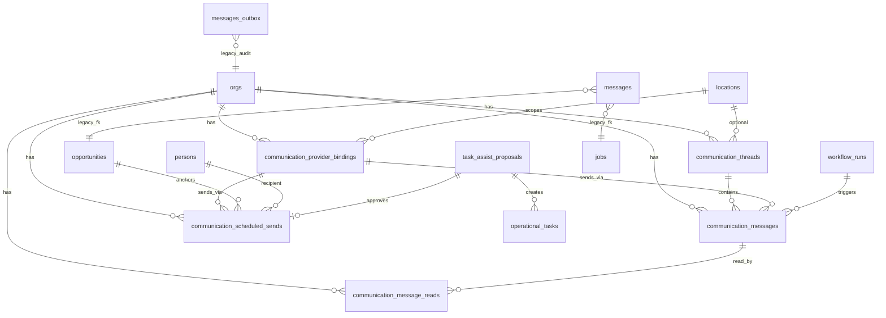

# Messaging V2 — Phase 2 Architecture Review

**Path:** `docs/sprints/06_2026/messaging_v2_architecture.md`  
**Status:** Architecture review (June 2026) — **planning only; no migrations in this sprint**  
**Depends on:** [messaging_v2_audit.md](./messaging_v2_audit.md), [messaging_v2_design.md](./messaging_v2_design.md)

**Schema basis:** `docs/supabase/reference/*.csv` (8 tables touched by communications today; see §2). Regenerate reference before implementation if migrations landed after export.

**Recommendation summary:** **Extend canonical `communication_*` tables** (~65% reusable). Add **narrow new tables** for inbox folders, drafts, attachments, entity links, and provider OAuth — do **not** fork parallel message stores. Formalize **provider adapters** behind existing binding + worker dispatch.

---

## 1. Current schema map (existing)

### 1.1 ER diagram — communication domain today



### 1.2 Table inventory

| Table | Columns (count) | Purpose | Extend vs replace |
|-------|-------------------|---------|-------------------|
| `communication_provider_bindings` | 15 | Provider routing | **Extend** — add OAuth token refs, provider adapter key |
| `communication_threads` | 10 | Thread container | **Extend** — archive flag, last_activity_at, inbox sort helpers |
| `communication_messages` | 20 | Message body + delivery | **Extend** — html format, attachment refs, draft status |
| `communication_message_reads` | 4 | Per-user read | **Keep** — may add `thread_id` denorm for perf |
| `communication_scheduled_sends` | 22 | Scheduled outbound | **Extend** — generalize entity FK |
| `task_assist_proposals` | 22 | BOS proposals | **Keep** — optional link to drafts |
| `operational_tasks` | 15 | Tasks/reminders | **Keep** — feed notification center later |
| `messages` | 21 | Legacy SMS queue | **Retire** (separate program) |
| `messages_outbox` | 17 | Legacy workflow audit | **Retire** (separate program) |

**Not present today (candidates in §3):** `communication_participants`, `communication_channels`, `communication_events`, `communication_drafts`, `communication_attachments`, `communication_entity_links`, `communication_templates`, `notification_items`, `provider_oauth_tokens`.

---

## 2. Canonical objects review

### 2.1 Expected candidates vs current state

| Candidate | Verdict | Notes |
|-----------|---------|-------|
| `communication_threads` | **Exists — extend** | Canonical thread. Uniqueness on entity+channel+recipient_key is correct for CRM threading. |
| `communication_messages` | **Exists — extend** | Canonical message. Status enum is string (flexible). Add structured delivery events optional. |
| `communication_participants` | **New (recommended)** | Normalize person/user/address roles; today split across `recipient_key` and metadata. |
| `communication_channels` | **Not a table — enum sufficient** | Channel is `sms \| email \| in_app` on thread/message. Separate table only if channel config per org exceeds bindings. |
| `communication_events` | **Optional new** | Delivery/open/click audit stream; today webhooks patch message row directly. Recommend **phase 2** after inbox ships — or use `metadata` + webhook log table. |

### 2.2 Canonical object answers (architecture)

1. **Canonical communication object:** `communication_messages` (unchanged).
2. **Canonical thread object:** `communication_threads` (unchanged).
3. **Multi-record span:** Add **`communication_entity_links`** (many-to-many) rather than overloading `primary_entity_*` alone:

```sql
-- Conceptual — not a migration in this sprint
communication_entity_links (
  id uuid PK,
  org_id uuid FK,
  thread_id uuid FK communication_threads,
  entity_type text,
  entity_id uuid,
  link_role text CHECK (link_role IN ('primary','related','customer','opportunity')),
  created_at timestamptz
)
```

Primary anchor remains on thread for uniqueness; links power Inbox sidebar "Associated records."

4. **Entity association:** Resolver maps drawer entity → `primary_entity_type/id` using existing normalization (`normalizeEntityTypeParam` pattern in threads route).

5. **Inbox blockers (technical):**

| Blocker | Mitigation |
|---------|------------|
| No org-wide thread query | New `GET /api/admin/inbox/threads` with cursor pagination, folder filters |
| Read model per-message | Add `communication_thread_views (thread_id, user_id, last_read_at)` OR derive from reads |
| No archive | `communication_threads.archived_at` + partial index |
| No drafts | `communication_drafts` table or status on messages |
| Scheduled not in inbox | Join `communication_scheduled_sends` in Scheduled folder API |

---

## 3. Proposed schema changes (implementation phase — not now)

Priority-ordered minimal additions:

### P0 — Inbox foundation

| Change | Rationale |
|--------|-----------|
| `communication_threads.archived_at`, `archived_by` | Archived folder |
| `communication_threads.last_message_at` (maintained by trigger or app) | Sort list without N+1 |
| `communication_thread_views (thread_id, user_id, last_viewed_at)` | Thread-level unread |
| Index `(org_id, last_message_at DESC)` WHERE archived_at IS NULL | Inbox perf |

### P1 — Composer V2

| Change | Rationale |
|--------|-----------|
| `communication_messages.body_format` CHECK add `html` | Rich email |
| `communication_attachments (message_id, document_id \| storage_ref)` | Images/files |
| `communication_drafts (org_id, author_user_id, payload jsonb, entity_ref, channel, updated_at)` | Drafts folder |

### P2 — Generalization

| Change | Rationale |
|--------|-----------|
| Drop/replace `communication_scheduled_sends.entity_type` CHECK opportunities-only → generic entity registry | Customer/job/person scheduled sends |
| `communication_entity_links` | Multi-record associations |

### P3 — Templates & merge

| Change | Rationale |
|--------|-----------|
| `communication_templates (org_id, channel, key, subject, body, merge_fields jsonb)` | Settings-managed templates |
| `communication_merge_field_registry` (code-first seed + optional org overrides) | Merge resolution |

### P4 — Notifications

| Change | Rationale |
|--------|-----------|
| `notification_items (org_id, user_id, kind, entity_ref, payload, read_at)` | Unified feed |

**Do not create** parallel `inbox_messages` or `email_messages` tables.

---

## 4. Provider abstraction

### 4.1 Design pattern

```
┌─────────────────────────────────────────┐
│ executeCommunicationsSend               │
│   → ProviderRouter.resolve(binding)     │
│   → Adapter.send(OutboundMessage)       │
└─────────────────────────────────────────┘
          │
    ┌─────┴─────┬─────────────┬──────────────┐
    ▼           ▼             ▼              ▼
 ResendAdapter TwilioAdapter GoogleAdapter MicrosoftAdapter
```

**Binding row drives adapter:**

| Field | Use |
|-------|-----|
| `provider` | `resend`, `twilio`, `google_gmail`, `microsoft_graph` |
| `secret_ref` | API key env ref (today) OR `oauth:{token_row_id}` (future) |
| `config` | from_address, reply_to, domain_id, graph mailbox id |

### 4.2 Email

| Provider | Send | Receive | Status |
|----------|------|---------|--------|
| **Resend** | Implemented | No | Current production |
| **Google Gmail API** | Adapter stub | Gmail push/watch | OAuth + token store needed |
| **Microsoft Graph** | Adapter stub | Graph subscriptions | OAuth + token store needed |

**OAuth storage (proposed):** `provider_oauth_connections (org_id, provider, scope, user_id nullable, encrypted_tokens_ref, status, expires_at)` — secrets never in JSONB config.

**Inbound email (future):** Webhook → parse → `communication_messages` inbound + thread match by `In-Reply-To` / participant addresses.

### 4.3 SMS — Twilio

Keep Twilio adapter; extend binding model for:

- Multiple inbound numbers per org (already unique on `inbound_to_e164`)
- Location-scoped outbound caller ID in `config`
- Opt-out sync via Twilio suppression list (future)

**No Twilio replacement in V2** — abstract interface allows Bandwidth/etc. later.

---

## 5. Scheduling architecture

**Existing:** `communication_scheduled_sends` + `claim_due_communication_scheduled_sends` + `process-due` route → `executeCommunicationsSend`.

**Extend:**

| Operation | Mechanism |
|-----------|-----------|
| Create | Insert row with snapshot body/subject/recipient/binding |
| Edit | Allow while `status = pending`; update snapshot + `scheduled_for` |
| Cancel | `status = canceled` |
| Execute | Worker claims → enqueue message → link `communication_message_id` |

**Workflow compatibility:** Workflow action `schedule_communication` (future) inserts same table with `source = workflow` (extend CHECK). Event `communication_scheduled` for audit.

**Inbox Scheduled folder:** Query `status IN ('pending','claimed')` UNION sent awaiting delivery (optional).

---

## 6. Templates architecture

**Today:** Code templates — `web/lib/communications/opportunityComposeTemplates.ts`, tour comms orchestrator, enrollment packet copy.

**Target:**

| Layer | Responsibility |
|-------|----------------|
| `communication_templates` table | Org-authored templates (email HTML + SMS plain) |
| Platform seed templates | Migration or seed JSON for vertical presets (childcare enrollment) |
| Merge resolver service | Given `entity_ref` + template → rendered subject/body |
| Workflow | Reference template by stable `template_key` |

**Workflow usage:** `send_message` migration path → canonical enqueue with `metadata.template_key` + resolved body at execution time (not at workflow save time) for freshness.

---

## 7. Merge fields architecture

**Registry (code-first):**

| Field key | Resolver source |
|-----------|-----------------|
| `parent_name` | Primary guardian person |
| `child_name` | Opportunity child person |
| `location_name` | Opportunity/site location |
| `tour_date` | Next scheduled tour |
| Dynamic | Field registry / layout values via existing record resolver |

**Storage:** Template body contains `{{merge_field_key}}` tokens — same pattern as forms inline tokens (FD-15) but separate resolver to avoid forms coupling.

**Validation:** At compose time, warn on unresolved tokens; block send if required token missing (configurable).

---

## 8. Communication preferences

### 8.1 Current state (schema review)

| Source | Fields | Enforced at send? |
|--------|--------|-------------------|
| `persons` table | email, phone, metadata | Partial — address must exist |
| `persons` columns | **No** dedicated opt-out columns in schema CSV | — |
| Person drawer layout | Field keys: `sms_consent`, `email_consent`, `sms_opt_out`, `email_opt_out`, `marketing_opt_out`, `communication_opt_out` (`personDrawerPresentationProfile.ts`) | **Not verified** in `executeCommunicationsSend` |
| `contacts` | legacy | Avoid for new paths |
| SMS consent page | Public compliance copy | Informational |

### 8.2 Recommendations

1. **Canonical preference store:** `person_communication_preferences (person_id, org_id, channel, category, opted_in, source, updated_at)` OR structured keys in `persons.metadata` with schema validation — prefer **table** if reporting needed.

2. **Categories:** `transactional` vs `marketing` — transactional enrollment/tour messages may bypass marketing opt-out with legal review.

3. **Send gate:** `executeCommunicationsSend` calls `assertPersonChannelAllowed(person_id, channel, category)` before enqueue.

4. **Preferred method:** Optional `preferred_channel` on preferences — composer suggests default.

5. **Sync:** Twilio STOP → inbound webhook sets SMS opt-out (future).

**Do not** store preferences only in UI layout without persistence path.

---

## 9. API architecture (new endpoints — conceptual)

| Endpoint | Purpose |
|----------|---------|
| `GET /api/admin/inbox/threads` | Org-wide paginated thread list + folder filters |
| `GET /api/admin/inbox/threads/[id]` | Detail + messages + entity links |
| `PATCH /api/admin/inbox/threads/[id]` | Archive, mark read |
| `GET/POST/PATCH/DELETE /api/admin/inbox/drafts` | Drafts CRUD |
| `GET /api/admin/inbox/search` | Full-text / structured search |
| Existing routes | Keep for drawer backward compatibility |

**Auth:** `requireAdminOrOps` + `communications.read` / `communications.send` permissions (extend capability registry).

**CRM scope:** Apply `getAdminAccessContextCached` location/department filters to inbox list same as entity APIs.

---

## 10. Legacy coexistence

| System | Strategy |
|--------|----------|
| `messages` / `messages_outbox` | Continue retirement plan; inbox reads **canonical only** |
| Dual-write flag | Deprecate after workflow migration |
| Workflow `send_message` | Rewire to canonical enqueue per `legacy-messages-retirement-plan.md` Phase 3 |

---

## 11. Security and compliance

- RLS: all new tables org-scoped; service_role for worker mutations (match existing pattern).
- OAuth tokens: encrypt at rest; rotate refresh tokens in worker.
- Attachments: virus scan hook (future); size limits per channel.
- Audit: retain `workflow_run_id` + add `created_by_user_id` on messages if not present (check — may be metadata-only today).

---

## 12. Foundation reuse scorecard

| Component | Reuse | New work |
|-----------|-------|----------|
| Thread/message storage | 65% | Archive, sort columns, entity links |
| Send pipeline | 70% | Preference gates, multi-entity scheduled |
| Read/unread | 50% | Thread views, inbox aggregation |
| Bindings | 60% | OAuth connections, adapter registry |
| Scheduling | 55% | Generalize entity FK, inbox UI |
| Templates/merge | 25% | DB templates + resolver |
| Inbox APIs | 15% | Primary greenfield |
| Notifications | 10% | New notification_items |

**Conclusion:** Messaging V2 is a **platform extension**, not a rewrite. Implementation should default to **refactoring** `CommunicationsDrawerSection` into shared packages and adding inbox aggregation — not introducing `communications_v2_*` tables.

---

## 13. Related

- [messaging_v2_implementation_plan.md](./messaging_v2_implementation_plan.md)
- `docs/product/communications.md` — update when architecture ships
- `docs/audits/legacy-messages-retirement-plan.md`

**Suggested commit message:** `docs(sprint): Messaging V2 architecture review and schema extension plan`
