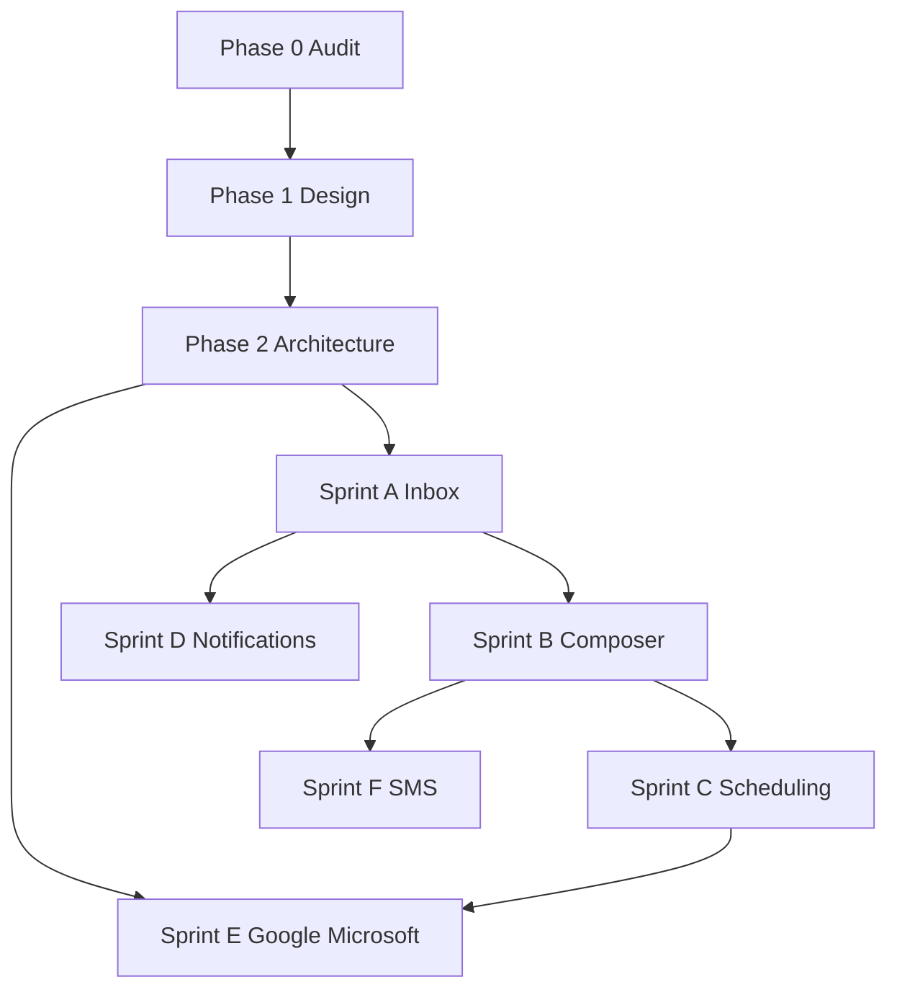

# Messaging V2 — Phase 3 Implementation Plan

**Path:** `docs/sprints/06_2026/messaging_v2_implementation_plan.md`  
**Status:** Implementation plan (June 2026) — **no code until audit + design + architecture reviewed**  
**Depends on:** [messaging_v2_audit.md](./messaging_v2_audit.md), [messaging_v2_design.md](./messaging_v2_design.md), [messaging_v2_architecture.md](./messaging_v2_architecture.md)

**Principle:** Ship incrementally on the **canonical `communication_*` path**. Each sprint delivers operator-visible value without blocking on provider OAuth.

---

## Recommended implementation order

```
Sprint A (Inbox Foundation)
    ↓
Sprint B (Composer V2) ─── can overlap A tail if shared component extraction done
    ↓
Sprint C (Scheduling) ─── partial overlap with B
    ↓
Sprint D (Notifications)
    ↓
Sprint E (Google / Microsoft) ─── depends on provider abstraction from architecture
    ↓
Sprint F (SMS Infrastructure hardening)
```

**Parallel track (ongoing):** Legacy `messages` retirement Phases 2–3 — not blocking Inbox MVP but required before deprecating workflow SMS.

---

## Sprint A — Inbox Foundation

**Goal:** Header **Inbox** with org-wide conversation list, folders (Inbox, Unread, Sent, Archived), conversation detail, unread badge.

### Scope

| In | Out |
|----|-----|
| Route `/adminV2/inbox` (rename or alias `/messages`) | Full-text search (P1) |
| `GET /api/admin/inbox/threads` paginated | Drafts folder (Sprint B) |
| Left rail + conversation list + detail | Email/SMS/Internal filter placeholders (UI only) |
| Wire `unread-count` to header badge | Notification center |
| Archive thread (`archived_at` migration) | Provider OAuth |
| Extract shared thread list/detail from drawer | Rich editor |
| Entity filter query param from drawer deep link | |

### Dependencies

- Architecture §3 P0 columns + `communication_thread_views` (or equivalent)
- `getAdminAccessContextCached` scope rules for list API
- Index on `(org_id, last_message_at)`

### Key files (expected touch)

- New: `web/app/adminV2/inbox/*`, `web/app/api/admin/inbox/threads/*`
- Refactor: `CommunicationsDrawerSection.tsx` → shared `CommunicationsThreadView`, `CommunicationsThreadList`
- `TopNavBar.tsx` — Inbox label + badge
- Migration: thread archive + sort columns
- Tests: inbox API pagination, scope, unread math
- Docs: update `docs/product/communications.md`

### Complexity

| Area | Estimate |
|------|----------|
| Schema migration | S |
| Inbox list API | M |
| Inbox UI (3-column) | L |
| Drawer refactor extract | M |
| Header badge + polling | S |

**Overall: L (2–3 weeks)**

### Risks

| Risk | Mitigation |
|------|------------|
| Org-wide query perf at scale | Cursor pagination; `last_message_at` denorm; limit default 50 |
| Unread correctness vs 300-cap API | Replace bounded scan with thread_views table |
| CRM scope leaks cross-location threads | Filter in SQL using entity joins (opportunity.location_id) |

---

## Sprint B — Composer V2

**Goal:** Unified rich composer in Inbox + drawer; multi-recipient; visual refresh (Bend Pine light surfaces).

### Scope

| In | Out |
|----|-----|
| Shared `CommunicationsComposerV2` | Template picker (DB) |
| Rich text (bold/italic/underline/link/lists/image) | Campaign mode |
| Email HTML + SMS plain strip | Merge field execution (stub picker OK) |
| Multi-recipient send (N enqueues) | Attachments to external storage (stub if needed) |
| Visual refresh per design doc | BOS draft synthesis changes |
| `communication_drafts` + Drafts folder | |
| Merge Quick Message into Inbox compose | |

### Dependencies

- Sprint A inbox shell (compose panel placement)
- Architecture P1: `body_format html`, drafts table
- Image upload → documents pipeline decision

### Key files

- New: `web/components/admin/communications/CommunicationsComposerV2.tsx`, TipTap or existing editor if present
- `executeCommunicationsSend.ts` — multi-recipient loop, html body
- `CommunicationsDrawerSection.tsx` — swap composer + bubble styles
- Migration: drafts table
- Tests: multi-send, SMS strip HTML, draft CRUD

### Complexity

| Area | Estimate |
|------|----------|
| Rich editor integration | M |
| Composer unification | M |
| Visual refresh | M |
| Drafts API + folder | M |
| Multi-recipient | S |

**Overall: L (2–3 weeks)**

### Risks

| Risk | Mitigation |
|------|------------|
| HTML email deliverability | Sanitize HTML; inline CSS minimal; test Resend |
| Duplicate sends on double-click | Idempotency key on send button |
| Drawer/Inbox composer drift | Single component mandatory |

---

## Sprint C — Scheduling

**Goal:** Schedule from Composer V2; **Scheduled** inbox folder; edit/cancel.

### Scope

| In | Out |
|----|-----|
| Schedule picker in composer bottom bar | Recurring schedules |
| Scheduled folder in inbox | Workflow builder UI |
| Edit/cancel pending rows | |
| Generalize `communication_scheduled_sends` entity FK (person, job, customer) | |
| Cron hardening for `process-due` | |

### Dependencies

- Sprint B composer Schedule action
- Migration: relax opportunities-only CHECK + triggers
- Verified cron in production (`roadmap-and-gaps.md` item 8)

### Key files

- `communicationScheduledSendsService.ts`, routes under `communication-scheduled-sends`
- Inbox Scheduled folder query
- `docs/product/communications.md` — process-due contract

### Complexity

**Overall: M (1–2 weeks)**

### Risks

| Risk | Mitigation |
|------|------------|
| Missed cron → stuck pending | Alerting on aged pending rows; manual process-due admin action |
| Timezone confusion | Store UTC; display via `AdminViewerTimezoneContext` |

---

## Sprint D — Notifications

**Goal:** Converge operational signals toward single inbox experience; header notification feed MVP.

### Scope

| In | Out |
|----|-----|
| `notification_items` table + API | Full @mentions |
| Inbox sub-feed or slide-over for assignments + BOS alerts | Mobile push |
| Mark read / deep link to record | Real-time websocket |
| Integrate operational tasks into feed | Replace tasks badge entirely (optional) |
| Extend unread model | |

### Dependencies

- Sprint A inbox shell
- Architecture P4 notification_items
- BOS handoff events catalog

### Complexity

**Overall: L (2–3 weeks)** — product definition heavy

### Risks

| Risk | Mitigation |
|------|------------|
| Scope creep into full notification platform | Ship read-only feed MVP first |
| Duplicate unread counts (tasks vs inbox) | Single badge source aggregator |

---

## Sprint E — Provider Integrations (Google / Microsoft)

**Goal:** OAuth connect for send-as-mailbox; adapter abstraction; optional inbound email path design.

### Scope

| In | Out |
|----|-----|
| `provider_oauth_connections` + Settings UI connect flow | Full mailbox sync bi-directional |
| `GoogleMailAdapter`, `MicrosoftGraphAdapter` send | Calendar OAuth |
| Extend `communication_provider_bindings.provider` enum | Replace Resend as default |
| Token refresh worker | |
| Inbound email webhook MVP (optional sub-phase E2) | |

### Dependencies

- Architecture §4 provider router refactor in Python + Next
- Legal/compliance review for stored mailbox tokens
- Google Cloud + Azure app registration

### Complexity

**Overall: XL (4–6 weeks)** — external dependencies

### Risks

| Risk | Mitigation |
|------|------------|
| OAuth token security | Encrypt refs; never client-side tokens |
| Graph/Gmail API quota | Rate limit queue |
| Deliverability vs Resend | Keep Resend as fallback binding |

---

## Sprint F — SMS Infrastructure (Twilio)

**Goal:** Production-grade SMS routing, opt-out enforcement, multi-number admin UX.

### Scope

| In | Out |
|----|-----|
| Person preference gate at send | BYO number purchase wizard |
| Twilio STOP handling → preference update | Non-Twilio providers |
| Location-scoped number routing UI in Settings | |
| Binding resolver user scope (if product requires) | |
| Monitoring/alerts for failed SMS | |

### Dependencies

- Sprint B send path (preference assert)
- Architecture §8 preferences table
- Inbound webhook path (Python)

### Complexity

**Overall: M (1–2 weeks)**

### Risks

| Risk | Mitigation |
|------|------------|
| Opt-out false positives | Transactional exemption policy documented |
| Inbound binding mismatch | Audit `inbound_to_e164` per org |

---

## Cross-sprint workstreams

| Workstream | Sprints | Notes |
|------------|---------|-------|
| Entity abstraction (customer/vendor drawers) | A, B | Extend send API entity allowlist |
| Shared communications package | A, B | `web/lib/communications/inbox/*`, `web/components/admin/communications/*` |
| Legacy messages retirement | Parallel | Phase 3 workflow rewire before turning off `messages` |
| Docs + tests | All | `communications.md`, API contract tests, inbox e2e smoke |
| Performance | A, D | Pagination, virtualized list, index review |

---

## Dependency graph



---

## Verification checklist (per sprint)

| Check | Command / action |
|-------|------------------|
| TypeScript | `cd web && npx tsc --noEmit` |
| Module imports | `cd web && npm run verify:module-imports` |
| Lint | `cd web && npm run lint` |
| Tests | `cd web && npm run test -- <paths>` |
| Schema reference | `npm run export:supabase-schema` after migrations |
| Manual QA | Pilot org: send SMS/email, inbox list, schedule, archive |

---

## Effort summary

| Sprint | Complexity | Calendar (indicative) |
|--------|------------|------------------------|
| A — Inbox Foundation | L | 2–3 weeks |
| B — Composer V2 | L | 2–3 weeks |
| C — Scheduling | M | 1–2 weeks |
| D — Notifications | L | 2–3 weeks |
| E — Google / Microsoft | XL | 4–6 weeks |
| F — SMS Infrastructure | M | 1–2 weeks |

**Total sequential:** ~12–19 weeks engineering (overlap reduces calendar time).

---

## Review gates (do not implement until passed)

- [ ] Audit reviewed — foundation reuse accepted
- [ ] Design reviewed — Inbox UX + composer scope signed off
- [ ] Architecture reviewed — schema additions approved
- [ ] Security review for OAuth sprint (E)
- [ ] Legal review for SMS opt-out (F)

---

## Suggested first PR (after review)

**Sprint A Phase 1:** Migration for `archived_at` + `last_message_at` + inbox threads API + header badge only (no full UI) — proves aggregation query under load.

**Suggested commit message:** `docs(sprint): Messaging V2 phased implementation plan`
