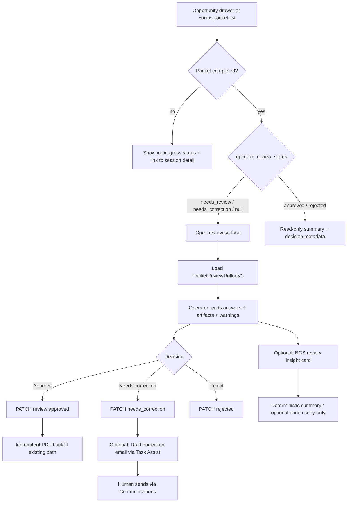

# Forms/Documents Phase 2 — Step 1 Design (Target State)

**Date:** May 2026  
**Status:** Design only — no implementation, migrations, or implementation cards.  
**Prerequisites:** [`forms_documents_phase_2_step0_audit.md`](./forms_documents_phase_2_step0_audit.md)  
**Forward plan (not in scope here):** [`enrollment_packet_phase_2.md`](./enrollment_packet_phase_2.md) sections A–G (DCP, queues, full branding product)

---

## Design intent

Make enrollment **packet review** feel like one coherent, trustworthy case file: submitted answers readable in place, every step accounted for (PDF or not), generated files explainable, and BOS assist that **summarizes without mutating**.

**Doctrine (unchanged):**

| Layer | Role in this sprint |
|-------|---------------------|
| **Forms Engine** | Canonical intake — `form_submissions.payload` |
| **`form_packet_sessions` / items** | Packet execution truth — no new session statuses |
| **`workflow_events`** | CRM Activity visibility only |
| **Communications** | Delivery state; correction drafts are human-sent |
| **`documents` + `form_submission_documents`** | Artifact linkage |
| **BOS** | Read-only insight + optional bounded enrich; Task Assist **draft** only |

**Explicit non-goals:** DCP table, per-field CRM apply, packet queues, parent re-open, reminders/SMS, superseded document lifecycle, page builder, new theming engine.

---

## 1. Target user experience

### Operator (primary)

| Moment | Target experience |
|--------|-------------------|
| **Opportunity drawer — packet pending** | Compact banner lists **all** pending packet sessions (not only the newest). Each row: packet name, subject line (household/child), step progress, warning count, **Review** opens unified review surface. |
| **Review surface (modal or full page)** | Single scrollable **case file**: enrollment context strip → linkage/confidence strip → operator warnings → **per-step answer sections** (schema labels, readonly) → **artifacts per step** (PDF link or “Submitted form record”) → review notes + Approve / Needs correction / Reject. |
| **Deep drill-down** | “Open submission (advanced)” and “Technical JSON” collapsed under each step — not the default path. |
| **Documents tab** | Every packet step visible: generated PDFs with provenance line; non-PDF steps as **Submitted form record** rows (same deep link as review). |
| **After decision** | Status chip on inquiry summary; Activity event unchanged (existing projection). No automatic email on approve/reject. |

### Family (public — minimal change this sprint)

| Moment | Target experience |
|--------|-------------------|
| **Open packet link** | Optional **org name + packet title + short intro** above the form when configured in packet metadata (strings only). |
| **In progress** | Unchanged step progress (existing embed). |
| **Completed** | Unchanged terminal message; **no** re-open when staff marks needs_correction (deferred). |

### Demo / pilot narrative

> “Staff see exactly what the family submitted, which PDFs were generated from which form version, and an AI summary that does not change CRM records.”

---

## 2. Target operator review flow



### Flow rules

1. **Review gate unchanged** — only `PATCH .../packet-sessions/[id]/review` mutates `operator_review_status` (existing route).
2. **Linkage still per submission** — rollup shows aggregate flags; “Fix linkage” deep-links to existing `FormSubmissionDetailClient` linkage panel for the affected step.
3. **No approve without visibility** — rollup must load (or show explicit error) before primary actions enable; avoid approving when answers failed to load.
4. **Multi-packet** — drawer lists pending sessions; operator clears one at a time (no merge of sessions).
5. **Correction path** — `needs_correction` does **not** reopen public embed; optional draft email explains next steps and references re-send of link (manual, existing launch modal).

### Surface placement

| Surface | Role |
|---------|------|
| **`OpportunityPacketReviewOverview` modal** | Primary daily path — embed rollup (lazy-loaded). |
| **`/adminV2/forms/packets/[packetSessionId]`** | Power path — full rollup + collapsed technical panels. |
| **`FormSubmissionDetailClient`** | Advanced: linkage, manual PDF generate, technical payload. |

---

## 3. Target data / read model shape

### Design principle

**No new canonical tables.** Read models are **computed at request time** from existing rows and joined for admin APIs only. Optional: enrich `documents.metadata` on **future** PDF generation with provenance fields (application-layer insert patch — **not** a migration if metadata JSON already exists).

### Core type: `PacketReviewRollupV1`

Server-assembled JSON returned by a dedicated read endpoint (recommended shape):

```ts
// Conceptual — implement in web/lib/forms/packets/packetReviewRollup.ts

type PacketReviewRollupV1 = {
  packet_session_id: string;
  org_id: string;
  status: "in_progress" | "completed" | "cancelled";
  operator_review: {
    status: "needs_review" | "approved" | "rejected" | "needs_correction" | null;
    warnings: OperatorReviewWarning[];
    notes: string | null;
    reviewed_at: string | null;
  };
  packet_definition: { id: string; name: string; key: string | null };
  enrollment_context: {
    opportunity_id: string | null;
    opportunity_label: string | null;
    customer_id: string | null;
    customer_label: string | null;
    launch_surface: string | null;
    recipient_person_id: string | null;
  };
  progress: {
    total_steps: number;
    submitted_steps: number;
    current_sequence_index: number | null;
  };
  linkage_summary: {
    any_intake_needs_review: boolean;
    steps_missing_crm_fk: number;
    steps: { sequence_index: number; form_name: string; intake_needs_review: boolean; has_crm_fk: boolean; admin_submission_path: string | null }[];
  };
  shared_values_display?: { key: string; label: string; value: string }[]; // optional; keys from schema where possible
  steps: PacketReviewRollupStepV1[];
  documents_index: PacketReviewDocumentIndexEntryV1[]; // flat list for Documents tab reuse
};

type PacketReviewRollupStepV1 = {
  sequence_index: number;
  session_item_id: string;
  item_status: string;
  submitted_at: string | null;
  form_definition_id: string;
  form_name: string;
  form_submission_id: string | null;
  submission_status: "draft" | "submitted" | null;
  form_definition_version_id: string | null;
  version_number: number | null;
  has_pdf_mapping: boolean;
  artifact: {
    kind: "generated_pdf" | "submitted_record" | "pending" | "not_started";
    label: string; // e.g. "Generated PDF" | "Submitted form record"
    documents: { id: string; name: string; signed_url_path?: string }[]; // 0–n PDFs
    admin_submission_path: string | null;
  };
  /** For UI — readonly FormEngineRenderer inputs */
  answer_view: {
    schema_json: FormSchemaV1;
    payload: FormPayload;
    option_values_by_field_id?: Record<string, string[]>;
  } | null; // null if draft/not submitted
  intake_meta: {
    intake_needs_review: boolean;
    intake_review_reason: string | null;
    intake_resolution_path: string | null;
  } | null;
};

type PacketReviewDocumentIndexEntryV1 = {
  kind: "generated_pdf" | "submitted_record";
  step_sequence_index: number;
  form_name: string;
  form_submission_id: string;
  document_id: string | null; // null for submitted_record
  title: string;
  provenance: DocumentProvenanceV1;
  admin_links: {
    submission_path: string;
    packet_session_path: string;
    signed_url_path?: string;
  };
};

type DocumentProvenanceV1 = {
  form_definition_id: string;
  form_name: string;
  form_definition_version_id: string;
  version_number: number;
  form_submission_id: string;
  submission_submitted_at: string | null;
  generated_at: string | null; // documents.created_at when PDF
  template_key: string | null;
  idempotency_key: string | null;
  generation_label: "current" | "also_generated"; // heuristic, see §5
};
```

### API placement

| Endpoint | Method | Purpose |
|----------|--------|---------|
| **`/api/admin/forms/packet-sessions/[packetSessionId]/review-rollup`** | GET | Returns `PacketReviewRollupV1`; auth: `requireAdminOrOps` + org assert. |
| **`/api/admin/opportunities/[id]/enrollment-packets`** | GET (extend) | Add lightweight `pending_review_count`, per-session `warning_count`, optional `rollup_preview` (headlines only — **not** full schema payloads). |
| **`/api/admin/forms/packet-sessions/[packetSessionId]/review-insight`** | GET | Deterministic BOS insight payload (§4). |
| **`/api/admin/forms/packet-sessions/[packetSessionId]/review-insight/enrich`** | POST | Optional LLM polish (§4); gated like `enrich-attention-suggestion`. |

**Do not** embed full rollup in opportunity entity GET (keeps drawer payload bounded).

### Answer rollup implementation strategy

**Reuse, do not fork:**

1. Load each step’s `form_submissions` row + `form_definition_versions.schema_json` for `form_definition_version_id`.
2. Validate schema with existing `validateFormSchema`.
3. UI renders **`FormEngineRenderer` `mode="readonly"`** — same as `FormSubmissionDetailClient` (“Answers submitted”).
4. Hidden fields: omit or show “—” per existing visibility evaluation (optional server-side `evaluateFieldVisibility` on submitted payload for readonly consistency).

**Repeating groups / signatures:** Supported by renderer as today; no DCP diff.

**Performance:** Cap steps (e.g. 30); paginate unlikely for enrollment. Single round-trip via rollup endpoint.

### Non-PDF `submitted_record` semantics

| Condition | `artifact.kind` |
|-----------|-----------------|
| Item not submitted | `not_started` or `pending` |
| Submitted, no `pdf_mapping_json` on version | `submitted_record` |
| Submitted, mapping exists, PDF junction present | `generated_pdf` |
| Submitted, mapping exists, no PDF yet | `submitted_record` + note “PDF after approval” if session awaiting review; else offer link to manual generate on submission detail |

---

## 4. BOS boundaries and proposed UX

### New capability (registry — design target)

| Field | Value |
|-------|--------|
| `capability_key` | `enrollment_packet_review_insight` |
| `domain` | `insight` |
| `proposal_mode` | `ephemeral` |
| `apply_policy` | `none` |
| `requires_human_approval` | n/a (no apply) |
| `default_risk_level` | `none` |

### Deterministic insight (required for sprint)

**Input:** `packetSessionId` (org-scoped).  
**Output:** `PacketReviewInsightV1`:

```ts
type PacketReviewInsightV1 = {
  capability_key: "enrollment_packet_review_insight";
  generated_at: string;
  summary_bullets: string[];      // 3–7 bullets, template-filled
  checklist: { label: string; status: "ok" | "attention" | "blocked" }[];
  warnings_repeat: OperatorReviewWarning[];
  staleness?: { completed_days_ago: number; label: string };
  disclaimer: "Assistive summary only. Submitted answers and CRM records remain authoritative.";
};
```

**Template sources (no LLM):**

- `linkage_summary` from rollup
- `operator_review_warnings`
- step counts / missing PDFs / pending intake
- `operator_review_status`
- optional: compare `shared_values` name keys to CRM snapshot (extend existing warning messages)

### Optional enrichment (bounded)

Mirror **`POST /api/admin/ai/enrich-attention-suggestion`**:

- Requires org `ai_policy` + `ai.enrichment.use` when permission gate enabled.
- Input: deterministic `PacketReviewInsightV1` + **truncated** rollup headlines (not full PII dump — cap length).
- Output: `{ enriched_summary: string }` — **copy-only**; UI shows “Suggested wording” separate from deterministic bullets.
- **Must not** add new facts, CRM IDs, or recommended field mutations.

### UX placement

| Location | Behavior |
|----------|----------|
| **Review modal / packet detail** | Collapsible card “Review assist” — **Load insight** on expand (avoid N+1 on drawer load). |
| **Orchestrator (stretch / optional card)** | Route phrase “summarize enrollment packet” when opportunity + pending session in context → same GET insight; **no** auto-execution. |
| **Not in scope** | Auto-approve, auto-email, writing `operator_review_notes`. |

### Task Assist — correction draft (optional item 5)

| Boundary | Rule |
|----------|------|
| Trigger | Button **Draft correction email** visible when `needs_correction` selected or after marking needs_correction. |
| Generation | Extend `assembleTaskAssistOpportunityContextV1` with optional `packet_session_id` + rollup headlines; new propose template `enrollment_packet_correction_draft` **or** deterministic string builder (prefer deterministic + optional Task Assist polish). |
| Persistence | May use ephemeral response only; if `task_assist_proposals` used, `apply` **not** called for send — operator uses Quick Message / drawer comms. |
| Send | Existing `executeCommunicationsSend` / Quick Message — **human clicks Send**. |
| Content | References packet name, steps needing correction (from notes + warnings), embed link from `started_via_public_link_id` (read-only lookup). |

---

## 5. Documents / provenance UX

### List row presentation (opportunity Documents + review step list)

Extend normalized document presentation (fields on API response, not necessarily DB columns):

| UI line | Source |
|---------|--------|
| **Title** | `documents.title` or form schema title |
| **Provenance** | `From {form_name} · v{version_number} · submitted {date} · generated {date}` |
| **Currentness** | See heuristic below |
| **Links** | Submission admin, packet session (existing paths) |

### Currentness without `superseded` status

| Case | Label |
|------|--------|
| One `generated_pdf` per submission with matching `idempotency_key` | **Current generated PDF** |
| Regenerate produced second row (different `documents.created_at`, same submission) | First: **Also generated {date}**; latest by `created_at`: **Current generated PDF** |
| No PDF, submission submitted | **Submitted form record** (not a `documents` row) |
| PDF expected after approval, not yet run | **PDF pending approval** (review surface only) |

### Application-layer provenance enrichment (optional small patch)

On `createGeneratedPdfForSubmission`, add to `documents.metadata` (JSON):

- `form_submission_id`, `form_definition_version_id`, `form_definition_version_number`, `form_definition_id`, `submission_submitted_at`

Enables provenance without migration if `metadata` column exists. Rollup/read path reads junction + submission + version if metadata incomplete (backward compatible).

### Signed URLs

Unchanged — existing signed-url route; rollup returns admin paths only, client requests signed URL on open.

---

## 6. Branding / theming thin-slice recommendation

### Audit conclusion

| Asset | Exists today? | Phase 2 action |
|-------|---------------|----------------|
| **Org display name** | Yes — `organizations.name` (used in enrollment email) | Reuse on public header + PDF stub title block |
| **Org logo URL** | **Not found** in forms/packet schema or standard org_settings keys | **Do not invent storage**; support optional URL in packet metadata only |
| **Packet email templates** | `form_packet_definitions.metadata` (`enrollment_email`, legacy keys) | Unchanged |
| **Public embed theme** | Neutral embed styles; Alloy tokens in admin only | No global theming engine |
| **PDF branding** | Stub PDF with schema title + slots | Add org name subtitle line when available |

### Recommended metadata contract (config/data — no migration)

Document for seeds/pilots under `form_packet_definitions.metadata.public_experience`:

```json
{
  "public_experience": {
    "header_title": "Enrollment for {{household_name}}",
    "intro_text": "Please complete each step. Your progress is saved.",
    "footer_text": "Questions? Contact our office.",
    "logo_url": "https://…",
    "accent_color": "#00458C"
  }
}
```

| Field | Use |
|-------|-----|
| `header_title` | Plain string; optional `{{household_name}}` substitution from launch context |
| `intro_text` / `footer_text` | Render above/below `FormEngineRenderer` on embed |
| `logo_url` | Optional `` — HTTPS only; fail closed if invalid |
| `accent_color` | **Optional** — primary button/border only; must pass simple contrast guard |

**Resolve public experience:** `packet definition metadata` → override; else org name only.

**Generated PDF:** Pass `organizationName` into `buildStubFormPdfBuffer` header (read-only text).

**Explicitly out of scope:** Page builder blocks, font picker, per-field styling, white-label DNS, Resend template branding.

---

## 7. Explicit deferred items

| Item | Rationale |
|------|-----------|
| **DCP / per-field approve → CRM** | Separate sprint; requires apply path + audit policy |
| **Parent re-open embed on needs_correction** | Session terminal semantics + product decision |
| **Automated reminders / SMS** | Communications scope; not trust-blocking |
| **Packet workspace queues** | No QueueService refactor; unstable index until rollup stable |
| **`documents` superseded / void** | Lifecycle migration + operator training |
| **Bundle PDF across steps** | Compliance packaging |
| **Comms delivery dashboard in review** | Join complexity; launch modal sufficient for v1 |
| **Field-level diff vs CRM** | DCP scope; warnings remain heuristic only |
| **Orchestrator-wide packet agent** | Optional stretch only |
| **New session statuses** | Use `operator_review_status` |
| **Repeating-group shared_values merge** | Separate packet engine card |
| **Schema reference CSV refresh** | Ops/docs task, not UX |

---

## 8. Implementation card outline (titles only — STEP 2 expands)

| Order | Card | Outcome |
|-------|------|---------|
| **P2-1** | **PacketReviewRollup read model + GET API** | `packetReviewRollup.ts` + route + unit tests (fixture payloads) |
| **P2-2** | **Packet session detail — review console** | Replace JSON-first default with rollup sections; technical JSON collapsed |
| **P2-3** | **Drawer review modal — rollup + multi-pending list** | Lazy-load rollup; show all pending sessions |
| **P2-4** | **Non-PDF + provenance on Documents** | `submitted_record` rows; `DocumentProvenanceV1` on related API + `normalizeDocumentRow` |
| **P2-5** | **Deterministic review insight + UI card** | GET insight route + registry entry + collapsible assist panel |
| **P2-6** | **Optional insight enrich route** | POST enrich gated like attention enrich |
| **P2-7** | **Optional correction email draft** | Task Assist / deterministic draft + handoff to comms (no auto-send) |
| **P2-8** | **Public experience metadata (thin)** | Embed header/footer + PDF org line; seed doc for pilots |

**Dependency graph:** P2-1 → P2-2, P2-3, P2-4, P2-5 → P2-6, P2-7; P2-8 parallel after P2-1 (needs launch context reader).

---

## 9. Testing strategy

| Layer | Scope |
|-------|--------|
| **Unit** | `packetReviewRollup` builder: multi-step, non-PDF step, missing schema, intake flags, provenance/heuristic labels; insight template generation |
| **Route** | `review-rollup` GET auth/org 404; insight GET; review PATCH regression unchanged |
| **Component** | Optional shallow test: rollup renders readonly field label from fixture (if extracted presentational component) |
| **Integration** | Extend `enrollment-packets` GET test for pending list fields; related opportunity documents merge includes `submitted_record` |
| **Regression** | `packetSessionReviewRoute`, `formPacketAdvance`, `ensureGeneratedPdfsForApprovedPacketSession` |
| **BOS** | Insight route policy gates (stub vs openai); enrich obeys permission denial |
| **Manual pilot script** | Launch packet → public submit all steps → drawer review without opening N tabs → approve → PDF provenance visible |

**Not required this sprint:** Playwright embed E2E (note as follow-up).

---

## 10. Acceptance criteria for moving to STEP 2

STEP 2 may begin (sprint doc + full implementation cards) when this design is accepted and:

1. **Stakeholder sign-off** on thin slice scope — especially **no DCP** and **no parent re-open**.
2. **API contract frozen** — `PacketReviewRollupV1` and `PacketReviewInsightV1` field names stable enough for cards P2-1–P2-5.
3. **UX anchor chosen** — drawer modal vs packet detail as **primary** (design recommends **both**: modal for speed, detail for power — same rollup component).
4. **Branding metadata key** — `public_experience` documented for pilot seeds (even if P2-8 is last card).
5. **Optional cards flagged** — P2-6, P2-7, P2-8 marked optional in sprint doc if schedule tight; P2-1–P2-5 are **MVP**.

### MVP acceptance (end of implementation — for STEP 2 doc)

- [ ] Operator can complete approve/reject/needs_correction with **submitted answers visible** in review surface for all submitted steps.
- [ ] Non-PDF steps show **Submitted form record** (not empty/error) in review and opportunity Documents.
- [ ] Generated PDFs show **form name, version, submission time, generation time**, and currentness heuristic.
- [ ] BOS insight returns **deterministic** summary; no CRM writes; enrich (if shipped) is copy-only and gated.
- [ ] No new migrations required for MVP unless provenance metadata patch is chosen (JSON only).
- [ ] Phase 1 review PATCH + PDF backfill + workflow projections still pass existing tests.

---

## Related implementation anchors

| Concern | Existing path to extend |
|---------|-------------------------|
| Readonly answers | `FormSubmissionDetailClient` + `FormEngineRenderer` readonly |
| Warnings | `packetOperatorReviewWarnings.ts` |
| Review PATCH | `packet-sessions/[id]/review/route.ts` |
| Documents merge | `related/[entity]/[id]/route.ts`, `normalizeDocumentRow.ts` |
| Enrich pattern | `enrich-attention-suggestion/route.ts` |
| Email templates | `enrollmentPacketEmailTemplate.ts`, packet `metadata` |

---

*End of STEP 1 design. STEP 2 sprint doc: [`forms_documents_phase_2_packet_review_mvp.md`](./forms_documents_phase_2_packet_review_mvp.md).*
