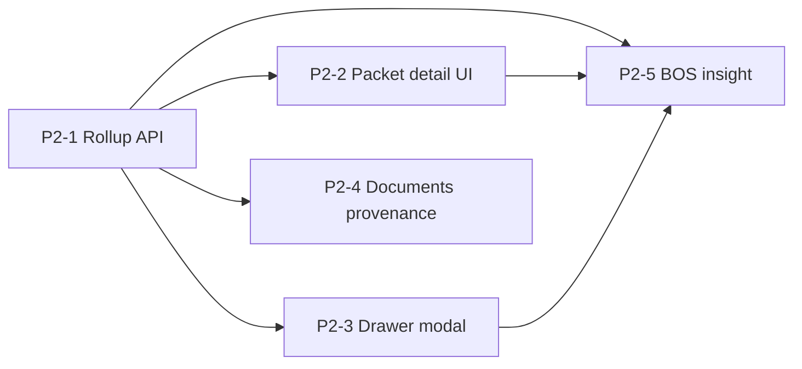

# Forms/Documents Phase 2 — Packet Review MVP (Sprint Execution)

**Date:** May 2026  
**Status:** STEP 2 — sprint doc + implementation cards (no code in this step)  
**Prerequisites:**

| Step | Doc |
|------|-----|
| 0 — Audit | [`forms_documents_phase_2_step0_audit.md`](./forms_documents_phase_2_step0_audit.md) |
| 1 — Design | [`forms_documents_phase_2_step1_design.md`](./forms_documents_phase_2_step1_design.md) |
| Long-range Phase 2 themes | [`enrollment_packet_phase_2.md`](./enrollment_packet_phase_2.md) (sections A–G deferred) |

**Product docs to update when cards ship:** `docs/product/documents-and-forms.md`, `docs/product/crm-system.md` (as-built only).

---

## Overview

### Sprint objective

Build the **narrow Forms/Documents Phase 2 MVP** that makes enrollment **packet review** coherent, readable, auditable, **BOS-assisted (read-only)**, and **demo-ready** — **without** Data Change Proposals (DCP), autonomous CRM mutation, packet queues, or Communications refactor.

### MVP cards (execute in order)

| Card | Title | Depends on |
|------|-------|------------|
| **P2-1** | PacketReviewRollupV1 read API | — |
| **P2-2** | Packet detail review console | P2-1 |
| **P2-3** | Opportunity drawer review modal hardening | P2-1 |
| **P2-4** | Document provenance + non-PDF submitted records | P2-1 |
| **UX** | Operational experience hardening (audit/design/cards only → implementation) | P2-1 … P2-4 |
| **P2-5** | Deterministic BOS packet review insight | P2-1, **UX-D + UX-H** |

### Optional (documented, not MVP execution)

| Card | Title |
|------|-------|
| P2-6 | AI insight enrich (LLM polish) |
| P2-7 | Task Assist correction email draft |
| P2-8 | Public packet branding metadata |

### Success statement

An operator can open an opportunity with a **completed** enrollment packet, see **all pending sessions**, read **every submitted step’s answers** with schema labels in one surface, see **PDF or submitted-record** artifacts with provenance, read a **deterministic review assist** summary, and **approve / reject / needs correction** using the **existing** review PATCH — without opening N submission tabs or raw JSON.

---

## Doctrine and hard boundaries

### Platform boundary — generalized intake/review (not enrollment-only)

Enrollment packets are the **proving ground** for Phase 2, not the architecture ceiling. Implementation must stay reusable across:

| Mode | Execution truth | Review / artifacts (Phase 2 pattern) |
|------|-----------------|----------------------------------------|
| **Standalone operational form** | `form_submissions` + version | Single-submission review surfaces; provenance from version + submit time |
| **Public lead / intake form** | `form_submissions` + link metadata | Same rollup/provenance **patterns**; linkage + intake review flags |
| **Multi-step operational packet** | `form_packet_sessions` + items + per-step submissions | `PacketReviewRollupV1`, `PacketReviewRollupView`, Documents merge |

**Preserve (do not encode enrollment-only in platform layers):**

- Reusable **review console** layout (context → linkage/warnings → labeled answers → artifacts → governed actions).
- Reusable **provenance** lines and artifact kinds (`generated_pdf`, `submitted_record`, currentness heuristic).
- Reusable **BOS read-only assist** on rollup input (P2-5+), not enrollment-specific mutation paths.
- Reusable **document linkage** via `form_submission_documents` + synthetic submitted-record rows (P2-4).
- Reusable **submission lifecycle** (`draft` → `submitted`, packet `in_progress` → `completed`, operator review PATCH).
- Reusable **prefill infrastructure** under `web/lib/forms/prefill/**` and link `launch_context` / `crm_snapshot` — opportunity launch is one entry point, not the only one.

**Avoid in shared modules:** vertical-specific branching in `buildPacketReviewRollupV1`, `PacketReviewRollupView`, or related-route merge unless driven by **link metadata** (`form_context_mode`, `source_entity_*`) rather than hardcoded “enrollment”.

### Prefill doctrine — context hydration vs submission truth

Prefill is **required product capability** and must remain visible in UX hardening:

| Layer | Role |
|-------|------|
| **CRM / launch context** | Opportunity, person, customer, member, child, site/program hints — hydrates drafts where `prefill_enabled` and field maps allow |
| **`form_submissions.payload`** | **Canonical submitted answers** after public/admin submit — not overwritten by CRM edits post-submit |
| **`form_packet_sessions.shared_values`** | Shallow cross-step scalar carry-forward (today); not a substitute for full prefill or CRM truth |
| **`form_packet_sessions.crm_snapshot`** | Frozen linkage context at session start; compare for review hints, not auto-mutation |
| **Operator review / approve** | Governs PDF generation and review status; **does not** auto-apply arbitrary field values to CRM (intake/linkage paths remain explicit) |

**UX hardening targets (current + next):**

| Surface | Operator should understand |
|---------|---------------------------|
| **Public embed** | Which fields were **prefilled from your records** vs empty (future: per-field “From your profile” hints). |
| **Packet / form review console** | **Already known** (matches CRM snapshot / shared context) vs **new or changed** (submitted value differs from snapshot — extend beyond name-only warnings). |
| **Technical details (collapsed)** | `launch_context`, `crm_snapshot`, `shared_values` for engineers — not the primary trust surface. |
| **Documents / provenance** | Artifact is **from form X · vN · submitted …** — independent of whether answers were prefilled. |
| **BOS assist (P2-5+, read-only)** | May summarize “N fields match CRM”, “M hints differ” — **must not** imply CRM was updated or recommend silent apply. |

**Deferred (explicit):** field-level DCP, auto-CRM apply from review, repeating-group `shared_values` merge — see step0 audit; does not block generalized UX patterns above.

### Canonical truth (unchanged)

| Layer | Role |
|-------|------|
| **Forms Engine** | Canonical intake — `form_submissions.payload` |
| **`form_packet_sessions` / `form_packet_session_items`** | Packet execution truth |
| **`workflow_events`** | CRM Activity visibility only — not step state |
| **Communications** | Delivery state — not touched in MVP |
| **`documents` + `form_submission_documents`** | Artifact linkage for PDFs |
| **BOS (MVP)** | Read-only insight — **no apply**, **no writes** |

### Hard boundaries (MVP)

- **No** DCP table or field-level approve → CRM  
- **No** generalized CRM apply path from review or AI routes  
- **No** AI writeback, auto-approve, or auto-email  
- **No** public embed re-open on `needs_correction`  
- **No** reminders, SMS, or comms template versioning work  
- **No** packet workspace queues or QueueService refactor  
- **No** `documents` superseded / void lifecycle  
- **No** bundle PDF across steps  
- **No** new `form_packet_sessions.status` values or second state engine  
- **No** form engine rewrite; **no** Communications refactor  

### Protected mutation paths (do not bypass)

- Packet advance / complete: `formPacketService.ts`, public submit routes  
- Operator review: `PATCH /api/admin/forms/packet-sessions/[id]/review` only  
- PDF generation: `createGeneratedPdfForSubmission`, `ensureGeneratedPdfsForApprovedPacketSession`  
- Intake / linkage: `applyFormIntakeSafe`, confirm-linkage, manual-link  

### Migrations

**MVP default: zero migrations.**  
Optional **application-layer** only (no SQL): append provenance keys to `documents.metadata` on **new** PDF inserts in a later sub-task within P2-4 if builder cannot resolve version from joins alone. **Do not** block MVP on metadata backfill.

---

## Frozen contracts

Contracts are **frozen for MVP implementation**. Breaking changes require explicit sprint amendment.

### `PacketReviewRollupV1` (GET `.../review-rollup`)

```ts
/** web/lib/forms/packets/packetReviewRollupTypes.ts — export types + JSON schema comments */

export type OperatorReviewWarningV1 = {
  kind: string;
  message: string;
  field_key?: string;
};

export type PacketReviewRollupV1 = {
  contract_version: 1;
  packet_session_id: string;
  org_id: string;
  status: "in_progress" | "completed" | "cancelled";
  operator_review: {
    status: "needs_review" | "approved" | "rejected" | "needs_correction" | null;
    warnings: OperatorReviewWarningV1[];
    notes: string | null;
    reviewed_at: string | null;
    reviewed_by_user_id: string | null;
  };
  packet_definition: { id: string; name: string; key: string | null };
  enrollment_context: {
    opportunity_id: string | null;
    opportunity_label: string | null;
    customer_id: string | null;
    customer_label: string | null;
    launch_surface: string | null;
    recipient_person_id: string | null;
  };
  progress: {
    total_steps: number;
    submitted_steps: number;
    current_sequence_index: number | null;
  };
  linkage_summary: {
    any_intake_needs_review: boolean;
    steps_missing_crm_fk: number;
    steps: Array<{
      sequence_index: number;
      form_name: string;
      intake_needs_review: boolean;
      has_crm_fk: boolean;
      admin_submission_path: string | null;
    }>;
  };
  steps: PacketReviewRollupStepV1[];
  documents_index: PacketReviewDocumentIndexEntryV1[];
};

export type PacketReviewRollupStepV1 = {
  sequence_index: number;
  session_item_id: string;
  item_status: string;
  submitted_at: string | null;
  form_definition_id: string;
  form_name: string;
  form_key: string | null;
  form_submission_id: string | null;
  submission_status: "draft" | "submitted" | null;
  form_definition_version_id: string | null;
  version_number: number | null;
  has_pdf_mapping: boolean;
  artifact: {
    kind: "generated_pdf" | "submitted_record" | "pending" | "not_started";
    label: string;
    documents: Array<{ id: string; name: string | null; generation_label: "current" | "also_generated" }>;
    admin_submission_path: string | null;
    helper_text: string | null; // e.g. "PDF generates after approval"
  };
  answer_view: {
    schema_json: unknown; // FormSchemaV1 — validated server-side before emit
    payload: unknown; // FormPayload
    option_values_by_field_id?: Record<string, string[]>;
  } | null;
  intake_meta: {
    intake_needs_review: boolean;
    intake_review_reason: string | null;
    intake_resolution_path: string | null;
  } | null;
};

export type DocumentProvenanceV1 = {
  form_definition_id: string;
  form_name: string;
  form_definition_version_id: string;
  version_number: number;
  form_submission_id: string;
  submission_submitted_at: string | null;
  generated_at: string | null;
  template_key: string | null;
  idempotency_key: string | null;
  generation_label: "current" | "also_generated";
};

export type PacketReviewDocumentIndexEntryV1 = {
  kind: "generated_pdf" | "submitted_record";
  step_sequence_index: number;
  form_name: string;
  form_submission_id: string;
  document_id: string | null;
  title: string;
  provenance: DocumentProvenanceV1;
  admin_links: {
    submission_path: string;
    packet_session_path: string;
  };
};
```

**API:** `GET /api/admin/forms/packet-sessions/[packetSessionId]/review-rollup`  
**Response:** `{ ok: true, rollup: PacketReviewRollupV1 }` or standard error JSON.  
**Auth:** `requireAdminOrOps` + `getAdminContextCached` + `assertRowOrg` on session.

### `PacketReviewInsightV1` (GET `.../review-insight`)

```ts
export type PacketReviewInsightV1 = {
  contract_version: 1;
  capability_key: "enrollment_packet_review_insight";
  packet_session_id: string;
  generated_at: string; // ISO
  summary_bullets: string[];
  checklist: Array<{ label: string; status: "ok" | "attention" | "blocked" }>;
  warnings_repeat: OperatorReviewWarningV1[];
  suggested_next_action: string; // single human-readable line, deterministic
  staleness: { completed_days_ago: number; label: string } | null;
  disclaimer: string; // fixed copy per design
};
```

**API:** `GET /api/admin/forms/packet-sessions/[packetSessionId]/review-insight`  
**Implementation:** Builds from `PacketReviewRollupV1` via shared loader — **no second DB fan-out pattern**.

### Artifact kind rules (normative)

| Condition | `artifact.kind` |
|-----------|-----------------|
| Item not submitted | `not_started` or `pending` |
| Submitted, version has no usable `pdf_mapping_json` | `submitted_record` |
| Submitted, mapping exists, ≥1 `form_submission_documents` `generated_pdf` | `generated_pdf` |
| Submitted, mapping exists, no PDF yet, session `operator_review_status` awaiting | `submitted_record` + `helper_text`: PDF after approval |
| Submitted, mapping exists, no PDF, already approved | `submitted_record` + link to submission for manual generate |

### Currentness heuristic (P2-1 / P2-4)

Per `form_submission_id`, group `generated_pdf` documents by `documents.metadata.idempotency_key` (fallback: junction metadata). Latest `created_at` → `generation_label: "current"`; older → `"also_generated"`. No DB status column.

---

## Dependency order



**Parallelization:** After P2-1 merges, P2-2 and P2-3 can proceed in parallel; P2-4 and P2-5 can proceed in parallel once rollup types are exported.

**Shared module rule:** All cards consume `buildPacketReviewRollupV1(supabase, orgId, packetSessionId)` — **no** duplicated rollup logic in UI or related-route.

---

## Testing matrix (MVP)

| Card | Unit | Route / integration | UI |
|------|------|---------------------|-----|
| P2-1 | `packetReviewRollup.test.ts` | `packetSessionReviewRollupRoute.test.ts` | — |
| P2-2 | Presentational helpers if extracted | — | Optional shallow render test |
| P2-3 | `enrollmentPacketSummaryPresentation` extend | `enrollment-packets` route test | Optional modal list test |
| P2-4 | `normalizeDocumentRow` / merge helper | `related/opportunity` test | — |
| P2-5 | `packetReviewInsight.test.ts` | `packetSessionReviewInsightRoute.test.ts` | — |
| Regression | — | `packetSessionReviewRoute`, `formPacketAdvance`, `ensureGeneratedPdfs*` | — |

**CI commands (per card):**

```bash
cd web && npx tsc --noEmit
cd web && npm run lint
cd web && npm run test -- <paths from card>
```

---

## Manual QA script (end of sprint)

1. **Setup:** Org with enrollment packet definition (≥2 steps: one with `pdf_mapping_json`, one without).  
2. **Launch** packet from opportunity drawer (email copy-only OK).  
3. **Public embed:** Complete all steps as parent (or admin preview).  
4. **Drawer:** Confirm **all** pending sessions listed if multiple links/sessions exist.  
5. **Review modal:** Open Review — answers visible with **field labels** (not raw keys only).  
6. **Non-PDF step:** Shows **Submitted form record** — not empty.  
7. **Packet detail page:** Same rollup; technical JSON collapsed.  
8. **Documents tab:** PDF row shows provenance line; non-PDF step shows submitted record row.  
9. **BOS assist:** Expand card — deterministic bullets/checklist; disclaimer visible; **no** CRM change after load.  
10. **Approve:** PATCH succeeds; PDFs generated for mapped steps; Activity shows review decision.  
11. **Needs correction:** Status updates; embed still shows complete (expected — deferred re-open).  
12. **Regression:** Phase 1 tests still green.

---

## Demo script (5 minutes)

1. Open **Enrollment Pipeline** opportunity with completed packet.  
2. Point to **Packet submitted · Needs review** banner → **Review**.  
3. Scroll case file: context → warnings → **Step 1 answers** (readable) → **Step 2 submitted record**.  
4. Expand **Review assist** — read 3–5 deterministic bullets (no “AI changed your CRM”).  
5. **Documents** tab — “From {Form} · v{n} · submitted … · generated …”.  
6. **Approve** → show PDF appeared / provenance.  
7. One-liner: *“Execution truth stays in forms/packets; Activity is visibility; AI only summarizes.”*

---

## Explicit deferred list (post-MVP)

| ID | Item |
|----|------|
| D-1 | DCP + per-field CRM promotion |
| D-2 | P2-6 LLM insight enrich |
| D-3 | P2-7 correction email draft + Task Assist |
| D-4 | P2-8 public branding metadata |
| D-5 | Packet workspace queues |
| D-6 | Parent re-open embed |
| D-7 | Reminders / SMS / template versioning |
| D-8 | Comms delivery in review surface |
| D-9 | `documents` superseded / void |
| D-10 | Bundle PDF |
| D-11 | Orchestrator packet routing |
| D-12 | `documents.metadata` backfill for historical PDFs |

---

## Sprint completion criteria

- [ ] All **P2-1 … P2-5** acceptance criteria met  
- [ ] Manual QA script passed on staging or local demo org  
- [ ] `cd web && npx tsc --noEmit` clean  
- [ ] Targeted tests from matrix green  
- [ ] `docs/product/documents-and-forms.md` updated (Phase 2 MVP as-built)  
- [ ] No migrations added unless explicitly approved in card notes (default: none)  
- [ ] Optional cards P2-6–P2-8 **not** merged unless separately scheduled  

---

## Commit guidance

- **One commit per card** (or per card PR) with prefix: `forms-p2-1:`, `forms-p2-2:`, etc.  
- Message focus: *why* (operator trust / review readability), not file list dump.  
- Do not mix cards in one commit.  
- Example: `forms-p2-1: add PacketReviewRollupV1 read API for enrollment review`  

---

# Implementation cards (MVP)

---

## P2-1 — PacketReviewRollupV1 read API

### 1. Goal

Freeze and implement the **read-only** `PacketReviewRollupV1` contract and `GET .../review-rollup` endpoint so all UI and insight builders share one server-side assembler.

### 2. Files likely touched

| Path | Action |
|------|--------|
| `web/lib/forms/packets/packetReviewRollupTypes.ts` | **New** — frozen types |
| `web/lib/forms/packets/buildPacketReviewRollupV1.ts` | **New** — builder |
| `web/lib/forms/packets/documentProvenanceFromSubmission.ts` | **New** — provenance + currentness helper (used by P2-4 too) |
| `web/app/api/admin/forms/packet-sessions/[packetSessionId]/review-rollup/route.ts` | **New** — GET |
| `web/tests/forms/packetReviewRollup.test.ts` | **New** — unit |
| `web/tests/admin/packetSessionReviewRollupRoute.test.ts` | **New** — route |

**Reuse (read only):** `packetOperatorReviewWarnings.ts`, `formsAdminDb.ts` (`dbListSubmissionLinkedDocumentsForSubmissionIds`), `parseFormPdfMappingJson`, `validateFormSchema`, `resolveOpportunityIdFromSessionSnapshotFields`, intake meta parsers from packet detail page.

### 3. Exact implementation tasks

1. Add `packetReviewRollupTypes.ts` matching **Frozen contracts** above (`contract_version: 1`).  
2. Implement `buildPacketReviewRollupV1(supabase, orgId, packetSessionId)`:
   - Load session + definition name/key + operator_review_* + `crm_snapshot` + `launch_context` + `shared_values`.  
   - Load items ordered by `sequence_index`; join `form_packet_items` → `form_definitions`.  
   - For each item with `form_submission_id`, load submission + version (`schema_json`, `version_number`, `pdf_mapping_json`).  
   - Parse payload meta for `intake_*`; compute `has_crm_fk` from submission FK columns.  
   - Build `answer_view` only when `submission.status === "submitted"` and schema validates.  
   - Compute `artifact` per **Artifact kind rules**.  
   - Load documents via `dbListSubmissionLinkedDocumentsForSubmissionIds`; apply **currentness heuristic**.  
   - Build `documents_index` (PDF rows + `submitted_record` rows for submitted steps without PDF artifact).  
   - Build `linkage_summary` aggregate.  
   - Resolve opportunity/customer display names (same pattern as packet detail page).  
3. Add GET route with `requireAdminOrOps`, org assert, UUID validation, 404 fail-closed.  
4. Export builder for P2-5 (insight must call rollup, not re-query ad hoc).  
5. Cap steps at 30; return 500 with clear error if schema corrupt (log server-side).  
6. **No writes** in builder or route.

### 4. Acceptance criteria

- [x] GET returns `contract_version: 1` rollup for completed packet with ≥2 submitted steps.  
- [x] Submitted step **without** PDF mapping has `artifact.kind === "submitted_record"`.  
- [x] Submitted step **with** generated PDF has `artifact.kind === "generated_pdf"` and `documents_index` entry with full `DocumentProvenanceV1`.  
- [x] `answer_view.schema_json` matches published version used at submit time.  
- [x] `operator_review.warnings` matches session `operator_review_warnings` column.  
- [x] Wrong org / invalid UUID → 404/400; no cross-org leakage.  

### 5. Tests required

- **Unit:** Multi-step fixture; non-PDF step; PDF current vs also_generated; missing submission (pending step); intake_needs_review flag; empty warnings.  
- **Route:** 401/403 path; 404 wrong org; 200 shape smoke with mocked supabase chain.  

### 6. Manual verification

1. Call GET in browser network tab for known `packetSessionId` after public complete.  
2. Confirm JSON has labeled steps, `answer_view`, and `submitted_record` step.  
3. Confirm no DB rows change (check `updated_at` on session before/after).  

### 7. Risk notes

- **Payload size:** Large schemas + many steps → monitor response size; keep option values only for fields that need them.  
- **Schema validation failure:** Single bad step should not 500 entire rollup — emit step with `answer_view: null` + error note in `artifact.helper_text`.  
- **N+1 queries:** Batch load submissions, versions, documents in minimal round-trips.  

### 8. Rollback notes

- Delete new route + lib files; no migration to revert.  
- UI cards P2-2+ must not merge until P2-1 is reverted or feature-flagged (no flag required if sequential PRs).  

### P2-1 implementation status (May 2026)

**Status:** Shipped (code complete; UI cards not started).

**Files changed**

| Path | Notes |
|------|--------|
| `web/lib/forms/packets/packetReviewRollupTypes.ts` | Frozen `PacketReviewRollupV1` types |
| `web/lib/forms/packets/documentProvenanceFromSubmission.ts` | Provenance, artifact kind, currentness helpers |
| `web/lib/forms/packets/buildPacketReviewRollupV1.ts` | Read-only assembler (exported for P2-5) |
| `web/app/api/admin/forms/packet-sessions/[packetSessionId]/review-rollup/route.ts` | GET, `requireAdminOrOps` + `assertRowOrg` |
| `web/tests/forms/packetReviewRollup.test.ts` | Builder + helper unit tests |
| `web/tests/admin/packetSessionReviewRollupRoute.test.ts` | Route auth/read-only tests |

**Tests run**

```bash
cd web && npm run test -- tests/forms/packetReviewRollup.test.ts tests/admin/packetSessionReviewRollupRoute.test.ts
# 15 passed
```

**Known limitations**

- `answer_view` is `null` when published `schema_json` fails validation (step still listed; no `helper_text` on artifact yet).  
- `option_values_by_field_id` not populated in rollup (static selects render from payload values only).  
- `shared_values_display` omitted in v1 contract implementation (deferred).  
- Steps capped at **30** per session.  
- No `documents.metadata` backfill for historical PDFs — provenance resolved from joins + idempotency fallback.  
- Manual GET verification on live org still recommended before pilot demo.

**Suggested commit message:** `forms-p2-1: add PacketReviewRollupV1 read API for enrollment packet review`

---

## P2-2 — Packet detail review console

### 1. Goal

Turn `/adminV2/forms/packets/[packetSessionId]` into the **power review console**: case-file layout driven by `PacketReviewRollupV1`, with technical JSON collapsed and **unchanged** review PATCH behavior.

### 2. Files likely touched

| Path | Action |
|------|--------|
| `web/components/forms/packets/PacketReviewRollupView.tsx` | **New** — shared client presentation |
| `web/app/adminV2/forms/packets/[packetSessionId]/page.tsx` | **Refactor** — server page loads rollup or passes session id to client fetch |
| `web/app/adminV2/forms/packets/[packetSessionId]/PacketSessionReviewClient.tsx` | **New** (if client fetch) — rollup + actions |
| `web/tests/forms/PacketReviewRollupView.test.tsx` | **New** — optional shallow |

**Do not change:** `review/route.ts` PATCH semantics.

### 3. Exact implementation tasks

1. Extract **`PacketReviewRollupView`** accepting `rollup: PacketReviewRollupV1` + `canMutate` + review callbacks.  
2. Layout sections (top → bottom):
   - Enrollment context strip (from `enrollment_context` + `progress`)  
   - Linkage summary strip with links to `linkage_summary.steps[].admin_submission_path`  
   - Operator warnings (amber)  
   - Per-step cards: form name, version, status, **`FormEngineRenderer` readonly** when `answer_view` present  
   - Artifact block per step (PDF links via signed-url fetch on click, or submitted record copy)  
   - Collapsible **Technical details** (launch_context, crm_snapshot, shared_values JSON) — default collapsed  
3. Wire review actions to existing `PATCH .../review` (same body as drawer today).  
4. Loading state: skeleton or spinner while fetching rollup client-side **or** server-fetch rollup in RSC and pass props.  
5. Error state: explicit message + retry; **disable** Approve/Reject/Needs correction when rollup failed to load.  
6. Empty/partial: step without submission shows “Not submitted” — not a broken card.  
7. Link “Open packet sessions list” unchanged.  

### 4. Acceptance criteria

- [ ] Operator sees readonly answers for every **submitted** step without opening submission detail.  
- [ ] Approve still triggers existing PDF backfill (no route changes).  
- [ ] Technical JSON not visible by default.  
- [ ] Page usable when packet `in_progress` (rollup shows partial steps).  

### 5. Tests required

- Optional: render step with fixture `answer_view` shows field **label** text.  
- Regression: existing packet page auth redirect still works.  

### 6. Manual verification

1. Open packet session detail for completed enrollment packet.  
2. Verify case-file scroll order and readonly answers.  
3. Approve from page — confirm PDFs + status update.  

### 7. Risk notes

- **Client vs server fetch:** Prefer server-side rollup fetch for first paint if session page is RSC — avoid flash.  
- **Duplication with P2-3:** Must use **`PacketReviewRollupView`** only.  

### 8. Rollback notes

- Revert to prior JSON-first page; rollup API remains harmless if unused.  

### P2-2 implementation status (May 2026)

**Status:** Shipped (packet detail review console only; P2-3+ not started).

**Files changed**

| Path | Notes |
|------|--------|
| `web/components/forms/packets/PacketReviewRollupView.tsx` | Shared case-file presentation (context → linkage/warnings → answers → artifacts → technical JSON → review slot) |
| `web/components/forms/packets/PacketSessionReviewClient.tsx` | Client fetch `GET .../review-rollup`, loading/error/retry, existing `PATCH .../review` actions |
| `web/lib/forms/packets/packetReviewPresentation.ts` | Provenance/date labels, review-awaiting helper, artifact badge classes |
| `web/app/adminV2/forms/packets/[packetSessionId]/page.tsx` | Slim RSC: org gate + technical details JSON; delegates UI to client |
| `web/tests/forms/PacketReviewRollupView.test.tsx` | Static render tests for context, answers, submitted_record, linkage/warnings, review actions slot |

**Tests run**

```bash
cd web && npm run test -- tests/forms/PacketReviewRollupView.test.tsx
# 5 passed
```

**Known limitations**

- Rollup fetched client-side on first paint (loading state; no server-side rollup prefetch).
- `PacketSessionReviewClient` review actions tested via `reviewActionsSlot` on `PacketReviewRollupView` (parity with drawer button labels; no fetch-mocked client test).
- Opportunity drawer (`OpportunityPacketReviewOverview`) still uses pre-P2-3 inline UI — does not reuse `PacketReviewRollupView` until **P2-3**.
- Signed-url PDF open requires live session + documents API (not covered in static tests).
- Same rollup builder limitations as P2-1 (`answer_view` null on invalid schema, no `option_values_by_field_id`, max 30 steps).

**Suggested commit message:** `forms-p2-2: packet detail review console with PacketReviewRollupView`

---

## P2-3 — Opportunity drawer packet review modal hardening

### 1. Goal

Harden **`OpportunityPacketReviewOverview`**: list **all** pending packet sessions, lazy-load **same rollup** as P2-2, preserve launch/review PATCH behavior, improve readability.

### 2. Files likely touched

| Path | Action |
|------|--------|
| `web/components/admin/opportunity/OpportunityPacketReviewOverview.tsx` | **Refactor** |
| `web/components/forms/packets/PacketReviewRollupView.tsx` | **Reuse** |
| `web/app/api/admin/opportunities/[id]/enrollment-packets/route.ts` | **Extend** — `pending_sessions` ordering, counts (no full rollup) |
| `web/lib/admin/opportunity/enrollmentPacketSummaryPresentation.ts` | **Extend** — multi-pending helpers |
| `web/tests/admin/opportunity/enrollmentPacketSummaryPresentation.test.ts` | **Extend** |
| `web/tests/forms/enrollmentPacketLaunchRoute.test.ts` or new route test | **Extend** — multi-session list fields |

### 3. Exact implementation tasks

1. Change pending detection: render **list** of all sessions where `status === "completed"` and `operator_review_status` in `null | needs_review | needs_correction` (not only `pending[0]`).  
2. Each pending row: packet name, subject line (`enrollmentPacketSubjectLine`), warning count, **Review** button.  
3. On Review: open modal → `fetch(/api/admin/forms/packet-sessions/{id}/review-rollup)` → render `PacketReviewRollupView` (compact `placement` prop for dense layout).  
4. Keep existing PATCH review handler; notes + three buttons at modal footer.  
5. After successful review: refresh enrollment-packets list + dispatch `adminv2:opportunity-updated`.  
6. Extend enrollment-packets GET (lightweight): `pending_review_count`, per-session `warning_count` — **no** embedded `answer_view`.  
7. Reviewed-state compact chip for head session unchanged in spirit but must not hide other pending sessions.  
8. **Do not** duplicate artifact/linkage logic in component — only consume rollup API.  

### 4. Acceptance criteria

- [ ] Opportunity with **2+** pending completed sessions shows **2+** review entry points.  
- [ ] Modal shows full rollup content (answers + artifacts).  
- [ ] Launch packet modal and email flow unchanged.  
- [ ] Single-session opportunities behave as today (no regression).  

### 5. Tests required

- Unit: filter pending sessions — 0, 1, 2 cases.  
- Route: enrollment-packets returns multiple sessions with correct `operator_review_status`.  

### 6. Manual verification

1. Mint two packet links/sessions on one opportunity (or use multi-child links).  
2. Complete both publicly.  
3. Open drawer — see two pending banners/rows.  
4. Review each independently.  

### 7. Risk notes

- **Modal height:** Rollup scroll inside `max-h-[90vh]`; sticky footer for actions.  
- **Performance:** Lazy-fetch rollup only when modal opens.  

### 8. Rollback notes

- Revert component to pre-rollup modal (step list only); keep rollup API for detail page.  

### P2-3 implementation status (May 2026)

**Status:** Shipped (opportunity drawer multi-session review; P2-4+ not started).

**Files changed**

| Path | Notes |
|------|--------|
| `web/components/admin/opportunity/OpportunityPacketReviewOverview.tsx` | Lists all pending sessions; loading/error states; wires modal |
| `web/components/admin/opportunity/OpportunityPacketPendingReviewList.tsx` | Multi-session pending rows (name, status, timestamps, linkage, hints) |
| `web/components/admin/opportunity/OpportunityPacketReviewModal.tsx` | Lazy `GET .../review-rollup`; `PacketReviewRollupView` (`placement=modal`); PATCH via shared API helper |
| `web/lib/forms/packets/packetReviewApi.ts` | Rollup fetch + PATCH body/URL helpers (no builder duplication) |
| `web/lib/admin/opportunity/enrollmentPacketSummaryPresentation.ts` | Pending filter helpers, warning count, timestamps, linkage hint |
| `web/app/api/admin/opportunities/[id]/enrollment-packets/route.ts` | `warning_count` per session, `pending_review_count` on response |
| `web/tests/forms/packetReviewRollupFixture.ts` | Shared rollup fixture for view/modal tests |
| `web/tests/admin/opportunity/OpportunityPacketPendingReviewList.test.tsx` | All pending sessions render |
| `web/tests/admin/opportunity/OpportunityPacketReviewModalBody.test.tsx` | Loading/error/rollup/review actions |
| `web/tests/forms/packetReviewApi.test.ts` | PATCH body + rollup fetch URL |
| `web/tests/admin/opportunity/enrollmentPacketSummaryPresentation.test.ts` | 0/1/2 pending filter cases |

**Tests run**

```bash
cd web && npm run test -- \
  tests/admin/opportunity/OpportunityPacketPendingReviewList.test.tsx \
  tests/admin/opportunity/OpportunityPacketReviewModalBody.test.tsx \
  tests/admin/opportunity/enrollmentPacketSummaryPresentation.test.ts \
  tests/forms/packetReviewApi.test.ts \
  tests/forms/PacketReviewRollupView.test.tsx
# 18 passed
```

**Known limitations**

- Rollup loads when modal opens (not prefetched); list still uses lightweight enrollment-packets rows.
- Modal does not pass `technicalDetails` to `PacketReviewRollupView` (no session JSON in drawer).
- `PacketSessionReviewClient` still uses inline fetch/PATCH (not refactored to `packetReviewApi`).
- No route integration test for enrollment-packets `pending_review_count` (count mirrors presentation filter).
- Launch packet modal / email flow unchanged but not covered by new tests.

**Suggested commit message:** `forms-p2-3: multi-session opportunity packet review modal with rollup view`

---

## P2-4 — Document provenance + non-PDF submitted records

### 1. Goal

Surface **provenance** on document rows and **`submitted_record`** entries in opportunity Documents and rollup artifact blocks — without requiring a `documents` row for non-PDF steps.

### 2. Files likely touched

| Path | Action |
|------|--------|
| `web/lib/admin/normalizeDocumentRow.ts` | **Extend** — provenance display fields |
| `web/lib/forms/packets/buildPacketReviewRollupV1.ts` | **Ensure** `documents_index` complete (may already be P2-1) |
| `web/app/api/admin/related/[entity]/[id]/route.ts` | **Extend** — merge `submitted_record` synthetic rows for opportunity |
| `web/lib/admin/related/mergeOpportunityPacketDocuments.ts` | **New** — helper (optional extraction) |
| `web/components/admin/EntityDocumentsSection.tsx` | **Extend** — render provenance line + artifact kind badge |
| `web/tests/admin/relatedOpportunityDocuments.test.ts` or extend existing | **New/extend** |
| `web/tests/forms/packetReviewRollup.test.ts` | **Assert** documents_index |

**Optional (no migration):** `web/lib/forms/pdf/createGeneratedPdfForSubmission.ts` — add provenance keys to `documents.metadata` on insert for **new** PDFs only.

### 3. Exact implementation tasks

1. Add normalized fields e.g. `artifact_kind`, `provenance_line`, `generation_label` on document rows returned to UI (computed in related-route or normalizer).  
2. For opportunity related documents merge:
   - Keep existing PDF merge via `loadPacketSubmissionDocumentRowsForOpportunity`.  
   - Append **synthetic rows** for each `documents_index` entry where `kind === "submitted_record"` (no `document_id`).  
   - Dedupe: if submitted_record and PDF exist for same step, show **both** or PDF primary + submitted record link — prefer **both** for transparency.  
3. Provenance line format: `From {form_name} · v{version_number} · submitted {localized date}` + ` · generated {date}` when PDF.  
4. Currentness: show badge **Current generated PDF** / **Also generated** per heuristic.  
5. `PacketReviewRollupView` artifact section must match Documents tab labeling (shared formatter in `documentProvenanceDisplay.ts`).  
6. Signed URL: only for real `document_id`; submitted_record opens submission path.  
7. **No** superseded status column or migration.  

### 4. Acceptance criteria

- [ ] Opportunity Documents lists non-PDF submitted step as **Submitted form record** with deep link.  
- [ ] Generated PDF shows form name, version, submitted at, generated at.  
- [ ] Multiple PDFs same submission show current vs also generated correctly.  
- [ ] Review modal artifact block matches Documents tab copy.  

### 5. Tests required

- Unit: provenance line formatter; currentness with two PDFs same idempotency key.  
- Integration: related opportunity route includes synthetic submitted_record row.  

### 6. Manual verification

1. Packet with one PDF step + one non-PDF step — check Documents tab and review modal.  
2. Approve packet — PDF appears with provenance; non-PDF row still present.  

### 7. Risk notes

- **Synthetic rows:** Ensure UI doesn’t call signed-url with null `document_id`.  
- **Sort order:** Submitted records interleave with PDFs by step index or `submitted_at`.  

### 8. Rollback notes

- Remove synthetic merge; PDF-only related list returns to Phase 1 behavior.  

### P2-4 implementation status (May 2026)

**Status:** Shipped (Documents tab + shared provenance display; P2-5 not started).

**Files changed**

| Path | Notes |
|------|--------|
| `web/lib/forms/packets/documentProvenanceDisplay.ts` | Shared provenance line, generation labels, synthetic row mapping |
| `web/lib/admin/related/mergeOpportunityPacketDocuments.ts` | Rollup-driven merge: PDF enrichment + `submitted_record` synthetic rows |
| `web/lib/admin/normalizeDocumentRow.ts` | `artifact_kind`, `provenance_line`, `generation_label_display`, `open_target` |
| `web/app/api/admin/related/[entity]/[id]/route.ts` | Opportunity branch uses merge helper |
| `web/components/admin/EntityDocumentsSection.tsx` | Provenance line, badges, View submission vs Open |
| `web/components/forms/packets/PacketReviewRollupView.tsx` | Uses shared display helpers (labels match Documents tab) |
| `web/lib/forms/packets/packetReviewPresentation.ts` | Re-exports shared provenance formatters |
| `web/tests/forms/documentProvenanceDisplay.test.ts` | Provenance line, synthetic row, stable labels |
| `web/tests/admin/relatedOpportunityDocuments.test.ts` | Merge PDF + submitted_record safely |

**Tests run**

```bash
cd web && npm run test -- \
  tests/forms/documentProvenanceDisplay.test.ts \
  tests/admin/relatedOpportunityDocuments.test.ts \
  tests/forms/packetReviewRollup.test.ts
# 17 passed (rollup tests include documents_index assertions from P2-1)
```

**Known limitations**

- Opportunity Documents loads one rollup per packet session on related fetch (acceptable for MVP; no caching).
- Historical PDFs without join metadata still get best-effort provenance from rollup builder only when session rollup succeeds.
- No `documents.metadata` backfill on insert (optional task deferred; join-based provenance only).
- Superseded PDF lifecycle not implemented.
- Other entity related tabs unchanged (opportunity-only synthetic merge).

**Suggested commit message:** `forms-p2-4: packet document provenance and submitted_record on opportunity Documents`

---

## P2-5 — Deterministic BOS packet review insight ☑ (2026-05-21)

**Prerequisite:** UX-D + UX-H complete — insight renders in `BosReviewSummaryPlaceholder` region 3.

### Shipped

| Piece | Path |
|-------|------|
| Contract | `web/lib/forms/packets/packetReviewInsightTypes.ts` — `PacketReviewInsightV1` |
| Builder | `web/lib/forms/packets/buildPacketReviewInsightV1.ts` — rollup in, insight out |
| Presentation map | `web/lib/forms/review/packetReviewInsightPresentation.ts` |
| GET route | `web/app/api/admin/forms/packet-sessions/[packetSessionId]/review-insight/route.ts` |
| BOS registry | `packet_review_insight` — insight domain, ephemeral, apply_policy none |
| UI | `PacketReviewRollupView` + session page + opportunity modal fetch insight; fallback to rollup-derived assist |

**Contract fields:** `readiness_state`, `summary_bullets`, `key_changes`, `attention_items`, `suggested_focus`, `review_paths`, `confidence_notes`, `human_authority_note`, `checklist`.

**Tests run**

```bash
cd web && npm run test -- tests/forms/packetReviewInsight.test.ts tests/admin/packetSessionReviewInsightRoute.test.ts tests/forms/bosReviewAssistPanel.test.tsx tests/bos/bosCapabilityRegistry.test.ts tests/forms/bosReviewAssistPresentation.test.ts tests/admin/opportunity/OpportunityPacketReviewModalBody.test.tsx
```

**Limitations**

- No LLM enrich (P2-6)
- Insight route rebuilds rollup server-side (no separate cache)
- Standalone submission review still uses submission context assist, not `PacketReviewInsightV1`
- Staleness label deferred (no `completed_at` on rollup contract)

**Next optional cards:** P2-6 AI enrich, P2-7 correction email draft, P2-8 public branding metadata

**Suggested commit message:** `forms-p2-5: deterministic packet review insight and GET route`

---

## P2-5 — Deterministic BOS packet review insight (archived spec)

**Prerequisite:** **UX-D** and **UX-H** are complete — `BosReviewSummaryPlaceholder` provides region 3 structure (`data-testid="bos-review-summary-placeholder"`). P2-5 replaces inner bullets via `deriveBosPacketReviewAssist` / insight model — do not add a parallel assist card elsewhere.

### 1. Goal

Ship **read-only** deterministic `PacketReviewInsightV1` + GET route + collapsible **Review assist** UI on packet detail and drawer modal — **no** LLM, **no** writes, **no** CRM mutation.

### 2. Files likely touched

| Path | Action |
|------|--------|
| `web/lib/forms/packets/packetReviewInsightTypes.ts` | **New** |
| `web/lib/forms/packets/buildPacketReviewInsightV1.ts` | **New** — from rollup |
| `web/app/api/admin/forms/packet-sessions/[packetSessionId]/review-insight/route.ts` | **New** — GET |
| `web/lib/bos/bosCapabilityRegistry.ts` | **Add** `enrollment_packet_review_insight` entry |
| `web/components/forms/review/BosReviewSummaryPlaceholder.tsx` | **Extend** — P2-5 insight bullets replace deterministic placeholders |
| `web/components/forms/packets/PacketReviewRollupView.tsx` | **Pass** insight model into assist region (optional fetch parent) |
| `web/tests/forms/packetReviewInsight.test.ts` | **New** |
| `web/tests/admin/packetSessionReviewInsightRoute.test.ts` | **New** |

**Do not add:** enrich route (P2-6), Orchestrator routing (deferred).

### 3. Exact implementation tasks

1. Implement `buildPacketReviewInsightV1(rollup: PacketReviewRollupV1): PacketReviewInsightV1`:
   - `summary_bullets`: 3–7 templates (packet name, progress, review status, warning count, linkage flags, missing PDFs).  
   - `checklist`: e.g. “All steps submitted”, “CRM linkage”, “Intake review”, “Operator warnings”, “Ready to decide” with ok/attention/blocked.  
   - `warnings_repeat`: copy from rollup.operator_review.warnings.  
   - `suggested_next_action`: one line (e.g. approve if all ok; else open linkage / review warnings).  
   - `staleness`: if `completed_at` > N days, label only.  
   - Fixed `disclaimer` string.  
2. GET route: load rollup via `buildPacketReviewRollupV1`, then insight; same auth as rollup.  
3. Register BOS capability (`insight`, `proposal_mode: ephemeral`, `apply_policy: none`).  
4. UI: `PacketReviewAssistCard` — collapsed by default; **Load assist** fetches insight; show bullets + checklist; **no** auto-fill of review notes.  
5. Mount assist card in `PacketReviewRollupView` (detail + modal).  
6. **No** OpenAI/provider calls in MVP route.  

### 4. Acceptance criteria

- [ ] GET insight returns stable deterministic output for same rollup input (unit snapshot).  
- [ ] UI shows disclaimer; no PATCH/POST on load.  
- [ ] Checklist marks blocked when `intake_needs_review` or missing CRM FK on submitted steps.  
- [ ] BOS registry includes capability with correct domain/apply_policy.  

### 5. Tests required

- Unit: fixture rollup → expected bullets/checklist/suggested_next_action.  
- Route: 404 cross-org; 200 shape.  
- Optional: registry test that key exists.  

### 6. Manual verification

1. Expand Review assist on modal and detail page.  
2. Confirm bullets match visible warnings/steps.  
3. Network tab: only GET insight — no CRM PATCH.  

### 7. Risk notes

- **Overclaiming in copy:** Templates must say “may need review” not “duplicate record found” unless rule exists.  
- **PII in logs:** Do not log full rollup in insight route.  

### 8. Rollback notes

- Remove card + route; registry entry revert; rollup UI still works.  

---

# Optional cards (not MVP — reference only)

## P2-6 — AI insight enrich

LLM polish via `POST .../review-insight/enrich` gated like `enrich-attention-suggestion`. Copy-only. Requires P2-5.

## P2-7 — Correction email draft

Task Assist / deterministic draft from review modal; human send via Communications. Requires P2-3.

## P2-8 — Public branding metadata

`form_packet_definitions.metadata.public_experience` on embed + PDF org line. No theming engine.

---

## Cursor execution notes

When implementing cards in STEP 3+:

1. Complete **P2-1** and merge before UI cards.  
2. Share **`PacketReviewRollupView`** between P2-2 and P2-3.  
3. Update product docs only after **P2-5** merges (single as-built pass).  
4. Run regression tests listed in **Testing matrix** on every PR.  

---

*End of STEP 2 sprint execution doc. Do not implement until cards are picked up individually.*
