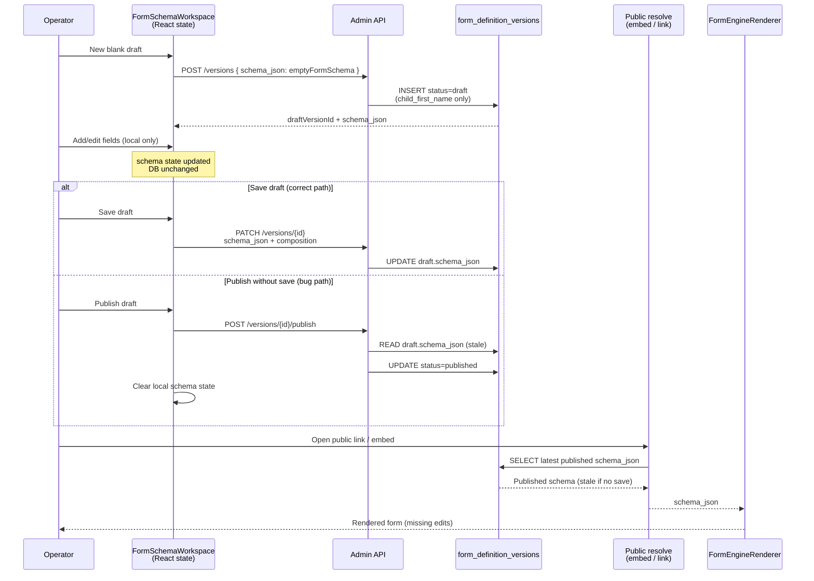

# Forms Authoring Stability Audit

**Date:** May 2026  
**Status:** Audit complete — **no implementation in this sprint**  
**Trigger:** First real-world **Website Inquiry Form** build after Forms MVP Productization surfaced multiple authoring, publish, and workspace issues.  
**Scope:** Root-cause analysis for seven user-reported issues + friction review for Use Case #1 (website inquiry / enrollment lead capture).

**Evidence base:** Code inspection only — `web/app/admin/forms/**`, `web/components/forms/**`, `web/lib/forms/**`, `web/lib/admin/forms/**`, `web/lib/public/forms/**`, `web/app/api/admin/forms/**`, `web/app/api/public/forms/**`, `web/scripts/resetFormsDemoData.ts`, `supabase/migrations/20260506100000_forms_engine_v1_foundation.sql`, active sprint docs.

---

## Executive summary

| # | Issue | Root cause (confirmed) | Severity |
|---|--------|------------------------|----------|
| 1 | Form content disappeared after publish | **Publish reads DB draft; does not save local React schema first.** Unsaved edits lost; published schema often = `emptyFormSchema` starter (one registry field). | **P0 — blocker** |
| 2 | Waiting on Families = 4 after reset | Count is **server-side**: draft submissions + in-progress packet sessions. Reset script is correct; count is **expected if `--confirm` not run** or **new intake activity after reset**. | P2 — investigate env |
| 3 | Kind / Category confusion | **Legacy schema fields** (`kind`: center/state; `admin_category` in metadata). **No meaningful runtime branching** in current code paths. Exposed at form creation. | P3 — UX |
| 4 | "New blank draft" language | Internal versioning term; **creates draft version with auto-seeded registry field** (`child_first_name`). | P2 — UX |
| 5 | Field inserts above previous | Code **appends** in all add paths; reverse order **not reproduced in code review**. Likely conflation with Issue 1/4 or multi-region composition — needs repro. | P3 — needs repro |
| 6 | Logo upload | **Placeholder only** (`pending:org-logo`); UI explicitly says upload ships later. | P3 — UX honesty |
| 7 | Open form before publish | **Share link can be minted without published version**; Open form uses stored embed URL; public resolve returns `NO_PUBLISHED_VERSION`. | P1 — workflow |

**Use Case #1 blockers:** Issues **1**, **7**, and parts of **3**, **4**, **6** (misleading surface). Issue **2** is environmental, not a counting bug.

---

## Issue 1 — Form content disappeared after publish (P0)

### User observation

New form → fields added manually → Publish → published/public form missing added fields; appeared to revert to default; public form showed one unintended field.

### Where state lives

| Layer | Storage | Mutability |
|-------|---------|------------|
| **Form identity** | `form_definitions` (org-scoped row: `key`, `name`, `kind`, `metadata`) | PATCH via admin API |
| **Draft schema** | `form_definition_versions` where `status = 'draft'` — column `schema_json` (JSONB) | PATCH `/versions/[versionId]` (draft only) |
| **Published schema** | Same table where `status = 'published'` — **immutable** except → `archived` | POST `/versions/[versionId]/publish` (draft → published) |
| **Authoring UI state** | React `useState` in `FormSchemaWorkspace` (`schema`, `draftVersionId`) | Local until explicit save |

There is **no autosave** in authoring. The only persistence path is **Save draft** (`saveDraft` → PATCH version).

Public runtime reads **published** `schema_json` only:

- `loadPublishedFormEnvelope` / `resolvePublicFormLinkByToken` → latest `form_definition_versions` with `status = 'published'` (or pinned published version on the link).
- `FormEngineRenderer` renders `schema_json` (with `document_composition` when present).

### How versions are created

1. **New blank draft** — `POST /api/admin/forms/[formId]/versions` with `schema_json: emptyFormSchema(formName)`.
2. **Clone from published** — same POST with `clone_from_version_id`.
3. `emptyFormSchema` (`web/lib/forms/adminFormSchemaBuilder.ts`) seeds **one field**: first entry in `OPERATIONAL_FORM_SYSTEM_FIELDS` → **`child_first_name`** (“Child first name”). This matches “one field we did not intentionally add” for a parent inquiry form.

### What happens on Publish

`FormSchemaWorkspace.publishDraft()`:

1. POST `/versions/[draftVersionId]/publish` — **no request body**, **no prior save**.
2. Server loads draft row from DB (`dbGetVersion`), validates `schema_json` **from DB**, calls `dbPublishVersion` (status flip only — schema unchanged).
3. On success: clears local `schema` and `draftVersionId`; shows publish success banner.

**Save draft** (`saveDraft`) is separate: PATCH with `patchSchemaComposition(schema, resolveDocumentComposition(schema))`.

### Root cause (confirmed)

**Publish does not flush local authoring state to the database.**

If the operator adds/edits fields and clicks **Publish draft** without **Save draft**:

- Published version = whatever was last persisted on the draft row (often just `emptyFormSchema` from “New blank draft”).
- All in-session edits are discarded when publish clears local state.
- Public embed resolves the published version → operator sees stale/minimal schema.

This is a **deterministic product bug**, not intermittent sync or race.

Secondary factors (same incident, lower weight):

- After publish, no draft remains until operator starts a new one — UI can feel like a “revert.”
- `document_composition` is merged on **save** only; unsaved composition drift is irrelevant to publish if publish never reads local state anyway.

### Autosave?

**No.** Authoring has explicit Save only. Public embed has draft autosave for **submissions**, not for admin schema (`FormEmbedClient` comment re submission drafts).

### Sequence diagram — Authoring → Save → Version → Publish → Runtime Read



### Recommended fix (Issue 1)

| Fix | Priority | Notes |
|-----|----------|-------|
| **Publish must save first** — `publishDraft` awaits `saveDraft()` (or single API that atomically saves+ publishes) | **Blocker** | Minimum viable fix |
| Disable Publish when local schema ≠ last saved snapshot (dirty flag) | Blocker | Prevents silent loss |
| Post-publish: offer “Edit as new draft” instead of clearing editor without explanation | Should-have | Reduces “revert” confusion |
| Website-inquiry template / starter without `child_first_name` | Should-have | Use Case #1 ergonomics |

---

## Issue 2 — Waiting on Families = 4 after reset (P2)

### User observation

After Forms data reset, intake hub still shows **Waiting on families = 4**.

### Where the count comes from (exact)

**Primary KPI** (`deriveIntakeCommandCenterSnapshot` in `web/lib/forms/intakeCommandCenterPresentation.ts`):

```text
waitingCount = lanes.drafts.length + inProgressSessions.length
```

**Breakdown** (`waitingOn` array):

| Bucket | Source |
|--------|--------|
| Draft submissions | `groupSubmissionsIntoInboxLanes` → lane `drafts` |
| Packets in progress | `form_packet_sessions` where `status === 'in_progress'` |
| Forms need publish | unpublished form definitions (shown in breakdown, not in main KPI) |

**Draft lane assignment** (`resolveSubmissionInboxLane`):

- `status === 'draft'` or `'void'` → drafts
- **Any status other than `'submitted'`** → drafts

**Waiting filter (IC-3 case view)** (`intakeWorkspaceFilters.ts`):

- Cases with `status_bucket === 'waiting'` (draft submissions not tied to in-progress packet) or `'packet_in_progress'`.

Intake cases are **derived from `form_submissions` rows** (+ packet session join), not from opportunities alone. Reset script does **not** delete opportunities/customers.

### Reset script coverage

`web/scripts/resetFormsDemoData.ts` deletes (org-scoped, FK-safe order):

`form_packet_session_items` → `form_packet_sessions` → `form_submissions` → documents → `form_public_links` → packet defs → **`form_definitions`** (versions cascade).

Does **not** delete: opportunities, persons, customers, workflow events.

### Is 4 expected?

| Scenario | Expected? |
|----------|-----------|
| Reset run **without** `--confirm` (dry-run only) | **Yes** — no rows deleted |
| Reset **with** `--confirm`, then **no new form activity** | **No** — count should be 0 |
| Reset confirmed, then operator **opened embed / started drafts / partial packet** during Website Inquiry testing | **Yes** — each in-progress draft submission or packet session increments count |
| Wrong org selected in script vs active admin org | **Yes** — appears as stale data |

### Is counting logic wrong?

**No.** Logic matches documented intent (“Drafts and in-progress packets”, hint on KPI). The hub is **submission/session-backed**, not “families waiting on operator action” in a CRM sense.

### Recommended fix (Issue 2)

| Fix | Priority |
|-----|----------|
| Verify reset used `--confirm` and correct `--org-id` | **Ops** (before code) |
| After destructive reset, show empty-state copy: “No families mid-intake” | Nice-to-have |
| Optional: reset script summary log of post-delete counts | Nice-to-have |
| Do **not** change counting to hide legitimate post-reset test drafts without operator consent | — |

---

## Issue 3 — Kind and Category confusion (P3)

### Where they originate

| Field | Storage | Creation UI |
|-------|---------|-------------|
| **Kind** | `form_definitions.kind` — DB `CHECK (kind IN ('center','state'))` | `FormsHubClient` create panel — select default `center` |
| **Category** | `form_definitions.metadata.admin_category` (optional string) | Free-text on same create panel |

From Forms Engine v1 foundation / childcare vertical seeding — distinguishes **center-operated** vs **state/regulatory** forms.

### What they affect today

Code search shows **`kind` is not used for branching** in validation, intake routing, PDF, or renderer logic within `web/lib/**`. It is:

- Stored on create/update (`POST/PATCH /api/admin/forms`)
- Returned on public resolve payload (`form.kind`) for client display/diagnostics

**Category** (`admin_category`) is written to metadata on create only; **no downstream reads** found in `web/`.

### Operational meaning for Website Inquiry

**None** for basic website lead capture. Defaults (`center`, empty category) are sufficient and invisible to families.

### Recommendation

| Action | Rationale |
|--------|-----------|
| **Hide Kind and Category from default create flow** | Move to Advanced / technical settings |
| Default `kind: 'center'` server-side when omitted | Removes decision at create time |
| Keep `kind` column for future state-compliance templates | Schema already exists |
| Rename or document Category as “Internal label (optional)” if kept | Currently unexplained |

---

## Issue 4 — "New blank draft" language (P2)

### Current behavior

When no draft exists, `FormSchemaWorkspace` shows:

- Copy: “Start a draft to add questions…”
- Button: **“New blank draft”** → `startBlankDraft()` → POST version with `emptyFormSchema(formName)`.

“Draft” here means **`form_definition_versions.status = 'draft'`**, not “unsaved file.” Operators reasonably read it as “empty form.”

### Intended workflow (as implemented)

1. Create form definition (hub)
2. Open form → start **version draft**
3. Edit questions → **Save draft**
4. **Publish draft** → immutable published version
5. Iterate via “New draft from published”

This is a **versioning** workflow, not a single-document autosave model.

### Recommended language

| Current | Suggested |
|---------|-----------|
| New blank draft | **Start building questions** or **Add questions** |
| Save draft | **Save** or **Save changes** |
| Publish draft | **Publish form** (with save-first guard) |
| Draft only (lifecycle badge) | **Not yet published** |

Add one-line helper: “Publishing makes this version live on your public link.”

---

## Issue 5 — Field ordering: new field inserts above previous (P3)

### Expected vs observed

User expects **append to end**. Reported: each new field appears **above** the previously added field.

### Code paths (all append)

| Path | Behavior | File |
|------|----------|------|
| Add question to section | Appends to `schema.fields`, `sections[0].field_ids`, and composition region `field_ids` | `DocumentCompositionEditor.addFieldToRegion` |
| Legacy add field hook | Appends to section `field_ids` | `useFormSchemaFieldAuthoring.addField` |
| Composition sync | Missing fields appended to **last** field region | `syncCompositionWithSchemaFields` |
| Public render | `block.field_ids` order in composition | `FormEngineRenderer` |

`moveFieldInRegion` / drag-style ↑↓ swap adjacent indices only — not invoked on add.

### Likely explanations (not confirmed by repro)

1. **Issue 1 artifact** — published form showed only starter field; editor still listed many local fields until refresh → felt like “wrong order / wrong content.”
2. **Unwanted starter field** — `child_first_name` stays first; new guardian fields append after but operator expected blank form or parent-first ordering.
3. **Multiple field regions** — field added to a region **above** another section in document composition (by design, but surprising).
4. **True bug** — not found in static review; needs recorded repro (browser, steps, screenshot).

### Recommendation

| Fix | Priority |
|-----|----------|
| Reproduce with QA script before code change | Required |
| If repro confirms: add regression test in `documentCompositionUsability.test.ts` | Blocker for that fix |
| Empty starter schema (zero fields) for “blank” form | Helps Use Case #1 |

---

## Issue 6 — Logo section (P3)

### Current state

- Default document composition includes an **image block** with `src: "pending:org-logo"` (`COMPOSITION_BRANDING_LOGO_SRC`).
- `DocumentCompositionBlockCard` shows: **“Upload and asset binding ship in a later pass.”**
- Preview renders a **“Logo” placeholder** — no upload control, no org asset binding, no storage integration.

### Is UI misleading?

**Partially.** Placeholder + explicit deferral message is honest for admins who expand the block, but:

- Default composition **always shows a logo region** in preview.
- “Add header / logo” suggests capability that does not exist.

### Recommendation

| Action | Priority |
|--------|----------|
| Hide logo block from default composition until upload exists | Should-have for Use Case #1 |
| Or replace with static text: “Your organization name appears here” | Alternative |
| Implement org-logo binding (documents/upload + composition `src`) | Later sprint |

---

## Issue 7 — Open / Test flow before publish (P1)

### User observation

Clicked **Open form** → error equivalent to form not published.

### Actual error

Public resolve (`resolvePublicFormLinkByToken`) when no published version:

```text
code: NO_PUBLISHED_VERSION
message: "No published form version is available for this link"
```

(`FormEmbedClient` displays `json.error` from resolve.)

### Why Open is available before publish

1. **Share link creation** (`POST /api/admin/forms/[formId]/public-links`) does **not** require a published version.
2. `FormDetailClient` / orchestration panel store `embed_url` in session storage (`writeLinkEmbedUrl`) when link is minted.
3. **Open form** renders whenever `embedUrl` is present — **no `hasPublished` gate** (`FormIntakeRuntimeOrchestrationPanel`).

Orchestration steps show Purpose active when published, but **Share** can complete (link minted) before publish — step ordering allows link before live schema.

**Preview** (`handlePreviewForm`) uses the same public embed route — also requires published version (preview link is still resolved via published schema).

### Recommended workflow

| State | Open / Test CTA |
|-------|-----------------|
| No published version | **Disabled** or **“Publish to preview”** — open admin-side draft preview route (future) |
| Published, link minted | **Open form** / **Test submission** enabled |
| Published, no link | **Create share link** primary |

Copy when disabled: “Publish your questions before families can open this link.”

---

## Use Case #1 — Website Inquiry Form UX review

**Goal:** Capture new enrollment lead with Parent first/last name, Email, Phone, Message.

### Minimum path today

1. Forms hub → Create form (Name, **Kind**, **Category**)
2. Form detail → Set operational intent (**Capture new enrollment lead**)
3. Schema workspace → **New blank draft** (gets **Child first name** automatically)
4. Add/map fields via system registry (**Guardian** first/last/email/phone — not labeled “Parent”)
5. Message → map to **Interest / tour notes** or custom unmapped field
6. **Save draft** (easy to skip)
7. Configure outcome on distribution link (auto-create opportunity, routing)
8. **Publish draft** (easy to skip save)
9. Create share link → Open form → test submit

### Friction and terminology leaks

| Friction | Why it hurts |
|----------|--------------|
| Publish without save (Issue 1) | Destroys Use Case #1 entirely |
| Open before publish (Issue 7) | Breaks test loop at step 9 |
| Kind / Category on create | No value for website inquiry |
| “New blank draft” + versioning language | Implies empty form; actually seeds child field |
| **Guardian** vs **Parent** in registry | Wrong mental model for website inquiry |
| System field picker vs plain “Add question” | Requires CRM entity knowledge |
| Document composition surface (sections, signature placeholder, footer boilerplate) | Overkill for simple 5-field form |
| Logo placeholder in preview | Looks broken |
| Separate intent + outcome + distribution panels | Three config layers before go-live |
| “Internal keys” / `field_source` / composition jargon | Implementation detail exposed |
| No autosave | High loss risk for non-technical operators |

### What would confuse a non-technical operator

- Draft vs published vs version
- Kind (center/state)
- Guardian entity type for parent contact info
- Why Save and Publish are both required
- Why Open form fails after getting a link
- Signature block and footer text on a simple inquiry form

---

## Severity ranking ( consolidated )

| Rank | ID | Issue | Severity |
|------|-----|-------|----------|
| 1 | 1 | Publish without save → stale published schema | **Critical / P0** |
| 2 | 7 | Open form enabled without published version | **High / P1** |
| 3 | 4 | “New blank draft” + auto-seeded child field | **Medium / P2** |
| 4 | 2 | Waiting count after reset (ops / expected data) | **Medium / P2** |
| 5 | 3 | Kind / Category exposed without purpose | **Low / P3** |
| 6 | 6 | Logo placeholder implies upload | **Low / P3** |
| 7 | 5 | Field insert order (unconfirmed in code) | **Low / P3** |

---

## Recommended fixes — blockers vs can wait

### Blockers for Use Case #1 (Website Inquiry)

1. **Save-before-publish** (or atomic publish-with-schema) — Issue 1  
2. **Gate Open/Test on `hasPublished`** with clear messaging — Issue 7  
3. **Empty starter schema** (no auto `child_first_name`) or enrollment-lead template with parent/guardian fields pre-mapped — Issues 1, 4  
4. **Hide Kind/Category** on default create — Issue 3  

### Should ship soon (same release, not strictly blocking if operators are coached)

5. Rename draft/publish buttons — Issue 4  
6. Remove or soften default logo/signature/footer blocks for simple forms — Issue 6  
7. Enrollment lead quick-start (intent + minimal fields + outcome defaults in one flow)  

### Can wait

8. Field ordering fix — pending repro — Issue 5  
9. Org logo upload + composition asset binding — Issue 6  
10. Post-reset hub empty-state / count explanation — Issue 2  
11. Admin draft preview route (view unsaved schema without publish)  
12. Persisted `kind`-driven behavior (state forms) — only when product needs it  

---

## Files inspected (blast radius for future fix sprint)

| Area | Paths |
|------|-------|
| Authoring UI | `web/app/admin/forms/FormSchemaWorkspace.tsx`, `web/components/forms/workspace/FormDocumentAuthoringShell.tsx`, `web/components/admin/forms/documentComposition/*` |
| Field authoring | `web/lib/forms/useFormSchemaFieldAuthoring.ts`, `web/lib/forms/adminFormSchemaBuilder.ts`, `web/lib/forms/documentCompositionAuthoring.ts` |
| Version API | `web/app/api/admin/forms/[formId]/versions/**` |
| DB helpers | `web/lib/admin/forms/formsAdminDb.ts` |
| Public runtime | `web/lib/public/forms/loadPublishedFormEnvelope.ts`, `resolvePublicFormLink.ts`, `web/app/forms/embed/[token]/FormEmbedClient.tsx` |
| Orchestration / lifecycle | `web/components/forms/admin/FormIntakeRuntimeOrchestrationPanel.tsx`, `web/app/admin/forms/[formId]/FormDetailClient.tsx`, `web/lib/forms/formLifecyclePresentation.ts` |
| Intake counts | `web/lib/forms/intakeCommandCenterPresentation.ts`, `web/lib/forms/intakeWorkspaceFilters.ts`, `web/lib/forms/submissionInboxPresentation.ts`, `web/lib/forms/intakeCasePresentation.ts` |
| Reset | `web/scripts/resetFormsDemoData.ts` |
| Create form | `web/app/admin/forms/FormsHubClient.tsx`, `web/app/api/admin/forms/route.ts` |

---

## Stop line

This document completes the **audit sprint**. No code changes are included. Implementation should follow: **Issue 1 → Issue 7 → Use Case #1 starter/template → UX polish (3, 4, 6)**.
