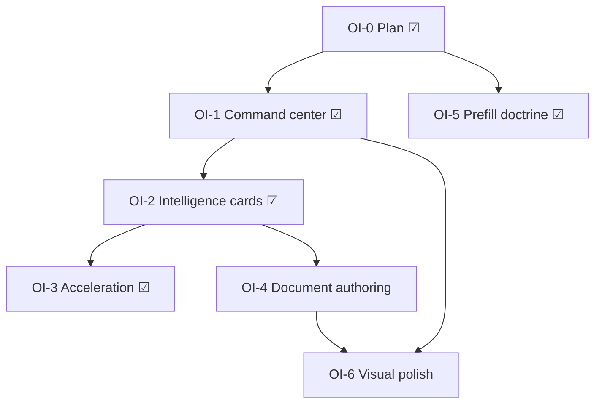

# Forms Operational Intelligence + Workflow Polish Sprint

**Status:** **OI-0 complete** · **OI-1 shipped** · **OI-2 shipped** · **OI-3 shipped** · **OI-4 shipped** · **OI-5 shipped** · **OI-6 ongoing**

**Prerequisites:** OW-0–OW-7 ☑ · PX-0–PX-2 ☑ · P2 review MVP ☑

**Sibling docs:**

| Doc | Role |
|-----|------|
| [`forms_operational_workspace_redesign.md`](./forms_operational_workspace_redesign.md) | OW shell, inbox, lifecycle, distribution |
| [`forms_documents_product_experience_refresh.md`](./forms_documents_product_experience_refresh.md) | PX visual tokens + surfaces |
| [`forms_documents_operational_experience_hardening.md`](./forms_documents_operational_experience_hardening.md) | Case-file + BOS interaction doctrine |
| [`../system/forms-intake-prefill-doctrine.md`](../system/forms-intake-prefill-doctrine.md) | Contextual prefill architecture (OI-5) |

---

## Problem

OW/PX structural alignment is done, but the module still feels:

- too equal-weight and dashboard-like
- too schema-editor oriented in the builder
- insufficiently operational and contextual

Operators should know **what needs action**, **what is blocked**, **what is waiting**, and **what is healthy** within ~3 seconds.

---

## Non-goals

| Out of scope | Notes |
|--------------|-------|
| New backend systems / CRUD routes | Presentation + deterministic derivation only |
| Migrations | None |
| AI / LLM enrichment | Deterministic BOS bridge only |
| Renderer rebuild | Document authoring = orchestration/presentation |
| Token/security semantic changes | Distribution + public link rules unchanged |

---

## Cards

### OI-0 — Planning ☑

This document. Sequencing OI-1 → OI-6.

---

### OI-1 — Intake workspace command center ☑

**Goal:** `/adminV2/forms` feels like workspace/dept command center — KPI strip, urgency hierarchy, asymmetric layout.

**Shipped:**

| Area | Detail |
|------|--------|
| Presentation | `intakeCommandCenterPresentation.ts` — KPI derivation, action queue, waiting-on states |
| KPI strip | `IntakeCommandCenterKpiStrip.tsx` |
| Hub layout | `IntakeWorkspaceHubView.tsx` — action queue hero, demoted management, collapsed form library |
| Data | `FormsHubClient.tsx` — submissions limit 100 for client-side metrics (existing list API) |

**Acceptance:**

- [x] KPI strip visible above fold
- [x] Review/action items prioritized over library browse
- [x] “Waiting on” vs “Needs action” distinguishable
- [x] No new APIs

---

### OI-2 — Submission intelligence cards ☑

**Goal:** Submissions inbox rows carry operational summary, readiness, linkage confidence, missing requirements.

**Shipped:**

| Area | Detail |
|------|--------|
| Derivation | `submissionIntelligencePresentation.ts` |
| UI | `SubmissionIntelligenceCard.tsx` — used by `SubmissionInboxRowView` |
| Tests | `submissionIntelligencePresentation.test.ts`, updated inbox workspace tests |

**Acceptance:**

- [x] Deterministic derivation only (no AI)
- [x] Readiness + linkage confidence visible per row
- [x] Missing requirements listed when blocked

---

### OI-3 — Workflow acceleration ☑

**Goal:** Faster triage — next-review CTA, ready-after framing, acceleration labels.

**Shipped:** Integrated into submission intelligence cards + command center action queue primary CTA.

**Acceptance:**

- [x] Primary acceleration CTA per submission row
- [x] “Ready after …” when blocked
- [x] Existing review/link/PDF routes unchanged

---

### OI-4 — Document-oriented form authoring ☑

**Goal:** Builder feels like designing intake documents, not editing a field table.

**Shipped:**

| Area | Detail |
|------|--------|
| Shell | `FormDocumentAuthoringShell.tsx` — document intro, branding placeholder, preview framing |
| Field cards | `FormFieldAuthoringCard.tsx` + `formFieldAuthoringPresentation.ts` — grouped question cards |
| Editor | `StructuredFormSchemaEditor.tsx` — table removed; document labels, empty state, collapsed technical IDs |
| Integration | `FormSchemaWorkspace.tsx` — shell wrap; save/publish unchanged |

#### OI-4B — Document-oriented field authoring cards ☑

**Acceptance:**

- [x] Field cards replace table rows on primary path
- [x] All edit controls preserved (label, help, required, layout, answer type, options, order, remove)
- [x] Mapped fields show “Prefills from: …” operator copy
- [x] Empty state: “Start by adding the first question”
- [x] No schema semantics or renderer changes

**Tests:** `formFieldAuthoringPresentation.test.ts`, `structuredFormSchemaEditor.test.tsx`

**Deploy note (May 2026):** Missing `import type { SystemFieldRegistryEntry }` in `FormFieldAuthoringCard.tsx` broke Vercel `tsc` — see **TypeScript: `import type` for props** in `.cursor/rules/alloy-development-guardrails.mdc` and `docs/execution/operating-doctrine.md`.

---

### OI-5 — Contextual intake / prefill doctrine ☑

**Goal:** Document deterministic prefill architecture aligned with BOS.

**Shipped:** [`docs/system/forms-intake-prefill-doctrine.md`](../system/forms-intake-prefill-doctrine.md)

**Acceptance:**

- [x] Precedence rules documented
- [x] Editable vs locked fields defined
- [x] AI enrichment boundaries stated
- [x] Aligns with existing `formContextMode` + link metadata

---

### OI-6 — Visual polish (ongoing)

**Goal:** Calm premium operational scanability — less clutter, better hierarchy, hover/selection.

**Tasks:** Apply across OI-1–OI-4 surfaces; continue PX-3+ badge grammar when touching chips.

**Acceptance:**

- [ ] Reduced duplicated explanatory copy on primary paths
- [ ] Row hover/selection improved on intelligence cards
- [ ] Button emphasis hierarchy consistent

---

## Sequencing



| Wave | Cards | Rationale |
|------|-------|-----------|
| **1** | OI-1 + OI-2 + OI-3 + OI-5 | Command center + intelligence bridge + doctrine |
| **2** | OI-4 | Document authoring presentation |
| **3** | OI-6 | Cross-surface polish pass |

---

## Verification

```bash
cd web && npm run test -- tests/forms/intakeCommandCenterPresentation.test.ts tests/forms/submissionIntelligencePresentation.test.ts tests/forms/intakeWorkspaceCommandCenter.test.tsx tests/forms/submissionsInboxWorkspace.test.tsx tests/forms/formFieldAuthoringPresentation.test.ts tests/forms/structuredFormSchemaEditor.test.tsx tests/forms/formDocumentAuthoringShell.test.tsx
cd web && npx tsc --noEmit  # touched paths
```
