# Demo / runtime cleanup — schema dependency audit

**Status:** Phase 1 audit (June 2026)  
**Scope:** Org-scoped **runtime / demo operational rows** tied to enrollment CRM entities.  
**Out of scope:** Platform configuration (auth, org settings, field/layout/status definitions, workflow definitions, business-process templates, org-owned schools/sites unless explicitly demo-tagged).

**Canonical scripts (this audit):**

| Phase | Artifact | Path |
|-------|----------|------|
| Dry-run (zero writes) | TypeScript | `web/scripts/demoRuntimeCleanupDryRun.ts` |
| Dry-run (zero writes) | SQL | `supabase/scripts/demo_runtime_cleanup_dry_run.sql` |
| Execute (transaction) | TypeScript | `web/scripts/demoRuntimeCleanupExecute.ts` |
| Execute (transaction) | SQL | `supabase/scripts/demo_runtime_cleanup_execute.sql` |
| One-record seed | TypeScript | `web/scripts/seedOneGoldenPathEnrollmentRecord.ts` |
| UI verification | Checklist | `docs/governance/demo-runtime-cleanup-qa-checklist.md` |

**Related prior art:** `web/scripts/resetStagingDemoData.ts`, `web/scripts/deleteDemoSeedFamily.ts`, `web/scripts/lib/stagingDemoMarkers.ts`.

---

## 1. Tenant scope

All cleanup predicates are **org-scoped**:

```sql
WHERE org_id = :target_org_id
```

**Environment variables (TypeScript):**

| Variable | Required | Purpose |
|----------|----------|---------|
| `DEMO_RESET_ORG_ID` | Yes | Target tenant UUID |
| `SUPABASE_SERVICE_ROLE_KEY` | Yes | Service-role client (server-only) |
| `DEMO_SEED_PACKAGE` | No | Narrow to one `metadata.demo_seed_package` |
| `DEMO_SEED_RUN_ID` | No | Narrow to one `metadata.demo_seed_run_id` |
| `DEMO_SEED_FAMILY_KEY` | No | Narrow to one `metadata.demo_seed_family_key` |

**Default demo markers** (when no narrow filter is set) match `web/scripts/lib/demoRuntimeCleanupScope.ts`:

- `metadata.is_demo_data = true`
- `metadata.seed_source = staging_demo_reset`
- Known `metadata.demo_seed_package` values (legacy + golden-path packages)
- `metadata.seed_key` prefixes: `childcare_realistic%`, `enroll_demo%`, `golden_path%`, `dept_seed%`

**FK expansion:** Rows linked to demo opportunities (or demo customers/persons discovered via metadata) are included even when their own `metadata` is empty — e.g. `operational_tasks.entity_id`, `communication_threads.primary_entity_id`.

**Protected tables (never deleted by these scripts):**

`orgs`, `users`, `auth.*`, `user_roles`, `role_definitions`, `user_access_profiles`, `field_definitions`, `field_sections`, `option_sets`, `option_set_items`, `status_definitions`, `record_layouts`, `record_drawer_layouts`, `record_actions`, `action_definitions`, `action_placements`, `workflow_definitions`, `workflow_actions`, `form_definitions`, `form_definition_versions`, `form_packet_definitions`, `form_packet_items`, `form_public_links` (config links), `communication_provider_bindings`, `pipelines`, `pipeline_stages`, `verticals`, `permission_definitions`, `business_process` / lifecycle builder config on `departments` (only demo-tagged **seed** departments are removable).

**Work units / queues:** `work_units` and `departments` are **configuration** for normal orgs. Scripts only delete rows **explicitly demo-tagged** in metadata. Queue **preview rows are not stored** — deleting opportunities removes them from workspace queues automatically when `work_unit_id` + `status_key` match lane predicates.

---

## 2. Anchor entities (deletion roots)

| Anchor | Table | Demo identification |
|--------|-------|---------------------|
| Case / lead | `opportunities` | Metadata markers + FK hub |
| Household | `customers` | Metadata markers + `opportunities.customer_id` |
| Identity | `persons` | Metadata markers + joins |
| Child roster row | `customer_members` | Metadata markers + OCM joins |
| Child-on-case link | `opportunity_customer_members` | FK to demo `opportunity_id` |

---

## 3. Dependency map (parent → child)

Legend: **C** = `ON DELETE CASCADE`, **S** = `ON DELETE SET NULL`, **R** = `ON DELETE RESTRICT`, **—** = no FK / polymorphic.

```mermaid
flowchart TD
  subgraph config["Config (DO NOT DELETE)"]
    WU[work_units]
    FD[field_definitions]
    FDef[form_definitions]
  end

  subgraph identity["Layer 2 — Identity"]
    CUST[customers]
    PERS[persons]
    CP[customer_persons]
    CM[customer_members]
    PR[person_relationships]
    PL[person_locations]
  end

  subgraph cases["Layer 3 — Cases"]
    OPP[opportunities]
    OCM[opportunity_customer_members]
    OP[opportunity_persons]
    OT[opportunity_tags]
    PC[placement_candidates]
    PLG[placement_link_groups]
    TB[tour_bookings]
    TPL[tour_public_booking_links]
    Q[quotes]
  end

  subgraph activity["Layer 4 — Activity"]
    CT[communication_threads]
    CMsg[communication_messages]
    CMR[communication_message_reads]
    CSS[communication_scheduled_sends]
    OTsk[operational_tasks]
    TAP[task_assist_proposals]
    MSG[messages legacy]
    FS[form_submissions]
    FSD[form_submission_documents]
    DOC[documents]
    FV[field_values]
    JOB[jobs]
    SCH[schedules]
    WF[workflow_events / runs]
  end

  OPP -->|C| OCM
  OPP -->|C| OP
  OPP -->|C| OT
  OPP -->|C| PC
  OPP -->|C| PLG
  OPP -->|C| TB
  OPP -->|C| TPL
  OPP -->|C| Q
  OPP -->|C| OTsk
  OPP -->|C| TAP
  OPP -->|C| CSS
  OPP -->|S| MSG
  OPP -->|S| FS
  OPP -->|S| JOB
  OPP -->|S| FV

  CUST -->|C| CP
  CUST -->|C| CM
  CM -->|C| OCM
  PERS -->|C| CP
  PERS -->|C| PR
  PERS -->|C| PL
  PERS -->|R| CSS

  CT -->|C| CMsg
  CMsg -->|C| CMR
  FS -->|C| FSD
  DOC -->|C| FSD
  JOB -->|C| SCH

  WU -.->|FK only| OPP
  FD -.->|FK only| FV
  FDef -.->|RESTRICT| FS
```



---

## 4. Table inventory — FK to runtime anchors

### 4.1 Opportunity-linked (explicit FK)

| Table | FK column | Parent | ON DELETE | Explicit delete? |
|-------|-----------|--------|-----------|------------------|
| `opportunity_customer_members` | `opportunity_id` | `opportunities` | **CASCADE** | Optional (CASCADE on opp delete) |
| `opportunity_persons` | `opportunity_id` | `opportunities` | **CASCADE** | Optional |
| `opportunity_tags` | `opportunity_id` | `opportunities` | **CASCADE** | Optional |
| `placement_candidates` | `opportunity_id` | `opportunities` | **CASCADE** | Optional |
| `placement_link_groups` | `opportunity_id` | `opportunities` | **CASCADE** | Optional |
| `quotes` | `opportunity_id` | `opportunities` | **CASCADE** | Optional |
| `tour_bookings` | `opportunity_id` | `opportunities` | **CASCADE** | Optional |
| `tour_public_booking_links` | `opportunity_id` | `opportunities` | **CASCADE** | Optional |
| `operational_tasks` | `entity_id` | `opportunities` | **CASCADE** | Optional |
| `task_assist_proposals` | `entity_id` | `opportunities` | **CASCADE** | Optional |
| `communication_scheduled_sends` | `entity_id` | `opportunities` | **CASCADE** | **Yes** (before persons — see below) |
| `discount_applications` | `opportunity_id` | `opportunities` | **SET NULL** | **Yes** (orphan prevention) |
| `discount_redemptions` | `opportunity_id` | `opportunities` | **—** (no action) | **Yes** (blocks nothing but leaves orphans) |
| `form_submissions` | `opportunity_id` | `opportunities` | **SET NULL** | **Yes** (runtime cleanup) |
| `messages` | `opportunity_id` | `opportunities` | **SET NULL** | **Yes** |
| `jobs` | `opportunity_id` | `opportunities` | **SET NULL** | **Yes** (delete jobs explicitly) |

### 4.2 Person-linked

| Table | FK column | Parent | ON DELETE | Notes |
|-------|-----------|--------|-----------|-------|
| `customer_persons` | `person_id` | `persons` | **CASCADE** | |
| `opportunity_persons` | `person_id` | `persons` | **CASCADE** | |
| `person_relationships` | `from_person_id` / `to_person_id` | `persons` | **CASCADE** | |
| `person_locations` | `person_id` | `persons` | **CASCADE** | |
| `contacts` | `person_id` | `persons` | **SET NULL** | Legacy |
| `customer_members` | `person_id` | `persons` | **SET NULL** | Delete members before persons |
| `opportunities` | `primary_person_id` | `persons` | **SET NULL** | Delete opps before persons |
| `placement_candidates` | `person_id` | `persons` | **SET NULL** | |
| `tour_bookings` | `primary_person_id` | `persons` | **SET NULL** | |
| `form_submissions` | `person_id` | `persons` | **SET NULL** | |
| `jobs` | `primary_person_id` | `persons` | **SET NULL** | |
| `communication_scheduled_sends` | `recipient_person_id` | `persons` | **RESTRICT** | **Must delete before persons** |

### 4.3 Customer / customer_member-linked

| Table | FK column | Parent | ON DELETE | Notes |
|-------|-----------|--------|-----------|-------|
| `customer_persons` | `customer_id` | `customers` | **CASCADE** | |
| `customer_members` | `customer_id` | `customers` | **CASCADE** | |
| `customer_tags` | `customer_id` | `customers` | **CASCADE** | |
| `customer_subscriptions` | `customer_id` | `customers` | **CASCADE** | |
| `customer_payment_methods` | `customer_id` | `customers` | **—** | Explicit delete |
| `customer_member_contacts` | `customer_id` / `customer_member_id` | `customers` / `customer_members` | **CASCADE** | |
| `opportunity_customer_members` | `customer_member_id` | `customer_members` | **CASCADE** | |
| `placement_candidates` | `customer_id` / `customer_member_id` | `customers` / `customer_members` | **SET NULL** | |
| `form_submissions` | `customer_id` / `customer_member_id` | `customers` / `customer_members` | **SET NULL** | |
| `jobs` | `customer_id` | `customers` | **RESTRICT** | **Delete jobs before customers** |
| `payments` | `customer_id` | `customers` | **RESTRICT** | Delete before customers |
| `locations` | `customer_id` | `customers` | **CASCADE** | Only demo-tagged runtime locations |

### 4.4 Communications (v2)

| Table | Link | ON DELETE | Notes |
|-------|------|-----------|-------|
| `communication_threads` | `primary_entity_type` + `primary_entity_id` (polymorphic) | — | No FK to opportunities; filter by demo opp ids |
| `communication_messages` | `thread_id` → `communication_threads` | **CASCADE** | Deleted with thread |
| `communication_message_reads` | `message_id` → `communication_messages` | **CASCADE** | |
| `communication_scheduled_sends` | `entity_id` → `opportunities` | **CASCADE** | Also **RESTRICT** on `recipient_person_id` |

### 4.5 Forms & documents (runtime instances only)

| Table | Link | ON DELETE | Notes |
|-------|------|-----------|-------|
| `form_submissions` | `opportunity_id`, `person_id`, `customer_id` | SET NULL | **Do not** delete `form_definitions` |
| `form_submission_documents` | `form_submission_id` | **CASCADE** | |
| `form_submission_signatures` | `form_submission_id` | **CASCADE** | |
| `form_packet_session_items` | `form_submission_id` | **SET NULL** | Delete sessions first |
| `form_packet_sessions` | metadata / submission graph | — | Runtime sessions only |
| `documents` | `entity_type` + `entity_id` (polymorphic) | — | Runtime uploads; not config |
| `document_versions` | `document_id` | **CASCADE** | |
| `document_field_values` | `document_id` | **CASCADE** | |

### 4.6 Polymorphic field values

| Table | Link | Notes |
|-------|------|-------|
| `field_values` | `entity_type` + `entity_id` | Delete for `opportunity`, `person`, `customer`, `location` demo ids. **Do not** delete `field_definitions`. |

### 4.7 Jobs / scheduling / workflow runtime

| Table | Link | Notes |
|-------|------|-------|
| `jobs` | `opportunity_id`, `customer_id` | RESTRICT on customer |
| `schedules` | `job_id` | Delete before jobs |
| `assignments` | `job_id` | |
| `payments` | `job_id`, `customer_id` | |
| `schedule_tags` | `schedule_id` | |
| `discount_redemptions` | `opportunity_id`, `job_id` | |
| `workflow_events` | `entity_id` (polymorphic) | Demo opp/customer/job ids |
| `workflow_runs` | `event_id` | |
| `workflow_action_runs` | `workflow_run_id` | |
| `messages_outbox` | `workflow_run_id` | |
| `action_links` | `entity_id` | Polymorphic |

### 4.8 Placement subgraph

| Table | Parent | ON DELETE |
|-------|--------|-----------|
| `placement_link_group_members` | `placement_candidate_id` | **CASCADE** |
| `placement_overrides` | `placement_candidate_id` | **CASCADE** |
| `placement_candidates` | `opportunity_id` | **CASCADE** |

---

## 5. Recommended deletion order

Delete **children before parents**. Order used by cleanup scripts:

1. `communication_message_reads` (via messages — optional explicit)
2. `communication_messages` (by demo thread ids)
3. `communication_scheduled_sends` (by demo opp ids — **before persons**)
4. `communication_threads` (by demo opp `primary_entity_id`)
5. `task_assist_proposals` (by demo opp ids)
6. `operational_tasks` (by demo opp ids)
7. `placement_overrides` → `placement_link_group_members` → `placement_link_groups` → `placement_candidates`
8. `tour_public_booking_links` → `tour_bookings`
9. `opportunity_tags` → `opportunity_persons` → `opportunity_customer_members`
10. `quotes`, `discount_redemptions`, `discount_applications`
11. `messages` (legacy), `messages_outbox`, `workflow_action_runs`, `workflow_runs`, `workflow_events`
12. `action_links`
13. `schedule_tags` → `payments` → `assignments` → `schedules` → `jobs`
14. `form_packet_session_items` → `form_packet_sessions`
15. `form_submission_signatures` → `form_submission_documents` → `form_submissions`
16. `document_field_values` → `document_versions` → `documents` (runtime)
17. `field_values` (demo entity ids)
18. `opportunities`
19. `customer_member_contacts` → `customer_tags` → `customer_subscriptions` → `customer_payment_methods`
20. `customer_members` → `customer_persons` → `contacts`
21. `person_locations` → `person_relationships`
22. `customers`
23. `persons`
24. `locations` (demo-tagged only, leaf-first)
25. `work_units` / `departments` (**demo-tagged seed rows only**)

---

## 6. CASCADE vs explicit delete summary

| Situation | Strategy |
|-----------|----------|
| Child has **CASCADE** to parent being deleted | Explicit child delete optional; CASCADE handles it when parent goes |
| Child has **SET NULL** | **Explicit delete** recommended (avoids orphan runtime rows) |
| Child has **RESTRICT** | **Explicit delete required** before parent (`communication_scheduled_sends`, `jobs`, `payments`) |
| Polymorphic link (no FK) | **Explicit filter** on `entity_type` + `entity_id` or metadata |
| Config parent (`form_definitions`) | **Never delete**; delete runtime `form_submissions` only |

---

## 7. Org ID confirmation

Before any execute:

1. `SELECT id, name FROM orgs WHERE id = :org_id;`
2. Run dry-run and confirm counts match expectation.
3. Verify no production guard: scripts refuse `VERCEL_ENV=production`.
4. For narrow deletes, prefer `--run-id` / `--family-key` / `DEMO_SEED_PACKAGE` over org-wide demo wipe.

---

## 8. Gaps in legacy `resetStagingDemoData.ts`

The older reset script does **not** yet count/delete:

- `communication_threads` / `communication_messages`
- `operational_tasks` / `task_assist_proposals` / `communication_scheduled_sends`
- `placement_candidates` / `placement_link_groups` / `placement_overrides`
- `tour_bookings` / `tour_public_booking_links`
- `form_submissions` and runtime form packet sessions
- `field_values` on demo entities

Use **`demoRuntimeCleanupDryRun.ts`** / **`demo_runtime_cleanup_*.sql`** for the comprehensive path documented here.
