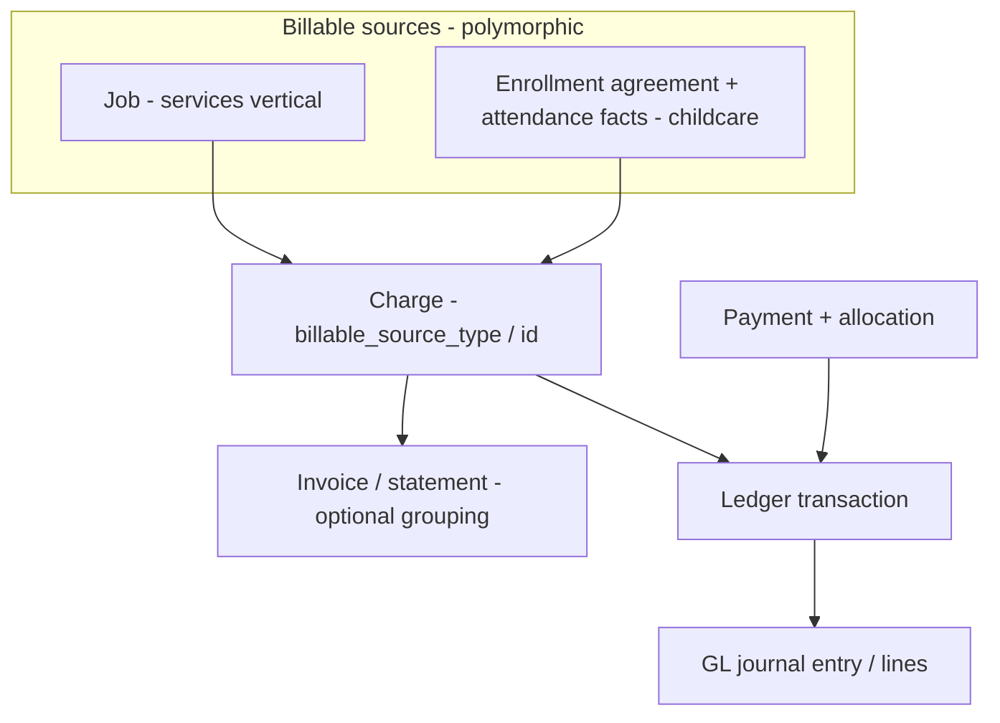

# Billing and financials platform

**Status:** Canonical module doctrine (June 2026). Defines how **Operational Consequences (L5)** — charges, invoices, payments, ledger, GL — derive from operational facts, and locks the decision to **generalize billing before building childcare billing**. **The five P3.1 implementation gates are ratified and built, P3.2 rate configuration + Rate Resolution is built, and P3.3 draft Charge Resolution + a minimum responsibility shape + a read-only preview API (P3.3.1) are built (June 2026)** — see "P3.3 as-built", "P3.2 as-built", "Ratified P3.1 implementation gates", and "P3.1 as-built" below. Charge posting and **payment application** are built (September 2026) — see "Household parity + actor attribution as-built", "Correction lineage" and "Payment application" below. Invoices/statements, AR, ledger/GL writes on the childcare path, split/subsidy responsibility, cadence/proration, autopay, dunning and subsidy remain deferred.

> **Layer:** Billing is **L5 Operational Consequences** in [`../core/operational-truth-flow-doctrine.md`](../core/operational-truth-flow-doctrine.md). It derives from **L4 Operational Facts** (attendance, delivered service), targets **L3 Projections** (expected tuition/revenue) for variance, and reads **L1 Configuration** (rate rules). It never derives directly from enrollment/intent.

> **Companion (current state, supplemental):** [`../../archive/2026-06-product/billing-and-financials.md`](../../archive/2026-06-product/billing-and-financials.md) documents the billing/payments/GL stack **as wired today**. This doc is the forward platform doctrine. Where they differ, this doc is the canonical direction and the supplemental is the as-built record.

> **Commercial Model as-built (June 2026):** **Slice A** promoted **Service** to the first-class `financial_services` table (+ `childcare_rate_plans.service_id`); **Slice B** added **Charge Templates** (`financial_charge_templates`, `20260703120000`); **Slice C** added **Financial Policies** (`financial_policies`, `20260704120000`) — scoped (org/location/service/rate_plan), effective-dated, most-specific-wins — and kept **Charge Categories** code-owned (surfaced as reference under Accounting). **Slice D** promoted the **Charge lifecycle** (`charges` additive columns `occurs_on`/`billable_on`/`charge_template_id`/`service_id`, `20260705120000`) and wired **template-driven draft Charge Resolution** — a configured Charge Template resolves into an idempotent draft/scheduled charge (consuming Services, Templates, and the posting-review Policy), testable via a Charge Template Simulator. A/B/C are configuration; D produces **non-authoritative drafts** (recomputable, no AR/ledger/invoices). Posting, Payments, and Subsidy remain deferred and authoritative-write-only.

> **Canonical domain (frozen):** [`financial-platform-domain.md`](./financial-platform-domain.md) defines the **first-class financial entities** of the Alloy platform — Service, Rate Plan/Rule, Charge Template, Charge (the lifecycle spine), Charge Event (trigger fact), Agreement, Responsibility, Third-Party Payer/Coverage/Claim, Posting Run, Invoice, Payment, GL, Accounting/Billing/Settlement periods — their ownership, runtime, and configuration hierarchy. This billing doc governs *how L5 posting behaves*; the domain doc governs *what the entities are* and is canonical upstream. Key frozen laws it locks: **Service is first-class** (the `org_settings` services catalog is interim); **Posting is the only authoritative money write**; **Resolution is recomputable**; **Third-Party Payer generalizes subsidy**; **financial periods are independent and may diverge**.

---


## Billing does not own tuition resolution

Tuition is **program pricing resolved as enrollment pricing**. Commercial Configuration authors the
options, Commercial Execution decides which apply to an assignment and recommends one, and
Enrollment records the operator's decision as an effective-dated `enrollment_pricing_terms` row on
`opportunity_customer_members` — the assignment, which exists before any enrollment agreement does.

Billing's role begins **after** that. Charge generation reads accepted terms through
`readAcceptedPricingTerms` and turns them into obligations; it does not re-resolve a price, and no
Financials surface authors one. The Financials card owns financial truth and financial actions —
what is owed, what was paid, Add Charge — and owns no part of what tuition should be. Built in
September 2026 — see *Charge generation from accepted pricing terms* below.

**The stable downstream read.** An accepted term carries everything an obligation needs and nothing
that IS one: the assignment and child, the enrollment agreement once it exists, amount and currency,
billing cadence, effective start and end, the authored source option and config version, the payer
type, whether it was accepted or overridden, the recommendation it departed from, and the reason.
Accepting a price creates no charge, no invoice and no schedule.


## The problem this doctrine fixes

Today's billing stack is welded to the cleaning/services (jobs) vertical:

- `charges.job_id` is **NOT NULL** — every receivable charge requires a job.
- `gl_journal_lines` and `ledger_transactions` reference `job_id`.
- There is **no `invoices` table** (referenced only in CHECK constraints as a "ghost" entity type).
- Pricing tables (`pricing_*`, `service_pricing_rules`) are job/service-vertical oriented.

Childcare billing must derive from the **committed enrollment foundation** and **attendance facts** — not from jobs. Two paths were considered: (a) build a parallel childcare billing model, or (b) generalize the existing stack first. **Decision: generalize first.** A parallel model becomes permanent debt and creates two competing notions of money, ledger, and GL.

---

## Ratified decision: generalize before childcare billing

**No childcare billing is built until the financial core is generalized off `job_id`.**

The generalization introduces a **billable source** (financial-responsibility) abstraction so that charges, ledger transactions, and GL lines can reference *what is being billed for* polymorphically, of which a `job` is one kind and an **enrollment agreement (with attendance/schedule facts)** is another.



### Generalization principles

1. **Billable source is polymorphic, not job-anchored.** Charges (and the ledger/GL rows derived from them) reference a billable source by `{type, id}`. `job` and `enrollment_agreement` are two source kinds; neither is privileged in the schema. `charges.job_id NOT NULL` is relaxed to a nullable, with the polymorphic reference as the canonical link.
2. **Charges derive from operational facts.** A childcare charge is created from an attendance fact (or a delivered scheduled service) against an agreement — never from the act of enrolling. Enrollment creates a commitment (L2); a fact (L4) creates the billable event; the charge (L5) derives from the fact. See [`./attendance-system.md`](./attendance-system.md).
3. **Rate resolution reads L1 rules.** Charge amounts resolve from first-class **rate rules** (L1 config), not from job pricing tables and not from JSON. Tuition is not modeled as a program type.
4. **One ledger, one GL.** There is a single `ledger_transactions` / `gl_*` stack for the org. Childcare does not get a second ledger; GL lines gain enrollment/agreement dimensions rather than being tied to `job_id`.
5. **Immutability + audit.** Financial consequences are append-oriented and auditable. Corrections follow the same effective-dated discipline as facts (reversals/credit notes are new entries, not in-place edits). Money is never computed only in the browser; financial side effects run server-side with org scoping and audit trails.
6. **Events drive posting.** Charge creation and posting flow through the event/workflow spine (`emitEvent` → `workflow_events` → `workflowRun`), consistent with [`./actions-and-workflows.md`](./actions-and-workflows.md).

---

## Expected vs actual revenue (L3 ↔ L5)

- **Expected tuition / subsidy / revenue** are **L3 derived** projections of commitments and rate rules — never stored as authoritative rows. See [`../core/operational-truth-flow-doctrine.md`](../core/operational-truth-flow-doctrine.md) (L3).
- **Actual revenue** is the L5 consequence derived from facts.
- Variance (expected vs actual) is an observational read model over L3 and L5; BOS may explain balances and predict delinquency, **proposing**; humans approve.

---

## Childcare boundary

- Childcare billing references the **committed enrollment foundation** (`child_enrollment_agreements`, `child_placements`, `schedule_assignments`) and **attendance facts** — never the OCM proposal alone, never `opportunities.location_id`.
- **Do not** wrap an enrolled child in a `job` to reuse job billing.
- **Do not** introduce a parallel childcare ledger/GL or a second charges model.
- Per [`../../archive/2026-06-runtime-convergence/child_namespace_decision.md`](../../archive/2026-06-runtime-convergence/child_namespace_decision.md) §6, billing data lives on its **own** billing/charge participation entity via a **billing-child context**; never extend `inquiry_child`.

---

## Sequencing (not built in this pass)

Recorded for the phased plan; no schema/runtime here:

1. Generalize the financial core (billable source on charges/ledger/GL; relax `job_id`; introduce invoice/statement grouping if needed).
2. First-class **rate rules** (L1) as the charge-amount source.
3. Childcare charges derived from attendance facts against agreements.
4. Statements / AR aging and customer balance as derived/projected surfaces.

---

## Ratified P3.1 implementation gates (June 2026)

These five decisions are **locked**. They gate **P3.1 — generalize the financial core** (the migration that makes childcare a first-class billable source). They constrain the *posting substrate* (`charges`, `ledger_transactions`, `gl_journal_lines`); everything above the substrate stays deferred (see "Explicitly deferred" below). Full rationale, alternatives, migration/back-compat analysis, and decision language: `../../sprints/archive/06_2026/operational_execution_p3_financial_resolution_planning.md` (historical: `../../sprints/archive/06_2026/operational_execution_p3_financial_resolution_planning.md`) §11.

**Hard rule across all five: no job-vertical regression.** Each gate is additive (nullable columns) or scoped to the childcare path; existing job-billing schema, RLS, and write flows are unchanged in P3.1. A job-vertical cutover (immutability, RLS tightening) is a separate, later, explicit decision — never an accidental side effect.

1. **Additive `charge_category` taxonomy.** Add a nullable `charge_category` with its own CHECK vocabulary (`tuition, deposit, consumable_fee, late_pickup, one_time, discount, credit, adjustment, subsidy_offset`) as the canonical financial taxonomy. The legacy `charge_type` and its `{service, fee, adjustment}` CHECK are **frozen for compatibility** — not expanded. Childcare charges set `charge_category` (plus a compatible `charge_type` for legacy readers).

2. **Childcare posted-charge immutability.** `draft`/unposted charge *intents* may be recalculated or replaced freely. A **`posted` childcare charge is never updated in place.** Post-posting corrections are **new rows linked by `source_charge_id`** — reversal, credit, or replacement charge. Enforced by a status-scoped guard for `billable_source_type='enrollment_agreement'`; the job vertical's existing mutability is unchanged.

3. **Childcare financial write posture (server-side + role-gated).** All childcare financial writes are **server-side only** and gated by `has_org_role(org_id, ARRAY['owner','admin','ops','manager'])`, aligning with the P1/P2 posture. **No broad `authenticated` client writes for money**; money is never computed in the browser. New childcare financial tables use org SELECT / role INSERT / `service_role` ALL / no UPDATE-DELETE grants. Existing job `charges` policies are unchanged in P3.1.

4. **Generic billable-source dimension on ledger/GL.** Add a generic, nullable `billable_source_type` / `billable_source_id` dimension to `ledger_transactions` and `gl_journal_lines` (both already allow null `job_id`). This supports `job` and `enrollment_agreement` sources in **one ledger, one GL** — no second ledger, no childcare-specific FK. GL account mappings (tuition/subsidy/deposit) are reserved for a later sub-phase.

5. **Currency posture.** **Single currency per org** for P3. Rate plans carry an explicit `currency_code` (default = org currency) from day one so multi-currency is not blocked by a future breaking change; cross-currency composition is a validation error. No FX/conversion in P3.

### Explicitly deferred (NOT part of P3.1)

- **Invoices / statement grouping** — charges remain the receivable unit; a statement grouping (if needed) and any first-class `invoices` entity are deferred (P3.6 / product policy).
- **Subsidy** — Processing-owned intake, authorization storage, claims, and settlement are deferred. P3 ships only a `SubsidyAuthorization` consumption interface. **Expected subsidy is L3-derived and is never booked as AR before a claim/posting.**
- **Deposits modeling** (held-liability GL + recognition) and **cadence / proration policy** are deferred to their sub-phases (P3.6 / P3.4). **Minimum responsibility** (default household/account payer) ships in P3.3; **split / subsidy / guardian-specific responsibility** and any first-class `service_agreement` / `responsibility_party` table remain deferred.

### Stage separation reaffirmed

**Posting is separate from Financial Resolution.** Rate Resolution (what pricing applies) → Charge Resolution (what becomes a charge) → Financial Resolution (who owes what) are derived/recomputable; **Posting** (immutable charges, statements, claims, payments, ledger, GL) is the only stage that writes authoritative financial truth. These do not collapse into "billing logic."

**What feeds Charge Resolution at runtime is Operational Consumption.** The interpretation step — *given an operational fact, what commercial meaning should exist?* — is its own layer with its own runtime objects (**Consumption Event** → **Resolved Obligation**), sitting at the L4 → L5 boundary. It **consumes** the resolver below it (it does not reimplement pricing) and writes only draft objects; the trigger fact stays in `workflow_events`. See [`./operational-consumption-platform.md`](./operational-consumption-platform.md). Posting remains the separate, only authoritative write.

### P3.2 as-built (June 2026 — rate config + Rate Resolution)

Migration `supabase/migrations/20260701120000_childcare_rate_plans_p3_2.sql` adds **pricing configuration (L1)** above the P3.1 substrate, plus a **pure Rate Resolution read model**. **Rate Resolution is not Charge Resolution** — it selects which plan/rule applies; it computes no charge, writes no `charges`/ledger/GL, and creates no AR/invoice/subsidy.

- **`childcare_rate_plans`** — scoped (`org → site → program → room`, reusing `validate_childcare_config_scope`), age-group-narrowable, effective-dated container. Carries explicit `currency_code` (default `USD`), `billing_basis` (`annual|monthly|weekly|daily|session|hourly`), `calculation_strategy` (`scheduled|attendance_actual|hybrid|fixed`), `is_active`, and **hook-only** nullable `proration_method` / `billing_cadence` (reserved vocab, not implemented).
- **`childcare_rate_rules`** — priced lines within a plan, keyed by `schedule_basis` (`full_day|half_day|three_day|four_day|five_day|hourly|drop_in`) and expressed in a `rate_basis` (same vocab as billing basis), age-group-narrowable, effective-dated, `amount_cents >= 0`. **Currency is inherited from the parent plan** (no per-rule currency) so a plan can never mix currencies. A trigger enforces `org_id` matches the parent plan.
- **RLS:** config posture identical to the P1 rule tables (org SELECT for owner/admin/ops/manager; INSERT/UPDATE for owner/admin/ops; DELETE for owner/admin; `service_role` ALL).
- **Resolution precedence:** plan = most-specific scope wins → age-group-specific → latest `effective_start` (delegated to the shared config resolver); rule = `schedule_basis` match → age-group-specific → latest `effective_start`.

Code surface (all pure / read-only): `web/lib/financials/rates/rateTypes.ts` (vocab + row shapes), `web/lib/financials/rates/resolveRate.ts` (`resolveRatePlan` / `resolveRateRule` / `resolveRate`), `web/lib/financials/rates/rateConfigService.ts` (org-scoped fetchers + `fetchResolvedRate`). No charge generation, no posting, no UI.

---

### P3.3 as-built (June 2026 — draft Charge Resolution + minimum responsibility)

**Charge Resolution** turns committed enrollment/schedule intent + a resolved rate (P3.2) into **draft childcare charges** through the P3.1 service. It is the first slice of Financial Resolution: it computes amounts but is **not Posting** — it only ever writes `status='draft'` rows and never mutates a posted charge. **No new migration:** P3.3 adds no schema; it composes existing substrate (`charges.metadata`, `charge_category='tuition'`, `billable_source_*`, `currency_code`, `service_date`) and the existing committed-enrollment relationships.

- **Schedule basis resolution** (`web/lib/financials/chargeResolution/scheduleBasis.ts`, pure): maps a committed `schedule_pattern` to a P3.2 `schedule_basis`. Precedence: per-pattern override → `pattern.metadata.schedule_basis` → known `schedule_type_key` defaults (`full_time→full_day`, `half_day`, `hourly`, `drop_in`, `three/four/five_day`) → weekday-count fallback (3/4/5 days). Qualitative bases (full/half/hourly/drop_in) are never fabricated from a day count alone; unclassifiable → `null` (clear "no basis" state).
- **Billable quantity** (`web/lib/financials/chargeResolution/billableQuantity.ts`, pure): `monthly|annual|weekly` = flat 1 unit/period (no proration in P3.3); `daily|session` scheduled = scheduled days in period, `attendance_actual` = attended days (from P2 facts), `hybrid` = scheduled-days fallback flagged `calculation_placeholder`; `hourly` requires an explicit hours signal else unresolved; `fixed` collapses to 1. A zero/unresolved quantity emits **no draft** (substrate forbids zero-amount charges).
- **Responsibility (minimum shape, no new table)** (`web/lib/financials/chargeResolution/responsibility.ts`, pure): the default responsible party is the committed agreement's household/account (`customer_id`), falling back to `customer_member_id`. It is stamped on `charge.metadata.responsibility = { party_type, party_id, basis }`. **Deferred:** split responsibility, subsidy responsibility, guardian-specific payer, and any first-class `service_agreement` / `responsibility_party` table.
- **Draft resolver** (`web/lib/financials/chargeResolution/resolveDraftCharges.ts`, pure): composes agreement + period + resolved rate + responsibility → a `DraftChargeIntent` (`charge_category='tuition'`, `billable_source_type='enrollment_agreement'`, `amount = unit × quantity`, plan currency, `service_date = period.start`) with a deterministic `resolution_key = tuition:{agreement}:{period}:{schedule_basis}:{rate_rule}` for idempotency.
- **Orchestration service** (`web/lib/financials/chargeResolution/draftChargeResolutionService.ts`): loads the active assignment/pattern + placement, resolves age group, fetches the rate, derives quantity (pulling P2 attendance only for `attendance_actual`), then **idempotently** upserts via `childcareChargeService` — creates a draft, recalculates an existing draft in place when the amount changes, returns `unchanged` when identical, and **skips a posted charge** (`skipped_posted`, never mutated). Non-billable resolutions return a structured `unresolved` reason and write nothing.

Boundaries held: no invoices, AR, ledger, payments, subsidy/expected-subsidy AR, UI, or job-table coupling; all childcare charge writes go through `childcareChargeService`; Financial Resolution stays separate from Posting.

**P3.3.1 — Financial Charge Preview API (read-only).** `previewDraftChargeForAgreementPeriod` (in the same service) resolves a draft **without writing** — the write path (`resolveDraftChargeForAgreementPeriod`) is built on top of it so preview and write never diverge. It returns the resolved rate, schedule basis, quantity, amount, currency, responsibility, resolution key, and an advisory `wouldWrite` (`create | recalculate | unchanged | skipped_posted`). `GET /api/admin/financial-charge-preview` (financial role-gated via `requireAdminOrOps`, read-only) shapes it through the pure `buildDraftChargePreviewDto` for Configuration / Focus Panel surfaces to show financial resolution before posting. The route is named generically (financial, not childcare); the childcare/enrollment billable source is a billable-source-specific input (`enrollment_agreement_id`) and the DTO names it generically as `billableSource.type = "enrollment_agreement"`. No charge/invoice/AR/ledger/GL writes; no UI.

### Configuration exposure (Operational Configuration V1, Batch 0 — read-only)

The financial model is now **visible** in the Configuration Runtime under a first-class **Financials** domain (`/settings/financials`) — read-only. It exposes Rate Plans + nested Rate Rules, the Financial Charge Preview inspector (over the P3.3.1 API), and **GL configuration**: **GL Codes** (`gl_accounts`) and **GL Mappings** (`gl_account_mappings`) render read-only via `loadGlConfigBundle` (`glConfigService`, admin/ops gated, no write verbs). GL belongs under Financials because GL Codes/Mappings are the accounting targets posting will map charge categories, payments, credits, deposits, subsidy, and adjustments to — even though authoring and posting are deferred. No posting, payments, subsidy, schema changes, or write flows were introduced. See `../../sprints/archive/06_2026/operational_configuration_v1.md` (historical: `../../sprints/archive/06_2026/operational_configuration_v1.md`) (Batch 0).

### Rate authoring + versioning (Operational Configuration V1, Batch 1 — writable)

Rate Plans and Rate Rules are now **authored with effective-dated versioning** — still **configuration only**, no posting/charges/GL/AR. **No migration:** the P3.2 tables already carry `effective_start` / `effective_end` / `is_active` / `metadata` and RLS already permits scoped admin/ops writes.

- **Supersede / change-later, never overwrite.** "Edit" = create a new version effective on a chosen date; the prior row's `effective_end` is closed the day before (`rateAuthoringService.ts`, mirroring `supersedeChildPlacement`). The rate tables have no `status`/`supersedes_id` column, so the prior-version link lives in `metadata.supersedes_id` / `metadata.lineage_origin_id`; lifecycle status (Current / Scheduled / Superseded / Retired) is **derived** by the pure, domain-generic `lib/adminV2/operationalConfig/effectiveDatedVersioning.ts`, not stored.
- **Operations** (role-gated POST `/api/admin/financial/rate-plans` and `/rate-rules`, dispatching `create | version | retire | void`): plan supersede **carries the prior version's currently-effective rules forward** so Rate Resolution never falls into `no_rule`; retire closes the window (non-destructive); void hard-deletes a **not-yet-started** version and **reopens its predecessor** (rollback) but is refused once a version was ever effective.
- **One shared editor primitive** (`EffectiveDatedConfigurationEditor`) renders the version timeline + inline authoring + a **resolved-rate preview** (authoritative `resolveRate`); it is domain-generic and slated to power capacity/ratio/operating-window/schedule authoring in Batch 2. Doctrine boundary holds: nothing here writes `charges`/`ledger_transactions`/`gl_journal_lines`/invoices/AR. See `../../sprints/archive/06_2026/operational_configuration_v1.md` (historical: `../../sprints/archive/06_2026/operational_configuration_v1.md`) (Batch 1).

---

### P3.1 as-built (June 2026 — substrate generalized)

Migration `supabase/migrations/20260630120000_financial_substrate_generalization_p3_1.sql` lands the five gates as **additive substrate** on the existing `charges` / `ledger_transactions` / `gl_journal_lines` tables. No new financial tables, no second ledger, no job regression.

- **Gate 1 — `charge_category`:** nullable column + `charges_charge_category_chk` vocabulary = `tuition, deposit, consumable_fee, late_pickup, one_time, discount, credit, adjustment, fee, subsidy_offset`. Legacy `charge_type` and `charges_charge_type_chk` (`{service, fee, adjustment, cancellation_fee}`) are **untouched**. Partial index `idx_charges_org_charge_category_partial`.
- **Gate 4 — generic billable-source dimension:** `billable_source_type` (`job | enrollment_agreement`) + `billable_source_id` added to **all three** tables (`charges` as well as ledger/GL). `charges.job_id` relaxed to nullable; existing rows backfilled to `('job', job_id)`. `charges_source_present_chk` guarantees every charge carries either `job_id` or a `billable_source` identity. Partial indexes per table.
- **Gate 2 — posted childcare immutability:** `BEFORE UPDATE OR DELETE` trigger `enforce_childcare_charge_immutability` scoped to `billable_source_type='enrollment_agreement' AND status <> 'draft'`. Freezes financial fields (amount, category, type, currency, source, service_date), blocks in-place `void`/revert-to-`draft`, and blocks `DELETE`; allows forward status motion (`posted → partially_paid → paid`). Job rows and drafts pass through untouched.
- **Gate 3 — write posture:** `RESTRICTIVE` policy `*_childcare_write_rolegate` on all three tables — childcare rows (`billable_source_type='enrollment_agreement'`) additionally require `has_org_role(org_id, ARRAY['owner','admin','ops'])`; job rows and `service_role` are unaffected. The write surface is the server-only service (`web/lib/financials/childcareChargeService.ts`); there is no browser/client money-write path.
- **Gate 5 — currency:** the substrate already carries `charges.currency_code` / `ledger.currency` / `gl.currency`, so P3.1 makes **no structural currency change**; the service sets `currency_code` explicitly (default `USD`). Rate-plan `currency_code` arrives with rate plans in P3.2.

Code surface: vocabularies/types in `web/lib/financials/billableSource.ts`; the server-side, immutability-aware, `source_charge_id`-correction service in `web/lib/financials/childcareChargeService.ts` (create draft → recalc draft → post → reversal/credit/replacement). DB triggers/constraints are authoritative; the service mirrors them for friendly errors.

---

### Household parity + actor attribution as-built (September 2026)

Migration `supabase/migrations/20260902130000_financial_spine_actor_and_household_parity.sql`.

`20260827120000_household_billable_source` admitted `billable_source_type = 'customer'` so a family can be charged **before anyone is enrolled** — a waitlist, registration or application fee, a deposit. It widened the CHECK constraints and stopped there. Gates 2 and 3 above were written against the `'enrollment_agreement'` **literal**, so the pre-enrolment charge was made *representable* without being made *safe*: a posted household charge could be edited in place, and household money rows escaped the role gate. Confirmed on the deployed database, not inferred — census `certification/financials/charge-spine-actor-and-parity-census.sql` returned `enrollment_agreement_only` for the trigger and for all three `*_childcare_write_rolegate` policies.

- **Gate 2 (extended)** — `enforce_childcare_charge_immutability` now tests membership of the **childcare source set** (`enrollment_agreement | customer`, code-owned as `CHILDCARE_BILLABLE_SOURCE_TYPES`) rather than one literal, so a source the substrate admits is a source the rule protects. `posted_at` and `posted_by` join the frozen field list. `job` rows are still exempt: job billing owns its own lifecycle.
- **Gate 3 (extended)** — the same set in the RESTRICTIVE `*_childcare_write_rolegate` policies on all three tables.
- **Actor attribution** — `charges` gains `created_by` / `updated_by` / `posted_by` (plain `uuid`, matching `payments.created_by`). The charge decides what a family owes and recorded only *when*, never *who*; the same census showed the columns absent on the deployed database, which is also why `chargeLifecycleService`'s recalculate path — already writing `updated_by` — could never have succeeded against it. `posted_by` is separate from `updated_by` because "who last touched this row" does not answer "who made this owed".

**Posting is idempotent.** `postChildcareCharge` guards the transition inside the UPDATE (`status = 'draft'`), so two concurrent posts race on the row and exactly one writes; the loser re-reads and reports `alreadyPosted` rather than raising. A retried request cannot post twice and is not reported as a conflict.

**The lifecycle is operable.** `charge.add`, `charge.post` and `charge.reverse` are registered actions (`web/lib/adminV2/actions/definitions/financialChargeActions.ts`) surfaced on the Financials card: Add charge on the card, and per ledger row **Post** on a draft, **Reverse** on posted money. Immutability without a correction path is a dead end, not a guarantee — `charge.reverse` is the lawful way posted money changes, and it writes a new row through `source_charge_id` on the source's own billable source.

**Idempotency scope is the billable source.** `resolution_key` is `tpl:<template_key>:<occurs_on>:<scopeKey>` where `scopeKey` is the **billable source id**. It was the agreement id falling back to the literal `"org"`, which made two different households' fees share a key on the same day and skipped the dedupe read entirely for household charges — two submissions wrote two drafts.

### Correction lineage — a charge is corrected once (September 2026)

Migration `supabase/migrations/20260902140000_charge_correction_lineage.sql`.

Making posted money correctable is only half a rule; the other half is how many corrections a charge
admits. `charge.reverse` shipped with one check — that its source is posted — so nothing stopped a
second reversal, and the Financials card made that the likely path rather than an exotic one: it
offers a transition per lifecycle state, a reversed original still read `posted`, and the operator
saw an apparently-unreversed charge with a `Reverse` button on it. Reversing a $1,300 charge twice
leaves the family credited $1,300 they were never charged. A reversal is posted money itself, so it
offered `Reverse` too — a chain with no terminus, in which the provenance of a balance is a walk
rather than a fact.

- **One live reversal per childcare source charge**, asserted by the partial unique index
  `uq_charges_one_live_reversal_per_source` (childcare `billable_source_type`, `status <> 'void'`,
  `metadata->>'correction_kind' = 'reversal'`). The index rather than a service check, because two
  concurrent reversals each read zero siblings and each write — the same reason posting guards its
  transition inside the UPDATE. Its predicate carries the childcare source clause because the first
  version did not: the trigger exempted job rows and the index did not, so a second correction of a
  **job** charge was refused — a job-vertical regression that only the live database could show.
- **No correction of a correction, and no correction of a charge already reversed**, enforced by
  `enforce_charge_correction_lineage` on INSERT/UPDATE of `source_charge_id`. The same trigger
  refuses a `source_charge_id` that points at no charge, repeating what
  `charges_source_charge_id_fkey` already guarantees at write time. It quantifies over
  `CHILDCARE_BILLABLE_SOURCE_TYPES`; `job` rows pass through to job billing's own lifecycle.
- **The ledger says so.** `buildFinancialsCardVM` projects the lineage (`correctsChargeId`,
  `correctionKind`, `reversedByChargeId`) and derives a `reversed` lifecycle — a reading of a posted
  row, not a new status and not a new column. The card offers `Reverse` only on posted money that
  still stands and is not itself a correction.
- **Reversed money is still posted money.** The reversed original stays in the reconciliation and in
  the period total, where it nets against its reversal; dropping it would leave the credit unmatched
  and drive responsibility negative. It is excluded from **past due** only, together with its
  reversal — a correction copies the source's `due_date`, so both halves would otherwise report an
  overdue balance of zero for money nobody owes. Credits and replacements stay in past due: they are
  partial and legitimately reduce what is still overdue.

Whether the deployed database can accept the bound was asked of it rather than assumed — a unique
index fails to build against data that already violates it, and that is a deploy-time discovery.
Census `certification/financials/charge-correction-lineage-census.sql` returned **0** sources with
more than one live reversal, **0** corrections whose source is itself a correction, and no
correction rows at all on any billable source: the bound is asserted over a table with no correction
history, so nothing existing is invalidated by it.

### Payment application — money received, applied once (September 2026)

Migration `supabase/migrations/20260903190000_payment_application_childcare_spine.sql`.

Posting says what a family owes. Nothing said what they had paid: `buildFinancialsCardVM` returned
`paymentsCents = 0` as a literal and declared payments unrepresentable, so the card's own zone —
"Payments received", "Current balance" — rendered a hard-coded zero above a real ledger. The stated
reason was that `payments.job_id` is NOT NULL and payments were never generalized.

**Half of that was false, and the half that was true was not the blocker.** Census
`certification/financials/payments-spine-census.sql` (`tha_be923375ea3595`) asked the deployed
database directly:

- `payments.job_id` is **NULLABLE**, and has been since `20260329210000`. A childcare payment was
  never blocked by a NOT NULL constraint.
- `payment_allocations.charge_id` **exists** and targets a charge, and `charges` was already
  generalized to `billable_source_*` by P3.1. Applying money to a childcare charge was already
  expressible with no new table.
- `payments` never received the generic billable-source dimension. P3.1 generalized `charges`,
  `ledger_transactions` and `gl_journal_lines` and skipped this one table.
- **No unique index existed on either money table beyond the two primary keys.** Nothing stood
  between a retried request, or a replayed provider event, and a second reduction of a balance.
- 0 payments, 0 allocations, 2 posted childcare charges. Nothing to backfill; no existing row could
  conflict with a uniqueness rule.

What was actually missing was a **write path**. No application code ever inserted a `payments` or
`payment_allocations` row except the Python Stripe executor, whose `insert_payment` takes `job_id`
and `customer_id` as required arguments and allocates to `target_entity_type = 'job'`. A childcare
family could be charged and could never pay.

- **One balance rule, quoted rather than re-derived.** Owed is charge amount minus **active**
  applications whose parent payment is **posted** — `jobPaymentBalances`'s predicate, used verbatim
  by `childcarePaymentService`, by the allocation bound trigger and by the card read model. The
  childcare card and the job drawer answer the same arithmetic; a second rule is how two surfaces
  begin disagreeing about money.
- **Payments carry the generic billable-source dimension.** `job | enrollment_agreement | customer`,
  backfilled to `job` from `job_id`. Without it there is no way to say "this is childcare money", so
  every guarantee below would have to be written against all payments and would break job billing —
  whose PATCH route edits `status_key` / `paid_at` / `notes` on live rows. `payments.customer_id` is
  not a second answer: for a childcare payment it carries the same household so job-era readers of
  "whose payment is this" keep resolving.
- **A payment reduces a balance exactly once**, asserted by the partial unique index
  `uq_payment_allocations_one_active_per_payment_charge` — one active application per
  `(payment_id, charge_id)`. The index rather than a service check, for the same reason charge
  reversal uses one: two concurrent applies both pass a lookup. Reversed rows sit outside the
  predicate, so a corrected re-application stays possible.
- **A retry and a replayed provider event are harmless**, by `uq_payments_org_idempotency_key` and
  `uq_payments_org_processor_transaction`. The latter restores what `payments_provider_payment_id_ux`
  used to guarantee before `20260329210000` dropped it and nothing replaced it.
- **Neither side may be over-spent.** `enforce_payment_allocation_bounds` refuses an application
  exceeding what the payment is worth or what the charge still asks, and refuses a draft, void or
  non-positive charge outright. It locks the payment and the charge **before** summing their
  siblings; without those locks two concurrent applications each see the old total and both pass.
- **A refund is a new row, never an edit.** `payments.refunds_payment_id` gives the receipt the same
  append-only lineage `charges.source_charge_id` gives a posted charge. The bound is arithmetic
  rather than a count — partial refunds are legitimate and repeatable, which is where this differs
  from charge reversal — and a refund cannot itself be refunded. Applications are **reversed**
  (`status = 'reversed'`, `reversed_at`, `reversal_reason`), never deleted, and a partial refund
  re-applies the kept remainder as a new row rather than editing the amount of an existing one.
- **Posted childcare money is append-only**, by `enforce_childcare_payment_immutability`: financial
  fields and the receipt stamps are frozen, DELETE is refused, and a posted receipt never reverts to
  pending or failed. Quantified over `CHILDCARE_BILLABLE_SOURCE_TYPES`; job rows pass through.
- **The childcare write role gate now covers the tables that receive the money.** `20260902130000`
  gated `charges` / `ledger_transactions` / `gl_journal_lines` and stopped there, so money arriving
  was less protected than money owed. `payment_allocations` resolves its childcare-ness through its
  parent payment rather than duplicating the column.
- **`charges.status` is deliberately never advanced to `partially_paid` / `paid`.** A stored status
  would be a second answer to "how much is left", and the first reversed application would make the
  two disagree. Past due is the **residual**, read from the applications — a charge paid in full is
  not overdue, and one half paid is overdue for the half.
- **Recording is not collecting.** `payment.record` and `payment.refund` write authoritative money
  received; Stripe collection stays with `POST /admin/payments/run` and its own executor. Provider
  status is not financial truth — `status = 'posted'` is. Making collection a prerequisite would mean
  a family who pays by cash or check cannot be recorded as having paid.
- **Money received and money applied are different facts, and the gap between them is a real state.**
  `payment.record` and the application are separate writes precisely so that a family may pay before
  anyone decides which obligation the money settles. The unapplied remainder is **derived, never
  stored** — the receipt's amount minus its active applications minus what has been refunded, by
  `readPaymentUnappliedCents`. A stored credit balance would be a second answer to "what is still
  available", and the first reversed application would make the two disagree, for the same reason
  `charges.status` is never advanced. Refunds are subtracted because a full refund reverses the
  applications, which by itself would make the whole receipt look freshly available to apply again;
  the money left the building, and only the un-refunded part of it can be assigned to anything.
- **What this deliberately leaves as a seam, and where.** Stripe collection stays behind
  `POST /admin/payments/run` and keeps its own executor, so an automated collection becomes a
  `payment.record` caller rather than a second money path. Payer responsibility and split billing
  attach to the **application**, not the receipt: `payment_allocations` already carries one row per
  obligation, so a split is more rows and not a new table. Subsidy is a payer whose money is recorded
  the same way and told apart by `payments.billable_source_type` plus its own source. Accounting and
  GL writes on the childcare path hang off the application as the posting event, alongside the
  `ledger_transactions` / `gl_journal_lines` generalization P3.1 already did. The Financials
  workspace reads this contract through `buildFinancialsCardVM`, which quotes the balance rule rather
  than re-deriving it — a workspace surface is a new reader of the same projection, never a new
  balance calculation.

---

### Billing periods, accounting periods and the financial journal (September 2026)

Migration `supabase/migrations/20260904180000_financial_periods_and_journal.sql`.

Threads 1 and 8 made the platform able to say what a family owes and what they have paid. What it
could not say was **when, for reporting** — and what it *claimed* to say was worse than nothing.

**What the census found, on the certification database rather than in the source.** There was no
accounting period anywhere: `information_schema` returned NONE for every table or column named for
one. There was no posted financial history for childcare money at all. The double-entry GL that does
exist (`gl_journal_entries` / `gl_journal_lines`, posted by `post_ledger_transaction`) belongs to the
job/Stripe vertical and is **dormant** — no application code calls the posting function, and with
three charges, four payments and three allocations on the database it held **zero rows**. And
`post_payment_to_ledger`, the one function whose name promised the missing behaviour, was proved by
experiment to do nothing but stamp a timestamp: posting a childcare payment moved
`ledger_transactions`, `gl_journal_entries` and `gl_journal_lines` from 0 rows to 0 rows while
setting `posted_to_ledger_at`. Its own comment had said so since March.

- **Billing period — the customer's cycle. Derived, unchanged.** `web/lib/financials/billingPeriod.ts`
  places a row by `billable_on` (falling back through `occurs_on`, `service_date`, `created_at`, and
  reporting which). There is no billing-period table and none is wanted: the cycle is a grouping of
  charges, and a second stored answer would drift from `billable_on` the first time a template
  changed its strategy.
- **Accounting period — reporting attribution. Configured, because a boundary nobody wrote down is a
  boundary nobody can close.** `financial_accounting_calendars` + `financial_accounting_periods`.
  Boundaries are inclusive; periods within one calendar cannot overlap
  (`financial_accounting_periods_no_overlap`, a GiST exclusion constraint rather than a check, because
  two concurrent period authors each see no overlap). An org has at most one ACTIVE calendar, so
  attribution is deterministic rather than a matter of query order.
- **4/4/5 is not a code path.** A 4/4/5 calendar is period rows whose boundaries are not month
  boundaries; `period_style` is descriptive only. Different calendars may cover the same days, which
  is exactly how monthly parent billing coexists with a 4/4/5 reporting calendar. Certified: 30
  September falls in `FY2026-P10` while billing calls it `2026-09`.
- **The temporal facts stay apart.** `service_date`, `occurs_on`, `billable_on`, `due_date`,
  `posted_at`, the payment's `received_at`, the application's `allocated_at` and the reversal date are
  distinct columns and are never derived from one another. The accounting period is resolved from the
  consequence's **effective date** — `service_date` first for a charge, because revenue belongs to the
  period the service was delivered in — while the billing period leads with `billable_on`. A September
  service billed in October reports in September and bills in October, and that difference is the
  whole reason both exist.
- **The journal is an append-only SUBLEDGER, not double-entry accounting.**
  `financial_journal_entries` records one row per posted consequence: `charge_posted`,
  `charge_corrected`, `payment_received`, `payment_applied`, `payment_application_reversed`,
  `payment_refunded`. It carries org and account scope, source identity and type, amount and currency,
  effective and posted timestamps, billing-period and accounting-period attribution, actor, reversal
  lineage and an idempotency key. It is **not** converted into double-entry: that would mean a chart
  of accounts, GL mappings and a posting policy per consequence — an accounting suite. The existing GL
  keeps that job, and this journal is the **export seam** a future accounting integration reads.
- **The journal is NOT a balance authority.** Charges remain the authority for gross owed; active
  `payment_allocations` of POSTED payments remain the authority for what reduces it
  (`jobPaymentBalances`, untouched). `amount_cents` is the event's own amount and is always positive;
  `obligation_delta_cents` is the only signed column. A receipt has an amount of $500 and a delta of
  **zero** — money arriving is not money applied, and one column would have invited a consumer to sum
  it and get a second, wrong answer. Sum `obligation_delta_cents` for a period movement; never for a
  balance.
- **Payment ≠ application ≠ journal.** Receiving money, applying it to an obligation and recording the
  consequence are three facts with three dates. Only the application carries a negative obligation
  delta. A refund's own delta is zero: what the family owes is restored by the
  `payment_application_reversed` entries, and counting it twice is the double-count the two-column
  design exists to prevent.
- **A closed period defers; it does not refuse.** Refusing would let a REPORTING boundary block an
  OPERATIONAL act — a family could not be charged because the books were closed. A consequence
  effective inside a closed period is attributed to the earliest open period after it, and the row
  records `accounting_period_deferred` and the date it came from. With no open period to defer to,
  attribution is unavailable and the write is refused rather than guessed. An effective date no period
  covers is likewise refused, never guessed.
- **History is not reassigned when configuration changes.** `accounting_period_key` is frozen on the
  row at write time, entries are append-only (no UPDATE, no DELETE), and a period that has already
  reported cannot be re-dated.
- **Recording never blocks the money.** The services record their consequence through
  `tryRecordFinancialJournalEntry`, which returns a `JournalOutcome` rather than throwing, and they
  call it on the already-posted / already-applied paths too — so a retry repairs an entry that failed
  rather than leaving a hole. An org with no calendar still gets complete history, marked
  `no_calendar`; attribution is all-or-nothing, never half-filled.
- **`post_payment_to_ledger` is gone.** It is `stamp_payment_posted_to_ledger_at`, named for what it
  does. The trigger fires on the same events with the same effect, so job payments are untouched.
  `posted_to_ledger_at` is documented as a status stamp and not evidence of journal posting — and note
  it is set only by an UPDATE of `posted_at`/`paid_at`, so a payment inserted already-posted (the
  childcare path) never carries it at all.

Certified live against `alloy-cert`: `certification/financials/period-journal.cert.sh` (40 assertions,
0 failures) for the rules the database owns, and
`web/tests/financials/live/financialJournal.live.test.ts` for the vertical slice through the real
services — charge posted, payment received and applied, partial refund reversed and re-applied,
charge reversed — each producing its entry, each retry harmless, and the balance authority
unchanged throughout.

---

### The Financials card — what an operator can see and do (September 2026)

No migration. Thread 2 is a consumer thread: it connects commands that already existed and renders
truth the read model already composed.

**What the census found.** `buildFinancialsCardVM` was already the one composition all three
densities render, already computed the balance from charges and active allocations of posted
payments — the `jobPaymentBalances` rule, quoted rather than re-derived — and already read
`payments` with `appliedCents` per row. It reads `financial_journal_entries` **nowhere**; the journal
explains history and is never a balance source. The card already issued `charge.add`, `charge.post`
and `charge.reverse` and refreshed from the read model afterwards.

What was missing was money coming IN. `payment.record` and `payment.refund` have been registered
actions (`actionRegistry.ts`), catalogued `maturity: executable` / `implementationStatus: production`,
and certified against real persistence since Thread 8 — and **no control on the card issued either**.
`vm.payments` was composed and never rendered. A family could be charged and could not be recorded as
having paid.

- **Balance authority is unchanged.** Charges are the authority for gross owed; active allocations of
  POSTED payments are what reduce it. The card renders `reconciliation.balanceCents` and computes no
  financial arithmetic of its own. Nothing here sums journal deltas.
- **Received is not applied.** The Payment band shows each receipt with what it was worth, what has
  been applied, and what remains UNAPPLIED. Unapplied cash is called unapplied — never "account
  credit", which in this platform is a charge-side ledger row (`charge_category = 'credit'`) written
  through the correction path. `unappliedTotalCents` states cash on the account and is deliberately
  subtracted from nothing.
- **A row says whether it can take money.** `offersPayment` is decided in the read model, the mirror
  of `offersReverse`: posted, not itself a correction, and still owing something. `appliedCents` and
  `outstandingCents` ride with it — the same `appliedByChargeId` map the reconciliation already sums,
  surfaced per row rather than recomputed. If the payments read fails, rows keep the state they were
  built with (owing everything, offering nothing) rather than offering a control the card cannot
  justify.
- **Record payment and Refund run the registered actions.** `payment.record` takes the charge, an
  amount pre-filled from that row's outstanding, and a method; `payment.refund` is offered on posted
  inbound money that is not itself a refund. Every bound — a draft charge, an over-application, a
  refund larger than the receipt — stays where it is enforced, and its refusal is surfaced verbatim.
  Both refresh from the read model in `finally`, so what the card shows after a command is what
  committed.
- **The route is stricter than the actions.** `payment.record`, `charge.post` and `charge.reverse` all
  declare `requiresEntityId: false`, but `/api/admin/actions/execute` refuses a request without an
  entity id. Commands therefore send the charge's own child, falling back to the panel's subject. The
  browser certification found this: the first run of the payment control returned 400, and the same
  latent defect meant **Post and Reverse on a household (pre-enrolment) charge had never been
  executable** — a subject-less row sent an empty string. The `charge_id` in the payload is what
  decides which money moves; the subject travels as request context, not as attribution.
- **Densities.** Compact, summary and expanded render one composition. The payment controls live in
  the summary/expanded Payment band, beside Due/Past due.
- **Filtering.** The subject filter narrows the ledger, the reconciliation and the payable rows
  together, so a payment is never offered against a charge that is not on screen.

**Intentionally unsupported, and named rather than drawn:** Stripe collection and Pay Now (no
executor), autopay (fixtures only), payer splits (a payer ROLE exists; no allocation store, so
`share` is null for every payer), responsibility splits, subsidy, tuition recommendation, recurring
charge generation, and a Financials workspace. Each belongs to a later thread; none is rendered as a
zero or a disabled control.

**Certified:** `certification/playwright/financials-card-payment-controls.cert.spec.ts` through the
running app as the authenticated operator (payable rows, the exact payload the button sends, balance
moving exactly once, receipt as its own row, retry moving nothing, a settled charge closing the
offer, balance = responsibility − payments); `web/tests/financials/live/financialsCardPayments.live.test.ts`
(7 cases against real persistence); and `paymentPresentation.test.ts` (17 cases on the decision
functions). The card cannot be clicked in the certification tenant — it mounts on an opportunity
focus panel and that tenant has zero opportunities — so the browser evidence drives the card's own
contracts. That seeding gap is a certification-platform limitation, recorded here rather than papered
over.

---

### Charge generation from accepted pricing terms (September 2026)

One migration, and it is a constraint rather than a table: `charges_resolution_key_unique`. Thread 7
is a convergence thread. Everything it needed existed — accepted terms, Operational Consumption,
the charge template lifecycle, posting, accounting attribution, the Financials card — and what was
missing was the path between them.

**The pipeline, end to end.** An accepted `enrollment_pricing_terms` row becomes a billable
occurrence for a service period; the occurrence becomes a consumption event and a resolved
obligation; the obligation's draft charge is written through `writeTemplateDraftCharge` against the
tenant's `tuition` charge template; Thread 1 posts it; Thread 5 attributes it to an accounting
period; Thread 2 shows it. No stage was rebuilt, and no second recurring-billing engine exists.

**The accepted term is the price. Full stop.** `OperationalFactDto.acceptedPricing` carries the
amount, currency, cadence and the term's own lineage into the pipeline, and `resolveDirective` uses
it when it is present — the commercial-catalog valuation is not consulted, and is structurally
unreachable on this path rather than merely skipped. A term accepted in March is what March costs,
whatever the catalog has since become. `billing.generate_tuition` REFUSES a payload carrying
`amount_cents`, `amount`, `currency`, `currency_code`, `cadence_key` or `rate_cents` with
`pricing_not_accepted_from_caller`; dropping them silently would let a caller believe it had set a
price and leave the difference to be found in a ledger.

**The occurrence is the ASSIGNMENT and the period, never the term.** `cev:tuition:<assignmentId>:<periodKey>`.
Keying on the term id looked natural and was wrong: a successor term for the same month would open a
SECOND occurrence, and the family would carry two live obligations for one month of care. The term
travels as lineage on the event's context and in `accepted_pricing_term` refs; it is not identity.

**A settled month is not re-entered.** Posted tuition is checked BEFORE `draftConsumption`, not
after. `upsertConsumptionEvent` updates an event's context in place and the obligation re-resolves
from it, so a retroactive term over an already posted period used to leave the charge at the old
amount while the event and obligation claimed the new one — the money said one thing and its own
provenance said another. The check moved ahead of the write, so a posted period reports
`already_posted` and nothing in its history is touched. An UNPOSTED draft still reconciles to the
successor in place, through the existing correction/reconciliation model; no second correction
system was introduced.

**Generation is a command, not a screen.** `billing.generate_tuition` is a registered action on the
same runtime every operator intent uses — authorized through `fin.write` re-checked at execute,
audited, previewable, and invocable without a surface, so Thread 4 can place one over it rather than
have one rebuilt around it. The period is named by the caller as `YYYY-MM` and never inferred from
"now": a run that silently means "this month" cannot be replayed or reasoned about at a month
boundary.

**Effective dating, cadence and proration are decisions, not side effects.**
`resolveTuitionRecurrence` is a pure function returning `due`, `not_due` (no accepted term, not yet
effective, already ended, cadence not billed by this run, assignment not enrolled) or `refused`
(overlapping terms, proration policy required). Partial coverage REFUSES rather than guessing when
no `proration` financial policy resolves — a prorated month is a policy decision, and inventing one
invents money. Overlapping accepted terms refuse rather than pick.

**Idempotency is the database's, not a read's.** See the constraint above: one charge per resolution
key per billable source. Four concurrent identical runs leave one event, one obligation and one
charge.

**Attribution is unchanged and still separate.** A charge generated for billing month `2028-02`
attributes to whatever 4/4/5 accounting period `financial_accounting_periods` says contains it —
`FY2028-P02`, 2028-01-26 to 2028-02-22. Billing period and accounting period remain distinct
identities, exactly as Thread 5 established.

**Certified:** `certification/financials/tuition-generation.cert.sh` — 18 live cases against real
persistence (the vertical slice, both lineage invariants, the effective-dating and refusal matrix,
concurrency asserted on persisted rows, the uniqueness guarantee asserted directly, cross-org and
out-of-scope isolation, and 4/4/5 attribution), 26 hermetic cases on the resolver and the command,
and `certification/playwright/tuition-generation.cert.spec.ts` through the running application.

**The honest shape of the browser proof.** Thread 7 builds no screen, so the certification says what
it actually proves: the accepted price is visible in the Tuition card, generation is invoked through
`/api/admin/actions/execute` from the operator's own authenticated session, the generated draft is
visible in the existing Financials presentation and moves no balance, `charge.post` makes it owed,
a reload proves all of it came from persistence, and a second run reports `already_posted` and adds
nothing. There is no button that generates tuition. There is a command, and it is driven the way a
command is driven.

---

### Discounts, credits and adjustments — the net, without touching the gross (September 2026)

Two migrations, neither of them a new balance: `financial_reduction_applications` and the
`fin.adjust` permission. Thread 10 is mostly a convergence thread, because far more of this existed
than a first look suggests.

**What the census found already present.** `buildFinancialsCardVM` ALREADY computed
`gross + discounts + funding + adjustments = responsibility` and rendered the reduction lines;
`charges` already carried `discount`, `credit`, `adjustment` and `subsidy_offset` as code-owned
taxonomy with GL mapping keys; `createChildcareDraftCharge` already accepted a SIGNED amount, so a
negative contra-revenue row needed no schema at all; `commercial_policies` already owned `discount`,
`sibling_discount` and `waiver` with an authoring registry and a most-specific-wins resolver; and
`employments` + `customer_persons` already made an employee household provable. The gross→net
arithmetic was never the gap.

**The gap was the seam.** Nothing resolved eligibility from canonical facts, and nothing turned a
resolved policy into money. A tenant could author a sibling discount and no family would ever see it.

**Three discount concepts exist in this repository, and only one is childcare's.**
`discount_programs` / `discount_applications` / `discount_commitments` are the **jobs and booking**
vertical: they target `customer_id / opportunity_id / job_id / customer_subscription_id`, qualify on
service counts and first-time customers, and carry no charge, obligation, child or service period.
`commercial_policies` is the **childcare** owner, as Commercial Execution doctrine states.
`financial_policies` owns payment-time policy and is not a discount model. These are not duplicates
to be merged; they are different domains, and the failure mode is using the wrong one.

- **The canonical discount-policy owner is `commercial_policies`.** Commercial says WHAT a reduction
  is; Billing says what it does to money owed. That is the same seam Thread 7 opened for pricing,
  and it is why nothing in the reduction path reads a rate.
- **The arithmetic is Commercial's, quoted rather than re-decided.** Waiver wins over discount
  outright; a percentage is taken on GROSS so two percentages ADD rather than compound; the
  aggregate is clamped so a balance never goes below zero. Every one of those is what
  `applyPolicies.ts` already does for a quote. Re-deciding any of them would let a quote and an
  invoice disagree about the same authored policy.
- **Stacking is deterministic by construction, not by tie-breaking.** `resolvePolicy` returns ONE
  winner per type, so stacking is across types in the fixed order waiver → sibling_discount →
  discount. Two active policies of one kind REFUSE rather than being ranked, because ranking them
  would invent a precedence the configuration never expressed. Unreadable configuration refuses too.
- **Eligibility is proven, never asserted.** A sibling is a child of the same account whose enrolment
  COVERS the service period — one who left in June is not a sibling in September — ranked by
  enrolment start then id so the same household ranks the same way on every run. An employee
  household is an `employments` row covering the period for a person linked to the account. Employee
  gating is expressed as policy CONFIGURATION (`value.requires = "employee_household"`), not as a
  childcare discount type hard-coded into shared infrastructure.
- **The applied consequence is money AND a decision.** The money is a `discount`-category charge
  against the same billable source as the gross, so the existing card picks it up in the same
  period and Thread 5 attributes it exactly like any other posted consequence.
  `financial_reduction_applications` records the decision: the policy, a SNAPSHOT of it as it stood,
  what the benefit was calculated on, whether a cap bound it, the attribution, and an idempotency
  key backed by a unique index. A −$150.00 row labelled "Sibling discount" with no provenance is
  money nobody can explain a year later.
- **Editing a policy does not rewrite what it already applied.** The snapshot is the reason, and it
  is the same instinct that freezes a posted charge's accounting period key on the row.
- **Draft reconciles; posted appends.** A draft reduction recalculates in place when its inputs
  move. A posted one is reported as `already_posted` and nothing about it is touched — the check
  runs BEFORE the write, which is the lesson Thread 7 paid for.
- **`fin.adjust` is a new permission, deliberately not `fin.write`.** Billing what was authored and
  deciding by hand that a family owes less are different acts; one grant for both means everyone who
  can bill can also forgive, with nothing in the record to tell them apart. A manual reduction
  requires a reason (service, action and a table CHECK all say so) and is undone by appending its
  opposite, once.

**Vacation credit: the seam ships, the upstream owner does not exist.** `financial_policies`
already admits `vacation_credit`, and a tenant can author one today. What does not exist anywhere in
this schema is the fact it must be computed from: an entitlement (how many days a family gets), a
notice rule, and an APPROVED absence. `child_attendance_events` records that a child was absent; it
does not record that the absence was an approved vacation day drawn against an allowance. Thread 10
therefore ships the policy/application seam and NAMES the gap rather than inventing an entitlement
model inside Billing, which would make the money domain the owner of a childcare attendance concern.
**The missing upstream owner is Attendance/Enrollment, not Billing.**

**Balance authority is unchanged.** `buildFinancialsCardVM` is still the one place a balance is
computed, and it still reads charges and active allocations of posted payments. Nothing sums
`financial_reduction_applications` to answer what a family owes; that table explains reduction
charges, it never totals them.

**Certified:** `certification/financials/financial-reductions.cert.sh` — 17 live cases against real
persistence (sibling rank and attribution, employee eligibility before and after the canonical fact,
stacking, waiver exclusivity, caps and the floor, ambiguity refusal, effective dating, snapshot
immutability under a policy edit, retry and four-way concurrency, a distinct month, org isolation,
posted immutability, 4/4/5 attribution on a period that opens in July for an August bill, manual
credit with reason and provenance, and reversal by appending), 38 hermetic cases on the resolver and
the commands, and `certification/playwright/financial-reductions.cert.spec.ts` through the running
app — gross and reduction as separate ledger rows with a correct net, and the same command refused
BY THE SERVER with `fin.adjust` revoked.

**Intentionally not built, and named rather than half-drawn:** responsibility splitting (Thread 6),
subsidy as expected funding (Thread 9), a reductions surface (Thread 4), promotional codes and
usage-limited campaigns, approval workflows for adjustments (`financial_policies.adjustment_approval`
is the seam), vacation entitlement, and fees/deposits — registration, waitlist, deposit, field-trip,
late and cancellation fees remain charge-template work and want their own thread, because their
question is when a fee is INCURRED, not what reduces it.

---

### Responsibility and funding — who owes it, and where their share comes from (September 2026)

Two migrations: `financial_responsibility_*` (arrangements, shares, allocations) plus
`financial_expected_funding` and `payment_responsibility_attributions`, and the `fin.responsibility`
permission. Thread 10 finished *what* a family owes; this answers *who owes it*.

**The Director's decision, and it governs everything below.** Responsibility resolves to an
EXPLICIT NAMED PARTY. It is never inferred from account ownership, from being the primary contact,
from being a parent or guardian, from the `payer` contact role, from
`resolved_obligations.responsibility_key = 'household'`, or from who happened to pay. **There is no
automatic primary responsible parent.**

**Unassigned is a real row.** When no arrangement in force accounts for the whole net, the leftover
is persisted as an allocation with a null party and `is_unassigned = true`. No person is invented,
the reconciliation invariant still holds exactly, and the card shows it. Every billing system's
instinct is to hand the remainder to "the parent"; this one holds it in the open, which is the whole
point of the decision.

- **Arrangement is intent; allocation is consequence.** An arrangement says how a scope's
  responsibility divides over an effective window; an allocation says that for THIS charge THIS
  party owes exactly these cents, against a snapshot of the net. Arrangements are superseded, never
  edited: recording a successor closes its predecessor the day before and links the two.
- **Ambiguity is refused by the database.** A `btree_gist` EXCLUDE constraint forbids two active
  arrangements whose effective windows overlap for one scope (account + child, with a sentinel for
  "the whole account"). Without it, which parent owes money would depend on row order.
- **The net comes from one server resolver.** `resolveAllocatableNet` = the gross charge plus its
  active Thread 10 reduction APPLICATIONS, joined by `source_charge_id`. No command accepts a net, a
  gross or an assigned amount; a payload carrying one is refused. This is NOT a balance —
  `buildFinancialsCardVM` remains the single balance authority and Thread 8 the only thing that
  reduces outstanding.
- **The cent rule.** Percentages are floored on the net. A `remainder` share takes what is left. A
  complete 100% arrangement with no fixed share distributes rounding dust one cent at a time in
  priority order, so a 70/30 of an odd number sums exactly and no stray one-cent "unassigned" line
  misrepresents a complete arrangement. Anything else left over is unassigned. A fixed share larger
  than the net is REFUSED rather than clamped: shrinking it would tell an operator the family is
  covered when the arrangement cannot be honoured.
- **Responsibility ≠ funding.** Expected funding attaches to a responsible party's SHARE. An
  employer, scholarship or subsidy agency does not become responsible by funding something; making
  an external party responsible takes an arrangement share like anyone else. Expected funding is not
  a payment, reduces nothing owed, creates no receipt, and never appears in a total.
- **The funding ENGINE stays Commercial Execution's.** `toFundingPlan` adapts persisted expected
  funding into the `FundingPlan` that `fundingAttribute.ts` already takes, with the RESPONSIBLE
  PARTY as the plan's `primary` — so the residual is what that party still expects to pay
  themselves, and an unfunded gap never reads as somebody else's. Thread 6 supplies the consumer
  input Commercial's doctrine always said a consumer would supply; it reimplements no arithmetic.
  The responsibility split itself is Thread 6's own, because the engine's residual-to-primary rule
  presumes someone is always there to absorb what is left — exactly the assumption the Director
  removed.
- **Responsibility ≠ payment.** `payments.payer_entity_type/id` existed with a paired CHECK and no
  writer at all; the canonical payment path now records who ACTUALLY paid. Whose share that
  satisfied is a separate, EXPLICIT attribution — never guessed from the payer, because a
  grandparent settling a bill does not become responsible for it. An attribution moves no balance
  and may not exceed what its application applied.
- **Draft re-resolves; posted is chosen.** Before posting, re-resolving simply follows the
  arrangement now in force and supersedes the prior division with lineage. On a POSTED charge a
  different answer means one real person now owes what another owed, so the background path returns
  `reallocation_required` and only `billing.reallocate_responsibility` — permissioned, reasoned,
  previewed — moves it. Superseded allocations stay readable; nothing is rewritten.
- **`fin.responsibility` is a third authority.** `fin.write` bills what was authored;
  `fin.adjust` forgives what is owed; neither describes moving contractual position between two real
  people, where the total does not change and the answer to "who owes it" does.
- **Privacy is a non-decision, and stays one.** Separated/co-parent visibility policy is deliberately
  undecided. Responsibility configuration and inspection are OPERATOR work under existing financial
  authorization; no parent-facing visibility was added, and nothing grants one parent sight of
  another's position merely because both are guardians. `arrangements.visibility_policy_key` exists
  as a place for a future decision to land without a migration that moves money — nothing reads it
  and nothing branches on it. **It claims no semantics.**

**The Thread 2 seam is now truthful.** That thread shipped `payers[]` with `share: null` for
everyone and wrote down why — a payer contact ROLE existed and no allocation store did, so a split
rendered there would have assigned real money to real people on no record. It said the card would
have to learn to read one. It has: payers are the parties an arrangement named, their share is the
cents an allocation assigned, and `method` is still null because there is still no per-payer payment
method store. The `payer` contact role remains a way to reach a human and was NOT promoted into
financial authority.

**Certified:** `certification/financials/financial-responsibility.cert.sh` — 16 live cases against
real persistence (70/30 to the cent, fixed plus remainder, the unassigned gap, a charge with no
arrangement at all, two children of one household divided differently, division of a Thread 10 net
with the gross untouched, a non-responsible third party paying with the actual payer recorded and
the share explained, draft re-division and posted reallocation with lineage, effective dating,
invalid configuration, cross-org refusal, four-way concurrency, expected funding feeding Commercial's
engine, and a zero net), 14 hermetic cases on the split resolver, and
`certification/playwright/financial-responsibility.cert.spec.ts` through the running app — persisted
shares shown in the card, no fabricated payer before an arrangement exists, and the same command
refused BY THE SERVER with `fin.responsibility` revoked.

**Intentionally not built:** subsidy eligibility, authorization, remittance, attendance claiming,
variance and reconciliation (Thread 9 consumes this funding seam); Stripe collection; the Financials
workspace (Thread 4); parent-facing visibility of any kind; and responsibility for anything other
than an enrolment-backed obligation.

---

### Subsidy — authorized, claimed, remitted, and what is still missing (September 2026)

Three migrations: the subsidy tables, `fin.subsidy`, and the correction that left one identity per
variance. Thread 6 established that expected funding attaches to a responsible party's share and is
not money; Thread 9 gives that expectation a provenance and a life.

**The approved collection policy (Director decision B).** An authorization does not suppress family
collection. A draft claim does not suppress family collection. A **submitted** claim may suppress
collection for the amount it explicitly attributed — because submitting is the point at which the
provider has done the thing that makes the money genuinely receivable from the agency.

    authoritative outstanding − governed submitted-claim suppression = currently collectible

- **Collectibility is derived, never stored.** `resolveFamilyCollectible` recomputes it from claim
  state, claim-line amounts and Thread 8's outstanding on every read, so it cannot drift, cannot be
  edited into something else, and vanishes by itself when a claim is voided or denied. A
  materialised copy would be a second balance wearing a different hat.
- **Suppression is bounded three ways**, and by what is still expected rather than what was claimed:
  the smallest of (claimed − already received), (expected − already received) and outstanding. Each
  bound removes a specific lie — claiming more than was expected, expecting more than was claimed,
  and suppressing money somebody has already paid. **Once the agency pays, the claim stops
  suppressing**, or the family's own copay would hide behind a settled claim and they would be asked
  for nothing at all. The bound that decided the answer is reported so an operator can be told which.
- **A shortfall resolves itself into nothing.** Reconciling writes a variance and stops: it does not
  raise the family's collectible amount, write the difference off, resubmit, or move responsibility.
  `financial_subsidy_variances.resolution_kind` is null until an operator names one of
  `accept_family_responsibility`, `resubmit`, `write_off`, `hold_under_review`,
  `correct_authorization`. There is no global default, deliberately. `write_off` forgives through
  **Thread 10's** manual reduction rather than a subsidy-shaped copy of one;
  `accept_family_responsibility` writes no money at all, because the family was always contractually
  responsible for the net — what changes is that a claim nobody will fund stops suppressing.
- **Subsidy is never a reduction.** `charge_category = 'subsidy_offset'` remains unwritten by
  anything. The design lab models it as contra-revenue, which would make a subsidy indistinguishable
  from a discount and would quietly forgive the family the moment an agency was late. **Do not
  implement subsidy through it.**
- **Advice is not cash.** A remittance records what the agency SAID; `payment_id` stays null until
  Thread 8 has a receipt. Settlement REFUSES a payment whose payer is not the agency, so a family's
  own money can never be recorded as the subsidy arriving.
- **Agency cash is ordinary money.** It enters through Thread 8 with the agency on
  `payments.payer_entity_type/id`, applies to posted obligations, may span children and periods
  through per-charge applications, and attributes to an accounting period exactly like any other
  receipt. Recoupment is Thread 8's application reversal, once.
- **Agency identity is the narrowest thing that works.** `financial_funding_agencies` gives a funder
  a stable id to be a payer, org isolation, provenance, and something a remittance can reconcile
  against — the four things a bare string cannot. Not `customers` (a family-shaped account shell),
  not `vendors` (the jobs vertical), and not a platform party redesign subsidy does not justify.
- **Authorizations are effective-dated and superseded**, with the same gist exclusion constraint
  Thread 6 uses, because two overlapping authorizations would make "how much is expected for March"
  depend on row order. The agency's stated **family copay is recorded and never applied**: what a
  family owes is Thread 6's, decided by an arrangement naming people, and an agency does not get to
  reassign it.
- **Expected funding stays Thread 6's**, extended by one column (`subsidy_authorization_id`) rather
  than a second engine. Funding anchored to a SHARE — how a tenant says "this agency covers most of
  this parent's share every month" — is read by claims and by collectibility alongside
  allocation-anchored rows.
- **`fin.subsidy` is a fourth financial authority.** Billing what was authored, forgiving what is
  owed and deciding who owes it are already separate; administering subsidy is none of them, and
  under this policy it decides what a family is billed this month.
- **Processing is the ingestion seam, not rebuilt.** Authorizations and remittances carry
  `source_document_id`, so the existing `processing_cases` / `processing_facts` / `documents` stack
  can commit into these commands later. No OCR or extraction is required for this thread.

**Certified:** `certification/financials/financial-subsidy.cert.sh` — 16 live cases against real
persistence (effective dating and the database's overlap refusal, cross-org refusal, expected
funding moving nothing, a draft suppressing nothing, a submitted claim suppressing exactly its
amount, idempotent build and submit, exact settlement, a family payment refused as settlement, the
$900/$825 shortfall with $75 held open and the family's collectible unchanged, resolution once and
only when named, denial with no fictional payment, overpayment, one remittance across two children,
recoupment reversing exactly once, concurrency converging, and 4/4/5 attribution), 15 hermetic cases
on the commands, and `certification/playwright/financial-subsidy.cert.spec.ts` through the running
app — the card shows *Collectible now* beside an unchanged balance, and the same command is refused
BY THE SERVER with `fin.subsidy` revoked.

**Intentionally not built:** subsidy eligibility as a separate financial owner (authorization is the
operative decision); enrollment, renewal and appeal workflows; government integration; OCR; Stripe;
the Financials workspace; collections and dunning; GL export; and any parent-facing subsidy
visibility, which stays undecided.

---

### The Financials workspace — composition, not a new authority (September 2026)

No migration. Thread 4 is a composition thread: it gives financial work a front door, and it adds no
money truth at all.

**What it owns.** Navigation, workspace composition, and one projection that SELECTS.
`resolveFinancialWorkQueue` answers which draft charges are actionable, who they belong to, where
they live and what to call them. It carries no outstanding, no net, no responsibility, no
collectible-now — a queue row shows the amount already written on the charge, and every derived
figure appears after selection, from the thread that owns it. A projection that quietly learned to
total things would become a financial authority by accident, which is the specific failure it is
written to avoid.

**Location is provenance, not a guess.** Most financial tables carry no `location_id`, and every
convenient fix is a different lie: denormalising a site for a filter's benefit, inferring one from
whichever child is easiest to find, or showing org-wide rows under a site heading. The contract in
`financialWorkLocation.ts`:

| Billable source | Location | Why |
|---|---|---|
| `enrollment_agreement` | its OWN agreement's `site_location_id` (**NOT NULL**) | A charge names one source, so it cannot span sites — and a household with children at two sites is divided per charge by construction, not by a rule somebody must remember. |
| `customer` | **org-scoped** | A registration or waitlist fee is incurred before, across or outside any one enrolment. It belongs to no site, so it is not guessed into one and not shown inside one. |
| `job` | excluded | The other vertical. Not childcare financial work. |
| enrolment with no site | **withheld** | A missing site is a broken agreement, not an org-wide charge; resolving it to "everywhere" would quietly widen who can act on a family's money. |

Org-scoped work is visible at org scope to operators with org-wide rights, and **not** to a
site-restricted operator — their authority is bounded to the sites they hold, and a charge inside
none of them is not theirs to act on. That choice is explicit and tested rather than emergent.

**The filter narrows and never widens.** Site rights come from the route gate; the requested site is
intersected with them server-side, so asking for a site you do not hold returns nothing.

**Scope is labelled rather than assumed.** The queue is site-scoped. The account detail is not, and
cannot be: Thread 2 answers for a household across every site it is enrolled at, and a site filter
there would change what its numbers MEAN rather than which of them are shown. The detail zone is
labelled *Account-wide* for exactly that reason, and hosts Thread 2 unforked through the smallest
adapter that builds its two Focus Panel props.

**One read feeds every number.** Overview tiles, the section health band and the queue all come from
the same fetch, and the counts are derived from the rows returned. A tile showing 7 above a list of 6
is not something an operator can be asked to reconcile.

**Shared primitives, and no others.** `WorkspaceShell`, `WorkspaceOverviewActivityBand` +
`SurfaceHeaderKpiCard`, `WorkspaceOperationalHealth`, `WorkspaceSurface`, `WorkspaceCard`,
`WorkspaceEmptyState`, the shared workspace modal. The mode rail is OFF because one mode is
furniture, and there is no Studio because configuration already has a home at
`/organization/financials`. The browser certification asserts the absence of a Financials shell, KPI
card or metric tile in the DOM, because the way a second shell arrives is one component at a time.

**Posting goes through `charge.post`.** The registered action already owns eligibility,
authorization, idempotency and audit; a page-local write would have none of them. After it commits,
committed truth is re-read — queue and card both — rather than the row being removed optimistically.

**Certified:** `certification/financials/financials-workspace.cert.sh` — 7 live cases against real
persistence (the cohort, per-agreement location provenance, a multi-site household divided correctly,
site filtering, a site-restricted operator refused another site's work with and without a filter,
org-scoped household work visible only at org scope, posting leaving the cohort while moving no
money, org isolation, and the job vertical excluded), 10 hermetic cases on the location contract, and
`certification/playwright/financials-workspace.cert.spec.ts` through the running app — left
navigation, canonical shell, Overview activity tiles, section health band, queue selection, Thread 2
detail labelled account-wide, posting, refresh, cold reload, no competing primitives, and the
work-queue API refused server-side without `fin.read`.

**Two findings recorded rather than patched.** `charge.post` declares **no permission** and is gated
by the admin/ops route gate alone — revoking `fin.write` does not stop it. That is Thread 1's action
contract and not a workspace's to change. And `/api/admin/financials/snapshot` still derives org
balances by summing `gl_journal_entries`; nothing in this workspace reaches it.

---

## What not to do

- Do not build childcare billing before the financial core is generalized off `job_id`.
- Do not anchor childcare charges, ledger, or GL on `job_id`, or wrap children in jobs.
- Do not create a second ledger/GL or a parallel charges model for childcare.
- Do not derive charges from enrollment/intent; derive them from operational facts.
- Do not store "expected revenue/tuition" as authoritative rows — it is derived (L3).
- Do not encode rate rules only in JSON, or compute money in the browser.
- Do not expand the legacy `charge_type` CHECK; add financial taxonomy on `charge_category` (P3.1 gate 1).
- Do not update a posted childcare charge in place; correct via `source_charge_id` reversal/credit/replacement (P3.1 gate 2).
- Do not allow broad `authenticated` client writes for childcare money; writes are server-side + `has_org_role` (P3.1 gate 3).
- Do not write a childcare money guarantee against the `'enrollment_agreement'` literal; quantify over `CHILDCARE_BILLABLE_SOURCE_TYPES`, or the next source admitted escapes it silently.
- Do not raise on a repeated post — posting is idempotent and a retry reports the existing posting.
- Do not store a family's unapplied credit as a column or a row; it is the receipt minus its active applications minus its refunds, derived on read.
- Do not leave a correction unbounded; a posted charge admits ONE live reversal and no further correction after it, and a correction is never itself corrected.
- Do not enforce a money-uniqueness rule with a read-then-write in the service; two concurrent reversals both pass it. State it as a constraint and mirror it in the service for the message.
- Do not write a childcare constraint whose predicate omits the childcare sources — a partial index naming only `correction_kind` governs job billing too, which is the job-vertical regression P3.1 forbids. Certify constraints against a real database; a mock has no index.
- Do not render a reversed charge as plain `posted`, and do not offer a second correction on it — an operator acts on what the ledger says.
- Do not drop a reversed original from a total; it nets against its reversal, and skipping it drives responsibility negative.
- Do not write a charge without an actor; `created_by` / `updated_by` / `posted_by` are the audit trail money requires.
- Do not derive the accounting period from the billing month or the due date — they are separate identities, and a 4/4/5 calendar exists precisely so they can disagree.
- Do not add a billing-period column; the cycle is `billable_on` and a second stored answer drifts from it.
- Do not let a closed period refuse an operational act; a consequence effective in one defers to the next open period and says that it did.
- Do not re-date a period that has already reported, and do not expect a posted entry's period to move when a calendar is edited — the key is frozen on the row.
- Do not compute a balance from `financial_journal_entries`; charges and active allocations of posted payments are the balance authority and the journal is history.
- Do not sum `amount_cents` to measure money owed — `obligation_delta_cents` is the signed column, and a receipt's is zero.
- Do not convert the subledger into double-entry accounting without a chart of accounts and a posting policy; the GL is the export target, not this table.
- Do not let a journal write block a money write; record the consequence, report the outcome, and repair it on the next attempt.
- Do not name a function for a consequence it does not have — `post_payment_to_ledger` stamped a timestamp for six months while its name promised a journal.
- Do not render a balance the card computed itself; `buildFinancialsCardVM` decides every cents value and the card renders it.
- Do not label unapplied cash as account credit — a credit is a charge-side ledger row, and merging the two sends an operator looking for a row that does not exist.
- Do not offer a command the current data cannot justify: if the payments read failed, a row offers nothing rather than offering a control that would be refused.
- Do not send an empty entity id to /api/admin/actions/execute; it refuses the request even where the action declares `requiresEntityId: false`.
- Do not add a childcare-specific ledger FK or a second ledger/GL; use the generic billable-source dimension (P3.1 gate 4).
- Do not book expected subsidy as AR before a claim/posting; expected subsidy is L3-derived.
- Do not collapse Rate / Charge / Financial Resolution into Posting — Posting is the only authoritative-write stage.
- Do not regress job-vertical schema, RLS, or write flows when generalizing (gates are additive or childcare-scoped).
- Do not let Rate Resolution write charges, post, or create AR — it only selects which rate plan/rule applies (P3.2).
- Do not store currency per rate rule; currency lives on the rate plan and rules inherit it (no cross-currency plan).
- Do not implement proration/cadence/discounts/credits/subsidy in rate config — they are reserved hooks until their sub-phases.
- Do not let Charge Resolution post, invoice, create AR, or write ledger/GL — it only emits **draft** childcare charges via `childcareChargeService` (P3.3); Posting is a later, separate stage.
- Do not recompute or overwrite a posted childcare charge during Charge Resolution — re-resolution skips posted rows and only recalculates drafts in place (P3.3).
- Do not build split/subsidy/guardian-specific responsibility or a `service_agreement` table yet — P3.3 ships only the default household/account payer stamped on `charge.metadata.responsibility`.
- Do not create a second payments table, a childcare-only payment ledger, a second balance calculation, a duplicate allocation model, or a parallel Stripe integration — the substrate is `payments` + `payment_allocations.charge_id`, and the balance rule is `jobPaymentBalances`'s.
- Do not let a payment mutate a posted charge. Applying money writes an application row; the charge's principal, category and posting stamp are frozen, and `charges.status` is not advanced to reflect payment — outstanding is derived from the applications.
- Do not count a pending or failed payment against a balance, and do not treat provider status as financial truth — only `payments.status = 'posted'` is money.
- Do not derive a tuition occurrence from the accepted TERM's identity; key it on the assignment and the service period, or a successor term opens a second occurrence for a month already billed.
- Do not re-price tuition from the commercial catalog at generation time — the accepted term is the price, and the catalog it came from is free to move.
- Do not accept an amount, currency or cadence from the caller of a generation run; refuse the payload rather than ignoring the field.
- Do not let a generation run touch a period whose tuition is already posted — check for the posted charge BEFORE writing the consumption event, or the event's context is rewritten under money that cannot move.
- Do not prorate a partial month without a resolved `proration` policy; refuse, because a guessed method is invented money.
- Do not infer the service period from "now"; a generation run names its period or it cannot be replayed.
- Do not let a certification fixture leave an enrolment agreement standing in a shared tenant — the Financials card resolves a charge's subject from agreements, and the residue fails a neighbouring proof that has nothing to do with tuition.
- Do not implement a discount by changing what tuition costs; the accepted term is what a family agreed to, and a net that cannot be decomposed is a number nobody can defend.
- Do not author childcare discounts in `discount_programs` — that stack is the jobs/booking vertical and its applications cannot name a charge, an obligation, a child or a period.
- Do not re-decide discount arithmetic in Billing; a percentage is taken on gross and a waiver wins, because that is what Commercial Execution already does for the quote of the same policy.
- Do not rank two active policies of the same kind — refuse. Choosing one silently is the platform inventing a precedence the tenant never expressed.
- Do not trust a caller's claim of eligibility, an amount or a percentage on a reduction command; prove eligibility from enrolments and employments, and refuse the payload rather than ignoring it.
- Do not apply a policy without snapshotting it; editing a live policy must never rewrite money it already reduced.
- Do not gate a manual credit, waiver or write-off behind `fin.write` — billing what was authored and forgiving what is owed are different acts and need different grants.
- Do not record a manual reduction without a reason, and do not undo one with an UPDATE or a DELETE; append the opposite and link the two, once.
- Do not sum `financial_reduction_applications` to compute a balance; it explains reduction charges, and `buildFinancialsCardVM` remains the only balance authority.
- Do not build vacation entitlement inside Billing; the policy seam is Billing's, the entitlement and the approved absence are not.
- Do not infer a responsible party from account ownership, a primary contact, a guardian relationship, the `payer` contact role, `responsibility_key`, or who paid — an arrangement names the party or nobody is responsible.
- Do not invent a person, or fall back to the household, for the part of a net no arrangement covers; record it as an unassigned allocation and let an operator see it.
- Do not let a UI, a view model or a second table compute what a party owes; one resolver divides the net, and remaining responsibility is assigned less attributed, derived on read.
- Do not accept a net, a gross or an assigned amount from a caller; the allocatable net is derived from the charge and its reductions, server-side.
- Do not clamp a fixed share that exceeds the net — refuse it, or the operator believes a family is covered when the arrangement cannot be honoured.
- Do not resolve two active arrangements for one scope by picking one; the database refuses the overlap, and a resolver that broke the tie would make money depend on row order.
- Do not re-divide a POSTED charge in a background run; a different answer moves one real person's obligation to another and needs an explicit, reasoned, permissioned act.
- Do not treat expected funding as money: it is not a payment, it reduces no outstanding, it creates no receipt, and it does not make the funder responsible.
- Do not make the Commercial funding engine the system of record for responsibility — its residual presumes a primary who always absorbs the remainder, which is the assumption this thread removed.
- Do not infer a payment's responsibility attribution from who paid; state it explicitly, and never let an attribution reduce a charge's outstanding.
- Do not gate deciding who owes behind `fin.write` or `fin.adjust`; billing, forgiving and reassigning are three different authorities.
- Do not derive separated/co-parent visibility from household membership, guardianship or financial responsibility, and do not add parent-facing responsibility visibility — that policy is undecided and inventing it would be inventing law.
- Do not implement subsidy as a `subsidy_offset` charge or any other reduction; a subsidy funds a share somebody still owes, and modelling it as contra-revenue forgives the family whenever an agency is late.
- Do not let an authorization or a draft claim suppress family collection — submission is the event, because it is the point the money becomes genuinely receivable.
- Do not keep suppressing after the agency has paid; suppression is about money still expected, and a settled claim would otherwise hide the family's own copay.
- Do not persist a collectible amount; derive it, or it becomes a second balance that drifts from Thread 8's.
- Do not resolve a subsidy shortfall automatically — not to the family, not as a write-off, not as a resubmission. It stays an unresolved variance until an operator names one.
- Do not apply an agency's stated family copay to responsibility; record it, because what a family owes is decided by an arrangement naming people.
- Do not treat a remittance advice as cash, and do not settle one with a payment whose payer is not the agency.
- Do not build a subsidy-specific payment ledger; agency money is ordinary money through Thread 8, and recoupment is its application reversal.
- Do not give a variance two unique identities — the claim line is the identity, and a second index makes concurrent reconciliation fail instead of converge.
- Do not encode a jurisdiction, agency or statute in shared infrastructure; a tenant authors the programme and the platform learns no geography.
- Do not let the Financials workspace compute a financial value; it selects and composes, and every number it shows has an owner elsewhere.
- Do not denormalise a location onto financial rows for a filter's convenience; resolve it from the billable source's own provenance.
- Do not infer a charge's site from the household or from a sibling's enrolment — a charge names one source and that source names the site.
- Do not show org-scoped financial work under a site heading, and do not guess a site for work that belongs to none.
- Do not let a site filter widen what an operator can see; intersect it with the rights the route gate resolved.
- Do not apply the workspace's site filter to Thread 2's account detail — it would change what those numbers mean, not which are shown. Label the scope instead.
- Do not count a queue with a second query; derive the counts from the rows that were returned.
- Do not add a Financials shell, KPI card, metric tile, navigation grammar or accent; compose the shared primitives or the workspace family is one only until somebody changes the real one.
- Do not write from the workspace; posting goes through the registered action that already owns eligibility, authorization, idempotency and audit.
- Do not use `/api/admin/financials/snapshot` for any workspace figure; it sums GL journal entries to produce a balance.
- Do not delete a payment or an application to undo one. A refund is a new outbound row via `refunds_payment_id`; an application is reversed, never removed.

---

## Thread 4 — the Financials workspace (built, September 2026)

The requirement below was recorded before the workspace existed, and the workspace was built to it.
It stays because it governs every later expansion of the same shell:

**The Financials workspace MUST compose the canonical `WorkspaceShell` and the shared workspace
primitives already used by Processing, Communications/Inbox and Operations/Work Items.**

It must consume `resolveFamilyCollectible` for what to collect and `resolveAllocatableNet` for net —
never recompute either. Subsidy adds two more numbers a workspace will be tempted to derive for
itself: the suppression and the unresolved variance. Both have owners.

It must NOT create a Financials-specific shell, a competing KPI system, a second balance, its own
responsibility math, or a module-specific visual hierarchy. Every number it shows already has an
owner: `buildFinancialsCardVM` for balance, `resolveAllocatableNet` for net,
`financial_responsibility_allocations` for who owes it, Thread 8 for what was received. A workspace
that recomputes any of them will disagree with the card in front of a family.

---

## Thread 8B — collecting money through a provider (built, September 2026)

Until this thread, every payment in the platform was money that had already arrived: an operator
wrote down what a family had handed over. Thread 8B added the other half — **asking** for money —
without moving where financial truth lives.

### The shape

```text
Financial obligation
→ canonical collectible truth        (Thread 9 · resolveFamilyCollectible)
→ payment rail                       (card · ach · cash · check · money_order)
→ optional external executor         (a connected merchant, when the rail has one)
→ provider attempt / evidence        (payment_collection_attempts, payment_provider_events)
→ provider-confirmed success         (a signed webhook, never the browser)
→ canonical Thread 8 receipt/application
→ Thread 5 journal consequence
```

A manual rail simply has no executor, so it takes the short path and nothing about it changes:

```text
Manual rail
→ canonical Thread 8 receipt directly
```

### Rail is not processor

The rail is how money moves; the processor is who moved it. They are separate columns because they
are separate facts, and the valid combinations are not symmetrical:

| Rail | Processor |
|------|-----------|
| `card` | `stripe` |
| `ach` | `stripe` (no executor yet — see below) |
| `cash` | none |
| `check` | none |
| `money_order` | none |

Cash, check and money order require **no connected merchant, no collection attempt, no provider
transaction and no Stripe call at all**. A provider integration that quietly became the only way to
take money would have made the platform unusable for a centre that takes cheques.

### What the provider does NOT own

Stripe is an executor and a source of evidence. It is not an authority.

- **Thread 8** owns the canonical receipt, its application, its refund lineage and the consequence
  for what is outstanding.
- **Thread 5** owns the journal consequence of both a payment and a refund.
- **Thread 6** owns responsibility. Who actually paid is recorded; it does not rewrite who owed.
- **Thread 9** owns collectible-now, including subsidy suppression. The collection path consumes
  `resolveFamilyCollectible` and never re-derives what may be taken.

Pre-recognition provider state lives outside canonical financial truth on purpose. Between Stripe
accepting a card and Financials recognising it, the operator is told the collection is *finalizing*
— never that it is paid, and never that it failed. `/api/admin/financials/collection-state` reports
that interval and **only** that interval: it carries no outstanding, applied, unapplied,
collectible-now or balance, because a second answer to any of those would eventually disagree with
the first in front of a family.

There is also no platform fallback. An organisation without a usable connected account cannot
collect; it is told why, and Alloy never charges the card into its own account instead.

### ACH is a follow-up over this model, not a new payment system

`ach` is present as a rail and deliberately not executable: it is offered, visibly unavailable, and
cannot record canonical money, because an executor for it does not exist yet. When it is built it
reuses the merchant binding, the attempt model, the event evidence, connected-account tenancy,
webhook verification, canonical posting and the journal consequence unchanged. Only the genuinely
rail-specific parts are new — bank PaymentMethod collection, mandate/verification, asynchronous
settlement, and returns.

Provider-initiated reversals (card disputes, ACH returns) are **not** operator refunds and are not
modelled here. They are a separate thread.

---

## Cross-references

| Concern | Doctrine |
|---------|----------|
| Truth-flow layers (Billing = L5) | [`../core/operational-truth-flow-doctrine.md`](../core/operational-truth-flow-doctrine.md) |
| Attendance facts (what billing derives from) | [`./attendance-system.md`](./attendance-system.md) |
| Committed enrollment foundation | [`../core/placement-system.md`](../core/placement-system.md) |
| Child namespace per module (billing-child context) | [`../../archive/2026-06-runtime-convergence/child_namespace_decision.md`](../../archive/2026-06-runtime-convergence/child_namespace_decision.md) |
| Action / event spine (posting path) | [`./actions-and-workflows.md`](./actions-and-workflows.md) |
| Billing as wired today (supplemental) | [`../../archive/2026-06-product/billing-and-financials.md`](../../archive/2026-06-product/billing-and-financials.md) |
| Financial RLS / payment-method security | [`../../audits/active/supabase-schema-alignment-audit.md`](../../audits/active/supabase-schema-alignment-audit.md) |

---

## When this doc must be updated

- The billable-source abstraction or the generalization decision changes.
- Charge derivation (facts → charges) or rate-rule sourcing changes.
- Invoice/statement modeling is introduced.
- Billing moves from doctrine to implemented schema/runtime (record the model here).
- The payment application contract changes — the balance predicate, the idempotency keys, the one-active-application bound, or the refund lineage rule.
- The tuition generation contract changes — the occurrence key, the pricing authority, the posted-period boundary, the proration refusal, or the charge idempotency constraint.
- The reduction contract changes — the discount-policy owner, the stacking order or basis, the eligibility sources, the snapshot rule, the manual-adjustment permission, or the balance authority.
- The responsibility contract changes — the explicit-party rule, the unassigned representation, the net source, the cent/remainder rule, effective dating, posted reallocation, the funding seam, the payment-attribution bound, or the privacy non-decision.
- The subsidy contract changes — the collection-suppression policy or its bounds, the shortfall non-default, agency identity, the advice/cash separation, the authorization supersession rule, or the Processing ingestion seam.
- The workspace contract changes — the location provenance rules, the org-scoped visibility choice, the site-filter intersection, the account-wide detail labelling, or the single-read counts.
- The provider collection contract changes — the rail/processor separation, which rails require an executor, the collectible authority the collection path consumes, the pre-recognition boundary, what `collection-state` is allowed to report, the connected-account tenancy rule, or the no-platform-fallback guarantee.
