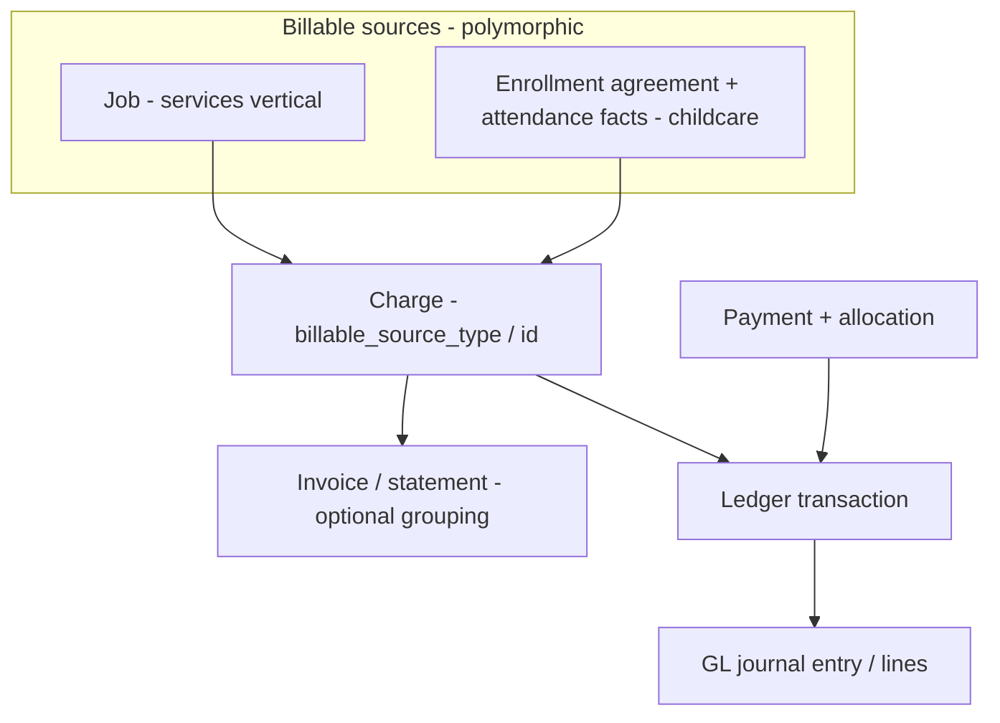

# Billing and financials platform

**Status:** Canonical module doctrine (June 2026). Defines how **Operational Consequences (L5)** — charges, invoices, payments, ledger, GL — derive from operational facts, and locks the decision to **generalize billing before building childcare billing**. **The five P3.1 implementation gates are ratified and built, P3.2 rate configuration + Rate Resolution is built, and P3.3 draft Charge Resolution + a minimum responsibility shape + a read-only preview API (P3.3.1) are built (June 2026)** — see "P3.3 as-built", "P3.2 as-built", "Ratified P3.1 implementation gates", and "P3.1 as-built" below. Posting (invoices, AR, payments, ledger/GL writes), split/subsidy responsibility, cadence/proration, and subsidy remain deferred.

> **Layer:** Billing is **L5 Operational Consequences** in [`../core/operational-truth-flow-doctrine.md`](../core/operational-truth-flow-doctrine.md). It derives from **L4 Operational Facts** (attendance, delivered service), targets **L3 Projections** (expected tuition/revenue) for variance, and reads **L1 Configuration** (rate rules). It never derives directly from enrollment/intent.

> **Companion (current state, supplemental):** [`../../archive/2026-06-product/billing-and-financials.md`](../../archive/2026-06-product/billing-and-financials.md) documents the billing/payments/GL stack **as wired today**. This doc is the forward platform doctrine. Where they differ, this doc is the canonical direction and the supplemental is the as-built record.

> **Commercial Model as-built (June 2026):** **Slice A** promoted **Service** to the first-class `financial_services` table (+ `childcare_rate_plans.service_id`); **Slice B** added **Charge Templates** (`financial_charge_templates`, `20260703120000`); **Slice C** added **Financial Policies** (`financial_policies`, `20260704120000`) — scoped (org/location/service/rate_plan), effective-dated, most-specific-wins — and kept **Charge Categories** code-owned (surfaced as reference under Accounting). **Slice D** promoted the **Charge lifecycle** (`charges` additive columns `occurs_on`/`billable_on`/`charge_template_id`/`service_id`, `20260705120000`) and wired **template-driven draft Charge Resolution** — a configured Charge Template resolves into an idempotent draft/scheduled charge (consuming Services, Templates, and the posting-review Policy), testable via a Charge Template Simulator. A/B/C are configuration; D produces **non-authoritative drafts** (recomputable, no AR/ledger/invoices). Posting, Payments, and Subsidy remain deferred and authoritative-write-only.

> **Canonical domain (frozen):** [`financial-platform-domain.md`](./financial-platform-domain.md) defines the **first-class financial entities** of the Alloy platform — Service, Rate Plan/Rule, Charge Template, Charge (the lifecycle spine), Charge Event (trigger fact), Agreement, Responsibility, Third-Party Payer/Coverage/Claim, Posting Run, Invoice, Payment, GL, Accounting/Billing/Settlement periods — their ownership, runtime, and configuration hierarchy. This billing doc governs *how L5 posting behaves*; the domain doc governs *what the entities are* and is canonical upstream. Key frozen laws it locks: **Service is first-class** (the `org_settings` services catalog is interim); **Posting is the only authoritative money write**; **Resolution is recomputable**; **Third-Party Payer generalizes subsidy**; **financial periods are independent and may diverge**.

---

## The problem this doctrine fixes

Today's billing stack is welded to the cleaning/services (jobs) vertical:

- `charges.job_id` is **NOT NULL** — every receivable charge requires a job.
- `gl_journal_lines` and `ledger_transactions` reference `job_id`.
- There is **no `invoices` table** (referenced only in CHECK constraints as a "ghost" entity type).
- Pricing tables (`pricing_*`, `service_pricing_rules`) are job/service-vertical oriented.

Childcare billing must derive from the **committed enrollment foundation** and **attendance facts** — not from jobs. Two paths were considered: (a) build a parallel childcare billing model, or (b) generalize the existing stack first. **Decision: generalize first.** A parallel model becomes permanent debt and creates two competing notions of money, ledger, and GL.

---

## Ratified decision: generalize before childcare billing

**No childcare billing is built until the financial core is generalized off `job_id`.**

The generalization introduces a **billable source** (financial-responsibility) abstraction so that charges, ledger transactions, and GL lines can reference *what is being billed for* polymorphically, of which a `job` is one kind and an **enrollment agreement (with attendance/schedule facts)** is another.

### Generalization principles

1. **Billable source is polymorphic, not job-anchored.** Charges (and the ledger/GL rows derived from them) reference a billable source by `{type, id}`. `job` and `enrollment_agreement` are two source kinds; neither is privileged in the schema. `charges.job_id NOT NULL` is relaxed to a nullable, with the polymorphic reference as the canonical link.
2. **Charges derive from operational facts.** A childcare charge is created from an attendance fact (or a delivered scheduled service) against an agreement — never from the act of enrolling. Enrollment creates a commitment (L2); a fact (L4) creates the billable event; the charge (L5) derives from the fact. See [`./attendance-system.md`](./attendance-system.md).
3. **Rate resolution reads L1 rules.** Charge amounts resolve from first-class **rate rules** (L1 config), not from job pricing tables and not from JSON. Tuition is not modeled as a program type.
4. **One ledger, one GL.** There is a single `ledger_transactions` / `gl_*` stack for the org. Childcare does not get a second ledger; GL lines gain enrollment/agreement dimensions rather than being tied to `job_id`.
5. **Immutability + audit.** Financial consequences are append-oriented and auditable. Corrections follow the same effective-dated discipline as facts (reversals/credit notes are new entries, not in-place edits). Money is never computed only in the browser; financial side effects run server-side with org scoping and audit trails.
6. **Events drive posting.** Charge creation and posting flow through the event/workflow spine (`emitEvent` → `workflow_events` → `workflowRun`), consistent with [`./actions-and-workflows.md`](./actions-and-workflows.md).

---

## Expected vs actual revenue (L3 ↔ L5)

- **Expected tuition / subsidy / revenue** are **L3 derived** projections of commitments and rate rules — never stored as authoritative rows. See [`../core/operational-truth-flow-doctrine.md`](../core/operational-truth-flow-doctrine.md) (L3).
- **Actual revenue** is the L5 consequence derived from facts.
- Variance (expected vs actual) is an observational read model over L3 and L5; BOS may explain balances and predict delinquency, **proposing**; humans approve.

---

## Childcare boundary

- Childcare billing references the **committed enrollment foundation** (`child_enrollment_agreements`, `child_placements`, `schedule_assignments`) and **attendance facts** — never the OCM proposal alone, never `opportunities.location_id`.
- **Do not** wrap an enrolled child in a `job` to reuse job billing.
- **Do not** introduce a parallel childcare ledger/GL or a second charges model.
- Per [`../../archive/2026-06-runtime-convergence/child_namespace_decision.md`](../../archive/2026-06-runtime-convergence/child_namespace_decision.md) §6, billing data lives on its **own** billing/charge participation entity via a **billing-child context**; never extend `inquiry_child`.

---

## Sequencing (not built in this pass)

Recorded for the phased plan; no schema/runtime here:

1. Generalize the financial core (billable source on charges/ledger/GL; relax `job_id`; introduce invoice/statement grouping if needed).
2. First-class **rate rules** (L1) as the charge-amount source.
3. Childcare charges derived from attendance facts against agreements.
4. Statements / AR aging and customer balance as derived/projected surfaces.

---

## Ratified P3.1 implementation gates (June 2026)

These five decisions are **locked**. They gate **P3.1 — generalize the financial core** (the migration that makes childcare a first-class billable source). They constrain the *posting substrate* (`charges`, `ledger_transactions`, `gl_journal_lines`); everything above the substrate stays deferred (see "Explicitly deferred" below). Full rationale, alternatives, migration/back-compat analysis, and decision language: `../../sprints/archive/06_2026/operational_execution_p3_financial_resolution_planning.md` (historical: `../../sprints/archive/06_2026/operational_execution_p3_financial_resolution_planning.md`) §11.

**Hard rule across all five: no job-vertical regression.** Each gate is additive (nullable columns) or scoped to the childcare path; existing job-billing schema, RLS, and write flows are unchanged in P3.1. A job-vertical cutover (immutability, RLS tightening) is a separate, later, explicit decision — never an accidental side effect.

1. **Additive `charge_category` taxonomy.** Add a nullable `charge_category` with its own CHECK vocabulary (`tuition, deposit, consumable_fee, late_pickup, one_time, discount, credit, adjustment, subsidy_offset`) as the canonical financial taxonomy. The legacy `charge_type` and its `{service, fee, adjustment}` CHECK are **frozen for compatibility** — not expanded. Childcare charges set `charge_category` (plus a compatible `charge_type` for legacy readers).

2. **Childcare posted-charge immutability.** `draft`/unposted charge *intents* may be recalculated or replaced freely. A **`posted` childcare charge is never updated in place.** Post-posting corrections are **new rows linked by `source_charge_id`** — reversal, credit, or replacement charge. Enforced by a status-scoped guard for `billable_source_type='enrollment_agreement'`; the job vertical's existing mutability is unchanged.

3. **Childcare financial write posture (server-side + role-gated).** All childcare financial writes are **server-side only** and gated by `has_org_role(org_id, ARRAY['owner','admin','ops','manager'])`, aligning with the P1/P2 posture. **No broad `authenticated` client writes for money**; money is never computed in the browser. New childcare financial tables use org SELECT / role INSERT / `service_role` ALL / no UPDATE-DELETE grants. Existing job `charges` policies are unchanged in P3.1.

4. **Generic billable-source dimension on ledger/GL.** Add a generic, nullable `billable_source_type` / `billable_source_id` dimension to `ledger_transactions` and `gl_journal_lines` (both already allow null `job_id`). This supports `job` and `enrollment_agreement` sources in **one ledger, one GL** — no second ledger, no childcare-specific FK. GL account mappings (tuition/subsidy/deposit) are reserved for a later sub-phase.

5. **Currency posture.** **Single currency per org** for P3. Rate plans carry an explicit `currency_code` (default = org currency) from day one so multi-currency is not blocked by a future breaking change; cross-currency composition is a validation error. No FX/conversion in P3.

### Explicitly deferred (NOT part of P3.1)

- **Invoices / statement grouping** — charges remain the receivable unit; a statement grouping (if needed) and any first-class `invoices` entity are deferred (P3.6 / product policy).
- **Subsidy** — Processing-owned intake, authorization storage, claims, and settlement are deferred. P3 ships only a `SubsidyAuthorization` consumption interface. **Expected subsidy is L3-derived and is never booked as AR before a claim/posting.**
- **Deposits modeling** (held-liability GL + recognition) and **cadence / proration policy** are deferred to their sub-phases (P3.6 / P3.4). **Minimum responsibility** (default household/account payer) ships in P3.3; **split / subsidy / guardian-specific responsibility** and any first-class `service_agreement` / `responsibility_party` table remain deferred.

### Stage separation reaffirmed

**Posting is separate from Financial Resolution.** Rate Resolution (what pricing applies) → Charge Resolution (what becomes a charge) → Financial Resolution (who owes what) are derived/recomputable; **Posting** (immutable charges, statements, claims, payments, ledger, GL) is the only stage that writes authoritative financial truth. These do not collapse into "billing logic."

**What feeds Charge Resolution at runtime is Operational Consumption.** The interpretation step — *given an operational fact, what commercial meaning should exist?* — is its own layer with its own runtime objects (**Consumption Event** → **Resolved Obligation**), sitting at the L4 → L5 boundary. It **consumes** the resolver below it (it does not reimplement pricing) and writes only draft objects; the trigger fact stays in `workflow_events`. See [`./operational-consumption-platform.md`](./operational-consumption-platform.md). Posting remains the separate, only authoritative write.

### P3.2 as-built (June 2026 — rate config + Rate Resolution)

Migration `supabase/migrations/20260701120000_childcare_rate_plans_p3_2.sql` adds **pricing configuration (L1)** above the P3.1 substrate, plus a **pure Rate Resolution read model**. **Rate Resolution is not Charge Resolution** — it selects which plan/rule applies; it computes no charge, writes no `charges`/ledger/GL, and creates no AR/invoice/subsidy.

- **`childcare_rate_plans`** — scoped (`org → site → program → room`, reusing `validate_childcare_config_scope`), age-group-narrowable, effective-dated container. Carries explicit `currency_code` (default `USD`), `billing_basis` (`annual|monthly|weekly|daily|session|hourly`), `calculation_strategy` (`scheduled|attendance_actual|hybrid|fixed`), `is_active`, and **hook-only** nullable `proration_method` / `billing_cadence` (reserved vocab, not implemented).
- **`childcare_rate_rules`** — priced lines within a plan, keyed by `schedule_basis` (`full_day|half_day|three_day|four_day|five_day|hourly|drop_in`) and expressed in a `rate_basis` (same vocab as billing basis), age-group-narrowable, effective-dated, `amount_cents >= 0`. **Currency is inherited from the parent plan** (no per-rule currency) so a plan can never mix currencies. A trigger enforces `org_id` matches the parent plan.
- **RLS:** config posture identical to the P1 rule tables (org SELECT for owner/admin/ops/manager; INSERT/UPDATE for owner/admin/ops; DELETE for owner/admin; `service_role` ALL).
- **Resolution precedence:** plan = most-specific scope wins → age-group-specific → latest `effective_start` (delegated to the shared config resolver); rule = `schedule_basis` match → age-group-specific → latest `effective_start`.

Code surface (all pure / read-only): `web/lib/financials/rates/rateTypes.ts` (vocab + row shapes), `web/lib/financials/rates/resolveRate.ts` (`resolveRatePlan` / `resolveRateRule` / `resolveRate`), `web/lib/financials/rates/rateConfigService.ts` (org-scoped fetchers + `fetchResolvedRate`). No charge generation, no posting, no UI.

---

### P3.3 as-built (June 2026 — draft Charge Resolution + minimum responsibility)

**Charge Resolution** turns committed enrollment/schedule intent + a resolved rate (P3.2) into **draft childcare charges** through the P3.1 service. It is the first slice of Financial Resolution: it computes amounts but is **not Posting** — it only ever writes `status='draft'` rows and never mutates a posted charge. **No new migration:** P3.3 adds no schema; it composes existing substrate (`charges.metadata`, `charge_category='tuition'`, `billable_source_*`, `currency_code`, `service_date`) and the existing committed-enrollment relationships.

- **Schedule basis resolution** (`web/lib/financials/chargeResolution/scheduleBasis.ts`, pure): maps a committed `schedule_pattern` to a P3.2 `schedule_basis`. Precedence: per-pattern override → `pattern.metadata.schedule_basis` → known `schedule_type_key` defaults (`full_time→full_day`, `half_day`, `hourly`, `drop_in`, `three/four/five_day`) → weekday-count fallback (3/4/5 days). Qualitative bases (full/half/hourly/drop_in) are never fabricated from a day count alone; unclassifiable → `null` (clear "no basis" state).
- **Billable quantity** (`web/lib/financials/chargeResolution/billableQuantity.ts`, pure): `monthly|annual|weekly` = flat 1 unit/period (no proration in P3.3); `daily|session` scheduled = scheduled days in period, `attendance_actual` = attended days (from P2 facts), `hybrid` = scheduled-days fallback flagged `calculation_placeholder`; `hourly` requires an explicit hours signal else unresolved; `fixed` collapses to 1. A zero/unresolved quantity emits **no draft** (substrate forbids zero-amount charges).
- **Responsibility (minimum shape, no new table)** (`web/lib/financials/chargeResolution/responsibility.ts`, pure): the default responsible party is the committed agreement's household/account (`customer_id`), falling back to `customer_member_id`. It is stamped on `charge.metadata.responsibility = { party_type, party_id, basis }`. **Deferred:** split responsibility, subsidy responsibility, guardian-specific payer, and any first-class `service_agreement` / `responsibility_party` table.
- **Draft resolver** (`web/lib/financials/chargeResolution/resolveDraftCharges.ts`, pure): composes agreement + period + resolved rate + responsibility → a `DraftChargeIntent` (`charge_category='tuition'`, `billable_source_type='enrollment_agreement'`, `amount = unit × quantity`, plan currency, `service_date = period.start`) with a deterministic `resolution_key = tuition:{agreement}:{period}:{schedule_basis}:{rate_rule}` for idempotency.
- **Orchestration service** (`web/lib/financials/chargeResolution/draftChargeResolutionService.ts`): loads the active assignment/pattern + placement, resolves age group, fetches the rate, derives quantity (pulling P2 attendance only for `attendance_actual`), then **idempotently** upserts via `childcareChargeService` — creates a draft, recalculates an existing draft in place when the amount changes, returns `unchanged` when identical, and **skips a posted charge** (`skipped_posted`, never mutated). Non-billable resolutions return a structured `unresolved` reason and write nothing.

Boundaries held: no invoices, AR, ledger, payments, subsidy/expected-subsidy AR, UI, or job-table coupling; all childcare charge writes go through `childcareChargeService`; Financial Resolution stays separate from Posting.

**P3.3.1 — Financial Charge Preview API (read-only).** `previewDraftChargeForAgreementPeriod` (in the same service) resolves a draft **without writing** — the write path (`resolveDraftChargeForAgreementPeriod`) is built on top of it so preview and write never diverge. It returns the resolved rate, schedule basis, quantity, amount, currency, responsibility, resolution key, and an advisory `wouldWrite` (`create | recalculate | unchanged | skipped_posted`). `GET /api/admin/financial-charge-preview` (financial role-gated via `requireAdminOrOps`, read-only) shapes it through the pure `buildDraftChargePreviewDto` for Configuration / Focus Panel surfaces to show financial resolution before posting. The route is named generically (financial, not childcare); the childcare/enrollment billable source is a billable-source-specific input (`enrollment_agreement_id`) and the DTO names it generically as `billableSource.type = "enrollment_agreement"`. No charge/invoice/AR/ledger/GL writes; no UI.

### Configuration exposure (Operational Configuration V1, Batch 0 — read-only)

The financial model is now **visible** in the Configuration Runtime under a first-class **Financials** domain (`/settings/financials`) — read-only. It exposes Rate Plans + nested Rate Rules, the Financial Charge Preview inspector (over the P3.3.1 API), and **GL configuration**: **GL Codes** (`gl_accounts`) and **GL Mappings** (`gl_account_mappings`) render read-only via `loadGlConfigBundle` (`glConfigService`, admin/ops gated, no write verbs). GL belongs under Financials because GL Codes/Mappings are the accounting targets posting will map charge categories, payments, credits, deposits, subsidy, and adjustments to — even though authoring and posting are deferred. No posting, payments, subsidy, schema changes, or write flows were introduced. See `../../sprints/archive/06_2026/operational_configuration_v1.md` (historical: `../../sprints/archive/06_2026/operational_configuration_v1.md`) (Batch 0).

### Rate authoring + versioning (Operational Configuration V1, Batch 1 — writable)

Rate Plans and Rate Rules are now **authored with effective-dated versioning** — still **configuration only**, no posting/charges/GL/AR. **No migration:** the P3.2 tables already carry `effective_start` / `effective_end` / `is_active` / `metadata` and RLS already permits scoped admin/ops writes.

- **Supersede / change-later, never overwrite.** "Edit" = create a new version effective on a chosen date; the prior row's `effective_end` is closed the day before (`rateAuthoringService.ts`, mirroring `supersedeChildPlacement`). The rate tables have no `status`/`supersedes_id` column, so the prior-version link lives in `metadata.supersedes_id` / `metadata.lineage_origin_id`; lifecycle status (Current / Scheduled / Superseded / Retired) is **derived** by the pure, domain-generic `lib/adminV2/operationalConfig/effectiveDatedVersioning.ts`, not stored.
- **Operations** (role-gated POST `/api/admin/financial/rate-plans` and `/rate-rules`, dispatching `create | version | retire | void`): plan supersede **carries the prior version's currently-effective rules forward** so Rate Resolution never falls into `no_rule`; retire closes the window (non-destructive); void hard-deletes a **not-yet-started** version and **reopens its predecessor** (rollback) but is refused once a version was ever effective.
- **One shared editor primitive** (`EffectiveDatedConfigurationEditor`) renders the version timeline + inline authoring + a **resolved-rate preview** (authoritative `resolveRate`); it is domain-generic and slated to power capacity/ratio/operating-window/schedule authoring in Batch 2. Doctrine boundary holds: nothing here writes `charges`/`ledger_transactions`/`gl_journal_lines`/invoices/AR. See `../../sprints/archive/06_2026/operational_configuration_v1.md` (historical: `../../sprints/archive/06_2026/operational_configuration_v1.md`) (Batch 1).

---

### P3.1 as-built (June 2026 — substrate generalized)

Migration `supabase/migrations/20260630120000_financial_substrate_generalization_p3_1.sql` lands the five gates as **additive substrate** on the existing `charges` / `ledger_transactions` / `gl_journal_lines` tables. No new financial tables, no second ledger, no job regression.

- **Gate 1 — `charge_category`:** nullable column + `charges_charge_category_chk` vocabulary = `tuition, deposit, consumable_fee, late_pickup, one_time, discount, credit, adjustment, fee, subsidy_offset`. Legacy `charge_type` and `charges_charge_type_chk` (`{service, fee, adjustment, cancellation_fee}`) are **untouched**. Partial index `idx_charges_org_charge_category_partial`.
- **Gate 4 — generic billable-source dimension:** `billable_source_type` (`job | enrollment_agreement`) + `billable_source_id` added to **all three** tables (`charges` as well as ledger/GL). `charges.job_id` relaxed to nullable; existing rows backfilled to `('job', job_id)`. `charges_source_present_chk` guarantees every charge carries either `job_id` or a `billable_source` identity. Partial indexes per table.
- **Gate 2 — posted childcare immutability:** `BEFORE UPDATE OR DELETE` trigger `enforce_childcare_charge_immutability` scoped to `billable_source_type='enrollment_agreement' AND status <> 'draft'`. Freezes financial fields (amount, category, type, currency, source, service_date), blocks in-place `void`/revert-to-`draft`, and blocks `DELETE`; allows forward status motion (`posted → partially_paid → paid`). Job rows and drafts pass through untouched.
- **Gate 3 — write posture:** `RESTRICTIVE` policy `*_childcare_write_rolegate` on all three tables — childcare rows (`billable_source_type='enrollment_agreement'`) additionally require `has_org_role(org_id, ARRAY['owner','admin','ops'])`; job rows and `service_role` are unaffected. The write surface is the server-only service (`web/lib/financials/childcareChargeService.ts`); there is no browser/client money-write path.
- **Gate 5 — currency:** the substrate already carries `charges.currency_code` / `ledger.currency` / `gl.currency`, so P3.1 makes **no structural currency change**; the service sets `currency_code` explicitly (default `USD`). Rate-plan `currency_code` arrives with rate plans in P3.2.

Code surface: vocabularies/types in `web/lib/financials/billableSource.ts`; the server-side, immutability-aware, `source_charge_id`-correction service in `web/lib/financials/childcareChargeService.ts` (create draft → recalc draft → post → reversal/credit/replacement). DB triggers/constraints are authoritative; the service mirrors them for friendly errors.

---

### Household parity + actor attribution as-built (September 2026)

Migration `supabase/migrations/20260902130000_financial_spine_actor_and_household_parity.sql`.

`20260827120000_household_billable_source` admitted `billable_source_type = 'customer'` so a family can be charged **before anyone is enrolled** — a waitlist, registration or application fee, a deposit. It widened the CHECK constraints and stopped there. Gates 2 and 3 above were written against the `'enrollment_agreement'` **literal**, so the pre-enrolment charge was made *representable* without being made *safe*: a posted household charge could be edited in place, and household money rows escaped the role gate. Confirmed on the deployed database, not inferred — census `certification/financials/charge-spine-actor-and-parity-census.sql` returned `enrollment_agreement_only` for the trigger and for all three `*_childcare_write_rolegate` policies.

- **Gate 2 (extended)** — `enforce_childcare_charge_immutability` now tests membership of the **childcare source set** (`enrollment_agreement | customer`, code-owned as `CHILDCARE_BILLABLE_SOURCE_TYPES`) rather than one literal, so a source the substrate admits is a source the rule protects. `posted_at` and `posted_by` join the frozen field list. `job` rows are still exempt: job billing owns its own lifecycle.
- **Gate 3 (extended)** — the same set in the RESTRICTIVE `*_childcare_write_rolegate` policies on all three tables.
- **Actor attribution** — `charges` gains `created_by` / `updated_by` / `posted_by` (plain `uuid`, matching `payments.created_by`). The charge decides what a family owes and recorded only *when*, never *who*; the same census showed the columns absent on the deployed database, which is also why `chargeLifecycleService`'s recalculate path — already writing `updated_by` — could never have succeeded against it. `posted_by` is separate from `updated_by` because "who last touched this row" does not answer "who made this owed".

**Posting is idempotent.** `postChildcareCharge` guards the transition inside the UPDATE (`status = 'draft'`), so two concurrent posts race on the row and exactly one writes; the loser re-reads and reports `alreadyPosted` rather than raising. A retried request cannot post twice and is not reported as a conflict.

**The lifecycle is operable.** `charge.add`, `charge.post` and `charge.reverse` are registered actions (`web/lib/adminV2/actions/definitions/financialChargeActions.ts`) surfaced on the Financials card: Add charge on the card, and per ledger row **Post** on a draft, **Reverse** on posted money. Immutability without a correction path is a dead end, not a guarantee — `charge.reverse` is the lawful way posted money changes, and it writes a new row through `source_charge_id` on the source's own billable source.

**Idempotency scope is the billable source.** `resolution_key` is `tpl:<template_key>:<occurs_on>:<scopeKey>` where `scopeKey` is the **billable source id**. It was the agreement id falling back to the literal `"org"`, which made two different households' fees share a key on the same day and skipped the dedupe read entirely for household charges — two submissions wrote two drafts.

---

## What not to do

- Do not build childcare billing before the financial core is generalized off `job_id`.
- Do not anchor childcare charges, ledger, or GL on `job_id`, or wrap children in jobs.
- Do not create a second ledger/GL or a parallel charges model for childcare.
- Do not derive charges from enrollment/intent; derive them from operational facts.
- Do not store "expected revenue/tuition" as authoritative rows — it is derived (L3).
- Do not encode rate rules only in JSON, or compute money in the browser.
- Do not expand the legacy `charge_type` CHECK; add financial taxonomy on `charge_category` (P3.1 gate 1).
- Do not update a posted childcare charge in place; correct via `source_charge_id` reversal/credit/replacement (P3.1 gate 2).
- Do not allow broad `authenticated` client writes for childcare money; writes are server-side + `has_org_role` (P3.1 gate 3).
- Do not write a childcare money guarantee against the `'enrollment_agreement'` literal; quantify over `CHILDCARE_BILLABLE_SOURCE_TYPES`, or the next source admitted escapes it silently.
- Do not raise on a repeated post — posting is idempotent and a retry reports the existing posting.
- Do not write a charge without an actor; `created_by` / `updated_by` / `posted_by` are the audit trail money requires.
- Do not add a childcare-specific ledger FK or a second ledger/GL; use the generic billable-source dimension (P3.1 gate 4).
- Do not book expected subsidy as AR before a claim/posting; expected subsidy is L3-derived.
- Do not collapse Rate / Charge / Financial Resolution into Posting — Posting is the only authoritative-write stage.
- Do not regress job-vertical schema, RLS, or write flows when generalizing (gates are additive or childcare-scoped).
- Do not let Rate Resolution write charges, post, or create AR — it only selects which rate plan/rule applies (P3.2).
- Do not store currency per rate rule; currency lives on the rate plan and rules inherit it (no cross-currency plan).
- Do not implement proration/cadence/discounts/credits/subsidy in rate config — they are reserved hooks until their sub-phases.
- Do not let Charge Resolution post, invoice, create AR, or write ledger/GL — it only emits **draft** childcare charges via `childcareChargeService` (P3.3); Posting is a later, separate stage.
- Do not recompute or overwrite a posted childcare charge during Charge Resolution — re-resolution skips posted rows and only recalculates drafts in place (P3.3).
- Do not build split/subsidy/guardian-specific responsibility or a `service_agreement` table yet — P3.3 ships only the default household/account payer stamped on `charge.metadata.responsibility`.

---

## Cross-references

| Concern | Doctrine |
|---------|----------|
| Truth-flow layers (Billing = L5) | [`../core/operational-truth-flow-doctrine.md`](../core/operational-truth-flow-doctrine.md) |
| Attendance facts (what billing derives from) | [`./attendance-system.md`](./attendance-system.md) |
| Committed enrollment foundation | [`../core/placement-system.md`](../core/placement-system.md) |
| Child namespace per module (billing-child context) | [`../../archive/2026-06-runtime-convergence/child_namespace_decision.md`](../../archive/2026-06-runtime-convergence/child_namespace_decision.md) |
| Action / event spine (posting path) | [`./actions-and-workflows.md`](./actions-and-workflows.md) |
| Billing as wired today (supplemental) | [`../../archive/2026-06-product/billing-and-financials.md`](../../archive/2026-06-product/billing-and-financials.md) |
| Financial RLS / payment-method security | [`../../audits/active/supabase-schema-alignment-audit.md`](../../audits/active/supabase-schema-alignment-audit.md) |

---

## When this doc must be updated

- The billable-source abstraction or the generalization decision changes.
- Charge derivation (facts → charges) or rate-rule sourcing changes.
- Invoice/statement modeling is introduced.
- Billing moves from doctrine to implemented schema/runtime (record the model here).
