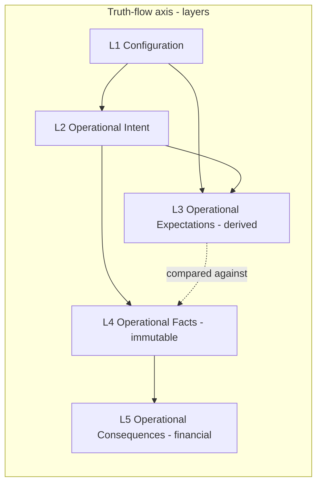

# Operational Truth-Flow doctrine

**Status:** Canonical platform doctrine (June 2026). Defines the **truth-flow axis** of Alloy's operating model — what is operationally true, and how downstream truth derives from upstream truth — across Enrollment, Scheduling, Attendance, Capacity, Ratios, Billing, Subsidy, Payments, Financials, Forecasting, and Staffing.

> **This doctrine is complementary, not a replacement.** It introduces a second axis over the existing operating model; it does **not** modify the frozen five-plane surface model in [`./operational-ux-doctrine.md`](./operational-ux-doctrine.md). The two axes compose. See "Two orthogonal axes" below.

---

## Why this doctrine exists

As Alloy expands from Enrollment into Scheduling, Attendance, Billing, and beyond, every new capability introduces data. The risk is that each capability invents its own notion of "truth" — its own tables, its own derivations, its own financial coupling — producing overlap, duplicate models, and drift.

This doctrine fixes the **direction truth flows** so that new capabilities emerge as coherent layers of one platform rather than competing modules. Alloy is an **Operational Execution Platform**, not CRUD-over-records: it manages operations, and operations have a lifecycle from rules, to commitments, to projections, to facts, to financial consequences.

---

## Two orthogonal axes

Alloy's operating model has **two** canonical axes. Neither replaces the other; every operational object is located on both.

| Axis | Question it answers | Canonical doc |
|------|---------------------|---------------|
| **Surface axis (planes)** | *Where does the operator stand when they act?* | [`./operational-ux-doctrine.md`](./operational-ux-doctrine.md) — Configuration / Planning / Operations / Records / Intelligence-BOS |
| **Truth-flow axis (layers)** | *What is true, and what does it derive from?* | **This doc** — Configuration → Intent → Expectations → Facts → Consequences |

**How the axes relate:** A layer is *what a thing is*; a plane is *where an operator works on it*. Example: an attendance record is **L4 (Facts)** on the truth-flow axis; an operator records it from the **Operations plane** (daily roster work unit) and reviews it from the **Records plane** (child drawer Attendance tab). The Planning plane reads L3 and L4; it never authors L4.

---

## The five layers

### L1 — Configuration

**Defines how the organization operates.** The rules operations execute against: organization, location, programs, rooms, **rate rules**, **ratio rules**, **schedule rules**, **policies**, brand, and workspace configuration.

- Authored in the Configuration plane (`/admin/settings/*`, business process builder, Experience Builder).
- **Configuration is separate from execution.** Changing config changes the rules of the game; it never rewrites operational history already recorded.
- **Compliance-bearing rules are code-owned, not JSON-owned.** Ratio rules, rate rules, and schedule rules carry legal/financial invariants. They must be **first-class configuration entities** with code enforcing their invariants — not EAV `field_values` rows or free-form JSON. (See "Config-as-first-class" below.)

Canonical homes today: `locations` (`site` / `unit`), `location_program_categories`, `option_sets`, `field_definitions`, settings four-plane.

### L2 — Operational Intent

**Records commitments.** What the organization has agreed to do: Lead, Enrollment proposal, Agreement, Placement, Schedule Assignment.

- Intent is **committed truth** — a system of record — distinct from a proposal/forecast.
- Intent already has its canonical, complete implementation for enrollment: `child_enrollment_agreements` → `child_placements` → `schedule_assignments`, created via the `approve_enrollment` handoff from the OCM enrollment proposal. See [`./core/placement-system.md`](./core/placement-system.md).
- **Proposal (intent-to-be) and committed Intent stay separate.** The OCM enrollment proposal is pre-commitment; the agreement/placement/schedule rows are the commitment. Do not collapse them.
- Every future commitment domain copies this template (own participation entity, effective-dated, provenance FKs back to its source).

### L3 — Operational Expectations

**Derived projections of Intent (and Configuration).** What *should* happen if commitments hold: Expected Attendance, Expected Occupancy, Expected Staffing, Expected Ratios, Expected Tuition, Expected Subsidy, Expected Revenue.

- **Expectations are derived, not stored as a system of record.** They are deterministic functions of L1 + L2. They MUST NOT become authoritative tables that can silently disagree with Intent or Facts.
- **Materialization is allowed only as a non-authoritative cache** for forecasting/performance, computed from L1+L2 (and, for forecasting, L4), clearly marked non-authoritative, and always reproducible by recomputation. A materialized snapshot is never the source of truth and is never edited in place to change a projection.
- Expectations consume **Intent** (you can project expected occupancy before a single attendance fact exists). Forecasting additionally consumes **Facts** to project further forward. This refines the Planning plane's "consumes operational facts" framing: Expectations project commitments; forecasting projects commitments plus history.
- Expectations are the **target that Facts are compared against** (e.g. expected vs actual attendance, expected vs actual ratio).

### L4 — Operational Facts

**Immutable records of what actually happened.** Attendance events, room transfers, presence events, schedule overrides, capacity changes, communication events, payment events, operational history.

- **Facts are immutable.** Never overwrite operational history. Corrections are **new effective-dated facts**, not edits-in-place. Effective-dated supersede is the universal mutation pattern (see [`../../web/lib/childcareOperational/effectiveDating.ts`](../../web/lib/childcareOperational/effectiveDating.ts)).
- Every meaningful fact emits an event on `workflow_events` (`emitEvent` → `workflow_events` → `workflowRun`).
- Facts are recorded from the Operations plane and reviewed from the Records plane; they are authored by **Actions**, never by queue rows or projections.
- Attendance is the **keystone fact stream**: billing, ratio compliance, and forecasting all derive from it. See [`./modules/attendance-system.md`](./modules/attendance-system.md).

### L5 — Operational Consequences

**Financial and reporting outcomes derived from Facts.** Charges, Invoices, Payments, Ledger, GL, Compliance, Forecasting, Reporting.

- **Financials derive from operational facts, not from enrollment/intent directly, and not from the jobs vertical.** A child being enrolled does not create a charge; a recorded operational fact (attendance against an agreement, a scheduled service delivered) does.
- Billing must be **generalized before childcare billing is built** — charges/ledger/GL reference a billable source (enrollment agreement + attendance facts), not `job_id`. See [`./modules/billing-financials-platform.md`](./modules/billing-financials-platform.md).
- Consequences are append-oriented and auditable; corrections follow the same immutability discipline as Facts.
- **The L4 → L5 bridge is its own layer: Operational Consumption.** Facts do not become Consequences by magic. The interpretation step — *given this fact, what commercial meaning should exist?* — is named and recorded as a first-class runtime object: a **Consumption Event** resolving to zero-or-more **Resolved Obligations**, which (only when drafted) link to a draft Charge. Consumption **consumes** the Commercial Model resolver; it posts nothing and never mutates authoritative money. The trigger fact stays in `workflow_events`; the Consumption Event is the canonical runtime *contract* on which Resolution builds. See [`./modules/operational-consumption-platform.md`](./modules/operational-consumption-platform.md).

---

## The four ratified laws

1. **Complementary axes.** The truth-flow layers are orthogonal to the five planes and do not replace them. Locate every operational object on both axes.
2. **Expectations are derived / non-authoritative.** L3 is computed from L1+L2 (and L4 for forecasting). Materialized snapshots are permitted only as a clearly non-authoritative, recomputable cache — never a system of record.
3. **Financials derive from Facts.** L5 derives from L4, never directly from enrollment/intent. Billing is generalized off the jobs vertical before any childcare billing is built.
4. **Facts are immutable + effective-dated.** L4 (and L5) never overwrite history; corrections are new effective-dated rows via the supersede pattern.

---

## Config-as-first-class (L1 decision)

**Decision (June 2026):** Rate rules, ratio rules, schedule rules, and policies are promoted from EAV (`field_values`, e.g. `license_capacity`) to **first-class configuration entities**.

Rationale: these rules carry compliance and financial invariants. Per platform guardrails, **code owns invariants**; business-critical truth must not live only in JSON config. EAV fields are acceptable for descriptive/display configuration, not for rules that gate ratio compliance, tuition computation, or schedule validity.

Scope note: this records the canonical direction. The schema/runtime implementation is sequenced in the phased plan and is **not** part of this doctrine pass.

---

## Childcare boundary rules

- **Childcare builds only on the committed enrollment foundation:** `child_enrollment_agreements`, `child_placements`, `schedule_assignments`, and the OCM enrollment proposal. New childcare operational work references these, not ad-hoc fields.
- **Job-vertical financial and schedule tables are off-limits to new childcare work:** `schedules`, `assignments`, `recurrence_plans`, `customer_subscriptions`, `placement_candidates` (waitlist grain), and job-anchored `charges` / `gl_*` are the cleaning/services vertical. Do not reuse them for childcare scheduling, attendance, or billing, and do not wrap an enrolled child in a `job`.
- **Each future module follows the namespace decision** in [`../platform_convergence/child_namespace_decision.md`](../platform_convergence/child_namespace_decision.md) §6: durable child = `child.*` / `customer_member`; module data on the module's **own** participation entity via a `{module}-child context`; never extend `inquiry_child` beyond enrollment.

---

## How a new capability maps to the layers

Every new operational capability supplies artifacts at each layer rather than a parallel application:

| Capability | L1 Config | L2 Intent | L3 Expectations (derived) | L4 Facts (immutable) | L5 Consequences |
|------------|-----------|-----------|---------------------------|----------------------|-----------------|
| **Scheduling** | schedule rules | `schedule_assignments` | expected occupancy / ratio | schedule overrides | (feeds billing) |
| **Attendance** | attendance policy | (uses schedule intent) | expected attendance | attendance / presence / transfer facts | billable attendance |
| **Capacity / Ratios** | ratio + capacity rules | placement | expected ratio / fill | capacity-change facts | compliance status |
| **Billing** | rate rules | agreement terms | expected tuition / revenue | (consumes attendance facts) | charges / ledger / GL |
| **Subsidy** | subsidy rules | subsidy commitment | expected subsidy | subsidy claim facts | subsidy revenue |
| **Staffing** | staffing rules | shift assignment | expected staffing demand | shift / coverage facts | labor cost |

---

## What not to do

- Do not introduce the five layers as a *replacement* for the five planes, or refactor the plane doctrine.
- Do not give Expectations a system-of-record table, or edit a materialized expectation snapshot to change a projection.
- Do not derive financial consequences directly from enrollment/intent, or anchor childcare billing on `job_id`.
- Do not overwrite operational facts in place; always supersede with a new effective-dated row.
- Do not reuse job-vertical schedule/financial tables for childcare, or extend `inquiry_child` to non-enrollment modules.
- Do not encode ratio/rate/schedule-rule invariants only in JSON config.

---

## Cross-references

| Concern | Doctrine |
|---------|----------|
| Surface axis (five planes, Operations/Records, tabs vs actions) | [`./operational-ux-doctrine.md`](./operational-ux-doctrine.md) |
| Committed enrollment foundation (Intent) | [`./core/placement-system.md`](./core/placement-system.md) |
| Child namespace per module (Facts/Consequences modules) | [`../platform_convergence/child_namespace_decision.md`](../platform_convergence/child_namespace_decision.md) |
| Attendance facts (keystone L4) | [`./modules/attendance-system.md`](./modules/attendance-system.md) |
| Billing generalization (L5) | [`./modules/billing-financials-platform.md`](./modules/billing-financials-platform.md) |
| Billing maturity (supplemental, current state) | [`../product/billing-and-financials.md`](../product/billing-and-financials.md) |
| Actions / event spine (how facts are authored) | [`./modules/actions-and-workflows.md`](./modules/actions-and-workflows.md) |
| Planning / analytics measurement layer | [`./modules/operational-intelligence-platform.md`](./modules/operational-intelligence-platform.md) |
| Effective-dated supersede pattern (code) | `web/lib/childcareOperational/effectiveDating.ts` |

---

## When this doc must be updated

- A new operational layer is introduced or the truth-flow ordering changes.
- The relationship between the truth-flow axis and the surface axis changes.
- The four ratified laws change (compose, expectations-derived, financials-from-facts, facts-immutable).
- The config-as-first-class decision is extended or revised.
