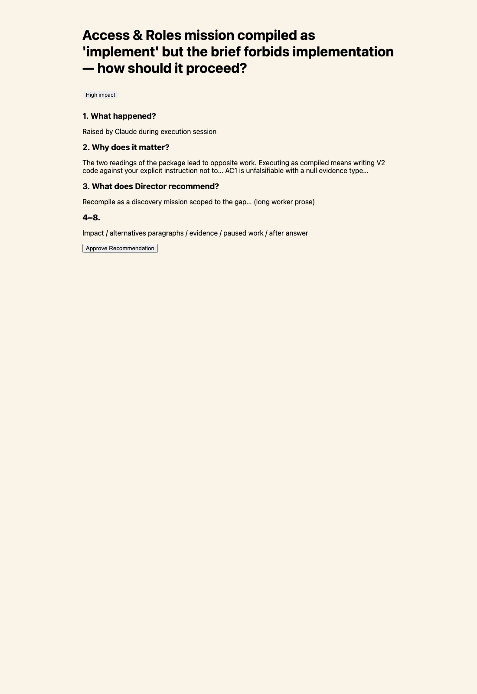
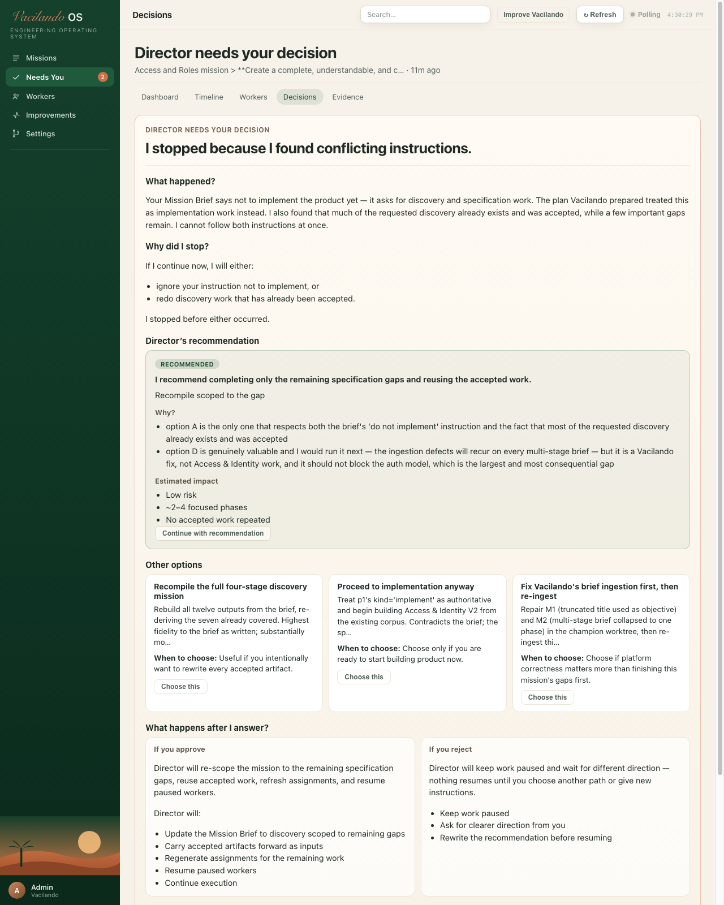
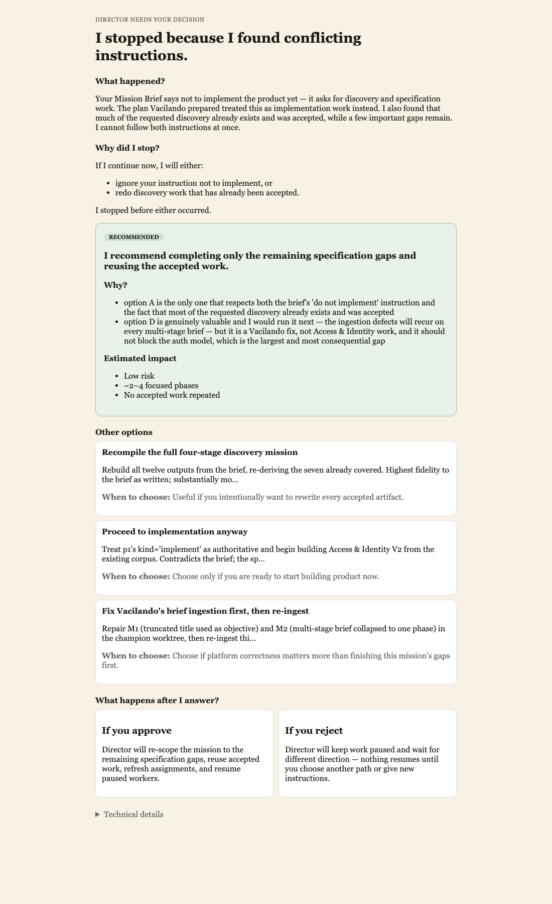

# Decision Experience V2 — Before / After

**Mission under test:** `msn_2d054741a54698fa4c`  
**Decision:** `dec_9f20088c08cbe8`  
**Live route:** `#/decisions/dec_9f20088c08cbe8?mission=msn_2d054741a54698fa4c`

## Before

- Title was the engineering conflict string
- Section 1 led with “Raised by Claude during execution session”
- Recommendation was long worker prose
- Numbered report sections (impact / evidence / paused work) competed with the call

## After (live Vacilando.app)

Static briefing render (same copy):

| Question (≤30s) | Answer without Technical Details |
|---|---|
| Why did Director stop? | Conflicting instructions |
| What happened? | Brief says discovery; plan said implement; much discovery already accepted |
| What does Director recommend? | Finish remaining specification gaps; reuse accepted work |
| Why? | Respects do-not-implement; avoids redoing accepted work |
| If I approve? | Re-scope, refresh assignments, resume workers |
| If I reject? | Stay paused; wait for new direction |

Worker reasoning, session metadata, and raw fields remain under **Technical details**.
