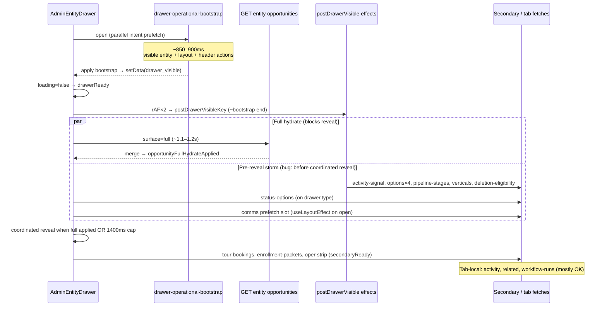

# AdminV2 Opportunity Drawer — Performance Hardening (Phase 0)

**Scope:** Opportunity drawer only. No `/dept`, `/work-unit`, queue doctrine, or global stale caches.  
**Status:** In progress — Pass 3 request suppression + bootstrap slimming (2026-05-20).  
**Target:** Production-grade perceived open — one loading state, coherent reveal ≤ ~900ms where backend permits, no pre-reveal network storm.

---

## UI requirements (product)

### 1. Drawer loading header cleanup

During drawer loading / coordinated reveal (inquiry workflow):

- Do **not** show changing helper/status messages under the drawer title.
- Do **not** show queue summary text, status text, oper-trust headline, or activity header lines under the title while loading.
- Header stays calm: **queue seed title (or neutral label) + close** only; no subtitle, timeline, or title-rail actions until reveal.
- Loading copy lives **only** in the centered `AdminV2DrawerLoadingState` card.

### 2. Drawer reveal requirement

Perceived flow: **loading state → complete record view** (not header text → loading card → partial overview → sections popping).

- Hold branded loading until **primary** (`surface=drawer_primary`) can paint overview coherently.
- `surface=full` runs **idle after reveal** (background enrich), not gating first paint.

### 3. Work-unit loader visual (scope-limited)

- Subtle enrollment/dept-style accent on **WU route skeleton only**: left pine border on primary column + light top rail on throughput panel.
- Must not exceed `/dept` visual weight.
- **No** `/dept`, `/work-unit` data, or architecture changes.

---

## 1. Current drawer waterfall

**Critical path today:** `max(bootstrap ~900ms, surface=full ~1100–1200ms)` because **coordinated reveal gates on full hydrate**, not bootstrap alone.

**Latent server surface:** `surface=drawer_initial` exists in `respondOpportunityEntityGet` but **happy-path client only requests `surface=full`** after bootstrap.

---

## 2. Full hydrate segment breakdown (`surface=full`)

Source: `web/lib/admin/opportunityEntityRecord.ts` (`segments_ms` / lap segments).

| Segment | Typical ms (observed) | What it does |
|--------|------------------------|--------------|
| `parallel_initial_lookups` | (included in total) | WU dept, customer name, pipeline/stage, discount, vertical, location, primary person/contact patch, **status defs (tagged fetch)** |
| `status_resolve_and_lifecycle_shell` | small | `_status_display`, quote total, `_lifecycle_*` from defs |
| `field_definitions_and_values_attach` | **227–353** | `fetchEffectiveRecordDrawerLayout` + `attachFieldDefinitionsAndValues` (layout-driven sections/values) |
| `relationship_displays_attach` | medium | Direct FK relationship display stubs |
| `identity_roles_and_ocm_join_parallel` | **320+** | OCM join, opportunity_persons, customer_members bootstrap, primary/contact role resolution |
| `customer_member_linked_person_lookup` | **95–121** | Linked person labels for members |
| `inquiry_children_metadata_fallbacks` | **99–113** | Child rows + option label resolution for inquiry section |
| `quote_section_identity_aggregate` | variable | Inquiry `_identity.inquiry.lines` from quote field defs |
| Post segments | variable | `_operational_attention` bundle (full only), member graph pending flag |

**Bootstrap overlap / duplication:** Bootstrap already runs `buildOpportunityDrawerVisiblePayload` (same parallel lookups + status defs + lifecycle shell). Full hydrate **re-runs** parallel lookups and status defs instead of diff-merge from bootstrap.

---

## 3. First-paint required data (workflow_v1 inquiry overview)

Minimum for **one coherent overview** without obvious placeholders popping:

| Area | Required at reveal | Already in bootstrap (`drawer_visible`) | Needs enrich beyond bootstrap |
|------|-------------------|----------------------------------------|------------------------------|
| Chrome | Tab strip, header actions, layout mode | layout + `record_header_actions` | — |
| Hero / snapshot | Household label, primary contact **name**, status label, stage label | partial names, `_status_display`, lifecycle shell | **Role labels**; **email/phone** if missing on row; **primary_child** line |
| Inquiry title / program | Title, tour date from metadata | `name`, metadata tour | Quote/inquiry **lines** (program/schedule) from field values |
| Status control | Current key + human label | status key + `_status_display` | Dropdown needs defs — **bootstrap already embeds opportunity status defs in visible payload**; client also fetches `/status-options` |
| Oper trust / attention | Optional eyebrow | oper **preview** hints only | Full `_operational_attention` — **defer** |
| Children section | If layout shows `OpportunityInquiryChildrenSection` | `_inquiry_children: []` | Full `_inquiry_children` + registry actions |
| Overview field grid | If classic/config sections visible | empty `_field_definitions` | Merged field values for visible overview keys |
| Tours strip | Tour date in summary | metadata | Active tour bookings API — **defer** |
| Activity column | Packet summary | — | enrollment-packets — **defer** |
| Edit selects | Not needed until edit/focus | single-value stubs from entity FK labels | Full option lists — **defer** |

**UI gates today:** `opportunityDrawerCoordinatedRevealReady` waits for **`opportunityFullHydrateApplied`** (`_record_surface === full`), so first paint is intentionally delayed to ~1.1s+.

---

## 4. Deferred data list

**Post-reveal / idle (drawer_secondary):**

- `_operational_attention` (BOS resolver; bootstrap uses `attention_resolver_passes = 0`)
- `_inquiry_children` full graph + `_opportunity_persons`
- `relationship_displays` bulk
- `surface=relationship_member_persons` overlay when `_member_person_graph_pending`
- Activity signal (`/activity-signal`)
- Tour bookings (`useOpportunityActiveTourBookings`)
- Enrollment packets (`OpportunityInquirySummaryActivity`)
- Pipeline stage options (edit-only unless status is pipeline-stage keyed)
- Vertical list (`/verticals`)
- Deletion eligibility

**Tab-local (first activation only):**

- Communications: threads, bindings, recipients, scheduled sends (prefetch should move here)
- Activity tab: `workflow-runs`, `/activity`
- Related tab: `related/opportunity`
- Documents tab: entity documents section fetches

**Edit-mode-only:**

- `location-options`, `person-options`, `contact-options`, `customer-options`
- `prefetchWorkspaceChildcareInquiryOptionSets` (inquiry child pickers)
- Duplicate `/status-options` if bootstrap/full already carry effective defs

---

## 5. Proposed `surface=drawer_primary` payload

New surface (name aligns with user ask; can alias/evolve `drawer_initial`):

**Include:**

- Native opportunity row + bootstrap-parity FK labels (customer, location, vertical, pipeline/stage, primary person/contact strings)
- Opportunity status defs + `_status_display` + lifecycle/quote shells (reuse tagged cache; do not refetch if bootstrap handoff provides etag/cache key)
- **Slim** `attachFieldDefinitionsAndValues` limited to:
  - Overview-visible keys from effective layout (`overview_rows` / inquiry snapshot fields)
  - Quote section keys needed for `_identity.inquiry.lines` (subset of full attach)
- **Lite identity block:**
  - household, primary_person/contact with labels from row (roles optional stub)
  - `primary_child` from metadata or first active child **without** full OCM join
  - `inquiry.lines` from quote subset
- `_record_surface: "drawer_primary"`
- **No** `_operational_attention`, **no** full `_inquiry_children`, **no** `relationship_displays`, **no** member-person graph

**Exclude (→ `drawer_secondary` or tab):**

- Full OCM join + supplemental member fetches
- `inquiry_children_metadata_fallbacks` heavy path
- `relationship_displays_attach`
- Attention bundle
- Duplicate `fetchEffectiveRecordDrawerLayout` if bootstrap already returned layout hash (pass layout config into attach)

**Budget target:** p50 server < **450–550ms** when started parallel to tail of bootstrap; client reveal `max(bootstrap, drawer_primary)` → **~900ms** plausible.

---

## 6. Proposed secondary / tab-local split

| Payload / route | Surface | When |
|----------------|---------|------|
| Bootstrap shell | `drawer-operational-bootstrap` | On open (unchanged role: presentation, not mutation truth) |
| Primary truth for overview | `surface=drawer_primary` | Immediately after bootstrap; **gates reveal** |
| Full record truth | `surface=full` or `drawer_secondary` | Idle after reveal; before save if primary incomplete |
| Member person graph | `surface=relationship_member_persons` | After secondary, if pending |
| Communications | existing comms APIs | Communications tab first open |
| Tours | `/tours/opportunities/:id/bookings` | After reveal + visible tour UI |
| Activity signal / packets | respective routes | Idle post-reveal or tab |
| Options lists | `*-options` | `isEditing` or field focus |
| Activity / Related | tab routes | Tab activation |

---

## 7. Risks / correctness constraints

- **Mutation truth:** Saves must not rely on bootstrap or primary-only stubs; block edit/save or force `surface=full` completion before mutating fields that need full graph (children, persons, attention-driven actions).
- **Attention / actions:** Header actions from bootstrap use hints; actions that depend on `_operational_attention` must stay disabled or show preview until secondary merges.
- **Status pipeline parity:** Pipeline-stage-as-status must keep label resolution; may need stage name in primary parallel lookups (already in full).
- **Field policy / validation:** Overview save paths need merged values for keys being edited; primary attach must include those keys or save triggers refetch.
- **No global stale cache:** Reuse **per-request** tagged status def cache and bootstrap layout config injection only.
- **RLS / org scope:** Unchanged; all surfaces stay server-side `respondOpportunityEntityGet`.
- **Coordinated reveal regression:** Moving reveal to primary fixes pop-in but may briefly show empty children section — acceptable if section skeleton is stable or children deferred with explicit placeholder policy.
- **`postDrawerVisibleKey` timing:** Must move to **after** `opportunityDrawerCoordinatedRevealReady`, not `drawerReady`, or storm remains.

---

## 8. Recommended implementation cards

| Card | Title | Work |
|------|-------|------|
| **D1** | Reveal contract | Gate `opportunityDrawerCoordinatedRevealReady` on `drawer_primary` applied; keep full hydrate non-blocking; tighten cap only after primary p95 known |
| **D2** | `surface=drawer_primary` | Implement server slice (evolve `drawer_initial`); slim field attach + lite identity; skip attention/OCM/children |
| **D3** | `surface=drawer_secondary` | Extract heavy segments from full; client merges idle post-reveal |
| **D4** | Bootstrap dedupe | Pass layout config + status def cache key from bootstrap into primary/full to skip second layout fetch |
| **D5** | `postDrawerVisible` gate | Fire only after coordinated reveal; split “idle enrichment” queue |
| **D6** | Options on demand | Gate `oppRefFieldSelectOptions`, pipeline stages, verticals, inquiry option prefetch behind edit/focus |
| **D7** | Comms tab-local | Remove open `useLayoutEffect` prefetch; arm on Communications tab |
| **D8** | Tab discipline | Verify activity/related/documents only on tab; tours/packets after `secondaryReady` |
| **D9** | Perf tests + budgets | Contract tests for request count before reveal; segment budgets in CI smoke |

---

## 9. Acceptance criteria (implementation sprint)

- [x] Drawer opens with **one** branded loading state until primary coherent.
- [ ] First coherent overview reveal ≤ **~900ms** p75 (bootstrap + `drawer_primary`) — measure after deploy.
- [x] **Zero** required secondary GETs before coordinated reveal on bootstrap happy path (`postDrawerVisible` + comms prefetch gated).
- [ ] No major visible section **pop** after reveal (children/identity may use stable skeleton policy if deferred).
- [x] Communications prefetch deferred until post-reveal on AdminV2 opportunity path.
- [ ] Edit-only option lists load only when editing or field focused (D6 remaining).
- [x] Bootstrap remains presentation shell; **full** hydrates in background after reveal.
- [x] Calm inquiry header during loading (no queue/oper subtext under title).
- [x] WU route skeleton pine accent only (visual).
- [ ] No `/dept` or `/work-unit` **data** behavior changes.

---

## 10. Implementation log (2026-05-20)

| Change | Files |
|--------|--------|
| `surface=drawer_primary` server slice (no attention, lite inquiry lines, skips OCM/children) | `opportunityEntityRecord.ts` |
| Reveal gates on `drawer_primary`; `full` idle post-reveal | `AdminEntityDrawer.tsx` |
| `postDrawerVisible` + comms prefetch after `opportunityDrawerOverviewRevealReady` | `AdminEntityDrawer.tsx` |
| Status-options fetch deferred until primary applied (bootstrap path) | `AdminEntityDrawer.tsx` |
| Inquiry header calm loading (`opportunityDrawerHeaderCalmLoading`) | `AdminEntityDrawer.tsx` |
| WU skeleton pine accent | `workspaceRouteSkeletons.tsx`, `workspace.css` |

### Pass 2 — duplicate full hydrate + post-reveal storm (2026-05-20)

| Change | Files |
|--------|--------|
| Per-open hydrate guards (`primary` / `full` once; background full schedule once) | `opportunityDrawerHydrateGuards.ts`, `AdminEntityDrawer.tsx` |
| `postDrawerVisible` waits for `surface=full` on bootstrap path | `AdminEntityDrawer.tsx` |
| Secondary surfaces (tours, packets, oper strip) wait for full | `AdminEntityDrawer.tsx` |
| Options / pipeline / verticals / childcare options: edit-only | `AdminEntityDrawer.tsx` |
| Status-options: display seed until edit; no `/status-options` on bootstrap view | `AdminEntityDrawer.tsx` |
| Inquiry children section + field-definitions mount after full | `AdminEntityDrawer.tsx` |
| Comms prefetch removed from reveal; tab mount only | `AdminEntityDrawer.tsx` |
| Perf marks: `drawer_primary` vs `full` separated in client capture | `AdminEntityDrawer.tsx` |
| `refetch()` reuses background full hydrate path (no parallel raw `fetch`) | `AdminEntityDrawer.tsx` |

---

## Appendix: Answers to Phase 0 questions

### 1. What blocks drawer reveal now?

`opportunityDrawerCoordinatedRevealReady` requires `opportunityFullHydrateApplied` (`surface=full` ~1.1–1.2s) while bootstrap finishes ~850–900ms earlier. Perceived open ≈ **full hydrate duration** (up to **1400ms** cap).

### 2. Which fields/relationships are needed for first visible overview?

See §3. Bootstrap covers most **labels and lifecycle**; reveal-blocking gaps are **quote/inquiry lines**, **contact channels/roles**, **primary_child**, and any **overview field values** shown in config-driven sections.

### 3. Which full hydrate segments can move post-reveal?

`relationship_displays_attach`, OCM join chain, `inquiry_children_metadata_fallbacks`, member linked-person lookup, `_operational_attention`, member-person overlay — optionally **full** field attach for non-overview keys.

### 4. Which secondary requests fire too early?

All keyed off `postDrawerVisibleKey` at **bootstrap `drawerReady`** (~900ms), **before** coordinated reveal (~1100ms+): activity-signal, deletion-eligibility, four option routes, pipeline-stages, verticals, childcare inquiry option prefetch; plus **on open**: `status-options`, communications prefetch slot.

### 5. Duplicated / avoidable requests?

- `buildOpportunityDrawerVisiblePayload` / parallel lookups: bootstrap + full.
- `fetchEffectiveRecordDrawerLayout`: bootstrap + full field attach.
- Status defs: visible build + full + client `/status-options`.
- `record_header_actions`: bootstrap; `useRecordChromeConfig` should be seeded (verify no legacy `record-actions` on happy path).

### 6. Reuse from bootstrap / defer?

- Reuse: layout `config_json`, status defs, entity FK labels, header actions, oper preview.
- Defer: option lists, pipeline stages, verticals, comms, tours, packets, activity signal, full attention, children graph.

### 7. Can `surface=full` split?

**Yes.** Server already has `drawer_visible`, `drawer_initial`, and `full`. Recommended: **`drawer_primary`** (reveal gate) + **`drawer_secondary`** (idle) + retain **`full`** for explicit refetch/save safety or merge secondary into full over time.

### 8. Production-grade reveal contract?

1. One loading state until **`drawer_primary` merged**.  
2. Start primary fetch with bootstrap (parallel).  
3. Full/secondary hydrates **after** reveal (idle), not gating paint.  
4. `postDrawerVisible` / enrichment **after** reveal only.  
5. Tab-local comms/activity/related/documents.  
6. Edit-gated options.  
7. Mutation blocked until full/secondary truth for affected fields (existing correctness gates).

---

## Pass 4 — First-paint contract (2026-05-20)

Explicit `drawerPrimaryContractReady` / `drawerFirstPaintActive` in `web/lib/admin/drawer/opportunityDrawerFirstPaintContract.ts`.

**First paint shows:** header (queue seed → primary title), tabs, inquiry summary (single column), family/contact from `_identity` / bootstrap, metadata-only tour when present, `_status_display` without status-options fetch.

**Hidden until `surface=full`:** right summary column (oper strip / packets), inquiry children / tuition / deferred overview sections, tour bookings GET, FamilyContactsPanel full mode, header action skeletons.

**Fix:** `opportunityFullHydratePending` no longer drives inquiry skeletons during `drawer_primary` — use `opportunityInquiryAwaitingFullEnrichment` + `opportunityFullRecordHydrateApplied`.

---

## Pass 5 — Deferred drawer mount (2026-05-20)

Modal does not mount until `drawer-operational-bootstrap` + `drawer_primary` complete. External **Opening record…** overlay only on cold path (real network wait + ≤200ms anti-flicker floor). Warm intent prefetch (hover/mousedown/focus) commits immediately.

- Intent prefetch: parallel bootstrap + `drawer_primary` (`opportunityDrawerPrimaryPrefetch.ts`); WU queue passes lane scope on `mouseenter`/`mousedown`/`focus`
- Perf: `[perf.drawer.open]` with `drawer_open_*` marks (`click_to_overlay`, `bootstrap_ms`, `primary_ms`, `wait_for_both_ms`, `click_to_commit_ms`, `prefetch_hit`)
- Target: p75 click→commit &lt;900ms when backend warm; &gt;1200ms cold logs `deferred_open_slow_cold`

---

## Pass 3 — Request suppression (2026-05-20)

### Root causes (A–H)

| ID | Early request | Root cause | Fix |
|----|---------------|------------|-----|
| A/B | comms threads/bindings/recipients | `prefetchOpportunityDrawerOnRowIntent` armed `scheduleDeferredCommunicationsDrawerPrefetch` on row intent | Removed from intent; invalidate slot on drawer open |
| C | status-options | Legacy non-bootstrap paths; children section option loads | Bootstrap path seeds from entity until edit; children options gated on `enrichmentFetchEnabled={isEditing}` |
| D | field-definitions | `OpportunityInquiryChildrenSection` mounted after full | Field-def + option loads only when `enrichmentFetchEnabled` (edit) |
| E | record_section actions | IntersectionObserver `rootMargin: 140px` at reveal | `actionsFetchEnabled` requires reveal + full; IO only when enabled |
| F | tours/bookings (×2–3) | `OpportunityInquiryTourDateBlock` + `OpportunityTourBookingLifecycleBar` duplicate GETs after secondary | Single hook + shared bookings; `fetchEnabled` + section intersection |
| G | extra entity GET | Intent `drawer_visible` when bootstrap off; `relationship_member_persons` after full | Intent bootstrap-only; overlay gated on `postDrawerVisibleKey` |
| H | bootstrap `visible_entity_ms` ~398ms | Parallel FK/status lookups + duplicate work_unit select | `hintDepartmentId` skips WU dept query; skip WU DB when ctx seeds dept+wu; defer header actions off bootstrap |

### Before reveal (target)

1. `GET …/drawer-operational-bootstrap` (once, deduped with intent)
2. `GET …/entity/opportunities/:id?surface=drawer_primary` (once)

### After reveal (idle / intersection / tab)

- `surface=full` once (background)
- Header `record_header` actions after primary reveal (client)
- Tours/packets/operational strip when summary sections intersect
- Comms only on Communications tab
- Options/status/field defs on edit

### Remaining blockers

- Bootstrap `visible_entity` still runs status-def + primary-person parallel lookups (~200–400ms).
- `record_layout` still resolved per open (no bootstrap→primary layout handoff yet).
- Classic (non–workflow_v1) opportunity drawer still embeds comms on overview with `active`.
- Primary + bootstrap sequential on wire (~1s combined) — needs server slimming or merged critical path if sub-900ms required.

---

## Files inspected

- `web/components/admin/AdminEntityDrawer.tsx`
- `web/lib/admin/opportunityEntityRecord.ts`
- `web/lib/admin/loadOpportunityDrawerOperationalBootstrap.ts`
- `web/lib/admin/communications/communicationsDrawerPrefetch.ts`
- `web/lib/admin/opportunity/opportunityDrawerLayoutPolicy.ts` (referenced)
- `web/components/admin/opportunity/OpportunityInquirySummaryActivity.tsx`
- `web/lib/ui-v2/adminV2LoadingGeometry.ts`
