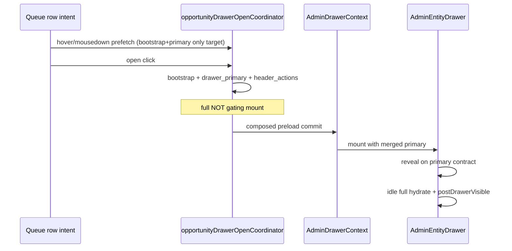

# AdminV2 Drawer Production Pass — Design

**Date:** 2026-05-22  
**Status:** Cards 0–2 implemented (2026-05-22); Cards 3–5 pending  
**Sprint type:** Perceived performance + orchestration — **not** AdminV2 redesign, queue doctrine change, or schema work.

**Authority (read order):**
- [`adminv2_drawer_performance_hardening_phase0.md`](./adminv2_drawer_performance_hardening_phase0.md) — drawer audit + phase-0 closeout
- [`adminv2_performance_scope_lock.md`](./adminv2_performance_scope_lock.md) — Lane D drawer + global doctrine
- [`adminv2_dept_runtime_closeout_handoff.md`](./adminv2_dept_runtime_closeout_handoff.md) — `/dept` locked reference
- [`adminv2_work_unit_runtime_cards_1_3_plan.md`](./adminv2_work_unit_runtime_cards_1_3_plan.md) — WU bootstrap doctrine

**Contract tests (must stay green; extend only when contracts change):**  
`adminV2NavigationContracts`, `adminV2QueueRowClick`, `adminV2WorkUnitLaneLocalState`, `adminV2DrawerLoadingCoherence`, `opportunityDrawerQueuePreviewSeed`, `adminV2LoadingGeometry`, `opportunityDrawerOpenCoordinator`, `opportunityDrawerIntentPrefetch`, `opportunityDrawerFirstPaintContract`, `opportunityDrawerLayoutStability`, `workUnitOperationalBootstrap` (when WU cache touches bootstrap).

---

## Sprint objective

Make AdminV2 record work feel **production-grade**:

1. Drawer opens as **one finished coherent surface**.
2. Drawer tabs switch **without** shell resizing, remount flashes, or global loading.
3. Work-unit queue/filter pills swap record lists **instantly** when preloaded.

This is a **perceived-performance and orchestration** sprint. Do not redesign AdminV2. Do not change queue doctrine. Do not introduce schema changes unless design review proves absolutely necessary.

---

## Binding doctrine (carry forward)

| Rule | Meaning |
|------|---------|
| **No partial drawer assembly** | Do not mount drawer body until minimum coherent reveal contract is met |
| **No route-wide skeleton replacement** | Shell-first navigation; oper-region / lane loaders only |
| **Queues are previews** | Row selection ≠ entity truth; drawer via entity APIs |
| **Bootstrap is not mutation truth** | Saves/workflows use entity/full paths + existing gates |
| **`/dept` locked runtime** | Canonical premium template — do not regress |
| **Org scoping / RLS / permissions / audit** | Unchanged |

---

## 1. Current-state summary

Phase 0 (2026-05-20) closed “good enough for staging” with composed open, `drawer_primary`, request suppression, and layout stability locks. **Production pass** closes the gap between staging intent and operator perception on three surfaces.

### Plain-language problem

**Drawer reveal is still heavier than “primary-only.”**  
In-drawer coordinated reveal already gates on `drawer_primary` (`opportunityDrawerCoordinatedRevealReady` → `opportunityPrimaryHydrateApplied`). However:

- **Pre-mount composed open** (`loadOpportunityDrawerComposedOpen`) still parallel-fetches `surface=full` and blocks overlay dismissal on `fullEntity` **or** `enrichmentHeldUntilInteraction` when full fails. Cold open critical path remains `max(bootstrap, primary, full, header_actions)` on non-warm paths (~900–1100ms+ for full).
- **`postDrawerVisible` enrichment** waits for `opportunityFullRecordHydrateApplied` on the bootstrap path before firing idle secondary fetches (activity-signal, deletion-eligibility, tours, packets, oper strip). That is correct for suppression but means **above-fold sections tied to full** (inquiry children, right summary column, enrichment layout) can still reshape after the operator believes the drawer is “open.”
- **Layout freeze** (`opportunityDrawerAboveFoldLocked`) defers some reshapes until scroll/idle (~2.4s), but does not eliminate post-reveal geometry changes from full merge + secondary mounts.

**Late post-reveal requests still reshape content.**  
Pass 3 removed pre-reveal storms; remaining risk is **post-reveal** work keyed off `postDrawerVisibleKey` and `opportunityDrawerSecondaryReady` (requires full on bootstrap path): tours, enrollment-packets, oper trust strip, section intersection actions, `relationship_member_persons` overlay. Any fetch that updates overview-adjacent layout after reveal violates the production contract.

**Tab switches likely remount and refetch.**  
`AdminEntityDrawer` renders tab bodies with `{drawerTab === "…" && …}` — inactive tabs **unmount**. Switching overview → communications → activity tears down overview subtree and mounts comms/activity cold. Tab-local `useEffect` hooks (e.g. `drawerTab === "related"`) refetch on each visit. Opportunity workflow comms is tab-gated (good) but **first visit still pays full comms load** and may shift body min-height (`ADMINV2_DRAWER_*` reserves exist for bootstrap, not per-tab panel cache).

**WU pills still wait on network instead of cache.**  
WU operational bootstrap bundles `primary_lane` + unconditional `queue.attention` when NA queue exists in definition (Cards 1–3 plan shipped server-side). Client still:

- Runs `fetchQueueItems` on `selectedQueueKey` change via effect (after `wuQueueLaneAuthorityReady`) unless `skipNextQueueFetchEffectRef` / `suppressQueueFetchEffectOnceRef` — tab change sets skip but **attention bucket select always `force: true`**.
- Adjacent-lane prefetch (`requestIdleCallback`, max **2** keys) is opportunistic, not a pill-switch cache.
- No keyed in-memory lane store `(workUnitId, laneKey, bucketKey)` — pill click often shows prior lane until fetch completes or empty flash.

### Audit anchors (phase 0)

| Symptom | Root cause (settled) |
|---------|----------------------|
| Reveal feels ~1.1s+ | Composed open + enrichment gates still treat `full` as first-class; bootstrap ~680–790ms finishes before full ~900–1100ms |
| Sections pop after open | Full merge mounts children/right column; `postDrawerVisible` after full |
| Tab switch “reloads” drawer | Conditional tab mount + tab-scoped effects |
| Pill switch lag | Network-bound `fetchQueueItems`; limited adjacent prefetch |

---

## 2. Proposed architecture

Three explicit contracts. Each lists **required before mount**, **allowed after mount**, and **must not run until** interaction signals.

---

### Contract A — Drawer reveal

#### Design target

- **Cold open** waits only for minimum coherent **`drawer_primary`** reveal bundle (+ bootstrap presentation shell + header actions contract).
- **`surface=full`** becomes **background enrichment** — never blocks first paint or composed mount except where mutation correctness requires full graph (existing save gates).
- **Above-fold layout reserves** are fixed **before** drawer mount (header tab strip, title rail `min-h`, single-column inquiry summary, timeline reserve).
- **No section** may change header chrome or above-fold geometry after reveal (right rail, BOS/oper strip, 1→2 column flip, children section expand).

#### Required before drawer mount

| Data | Source | Notes |
|------|--------|-------|
| Bootstrap presentation shell | `GET …/drawer-operational-bootstrap` | Layout mode, `record_header_actions` hints, oper preview — not mutation truth |
| Primary entity row | `GET …/entity/opportunities/:id?surface=drawer_primary` | `_record_surface`, `_identity` lite block, overview-visible field subset, status display |
| Header actions resolved | `record_header` actions URL from primary + bootstrap | Slot map for title rail |
| Queue preview seed | Row / open intent | Stable title during overlay |
| Above-fold geometry tokens | `opportunityDrawerFirstPaintContract` + `opportunityDrawerLayoutStability` | Single-column, collapsed deferred sections |

#### Allowed after drawer mount (idle / interaction)

| Data | When |
|------|------|
| `surface=full` | `scheduleAdminV2BackgroundWork` immediately after primary reveal; never blocks overlay |
| `drawer_secondary` segments (future) | Same idle queue as full — attention, OCM, children graph, relationship_displays |
| Tours, packets, oper strip | Intersection or below-fold unlock — **after** `postDrawerVisible` + above-fold unlock |
| Tab-local payloads | Tab focus only (Contract B) |
| Edit option lists | `isEditing` or field focus |

#### Suppressed until signal

| Fetch | Gate |
|-------|------|
| Communications threads/bindings | Communications tab `active` |
| Activity-signal, workflow-runs | Activity tab or explicit below-fold |
| `status-options`, `*-options`, pipeline-stages, verticals | Edit/focus |
| Field-definitions for children | Edit or children section expand |
| Section `record_section` actions | Intersection + reveal + (full **or** primary-safe stub policy) |
| `relationship_member_persons` | Full applied + `postDrawerVisible` |

#### Key module boundaries



| Module | Role in Contract A |
|--------|-------------------|
| `web/lib/admin/opportunityDrawerOpenCoordinator.ts` | **Change:** composed ready = bootstrap + primary contract + header actions; drop full from pre-mount gate |
| `web/contexts/AdminDrawerContext.tsx` | Hold deferred open params; commit preload without waiting for full |
| `web/components/admin/AdminEntityDrawer.tsx` | Reveal gates, enrichment idle queue, section mount policy |
| `web/lib/admin/drawer/opportunityDrawerFirstPaintContract.ts` | Primary contract predicates; first-paint section allowlist |
| `web/lib/admin/drawer/opportunityDrawerLayoutStability.ts` | Above-fold lock; ignore full-driven layout flips while locked |
| `web/lib/admin/opportunityDrawerIntentPrefetch.ts` | **Change:** warm bootstrap + primary; full optional background warm |
| `web/lib/admin/opportunityEntityRecord.ts` | `drawer_primary` / `drawer_secondary` server slices; dedupe bootstrap layout handoff |
| `web/lib/admin/opportunityDrawerHydrateGuards.ts` | Per-open once guards for primary/full |

#### Correctness gates (unchanged)

- Block save/mutations on fields requiring full graph until `opportunityFullRecordHydrateApplied` or explicit refetch.
- Attention-driven header actions stay disabled or preview until `_operational_attention` merges.

---

### Contract B — Drawer tabs

#### Design target

- **Tab shell never resizes** — fixed tab strip geometry (`DrawerRecordTabStripGateSkeleton` height = live strip); body uses **per-tab `min-height`** from `adminV2LoadingGeometry` (new constants: `ADMINV2_DRAWER_TAB_PANEL_MIN_H`).
- **Tab content cached** for the open drawer session (`drawer.type` + `drawer.id` key).
- **First tab visit** may show tab-local skeleton inside panel bounds only — no `drawerGateLoading`, no header/tab strip skeleton swap.
- **Overview data not refetched** when opening comms/activity/related.
- **Comms never blocks overview reveal** — already tab-gated; enforce no overview-level comms embed on AdminV2 workflow path.

#### Current behavior (audit)

| Behavior | Today |
|----------|--------|
| Tab body mount | Conditional render — **unmount** on leave |
| Overview | Re-renders when `overviewData` changes; subtree destroyed when leaving overview |
| Comms | `CommunicationsDrawerSection` mounts only when `drawerTab === "communications"` |
| Related / activity | `useEffect` when tab active — refetch each visit |
| Global loading | `drawerGateLoading` can disable tab buttons during hydrate |
| Tab strip | Hidden until `opportunityDrawerOverviewRevealReady` on inquiry workflow |

#### Proposed tab model

**Option chosen:** **Keep mounted + hidden** for visited tabs; **lazy first mount** on first selection; **session cache** in drawer ref map:

```typescript
type DrawerTabSessionCache = {
  overviewSnapshot: Record<string, unknown> | null; // pointer to live overviewData — no refetch
  tabVisited: Set<DrawerTabKey>;
  tabPaneMounted: Set<DrawerTabKey>;
};
```

- **Overview** stays authoritative for entity row; other tabs read entity id + tab APIs only.
- **Comms / activity / related / documents** mount once per drawer open; `display: none` or `hidden` + `aria-hidden` when inactive (preserve scroll position optional v1).
- **Do not** use React Query global cache for entity overview — reuse in-memory drawer state + existing `dedupeAdminFetch` for tab routes.

**Fixed geometry rules**

| Element | Rule |
|---------|------|
| Tab strip | Always `min-h-[2.875rem]` when visible; no swap skeleton → live strip after reveal |
| Tab panel container | `min-h: ADMINV2_DRAWER_TAB_PANEL_MIN_H` (proposed **22rem** workflow opportunity) |
| First visit skeleton | Inside panel only; `aria-busy` on panel, not drawer root |
| Tab switch | No change to `drawerGateLoading`; no `AdminV2DrawerLoadingState` for whole body |

#### Likely files

| File | Change |
|------|--------|
| `web/components/admin/AdminEntityDrawer.tsx` | Tab panel wrapper; mount cache; remove overview refetch on tab change |
| `web/components/admin/communications/CommunicationsDrawerSection.tsx` | Honor `active` without unmount teardown storms |
| Activity / related drawer child components | Gate fetch on first mount + stale-while-revalidate within session |
| `web/lib/ui-v2/adminV2LoadingGeometry.ts` | Tab panel min-height + test |
| `web/tests/admin/adminV2DrawerLoadingCoherence.test.ts` | Tab shell geometry + no global gate on tab switch |

---

### Contract C — WU filter pills

#### Design target

- Pill click swaps list from **client cache** when `(workUnitId, laneKey, bucketKey)` hit.
- **Initial WU load** paints **primary lane** first (bootstrap `primary_lane` — already server contract).
- **Secondary lane bundle** preloads other pill keys in background after primary settle.
- **Pagination** may network-fetch; **pill switching may not block** on network when cache warm.
- Cache key: `(workUnitId, laneKey, bucketKey, viewScopeFingerprint)` where `viewScopeFingerprint` encodes site filter + unmapped mode.

#### Current pill / fetch path

```text
User clicks pill → handleQueueTabChange / handleAttentionBucketSelect
  → setSelectedQueueKey / attentionBucketKey
  → skipNextQueueFetchEffectRef = true (tabs only; bucket select always force fetch)
  → useEffect [selectedQueueKey, …] → fetchQueueItems unless suppressed
Adjacent idle prefetch: up to 2 neighbor queue keys (not bucket-aware)
Bootstrap: operational-bootstrap applies primary_lane + queue.attention metadata
```

#### Proposed bundle shape (preload)

Extend bootstrap **or** post-bootstrap client bundle (prefer server `deferred_lane_previews` in bootstrap response v2 — **no schema**; optional JSON field on existing bootstrap):

```typescript
type WorkUnitLanePreviewBundle = {
  work_unit_id: string;
  scope_fingerprint: string;
  lanes: Array<{
    lane_key: string;       // queue key e.g. pipeline_total | needs_attention
    bucket_key: string | null;
    items: AuthoritativeQueueRow[]; // ≤20 per lane
    total_omitted?: boolean;
    fetched_at: number;
  }>;
};
```

**Population strategy**

| Phase | Action |
|-------|--------|
| P0 (bootstrap) | `primary_lane` + summaries + `queue.attention` (existing) |
| P1 (idle after `wuQueueLaneAuthorityReady`) | Background fetch `deferred_queue_keys` from bootstrap summaries (server already emits) — fill cache |
| P2 (pill click) | Cache hit → swap `queueItems` synchronously; cache miss → quiet row refresh (keep prior rows visible, no empty lane) |
| P3 (stale-while-revalidate) | If cache age > TTL (e.g. 60s) or `adminv2:opportunity-updated`, show cached rows + subtle revalidate |

#### Memory cap

- LRU per `workUnitId`: max **8** lane entries, max **20** rows each (~160 rows).
- Evict on WU navigation (`useLayoutEffect` purge — extend existing stale purge).
- Do not persist to `sessionStorage` (scope-sensitive counts doctrine).

#### Likely files

| File | Change |
|------|--------|
| `web/app/adminV2/workspace/dept/.../work-unit/[workUnitId]/page.tsx` | Lane cache module; pill handlers; effect short-circuit |
| `web/lib/workspace/loadWorkUnitOperationalBootstrap.ts` | Optional `lane_previews[]` for deferred keys |
| `web/app/api/admin/work-units/[id]/operational-bootstrap/route.ts` | Bundle deferred lane previews (server parallel, cap rows) |
| `web/lib/queues/QueueService.ts` | Shared row builder for bootstrap + cache refresh |
| `web/tests/admin/adminV2WorkUnitLaneLocalState.test.ts` | Pill switch uses cache; no empty flash |

**Queue doctrine:** Cached rows remain **previews**; drawer open still uses entity API + preview seed.

---

## 3. Phased implementation plan

Small PR/card slices. **Do not start Card 2 until Card 1 is merged and measured.**

---

### Card 0 — Design lock and instrumentation plan — **DONE**

| Field | Content |
|-------|---------|
| **Files** | This doc; `web/lib/perf/adminV2DrawerPerf.ts` |
| **Shipped** | `[perf.drawer.open]` phases: `bootstrap_ready`, `drawer_primary_ready`, `header_actions_ready`, `composed_reveal_ready`, `full_hydrate_ready`, `post_reveal_enrich_start`, `post_reveal_enrich_end` |
| **Tests** | Contract tests in `opportunityDrawerOpenCoordinator.test.ts` |

---

### Card 1 — Drawer reveal gate moves from full to primary — **DONE**

| Field | Content |
|-------|---------|
| **Files** | `opportunityDrawerOpenCoordinator.ts`, `AdminDrawerContext.tsx`, `OpportunityDrawerOpenCoordinator.tsx`, `opportunityDrawerIntentPrefetch.ts`, `AdminEntityDrawer.tsx` (enrich perf only), tests |
| **Shipped** | Composed open awaits bootstrap + primary + header only; `surface=full` starts in background (`peekOpportunityDrawerFullEntity` attaches warm cache only); `prefetch_hit` = bootstrap + primary warm |
| **Acceptance** | Overlay dismisses without awaiting full; in-drawer reveal still `drawer_primary`-gated; background full hydrate unchanged |
| **Tests** | `opportunityDrawerOpenCoordinator.test.ts`, `adminV2DrawerLoadingCoherence.test.ts` |
| **Rollback risk** | **Medium** — revert coordinator `Promise.all` + composed ready full check |

**Card 1 exit — what still blocks reveal vs enriches post-reveal (target state)**

| Blocks reveal (after Card 1) | Post-reveal enrichment (background) |
|------------------------------|-------------------------------------|
| Bootstrap shell not applied | `surface=full` hydrate |
| `drawer_primary` not merged / contract fail | `_operational_attention`, full children graph |
| Header actions unresolved | Tours, packets, oper strip (intersection) |
| Primary contract timeout (1400ms cap) | `postDrawerVisible` secondary fetches |
| | Tab-local comms/activity/related (Card 3) |

---

### Card 2 — Suppress/relocate late drawer fetches — **DONE**

| Field | Content |
|-------|---------|
| **Files** | `AdminEntityDrawer.tsx`, `opportunityDrawerRevealReadiness.ts`, `opportunityDrawerLayoutStability.ts`, `adminV2DrawerPerf.ts`, `opportunityEntityRecord.ts` (dedupe note), tests |
| **Shipped** | `postDrawerVisible` after primary contract (not full); explicit readiness flags; `secondaryReady` = below-fold window; oper/packets/children gated on `fullBoundEnrichmentReady`; activity-signal no longer waits for full; layout dedupe deferred (comment in entity record) |
| **Tests** | `opportunityDrawerRevealReadiness.test.ts`, `adminV2DrawerLoadingCoherence.test.ts`, `opportunityDrawerLayoutStability.test.ts` |
| **Rollback risk** | **Medium-high** — revert postDrawerVisible effect + secondary ready effect |

---

### Card 3 — Stable drawer tab panes and tab cache — **DONE**

| Field | Content |
|-------|---------|
| **Files** | `AdminEntityDrawer.tsx`, `opportunityDrawerTabSession.ts`, `adminV2LoadingGeometry.ts`, `adminV2DrawerLoadingCoherence.test.ts`, `opportunityDrawerTabSession.test.ts`, `adminV2LoadingGeometry.test.ts` |
| **Shipped** | Session visit `Set` + keep-mounted hidden panes (`renderOpportunityWorkflowTabPane`); `ADMINV2_DRAWER_TAB_PANEL_MIN_H` on pane host + body; `selectDrawerTab` on inquiry strip; visit set reset on drawer close; activity fetch tab-gated; overview panel via shared IIFE + mount cache (no remount on tab return) |
| **Tests** | `opportunityDrawerTabSession.test.ts`, extended `adminV2DrawerLoadingCoherence`, `adminV2LoadingGeometry` tab panel geometry |
| **Rollback risk** | **Low-medium** — memory per open drawer; verify drawer close clears cache |

---

### Card 4 — WU pill cache design and preload bundle

| Field | Content |
|-------|---------|
| **Files** | `work-unit/[workUnitId]/page.tsx`, `loadWorkUnitOperationalBootstrap.ts`, operational-bootstrap route, `adminV2WorkUnitLaneLocalState.test.ts`, optional `workUnitLanePreviewCache.ts` |
| **Work** | Client `Map` cache keyed by `(workUnitId, laneKey, bucketKey, scope)`; bootstrap idle fill for `deferred_queue_keys`; pill click synchronous swap on hit; miss = stale-while-revalidate; bucket select uses cache when bucket preview exists |
| **Acceptance** | Pill switch on preloaded lane: **0** required row fetch before paint; no empty lane flash; attention bucket switch instant when bootstrap included bucket rows |
| **Tests** | `adminV2WorkUnitLaneLocalState.test.ts`, `workUnitOperationalBootstrap.test.ts`; `adminV2QueueRowClick` unchanged |
| **Rollback risk** | **Medium** — stale preview until invalidation; mitigated by event listener + TTL |

---

### Card 5 — Perf logging, tests, and closeout doc update

| Field | Content |
|-------|---------|
| **Files** | `adminV2DrawerPerf.ts`, `workUnitOperationalBootstrapPerf.ts`, this doc §5 table, `adminv2_drawer_performance_hardening_phase0.md` link-back |
| **Work** | Fill before/after table on staging; CI contract suite; manual QA matrix from scope lock §7.4 |
| **Acceptance** | All contract tests green; §5 table populated; sprint closeout lists remaining non-blocking server slimming |
| **Tests** | `cd web && npx tsc --noEmit`; `npm run test -- tests/admin/adminV2DrawerLoadingCoherence.test.ts tests/admin/adminV2QueueRowClick.test.ts tests/admin/adminV2WorkUnitLaneLocalState.test.ts tests/admin/opportunityDrawerOpenCoordinator.test.ts` |
| **Rollback risk** | None |

---

## 4. Required tests / verification

### Minimum (every card)

```bash
cd web && npx tsc --noEmit
```

```bash
cd web && npm run test -- \
  tests/admin/adminV2DrawerLoadingCoherence.test.ts \
  tests/admin/adminV2QueueRowClick.test.ts \
  tests/admin/adminV2NavigationContracts.test.ts \
  tests/admin/opportunityDrawerOpenCoordinator.test.ts \
  tests/admin/opportunityDrawerIntentPrefetch.test.ts \
  tests/admin/opportunityDrawerQueuePreviewSeed.test.ts \
  tests/admin/drawer/opportunityDrawerFirstPaintContract.test.ts \
  tests/admin/drawer/opportunityDrawerLayoutStability.test.ts
```

### Contract extensions (add only when behavior changes)

| Contract | Assertion |
|----------|-----------|
| Drawer reveal | Composed open does **not** require `surface=full` |
| Post-reveal | No above-fold reshaping fetches before layout unlock (Card 2) |
| Tab switch | Drawer shell `min-height` / tab strip unchanged (Card 3) |
| WU pill | Cached lane payload used when key hit (Card 4) |

### Suggested manual QA (staging)

1. WU queue row → drawer → close: one overlay phase; overview readable without full wait.  
2. Switch drawer tabs 5×: no shell jump; comms loads inside panel only first time.  
3. WU pill switch across pipeline stages: instant when preloaded; quiet refresh on stale.  
4. Site filter narrow: cache miss refetches scoped lanes; no org-wide stale rows.  
5. Save in drawer: queue invalidation refreshes without emptying lane.

---

## 5. Before/after measurement table

Capture on staging with `[perf.drawer.open]`, `[perf.queue.rows]`, `[wu-bootstrap-perf]`, `__WS_PERF_DEBUG__`. Fill **After Card 1** and **After Card 5** columns during implementation.

| Scenario | Phase 0 baseline (approx) | Before (2026-05-22) | After Card 1 | After Card 5 | Notes |
|----------|---------------------------|---------------------|--------------|--------------|-------|
| Cold drawer open (overlay → mount) | — | `max(bootstrap+primary+full+hdr)` ~1.2–1.5s | _TBD_ | _TBD_ | Target: ~900ms p75 |
| Warm drawer open (prefetch hit) | — | Often &lt;200ms anti-flicker | _TBD_ | _TBD_ | |
| Drawer bootstrap | 680–790ms | same | _TBD_ | _TBD_ | |
| Drawer primary | — | parallel | _TBD_ | _TBD_ | |
| Drawer full (background) | 900–1100ms | no longer gates mount | _TBD_ | _TBD_ | |
| First tab switch | — | remount + fetch | _TBD_ | _TBD_ | Card 3 |
| Repeated tab switch | — | remount + fetch | _TBD_ | _TBD_ | Card 3 |
| WU primary lane load | WU bootstrap 1.7–2.2s | bootstrap `primary_lane` | _TBD_ | _TBD_ | |
| WU preloaded pill switch | — | network-bound | _TBD_ | _TBD_ | Card 4 |

**Phase count success metric:** Fewer distinct operator-perceived phases per action (target ≤2 for drawer open, ≤1 for pill switch when cached).

---

## Document control

| Step | Artifact |
|------|----------|
| Phase 0 audit | [`adminv2_drawer_performance_hardening_phase0.md`](./adminv2_drawer_performance_hardening_phase0.md) |
| **This doc** | Design lock — production pass |
| Card 0–1 | Implementation (next PR) |
| Card 2+ | Sequential per §3 |

**Suggested commit message (doc only):**  
`docs: AdminV2 drawer production pass design (contracts A/B/C + cards 0–5)`
