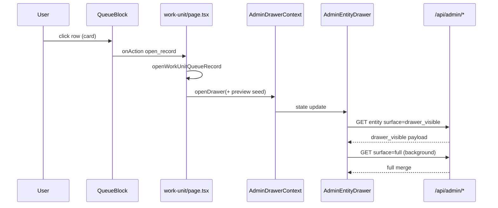

# AdminV2 Performance Deep-Dive — Phase 0 Audit

**Date:** 2026-05-19  
**Status:** Audit only (no optimization PR in this phase)  
**Scope:** `/adminV2/workspace` hierarchy, shared shell, queue/drawer open flow  

**Related:** Prior rebuild notes and Build Pass 1/2 history live in [`adminv2_performance_rebuild_audit.md`](./adminv2_performance_rebuild_audit.md). **Normative contracts (Phase 1):** [`adminv2_performance_phase1_navigation_and_interaction_contracts.md`](./adminv2_performance_phase1_navigation_and_interaction_contracts.md). **Load-path plan (Phase 2):** [`adminv2_performance_phase2_load_path_architecture.md`](./adminv2_performance_phase2_load_path_architecture.md). This document is the **formal Phase 0** map for the deep-dive sprint: evidence-based, navigation-safe, optimization-ready.

**Regression context:** A prior optimization pass broke first-click navigation (click interception, `preventDefault` misuse, shallow routing, `history.replaceState` churn, span-vs-Link patterns, competing route stores, overlay capture). Navigation has been **repaired**. All future work must preserve the contracts documented here and in enforcement tests.

---

## Executive summary

AdminV2 workspace UX is **client-orchestrated** after a thin server auth bootstrap. Perceived speed depends on:

1. **Navigation mode split** — shell/dept drill-in uses **hard** `location.assign`; workspace root dept tiles use **soft** Next `<Link>`.
2. **Phased client fetches** — sessionStorage shell seeds, then parallel API waves, then idle-deferred supplements.
3. **Local queue tab state** on work-unit (no post-mount URL sync).
4. **Staged drawer hydrate** — `drawer_visible` → `full` with queue-row preview seed.

Primary latency is **network-bound fan-out** (growth dept KPIs, dept parallel panels, work-unit bootstrap + rows + drawer), not React reconciliation alone. The largest **regression risk** is reintroducing URL/state competition around navigation and drawer close.

---

## 1. Performance map by page

### 1.1 Route & layout stack (all workspace routes)

| Layer | File | Role | Blocks paint? |
|-------|------|------|----------------|
| App layout | `web/app/adminV2/layout.tsx` | Poppins font + `AdminV2Shell` | Font swap only |
| Shell | `web/app/adminV2/components/AdminV2Shell.tsx` | Sidebar, TopNav (`Suspense`), site filter gate, AI command surface, ambient layers | TopNav suspends to 48px fallback |
| Workspace layout (RSC) | `web/app/adminV2/workspace/layout.tsx` | `getAdminAuth`, org name, viewer TZ, operational TZ, `getAdminAccessContextCached`, fingerprint | **Yes** — `force-dynamic`; 4+ server round-trips before client tree |
| Workspace providers | `web/app/adminV2/workspace/AdminV2WorkspaceClientProviders.tsx` | Auth, labels, TZ, org, **drawer provider + `AdminEntityDrawer` portal sibling** | Client hydration of deep provider stack |
| Route `loading.tsx` | `web/app/adminV2/workspace/loading.tsx`, `dept/.../loading.tsx` | Cold shells match geometry | Brief RSC transition shell |

**Provider nesting (workspace):** `AdminAuthProvider` → `AdminVerticalProvider` → `EntityLabelsProvider` → TZ providers → `WorkspaceOrgProvider` → `AdminDrawerProvider` → scroll surface + **`AdminEntityDrawer`** (always mounted).

### 1.2 `/adminV2/workspace` (org index)

| Aspect | Detail |
|--------|--------|
| Page | `web/app/adminV2/workspace/page.tsx` (**client component**) |
| RSC | None on page body — all data via client fetch |
| Critical path | `GET /api/admin/departments` + `GET /api/admin/work-units` (parallel, `dedupeAdminFetch`) |
| First useful paint | `buildWorkspaceQuickRollup` → `WorkspaceRootShell` with dept tiles |
| Background | Per growth-slice dept: `opportunity-lifecycle-kpis` + `pipeline-exact-count` (`mapWithConcurrency`, limit 3); KPI placements `GET /api/admin/workspace-kpi-placements?surface=workspace` |
| Cache | `readWorkspaceRootCache` / `writeWorkspaceRootCache` (`web/lib/workspace/adminV2WorkspaceSessionCache.ts`) — `useLayoutEffect` shell seed |
| Skeleton | `WorkspaceRootColdShell` while `loading` |
| Navigation out | Dept tiles: `WorkspaceRootDepartmentGrid` → Next `<Link prefetch={false}>` + `markWorkUnitNavigationStart` only (**soft nav**) |

**Instrumentation:** `[perf.workspace.load]` phases: `shell_seed`, `critical_deps`, `rollup_refined`, `kpi_placements_ready`; `alloyPerfSet("workspace_start"|"workspace_ready")`.

### 1.3 `/adminV2/workspace/dept/[departmentId]`

| Aspect | Detail |
|--------|--------|
| Page | `web/app/adminV2/workspace/dept/[departmentId]/page.tsx` (~1.1k LOC client) |
| Blocking gate | `departmentPageBlockingLoad` = `deptLoading` only → `DepartmentWorkspaceColdShell` |
| Critical path | Parallel: `GET /api/admin/departments/:id`, `GET /api/admin/work-units?department_id=` → shell ready |
| Post-shell parallel | `work-unit-queue-summaries` (site-scoped URL), `opportunity-attention-preview` |
| Deferred | Workflow panels via `requestIdleCallback` (timeout 2s) |
| Pipeline UI | `resolveDeptPipelineExecSurface` — parallel lane discovery (`web/lib/workspace/resolveDeptPipelineExecSurface.ts`) |
| KPI strip | Placements fetch (TTL dedupe 8s); baseline until `deptPlacementRows` defined |
| Paired panels | Throughput + Needs Attention coordinated skeleton (`DeptPairedOperQueuesSkeleton`) until `deptThroughputOperReady` && `deptAttentionOperReady` |
| Cache | `readDepartmentPageCache` seeds dept + WU list; **summaries intentionally not hydrated** from session (scope safety) |
| Drill-out | `DeptOperConsoleQueueRow`: `<a href>` + `preventDefault` + `adminV2CommitNavigation` (**hard nav**) |

**Instrumentation:** `[perf.dept.load]` — `shell_seed`, `shell_ready`, `summaries_ready`, `kpis_ready`, `actions_ready`.

### 1.4 `/adminV2/workspace/dept/[departmentId]/work-unit/[workUnitId]`

| Aspect | Detail |
|--------|--------|
| Page | `web/app/adminV2/workspace/dept/[departmentId]/work-unit/[workUnitId]/page.tsx` (~3.1k LOC client) |
| URL read | **One-shot** `readWorkUnitInitialLocationParams()` on bootstrap — **no** `useSearchParams`, **no** `scheduleWorkUnitLaneUrlSync` on page |
| Tab state | `selectedQueueKey`, `laneUnmappedOnly`, `attentionBucketKey` — local React only after mount |
| Bootstrap parallel | `work-units/:id`, `departments/:id`, queue list route; row fetch may start before WU JSON returns (`resolveNavTimeRowQueueKey`) |
| Row fetch | `fetchQueueItems` — client LRU (`queueRowClientCache`), lease dedupe, `prefetchOnly` adjacent lanes (idle-gated) |
| Tab change | `selectedQueueKey` effect → refetch (skippable via sig/lease); prior rows can stay visible during refresh |
| Deferred | Workflow KPIs, queue row actions, right-rail actions, adjacent lane prefetch — after `primaryLaneRowsSettledOnceRef` |
| Presentation | Builds `WorkUnitWorkspaceModel` → `WorkUnitWorkspace` → `QueueBlock` |
| Drawer open | `openWorkUnitQueueRecord` → `openDrawer` with `opportunityQueuePreviewSeed` when row in buffer |

**Instrumentation:** `alloyPerfSet` markers (`work_unit_detail_req`, `summaries_req`, …); `[perf.queue.rows]` client/server; queue tab perf via `pendingQueueTabPerfRef`.

### 1.5 `AdminEntityDrawer` (global, workspace-mounted)

| Aspect | Detail |
|--------|--------|
| Component | `web/components/admin/AdminEntityDrawer.tsx` (~13k LOC) |
| Shell | `web/components/admin/Drawer.tsx` — backdrop `pointer-events-none`, panel z=70, shell chrome z=100 |
| Opportunity surfaces | `drawer_visible` (fast shell) → background `full`; `drawer_initial` legacy path; member graph overlay |
| Tabs | Local `drawerTab` state — **not in URL** |
| Server | `web/lib/admin/opportunityEntityRecord.ts` — surface-specific parallel DB reads |
| Coherence | `opportunityDrawerShellSettled` gates header subtitle/actions skeleton |

**Instrumentation:** `[timing][opportunity-api-visible]`, `[perf.drawer.full_hydrate]`.

### 1.6 Shared shell / sidebar / top nav

| Surface | File | Data / behavior |
|---------|------|-----------------|
| Sidebar | `web/app/adminV2/components/Sidebar.tsx` | Collapsed by default; expanded tree fetches depts + WUs (`dedupeAdminFetch`) |
| Nav links | `web/app/adminV2/components/navigation/AdminV2NavLink.tsx` | Native `<a>`, `preventDefault` + `adminV2CommitNavigation` |
| Top nav | `web/app/adminV2/components/TopNavBar.tsx` | Queue tab = no-op `<span>` when already on work-unit route |
| Breadcrumbs | `web/components/admin/workspace/WorkspaceChrome.tsx` | Parent crumbs = `AdminV2NavLink` |
| Prefetch policy | `web/app/adminV2/components/navigation/adminV2HeavyRoutePrefetch.ts` | `prefetch={false}` on heavy `<Link>` surfaces |

### 1.7 Queue tabs, rows, drawer open flow



**Queue row contract:** `QueueBlock` uses `role="button"` div cards — **not** `<Link>`. `preventDefault` only on Space/Enter (`onKeyDown`). Quick-action chips use `stopPropagation` so they do not fire row open.

---

## 2. Transition timing map

Phases are **logical**; capture baselines in staging with `window.__WS_PERF_DEBUG__ = true` and console tags below.

### 2.1 Shell navigation (sidebar / breadcrumb / dept card)

| Phase | Trigger | Expected mechanism | Typical bottleneck |
|-------|---------|-------------------|-------------------|
| T0 click | User primary-click | `preventDefault` (shell only) → `adminV2CommitNavigation` | — |
| T1 nav start | `adminV2BeforeRouteNavigation` | `markWorkUnitNavigationStart`, optional `closeDrawer` | Drawer close + full reload |
| T2 document load | `window.location.assign` | **Full document navigation** (not soft transition) | RSC layout auth bundle |
| T3 first paint | New document | `workspace/layout.tsx` server work | `getAdminAuth` + access context + org/TZ |
| T4 client hydrate | Providers + page mount | Session cache `useLayoutEffect` seed or cold shell | Provider depth |
| T5 useful content | Page fetch wave completes | Dept/WU APIs, summaries, rows | API fan-out |

**Note:** Hard nav avoids cancelled soft transitions but pays **full layout cost** every hop.

### 2.2 Workspace root → dept (soft Link)

| Phase | Mechanism |
|-------|-----------|
| T0–T1 | Next `<Link>` client transition (no `adminV2CommitNavigation`) |
| T2 | RSC `loading.tsx` may flash `WorkspaceRootColdShell` / dept cold shell |
| T3–T5 | Dept page client fetches (same as §1.3) |

### 2.3 Work-unit queue tab change (no route change)

| Phase | Mechanism |
|-------|-----------|
| T0 | `setSelectedQueueKey` (local) |
| T1 | `fetchQueueItems` — cache peek / lease / network |
| T2 | Prior rows may remain visible (`queueRowsBufferRef`) |
| T3 | Count badges may show pulse placeholders (`queueTabPlaceholders`) |

**No address-bar update** after mount (by design).

### 2.4 Queue row → drawer open (no route change)

| Phase | Mechanism |
|-------|-----------|
| T0 | `openWorkUnitQueueRecord` — preview seed from row buffer |
| T1 | Drawer panel mount + `drawer_visible` GET |
| T2 | Header shows seeded title/subtitle (if preview present) |
| T3 | `drawer_visible_ready` perf marker + deferred tab fetches |
| T4 | Background `full` hydrate — `[perf.drawer.full_hydrate]` |

### 2.5 Stabilization

| Surface | “Stable” means |
|---------|----------------|
| Workspace root | `workspaceRollupRefined` + `!workspaceKpiPlacementPending` |
| Dept | Both oper panels ready; KPI strip resolved from placements |
| Work-unit | `primaryLaneRowsSettledOnceRef`; queue tab badges settled |
| Drawer | `opportunityDrawerShellSettled`; `opportunityFullHydrateApplied` |

---

## 3. Top 10 bottlenecks

| # | Bottleneck | Primary files | Risk | Est. impact | Evidence |
|---|------------|---------------|------|-------------|----------|
| 1 | **Workspace layout server waterfall** — auth, org name, viewer TZ, operational TZ, access context before any page UI | `workspace/layout.tsx`, `getAdminAuthCached`, `getAdminAccessContextCached` | Low (infra) | **High** on every hard nav | `force-dynamic`; sequential awaits |
| 2 | **Hard navigation full reload** on shell/dept drill-in | `shellNavigation.ts`, `AdminV2NavLink.tsx`, `DeptOperConsoleQueueRow` | Med | **High** latency per hop; **Low** dead-click risk | Intentional tradeoff vs soft nav |
| 3 | **Workspace growth dept rollup fan-out** — 2 API calls × N growth departments | `workspace/page.tsx`, `mapWithConcurrency.ts` | Low | **High** on orgs with many growth depts | `loadWorkspaceRollup` |
| 4 | **Dept post-shell request overlap** — summaries + attention + pipeline + placements + enrollment rail | `dept/[departmentId]/page.tsx` | Low | **Med–High** | 5+ parallel routes after shell |
| 5 | **Dept summary cache miss on revisit** — session seeds geometry but always refetches counts | `adminV2WorkspaceSessionCache.ts`, dept `useLayoutEffect` | Low | **Med** perceived on return visits | Comment: scope-safe stale counts |
| 6 | **Work-unit page bootstrap + row fetch sequencing** — large client bundle + multiple parallel GETs | `work-unit/[workUnitId]/page.tsx` | Med | **High** first land | ~3k LOC; `fetchQueueItems` + summaries + WU + dept |
| 7 | **Queue tab change refetch** — even with cache, tab switches hit network without lease hit | `fetchQueueItems`, `queueRowClientCache.ts` | Med | **Med** per tab switch | `selectedQueueKey` effect |
| 8 | **Opportunity drawer full hydrate** — heavy server enrichment after visible shell | `opportunityEntityRecord.ts`, `AdminEntityDrawer.tsx` | Med | **High** drawer TTI | `[perf.drawer.full_hydrate]` |
| 9 | **`AdminEntityDrawer` monolith** — tab lazy fetches, large render tree | `AdminEntityDrawer.tsx` | Med | **Med** CPU + layout | 13k+ lines |
| 10 | **Sidebar expanded tree duplicate fetch** — depts + WUs when sidebar opens | `Sidebar.tsx` | Low | **Low–Med** | Same APIs as workspace root (deduped in-flight only) |

---

## 4. Files / functions / components (quick index)

| Concern | Location |
|---------|----------|
| Hard nav commit | `adminV2CommitNavigation`, `adminV2BeforeRouteNavigation` — `web/lib/adminV2/shellNavigation.ts` |
| Nav link | `AdminV2NavLink` — `web/app/adminV2/components/navigation/AdminV2NavLink.tsx` |
| Lane URL helpers (unused on WU page) | `scheduleWorkUnitLaneUrlSync`, `replaceWorkUnitBrowserSearch` — `web/lib/adminV2/workUnitLaneQueryUrl.ts` |
| Initial queue URL read | `readWorkUnitInitialLocationParams` — `web/lib/adminV2/workUnitInitialLocation.ts` |
| Drawer state | `AdminDrawerProvider`, pathname-close effect — `web/contexts/AdminDrawerContext.tsx` |
| Drawer UI | `Drawer`, outside mousedown — `web/components/admin/Drawer.tsx`, `web/lib/adminV2/drawerOutsideClick.ts` |
| Queue UI | `QueueBlock`, `fireQueueRowOpenRecord` — `web/app/adminV2/components/workspace/blocks/QueueBlock.tsx` |
| Queue row open handler | `openWorkUnitQueueRecord`, `onAction` — work-unit `page.tsx` |
| Fetch dedupe | `dedupeAdminFetch`, `dedupeAdminFetchWithTtl` — `web/lib/workspace/workspaceAdminFetchDedupe.ts` |
| Session cache | `adminV2WorkspaceSessionCache.ts` |
| Perf emitters | `web/lib/perf/adminV2PerfLog.ts`, `alloyPerfGlobal.ts` |
| Contract tests | `web/tests/admin/adminV2NavigationContracts.test.ts`, `adminV2QueueRowClick.test.ts`, `adminV2WorkUnitLaneLocalState.test.ts` |

---

## 5. Risk rating per bottleneck

| Bottleneck | Regression risk if “fixed” wrong | Performance upside |
|------------|----------------------------------|--------------------|
| #1 Server layout waterfall | Low | High |
| #2 Hard nav | **Critical** — soft nav without load discipline revives dead clicks | High (if soft nav made reliable) |
| #3 Growth rollup | Low | High |
| #4 Dept parallel overlap | Low–Med (race on KPI numbers) | Med–High |
| #5 Dept summary cache | **Med** — stale counts if scope not keyed | Med |
| #6 WU bootstrap | **High** — URL sync, searchParams | High |
| #7 Tab refetch | **High** — broad invalidation | Med |
| #8 Drawer hydrate | **Med** — skipping full loses data | High |
| #9 Drawer monolith | Med | Med |
| #10 Sidebar fetch | Low | Low |

---

## 6. Estimated impact (operator-facing)

| Journey | Dominant wait today | Rough relative share |
|---------|---------------------|----------------------|
| Cold login → workspace | Layout auth + dept/WU APIs + rollup background | Layout 25–35%, APIs 50–60%, render 10–15% |
| Sidebar → dept → WU | 3× full document loads + each page’s client wave | Nav reload 40–50%, WU rows 25–35%, rest 15–25% |
| WU tab switch | Row API (cache miss) | Network 70–85% |
| Row → drawer | `drawer_visible` + `full` | Visible 30–40%, full 50–60% |

*Numbers are engineering estimates for prioritization — replace with staging baselines (§8).*

---

## 7. Recommended fix order

1. **Measure** — Staging baselines per §8; enable `__WS_PERF_DEBUG__` on demo org.
2. **Server layout bundling** — Single bootstrap API or parallelize layout server fetches (no nav change).
3. **Workspace growth rollup** — Server-side aggregate endpoint or stricter concurrency/cancel (Build Pass 1 already added concurrency 3).
4. **Work-unit row cache hit rate** — Tune TTL/lease, adjacent prefetch idle timing (no URL sync).
5. **Drawer** — Keep staged hydrate; batch header actions API; defer non-overview tabs further.
6. **Dept** — Optional scoped summary cache key including site fingerprint (with tests).
7. **Soft nav experiment (last, gated)** — Only with proof soft transitions complete under load; never mix with `replaceState` tab sync.

---

## 8. Proposed acceptance metrics

| Metric | Target (staging, enrollment demo org) | How to measure |
|--------|----------------------------------------|----------------|
| Workspace `critical_deps` | p75 < 800ms | `[perf.workspace.load]` `phase=critical_deps` |
| Workspace time-to-interactive tiles | p75 < 1.2s from navigationStart | `workspace_ready` − `workspace_start` (`alloyPerfGlobal`) |
| Dept `shell_ready` | p75 < 600ms | `[perf.dept.load]` |
| WU first row paint | p75 < 1.5s from `work_unit_detail_req` | `alloyPerfSet` deltas |
| Queue tab switch (warm cache) | p75 < 300ms | `[perf.queue.rows]` `client_cache_hit=true` |
| Queue tab switch (cold) | p75 < 1.2s | `client_cache_hit=false` |
| Drawer visible shell | p75 < 500ms | `[timing][opportunity-api-visible]` |
| Drawer full hydrate | p75 < 2.5s after open | `[perf.drawer.full_hydrate]` |
| Navigation reliability | 0 failed first-clicks in 20 manual hops | Manual checklist §Validation |
| CLS (workspace) | No major jumps on KPI strip / dept paired panels | Lighthouse / Web Vitals on staging |

---

## 9. Navigation regression risk inventory

### 9.1 Enforced contracts (automated)

| Contract | Test file |
|----------|-----------|
| `adminV2BeforeRouteNavigation` never `preventDefault` | `adminV2NavigationContracts.test.ts` |
| Dept cards use `adminV2CommitNavigation` | same |
| Sidebar uses `AdminV2NavLink`, no `router.push` | same |
| Work-unit page: no `scheduleWorkUnitLaneUrlSync`, no `useSearchParams` | same + `adminV2WorkUnitLaneLocalState.test.ts` |
| Drawer closes on pathname change only | `adminV2NavigationContracts.test.ts` |
| Queue row open path exists | `adminV2QueueRowClick.test.ts` |

### 9.2 Navigation matrix (must preserve)

| Surface | Mechanism | preventDefault | replaceState |
|---------|-----------|----------------|--------------|
| Sidebar, breadcrumbs (parents) | `AdminV2NavLink` → `location.assign` | Yes (primary) | No |
| Workspace dept tiles | Next `<Link prefetch={false}>` | No | No |
| Dept oper cards | `<a>` + `adminV2CommitNavigation` | Yes | No |
| WU queue tabs | Local state | No | **No** (forbidden on page) |
| Queue rows | `openDrawer` | No (row); Space/Enter only in QueueBlock | No |
| Settings hub tiles | Soft `<Link>` | No | No |
| Settings breadcrumb parent | `AdminV2NavLink` | Yes | No |

### 9.3 Known risky patterns in tree (do not extend)

| Pattern | Location | Notes |
|---------|----------|-------|
| `history.replaceState` | `workUnitLaneQueryUrl.ts` | Helpers exist; **must not** wire back into work-unit page |
| `preventDefault` on queue row card click | `QueueBlock.tsx` | Only keyboard; card uses `onClick` → `open_record` |
| `stopPropagation` on quick actions | `QueueBlock.tsx` | Required — do not wrap row in Link |
| Command surface card nav | `commandSurfaceCardNavigation.ts` | Intentional preventDefault for in-surface actions |
| AI modal stopPropagation | `AiActivityDetailModal.tsx` | Modal only |

### 9.4 Overlay / z-index contract

- Shell chrome **z-index 100** — sidebar/settings stay clickable with drawer open.
- Drawer backdrop **pointer-events: none**; outside mousedown dismiss (`drawerOutsideClick.ts`).
- Queue rows: `adminv2-ws-wu-queue-card-interactive` — remain clickable during refresh.

---

## 10. Safe optimization opportunities

| Opportunity | Why safe | Files |
|-------------|----------|-------|
| Extend `dedupeAdminFetch` to any new admin GET | In-flight dedupe only | `workspaceAdminFetchDedupe.ts` |
| Server layout parallel awaits | No client nav change | `workspace/layout.tsx` |
| Batch growth KPI server endpoint | Removes N client calls | New API + `workspace/page.tsx` |
| Drawer comms prefetch on intent | Already patterned | `communicationsDrawerPrefetch` |
| Idle timing tuning for WU deferred supplements | Gated refs already exist | work-unit `page.tsx` |
| Stable skeleton dimensions | Reduces CLS | `*ColdShell`, `*Skeleton` components |
| Instrumentation-only PRs | No behavior change | `adminV2PerfLog.ts` |
| Queue preview seed expansion | Improves perceived drawer open | `opportunityDrawerQueuePreviewSeed.ts` |

---

## 11. Dangerous optimization areas (performance freeze doctrine)

**Forbidden without explicit justification and contract test updates:**

### Routing
- Shallow routing, `history.replaceState`, manual `popstate`, competing route stores, custom nav frameworks

### Navigation
- Replacing `<a>`/`<Link>` with `<span>`/`<motion.div>` for primary routes
- `preventDefault` on navigation without modifier-key guard
- `stopPropagation` wrappers around links
- Full-screen overlay `pointer-events: auto` under shell chrome

### Loading
- More/generic oversized skeletons that don’t match final layout
- Removing layout reservation → CLS
- Blanking content during transitions

### Drawer
- Serial mount waterfalls that reshuffle sections
- Default tab/section flash before resolver returns
- Mount/unmount thrash on stack navigation

### Queue
- Full page rerender on tab change
- Broad SWR invalidation
- Post-mount URL ↔ tab two-way sync

### Anti-patterns that often backfire
- Premature `memo` everywhere
- Duplicating URL + local + server queue state
- Aggressive `Suspense` boundaries without measured benefit
- More loading spinners instead of fewer phases

---

## Investigation detail (Phase 0 checklist)

### RSC request behavior
- Workspace **pages are client components** — RSC payload is mostly layout + shell, not page data.
- Waterfall risk concentrated in `workspace/layout.tsx` (sequential server awaits).
- No evidence of duplicate RSC **page** fetches for workspace index; soft nav to dept triggers route `loading.tsx`.

### Client fetch behavior
- `dedupeAdminFetch` / TTL variant used across workspace/dept/WU/drawer.
- Hydration: `useLayoutEffect` session seeds can skip cold skeleton; network always revalidates.
- Site filter: `workspaceViewCacheFingerprint` / `appendWorkspaceSiteToUrl` — cache keys must include scope.

### Auth/context overhead
- `getAdminAuthCached` and `getAdminAccessContextCached` use React `cache()` per request.
- Client: deep provider tree re-renders on org context changes; drawer state isolated in `AdminDrawerProvider`.

### Skeleton / layout mismatch
- Improved: dept paired skeleton row count constant; WU KPI grouped skeleton; drawer header gated on `opportunityDrawerShellSettled`.
- Remaining: workspace KPI strip pending state; dept attention panel text placeholder vs final cards.

### Blocking vs deferred data

| Must block (first paint) | Can defer | Should preload | Should stay persistent |
|--------------------------|-----------|----------------|------------------------|
| Auth / org context (layout) | Workflow KPIs (dept/WU) | Adjacent queue lane rows (idle) | Shell chrome layout |
| Dept + WU identity | Attention buckets (dept) | Comms drawer on intent | Queue row buffer during refresh |
| Queue list metadata (WU) | KPI placements | | Session shell geometry cache |
| First lane rows (WU) | Drawer `full` hydrate | | Local queue tab selection |
| `drawer_visible` for open drawer | Activity signal, deletion checks | | |

---

## Validation (Phase 0)

### Automated (audit phase — no product code changes)
```bash
cd web && npx tsc --noEmit
cd web && npx vitest run \
  tests/admin/adminV2NavigationContracts.test.ts \
  tests/admin/adminV2QueueRowClick.test.ts \
  tests/admin/adminV2WorkUnitLaneLocalState.test.ts \
  tests/admin/adminV2DrawerLoadingCoherence.test.ts \
  tests/admin/opportunityDrawerQueuePreviewSeed.test.ts
```

### Manual navigation checklist (human)
- [ ] Sidebar links — first click
- [ ] Settings links — first click
- [ ] Dept cards (workspace root) — first click
- [ ] Dept oper / work-unit cards — first click
- [ ] Queue row open — first click
- [ ] Drawer open/close
- [ ] Browser back/forward across **routes** (not queue tabs)
- [ ] No dead clicks under drawer or during queue refresh

### Baseline capture (staging — outstanding)
- [ ] Record p50/p75 for `[perf.workspace.load]`, `[perf.dept.load]`, `[perf.queue.rows]`, drawer tags on demo org
- [ ] Document in §8 table

---

## Phase 0 exit criteria

- [x] Performance map by page (§1)
- [x] Transition timing map (§2)
- [x] Top 10 bottlenecks with files, risk, impact (§3–6)
- [x] Recommended fix order (§7)
- [x] Acceptance metrics proposal (§8)
- [x] Navigation regression inventory (§9)
- [x] Safe vs dangerous optimization lists (§10–11)
- [ ] Staging baseline numbers (§8 — manual)

**Next phase:** Phase 1 — instrumentation baselines in staging, then prioritized Build Passes that respect §11 freeze doctrine.

---

## Appendix: Performance freeze doctrine (copy for PR templates)

> Do not add shallow routing, `history.replaceState` queue sync, link→span nav rewrites, drawer backdrop click capture, or post-mount `useSearchParams` on the work-unit page without updating `adminV2NavigationContracts.test.ts` and manual checklist above.

See also: [`adminv2_performance_rebuild_audit.md`](./adminv2_performance_rebuild_audit.md) for Build Pass 1/2 implementation history.
