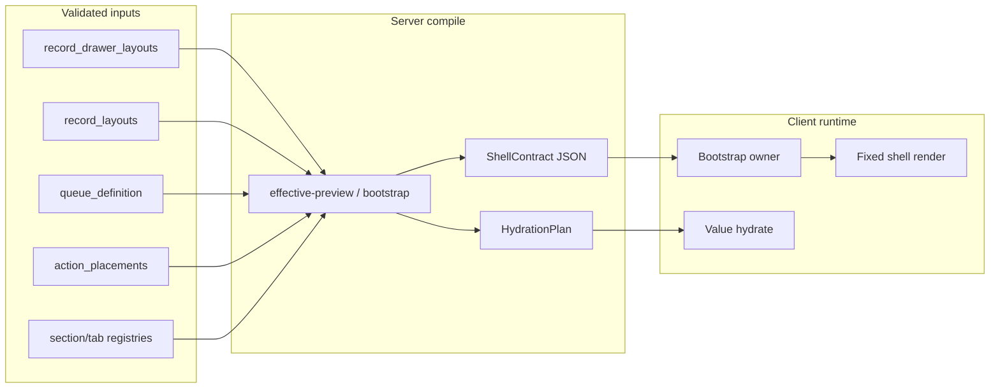

# AdminV2 UI Shell Doctrine — Preload Structure, Hydrate Data Only

**Path:** `docs/sprints/05_2026/adminv2_shell_doctrine_preload_structure_hydrate_data_only.md`  
**Status:** Audit + design complete; **P1-1 + P1-2 implemented** (2026-05-22). P1-3+ remain gated.  
**Date:** 2026-05-22  
**Sprint type:** Platform doctrine (extends performance/runtime work; not an isolated perf patch)

**Related (evidence, not superseded):**
- [`adminv2_drawer_performance_hardening_phase0.md`](./adminv2_drawer_performance_hardening_phase0.md) — opportunity drawer waterfall, first-paint contract
- [`adminv2_drawer_runtime_phase0_audit.md`](./adminv2_drawer_runtime_phase0_audit.md) — drawer bootstrap replication design
- [`adminv2_performance_phase1_navigation_and_interaction_contracts.md`](./adminv2_performance_phase1_navigation_and_interaction_contracts.md) — nav classes (frozen)
- [`adminv2_performance_phase2_load_path_architecture.md`](./adminv2_performance_phase2_load_path_architecture.md) — load-path map
- [`adminv2_persistent_shell_header_nav_audit.md`](./adminv2_persistent_shell_header_nav_audit.md) — shell remount vs persistence
- [`adminv2_dept_runtime_closeout_handoff.md`](./adminv2_dept_runtime_closeout_handoff.md) — dept/WU runtime contract V1
- [`docs/system/configuration-system.md`](../../system/configuration-system.md) — config may select, not invent semantics
- [`docs/execution/operating-doctrine.md`](../../execution/operating-doctrine.md) — doc updates with behavior changes

---

## Implementation gate

**P1-1 + P1-2 (opportunity drawer shell map)** — implemented in `web/lib/adminV2/shellContracts/*` and `AdminEntityDrawer.tsx`.

**Still gated:** P1-3 placeholders polish, P1-4 postDrawerVisible fold, P1-5 slot owners, P1-6 geometry e2e, Phase 2+ shells.

---

## 1. Executive summary

AdminV2 has accumulated **fetch optimization** (bootstrap bundles, prefetch, sidecar gates, session shell seeds) without a platform-level rule that **UI structure is known before interaction**. Operators still see multi-stage reveals: tabs and sections appear after data, inquiry/children/task/message regions pop in, drawer chrome reshapes, and route/drawer opens trigger **request storms** with **split ownership** between parent shells and child components.

**Core doctrine:** UI structure is **preloaded and stable**. Only **values** hydrate late. A click should reveal an **already-known shell** and fill fixed regions — never discover sections, tabs, panels, layout geometry, cards, rails, or visible surfaces after interaction.

This aligns with existing Alloy configuration doctrine: `record_layouts` / `record_drawer_layouts`, `work_units` + `queue_definition`, workflow/action catalogs, and registered section keys may **select, order, label, and expose** surfaces — they must **not** invent unvalidated UI/runtime semantics at interaction time.

**Strategic outcome:** A reusable **shell contract system** maps config-driven presentation to fixed geometry + registries + hydration plans. Performance work becomes a consequence of correct composition, not parallel patch tracks.

**Recommended first implementation target:** **A — Opportunity drawer shell** (user preference is correct). It is the clearest user-facing proof: fixed header, fixed tabs, fixed section slots, reserved inquiry/task/message geometry, data-only hydration. Implementation should still **define drawer bootstrap as the single shell owner** in the same card series (not a second perf pass).

---

## 2. Doctrine

### 2.1 Shell contract

Each major AdminV2 surface exposes a **stable shell contract** before any entity-specific network returns:

| Contract field | Meaning |
|----------------|---------|
| **header** | Title region, subtitle slot, status/badge slot, action rail slots (may skeleton; must not change height class after reveal) |
| **tabs** | Tab strip keys and order from registry + effective layout — known at open, not discovered from entity JSON |
| **rails** | Left/right/command rails: presence, width band, scroll ownership |
| **section_slots** | Ordered slot list keyed by registered `section_key` (may be empty/hidden per config, not omitted then added) |
| **above_fold_map** | Which slots paint on primary reveal |
| **below_fold_map** | Which slots defer value hydrate but **reserve geometry** (collapsed section chrome, min-height, or explicit placeholder) |
| **reserved_geometry** | Min heights / grid tracks for inquiry children, oper strip, comms column, KPI strip |
| **loading_behavior** | Single branded loading state per surface; no helper text churn under titles |
| **child_surface_ownership** | Which bootstrap owner hydrates each slot (drawer bootstrap, WU bootstrap, sidecar session, tab focus) |

Shell contracts are **derived from validated config + platform registries**, cached per org/entity-type/work-unit scope, and warmed on route hover / intent prefetch where safe.

### 2.2 Geometry contract

Late data may hydrate **inside fixed regions**. It must **not**:

- Insert above-fold sections that were not in the shell map
- Reorder tabs after first paint
- Change header height band (title rail → multi-line oper trust → chips)
- Push or resize command/KPI/rails
- Resize drawer chrome (modal width, tab strip, overview grid columns)
- Alter visible composition (filtering sections out after paint counts as a geometry violation unless hidden by config before open)

**Allowed:** skeleton → value within the same box; soft emphasis; count badges; enabling controls when defs arrive.

### 2.3 Section lifecycle

Every drawer/page section is exactly one of:

| Class | Operator sees | Network |
|-------|---------------|---------|
| **shell-known + immediately visible** | Section chrome + fields on primary reveal | Values may skeleton then fill |
| **shell-known + reserved placeholder** | Collapsed/header-only or fixed empty state in slot | Hydrate on reveal schedule or interaction |
| **shell-known + below-fold deferred** | Slot exists in scroll map; not above fold | Idle/background hydrate |
| **hidden by config/permission** | Absent from shell map before interaction | No mount, no pop-in |

**Forbidden:** section self-registration after reveal (`useEffect` discovers layout and mounts new `<section>`), runtime filtering that removes a painted slot, or “enrichment held until interaction” that **unmounts** the slot map (placeholder required instead).

### 2.4 Request ownership

**One interaction → one primary owner.** Children consume payloads or request through the owner.

| Interaction | Primary owner | Must not independently |
|-------------|---------------|-------------------------|
| WU route land | `workUnitBootstrapClientSession` + page mount | Re-fetch WU/dept/queue list; discover lane tabs from entity |
| Drawer open | `OpportunityDrawerOpenCoordinator` + drawer-operational-bootstrap | Fan-out layout + entity + header actions + WU metadata in parallel without coordinator |
| Tasks badge/modal | `fetchAdminV2Sidecar` / task assist workspace owner | Poll during `adminV2PrimarySurfacePending` |
| Messages/comms tab/section | Drawer bootstrap comms slot or tab-focus owner | Prefetch threads on every open via child `useLayoutEffect` |
| BOS / AI command surface | `AICommandSurfaceShell` bootstrap | Capability probes during drawer/WU primary gate |
| Dept route | Dept operational bootstrap (target) | KPI strip replacing placement strip layout |

### 2.5 Preload hierarchy

By the time the user clicks (or on route intent):

1. **Route shell** cached (dept/WU cold shells, `loading.tsx` bridge)
2. **Drawer shell** cached (layout mode, tab registry, section slot map, geometry)
3. **Entity layout** cached (`record_drawer_layouts` effective preview / bootstrap bundle)
4. **Tab registry** cached (platform + config merge, frozen at open)
5. **Visible section registry** cached (ordered keys, hidden set, above/below fold)
6. **Geometry contract** known (grid, rails, reserved blocks)

Only **record/entity values** and **tab-local lists** fetch after reveal.

---

## 3. Current-state audit

### 3.1 Cross-cutting findings

| Theme | Evidence | Violation |
|-------|----------|-----------|
| Structure follows data | `AdminEntityDrawer` builds `overviewSections` from merged presentation + async `recordChrome` + runtime filters (`inquiry_children` reorder, tuition dedupe, workflow v1 strips) | Shell map not stable at open |
| Reveal gates on enrich | Historical `surface=full` gate; partial migration to `drawer_primary` + `opportunityDrawerComposedRevealReady` | Sections still deferred by **unmount** (`filterOpportunityOverviewSectionsForFirstPaint` returns `[]` until enrichment ready) |
| Post-reveal storms | `postDrawerVisibleKey` → rAF effects: activity-signal, pipeline stages, status-options, comms prefetch | Duplicate ownership vs bootstrap |
| Child discovery | `CommunicationsDrawerSection`, `OpportunityInquiryChildrenSection`, `OpportunityOperationalCompactStrip` each own fetch lifecycle | Geometry pop-in |
| Shell remount | `adminV2CommitNavigation` hard reload — chrome repaints | Not late composition but amplifies jank |
| Sidecar contention | `adminV2PrimarySurfaceGate` + `adminV2SidecarSession` | Mitigation exists; doctrine not enforced in drawer children |

### 3.2 Required audit table

| Surface | Current shell owner | Late composition? | Runtime section discovery? | Geometry shift? | Duplicate request ownership? | Root cause | Fix strategy | Phase |
|---------|---------------------|-------------------|----------------------------|-----------------|------------------------------|------------|--------------|-------|
| `/adminV2/workspace` | `AdminV2Shell` + `workspace/page.tsx` (dept grid) | Yes — dept tiles/cards after client fetch | Low — mostly static grid | Yes — KPI/canvas vs oper regions | Sidebar nav tree refetch on expand | Client-only page; hard nav remount | Shell seed + soft nav expansion; prefetch dept list; freeze card grid slots | 2 |
| `/adminV2/workspace/dept/[departmentId]` | `dept/page.tsx` + session cache seed | Yes — WU list, attention buckets, pipeline exec, KPI strip phases | Medium — oper panel modes | Yes — KPI baseline → placement; oper title lock → unlock | Dept bootstrap + summaries + attention + placements waves | Multi-wave client fetch after layout; scope-safe cache refuses counts | Single dept bootstrap owner; reserved oper grid; KPI slot map from config | 2 |
| `/adminV2/work-unit/[workUnitId]` | `work-unit/page.tsx` + `WorkUnitWorkspace` + `WorkUnitWorkspaceColdShell` | Yes — queue lane authority, row buffer, right rail | Low for tabs (local state) | Yes — actions rail, enrollment right rail | Bootstrap + primary row + lane fetches + drawer intent prefetch | Bootstrap gating `wuQueueLaneAuthorityReady`; deferred bundles | WU shell contract from `queue_definition` + layout; lane shell immediate; rows hydrate in place | 1 (parallel) |
| Opportunity record drawer | `AdminEntityDrawer` + `OpportunityDrawerOpenCoordinator` | **Yes** — overview sections, oper strip, children, comms | **Yes** — `overviewSections` useMemo depends on `data`, `recordChrome`, filters | **Yes** — header subtitle/actions/timeline; tab strip; inquiry workflow layout | Bootstrap + primary + full + layout GET + header actions + WU GET + postDrawerVisible fan-out | Split authority; reveal tied to hydrate; enrichment unmount | **RecordDrawerShellContract** from effective layout at open; bootstrap bundles layout+actions; reserved slots; data-only hydrate | **1** |
| Inquiry children section | `OpportunityInquiryChildrenSection` (child) | **Yes** — section mounts when `_inquiry_children` arrives | Yes — conditional on entity field | Yes — overview stack height | Entity full hydrate + section-local actions | Section not in primary shell map as reserved chrome | Shell-known placeholder + bootstrap stub rows; hydrate values only | 1 |
| Tasks surface | `OperationalTasksNavBadge`, `MyTasksPanel`, `TaskAssistOpportunityWorkspace`, drawer oper sections | Yes — badge counts after defer; drawer sections pop | Medium | Minor | Sidecar summary + per-opportunity task assist fetches | Independent mounts | Tasks owner + drawer slot in shell map; block sidecar until primary ready (existing gate) | 1 |
| Messages / communications | `CommunicationsDrawerSection`, `QuickMessageModal`, comms tab | **Yes** — threads/messages load on tab/section activate | Yes — panel mounts when active | Yes — conversation column height | Prefetch on drawer open + per-thread message GETs | Child-owned discovery | Register comms slot in drawer shell; bootstrap thread **stubs**; hydrate on tab focus | 1 |
| BOS / AI command surfaces | `AICommandSurfaceShell`, oper recommendation resolvers | Yes — capabilities, proposals, panels | Medium — mode switches | Yes — bar height / proposal cards | Multiple capability endpoints + entity attention | Feature-rich surface without shell registry | `BosShellContract` + proposal envelope slots; defer cards below fold | 3 |
| KPI regions | `KPIBand` (overview), dept/WU KPI strips | Yes — baseline then placement-aware | Low | **Yes** — strip cells appear/relabel | Dept/WU bootstrap vs rollup refetch | Second-pass KPI resolution | KPI slot registry from config; skeleton cells = final count | 2 |
| Sidebars / rails | `Sidebar`, `InspectorPanel`, WU/dept right rails | Yes — nav tree, inspector content | Low | Yes — inspector width content | Nav tree + enrollment right rail | Load on expand / after bootstrap | Cache nav tree at shell; rail presence from dept/WU shell contract | 2 |
| Tabs & drawer sections | `AdminEntityDrawer` tab state + `EntityDrawerOverview` | **Yes** — tabs stable but **overview sections** reshuffle | **Yes** | **Yes** | Tab-local APIs (activity, related) OK if tab shell pre-registered | Overview built after data merge | Freeze `SurfaceTabRegistry` + `SurfaceSectionRegistry` at open | 1 |

### 3.3 Opportunity drawer — detailed violation map

**Shell owners today:** `OpportunityDrawerOpenCoordinator` (preload), `fetchOpportunityDrawerOperationalBootstrap`, `AdminEntityDrawer` (gates, section assembly, postDrawerVisible).

**Violations:**

1. **Section map not frozen at open** — `overviewSections` computed in `AdminEntityDrawer` after `recordChrome.configResolved`, with opportunity-specific filters and reorder (e.g. `inquiry_children` to top). Same config can produce different **visible** section lists before/after hydrate.

2. **Enrichment deferral via empty list** — `filterOpportunityOverviewSectionsForFirstPaint` returns `[]` when `firstPaintActive && !enrichmentLayoutReady`, which removes section **chrome** rather than reserving placeholders (`opportunityDrawerFirstPaintContract.ts`).

3. **Coordinated reveal still couples to full hydrate paths** — `opportunityDrawerEnrichmentLayoutReady` requires `fullRecordHydrateApplied` on bootstrap enrichment path; children/metadata drive layout feel.

4. **postDrawerVisible storm** — activity-signal, pipeline stages, verticals, status-options, comms prefetch compete with bootstrap (documented in drawer performance phase 0).

5. **Header geometry churn** — workflow v1 suppresses status badge, swaps title rail actions, shows skeleton bars then CTAs; oper trust lines appear after attention resolve.

**Existing mitigations (keep, extend):** queue preview seed, drawer-operational-bootstrap, `drawer_primary` surface, `adminV2PrimarySurfaceGate`, jank budget, first-paint deferred section key set — these are **tactics** until shell contract owns the map.

### 3.4 Work-unit & dept — summary

**WU:** Strongest runtime discipline in workspace — `workUnitBootstrapClientSession` single owner, cold shell, local lane state. Remaining jank: **row and rail hydration** changes oper grid density; enrollment right rail resolves after bootstrap.

**Dept:** Session cache seeds title/structure but clears oper state; KPI and attention waves cause **card/tile reshaping**. Align with locked AdminV2 Runtime Contract V1 in dept closeout handoff.

### 3.5 Config integration (no parallel shell)

| Config source | Shell contract inputs | Must not |
|---------------|----------------------|----------|
| `record_drawer_layouts.config_json` | Section order, show/hide, `inquiry_drawer_mode`, `field_placements_v1` | New section keys at runtime without registry |
| `record_layouts` (non-drawer) | Schedule/job modal overview rows | Invent components |
| `queue_definition` + work unit | Lane tabs, queue row actions, drawer workspace context | Post-open tab discovery |
| `action_placements` | Header/section/queue_row slots | Execute without registry action |
| Workflow/action catalogs | BOS proposal types, oper actions | UI widgets not in registry |
| `field_section_definitions` | Catalog section labels | Drawer section mount without `section_key` |

Effective layout preview API (`GET …/effective-preview`) should become the **authoritative shell map compiler** reused by Settings, BOS `config_layout_assist`, and runtime bootstrap.

---

## 4. Architecture proposal

### 4.1 Design principles

1. **Extend** existing config doctrine — no disconnected “shell app.”
2. **Compile** shell contracts server-side (or from warm client cache) from validated config + registries.
3. **Separate** `ShellMap` (structure) from `HydrationPlan` (values).
4. **One owner** per interaction; children are presentational.
5. **Phase 1 navigation contracts remain frozen** unless explicitly migrated with tests.

### 4.2 Proposed modules (implementation sprint)

| Module | Responsibility |
|--------|----------------|
| `AdminV2ShellContract` | Base types: slots, geometry, loading classes, ownership keys |
| `RecordDrawerShellContract` | Entity-type drawer: tabs, overview slots, rails, modal vs sidebar geometry |
| `WorkUnitShellContract` | Lanes, queue chrome, actions rail, right rail slots |
| `DepartmentShellContract` | WU grid, attention oper panel, KPI strip slots |
| `BosShellContract` | Command bar modes, proposal card regions |
| `SurfaceSectionRegistry` | Ordered registered `section_key` → component + placeholder policy |
| `SurfaceTabRegistry` | Tab keys → panel owner + lazy hydrate class |
| `GeometryContract` | CSS grid tracks, min-heights, `data-shell-slot` markers for tests |
| `VisibleDependencyMap` | Which value keys each slot needs (for bootstrap bundling) |
| `HydrationPlan` | phased: primary / secondary / tab-focus / idle |

**Suggested locations (implementation):** `web/lib/adminV2/shellContracts/*` with server compilers in `web/lib/admin/` next to existing layout fetch helpers.

### 4.3 Shell compile pipeline



### 4.4 Opportunity drawer — target behavior

**At `openDrawer` (before panel paint):**

1. Apply queue preview seed + **cached `RecordDrawerShellContract`** (from intent prefetch or last effective layout).
2. Paint: header band, tab strip, overview grid with **all section shells** in map order (hidden sections omitted from map, not filtered later).
3. `drawer-operational-bootstrap` returns: `drawer_primary` entity values + shell map hash + header actions + WU context.
4. Primary reveal when `opportunityDrawerComposedRevealReady` — **no** `surface=full` requirement.
5. `HydrationPlan.secondary` fills inquiry children values, oper attention, field defs inside existing boxes.
6. Tab panels (activity, related, documents): shell on tab select; data on focus.

### 4.5 Mapping to BOS / task / message surfaces

| Surface | Shell contract | Hydration |
|---------|----------------|-----------|
| Task assist (global + drawer) | Slot in `RecordDrawerShellContract` or WU rail | Task list owner; counts via sidecar after primary |
| Communications | Fixed drawer tab + optional overview slot | Thread list stub → messages on focus |
| BOS command bar | `BosShellContract` modes | Capabilities idle; proposals below fold |
| Oper recommendation | Registered proposal cards only | Resolver passes scheduled in `HydrationPlan` |

---

## 5. Shell preload strategy

| Layer | Preload trigger | Cache key |
|-------|-----------------|-----------|
| Route shell | RSC layout + `loading.tsx` cold shells | deptId, workUnitId |
| Drawer shell | mousedown queue row / `OpportunityDrawerOpenCoordinator` | org + entityType + layout version |
| Effective layout | Settings preview + bootstrap bundle | org + `record_drawer_layouts.updated_at` |
| WU shell | dept card hover / sidebar prefetch | workUnitId + site scope |
| Sidecar | After `clearAdminV2PrimarySurfacePendingFromMark` | endpoint TTL 60s (`adminV2SidecarSession`) |

**Intent prefetch** must warm the **same URLs** the bootstrap owner will call (already partially true for drawer bootstrap).

---

## 6. Request ownership strategy

1. **Declare owners** in shell contract (`ownership_key` per slot).
2. **Ban** child `fetch` for structure (layout, section list, tab list).
3. **Route all value fetch** through owner response or `scheduleAdminV2BackgroundWork` with jank budget tags.
4. **Tests:** extend `adminV2DrawerLoadingCoherence.test.ts`, `adminV2ProductionJankLock.test.ts`, add shell contract snapshot tests per entity type.

**Drawer open target sequence:**

```txt
openDrawer
  → shell contract from cache (instant geometry)
  → single drawer-operational-bootstrap (primary)
  → merge drawer_primary
  → PRIMARY REVEAL
  → schedule HydrationPlan.secondary (no new sections)
  → tab focus → tab owner only
```

---

## 7. Section lifecycle model (enforcement)

```txt
compileShellMap(config, registries) → ShellMap
renderShell(ShellMap) → placeholders for deferred slots
hydrateSlot(slotKey, payload) → update values only
```

**Lint/convention (implementation):** drawer section components must accept `shellSlot` props; `useEffect` that sets “section visible” from empty data is disallowed.

---

## 8. Geometry rules (testable)

| Rule ID | Assertion |
|---------|-----------|
| G1 | `getBoundingClientRect` of header, tab strip, and first overview row stable ±2px across primary → secondary hydrate |
| G2 | Section count in DOM equals `ShellMap.sections.length` from first paint |
| G3 | No new `[data-entity-section]` nodes after primary reveal without tab change |
| G4 | Drawer width class constant for opportunity modal/sidebar mode |
| G5 | inquiry_children region maintains `min-height` from shell map |

Perf overlay / Playwright hooks: `data-shell-slot`, `data-shell-phase="primary|secondary"`.

---

## 9. Migration phases

### Phase 1 — Drawer + WU oper critical path

**Focus:** Opportunity drawer, WU shell (lane chrome only), tasks/messages sidecars.

**Goals:**

- Stop late drawer sections (reserved shells, not unmount/filter)
- Stop task/message pop-in (slots + deferred values)
- Remove duplicate ownership (postDrawerVisible → bootstrap plan)
- Reserve child/inquiry geometry
- Drawer reveal feels immediate (`drawer_primary` only)

**Implementation cards (next sprint):**

1. `RecordDrawerShellContract` compiler from effective layout
2. Opportunity drawer: render shell map at open; migrate `overviewSections` assembly to compile-time
3. Inquiry children + oper strip + comms: placeholder policy
4. Collapse postDrawerVisible fetches into `HydrationPlan`
5. WU: document `WorkUnitShellContract` parity with cold shell (lane tabs frozen at bootstrap)

### Phase 2 — Dept + workspace + KPI + rails

**Focus:** Dept shell, workspace shell, KPI regions, sidebars.

**Goals:** Stable route transitions; no card/tile reshaping; no late rail movement; reduce request storms; continue hard-nav safety or expand soft-nav with tests.

### Phase 3 — Platform shell registry

**Focus:** Configurable shell registry across AdminV2; BOS/AI safe presentation.

**Goals:** Standard contracts for new modules; `config_layout_assist` proposes only registered slots; AI cannot add sections.

---

## 10. Risks and tradeoffs

| Risk | Mitigation |
|------|------------|
| Larger bootstrap payloads | Ship shell map hash; diff hydrate; compress secondary |
| Config drift vs cache | Version layout `updated_at` in cache key; invalidate on settings save |
| Over-reserving empty sections | Config-hidden sections excluded at compile time, not runtime filter |
| Breaking Phase 1 nav | No nav changes in Phase 1 drawer cards |
| Settings preview vs runtime mismatch | Single compiler function shared by preview API and bootstrap |
| Test maintenance | Shell map snapshots per fixture org |

**Tradeoff accepted:** Slightly more upfront JSON and compile work for predictable UX.

---

## 11. Recommended first implementation target

### Choice: **A — Opportunity drawer shell** (confirmed)

**Why this is correct:**

- Highest-signal user pain (multi-stage drawer, section pop-in)
- Most existing prefetch/bootstrap infrastructure
- Directly proves doctrine: fixed tabs/sections, data-only hydrate
- Tests already exist (`adminV2DrawerLoadingCoherence`, `opportunityDrawerFirstPaintContract`)

### Challenge (strategic ordering, not a different first target)

Do **not** implement drawer shell without **assigning bootstrap as structure authority** in the same PR series:

- If drawer shell renders from cache but `AdminEntityDrawer` still rebuilds sections from async `recordChrome`, doctrine fails.
- WU shell (B) is a strong **second** card — lane tab freeze helps queue→drawer continuity but does not prove section geometry alone.
- Tasks/messages sidecars (C) should follow drawer slots in Phase 1, not lead — they depend on drawer shell map for embedded regions.

**Optional parallel:** WU cold shell lane authority (small card) — only if it does not delay drawer shell map.

---

## 12. Acceptance criteria

### This sprint (audit/design) — complete when:

- [x] Violations documented in audit table
- [x] Shell doctrine unambiguous (§2)
- [x] First implementation target chosen (§11 — opportunity drawer)
- [x] Rollout phases sequenced (§9)
- [x] No code changed in this sprint
- [x] Next sprint can open with implementation cards (§9 Phase 1 list)

### Implementation sprint (future) — drawer Phase 1 done when:

- [ ] `RecordDrawerShellContract` compiled from effective layout; snapshot tests
- [ ] Opportunity open paints full section shell map on first frame (hidden sections excluded at compile)
- [ ] Primary reveal does not require `surface=full`
- [ ] inquiry_children / oper / comms regions do not change layout height class on secondary hydrate (G1–G5)
- [ ] postDrawerVisible network families folded into bootstrap or `HydrationPlan.secondary`
- [ ] Contract tests green + manual inquiry workflow QA

---

## 13. Copy-paste context for new GPT thread

Use this sprint doc as the canonical pack. Load order:

1. This file
2. `docs/system/configuration-system.md`
3. `adminv2_drawer_performance_hardening_phase0.md`
4. `adminv2_performance_phase1_navigation_and_interaction_contracts.md`
5. `web/lib/admin/drawer/opportunityDrawerFirstPaintContract.ts`
6. `web/lib/admin/opportunityDrawerOpenCoordinator.ts`

**Instruction to agent:** Audit + design only unless explicitly starting implementation sprint. Respect: config selects registered keys; platform owns semantics; one bootstrap owner per interaction.

---

## Appendix A — Key code references (audit evidence)

| Area | Path |
|------|------|
| Drawer open coordinator | `web/lib/admin/opportunityDrawerOpenCoordinator.ts` |
| First paint / deferred sections | `web/lib/admin/drawer/opportunityDrawerFirstPaintContract.ts` |
| Drawer UI | `web/components/admin/AdminEntityDrawer.tsx` |
| WU bootstrap owner | `web/lib/adminV2/workUnitBootstrapClientSession.ts` |
| Sidecar gate | `web/lib/perf/adminV2PrimarySurfaceGate.ts`, `web/lib/adminV2/adminV2SidecarSession.ts` |
| Shell chrome | `web/app/adminV2/components/AdminV2Shell.tsx` |
| WU/dept cold shells | `web/components/admin/workspace/WorkUnitWorkspaceColdShell.tsx`, dept `loading.tsx` |
| Effective layout | `web/lib/admin/recordLayouts/*`, Settings preview API |

---

## Appendix B — Implementation card backlog (Phase 1)

| Card | Title | Depends |
|------|-------|---------|
| P1-1 | Shell contract types + compiler from effective layout | — |
| P1-2 | Opportunity drawer render frozen `ShellMap` at open | P1-1 |
| P1-3 | Replace enrichment unmount with reserved placeholders | P1-2 |
| P1-4 | Bootstrap bundles `HydrationPlan` + fold postDrawerVisible | P1-2 |
| P1-5 | Inquiry children / oper strip / comms slot owners | P1-3, P1-4 |
| P1-6 | Tests: geometry + section count stability | P1-2 |
