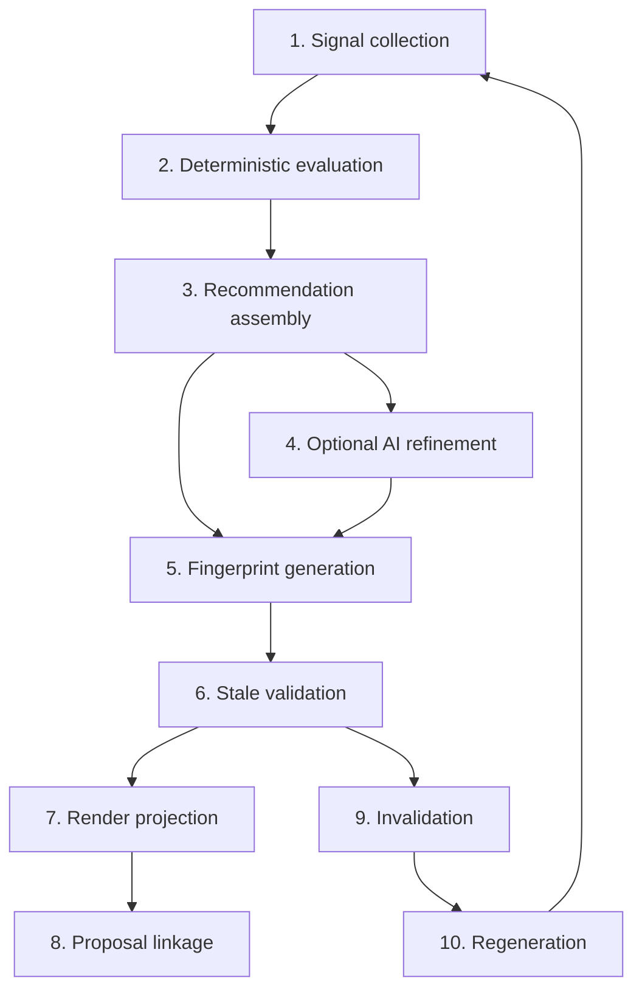

# BOS Operational Recommendation Intelligence — GATE 0

**Path:** `docs/sprints/05_2026/bos_operational_recommendation_intelligence_gate0.md`  
**Status:** Implementation doctrine — **GATE 0 APPROVED**  
**Phase 1 pack:** [`bos_operational_recommendation_phase1_execution.md`](./bos_operational_recommendation_phase1_execution.md)  
**Date:** 2026-05-21  
**Role:** Binding implementation doctrine for all code in this sprint

**Parent sprint:** [`bos_operational_recommendation_intelligence_sprint.md`](./bos_operational_recommendation_intelligence_sprint.md) (audit + framework + phase map)

**Doctrine stack (unchanged):** `docs/execution/operating-doctrine.md`, `docs/product/bos-foundation.md`, `docs/system/workspace-system.md`, `docs/system/actions-and-workflows.md`, `docs/product/crm-system.md`, `docs/product/communications.md`, `docs/execution/roadmap-and-gaps.md`

---

## Purpose of GATE 0

GATE 0 locks **how** this sprint may be built before any code changes. It prevents:

- Architectural drift (second recommendation systems, client-side reasoning)
- AI sprawl (enrich before trust; hidden model reasoning)
- Recommendation duplication (per-surface builders, parallel copy engines)
- Recommendation fragmentation (inconsistent anatomy across drawer / queue / Orchestrator)
- Autonomous behavior creep (auto-send, auto-apply, self-healing)
- Workflow bypassing (recommendations that imply execution without proposals)
- UX inconsistency (chatbot tone, chain-of-thought, narrative overload)

**GATE 0 produces no runtime behavior.** It is the contract between product, design, and engineering for Phases 1–5.

---

## SECTION 1 — Implementation principles

### 1.1 Immutable sprint principles

| # | Principle | Enforcement |
|---|-----------|-------------|
| P1 | **Recommendation intelligence is assistive only** | No capability registry entry with mutating `apply_policy` for insight recommendations |
| P2 | **BOS recommendations are NOT operational authority** | Membership, lifecycle, ledger, and queue truth remain platform tables + resolvers |
| P3 | **Recommendations never mutate records** | Builder and enrich paths are read-only; zero `INSERT`/`UPDATE`/`PATCH` on CRM from recommendation modules |
| P4 | **Workflows remain execution authority** | Side effects only via `emitEvent` / `executeWorkflowRun` / `executeAdminAction` after human action |
| P5 | **Queues remain truth boundaries** | Queue rows = preview/selection; recommendations may not be computed from queue JSON alone |
| P6 | **Deterministic operational signals remain primary** | Resolver, SLA, activity signals, tasks/sends snapshots feed the builder before any model call |
| P7 | **AI enrich must always be grounded** | Model output may only restate or polish fields tied to `grounding_signals[]`; failure → omit field |
| P8 | **Recommendation intelligence must remain explainable** | Every shipped recommendation answers “Why did BOS recommend this?” with cited signals |
| P9 | **Recommendations are review surfaces, not execution systems** | UI presents judgment; operator chooses workflow, Task Assist, or admin action |
| P10 | **Recommendations may guide proposals but not auto-apply them** | Prefill and routing allowed; `apply` requires existing governed paths + approval |

### 1.2 Core sprint objective (locked vocabulary)

**Operational reasoning enhancement** — improving the **depth, grounding, and usefulness** of operator-facing judgment on a **single record** (and its preview row), using existing platform signals and governed execution paths.

| In scope | Out of scope |
|----------|--------------|
| Richer **why / urgency / outcome / rationale** on deterministic facts | **Autonomous reasoning** (model decides what to do without operator) |
| Template + catalog copy; optional bounded enrich | **Autonomous planning** (multi-step agent plans, memory) |
| Workflow-native **links** to Task Assist, Workflow Assist explain, admin actions | **Generalized AI agent behavior** (personas, swarms, self-directed loops) |

**One-line test for any PR:** Does this change make an operator’s **next decision** clearer without creating a new way to **execute** that decision?

### 1.3 Anti-patterns (reject in review)

- New “recommendation agent” with tool calls or DB writes
- Client-side `resolveOpportunityAttention` or attention rule forks
- LLM choosing reason codes, SLA tiers, or queue ordering
- Persisting recommendations as operational truth (tables that override resolver)
- Recommendations that call `executeCommunicationsSend` or workflow run APIs directly
- UI copy composed in React from raw entity fields without server `OperationalRecommendationV1`

---

## SECTION 2 — Canonical ownership

### 2.1 Single recommendation contract

**`OperationalRecommendationV1` is the ONLY canonical recommendation contract** for operational decision intelligence in this sprint.

| Legacy / adjacent type | Role during sprint | End state |
|------------------------|-------------------|-----------|
| `AttentionSuggestionV1` | **Projection adapter only** — derived from `OperationalRecommendationV1` for envelopes and backward compat | Consumers migrate to canonical type; adapter retained one release minimum |
| `OperationalSummaryV1` | Separate insight aggregate; may **read** recommendation fields; must not duplicate primary recommendation | Summary subordinate to recommendation or merged in builder |
| `buildOperationalRecommendationHandoffCopy` | **Presentation projection** — maps canonical fields to Orchestrator seed strings | No independent reasoning |
| Task Assist / Workflow Assist **proposals** | **Governed proposals** — distinct lifecycle; may **consume** recommendation via `communication_reference` / prefill | Not replacements for `OperationalRecommendationV1` |

**Forbidden:** New parallel types (`OperationalInsightV2`, drawer-only suggestion DTOs, queue-only recommendation objects) without explicit program approval and registry update.

### 2.2 Module ownership map (locked)

| Concern | Owner module (canonical path) | May write DB? | Consumed by |
|---------|------------------------------|---------------|-------------|
| **Contract types + validation** | `web/lib/adminV2/bos/recommendations/types.ts` (+ validators) | No | Server attach, tests |
| **Deterministic builder** | `web/lib/adminV2/bos/recommendations/buildOperationalRecommendationV1.ts` | No | Entity attach, queue enrich |
| **Copy catalog** | `web/lib/adminV2/bos/recommendations/recommendationActionCatalog.ts` (+ template helpers) | No | Builder only |
| **Signal assembly** | `web/lib/adminV2/bos/recommendations/collectRecommendationSignals.ts` | No (reads only) | Builder |
| **Fingerprint** | `web/lib/adminV2/bos/recommendations/recommendationFingerprint.ts` | No | Builder + stale check |
| **Stale validation** | `web/lib/adminV2/bos/recommendations/validateRecommendationFreshness.ts` | No | API attach, client display helper |
| **Invalidation rules** | `web/lib/adminV2/bos/recommendations/recommendationInvalidation.ts` | No | Attach + refetch paths |
| **Legacy adapter** | `web/lib/adminV2/bos/recommendations/operationalRecommendationToAttentionSuggestionV1.ts` | No | Envelopes, existing tests |
| **Entity attach** | `web/lib/admin/opportunityRecommendationAttachment.ts` (or extend `opportunityAttentionSuggestionAttachment.ts`) | No | `GET` entity opportunities |
| **Queue projection** | `QueueService` **projection slice only** — calls builder or maps attached payload | No | Queue list API |
| **AI enrich** | `web/lib/ai/enrichOperationalRecommendationV1.ts` (new) or extend enrich family under `web/lib/ai/` | No | `POST` enrich route only |
| **UI rendering** | `web/components/admin/drawer/OperationalAttentionHeaderStrip.tsx`, handoff in `operationalRecommendationHandoff.ts`, queue via `crmQueueRowPreviewPresentation` / `QueueBlock` | No | Browser |

**Deterministic signals (existing — do not re-home):**

| Signal | Owner | Recommendation builder |
|--------|-------|------------------------|
| Attention membership + reasons | `web/lib/opportunities/opportunityAttentionResolver.ts` | Read-only input |
| Explain phrases (timing, wait) | `web/lib/opportunities/operationalAttentionExplain.ts` | May import helpers; **must not** fork rules |
| Activity stale | `web/lib/admin/activitySignals.ts` / `loadOpportunityActivitySignal` | Read-only input |
| Open tasks / scheduled sends snapshot | Task assist / operational task loaders | Read-only input (V1: optional; V1.5: encouraged) |
| Comms thread timing (if added) | `web/lib/communications/*` read helpers | Read-only input; explicit gate in Phase 3+ |

### 2.3 Boundary rules

| Boundary | Rule |
|----------|------|
| **Server-only ownership** | `OperationalRecommendationV1` is assembled only on server (entity GET attach, queue enrich API path, or shared server function called by `QueueService`) |
| **DTO boundaries** | JSON attached as `_operational_recommendation` on entity GET; queue uses `_operational_recommendation_preview` or mapped legacy preview fields — **never** full contract on queue row without “preview” semantics |
| **Rendering boundaries** | React components **project** fields to copy; they do not compute urgency, SLA, or reason priority |
| **Enrich boundaries** | Enrich accepts canonical recommendation + policy; returns **partial overlay** `{ field_overrides, grounding_signals, deterministic_vs_ai_assisted }`; never replaces full object silently |

### 2.4 Duplication prevention

| Forbidden | Required instead |
|-----------|------------------|
| `buildNeedsAttentionSuggestion` growing new reasoning | Builder calls catalog; adapter emits `AttentionSuggestionV1` |
| Handoff building its own “why” strings | Handoff reads `why_it_matters`, `urgency_reason` from canonical payload |
| Workflow Assist explain generating CRM coaching copy | WA explain stays automation diagnostic; link via `workflow_reference` only |
| Task Assist propose inventing operational “why” | Propose shows `context_summary` + optional prefill from `communication_reference` |
| Per-route ad hoc recommendation strings in API routes | Route calls attach helper only |

---

## SECTION 3 — Recommendation lifecycle

### 3.1 Lifecycle stages (ordered)



| Stage | Description | Mutates truth? |
|-------|-------------|----------------|
| **1. Signal collection** | Load resolver result, activity, optional tasks/sends/comms timing, entity snapshot fields | No |
| **2. Deterministic evaluation** | Confirm `needs_attention`, primary reason, SLA, wait bucket (existing resolver — **not reimplemented**) | No |
| **3. Recommendation assembly** | `buildOperationalRecommendationV1` fills contract from catalog + signals | No |
| **4. Optional AI refinement** | Enrich route polishes allowed fields; sets `deterministic_vs_ai_assisted` | No |
| **5. Fingerprint generation** | `inputs_fingerprint` hash from stale-relevant inputs | No |
| **6. Stale validation** | Compare fingerprint at read time vs stored on payload | No |
| **7. Render projection** | Strip / queue preview / handoff truncate and label fields | No |
| **8. Proposal linkage** | Operator opens Task Assist / WA — prefill from `communication_reference` / `workflow_reference` | No until governed apply |
| **9. Invalidation** | Mark recommendation stale or suppress AI fields when fingerprint mismatch | No |
| **10. Regeneration** | Re-run stages 1–6 on entity refetch or explicit refresh | No |

### 3.2 Regeneration triggers

| Trigger | Behavior |
|---------|----------|
| Entity GET refetch (drawer open, PATCH success refetch) | Full regeneration server-side |
| Navigation to new opportunity | New recommendation; clear Orchestrator seed from prior record |
| Org metadata attention config change | Regenerate on next GET; no retroactive cache invalidation across tabs (document limitation) |
| UTC day rollover | `recommendation_id` may change bucket; treat as new deterministic id, not stale |
| Operator clicks “Refresh recommendation” (if shipped) | Explicit refetch only — no background polling |

**No background regeneration jobs** in V1.

### 3.3 Invalidation semantics

| State | Condition | UI |
|-------|-----------|-----|
| **Fresh** | Fingerprint matches live inputs | Normal anatomy |
| **Stale** | Fingerprint mismatch | `stale` frame variant; disable AI-refined fields; CTA: refresh record |
| **Superseded** | Newer `generated_at` on same entity from server (optional header) | Prefer newest payload only |
| **Absent** | No attention + no informational signals | No recommendation block |

**Invalidation does not:**

- Clear resolver attention membership
- Dismiss reason codes from queue overlay
- Auto-apply or auto-send

### 3.4 Stale-state semantics

**`stale_state_check` object (required on contract):**

```ts
{
  inputs_fingerprint: string;      // stable hash of stale-relevant inputs
  fingerprint_version: 1;          // algorithm version
  evaluated_at_iso: string;        // when fingerprint was computed
  is_stale?: boolean;              // set at read/compare time (server or client helper)
  stale_reason?: "status_changed" | "reason_changed" | "wait_bucket_changed" | "activity_changed" | "entity_mismatch" | null;
}
```

**Fingerprint inputs (minimum V1):**

- `entity_type`, `entity_id`
- `status_key`
- `primary_reason_code` (or null)
- `waiting.bucket`, `waiting.since_iso`
- `attention.computed_at_iso` / resolver_version
- `activity_signal_key` (if present)

**Optional V1.1 fingerprint inputs:** open task count hash, last outbound message age bucket — only if wired in signal collection.

### 3.5 TTL assumptions

| Artifact | TTL |
|----------|-----|
| Recommendation payload | **Session of entity GET** — no long-lived server cache |
| Deterministic `recommendation_id` | Stable for **UTC calendar day** + entity + primary reason (compat with existing suggestion id pattern) |
| AI enrich overlay | **Not persisted** as truth; ephemeral in UI until refetch |
| Queue preview | Same as queue row fetch; preview-only |

**No recommendation “expiry” that mutates CRM.** Operator dismissal (if UI adds) is client-local only unless product adds explicit preference storage (out of V1 scope).

### 3.6 Signal mutation handling

When operator mutates record (status PATCH, metadata, send message):

1. Platform truth updates via canonical routes.
2. Resolver output may change on next read.
3. Prior recommendation fingerprint **must fail** stale check if client still holds old payload.
4. Orchestrator handoff seed must re-read from refreshed entity context (`activeOperationalContext`).

---

## SECTION 4 — Grounding + trust doctrine

### 4.1 Grounded operational reasoning (definition)

**Grounded operational reasoning** means every claim in a recommendation is traceable to **explicit platform signals** that an operator or auditor could verify in Alloy UI or admin APIs — not model inference alone.

### 4.2 Permitted evidence classes

AI-assisted and deterministic prose may reference only:

| Class | Examples |
|-------|----------|
| Known operational signals | `source_signal[].code` — reason codes, `activity_stale`, `wait_bucket` |
| Workflow state | Latest event type, run status (read-only traces) — via `workflow_reference` |
| Queue state | Preview labels only; “in Needs Attention bucket X” — not queue-as-authority |
| Comms timing | Last inbound/outbound age, thread count — when collected in signal phase |
| Event history | `workflow_events` summaries for explain linkage |
| Deterministic metrics | Days since tour, SLA tier, severity, priority band |
| Explicit entity fields | `status_key`, mirrored tour metadata, quote flags — from entity GET |

### 4.3 AI enrich prohibitions

AI enrich **may NOT:**

| Prohibition | Rationale |
|-------------|-----------|
| Invent operational facts | “Family is frustrated”, “Director approved discount” |
| Infer hidden intent | “They will enroll next week” |
| Speculate on human emotion | Trust collapse + liability |
| Fabricate confidence | `confidence_level` is computed deterministically; model may not raise it |
| Introduce invisible reasoning | No chain-of-thought, no “because I think” without `grounding_signals` |
| Add new `source_signal` codes | Only cite codes present in deterministic bundle |
| Change `recommended_action` key | Action selection stays deterministic in V1/V1.5 |

### 4.4 Required trust fields

| Field | Purpose |
|-------|---------|
| `grounding_signals[]` | `{ code, label, value_hint? }[]` — every AI-touched sentence must map to ≥1 entry |
| `confidence_level` | `high` \| `medium` \| `low` — deterministic rules in §4.5 |
| `confidence_reason` | Human-readable **why** confidence is not higher (e.g. “Timing approximate · low clock confidence”) |
| `deterministic_vs_ai_assisted` | `deterministic` \| `hybrid` \| `ai_refined` — UI badge source |
| `trust_boundary` | `insight_only` (default) \| `governed_proposal` \| `routing_only` |
| Provenance (on envelope / telemetry) | `capability_key: needs_attention_suggestion`, `builder_version`, `enrich_feature_key` if hybrid |

### 4.5 Confidence rules (deterministic — not model-assigned)

| Level | Conditions |
|-------|------------|
| **high** | Single primary reason; `sla_clock_confidence` high; no conflicting secondary reasons |
| **medium** | Multiple reasons OR medium clock confidence |
| **low** | Low clock confidence OR missing optional signals (comms timing not loaded) |

If AI enrich runs: **confidence_level may not increase** above deterministic baseline.

### 4.6 Explainability requirement

Every recommendation must answer:

> **“Why did BOS recommend this?”**

Minimum acceptable evidence in UI (L1):

- At least one `source_signal` label visible or collapsible
- `why_it_matters` distinct from `recommended_action` label
- `urgency_reason` when urgency ≥ P1

---

## SECTION 5 — Deterministic vs AI-assisted matrix

**Legend:** **D** = MUST be deterministic in V1 | **D+** = deterministic template in V1; AI may polish in V1.5 | **A** = AI-assisted allowed V1.5 only | **S** = stale fingerprint invalidates | **F** = fingerprint includes field inputs

| Recommendation field | D / A | S | F | Notes |
|----------------------|-------|---|---|-------|
| `version` | D | — | — | Constant `1` |
| `recommendation_id` | D | partial | yes | Day-bucket + entity + primary reason |
| `recommendation_type` | D | — | — | From reason + SLA + class rules |
| `source_signal[]` | D | — | yes | Full list from resolver + activity |
| `operational_context` | D | — | yes | Entity id, status, work unit, surface |
| `title` | D | — | yes | Short action headline from catalog |
| `current_state_summary` | D+ | yes | yes | Facts only; AI polish optional V1.5 |
| `why_it_matters` | D+ | yes | yes | Must cite signals; AI polish optional |
| `urgency` (P0–P3 band) | D | — | — | From severity + SLA — **never AI** |
| `urgency_reason` | D+ | — | partial | Policy thresholds deterministic |
| `recommended_action` | D | yes | yes | Catalog key + label — **never AI** |
| `action_rationale` | D+ | yes | yes | Tied to reason + wait + days |
| `likely_outcome` | D+ | yes | yes | Template per reason; A only if template insufficient |
| `likely_risk` | D+ | optional | yes | Optional; suppress when low confidence |
| `confidence_level` | D | — | — | **Never AI** |
| `confidence_reason` | D+ | — | — | AI may not fabricate |
| `available_actions[]` | D | partial | — | Registry/placement ids deterministic |
| `trust_boundary` | D | — | — | Default `insight_only` |
| `stale_state_check` | D | — | yes | Entire object deterministic |
| `deterministic_vs_ai_assisted` | D | — | — | Set by pipeline stage |
| `grounding_signals[]` | D | — | yes | AI may only reference existing codes |
| **SLA breach flag** | D | — | yes | Derived from `sla_tier` |
| **Wait bucket** | D | — | yes | From resolver |
| **Stale status (membership)** | D | — | yes | `needs_attention` — resolver only |
| **Tone guidance** | D+ | yes | partial | Channel + tone from catalog; A for phrasing V1.5 |
| **Escalation note** | D+ | yes | yes | Only when escalation class; policy-cited |
| **Risk framing** | D+ | yes | yes | Template-first |
| **Comms timing window** | D | yes | yes | e.g. “within 24h” from SLA/policy hours |
| **Channel recommendation** | D | — | partial | sms/email/call_task from rules |
| **Multi-reason narrative** | D (L2) / A (V1.5) | yes | yes | L2 factors list deterministic; narrative A optional |
| **Queue preview `why_line`** | D | — | — | Truncated projection; not separate contract |
| **Enrich overlay prose** | A | yes | — | Ephemeral; omitted if stale |

### 5.1 Phase gating for AI fields

| Phase | AI allowed |
|-------|------------|
| Phase 1 | **No** — deterministic only |
| Phase 2 | **No** — UX projections only |
| Phase 3 | **No** — integration prefill from deterministic fields |
| Phase 4 | **Yes** — enrich route with grounding enforcement |
| Phase 5 | Telemetry + tuning only; no new AI surfaces |

---

## SECTION 6 — UX hierarchy lock

### 6.1 Density limits

| Surface | Max primary lines | Max secondary | Expanded (L2) |
|---------|-------------------|---------------|---------------|
| Queue row L0 | 1 headline + 1 hint | 1 urgency token | None by default |
| Drawer L1 (strip) | 1 title + 1 why + 1 outcome OR urgency | 1 CTA label | Toggle to L2 |
| Orchestrator handoff seed | 2 lines + context | eyebrow + reason | Thread card may expand |
| Command proposal card | Recommendation region ≤ 4 lines | Link to drawer | Full proposal separate |

**Hard cap:** No recommendation UI block exceeds **~120 words** visible at L1 without explicit expand.

### 6.2 Urgency hierarchy (display)

| Band | Label | Visual |
|------|-------|--------|
| P0 | Urgent | Strongest accent; never hidden |
| P1 | Today | Default strip |
| P2 | Soon | Muted |
| P3 | FYI | Footnote or collapsed |

**Never** show raw `priority_score` at L1.

### 6.3 Inline vs expanded reasoning

| Level | Content |
|-------|---------|
| **L0** | Action title + one why clause |
| **L1** | + urgency chip + one outcome line |
| **L2** | Factor list, `source_signal` labels, timing phrases |
| **L3** | Score breakdown, resolver version, reason codes — **support toggle only** |

### 6.4 Confidence display rules

- Show `confidence_level` only when **low** or **AI-refined** (hybrid)
- Always show timing caveat when clock confidence low (from deterministic copy)
- Never show numeric model scores

### 6.5 Escalation display rules

- Escalation class only when `recommendation_type === escalation` or SLA `breached` with catalog rule
- Must show `escalation_reference.policy_basis` (threshold, tier, reason code)
- No “call your manager” without policy citation

### 6.6 Multi-recommendation ordering

**V1: one primary recommendation per entity GET.**

Secondary items live in `available_actions[]` and L2 `source_signal` / factors — not parallel recommendation cards.

### 6.7 Queue preview constraints

- Preview fields: `next_label`, `why_line` (truncated), optional `urgency_band`
- Tooltip: **“Preview only — open the record for the full recommendation.”** (preserve)
- Must not show draft body or AI-refined-only fields
- Queue row **must not** gain apply buttons from recommendation

### 6.8 Drawer rendering semantics

- Canonical: `OperationalAttentionHeaderStrip` reads `_operational_recommendation` first; legacy `_attention_suggestion` fallback during migration
- Activity signal strip **separate** from resolver reasons (P1-B rule preserved)
- No chain-of-thought, no “BOS thinks…”

### 6.9 Orchestrator panel semantics

- Handoff is **awareness seed**, not a conversation turn
- Routing notices remain specialist-boundary copy (`commandSurfaceRoutingCopy`)
- Recommendation does not auto-submit Task Assist or Workflow Assist

### 6.10 UX anti-patterns (reject)

| Reject | Prefer |
|--------|--------|
| Verbose AI walls | Compressed operational bullets |
| Conversational assistant UX | Proposal + insight surfaces |
| Chain-of-thought exposure | `source_signal` list |
| Narrative overload | L2 disclosure |
| Chatbotification (persona, typing indicators on recommendations) | Calm operational tone |

---

## SECTION 7 — Implementation sequencing lock

**Order is mandatory.** Later phases may not start until the gate for the prior phase passes.

### Phase 1 — Contract, deterministic builder, fingerprints, invalidation, trust semantics

**Status:** **COMPLETE** (2026-05-21). Closeout verification: [`bos_operational_recommendation_phase1_execution.md`](./bos_operational_recommendation_phase1_execution.md) §12. **GATE 1 passed** for Phase 1 scope.

| Deliverable | Gate | Status |
|-------------|------|--------|
| `OperationalRecommendationV1` types + validators | | ✅ |
| `buildOperationalRecommendationV1` + signals + catalog | | ✅ |
| Fingerprint + `stale_state_check` on DTO | | ✅ (`validateRecommendationFreshness` helper deferred) |
| Entity attach `_operational_recommendation` | | ✅ |
| Queue preview `_operational_recommendation_preview` | | ✅ |
| Legacy adapter to `AttentionSuggestionV1` | | ✅ |
| Runtime switch + surface read-order | | ✅ |
| Contract tests | **GATE 1** | ✅ (Phase 1 reason codes; full sweep → Phase 2) |

**Prohibited in Phase 1:** AI enrich routes, UI redesign beyond attach verification, Task Assist prefill changes — **none introduced**.

**Phase 2 may begin** only after Phase 1 closeout verification (complete). Phase 2 prohibitions unchanged: no AI enrich, no new signal sources unless explicit card approved.

### Phase 2 — Recommendation UX replacement

| Deliverable | Gate |
|-------------|------|
| Strip / handoff / queue preview consume canonical contract | |
| Remove generic boilerplate (“Operational attention:”) from primary L1 | |
| L2 disclosure for factors / signals | **GATE 2** |

**Prohibited in Phase 2:** AI enrich, new signal sources (comms thread) unless Phase 1 gate passed and explicit card approved.

### Phase 3 — Workflow + Task Assist integration

| Deliverable | Gate |
|-------------|------|
| `available_actions` → placements / intents (read catalog) | |
| `communication_reference` → Task Assist prefill | |
| `workflow_reference` → Workflow Assist explain link | |
| Situational comms templates in catalog | |

### Phase 4 — Bounded AI enrich (grounded only)

| Deliverable | Gate |
|-------------|------|
| Enrich route with `grounding_signals` enforcement | |
| UI badges for `ai_refined` / hybrid | |
| Policy + permission gates unchanged | **GATE 4** |

**Explicit prohibitions before Phase 4:**

- ❌ AI enrich before trust boundaries (§4) implemented in code
- ❌ AI enrich before invalidation (§3.4) implemented in code
- ❌ AI enrich before deterministic builder + catalog (Phase 1) power all surfaces

### Phase 5 — Refinement + telemetry

| Deliverable | Gate |
|-------------|------|
| Telemetry: shown / stale / handoff / enrich outcome | |
| Doc updates (`bos-foundation.md`, `crm-system.md`) | |
| Feature flag rollout | **GATE C** |

### Cross-phase rules

- No new `/api/admin/ai/*` routes except enrich extension in Phase 4
- No registry capability additions without `bos-foundation.md` update in same PR
- Bugfixes to resolver may ship independently with product sign-off — **not** bundled as “recommendation intelligence”

---

## SECTION 8 — Non-goals

The following are **explicitly prohibited** for this sprint (including “small” PRs):

| Non-goal | Notes |
|----------|-------|
| Autonomous execution | No agent loops |
| Auto-send | `executeCommunicationsSend` only via Task Assist apply after approval |
| Self-healing workflows | No auto-enable workflow, no auto-retry runs |
| Self-modifying recommendations | No ML feedback into resolver thresholds |
| Memory systems | No session memory, no cross-record operator profile |
| Hidden reasoning | No stored model rationale |
| Recommendation persistence as truth | No DB table that overrides resolver |
| Generalized AI orchestration | Orchestrator routing unchanged except copy |
| Replacing workflows | Recommendations link, not substitute |
| Replacing operators | Human approval on all mutating paths |
| Portfolio prioritization AI | Record-scoped only |
| Queue reorder by LLM | Deterministic sort only |
| Childcare-only platform branches | Catalog/templates may be vertical-configured later |

---

## SECTION 9 — Implementation risks

| Risk | Description | Mitigation |
|------|-------------|------------|
| **Trust collapse** | Operators act on wrong or invented guidance | Grounding doctrine (§4); confidence capped; insight_only default; stale frame |
| **Stale recommendation** | UI shows pre-PATCH guidance | Fingerprint (§3.4); `is_stale` UI; refetch on drawer focus |
| **Hallucinated reasoning** | AI adds facts not in signals | Enrich may only override allowed fields; validator drops ungrounded sentences; omit field on failure |
| **UX overload** | Strip becomes unreadable | Density limits (§6.1); L2 disclosure; queue truncation |
| **Recommendation duplication** | Handoff + suggestion + summary disagree | Single builder; projections only in UI modules (§2.4) |
| **AI authority confusion** | Operators think BOS “decided” | Copy: “recommendation”, not “action taken”; trust_boundary badges; no auto-apply |
| **Operational inconsistency** | Queue says X, drawer says Y | Same builder for attach + queue enrich path; contract tests |
| **Migration fracture** | Envelopes break consumers | Adapter parity tests; parallel attach one release |
| **Performance regression** | Entity GET slows | Pure CPU builder; no N+1 LLM on GET |
| **Scope creep via enrich** | Phase 4 expands before trust shipped | Sequencing lock (§7); GATE 4 checklist |

---

## SECTION 10 — GATE 0 approval checklist

**GATE 0 is approved when every item below is checked by product + engineering.** Until then: **no implementation PRs** for this sprint (docs-only PRs excepted).

### Contract + ownership

- [ ] **Recommendation ownership is canonical** — `OperationalRecommendationV1` only; legacy via adapter (§2)
- [ ] **Contract fields are finalized** — §5 matrix + sprint doc §4.3 aligned; no open required field renames
- [ ] **Module paths approved** — `web/lib/adminV2/bos/recommendations/*` (+ attach helper location)

### Trust + lifecycle

- [ ] **Deterministic vs AI fields are locked** — §5; AI prohibited until Phase 4
- [ ] **Stale validation semantics approved** — fingerprint inputs + `stale_reason` enum (§3.4)
- [ ] **Fingerprint semantics approved** — algorithm version 1 inputs (§3.4)
- [ ] **Invalidation semantics approved** — fresh / stale / absent (§3.3)
- [ ] **Recommendation lifecycle approved** — stages 1–10 (§3.1)

### UX + sequencing

- [ ] **UX hierarchy approved** — density, L0–L3, queue/drawer/Orchestrator rules (§6)
- [ ] **Implementation sequencing approved** — Phases 1–5 order (§7)
- [ ] **Non-goals approved** — §8 acknowledged by product

### Program

- [ ] **BOS assistive lane re-open acknowledged** — `roadmap-and-gaps.md` pause does not block this sprint’s **insight-only** scope
- [ ] **Prerequisite sprints verified** — BOS UX coherence closeout items (context, proposal frame, stale proposal) landed or tracked

### Sign-off

| Role | Name | Date |
|------|------|------|
| Product | | |
| Engineering | | |
| Design (UX hierarchy) | | |

---

## After GATE 0 approval

1. Update [`bos_operational_recommendation_intelligence_sprint.md`](./bos_operational_recommendation_intelligence_sprint.md) §5.2 — mark GATE 0 complete with link to this doc. ✅
2. ~~Begin **Phase 1 Card 1.1** only (`types.ts` + validators).~~ **Phase 1 complete** — see execution pack §12.
3. Any PR that violates §1–§8 must be blocked in review against this document.
4. **Phase 2** may begin per sprint §5.4; GATE 0 constraints remain binding (no AI enrich, no autonomy, no persistence).

**No code until GATE 0 APPROVED.**
