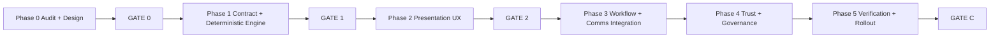

# BOS Operational Recommendation Intelligence Sprint

**Path:** `docs/sprints/05_2026/bos_operational_recommendation_intelligence_sprint.md`  
**Status:** Phase 1 **COMPLETE** (GATE 1 passed) — Phase 2 **COMPLETE** (GATE 2 passed); Phase 3 may begin  
**Date:** 2026-05-21

**GATE 0 implementation doctrine (binding before code):** [`completed/bos_operational_recommendation_intelligence_gate0.md`](./completed/bos_operational_recommendation_intelligence_gate0.md)  
**Phase 1 execution pack:** [`completed/bos_operational_recommendation_phase1_execution.md`](./completed/bos_operational_recommendation_phase1_execution.md)  
**Phase 2 closeout:** [`completed/bos_operational_recommendation_phase2_operational_ux.md`](./completed/bos_operational_recommendation_phase2_operational_ux.md)  
**Phase 3 planning:** [`../06_2026/bos_operational_intelligence_phase3_workflow_comms.md`](../06_2026/bos_operational_intelligence_phase3_workflow_comms.md)  
**Phase 4 planning:** [`../06_2026/bos_operational_intelligence_phase4_bounded_ai_enrich.md`](../06_2026/bos_operational_intelligence_phase4_bounded_ai_enrich.md)

**Prerequisite sprints (must be landed or in closeout):**

- BOS UX Coherence Sprint (`bos_ux_coherence_sprint.md`)
- Proposal governance unification (`bos_registry_proposal_envelope_phase_2.md`, operational proposal frame)
- Active operational context + stale proposal protection (`activeOperationalContext.ts`, `isStaleOperationalProposalEntity`)
- OperationalProposalCardFrame + routing/denial copy (`operationalProposalPresentation.ts`, `commandSurfaceRoutingCopy.ts`)

**Canonical interaction reference (binding):** Forms/Documents operational UX — [`forms_documents_operational_experience_hardening.md`](./forms_documents_operational_experience_hardening.md) § Unified BOS Operational Interaction Doctrine. Phase 2+ BOS presentation **must align** to that model (case-file hierarchy, Review assist region, deterministic-first, human authority). Do not invent a parallel “suggestion feed” personality.

**Binding doctrine (read before build):**

| Doc | Use |
|-----|-----|
| [`forms_documents_operational_experience_hardening.md`](./forms_documents_operational_experience_hardening.md) | **Reference interaction model** — Review assist, cognition hierarchy, anti-patterns |
| `docs/execution/operating-doctrine.md` | Doc/code parity; no parallel AI authority |
| `docs/product/bos-foundation.md` | Capability classes, lifecycle, hard prohibitions |
| `docs/product/ai-system.md` | Stub → `bos-foundation.md` |
| `docs/system/workspace-system.md` | Queue truth, operational attention overlay |
| `docs/system/actions-and-workflows.md` | Workflow-native execution spine |
| `docs/product/crm-system.md` | Attention resolver, buckets, enrollment overlay |
| `docs/product/communications.md` | Canonical send path; Task Assist boundaries |
| `docs/execution/roadmap-and-gaps.md` | BOS expansion paused; assistive-only lane |

**Program stance:** Improve **operational decision intelligence** inside existing BOS surfaces. **Do not** add autonomous agents, new execution paths, or a second AI authority layer.

---

## 1. Sprint goal

Make BOS recommendations feel **insight-driven and strategically useful** — not mechanically generated — while preserving workflow-native governance.

**Success statement:**

> An operator opening a high-priority inquiry can see **why** it matters, **how urgent** it is, **what to do next**, **what outcome is likely**, and **how confident** the system is — with communication guidance that references real enrollment context — and can act only through existing workflow, Task Assist, and governed apply paths.

**Not the goal:** AGI, chatbot expansion, generalized memory, auto-send, auto-apply config, queue semantic invention, or “sounds intelligent” copy without operational grounding.

---

## 2. Architectural constraint (non-negotiable)

BOS may **explain, recommend, prioritize, draft, branch-suggest, prepare governed proposals, and route** to existing workflow/action surfaces.

BOS may **not**:

- Directly mutate operational records outside canonical admin routes after human approval
- Bypass `emitEvent` / `executeWorkflowRun` / `executeAdminAction`
- Invent queue semantics or reorder authoritative pipeline truth from AI
- Auto-send communications or auto-apply configuration
- Become a separate source of truth for attention membership, SLA, or lifecycle

Recommendation intelligence **enhances** workflows; it does not replace operators or workflows.

---

## Unified BOS Operational Interaction Doctrine

**Authority:** Shared with Forms/Documents program. Full canonical copy and Forms reference mapping: [`forms_documents_operational_experience_hardening.md`](./forms_documents_operational_experience_hardening.md) § Unified BOS Operational Interaction Doctrine.

This program **adopts** the Forms/Documents review UX as the **reference interaction model** for all BOS operational intelligence surfaces (drawer, queue, handoff, case file). Phase 2 presentation work must not introduce a second BOS personality.

### BOS role

BOS **is:** operational narrator, reviewer assistant, anomaly detector, workflow explainer, operational prioritization layer.

BOS **is not:** chatbot, autonomous agent, giant AI paragraph generator, hidden workflow engine, silent mutation system.

### Operational cognition hierarchy

All surfaces prioritize, in order:

1. Current operator action  
2. Trust / confidence state  
3. Changes / anomalies  
4. Operational context  
5. Suggested focus  
6. Technical detail (collapsed)  

**AdminV2 projection mapping (target state — Phase 2 execution pack):**

| Cognition layer | Phase 2 consumer | Forms reference |
|-----------------|------------------|-----------------|
| Current operator action | Drawer/workflow CTAs (outside assist band) | Review action band, approve/reject |
| Trust / confidence | Readiness chip, stale banner, timing caveat | `PacketReviewInsightV1.readiness_state`, checklist |
| Changes / anomalies | `urgency_reason`, activity footnote | `key_changes`, warnings |
| Operational context | Entity header, queue subject | Intake context panel |
| Suggested focus | Catalog `title` + compressed why | `suggested_focus` |
| Do next (sequencing) | `recommended_action.label` | `review_paths` |
| Technical | L2 collapsed factors/signals; L3 handoff only | Technical disclosure stack |

### Human authority doctrine

BOS may summarize, explain, prioritize, suggest, draft (governed). BOS may not silently mutate, bypass review/workflows/permissions, or imply autonomous authority.

### Intelligence style doctrine

Calm, concise, contextual, operational, trustworthy. Avoid assistant-chat UX, giant summaries, flashy AI marketing, recommendation overload.

### Deterministic-first doctrine

1. Deterministic operational reasoning (`OperationalRecommendationV1`, resolver, activity signals)  
2. Structured heuristics (catalog templates, urgency bands)  
3. Explainable guidance  

Then optionally: LLM enrich (preview-only, non-authoritative). **Phase 1–2 remain deterministic.**

### Alignment requirement (Phase 2+)

| Forms reference | BOS must converge |
|-----------------|-------------------|
| `BosReviewSummaryPlaceholder` region anatomy | Drawer **Review assist band**: readiness → suggested focus → do next (workflow CTAs stay primary) |
| `PacketReviewInsightV1` checklist | Sequencing chip at L0; readiness at L1 — urgency as guidance, not alarm |
| Case-file region order | One operational story: queue read → drawer assist → collapsed detail → handoff seed |
| Human authority footer | No implied auto-apply; governed paths only; enhance draft subordinate |
| Anti-feed doctrine | No stacked recommendation cards; one intelligence region per entity view |

**Visual sophistication** for both programs: [`forms_documents_product_experience_refresh.md`](./forms_documents_product_experience_refresh.md).

---

## 3. Step 0 — Audit (complete)

Audit scope: operational attention, Workflow Assist, Task Assist, stale/follow-up logic, wording, sources, branching, reasoning quality, timing/escalation, communication suggestions, trust/confidence, explainability, UX hierarchy, deterministic vs AI-generated paths, workflow-native opportunities, queue intelligence, conversion-oriented gaps.

### 3.1 Current recommendation sources (inventory)

| Source | Module / payload | Domain | Apply? | Intelligence class |
|--------|------------------|--------|--------|-------------------|
| **Opportunity attention resolver** | `resolveOpportunityAttention` → `_operational_attention` | Insight (deterministic) | No | Rule + SLA + priority score |
| **Needs-attention suggestion** | `buildNeedsAttentionSuggestion` → `_attention_suggestion` | Insight (deterministic) | No | Reason → action map + template draft |
| **Operational explain copy** | `operationalAttentionExplain.ts` | Presentation (deterministic) | No | Headlines, timing phrases, next-step templates |
| **Operational summary** | `buildOperationalSummaryDeterministic` → `_operational_summary` | Insight (deterministic) | No | Aggregated headline + bullets |
| **Attention enrich (optional)** | `enrichAttentionSuggestionStub` / OpenAI structured | Insight (AI-assisted, preview) | No | Draft polish only |
| **Queue row preview** | `QueueService` → `_attention_suggestion_preview` | Preview (deterministic) | No | `next_label` + truncated `why_line` |
| **Drawer → Orchestrator handoff** | `buildOperationalRecommendationHandoffCopy` | UX bridge (deterministic) | No | Seeds command bar from drawer payload |
| **Active operational context** | `buildOpportunityOperationalContext` + seed | Orchestration context | No | Entity label + action affordances |
| **Task Assist propose** | `buildDeterministicTaskAssistSuggestionV1` | Operational proposal | Yes (governed) | Template opening from instruction + context |
| **Task Assist context** | `assembleTaskAssistOpportunityContextV1` | Read model | No | Status, household, activity, recipients |
| **Task Assist anomalies** | `detectOperationalAnomalies` | Trust warnings | No | Duplicate task/send/draft detection |
| **Task Assist urgency badges** | `taskAssistOperationalUrgency.ts` | Presentation | No | Task due vs send pipeline state |
| **Workflow Assist explain** | `workflowAssistExplainV1` | Read-only diagnostic | No | Event/run checklist + recommended_action |
| **Workflow Assist read cards** | `workflowAssistReadV1` | Read-only | No | Failure/summary headlines |
| **Workflow Assist create** | `workflowAssistCreateFromCommandV1` | Config proposal | Yes (admin workflow CRUD) | Disabled draft scaffolds |
| **Config Layout Assist** | `ConfigurationProposalV1` | Config proposal | Partial apply | Data-quality recommendations |
| **Placement priority** | `placement_priority_v1` queue enrichment | Deterministic triage | No | Numeric priority only; no rationale copy |
| **Orchestrator routing** | `routeCommandSurface` + `commandSurfaceRoutingCopy` | Routing notice | No | Specialist selection explanation |
| **BOS proposal envelopes** | `*ToBosProposalEnvelope()` | Normalized review | Via native apply | Summary lines from native payloads |

**Authority chain for opportunity recommendations:** Resolver (membership + reasons) → deterministic suggestion builder → explain templates → optional enrich overlay → presentation/handoff. **No step mutates CRM truth.**

### 3.2 Recommendation quality problems

| Problem | Evidence | Operator impact |
|---------|----------|-----------------|
| **Generic action labels** | `suggestionActionMap.ts` — e.g. `stale_new_inquiry` → “Respond to new request” | Correct but shallow; no situational “why now” |
| **Thin reasoning summaries** | `buildNeedsAttentionSuggestion` — `Operational attention: {label}.` + optional activity clause | Reads mechanical, not strategic |
| **Disconnected urgency** | Severity/SLA exist on resolver; suggestion `confidence` is always `"deterministic"` | Urgency not surfaced as first-class recommendation field |
| **Weak outcome orientation** | No `likely_outcome` / `likely_risk` in any shipped contract | Operators see tasks, not business consequences |
| **Template comms lack funnel context** | `suggestedContentTemplates.ts` — vertical-neutral generic follow-ups | Misses tour-stall, quote-pending, family-wait narratives |
| **Task Assist drafts are instruction-driven shells** | `buildDeterministicTaskAssistSuggestionV1` — explicit “not from a live model” | NL command quality ≠ operational intelligence quality |
| **Queue preview truncates why** | `truncateAttentionSuggestionQueueWhyLine(..., 140)` | Hints without full reasoning chain |
| **Dual narrative surfaces** | Strip uses suggestion; summary may exist on payload but strip “does not duplicate” | Inconsistent depth depending on surface |
| **Workflow Assist ≠ operational CRM intelligence** | Strong for automation debugging; weak for enrollment conversion coaching | Right tool conflated with “what should I do on this family?” |
| **No conversion framing** | Resolver codes lack enrollment drop-off / tour-to-enroll linkage in copy | Missed strategic leverage at mid-funnel |

### 3.3 Generic recommendation patterns (anti-patterns to eliminate)

- **Verb-only CTAs:** “Follow up”, “Re-engage priority record”, “Review operational state”
- **Label repetition:** Primary reason label restated as both headline and action without added judgment
- **Activity bolt-on:** “Last activity: …” appended without tying to recommended timing or channel
- **Severity prefix without consequence:** “Needs review: High-value stale” without days idle or revenue subtext
- **Queue scan mode flattening:** `Needs attention: {label}` — correct for scan, loses coaching on drill-in
- **Fallback handoff:** “Review operational follow-up” / “Operational follow-up is ready for review in the Orchestrator”

### 3.4 Missing operational reasoning

- Days-since-key-event narrative (tour date, quote sent, last inbound, wait-bucket duration) in **recommendation contract**, not only in explain timing helpers
- **Ownership clarity** in recommendations (family vs staff vs internal block) as structured fields, not prose-only in `nextStepGuidance`
- **Multi-reason prioritization story** when `reasons.length > 1` — factors exist in suggestion but UI often shows primary only
- **Conversion stage awareness** (status_key + wait bucket + quote/tour signals) in comms recommendations
- **Communication type selection** (SMS vs email vs call-task) from operational signals — only channel on templates, not recommended channel with rationale

### 3.5 Missing recommendation context

- Thread/recency context not in deterministic suggestion (Task Assist context has `activity_summary` but suggestion builder does not consume comms thread state)
- Scheduled sends / open tasks not merged into `_attention_suggestion` reasoning (handoff reads first open task title only)
- Work-unit / department policy thresholds not echoed in operator-facing “threshold breached” copy
- Site/department scope not in recommendation payload (may matter for multi-site directors)

### 3.6 Missing prioritization semantics

- `priority_score` + `priority_breakdown` on resolver — **L3 advanced only** per P1-B design; not translated to operator prioritization bands in recommendations
- Queue ordering: needs-attention sort + optional placement priority — **deterministic, not explained** to operator as “why this row is above that row”
- No cross-record **portfolio** prioritization (by design — record-scoped intelligence only)

### 3.7 Weak recommendation UX hierarchy

| Surface | What shows today | Gap |
|---------|------------------|-----|
| Queue L0 | `_attention_*` presentation + optional `next_label`/`why_line` preview | Preview-only; tooltip says open record — good boundary, thin copy |
| Drawer chrome | `OperationalAttentionHeaderStrip` — suggestion label + concise why + next line | No likely outcome, confidence reason, or escalation tier |
| Orchestrator handoff | `OperationalRecommendationHandoffCopy` — primary + operationalReason | No structured anatomy; reason often duplicates label |
| Command cards | Task/Workflow/Config proposal frames — governance strong, operational coaching weak | Cards show drafts/status, not decision intelligence |
| Workspace empty/error | Generic `recommendedActionLine` on lanes | Not resolver-backed |

### 3.8 Missing outcome orientation

- No shipped field for expected result of following the recommendation (e.g. “restores tour momentum”, “prevents quote decay”)
- Workflow Assist explain recommends **automation fixes**, not **business outcomes**
- Risk hints only in `_operational_summary` as `risk_urgency_hint` — not on primary recommendation object

### 3.9 Where BOS feels mechanical

- Deterministic suggestion ID bucketed by UTC day — stable but can feel “generated daily” without freshness narrative
- `reasoning.summary` template prefix “Operational attention:”
- Task Assist assumptions array (“Deterministic template draft (V1)”)
- Equal confidence for all attention suggestions
- Workflow create proposals: “Proposed workflow (disabled draft)” stubs

### 3.10 Where BOS could provide real operational leverage

- **Enrollment wait buckets + SLA breach:** Combine `waiting.since_iso`, `sla_tier`, and status for precise coaching (“family engaged twice, stalled 5 days after tour scheduling”)
- **Comms-aware follow-ups:** Merge last inbound/outbound timing (from threads) into communication recommendations — read-only, server-assembled
- **Attention + Task Assist loop:** Recommendation → pre-filled Task Assist instruction with governed draft — already partially wired via handoff; deepen rationale on card
- **Workflow-native next actions:** Map `action_family` to **registered admin actions** / placements (not new handlers) with explainable linkage
- **Explain v1 + attention:** When operator asks “why didn’t workflow X fire?”, separate from “what should I do on this inquiry?” — keep routes distinct but cross-link in UI
- **Conversion coaching at quote/tour gates:** `stale_quote_followup`, `tour_date_passed`, `missing_quote_after_execution` — highest ROI for strategic copy investment

### 3.11 Where deterministic logic is enough

- Attention **membership** and reason codes (resolver v2)
- SLA tier computation and clock confidence
- Primary reason selection and priority score formula
- Stale proposal entity mismatch detection
- Task/send urgency badges
- Orchestrator routing precedence
- Anomaly detection (duplicate drafts/sends)
- Policy denial classification (`resolveBosPolicyDenial`)
- Workflow Assist explain checklist (DB trace)

### 3.12 Where AI-assisted reasoning adds value (bounded)

| Use | Input | Output | Guardrails |
|-----|-------|--------|------------|
| **Communication phrasing** | Deterministic draft + redacted context | Tone/timing nuance in preview | No send; enrich routes only |
| **Prioritization narrative** | Resolver breakdown + funnel stage | Why-this-over-that when multiple reasons | Must cite `source_signal` codes |
| **Escalation suggestion** | SLA breach + wait bucket + days | When to call vs SMS vs manager review | Suggest only; no auto-escalation |
| **Conversion coaching** | Status + tour/quote metadata | Likely outcome / drop-off risk framing | No fabricated facts; stale-check required |
| **Outcome / risk framing** | Deterministic facts bundle | `likely_outcome`, `likely_risk` prose | Human-reviewed; confidence capped |

**Not for AI:** Whether record needs attention; which reason codes fire; queue ordering; apply eligibility.

### 3.13 Recommendation trust risks

| Risk | Mitigation today | Gap |
|------|------------------|-----|
| Stale enrich after record changed | Day-bucket suggestion id; drawer refetch | No explicit invalidation contract on recommendation object |
| AI invents facts | Enrich uses redaction + structured provider | Need `confidence_reason` + “grounded in” signal list |
| Operator confuses preview with truth | Queue tooltips | Extend to recommendation badges |
| Over-trust in generic CTA | Deterministic confidence only | Need graduated trust levels |
| Wrong record apply | `isStaleOperationalProposalEntity` | Recommendations should carry `entity_id` match semantics |

### 3.14 Explainability gaps

- `reasoning.factors` populated but **not consistently shown** in primary chrome (L2/L3 design not fully productized)
- `sla_clock_confidence` phrasing exists in explain helpers but not in suggestion contract
- No operator-facing `source_signal` list on recommendations
- Task Assist does not surface **why** a draft opening was chosen
- Workflow Assist explain **strong**; operational CRM recommend **weak** — asymmetry confuses “BOS intelligence”

### 3.15 Where recommendation intelligence should live (architecture)

```
┌─────────────────────────────────────────────────────────────────┐
│ Platform truth: opportunities, threads, tasks, workflows, queues │
└───────────────────────────────┬─────────────────────────────────┘
                                │ read-only assembly
                                ▼
┌─────────────────────────────────────────────────────────────────┐
│ Deterministic signals layer (existing)                           │
│  resolveOpportunityAttention · activity signals · tasks/sends    │
│  assembleTaskAssistOpportunityContext · workflow traces          │
└───────────────────────────────┬─────────────────────────────────┘
                                │
                                ▼
┌─────────────────────────────────────────────────────────────────┐
│ NEW: OperationalRecommendationV1 builder (server-only)         │
│  Merges signals → canonical recommendation contract              │
│  Never writes CRM; versioned; stale-check inputs                 │
└───────────────────────────────┬─────────────────────────────────┘
                                │
              ┌─────────────────┴─────────────────┐
              ▼                                   ▼
┌──────────────────────────┐        ┌──────────────────────────────┐
│ Deterministic copy engine │        │ AI-assisted enrich (optional) │
│  templates + catalogs     │        │  extends fields; preview-only  │
└──────────────────────────┘        └──────────────────────────────┘
              │                                   │
              └─────────────────┬─────────────────┘
                                ▼
┌─────────────────────────────────────────────────────────────────┐
│ Presentation adapters (existing surfaces — enhanced)             │
│  entity GET attach · QueueService preview · handoff · envelopes   │
│  OperationalAttentionHeaderStrip · OperationalProposalCardFrame │
│  Task Assist propose prefill · Workflow Assist read cards         │
└─────────────────────────────────────────────────────────────────┘
```

**Placement rule:** One builder module family under `web/lib/adminV2/bos/recommendations/` (or `web/lib/opportunities/recommendations/`) consumed by entity attachment and queue enrichment — **not** embedded in React. Adapters map `OperationalRecommendationV1` → legacy `AttentionSuggestionV1` during migration.

### 3.16 Scope tiering (audit conclusion)

| Tier | Scope | Examples |
|------|-------|----------|
| **V1** | Deterministic contract + copy depth + UX anatomy on existing surfaces | Rich `reasoning`, urgency, outcome templates, handoff/strip/queue preview, action rationale, trust labels |
| **V1.5** | Optional AI-assisted fields with strict grounding + enrich generalization | Outcome/risk phrasing, comms tone, multi-reason narrative; Task Assist opening from recommendation bundle |
| **Future (NOT IN SCOPE)** | Autonomy | Auto-send, auto-apply, agent planning, portfolio optimizers, self-modifying rules |

---

## 4. Step 1 — BOS Operational Recommendation Framework (design)

### 4.1 Recommendation hierarchy

| Class | Purpose | Typical triggers | Elevated? | Example |
|-------|---------|------------------|-----------|---------|
| **Informational** | Context only; no action required | Activity signal without attention | Inline subtle | “No outbound in 14d — informational” |
| **Operational** | Next staff action on record | Primary attention reason | Drawer + handoff | “Confirm tour outcome and set next step” |
| **Escalation** | Time/policy breach needs leadership | SLA breached + high value | Drawer accent + queue | “Past due vs goal — escalate within 24h” |
| **Communication** | Channel + timing + draft | Stale family wait, quote follow-up | Drawer draft popover | “Warm scheduling SMS within 24h” |
| **Workflow** | Automation gap or fix | Missing workflow run | Orchestrator WA route | “No run for tour_booked — review automation” |
| **Conversion** | Revenue/funnel risk | High-value stale, quote pending | Needs attention lens | “Decision window closing — check-in before drop-off” |
| **Risk** | Data/compliance blocker | Missing identity, blocked external | Drawer L2 | “Cannot quote until household linked” |

**Priority semantics (operator-facing bands):**

| Band | Resolver inputs | Display |
|------|-----------------|--------|
| P0 — Urgent | `severity=critical` or SLA `breached` + high value | Top of strip; queue accent |
| P1 — Today | `approaching` + primary operational reason | Default coaching |
| P2 — Soon | Medium severity or family-wait with clock | Softer CTA |
| P3 — FYI | Low / informational signals | Collapsed or footnote |

**Escalation semantics:** Escalation recommendations must cite **policy basis** (threshold hours, SLA tier, reason code) — never personality or vague “AI concern.”

**Visibility hierarchy:**

- **Inline subtle:** Informational activity signals; queue scan second line
- **Drawer primary:** Operational + communication + conversion on open record
- **Elevated (Orchestrator thread):** Workflow diagnostic + governed proposals after explicit route
- **Never default L3:** Raw scores, resolver version, reason code strings (support toggle only)

### 4.2 Recommendation anatomy (canonical)

Every operational recommendation answers:

| Question | Field(s) |
|----------|------------|
| What happened? | `current_state_summary` |
| Why does it matter? | `why_it_matters` |
| What should the operator do? | `recommended_action` |
| Why this action? | `action_rationale` |
| What outcome is likely? | `likely_outcome` |
| How urgent? | `urgency`, `urgency_reason` |
| What triggered this? | `source_signal[]` |
| How confident? | `confidence_level`, `confidence_reason` |

**Presentation mapping:**

| Region | Source fields |
|--------|---------------|
| Title | `title` (short action headline) |
| Operational summary | `current_state_summary` + `why_it_matters` |
| Reasoning block | `action_rationale` + `source_signal` + optional factors |
| Urgency chip | `urgency` + `urgency_reason` |
| Outcome line | `likely_outcome` + optional `likely_risk` |
| Primary CTA | `recommended_action` → existing `action_family` / admin action / Task Assist prefill |
| Alternatives | `available_actions[]` |
| Links | `workflow_reference`, `communication_reference`, `escalation_reference` |

**Stale-state semantics:** Recommendations carry `inputs_fingerprint` (resolver `computed_at_iso`, primary code, status_key, waiting bucket, activity key). UI/server treat mismatch as **stale** — mirror proposal stale patterns.

**Explainability semantics:** Any AI-assisted field must include `grounding_signals[]` referencing deterministic codes only; if grounding fails, omit AI field.

### 4.3 Recommendation intelligence contract

**Type name (proposed):** `OperationalRecommendationV1`

| Field | Required | Deterministic | AI-assisted | Stale-check |
|-------|----------|---------------|-------------|-------------|
| `version` | yes | yes | — | — |
| `recommendation_id` | yes | yes | — | partial |
| `recommendation_type` | yes | yes | — | — |
| `source_signal[]` | yes | yes | — | yes |
| `operational_context` | yes | yes | — | yes |
| `current_state_summary` | yes | yes | optional polish | yes |
| `why_it_matters` | yes | yes | optional polish | yes |
| `urgency` | yes | yes | — | — |
| `urgency_reason` | yes | yes | optional polish | — |
| `recommended_action` | yes | yes | — | yes |
| `action_rationale` | yes | yes | optional polish | yes |
| `likely_outcome` | V1 template / V1.5 AI | template yes | yes | yes |
| `likely_risk` | optional | template | yes | yes |
| `confidence_level` | yes | yes | derived | — |
| `confidence_reason` | yes | yes | optional | — |
| `available_actions[]` | yes | yes | — | partial |
| `trust_boundary` | yes | yes | — | — |
| `stale_state_check` | yes | yes | — | — |
| `deterministic_vs_ai_assisted` | yes | yes | — | — |
| `workflow_reference` | optional | yes | — | — |
| `communication_reference` | optional | yes | partial | — |
| `escalation_reference` | optional | yes | — | — |
| `generated_at` | yes | yes | — | — |

**`recommendation_type` enum:** `informational` | `operational` | `escalation` | `communication` | `workflow` | `conversion` | `risk`

**`confidence_level` enum:** `high` | `medium` | `low` — rules:

- **High:** Resolver high clock confidence + single primary reason + no conflicting signals
- **Medium:** Mixed reasons or medium clock confidence
- **Low:** Approximate timing or missing optional inputs

**`trust_boundary` enum:** `insight_only` | `governed_proposal` | `routing_only` — aligns with BOS capability `apply_policy`.

**Legacy mapping:** `AttentionSuggestionV1` remains `raw_payload` in envelopes; adapter derives from `OperationalRecommendationV1` for backward compatibility.

### 4.4 Deterministic vs AI-assisted boundaries

**Deterministic (V1 must ship):**

- Attention membership, reason codes, SLA tiers, wait bucket
- Action key selection (`suggestionActionMap` evolution → `recommendationActionCatalog`)
- Urgency band from severity + SLA
- Template-based `likely_outcome` / `likely_risk` per reason code
- Communication template selection + variables
- Stale fingerprint + invalidation
- Trust level `insight_only` default for attention-derived recommendations

**AI-assisted (V1.5 — gated by `ai_policy` + `ai.enrichment.use`):**

- Refined `why_it_matters` / `action_rationale` prose grounded in `source_signal`
- Communication tone/timing nuance
- Multi-reason narrative when `reasons.length > 1`
- Optional outcome/risk phrasing when templates insufficient

**Future autonomy — NOT IN SCOPE:**

- Auto-send, auto-schedule without approval
- Autonomous workflow execution
- Self-directed multi-record planning
- Self-modifying attention thresholds

### 4.5 Communication recommendation semantics

**Structure:**

| Element | Rule |
|---------|------|
| Recommended timing | Explicit window (“within 24h”, “after 2pm local”) from SLA + policy hours |
| Escalation timing | Only when `sla_tier=breached` or critical severity |
| Channel | `sms` \| `email` \| `call_task` \| `in_person` with rationale |
| Tone | Calm, professional, vertical-neutral base; tenant tone packs later |
| Sequence | First touch / follow-up #2 only as **suggestion** — no auto sequences |

**Standard (target copy pattern):**

> Instead of: “Send follow-up”  
> Use: “Family engaged twice but has stalled for **5 days** after tour scheduling. Recommend a **warm scheduling follow-up within 24 hours** to reduce enrollment drop-off risk.”

**Explainability:** Communication recommendations must state **what signal** (e.g. `tour_date_passed`, `waiting_on_family`, thread gap) triggered timing advice.

**Workflow integration:** `communication_reference` links to Task Assist propose (prefill instruction) or Communications drawer — **not** direct `executeCommunicationsSend` from insight layer.

### 4.6 Operational trust model

| Trust level | Meaning | UI treatment |
|-------------|---------|--------------|
| **Grounded** | All claims trace to `source_signal` | Default badge |
| **Template-backed** | Outcome/risk from catalog | “Based on enrollment playbooks” |
| **AI-refined** | Enrich modified prose | “Review before send” + policy snapshot |
| **Insufficient data** | Low clock confidence | Suppress outcome; show timing caveat |

**Invalidation:** When `stale_state_check` fails, show `OperationalRecommendationCard` variant `stale` (reuse `OperationalProposalFrameVariant` patterns) — “Record changed — refresh recommendation.”

**Operator override:** Recommendations are always dismissible; dismissal does not mutate resolver membership.

**Governance:** Insight recommendations never call apply; governed proposals keep `approval_required: true`.

### 4.7 Workflow-native integration

| Surface | Integration |
|---------|-------------|
| **Entity GET** | Attach `operational_recommendation` (new) alongside legacy `_attention_suggestion` during migration |
| **QueueService** | Map recommendation → `_attention_suggestion_preview` + optional `urgency_band` |
| **Drawer strip** | Render anatomy regions from recommendation contract |
| **Orchestrator handoff** | Seed thread with `title`, `why_it_matters`, `recommended_action` |
| **Task Assist propose** | Prefill `instruction` from `communication_reference` |
| **Workflow Assist** | Keep explain separate; add `workflow_reference` link when recommendation class is `workflow` |
| **BOS envelopes** | `operationalRecommendationToBosProposalEnvelope()` for insight class |

**Queue truth:** Recommendations may **read** queue row ids for navigation only; never compute attention from queue JSON.

---

## 5. Step 2 — Sprint execution plan

### 5.1 Phase map and gates



| Gate | Blocks | Pass when |
|------|--------|-----------|
| **GATE 0** | Implementation | [`gate0.md`](./completed/bos_operational_recommendation_intelligence_gate0.md) approved (§10 checklist); trust boundaries locked |
| **GATE 1** | UX phase | Contract types + deterministic builder + tests; legacy adapter parity |
| **GATE 2** | AI enrich phase | Drawer/queue/handoff show new anatomy; no prototype placeholders |
| **GATE C** | Sprint close | Demo script + contract tests + doc updates |

### 5.2 Phase 0 — Audit + framework (this document)

**Deliverables:**

- [x] Recommendation source inventory (§3.1)
- [x] Quality gap analysis (§3.2–3.14)
- [x] Architectural placement (§3.15)
- [x] V1 / V1.5 / future scope tiers (§3.16)
- [x] Recommendation framework (§4)
- [ ] Product/design review sign-off on contract fields (§4.3)
- [ ] Engineering sign-off on migration strategy (`AttentionSuggestionV1` compatibility)

### 5.3 Phase 1 — Recommendation contract + deterministic engine

**Goal:** Ship `OperationalRecommendationV1` with deep deterministic copy — no new AI routes required.

**Status:** **COMPLETE** (2026-05-21). Closeout: [`completed/bos_operational_recommendation_phase1_execution.md`](./completed/bos_operational_recommendation_phase1_execution.md) §12.

**Implementation spec:** [`completed/bos_operational_recommendation_phase1_execution.md`](./completed/bos_operational_recommendation_phase1_execution.md) (module layout, contract, pipeline, replacement map, GATE 1 checklist).

| Card | Work | Status |
|------|------|--------|
| 1.1 | Contract types + validator | ✅ |
| 1.2 | Deterministic catalog + templates | ✅ |
| 1.3 | Builder + signals + fingerprint | ✅ |
| 1.4 | Entity attach bundle | ✅ |
| 1.5 | Queue preview attach | ✅ |
| 1.6 | Legacy adapter + parity guard | ✅ |
| 1.7 | Canonical-to-legacy runtime switch | ✅ |
| 1.8 | Surface read-order upgrade | ✅ |
| 1.9 | Verification + documentation closeout | ✅ |

**Key outcomes:**

- Single server-owned pipeline: `buildOperationalRecommendationV1` from resolver + activity signals
- Entity GET attaches full `_operational_recommendation`; queue rows attach preview-only `_operational_recommendation_preview`
- Legacy `_attention_suggestion` / `_attention_suggestion_preview` preserved via compat adapters + fail-soft fallback
- UI surfaces (drawer strip, queue VM, handoff, orchestrator seed) prefer canonical projections when present
- 187 regression tests passing for recommendation scope (see execution pack §12.6)

**GATE 1 checklist:**

- [x] Deterministic builder + catalog + fingerprints shipped
- [x] Entity GET includes `_operational_recommendation`; queue preview still preview-only
- [x] Legacy adapter parity + runtime switch with fallback
- [x] Surface read-order prefers canonical fields
- [x] No new apply endpoints; no AI enrich in recommendation modules; no persistence
- [ ] Every attention reason code produces non-generic copy — **partial:** 6 Phase 1 codes + supplemental keys covered; extend in Phase 2 contract sweep
- [ ] `validateRecommendationFreshness` helper — **deferred** to Phase 2+

**Readiness for Phase 2:** See §5.4. Phase 2 may begin after closeout verification (complete).

### 5.4 Phase 2 — Operational UX (drawer, queue, Orchestrator)

**Execution pack (audit + doctrine alignment + cards):** [`completed/bos_operational_recommendation_phase2_operational_ux.md`](./completed/bos_operational_recommendation_phase2_operational_ux.md) — **doctrine-aligned** to Forms operational cognition (2026-05-21).

**Goal:** Operators get **operational cognition support** (readiness, focus, sequencing) — not a recommendation feed.

| Card | Work |
|------|------|
| 2.1 | `OperationalAttentionHeaderStrip` → **Review assist band** (cognition order; Forms anatomy) |
| 2.2 | Handoff seed parity with drawer focus line |
| 2.3 | Queue **one operational read line** + sequencing chip + collapse duplicates |
| 2.4 | L2 collapsed **Supporting detail** (factors, signals) |
| 2.5 | Escalation/type chips — restrained, policy-cited |
| 2.6 | Trust chrome (stale, timing caveat, preview boundary) |
| 2.7 | Selector VM field pass-through |
| 2.8 | Regression + GATE 2 demo |
| 2.9 | (Optional) `OperationalProposalCardFrame` insight region — insight-only |

**GATE 2 checklist:**

- [x] Demo path: Needs Attention → queue read → drawer assist → Orchestrator — **one story**
- [x] Cognition order preserved; workflow actions remain primary
- [x] No “Operational attention:” / “Alloy suggestion” primary framing
- [x] Urgency = sequencing, not alarm (no red wash)
- [x] Queue preview boundary copy preserved
- [x] Forms doctrine parity (vocabulary + assist band)

**Phase 2 closeout:** [`completed/bos_operational_recommendation_phase2_operational_ux.md`](./completed/bos_operational_recommendation_phase2_operational_ux.md) §2.1.2 — Cards 2.1–2.8 complete; demo script in same section.

### 5.5 Phase 3 — Workflow + communications integration

**Execution pack:** [`../06_2026/bos_operational_intelligence_phase3_workflow_comms.md`](../06_2026/bos_operational_intelligence_phase3_workflow_comms.md) — workflow-native operational intelligence; **deterministic-first**.

| Card | Work |
|------|------|
| 3.1 | Map `available_actions` → registered placements / Task Assist intents (read catalog only) |
| 3.2 | Task Assist propose: optional prefill from `communication_reference` |
| 3.3 | Deepen `suggestedContentTemplates` with situational variants (tour stall, quote pending) |
| 3.4 | Workflow class recommendations cross-link to Workflow Assist explain (read-only) |

### 5.6 Phase 4 — Trust, governance, AI-assisted (V1.5 behind gate)

**Execution pack:** [`../06_2026/bos_operational_intelligence_phase4_bounded_ai_enrich.md`](../06_2026/bos_operational_intelligence_phase4_bounded_ai_enrich.md) — bounded AI enrich; grounded inputs/outputs only.

| Card | Work |
|------|------|
| 4.1 | Enrich route accepts `OperationalRecommendationV1` subset — grounding enforcement |
| 4.2 | Trust badges + `deterministic_vs_ai_assisted` in UI |
| 4.3 | Telemetry: recommendation shown / handoff / stale invalidated |
| 4.4 | Update `bos-foundation.md` + `crm-system.md` attention section |

**V1.5 GATE (optional):**

- [ ] AI fields only when `grounding_signals` validates
- [ ] Policy denied → deterministic fallback

### 5.7 Phase 5 — Verification + rollout

| Card | Work |
|------|------|
| 5.1 | Full contract suite + snapshot tests for copy regressions |
| 5.2 | Manual demo script (enrollment director persona) |
| 5.3 | Feature flag `operational_recommendation_v1` org rollout |
| 5.4 | Pilot feedback loop — adjust catalog, not resolver |

**GATE C — demo script (minimum):**

1. Open dept Needs Attention → pick `stale_new_inquiry` bucket row → verify queue preview line references **days/context**, not only “Respond to new request”.
2. Open drawer → verify why/urgency/outcome visible → hand off to Orchestrator → thread seed matches drawer.
3. Launch Task Assist from recommendation → draft references situational copy; apply still requires recipient + approval.
4. Confirm stale behavior: change status in second tab → recommendation invalidates on refresh.

### 5.8 AI plug-in model (binding)

AI plugs into BOS **through** existing operational cognition and governance layers — never around them.

**AI plugs in through:**

| Layer | Role |
|-------|------|
| 1. **Deterministic operational recommendation DTOs** | `OperationalRecommendationV1` — authoritative structure; AI refines subsets only |
| 2. **Grounded signal bundles** | `grounding_signals[]` — facts AI may cite; validator enforcement |
| 3. **Review-assist view models** | `resolveDrawerReviewAssistViewModel`, queue/handoff VMs — presentation merge target |
| 4. **Governed proposal envelopes** | `OperationalProposalCardFrame` + BOS registry — human-reviewed apply |
| 5. **Human-reviewed workflow/action surfaces** | Task Assist, Workflow Assist, admin actions — execution after operator approval |

**AI does not plug directly into:**

| Forbidden surface | Why |
|-------------------|-----|
| DB mutation | Records change through APIs, workflows, admin actions |
| Queue truth | Queue rows are preview/selection only |
| Workflow execution | Registered event/action paths only |
| Send actions | Canonical communications apply path |
| Permissions | Auth guards unchanged |
| Lifecycle transitions | State machines + workflows own transitions |

Phase 3 wires **deterministic** action sequencing into layers 4–5. Phase 4 adds **bounded enrich** on layers 1–3 with fallback to deterministic copy. See Phase 3/4 execution packs in `docs/sprints/06_2026/`.

---

## 6. Non-scope (explicit)

| Item | Notes |
|------|-------|
| Autonomous agents / swarms | Program paused per `roadmap-and-gaps.md` |
| New BOS capabilities in registry | Use existing insight + operational classes |
| Resolver rule changes | Unless bugfix with product sign-off |
| Queue ordering LLM | Remains deterministic |
| Config/Layout Assist apply catalog expansion | Unrelated |
| Workflow Assist template library expansion | Maintenance only |
| Portfolio “what should I work on next” AI | Record-scoped only in V1 |
| Generalized memory / cross-session learning | Not in scope |
| Childcare-only hardcoding in platform modules | Templates via vertical config/catalog |

---

## 7. Risks and open questions

| Risk | Mitigation |
|------|------------|
| Copy drift across surfaces | Single builder + adapter pattern |
| AI hallucination in V1.5 | Grounding signal enforcement; omit field on failure |
| Migration breaks envelopes | Parallel attach + adapter tests |
| Performance on entity GET | Builder pure CPU; cache per request |
| Over-scoping AI | GATE 0 blocks V1.5 until V1 deterministic demo passes |

**Open questions:**

1. Should `OperationalRecommendationV1` replace `_attention_suggestion` on wire immediately or run parallel for one release?
2. Do we ingest **thread last-message timing** in V1 deterministic bundle (read-only query) or defer to V1.5?
3. Product approval on **P0–P3** band names and enrollment-specific outcome templates vs platform-neutral catalog?
4. Is multi-reason narrative default-visible in drawer L1 or still L2 only?

---

## 8. Future considerations (NOT IN SCOPE)

- Autonomous send/scheduling
- AI-driven queue reorder
- Cross-record director dashboard prioritization
- Self-serve attention rule authoring
- Agent swarms coordinating follow-ups
- Replacing workflow definitions with AI-generated automations without admin review

---

## 9. Suggested commit message (when implementing)

```
docs(sprint): BOS operational recommendation intelligence audit + framework

Capture Step 0 audit, recommendation contract design, and phased gates
before implementation. Preserves workflow-native boundaries and pauses
autonomous AI scope.
```

---

## 10. Implementation status

- [x] **GATE 0 APPROVED** — [`completed/bos_operational_recommendation_intelligence_gate0.md`](./completed/bos_operational_recommendation_intelligence_gate0.md) §10
- [x] **Phase 1 COMPLETE** — Cards 1.1–1.9; GATE 1 passed — see [`completed/bos_operational_recommendation_phase1_execution.md`](./completed/bos_operational_recommendation_phase1_execution.md) §12
- [x] **Phase 2 COMPLETE** — Cards 2.1–2.8; GATE 2 passed — see [`completed/bos_operational_recommendation_phase2_operational_ux.md`](./completed/bos_operational_recommendation_phase2_operational_ux.md) §2.1.2
- [ ] **Phase 3** — Workflow + comms — planning: [`../06_2026/bos_operational_intelligence_phase3_workflow_comms.md`](../06_2026/bos_operational_intelligence_phase3_workflow_comms.md)
- [ ] **Phase 4** — Bounded AI enrich — planning: [`../06_2026/bos_operational_intelligence_phase4_bounded_ai_enrich.md`](../06_2026/bos_operational_intelligence_phase4_bounded_ai_enrich.md)

Phase 3 may begin with §5.5 Card **3.1** (`available_actions` placement mapping).
