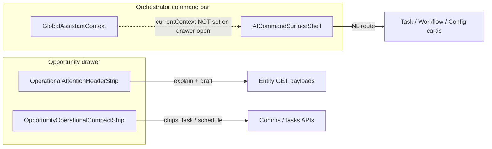
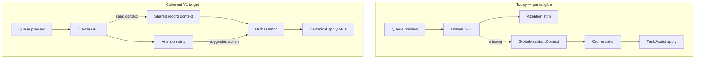

# BOS UX Coherence + Operational Intelligence Polish — Step 0 Audit

**Path:** `docs/sprints/05_2026/bos_ux_coherence_audit.md`  
**Status:** Audit complete — superseded for execution by **[`bos_ux_coherence_sprint.md`](./bos_ux_coherence_sprint.md)** (Step 2)  
**Date:** 2026-05-20  
**Role:** Staff Product Designer · UX Systems Architect · Operational AI UX Auditor · AdminV2 Interaction Reviewer

**Aligned doctrine (read):**

| Doc | Use in this audit |
|-----|-------------------|
| `docs/execution/operating-doctrine.md` | Doc/code parity, no parallel systems |
| `docs/product/bos-foundation.md` | BOS capability map, lifecycle, permissions, session state |
| `docs/system/workspace-system.md` | Queue truth, operational attention lanes, count semantics |
| `docs/system/configuration-system.md` | Four-plane settings, config-assist readiness |
| `docs/system/actions-and-workflows.md` | Action placements vs execution; Workflow Assist spine |
| `docs/execution/roadmap-and-gaps.md` | BOS expansion paused; demo vs production framing |

**Prior BOS engineering audits (context, not duplicated):** `bos_standardization_audit.md`, `bos_standardization_migration.md`, `bos_foundation_closeout_phase_3.md`, `agent_interaction_layer_v1.md`, `task_assist_v1_step0_audit.md`.

---

## 1. Executive Summary

### Overall BOS maturity

Alloy has crossed from “scattered AI experiments” into a **credible assistive operational layer** with real guardrails: Orchestrator routing, durable proposals for Task Assist and Config Assist, deterministic operational attention on entity GET, and a shipped `web/lib/bos/` registry + proposal envelope adapters. Architecture and doctrine are **stronger than the operator-facing coherence**.

Maturity by layer:

| Layer | Maturity | Notes |
|-------|----------|-------|
| **Safety / platform boundaries** | High | Proposal-first, org scope, no Orchestrator side effects, queue truth documented |
| **Capability inventory (code)** | High | `BOS_CAPABILITY_REGISTRY` (10 capabilities), adapters, command-surface metadata wire |
| **Interaction system (UX)** | Medium | Interaction Layer V1 unified bar; specialist cards still feel like separate products |
| **Explainability / trust copy** | Medium–low | Strong in config proposal cards; weak in drawer placeholders and split activity surfaces |
| **Visual / motion coherence** | Medium | Premium attention strip vs text-only command loading; workspace shimmer ≠ BOS loading |
| **End-to-end operational loop** | Medium | Drawer attention ↔ command bar ↔ apply paths are **not one continuous story** |

Program stance per `roadmap-and-gaps.md`: **deeper BOS expansion is paused**; this audit assumes the sprint goal is **demo-ready operational AI UX** (coherence, trust, polish) — not new capabilities.

### Biggest strengths

1. **Single Orchestrator entry** — `AICommandSurfaceShell` + `routeCommandSurface` (`commandSurfaceRouter.ts`) replaced mode tabs; NL routes to Task / Workflow / Config / job layout without the shell executing mutations.
2. **Proposal-first mutations** — Task Assist (`task_assist_proposals`), Config Assist (`config_layout_assist_proposals`), Workflow Assist propose/apply, agent v0–v2 DEFINER commits; aligns with `bos-foundation.md` lifecycle invariants.
3. **Deterministic operational intelligence in the record** — `_operational_attention` + `_attention_suggestion` on opportunity GET; `OperationalAttentionHeaderStrip` gives explainable next/why/draft without auto-execution.
4. **Workspace operational attention** — Department paired lanes, bucket semantics, `buildWorkUnitScopedNeedsAttentionLaneBuckets`, drawer compact strip (`OperationalAttentionHeaderStrip` chrome variant) respect queue-as-preview doctrine.
5. **BOS normalization layer (Phase 2–3)** — Envelopes and `appendActionCardTurnWithBosMetadata` prepare a unified review story without breaking native APIs.
6. **Contract tests** — `commandSurfaceInteractionLayerContract`, task/workflow/config assist contracts, drawer loading coherence, BOS adapter tests reduce regression risk.

### Biggest coherence risks

1. **Context fracture** — Opening an opportunity drawer does **not** seed `GlobalAssistantContext.currentContext`; ambient routing and “current opportunity” chip only activate after Task Assist flow in the shell (`setAssistantContext` ~589 in `AICommandSurfaceShell.tsx`). Drawer uses `OpportunityOperationalCompactStrip` instead of `TaskAssistOpportunityLauncher` (launcher exists but is not wired in production drawer per contract tests).
2. **Terminology and surface duplication** — “Orchestrator,” “Agent #2/3,” “BOS,” “Recent AI actions,” `commandSurface*`, and `/api/admin/agent` vs `/api/admin/ai` coexist in UI and docs (`crm-system.md` still references drawer `TaskAssistOpportunityLauncher`).
3. **Parallel proposal UX pipelines** — Config: in-thread field-setup → ready card → optional apply **or** settings review page; Workflow: in-thread apply; Task: compact cards + full workspace; Job layout: Preview/Apply/Advanced vocabulary — operators cannot learn one mental model.
4. **Production-visible “future” chrome** — `OperationalAttentionHeaderStrip` renders dashed “Future: linked actions” and raw `next_action.action_family` placeholder (~203–210); reads as prototype in an otherwise premium strip.
5. **Dead / leaky state** — `commandSurfaceMode` (`job_overview` \| `task_assist`) is set by `openAssistantWithContext` / focus events but **not read** by shell or thread UI; `OperationalAttentionDrawerSection` is implemented but **not mounted** in `AdminEntityDrawer.tsx`.

### Demo-readiness assessment

| Audience | Verdict |
|----------|---------|
| **Internal pilot (enrollment ops + comms drafts)** | **Demo-ready with coaching** — Task Assist + attention strip + workspace lanes work; operators need guidance on command bar vs drawer and config review path |
| **Settings/config demo** | **Cautious** — Config Assist partial apply catalog; two apply entry points confuse “what happened” |
| **Workflow demo** | **Cautious** — `window.prompt` for rename/description breaks premium command-surface UX (`AICommandSurfaceShell.tsx` ~1473–1485) |
| **Executive “coherent AI platform” story** | **Not yet** — fragmentation visible in 5 minutes: duplicate attention copy, AI activity strip vs thread, placeholder actions, inconsistent loading |

**Bottom line:** Backend BOS is **pilot-grade**; UX coherence is **pre-demo-premium** — polish and connection work, not a rebuild.

---

## 2. Current Strengths

### 2.1 Platform doctrine matches implementation

- **Configuration-not-execution** for insight capabilities (`needs_attention_suggestion`, `attention_enrich`) — enrich route is copy-only; Task Assist apply goes through `executeCommunicationsSend` / scheduled-send paths per `bos-foundation.md`.
- **Queue truth** — Workspace docs and `QueueService` enrichment are explicit; BOS does not treat queue rows as authority (`workspace-system.md`, `roadmap-and-gaps.md`).
- **Orchestrator prohibition** — `routeCommandSurface` returns route kinds only; shell `busy` gates duplicate submits; no apply from router.

### 2.2 Interaction Layer V1 (Orchestrator shell)

**Files:** `web/app/adminV2/components/aiCommandSurface/AICommandSurfaceShell.tsx`, `CommandSurfaceThread.tsx`, `web/lib/adminV2/aiCommandSurface/commandSurfaceThreadTypes.ts`, `commandSurfaceThreadPersistence.ts`.

| Strength | Evidence |
|----------|----------|
| Persistent thread per tab session | `sessionStorage` keys `alloy-adminv2-command-surface-thread` (+ expanded flag); SSR-safe restore after mount (`GlobalAssistantContext.tsx` ~113–126; sprint `agent_interaction_layer_v1.md`) |
| Specialist delegation | Thread turn kinds: `user_message`, `assistant_notice`, `entity_candidates`, `action_card` variants, workflow read cards, config field-setup/proposal/ready |
| Scroll discipline | `userScrolledUpRef` + `commandSurfaceThreadScroll.ts` — respects operator reading position |
| Workspace context for Workflow Assist create | `workspaceScope` on dept/WU pages; `setWorkspaceScope` idempotent shallow compare (`workflow_assist_v1.md`) |
| Card navigation pattern | `CommandSurfaceCardLink` + `collapseCommandSurfaceAfterNavigation` — drawer stays open (tested in `adminV2DrawerLoadingCoherence.test.ts`) |

### 2.3 Operational attention as embedded intelligence

**Resolver + attachment:** `web/lib/opportunities/opportunityAttentionResolver.ts`, `web/lib/admin/operationalAttentionEntityAttachment.ts`.

**Drawer chrome:** `OperationalAttentionHeaderStrip.tsx` — tiered UX: error → activity-only → premium suggestion (Sparkles, Next, Why, draft popover, Enhance draft) → deterministic fallback without suggestion.

**Workspace:** Dept page operational bootstrap (`loadDeptOperationalBootstrap.ts`, `operational-bootstrap/route.ts`), paired pipeline + Needs Attention lanes, attention bucket precedence on work-unit pages.

**Explainability primitives:** `operationalAttentionExplain.ts` (`nextStepGuidance`, `worstTierAmongReasons`); count semantics documented for QA parity (`workspace-system.md` § Needs attention count semantics).

### 2.4 Specialist capabilities (shipped narrow scope)

| Capability | UX anchor | Trust mechanism |
|------------|-----------|-----------------|
| **Task Assist** | `TaskAssistCompactDraftCard`, `TaskAssistCompactReminderCard`, `TaskAssistOpportunityWorkspace` | Propose → review → `POST …/task-assist/apply`; `task_assist_proposals` lifecycle |
| **Workflow Assist** | `WorkflowAssistProposalActionCard`, `WorkflowAssistReadThreadCard`, `WorkflowAssistDuplicateWarning` | Creates default **disabled**; duplicate warning; apply via workflow CRUD |
| **Config / Layout Assist** | `ConfigLayoutAssistFieldSetupCard`, `ConfigLayoutAssistProposalThreadCard`, `ConfigLayoutAssistReadyCard` | Risk level, operation count, review-required copy; settings hub `/adminV2/settings/config-proposals` |
| **Job overview layout** | Shell `SurfaceCard` / `OutcomeZone` primitives (~268–533) | Preview before `POST …/agent/v1/record-overview-layout` |
| **Needs attention insight** | Drawer strip + optional `OperationalAttentionEnhanceDraft` | Deterministic templates; LLM only on explicit enhance |

### 2.5 BOS registry and envelopes (coherence infrastructure)

- `web/lib/bos/bosCapabilityRegistry.ts` — 10 capabilities with domain, proposal_mode, apply_policy, permissions metadata.
- `bosProposalEnvelope.ts` + adapters — `raw_payload` preserves native shapes for apply; `mapConfigLayoutAssistStateToBosStatus` bridges status vocabulary.
- `commandSurfaceBosWire.ts` — `appendActionCardTurnWithBosMetadata` for workflow/config cards in thread.

This is the right **non-breaking** path to a unified proposal inbox later — already wired internally, not yet operator-visible as one system.

### 2.6 Test and contract coverage

Representative guardrails:

- `web/tests/adminV2/commandSurfaceInteractionLayerContract.test.ts` — no mode tabs, single input
- `web/tests/agent/taskAssist/aiCommandSurfaceTaskAssistContract.test.tsx` — routing + card shapes
- `web/tests/bos/bosProposalEnvelopeAdapters.test.ts` — envelope fidelity
- `web/tests/admin/drawer/operationalAttentionSuggestionUi.test.tsx` — “What BOS has to say” presence rules

---

## 3. UX Fragmentation

### 3.1 Naming and mental models

| Operator hears | Code / doc reality | Gap |
|----------------|-------------------|-----|
| “AI” / “Recent AI actions” | `RecentAiActionsStrip` → `GET /api/admin/agent/v1/activity` | Activity feed is **agent v1 audit**, not BOS capability registry or thread |
| “Orchestrator” | `commandSurface*`, `routeCommandSurface` | Product name in aria-label (~279 shell) but filenames/APIs say “command surface” / “AI” |
| “Agent #2 / #3” | `task_assist`, `workflow_assist` capability keys | Still in `bos-foundation.md` implementation inventory — confuses “BOS capability” rebranding |
| “What BOS has to say” | Deterministic `AttentionSuggestionV1`, not Orchestrator thread | Correct product intent; sits beside command bar that uses different thread vocabulary |
| “Configuration proposal” vs “Workflow proposal” vs “Task Assist draft” | All proposals; different status words and review surfaces | No shared **Proposal** noun in UI |

### 3.2 Multiple interaction dialects in one shell

**Command surface thread** (`CommandSurfaceThread.tsx`):

- User/assistant **chat bubbles** for notices and candidates.
- **Action cards** with `CommandSurfaceActionCardShell` for specialists.
- **Job layout** uses `SurfaceCard`, `OutcomeZone`, `AIActionsRow`, `DetailsToggle`, `AdvancedDrawer` — different density and vocabulary than Task Assist compact cards.

**Settings vs command bar for config:**

- `ConfigLayoutAssistProposalThreadCard` — “review required,” CTA to settings only.
- `ConfigLayoutAssistReadyCard` — optional in-thread approve+apply when `configAssistCanApproveAndApply`.
- Operators can complete the same proposal in **two places** with different affordances.

### 3.3 Drawer vs command bar as two products

- **Attention** is explained in drawer; **execution** of comms is pushed to command bar or compact strip — intentional separation, but **no automatic context handoff** when drawer opens.
- **Duplicate framing:** `OperationalAttentionHeaderStrip` in drawer **chrome** and again under inquiry summary “What BOS has to say” (`AdminEntityDrawer.tsx` ~8460, ~11088) — same data, two visual treatments.
- **`OperationalAttentionDrawerSection`** — collapsible “Operational detail” (`OperationalAttentionDrawerPanel.tsx`) — **not mounted** in live drawer; factors/reasons only in header strip or omitted.

### 3.4 Activity and audit surfaces disconnected from thread

| Surface | Location | Data source | Operator expectation mismatch |
|---------|----------|-------------|------------------------------|
| Command thread | Bottom bar | Ephemeral session + action cards | “What I asked the assistant” |
| Recent AI actions | Above bar (`RecentAiActionsStrip.tsx`) | Agent v1 activity API, max 3 | “What the system did” — may omit Task/Workflow/Config assist if not logged same way |
| AI Activity page | `/adminV2/ai-activity` | Deep audit (`AiActivityPageClient.tsx`) | “History” — copy says day-to-day is Recent strip |

On API failure, Recent strip **sets `hidden` true** with no retry (~32–40) — silent disappearance.

### 3.5 Workspace BOS entry points

- Dept/WU pages: `focusCommandBar({ seedCommand, expandThread })` for Workflow Assist — good.
- Queue row actions: registry + legacy buttons coexist (`actions-and-workflows.md`) — BOS does not replace; operator may not know which actions are “AI” vs platform.
- Automation block “Ask Assist” (`AutomationWorkflowsBlock.tsx`) — seeds workflow prompts; consistent with Orchestrator but another entry glyph.

### 3.6 Documentation drift (operator-facing risk)

- `docs/product/crm-system.md` — still describes drawer **`TaskAssistOpportunityLauncher`**; production drawer uses **`OpportunityOperationalCompactStrip`** per `opportunityOperationalCompactStrip.contract.test.ts`.
- `ai-system.md` is a stub → `bos-foundation.md`; engineers may still grep stale “agent” paths.

---

## 4. Operational Trust Gaps

Classification key: **(H)** hardening · **(P)** UX polish · **(A)** architectural cleanup · **(F)** future phase

### 4.1 Proposal lifecycle visibility (H + A)

| Issue | Detail | Classification |
|-------|--------|----------------|
| Unified status model exists only in adapters | Target statuses in `bos-foundation.md` (`draft` → `applied`); UI shows capability-native labels (`configLayoutAssistProposalStatusCopy`, Task Assist phases, workflow card badges) | **A** — inbox UI deferred; operators cannot scan “open proposals” across capabilities |
| Config partial apply | `configuration-system.md` + roadmap: apply catalog **incomplete** — operator may approve proposal whose operations silently skip | **H** |
| Workflow Assist `window.prompt` | Rename/description capture via browser prompt (~1473–1485 `AICommandSurfaceShell.tsx`) — no validation UX, no audit of edited text in card | **H/P** |
| Task Assist nested workspace | “More options” can mount full `TaskAssistOpportunityWorkspace` while compact draft card remains — risk of duplicate propose paths | **H** |

### 4.2 Context and authorization clarity (H)

| Issue | Detail |
|-------|--------|
| Drawer open ≠ command context | Without `setAssistantContext` from drawer, `hasAmbientOpportunity` false → weaker Workflow Assist explain/create routing |
| Policy gates opaque in UI | Org `metadata.ai_policy` features (`task_assist_draft`, `workflow_assist_draft`) + `ai.enrichment.use` + env flags — failures often generic notices in thread, not “org disabled” vs “you lack permission” |
| `getBosCapabilityAccessHints` | Registry metadata **does not enforce** (`bos-foundation.md`) — UI cannot yet show consistent “why disabled” |

### 4.3 Insight vs action boundary (H + P)

| Issue | Detail |
|-------|--------|
| Attention draft popover | Labeled “Draft · not sent” — good; adjacent **Future: linked actions** placeholder undermines trust (**P**) |
| Enhance draft | LLM polish is copy-only — `OperationalAttentionEnhanceDraft` must stay visually distinct from Task Assist send; generally OK but both use “draft” language |
| Queue `_needs_attention` styling | Subtle warning on pipeline lanes — correct preview signal; operators may think queue **caused** attention mutation |

### 4.4 Count and cohort trust (H — workspace)

Documented in `workspace-system.md`: dept preview `bucket_count_scope`, 500 vs 5000 caps, histogram vs unique inquiry — **UI rarely explains** why lane totals ≠ work-unit tab totals. BOS/coherence sprint should not fix math; **should** fix explainability where counts are shown side-by-side.

### 4.5 Persistence and session (H)

| Persisted | Not persisted | Risk |
|-----------|---------------|------|
| Thread turns, expanded flag | `currentContext`, `workspaceScope`, `commandSurfaceJobCardUi` | Navigate away mid-clarification → lose entity chip but keep thread referencing stale candidate |
| Clear conversation | — | Good explicit reset; no soft “archive” |

### 4.6 Mutation feedback (P + H)

- Task Assist apply success — thread + `dispatchAiActivityRefresh`; drawer comms tab may need manual refresh.
- Workflow apply — `workflowAssistWorkspaceEvents` refresh; not always obvious on Automations hub.
- Config apply from ready card — state transition in-thread; settings page list separate.

---

## 5. Explainability Review

### 5.1 Strong explainability (keep)

| Surface | Mechanism |
|---------|-----------|
| Operational attention strip | Primary reason, Next, Why (truncated), factor list, SLA/waiting tier via `nextStepGuidance` |
| Config proposal cards | Risk, operation count, mutating vs recommendation split, summary line |
| Workflow read cards | Enrollment touch, failed runs, explain v1 payloads (`workflowAssistExplainV1.ts`) |
| Workflow duplicate warning | Explicit likely-duplicate callout before apply |
| Entity search disambiguation | Candidate list + `formatCandidateDebugLine` in debug-oriented copy |
| Layout integrity (settings) | Read-only report — human settings path explainability |

### 5.2 Weak or missing explainability

| Gap | Where | Recommendation class |
|-----|-------|---------------------|
| **Why routed here** | After `routeCommandSurface`, thread shows result card but rarely “Routed to Task Assist because …” | **P** — one-line routing rationale in `assistant_notice` |
| **Policy denial** | Capability fetch failures in shell background schedulers | **H** — structured denial reasons from registry hints |
| **Config operation skipped on apply** | Partial catalog | **H** — per-operation apply result in ready card |
| **Attention without suggestion** | Fallback headline only — no “resolver returned no template” | **P** |
| **Workflow create without entity** | Empty explain trace (~1038–1059 shell) vs clear “open an opportunity or name one” | **P** |
| **Bucket count scope** | Dept lanes | **P** — tooltip/link to workspace-system semantics |
| **BOS envelope** | `bos_envelope` on cards — internal only | **F** — unified review UI |

### 5.3 Explainability vs “demo chrome”

Production UI that reads as **unfinished spec** rather than intentional v1 scope:

- `OperationalAttentionHeaderStrip` dashed linked-actions block (~203–210).
- `action_family` in monospace “Future” copy — developer-facing in operator UI.
- `OperationalAttentionEnhanceDraft` — depends on provider/env; stub path must explain “preview only” (verify copy in component).

---

## 6. Interaction Pattern Review

### 6.1 Cards

| Pattern | Components | Coherence note |
|---------|------------|----------------|
| **Shared action shell** | `CommandSurfaceActionCardShell` | Good baseline for config/workflow |
| **Task compact** | `TaskAssistCompactDraftCard`, `TaskAssistCompactReminderCard` | Different button row grammar than job layout `AIActionsRow` |
| **Job layout** | Shell internal `SurfaceCard` | Preview / Apply / Details / Advanced — legacy Agent Lab vocabulary |
| **Read-only workflow** | `WorkflowAssistReadThreadCard` | Consistent shell; inline row actions for failed runs |
| **Clarification** | `TaskAssistClarificationCard` | Task-only; config/workflow lack parallel clarification cards |

**Expand/collapse:** `toggleActionCardExpanded` only task_assist + job_layout — workflow proposals always expanded; inconsistent affordance.

### 6.2 Proposals

| Capability | Review UI | Apply UI | Status visibility |
|------------|-----------|----------|-------------------|
| Task Assist | Compact card body | Approve in card → apply route | Proposal table + optional proposals API |
| Workflow Assist | `WorkflowAssistProposalReviewPanel` | In-card Apply | Ephemeral in thread |
| Config Assist | Settings `ConfigLayoutProposalsClient` + thread cards | Ready card OR settings | DB state + mapped BOS status |
| Agent v0–v2 commits | Job layout / legacy | Apply on card | Activity strip |

**No cross-capability proposal list** in Orchestrator — operator must know where to look.

### 6.3 Drawers

- **Record drawer** hosts operational intelligence; **does not** host Orchestrator (by design — bottom bar global).
- **Drawer + command bar z-index** — `AdminV2Shell` `pb-[96px]` reserve; tested not to close drawer on card navigation.
- **Field policy / editability** — config-driven (`enforceDrawerFieldPoliciesOnPatch`) — BOS config proposals must respect same effective behavior (doctrine OK; UX when proposal conflicts with layout integrity report is untested in audit).

### 6.4 Actions and confirmations

- Task Assist: explicit approve before send — **gold standard** for operational trust.
- Workflow Assist: Apply with duplicate guard — strong.
- Config: “review required” vs ready-card apply — **split personality**.
- Job layout: “Apply anyway” toggle in job card UI state — good escape hatch; unique to layout cards.
- Platform **action registry** buttons in drawer/header — parallel to BOS; not visually grouped as “platform actions” vs “BOS suggestions.”

### 6.5 Loading

| Context | Pattern |
|---------|---------|
| Command submit | `busy` + “Working…” text (~1921–1924, ~1997–2007) |
| Capabilities | Background `scheduleAdminV2BackgroundWork` — no skeleton |
| Recent AI actions | “Recent AI actions…” text (~61–66) |
| Workspace dept | `DeptPairedOperQuietReserve`, `DeptOperationalRegionLoader`, route skeletons (`workspaceRouteSkeletons.tsx`) |
| Work unit queue | `WorkUnitQueueCompactRowSkeleton`, `queue:loading` synthetic row |
| Drawer | `DrawerRelationshipPanelSkeleton`; relationship panels |

**Inconsistency:** Workspace feels **premium** during navigation; BOS command area feels **lightweight/text** — perception gap under load.

### 6.6 Thread behavior

- Turns append-only; Clear wipes session.
- Collapsed preview shows truncated history (~1834, 1891–1894).
- Ambient context strip when `currentContext` set (~1910–1917) — **often empty in drawer-first workflows**.
- User scroll preservation — good operator respect.

### 6.7 Hierarchy

- Command bar `max-w-[840px]` vs fallback `AICommandBar` 720px — minor layout shift if flag toggles.
- Thread max height `clampExpandedHeightPx` — prevents runaway growth; may clip tall workflow review panels.
- Drawer: “What BOS has to say” competes with inquiry summary hierarchy — duplicate instances blur primary focal point.

---

## 7. Performance + Perceived Responsiveness Review

### 7.1 Loading perception

| Area | Behavior | Perception risk |
|------|----------|-----------------|
| Orchestrator submit | Sync route + async specialist handlers | “Working…” until entire handler completes — long workflow propose feels hung |
| Entity search | Network round-trip before candidates | No intermediate “Searching…” turn type — blank wait |
| Dept operational bootstrap | New consolidated fetch (`operational-bootstrap`) | Reduces fan-out — **positive** for lane stability |
| Recent AI actions | Idle-deferred 4s + 450ms fallback | Strip absent on first paint; then pops in — layout shift above bar |
| Attention on drawer open | Entity GET payload | Single load with record — good; enrich is extra click |

### 7.2 Skeleton stability

- Dept cold nav: **quiet reserve** (`DeptPairedOperQuietReserve`) avoids pulse mismatch with cached chrome — **best practice** in repo.
- `DeptPairedOperQueuesSkeleton` explicitly **not** used for dept `loading.tsx` — intentional anti-jank.
- Command surface: **no skeleton** — thread area height collapses/expands when first turn added — **layout shift** on first message.

### 7.3 Async transitions

- Workflow Assist apply → workspace events — async refresh may complete after operator navigates away.
- Config field-setup confirm → ready card — multi-step; state held in thread only (lost on Clear).
- Task Assist schedule — timezone/copy helpers; scheduled send presentation tested but dense.

### 7.4 Delayed affordances

- `workflowAssistMutationCapable` / `configAssistCanApproveAndApply` load after mount — Apply buttons may **appear late** (~1836–1838, ~1946–1948).
- Capabilities background fetch — routing works but permission-gated CTAs flicker.

### 7.5 Recommendations (audit-level)

- **P:** Add non-pulsing min-height reserve for collapsed command thread region.
- **P:** Stage “Searching records…” assistant turn before entity-search returns.
- **H:** Surface capability-denial before submit when org policy off (proactive disable + tooltip).
- **P:** Align Recent AI actions load with workspace quiet reserve or mount static height.

---

## 8. BOS Integration Review

### 8.1 Embedded (feels part of operations)

| Integration | Why it works |
|-------------|--------------|
| **Drawer attention strip** | Uses same resolver output as queues; compact chrome variant; no separate “AI panel” |
| **Workspace Needs Attention lanes** | Same bucket config as work-unit filters; `bucket_count_scope` in API |
| **Workflow Assist + workspace scope** | Create proposals inherit dept/WU from page effect |
| **Settings config proposals hub** | Same `ConfigurationProposalV1` as Orchestrator; deep links via `configLayoutAssistReviewNavigation` |
| **Queue row attention accent** | `_needs_attention` from `QueueService.enrichOpportunityRows` — preview-only styling |
| **Platform PATCH paths** | Config assist applies through same admin APIs as human settings |

### 8.2 Bolted on (feels like experiments stitched in)

| Integration | Why it feels bolted |
|-------------|---------------------|
| **Bottom command bar vs rest of AdminV2** | Visually distinct “AI bar”; thread bubbles unlike workspace/Settings design language |
| **Recent AI actions strip** | Separate data model (agent v1 activity) floating above bar |
| **Task Assist full workspace in thread** | Large form inside chat tray — different product idiom than compact operational chips in drawer |
| **Job layout Advanced drawer** | Agent Lab patterns inside Orchestrator thread |
| **Future linked actions placeholder** | Speculative UI in production drawer |
| **AI Activity page** | Orphan audit route for most operators |
| **Enhance draft** | Secondary LLM step adjacent to deterministic BOS copy — easy to confuse with Task Assist send |
| **CRM doc launcher** | Docs still describe removed drawer launcher pattern |

### 8.3 Integration diagram (target state vs today)

---

## 9. Demo Readiness Assessment

### 9.1 Still feels prototype

- Dashed **Future: linked actions** in drawer (`OperationalAttentionHeaderStrip.tsx`).
- **`window.prompt`** for workflow metadata edits.
- **Silent hide** of Recent AI actions on API error.
- **Duplicate** “What BOS has to say” blocks in one drawer.
- **Unused** `OperationalAttentionDrawerSection` — suggests incomplete drawer story.

### 9.2 Still feels unstable

- **Context loss** navigating drawer → command bar without explicit “Continue with this inquiry” handoff.
- **Capability button flicker** after background permission fetch.
- **Config partial apply** without per-operation transparency.
- **Thread Clear** with no undo — fine for v1, but demos can lose a long thread accidentally.

### 9.3 Still feels disconnected

- Three histories: thread, Recent AI actions, AI Activity page.
- Four proposal dialects: Task / Workflow / Config / Job layout.
- Drawer attention vs command execution require operator training.
- Settings integrity report not linked from Config Assist ready card when proposal would fail integrity.

### 9.4 Not yet premium

- Command area text loading vs workspace shimmer system.
- Mixed typography scales between compact Task cards and job layout cards.
- `AICommandBar` fallback narrower than shell — edge env flag demos.
- Enroll ops demo: strong attention gradient vs command bar plain bubbles — visual brand mismatch.

### 9.5 Demo scripts that work today

1. **Needs attention → drawer → read suggestion → enhance draft (copy)** — deterministic, trustworthy.
2. **Dept workspace → Needs Attention lane → open drawer → strip in chrome** — operational coherence.
3. **Command bar → “text [family] about …” → pick candidate → compact draft → approve send** — full Task Assist loop.
4. **Command bar → workflow summary / explain** — read cards, no mutation.
5. **Settings → config proposals** — review persisted proposal (config path clearer than in-thread ready card).

### 9.6 Demo scripts to avoid until polish

1. Config NL propose → in-thread apply for **unsupported** operation kinds.
2. Workflow create → rename via **browser prompt** in front of executives.
3. Drawer open → immediate Workflow Assist “explain this record” without naming entity in command.
4. Comparing Needs Attention counts across dept lane vs WU tab without explaining caps.

---

## 10. Prioritized Findings

### V1 required (demo-ready operational AI UX)

| # | Finding | Class | Primary files / surfaces |
|---|---------|-------|---------------------------|
| 1 | Seed `GlobalAssistantContext` when opportunity drawer opens (entity label + available actions) | **H** | `AdminEntityDrawer.tsx`, `GlobalAssistantContext.tsx` |
| 2 | Remove or hide production “Future: linked actions” placeholder; replace with nothing or “Suggested next steps ship separately” footnote in docs only | **P** | `OperationalAttentionHeaderStrip.tsx` |
| 3 | Replace `window.prompt` workflow rename/description with in-card fields | **P/H** | `AICommandSurfaceShell.tsx`, `WorkflowAssistProposalActionCard.tsx` |
| 4 | Single config apply story in UI copy: when to use settings review vs ready card; gate ready card when partial apply | **H/P** | `ConfigLayoutAssistReadyCard.tsx`, `ConfigLayoutProposalsClient.tsx` |
| 5 | Routing explainability one-liner after specialist route | **P** | `AICommandSurfaceShell.tsx`, `CommandSurfaceThread.tsx` |
| 6 | Policy denial messages (org `ai_policy` vs user permission vs env) | **H** | Shell capability schedulers, `taskAssistV1UiGate`, propose routes |
| 7 | Deduplicate drawer attention: chrome **or** inquiry panel, not both with full premium block | **P** | `AdminEntityDrawer.tsx` |
| 8 | Wire `OpportunityOperationalCompactStrip` / drawer CTA → `focusCommandBar` + `setAssistantContext` | **H** | `OpportunityOperationalCompactStrip.tsx`, drawer header |
| 9 | Recent AI actions: retry affordance; do not silently hide strip | **P** | `RecentAiActionsStrip.tsx` |
| 10 | Command thread min-height / searching turn to reduce layout shift | **P** | `AICommandSurfaceShell.tsx`, `CommandSurfaceThread.tsx` |
| 11 | Update stale `crm-system.md` drawer Task Assist entry (launcher → compact strip + command bar) | **P** | docs only |
| 12 | Mount or delete `OperationalAttentionDrawerSection` — avoid dead pattern | **A/P** | `OperationalAttentionDrawerSection.tsx`, `AdminEntityDrawer.tsx` |

### V1.5 optional (polish + coherence, still in pause-friendly scope)

| # | Finding | Class |
|---|---------|-------|
| 13 | Unified “open proposals” read-only list surfacing Task + Config durable proposals (read from existing tables/APIs) | **A/P** |
| 14 | Visual harmonization: command cards adopt workspace token weights / borders | **P** |
| 15 | Bucket count scope tooltip on dept attention lanes | **P** |
| 16 | Link layout integrity warnings from config proposal cards | **P** |
| 17 | Remove dead `commandSurfaceMode` from focus API or implement job_overview affordance | **A** |
| 18 | Task Assist: collapse workspace when compact card sufficient | **P** |
| 19 | Workflow clarification card parity with Task Assist | **P** |
| 20 | Expand `toggleActionCardExpanded` to workflow proposals | **P** |
| 21 | AI Activity strip labels → “Recent BOS activity” + capability badges if activity API extended | **A/P** |

### Future phase (explicitly out of V1 polish sprint)

| # | Finding | Class |
|---|---------|-------|
| 22 | Unified proposal inbox UI over `BosProposalEnvelopeV1` | **F** |
| 23 | `next_action.action_family` → configurable action placements (no autonomous execution) | **F** |
| 24 | Autonomous agents, multi-agent orchestration, deep memory | **F** |
| 25 | LLM slot extraction replacing deterministic parsers | **F** |
| 26 | Full Config/Layout Assist apply catalog expansion | **F** (program paused) |
| 27 | Workflow Assist template expansion | **F** (program paused) |
| 28 | Cross-entity director dashboards / LLM queue ranking | **F** |

---

## 11. Recommendations (Audit-Level Only)

**No implementation plans. No sprint cards.** Directional themes for a follow-on design/build phase.

### 11.1 Coherence thesis

Treat BOS as **one operational intelligence layer with three operator surfaces**, not five products:

1. **Record context** (drawer strip + entity GET) — explain and suggest.
2. **Command Orchestrator** (bottom bar thread) — route, propose, apply with human gates.
3. **Settings / audit** (config proposals, AI activity) — review, history, permissions.

Every sprint change should answer: *which surface owns this moment, and how do the other two reflect it?*

### 11.2 Trust-first (hardening)

- **Context handoff** is the highest-leverage trust fix: drawer-open must set the same record context the Orchestrator uses for routing, chips, and Workflow Assist explain.
- **Never show speculative UI** in production drawer (`Future:` placeholders) — demo readiness requires finished or absent.
- **Partial apply transparency** for Config Assist — operators must see which operations applied vs skipped.
- **Policy denials** should name org vs user vs environment — reduce “broken AI” support burden.

### 11.3 UX polish (premium demo)

- **One attention block per drawer** — chrome-first; inquiry summary references strip or collapses detail.
- **Replace browser prompts** in workflow flow with in-card forms matching `CommandSurfaceActionCardShell`.
- **Loading vocabulary** — adopt quiet reserve / min-height for command rail; “Searching…” turns.
- **Terminology pass** — operator-facing: Orchestrator, Task Assist, Workflow Assist, Config Assist, “BOS suggestion”; deprecate “Agent #N” in UI strings (docs can lag one sprint).

### 11.4 Architectural cleanup (without rebuild)

- **Decide fate of `commandSurfaceMode`** — remove from public API or implement visible job-layout context (no tabs).
- **Consolidate activity narrative** — thread for conversation; single activity feed keyed by `capability_key` when APIs allow; until then, label Recent strip honestly (“Agent audit trail”) or extend logging.
- **Use `bos_envelope` for a read-only cross-capability status strip** before building full inbox — low-risk coherence win.
- **Delete or wire `OperationalAttentionDrawerSection`** — half-built drawer sections erode trust.

### 11.5 Preserve (non-negotiables)

- Proposal-first architecture and separate native payloads in `raw_payload`.
- Orchestrator executes **no** side effects.
- Queue truth boundary; entity GET for authority.
- AdminV2 workspace model and permission boundaries.
- Workflow/event spine for standardized mutations.
- Pause on autonomous agents and Config/Layout catalog expansion per `roadmap-and-gaps.md`.

### 11.6 Success criteria for “demo-ready operational AI UX”

An informed operator can:

1. Open an inquiry from a Needs Attention lane and **understand why** without reading code.
2. **Continue** the same inquiry in the command bar **without re-searching**.
3. Complete a Task Assist send with clear **approve** boundary.
4. Distinguish **deterministic suggestion** vs **LLM enhance** vs **Task Assist send**.
5. Review a config proposal in Settings and know **what will change** before apply.
6. Never see **developer placeholders** or browser prompts in a coached demo path.

---

## Appendix A — Files inspected (representative)

### Doctrine
- `docs/execution/operating-doctrine.md`
- `docs/product/bos-foundation.md`, `docs/product/ai-system.md` (stub)
- `docs/system/workspace-system.md`, `configuration-system.md`, `actions-and-workflows.md`
- `docs/execution/roadmap-and-gaps.md`
- `docs/sprints/05_2026/agent_interaction_layer_v1.md`, `bos_standardization_audit.md`, `task_assist_v1_step0_audit.md`

### Orchestrator / thread
- `web/app/adminV2/components/aiCommandSurface/*` (10 components)
- `web/lib/adminV2/aiCommandSurface/*`
- `web/contexts/GlobalAssistantContext.tsx`
- `web/app/adminV2/components/AdminV2Shell.tsx`
- `web/app/adminV2/components/aiActivity/RecentAiActionsStrip.tsx`

### BOS layer
- `web/lib/bos/*` (registry, envelopes, adapters, wire)

### Operational attention
- `web/components/admin/drawer/OperationalAttentionHeaderStrip.tsx`
- `web/components/admin/drawer/OperationalAttentionDrawerSection.tsx` (unmounted)
- `web/components/admin/opportunity/OpportunityOperationalCompactStrip.tsx`
- `web/lib/workspace/loadDeptOperationalBootstrap.ts`

### Task / workflow / config assist
- `web/components/admin/taskAssist/*`
- `web/lib/agent/taskAssist/*`
- `web/lib/agent/workflowAssist/*`
- `web/lib/agent/configLayoutAssist/*`

### Workspace / loading
- `web/app/adminV2/workspace/dept/[departmentId]/page.tsx`
- `web/components/admin/workspace/workspaceRouteSkeletons.tsx`
- `web/components/admin/workspace/WorkspaceQuietLoadingReserve.tsx`

### Tests (contracts referenced)
- `web/tests/adminV2/commandSurfaceInteractionLayerContract.test.ts`
- `web/tests/agent/taskAssist/aiCommandSurfaceTaskAssistContract.test.tsx`
- `web/tests/agent/taskAssist/opportunityOperationalCompactStrip.contract.test.ts`
- `web/tests/bos/bosFoundationReadiness.test.ts`

---

## Appendix B — Classification legend (used in §10)

| Tag | Meaning | Sprint stance |
|-----|---------|-----------------|
| **H** | Needs hardening — trust, safety, lifecycle clarity | V1 required |
| **P** | Needs UX polish — hierarchy, copy, loading, placement | V1 required or V1.5 |
| **A** | Needs architectural cleanup — duplicated patterns, dead state | V1 if small; else V1.5 |
| **F** | Future phase — explicitly paused or net-new scope | Do not schedule |

---

*End of Step 0 audit. **Step 1:** [`bos_ux_coherence_design.md`](./bos_ux_coherence_design.md). **Step 2 (implementation cards):** [`bos_ux_coherence_sprint.md`](./bos_ux_coherence_sprint.md).*
