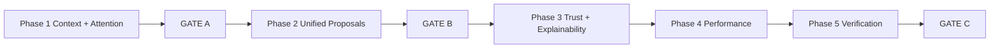

# BOS UX Coherence + Operational Intelligence Polish — Implementation Sprint

**Path:** `docs/sprints/05_2026/bos_ux_coherence_sprint.md`  
**Status:** Ready for implementation  
**Date:** 2026-05-20

**Binding inputs (do not diverge):**

| Phase           | Document                                                     |
| --------------- | ------------------------------------------------------------ |
| Step 0 — Audit  | [`bos_ux_coherence_audit.md`](./bos_ux_coherence_audit.md)   |
| Step 1 — Design | [`bos_ux_coherence_design.md`](./bos_ux_coherence_design.md) |

**Doctrine (unchanged):** `docs/product/bos-foundation.md`, `docs/system/workspace-system.md`, `docs/system/configuration-system.md`, `docs/system/actions-and-workflows.md`, `docs/execution/roadmap-and-gaps.md`, `docs/execution/operating-doctrine.md`

**Program stance:** BOS capability **expansion paused** — this sprint **unifies, hardens, and polishes** shipped assistive surfaces only.

---

## 1. Sprint goal

Make BOS feel like **one workflow-native operational intelligence layer** embedded in AdminV2 — so an operator can **trust and understand** what BOS shows, proposes, and applies.

**Success statement:**

> An informed operator can move from Needs Attention → drawer → Orchestrator on the **same inquiry** without re-searching; recognize **one Operational Proposal** pattern; see **why** routing and policy decisions occurred; and never encounter prototype chrome in a coached demo path.

**Not the goal:** More advanced AI, new capabilities, autonomous agents, or chatbot UX.

---

## 2. Why this sprint (audit → design → build)

| Problem (audit)                          | Design response                        | Build outcome            |
| ---------------------------------------- | -------------------------------------- | ------------------------ |
| Drawer does not seed command context     | Active operational context (§6 design) | Context on drawer open   |
| Four proposal dialects                   | Operational Proposal anatomy (§5)      | Shared card regions      |
| Policy/errors opaque                     | Denial + routing templates (§7–8)      | Structured operator copy |
| Prototype placeholders / `window.prompt` | Attention + trust standards (§10, §8)  | Production-safe chrome   |
| Command loading vs workspace             | Performance standards (§11)            | Calm rail behavior       |

---

## 3. Scope

1. **Contextual intelligence** — drawer/queue → `GlobalAssistantContext`; Orchestrator chip; ops strip handoff.
2. **Operational Attention hierarchy** — single premium attention per drawer; remove speculative UI.
3. **Unified Operational Proposal UX** — shared anatomy on existing cards/envelopes (display only).
4. **Trust & explainability** — routing notices, policy denials, partial apply visibility, execution receipts (Task/Workflow minimum).
5. **Perceived performance** — command rail reserve, searching turn, activity strip stability.
6. **Coherence pass** — terminology, docs touch-up, contract tests, demo validation.

---

## 4. Non-scope (explicit)

| Forbidden                                                  | Notes                                    |
| ---------------------------------------------------------- | ---------------------------------------- |
| Autonomous agents / multi-agent orchestration              | Program paused                           |
| New BOS capabilities or Orchestrator routes                | No catalog expansion                     |
| Config/Layout Assist **apply catalog** expansion           | Partial catalog remains; visibility only |
| Workflow Assist **template** expansion                     | Maintenance-only                         |
| Proposal **table merge** or envelope schema redesign       | `raw_payload` stays authoritative        |
| LLM-required routing / memory systems                      | Deterministic parsers preserved          |
| Queue/resolver semantic changes                            | Unless bugfix with product sign-off      |
| Full proposal inbox UI                                     | V1.5 backlog                             |
| `commandSurface*` code rename sprint                       | Operator copy only in V1                 |
| Chatbot patterns (persona, prompt chips, typing theatrics) | Interaction Layer V1 preserved           |

---

## 5. Implementation constraints

| Preserve                                                     | Do not                                      |
| ------------------------------------------------------------ | ------------------------------------------- |
| `BosProposalEnvelopeV1` + adapters                           | Invent parallel proposal types              |
| `routeCommandSurface` precedence                             | Add side effects to Orchestrator            |
| `executeAdminAction` / `emitEvent` spine                     | Bypass for BOS apply                        |
| Queue truth boundary                                         | Mutate from queue rows                      |
| AdminV2 shell / workspace model                              | Second command bar                          |
| Org `ai_policy` + RBAC gates                                 | Client-side apply without server validation |
| Existing API paths (`/api/admin/ai/*`, `/api/admin/agent/*`) | New orchestration microservices             |

**Batching rule for Cursor:** Execute cards in **listed order** within a phase; do not start Phase 2 until **GATE A** passes. Combine sub-cards in the same batch only when they share files and no gate dependency.

---

## 6. Phase map and gates



| Gate  | Name                           | Blocks                                         | Pass when                               |
| ----- | ------------------------------ | ---------------------------------------------- | --------------------------------------- |
| **A** | Contextual intelligence stable | Phase 2+                                       | § GATE A checklist all checked          |
| **B** | Unified proposal UX stable     | Phase 3–4 polish that touches card copy/layout | § GATE B checklist all checked          |
| **C** | Demo coherence validation      | Sprint closeout                                | § GATE C checklist + manual demo script |

---

## GATE A — Contextual intelligence stable

**Required before Phase 2.**

- [ ] Opening opportunity drawer sets `GlobalAssistantContext` (`entity_type`, `entity_id`, `label`, `source_surface`).
- [ ] Closing drawer clears context (or documented exception tested).
- [ ] Orchestrator shows **active record** chip matching open drawer.
- [ ] Workflow Assist explain/create uses `hasAmbientOpportunity` without extra search when drawer open.
- [ ] Exactly **one** premium Operational Attention block per opportunity drawer viewport.
- [ ] No dashed “Future: linked actions” (or `action_family` placeholder) in production drawer UI.
- [ ] `OpportunityOperationalCompactStrip` (or drawer CTA) focuses command bar with context seeded.
- [ ] Tests: drawer context contract; attention UI contract (no duplicate premium block).

---

## GATE B — Unified proposal UX stable

**Required before Phase 3 cards that change governance copy on cards (13–17) and before Phase 5 terminology pass.**

- [x] Shared Operational Proposal regions visible on Task, Workflow, and Config thread cards (§ Card 7 anatomy).
- [ ] No `window.prompt` in workflow propose/edit path *(deferred from Card 9 — still in `AICommandSurfaceShell` rename/description handlers)*.
- [x] Risk + **Approval required** consistent where `requires_approval` / preview-apply true.
- [x] Job layout card uses same header/summary/risk pattern (job-specific diff region in `children`).
- [x] Tests: workflow/config/job layout frame contracts + existing thread card contracts.

### Gate B readiness — Phase 2 closeout (2026-05-20)

| Surface                                | Frame | Notes       |
| -------------------------------------- | ----- | ----------- |
| Task Assist compact draft/reminder     | ☑     | Cards 8     |
| Workflow Assist proposal/review        | ☑     | Cards 9     |
| Config Assist thread + Settings review | ☑     | Cards 10–11 |
| Job overview layout                    | ☑     | Card 12     |

**Verified:** Stale/blocked guards (Task Assist), approval/mutation boundary copy, presentational-only frame (no API changes). Behaviors unchanged across propose/apply paths.

**Not sprint-complete:** Gate C demo script, Phase 3–5 cards, `window.prompt` workflow edit removal.

**Manual UI checklist before Phase 3:** (1) Open inquiry drawer → Orchestrator handoff auto-runs with active record. (2) Task Assist draft: frame, Send now disabled when stale. (3) Workflow proposal: Apply disabled draft + Automations link. (4) Config proposal thread → Settings review same frame family. (5) Job layout command: collapsed frame → expand → Approve and apply only after preview.

---

## GATE C — Demo coherence validation

**Required for sprint closeout.**

- [ ] Manual demo script (§ Demo script) passes without coaching on prohibited paths.
- [ ] `cd web && npx tsc --noEmit` clean.
- [ ] Targeted tests (§ Test plan) green.
- [ ] No production placeholder chrome; policy denial shows structured reason at least once in QA.
- [ ] `docs/product/crm-system.md` drawer BOS entry matches shipped pattern.
- [ ] Audit §11.6 success criteria met.

---

## PHASE 1 — Contextual intelligence + attention hierarchy

**Theme:** BOS is aware of the record the operator is already viewing.

**Cursor batch guidance:** Cards **1–2** together (context API + shell chip). Cards **3–4** together (drawer layout). Card **5** alone. Card **6** alone (delete/archive).

---

### Card 1 — Active operational context on drawer open/close

**Audit:** #1 · **Design:** §6.1, V1-CTX

**Files (primary):**

- `web/components/admin/AdminEntityDrawer.tsx`
- `web/contexts/GlobalAssistantContext.tsx`
- `web/lib/adminV2/bos/activeOperationalContext.ts` *(new small helper — types + map entity → context; optional)*

**Work:**

1. When drawer opens an **opportunity** (or generalize to `GlobalAssistantEntityType`), call `setAssistantContext` with `label` from drawer title/subtitle resolver, `source_surface: "opportunity_drawer"`, sensible `available_actions`.
2. On drawer close / entity switch: update or clear context per design §6.2 (recommended: **clear on close**; **replace on switch**).
3. Do **not** persist context to `sessionStorage` (thread only is persisted).

**Acceptance criteria:**

- [ ] Open opportunity from queue → command bar chip shows same label without running Task Assist first.
- [ ] `routeCommandSurface` receives `hasAmbientOpportunity: true` when drawer open (shell already passes — verify end-to-end).
- [ ] Closing drawer removes chip within one render cycle.
- [ ] No new API routes.

**Tests:**

- New/extend: `web/tests/agent/taskAssist/globalAssistantContext.test.tsx` or `adminEntityDrawerBosContext.contract.test.ts`
- Regression: `aiCommandSurfaceTaskAssistContract.test.tsx`

---

### Card 2 — Orchestrator context chip + stale apply guard

**Audit:** #1 (cont.) · **Design:** §6.4, §6.3

**Files:**

- `web/app/adminV2/components/aiCommandSurface/AICommandSurfaceShell.tsx`
- `web/app/adminV2/components/aiCommandSurface/CommandSurfaceThread.tsx`

**Work:**

1. Render **Active record** chip when `currentContext` set (truncated label; `aria-label` full name).
2. Optional: one-line `assistant_notice` on context **switch** only (not on every drawer open — avoid chatty).
3. **V1 minimum stale guard:** Disable Task/Workflow **Apply** on action cards when `card.entityId !== currentContext.entity_id` (if IDs present on card payload).

**Acceptance criteria:**

- [ ] Chip visible whenever drawer-seeded context active.
- [ ] Apply disabled with short reason when card entity mismatches current context.
- [ ] Thread expand/collapse unchanged; no auto-expand on context set.

**Tests:**

- Extend `commandSurfaceInteractionLayerContract.test.ts` or new shell context chip test (source contract strings).

---

### Card 3 — Drawer attention deduplication (P1 chrome only)

**Audit:** #7 · **Design:** §10.2

**Files:**

- `web/components/admin/AdminEntityDrawer.tsx`
- `web/components/admin/drawer/OperationalAttentionHeaderStrip.tsx`

**Work:**

1. **P1 authoritative:** `OperationalAttentionHeaderStrip` `variant="chrome"` in title stack only.
2. Inquiry summary “What BOS has to say”: **remove** second premium strip; replace with slim reference line (“See operational summary above”) **or** suppress section when chrome strip already showing suggestion.
3. Preserve `suppressSectionBrandLabel` behavior for tests/dev fixtures.

**Acceptance criteria:**

- [ ] At most one premium gradient attention block per drawer.
- [ ] `operationalAttentionSuggestionUi.test.tsx` updated — still asserts copy where appropriate, not duplicate premium blocks.
- [ ] Chrome strip still shows Next/Why/draft popover when suggestion present.

**Tests:**

- `web/tests/admin/drawer/operationalAttentionSuggestionUi.test.tsx`

---

### Card 4 — Remove prototype attention chrome + optional command handoff

**Audit:** #2 · **Design:** §4.4, §10.4

**Files:**

- `web/components/admin/drawer/OperationalAttentionHeaderStrip.tsx`
- `web/components/admin/drawer/OperationalAttentionEnhanceDraft.tsx` *(copy pass only if needed)*

**Work:**

1. **Delete** dashed `alloy_linked_actions_placeholder` block (~203–210).
2. Do **not** add replacement speculative actions (design: optional CTA only).
3. Optional V1: secondary text link **“Continue in command bar”** → `focusCommandBar({ seedCommand })` with deterministic seed from `suggestion.next_action.label` (no auto-send).

**Acceptance criteria:**

- [ ] No “Future:” or raw `action_family` visible in drawer production UI.
- [ ] Enhance draft still labeled preview-only; no send button added here.

**Tests:**

- Update `operationalAttentionSuggestionUi.test.tsx` — must **not** contain `Future:` or `action_family` placeholder strings.

---

### Card 5 — Ops strip → Orchestrator handoff

**Audit:** #8 · **Design:** §9.4, §6.5

**Files:**

- `web/components/admin/opportunity/OpportunityOperationalCompactStrip.tsx`
- `web/components/admin/AdminEntityDrawer.tsx` *(wiring only if needed)*

**Work:**

1. Chips/CTAs that imply Task Assist (“Draft message”, schedule, reminder) call `focusCommandBar` + ensure context seeded (Card 1).
2. Deprecate path that only focuses bar without context.
3. Do **not** reintroduce `TaskAssistOpportunityLauncher` in drawer body (contract: launcher not in drawer).

**Acceptance criteria:**

- [ ] From drawer ops strip, command bar opens with correct opportunity chip and seeded command where applicable.
- [ ] `opportunityOperationalCompactStrip.contract.test.ts` still passes.

**Tests:**

- `web/tests/agent/taskAssist/opportunityOperationalCompactStrip.contract.test.ts`

---

### Card 6 — Dead attention section cleanup

**Audit:** #12 · **Design:** §10.6

**Files:**

- `web/components/admin/drawer/OperationalAttentionDrawerSection.tsx`
- `web/components/admin/drawer/OperationalAttentionDrawerPanel.tsx`
- Tests referencing section

**Work (choose one — prefer A):**

- **A (preferred):** Delete unused section/panel components; migrate any unique copy into strip collapsed “Factors” toggle if needed.
- **B:** Mount section below fold with **non-premium** styling — only if product insists on collapsible factors (not recommended).

**Acceptance criteria:**

- [ ] No orphaned components imported only in tests without product use.
- [ ] Grep shows zero imports of `OperationalAttentionDrawerSection` in `AdminEntityDrawer.tsx`.

**Tests:**

- Remove or update tests that imported deleted components.

---

## PHASE 2 — Unified operational proposal system

**Theme:** One proposal language; same backend payloads.

**Cursor batch guidance:** Card **7** first (shared module). Cards **8–9** batch. Cards **10–11** batch. Card **12** with 7 or after 8–11.

**GATE A must be green before starting Phase 2.**

---

### Card 7 — Operational Proposal shell (UX-only shared component) ☑ (2026-05-20)

**Audit:** §5 design · **Design:** §5.2–5.3

**Files (new):**

- `web/app/adminV2/components/bos/OperationalProposalCardFrame.tsx`
- `web/lib/adminV2/bos/operationalProposalPresentation.ts`
- `web/tests/adminV2/operationalProposalCardFrame.test.tsx`

**Frame anatomy (region order fixed):**

1. **Header** — eyebrow “Operational proposal”, title, `capability · type`, status badge, active record line  
2. **Why shown** — source, reason label/detail, optional slot  
3. **Summary** · **Scope** · **Change detail** (`children`)  
4. **Risk & approval** — approval required, risk level, mutation/policy copy  
5. **Validation** — errors / warnings lists  
6. **Actions** — `footer` slot  
7. **Receipt** — `receipt` slot + variant styling (`normal` | `review_required` | `blocked` | `stale` | `applied` | `failed`)

**Presentation module:** `OPERATIONAL_PROPOSAL_CAPABILITY_LABELS`, `OPERATIONAL_PROPOSAL_STATUS_LABELS`, `formatOperationalProposalTypeLine`, `resolveOperationalProposalFrameVariant`. No envelope mapper in this card (deferred to Card 8+).

**Migration boundary:** **No** Task/Workflow/Config/Job cards wrapped yet — frame only; Cards 8–9 adopt shell.

**Tests run:**

```bash
cd web && npm run test -- tests/adminV2/operationalProposalCardFrame.test.tsx
```

**Acceptance criteria:**

- [x] Frame is presentational only — no fetch/apply logic inside.
- [x] Specialist cards not migrated in Card 7 (intentional).
- [x] `requiresApproval` shows “Approval required” when true.

---

### Card 8 — Task Assist cards adopt Operational Proposal frame ☑ (2026-05-20)

**Audit:** proposal fragmentation · **Design:** §5.8

**Files migrated:**

- `web/components/admin/taskAssist/TaskAssistCompactDraftCard.tsx`
- `web/components/admin/taskAssist/TaskAssistCompactReminderCard.tsx`
- `web/lib/adminV2/bos/taskAssistOperationalProposalPresentation.ts` *(title/type/summary copy)*
- `web/app/adminV2/components/aiCommandSurface/CommandSurfaceThread.tsx` *(removed duplicate `StaleOperationalProposalBanner`; frame owns stale copy)*

**Mapping:**

| Frame region  | Draft                                                     | Reminder                      |
| ------------- | --------------------------------------------------------- | ----------------------------- |
| Title         | Send/schedule outbound message                            | Reminder title from bootstrap |
| Type          | Message draft / Scheduled message                         | Reminder proposal             |
| Capability    | Task Assist                                               | Task Assist                   |
| Context       | `entityLabel` + optional site scope                       | Same                          |
| Source        | Task Assist                                               | Task Assist                   |
| Summary       | Channel · instruction                                     | —                             |
| Change detail | Channel, body, recipient, schedule fields                 | Title, due, notes             |
| Approval      | Required + mutation boundary (no auto-send)               | Required                      |
| Stale         | `mutationsBlocked` → `STALE_OPERATIONAL_PROPOSAL_MESSAGE` | Same                          |
| Footer        | Send now / schedule / save draft                          | Create reminder               |
| Receipt       | Applied success message                                   | Created task receipt          |

**Behavior preserved:** propose/apply/schedule APIs, `mutationsBlocked` disables actions, `taskAssistV1UiGate`, no auto-send.

**Tests run:**

```bash
cd web && npm run test -- tests/adminV2/taskAssistOperationalProposalFrame.test.tsx tests/agent/taskAssist/taskAssistCompactDraftCard.test.tsx
```

**Acceptance criteria:**

- [x] Approve/send semantics unchanged (no auto-send).
- [x] Cards read as Operational Proposal.

---

### Card 9 — Workflow Assist proposal cards adopt Operational Proposal frame ☑ (2026-05-20)

**Audit:** #3 · **Design:** §5.8

**Files migrated:**

- `web/app/adminV2/components/aiCommandSurface/WorkflowAssistProposalActionCard.tsx`
- `web/app/adminV2/components/aiCommandSurface/WorkflowAssistProposalReviewPanel.tsx`
- `web/lib/adminV2/bos/workflowAssistOperationalProposalPresentation.ts`

**Mapping:** `Workflow Assist · Workflow proposal`; title from suggestion/create headline; scope from draft review; high risk + approval required; disabled-draft boundary copy; footer = Apply + Open Automations; receipt = apply success/failure; blocked when `!applyAllowed`.

**Deferred (not Loop 5):** `window.prompt` rename/description in `AICommandSurfaceShell.tsx` (Card 9 original scope item — shell migration only this loop).

**Behavior preserved:** `/api/admin/ai/workflow-assist/apply`, disabled draft default, duplicate warning, automation refresh dispatch.

**Tests run:**

```bash
cd web && npm run test -- tests/adminV2/workflowAssistOperationalProposalFrame.test.tsx tests/adminV2/workflowAssistProposalApplyRefresh.test.ts
```

**Acceptance criteria:**

- [x] Proposal cards use `OperationalProposalCardFrame` (no `CommandSurfaceActionCardShell` on proposal surfaces).
- [x] Apply still creates **disabled** workflow by default (server unchanged).
- [x] Duplicate warning still functional.

---

### Card 10 — Config Assist thread proposal surfaces ☑ (2026-05-20)

**Audit:** #4 · **Design:** §5.3 L3, §5.4

**Files migrated:**

- `web/app/adminV2/components/aiCommandSurface/ConfigLayoutAssistProposalThreadCard.tsx`
- `web/app/adminV2/components/aiCommandSurface/ConfigLayoutAssistReadyCard.tsx`
- `web/app/adminV2/components/aiCommandSurface/ConfigLayoutAssistFieldSetupCard.tsx`
- `web/lib/adminV2/bos/configLayoutAssistOperationalProposalPresentation.ts`

**Mapping:** `Config Assist · Configuration proposal` (field setup uses **Field setup** type); title from `buildProposalReviewPresentation`; context from proposal metadata; approval + risk from proposal; mutation boundary from existing status copy; Settings hub copy when persisted; footer = review / approve / confirm controls unchanged.

**Deferred:** Partial apply Applied/Skipped breakdown UI (display-only catalog) — no server breakdown in this loop.

**Tests run:**

```bash
cd web && npm run test -- tests/adminV2/configLayoutAssistOperationalProposalFrame.test.tsx tests/adminV2/configLayoutAssistProposalThreadCard.contract.test.ts tests/adminV2/configLayoutAssistFieldSetupFlow.contract.test.ts
```

**Acceptance criteria:**

- [x] Thread proposal, ready, and field-setup cards use `OperationalProposalCardFrame`.
- [x] Review CTA and apply gating unchanged.

---

### Card 11 — Config Assist Settings / apply surfaces ☑ (2026-05-20)

**Audit:** #4 · **Design:** §5.4

**Files migrated:**

- `web/app/adminV2/settings/config-proposals/ConfigLayoutProposalReviewPanel.tsx`
- `web/app/adminV2/settings/config-proposals/ConfigLayoutProposalsClient.tsx` *(passes `lifecycleState`)*

**Mapping:** Settings review uses frame with lifecycle status badge, mutation boundary by state, lifecycle actions in footer, message/failed receipt; confirm-change + advanced details in `children` (reduced nested card chrome).

**Behavior preserved:** List/detail fetch, state transitions, apply route, permission hints, recommendation-only hints.

**Tests:** Covered by `configLayoutAssistOperationalProposalFrame.test.ts` (settings panel contract).

**Acceptance criteria:**

- [x] Settings review panel uses shared proposal frame.
- [x] Apply/review lifecycle semantics unchanged.

---

### Card 12 — Job layout proposal surfaces ☑ (2026-05-20)

**Audit:** job layout dialect · **Design:** §5.8

**Files migrated:**

- `web/app/adminV2/components/aiCommandSurface/JobLayoutOperationalProposalCard.tsx` *(new)*
- `web/lib/adminV2/bos/jobLayoutOperationalProposalPresentation.ts` *(new)*
- `web/app/adminV2/components/aiCommandSurface/AICommandSurfaceShell.tsx` — `renderJobLayoutCardActions`
- `web/app/adminV2/components/aiCommandSurface/CommandSurfaceThread.tsx` — collapsed job layout thread card

**Mapping:** `Job overview layout · Layout proposal`; scope **Job record · overview layout**; approval + medium risk; preview mutation boundary; primary action **Approve and apply** (was Apply); Details + Advanced JSON in `children`; receipt on applied.

**Behavior preserved:** Semantic preview planner, noop apply-anyway checkbox, `/api/admin/agent/v1/record-overview-layout` apply, expand/collapse thread, Refine/Collapse/Full log.

**Tests run:**

```bash
cd web && npm run test -- tests/adminV2/jobLayoutOperationalProposalFrame.test.tsx tests/adminV2/operationalProposalCardFrame.test.tsx tests/adminV2/taskAssistOperationalProposalFrame.test.tsx tests/adminV2/workflowAssistOperationalProposalFrame.test.tsx tests/adminV2/configLayoutAssistOperationalProposalFrame.test.ts
```

**Acceptance criteria:**

- [x] Job layout preview-before-apply; no new auto-apply.
- [x] Visual family matches Task/Workflow/Config proposal cards.

---

### Card 12 (original sprint) — Proposal status badge helper (envelope-aware display) → Phase 2+ / optional

**Audit:** lifecycle visibility · **Design:** §8.2

**Files:**

- `web/lib/adminV2/bos/operationalProposalPresentation.ts`
- `web/lib/bos/bosProposalStatusMap.ts` *(read-only use — extend map only if missing labels)*

**Work:**

1. Centralize operator status text + badge variant (color differentiation pending vs applied).
2. Wire `appendActionCardTurnWithBosMetadata` cards to use helper when `bos_envelope` present.

**Acceptance criteria:**

- [ ] Config `reviewed` → “Ready for review”; `applied` vs `draft` visually distinct.
- [ ] No merge of proposal DB tables.

**Tests:**

- `operationalProposalPresentation.test.ts`
- `bosProposalEnvelopeAdapters.test.ts` (regression)

---

## PHASE 3 — Trust, explainability, governance

**Theme:** Operators know why, what changes, and what executed.

**GATE B must be green before Cards 13–17.**

**Cursor batch guidance:** Cards **13–14** batch (notices + denials). Cards **15–16** batch. Card **17** copy-only sweep.

---

### Card 13 — Routing notices after specialist route ☑ (2026-05-20, Loop 8)

**Audit:** #5 · **Design:** §7.3, §3.2

**Files:**

- `web/app/adminV2/components/aiCommandSurface/AICommandSurfaceShell.tsx` *(append turn in each `run*Route`)*
- `web/lib/adminV2/aiCommandSurface/commandSurfaceRoutingCopy.ts` *(new — deterministic one-liners)*
- `web/app/adminV2/components/aiCommandSurface/CommandSurfaceThread.tsx`

**Work:**

1. After successful route, append `assistant_notice` **before** specialist card: e.g. “Routed to Task Assist — message intent and family name detected.”
2. Templates per `CommandSurfaceRouteKind` + key slots (no LLM).
3. Workflow blocked → notice explains Workflow Assist vs Task Assist boundary.

**Acceptance criteria:**

- [ ] Every specialist route from submit shows exactly one routing notice unless `clarify` only.
- [ ] Notices are one sentence; no emoji/persona.

**Tests:**

- `commandSurfaceRouter.test.ts` + shell contract test for notice strings.

---

### Card 14 — Policy denial presentation + proactive disable ☑ (2026-05-20, Loop 8)

**Audit:** #6 · **Design:** §7.4, §8.1

**Files:**

- `web/app/adminV2/components/bos/BosPolicyDenialNotice.tsx` *(new)*
- `web/lib/adminV2/bos/resolveBosPolicyDenial.ts` *(new — map org policy / permission / env to template)*
- `web/app/adminV2/components/aiCommandSurface/AICommandSurfaceShell.tsx`
- `web/lib/agent/taskAssist/taskAssistV1UiGate.ts`
- `web/lib/bos/auth/index.ts` *(read hints only)*

**Work:**

1. Structured denial component per design template (Not available — reason + bullet lines).
2. When capability fetch returns disabled, show denial in thread **instead of** empty card flash.
3. Optionally disable submit placeholder when org `ai_policy` off for all propose paths (soft gate — do not break read routes).

**Acceptance criteria:**

- [ ] Staging org without `task_assist_draft` shows org-level message, not generic error.
- [ ] Missing `ai.enrichment.use` shows access line when strict resolution applies.

**Tests:**

- `resolveBosPolicyDenial.test.ts`
- Extend task assist gate tests if needed.

#### Card 13–14 implementation notes (Loop 8 — 2026-05-20)

**Routing notices (Card 13)**

- Added `commandSurfaceRoutingCopy.ts` with deterministic one-line templates per `CommandSurfaceRouteKind` + slot/intent hints (`buildCommandSurfaceRoutingNotice`, `shouldAppendCommandSurfaceRoutingNotice`).
- `AICommandSurfaceShell` appends `assistant_notice` with `noticeRole: "routing"` after route resolution (except clarify and Workflow Assist boundary-only).
- Entity search path appends `ENTITY_SEARCH_ROUTING_NOTICE` before lookup.
- Candidate pick prompts use `taskAssistCandidateListPrompt` (no “I found…” / “Confirm who you mean”).
- `WORKFLOW_ASSIST_NOTICE_TEXT` / boundary aligned to operational copy (no “That’s a workflow request” chatter).
- `CommandSurfaceThread` styles routing notices like context boundaries (`data-command-surface-routing-notice`).

**Policy / governance copy (Card 14)**

- Added `bosGovernanceCopy.ts` (`STALE_OPERATIONAL_PROPOSAL_MESSAGE`, `WORKFLOW_ASSIST_MUTATION_BLOCKED_COPY`, `resolveBosPolicyDenial`, config apply permission line).
- Added `BosPolicyDenialNotice.tsx`; thread turn `policy_denial` for Task Assist env-off (replaces generic error).
- `activeOperationalContext` and `workflowAssistReadV1` re-export governance strings; `operationalProposalPresentation` blocked/stale defaults aligned.
- `ConfigLayoutAssistReadyCard` uses `CONFIG_ASSIST_APPLY_PERMISSION_COPY`.

**Wording standards (Cards 13–14)**

| Use | Avoid |
| --- | --- |
| “Routing to {Specialist} — {operational reason}.” | “Matched capability heuristic”, “AI selected”, “Detected keyword” |
| “Using active record: {label}” | Debug route IDs, internal capability keys in notices |
| “This organization currently allows review-only workflow recommendations.” | “Portal blocked”, “Mutation denied”, “Policy violation” |
| “This proposal is tied to a different active record.” | “Stale context”, “Context mismatch violation” |
| “Not available — {reason}” + bullets + optional next step | Generic `error` flash for known policy gates |

**Files changed**

- `web/lib/adminV2/aiCommandSurface/commandSurfaceRoutingCopy.ts` *(new)*
- `web/lib/adminV2/bos/bosGovernanceCopy.ts` *(new)*
- `web/app/adminV2/components/bos/BosPolicyDenialNotice.tsx` *(new)*
- `web/lib/adminV2/bos/activeOperationalContext.ts`, `operationalProposalPresentation.ts`
- `web/lib/adminV2/aiCommandSurface/commandSurfaceRouter.ts`, `commandSurfaceThreadTypes.ts`, `commandSurfaceThreadScroll.ts`
- `web/lib/agent/workflowAssist/workflowAssistReadV1.ts`, `taskAssistOrchestratorCopy.ts`
- `web/app/adminV2/components/aiCommandSurface/AICommandSurfaceShell.tsx`, `CommandSurfaceThread.tsx`, `ConfigLayoutAssistReadyCard.tsx`
- Tests: `commandSurfaceRoutingCopy.test.ts`, `bosGovernanceCopy.test.ts`, `commandSurfaceRoutingShell.contract.test.ts`; updated `commandSurfaceRouter.test.ts`

**Behaviors preserved**

- `routeCommandSurface` precedence and specialist execution paths unchanged.
- Propose/apply APIs, envelopes, RBAC gates, and `mutationsBlocked` stale logic unchanged (copy only).
- `workflow_notice` turn retained for Automations link on Workflow Assist boundary.

**Tests run**

```bash
cd web && npm run test -- tests/adminV2/commandSurfaceRoutingCopy.test.ts tests/adminV2/bosGovernanceCopy.test.ts tests/adminV2/commandSurfaceRoutingShell.contract.test.ts tests/adminV2/commandSurfaceRouter.test.ts
```

---

### Card 15 — Config partial apply + integrity hint

**Audit:** #4, #16 (hint only V1) · **Design:** §5.4, §7.5

**Files:**

- `web/app/adminV2/components/aiCommandSurface/ConfigLayoutAssistReadyCard.tsx`
- `web/lib/agent/configLayoutAssist/configLayoutAssistApplyPresentation.ts` *(new or extend)*

**Work:**

1. Post-apply: render per-operation rows if API returns them; else client-side known unsupported kinds from existing catalog constant (read-only list).
2. Footer link: **“Check layout integrity in Settings → Layouts”** when proposal touches layout fields (heuristic from operation kinds).

**Acceptance criteria:**

- [ ] After apply, operator sees at least one line per mutating operation result or explicit “skipped” state.
- [ ] No new integrity API — link only.

**Tests:**

- Unit test for presentation mapper with fixture apply responses.

---

### Card 16 — Execution receipt turns (Task Assist + Workflow Assist)

**Audit:** execution visibility · **Design:** §5.7, §8.5–8.6

**Files:**

- `web/lib/adminV2/aiCommandSurface/commandSurfaceThreadTypes.ts` *(add `execution_receipt` turn or reuse `assistant_notice` with kind)*
- `web/app/adminV2/components/aiCommandSurface/CommandSurfaceThread.tsx`
- `AICommandSurfaceShell.tsx` *(append on successful apply)*

**Work:**

1. After successful Task apply / schedule / workflow apply: append receipt turn with past-tense copy per design §8.5.
2. Include entity label + timestamp (org TZ from existing helpers).
3. Optional link: “View in Automations” / comms tab via `CommandSurfaceCardLink` pattern.

**Acceptance criteria:**

- [ ] Failed apply shows **Failed** + server message; does not say “Sent”.
- [ ] Receipt appears in-thread without clearing prior proposal card.

**Tests:**

- Thread state append test; task assist apply contract (mock fetch).

---

### Card 17 — Mutation boundary copy pass (insight vs execution)

**Audit:** enrich confusion · **Design:** §8.4

**Files:**

- `web/components/admin/drawer/OperationalAttentionEnhanceDraft.tsx`
- `web/components/admin/taskAssist/*` *(hero labels only)*
- `web/app/adminV2/components/aiActivity/RecentAiActionsStrip.tsx` *(label: “Recent operational activity” or honest “Activity log”)*

**Work:**

1. Standardize: “Enhanced draft (preview only)”, “Copy only — does not send”, “Applies through Communications”.
2. Remove “AI sent” / “AI changed” phrasing in touched files.

**Acceptance criteria:**

- [ ] Grep for `AI sent` / `AI changed` in adminV2 BOS paths returns zero in operator strings.

**Tests:**

- Copy contract strings in existing drawer tests.

---

## PHASE 4 — Performance + perceived responsiveness

**Theme:** Calm, stable command rail.

**May start after GATE B; may parallelize with Phase 3 Card 17 if no file conflicts.

**Cursor batch guidance:** Cards **18–19** batch (shell + activity strip).

---

### Card 18 — Command rail reserve + searching turn

**Audit:** #10 · **Design:** §11.2

**Files:**

- `web/app/adminV2/components/aiCommandSurface/AICommandSurfaceShell.tsx`
- `web/app/adminV2/components/aiCommandSurface/CommandSurfaceThread.tsx`
- `web/lib/adminV2/aiCommandSurface/commandSurfaceThreadTypes.ts`

**Work:**

1. Min-height reserve for collapsed thread panel (match design ~11.2 — use existing `clampExpandedHeightPx` baseline).
2. On entity-search path: append immediate `assistant_notice` “Searching records…” before fetch completes.
3. `busy` state: keep “Working…” on input; no spinner in textarea.

**Acceptance criteria:**

- [ ] First command in session does not jump page content by > reserved height.
- [ ] Search shows notice before candidates or clarify.

**Tests:**

- `commandSurfaceThreadScroll.test.ts` (regression)
- Contract: searching notice string in shell.

---

### Card 19 — Recent activity strip stability

**Audit:** #9 · **Design:** §11.2, §8.6

**Files:**

- `web/app/adminV2/components/aiActivity/RecentAiActionsStrip.tsx`

**Work:**

1. Reserved min-height container (1 line) always when strip mounted.
2. On fetch failure: show **“Activity log unavailable — Retry”** (do not `hidden=true` silently).
3. Rename operator label per Card 17 (“Recent operational activity” or “Activity log”).

**Acceptance criteria:**

- [ ] Network failure still shows strip chrome with retry.
- [ ] Successful load unchanged functionally.

**Tests:**

- Component test with mocked fetch failure.

---

### Card 20 — Capability CTA flicker mitigation

**Audit:** §7.4 delayed affordances · **Design:** §11.4

**Files:**

- `web/app/adminV2/components/aiCommandSurface/AICommandSurfaceShell.tsx`

**Work:**

1. Resolve `workflowAssistMutationCapable` / `configAssistCanApproveAndApply` before rendering Apply buttons **or** render disabled Apply with label “Checking permissions…” until resolved (no pop-in).
2. Prefer caching capability result for session (in-memory ref), refresh on org change only.

**Acceptance criteria:**

- [ ] Apply button does not appear from nothing after paint without label transition.
- [ ] No extra API calls per keystroke.

**Tests:**

- Source contract: shell contains stable loading label for apply gate.

---

## PHASE 5 — Verification + coherence pass

**Theme:** Demo-ready, native to AdminV2.

**Cursor batch guidance:** Cards **21–23** batch (docs + tests). Card **24** optional cosmetic.

---

### Card 21 — Terminology normalization (operator strings)

**Audit:** terminology · **Design:** Appendix A

**Files (grep-driven):**

- `web/app/adminV2/components/aiCommandSurface/*`
- `web/components/admin/drawer/OperationalAttentionHeaderStrip.tsx`
- `web/app/adminV2/settings/config-proposals/ConfigLayoutProposalsClient.tsx`
- Remove UI strings **Agent #2**, **Agent #3**, **AI magic** where operator-visible

**Work:**

1. Apply terminology table from design Appendix A.
2. Keep `aria-label="Orchestrator assistant"` on shell.

**Acceptance criteria:**

- [ ] No operator-visible “Agent #N” in AdminV2 BOS UI paths.

**Tests:**

- Grep-based contract test `adminV2BosTerminology.contract.test.ts` (optional lightweight).

---

### Card 22 — Doctrine doc alignment (minimal)

**Audit:** #11 · **operating-doctrine.md** rule

**Files:**

- `docs/product/crm-system.md` — drawer Task Assist entry → compact strip + command bar
- `docs/product/bos-foundation.md` — add **one paragraph** pointer to this sprint + design doc (UX standards live in sprint/design, not duplicate)
- Append **Implementation progress** subsection below in **this file** during build (checkboxes per card)

**Acceptance criteria:**

- [ ] CRM doc matches shipped drawer pattern.
- [ ] No new markdown files beyond this sprint doc.

---

### Card 23 — Contract tests + regression bundle

**Files:**

- See § Test plan

**Work:**

1. Add/update tests listed in § Test plan.
2. Run targeted suite before GATE C.

**Acceptance criteria:**

- [ ] All tests in § Test plan pass in CI/local.
- [ ] `tsc --noEmit` clean.

---

### Card 24 — Light visual harmonization (optional, timeboxed)

**Audit:** V1.5 #14 · **Design:** §9.1

**Files:**

- `web/app/adminV2/components/bos/OperationalProposalCardFrame.tsx`
- `web/app/adminV2/components/workspace/workspace.css` *(read tokens only)*

**Work:**

1. Align proposal card borders/type weights to `--ws-type-fact-*` or `derived.border` patterns — **no redesign**.
2. Timebox: ≤ 1 day; skip if GATE C met without it.

**Acceptance criteria:**

- [ ] Cards visually closer to workspace cards; Orchestrator still distinct rail.

---

## V1.5 backlog (do not block sprint closeout)

| ID     | Item                                                                                              | Audit #           |
| ------ | ------------------------------------------------------------------------------------------------- | ----------------- |
| V1.5-1 | Read-only open proposals list (envelope-backed)                                                   | 13                |
| V1.5-2 | Bucket count scope tooltips on dept lanes                                                         | 15                |
| V1.5-3 | Integrity warnings inline on config cards (API link)                                              | 16                |
| V1.5-4 | Remove `commandSurfaceMode` from public focus API                                                 | 17                |
| V1.5-5 | De-emphasize full `TaskAssistOpportunityWorkspace` in thread                                      | 18                |
| V1.5-6 | Workflow clarification card parity                                                                | 19                |
| V1.5-7 | Stale thread card labeling on context switch                                                      | design §6.3       |
| V1.5-8 | **BOS recommendation intelligence** — richer drawer handoff than deterministic labels (see below) | Gate A refinement |

### V1.5-8 — BOS recommendation intelligence (product direction)

**V1 shipped (Gate A):** Drawer **Recommended next step** card via `buildOperationalRecommendationHandoffCopy` — primary label from `_attention_suggestion.next_action` / attention reason map, single operational reason line, active-record context, auto-submit handoff to Orchestrator (review/approve; no auto-send).

**V1.5 evolution:** Move from **deterministic next-action labels** to **richer operational recommendations** on the same handoff surface (still workflow-native; not LLM-marketing or autonomous execution).

| Capability                  | V1.5 target                       | Notes                                                                                                                                                                |
| --------------------------- | --------------------------------- | -------------------------------------------------------------------------------------------------------------------------------------------------------------------- |
| **Recommended action type** | Explicit operator taxonomy        | e.g. send message, schedule reminder, update status, review stalled inquiry — surfaced on card, not only `next_action.label` text                                    |
| **Reason stack**            | Multi-factor explainability       | Combine signals: stale inquiry, no outbound response, tour interest, waiting duration, family/stage — not one summary string only                                    |
| **Proposed message draft**  | When comms recommended            | Surface deterministic draft from existing `suggested_content` / templates where channel = message; preview in card or Orchestrator entry (still approve-before-send) |
| **Context-aware inputs**    | Parent / child / household search | Extend entity search & recommendation inputs beyond household name (child names, location, room/program) — aligns with Gate A search backlog                         |
| **Outcome-informed rules**  | After operational history matures | Recommendation rules informed by outcomes (response rates, stage progression) once enough history exists — rules/config, not speculative LLM                         |

**Constraints (carry forward):** Deterministic + explainable; resolver/attention/task semantics authoritative; no autonomous send/apply; no new Orchestrator routes required for V1.5 framing — enrich presentation and rule inputs on existing paths first.

**Related V1.5 items:** V1.5-7 (thread labeling on context switch); entity-search breadth (Gate A blocker note § active context).

---

## Test plan (targeted)

```bash
cd web && npx tsc --noEmit
cd web && npm run test -- \
  web/tests/adminV2/commandSurfaceInteractionLayerContract.test.ts \
  web/tests/agent/taskAssist/aiCommandSurfaceTaskAssistContract.test.tsx \
  web/tests/agent/taskAssist/opportunityOperationalCompactStrip.contract.test.ts \
  web/tests/agent/taskAssist/globalAssistantContext.test.tsx \
  web/tests/admin/drawer/operationalAttentionSuggestionUi.test.tsx \
  web/tests/adminV2/configLayoutAssistProposalThreadCard.contract.test.ts \
  web/tests/adminV2/workflowAssistProposalApplyRefresh.test.ts \
  web/tests/bos/bosProposalEnvelopeAdapters.test.ts \
  web/tests/admin/adminV2DrawerLoadingCoherence.test.ts
```

**Add in this sprint:**

- `operationalProposalCardFrame.test.ts`
- `resolveBosPolicyDenial.test.ts`
- Drawer BOS context contract test (Card 1)
- Grep/contract: no `window.prompt` in `aiCommandSurface/`
- Grep/contract: no `Future:` in `OperationalAttentionHeaderStrip`

---

## Demo script (GATE C manual)

**Do:**

1. Dept workspace → Needs Attention lane → open inquiry → read chrome attention (one block) → **Continue in command bar** (if present) or ops chip → chip shows same family.
2. Command bar: `text [family] about [goal]` → routing notice → candidate → compact **Operational Proposal** → approve send → **receipt** in thread.
3. Drawer: open draft popover → Enhance draft → confirm copy-only labeling.
4. Command bar: workflow explain with drawer open → read card uses ambient context.
5. Config: propose → Settings review link from card → partial apply visibility on staged unsupported op (if test org configured).

**Do not demo:**

- Config NL apply for unsupported operation kinds without reading skipped list.
- Workflow rename via browser prompt (must be gone).
- Comparing dept vs WU attention counts without cap explanation (until V1.5-2).

---

## Implementation progress (append during build)

### Loop 1 — Cards 1–2 (2026-05-20)

**Card 1 — Active operational context on drawer open/close**

- `useEffect` in `AdminEntityDrawer.tsx` calls `buildOpportunityOperationalContext` when `drawer.type === "opportunities"`; clears context on close or non-opportunity drawer.
- `source_surface`: `queue` when `drawer.opportunityQueuePreviewSeed` present, else `opportunity_drawer`.
- Label from `resolveOpportunityOperationalContextLabel` (customer/household from entity GET; queue seed while hydrating).
- Helpers: `web/lib/adminV2/bos/activeOperationalContext.ts`.
- `setAssistantContext` shallow-compares via `entityOperationalContextEqual` in `GlobalAssistantContext.tsx` to avoid redundant renders.

**Card 2 — Orchestrator context chip + stale apply guard**

- `OperationalActiveRecordChip.tsx` — **Active record ·** label, reserved `min-h-[26px]`, surface hint (Drawer/Queue/Command).
- Replaced legacy **Context:** copy in `AICommandSurfaceShell.tsx`.
- Context switch: one `assistant_notice` when `entity_id` changes (not on first seed) via `operationalContextSwitchNoticeText`.
- `CommandSurfaceThread`: `activeOperationalEntityId` prop; stale banner + `mutationsBlocked` on Task Assist compact cards when card `entityId` ≠ active context.
- `hasAmbientOpportunity` unchanged — now true when drawer seeds context.

**Tests:** `tests/adminV2/activeOperationalContext.test.ts`, `tests/admin/adminEntityDrawerBosContext.contract.test.ts`, `globalAssistantContext.test.tsx` (equal helper).

**GATE A:** Partial — Cards 1–2 (Loop 1); see Loop 3 readiness table after Cards 5–6.

### Loop 2 — Cards 3–4 (2026-05-20)

**Card 3 — Attention deduplication**

- Removed second `OperationalAttentionHeaderStrip` (`variant="panel"`) from inquiry summary “What BOS has to say”.
- Canonical surface: drawer title-stack `variant="chrome"` only (`data-operational-attention-canonical="chrome"`).
- Inquiry summary: slim reference line `operational_attention_reference` when `_operational_attention` present; ops strip + activity unchanged below.

**Card 4 — Prototype chrome removal**

- Deleted dashed `alloy_linked_actions_placeholder` block and “Future:” copy from `OperationalAttentionHeaderStrip.tsx`.

**Tests:** `operationalAttentionSuggestionUi.test.tsx` updated; `adminEntityDrawerBosContext.contract.test.ts` Loop 2 block.

### Loop 3 — Cards 5–6 (2026-05-20) — Phase 1 closeout

**Card 5 — Operational strip → command bar handoff**

- `OpportunityOperationalCompactStrip.tsx`: **Continue in Orchestrator** CTA (`data-drawer-slot="operational_orchestrator_handoff"`).
- On click: `setAssistantContext(buildOpportunityOperationalContext(...))` then `focusCommandBar({ expandThread: true, seedCommand, preferMode: "task_assist" })`.
- Seed from `orchestratorHandoffSeedCommand` in `activeOperationalContext.ts` (uses `_attention_suggestion.next_action.label` when present).
- Calm subcopy: review/approve before send; no auto-mutation; no chatbot language.
- Preserves Loop 1 context seeding from drawer; handoff re-affirms same `entity_id` so operator does not re-search.

**Card 6 — Dead drawer section cleanup**

- **Deleted** `OperationalAttentionDrawerSection.tsx` (was never mounted in `AdminEntityDrawer`).
- **Retained** `OperationalAttentionDrawerPanel.tsx` — still used by dev gallery `web/app/dev/p1c-operational-attention-review/P1cReviewGallery.tsx` for factor/timing fixtures; not a production drawer entry point.
- Tests: `operationalAttentionSuggestionUi.test.tsx` panel-only block; drawer contract still asserts no section import.

**Deviations / constraints**

- Did not delete panel variant (dev review only).
- Did not add header-strip handoff CTA (Card 5 scoped to compact strip per sprint).
- No new Orchestrator routes, Task Assist rewrite, or workflow changes.

**Files changed (Loop 3)**

- `web/lib/adminV2/bos/activeOperationalContext.ts`
- `web/components/admin/opportunity/OpportunityOperationalCompactStrip.tsx`
- `web/components/admin/drawer/OperationalAttentionDrawerSection.tsx` (deleted)
- `web/tests/adminV2/activeOperationalContext.test.ts`
- `web/tests/agent/taskAssist/opportunityOperationalCompactStrip.contract.test.ts`
- `web/tests/admin/drawer/operationalAttentionSuggestionUi.test.tsx`

**Tests run (Loop 3)**

```bash
cd web && npm run test -- tests/adminV2/activeOperationalContext.test.ts \
  tests/agent/taskAssist/opportunityOperationalCompactStrip.contract.test.ts \
  tests/admin/drawer/operationalAttentionSuggestionUi.test.ts \
  tests/admin/adminEntityDrawerBosContext.contract.test.ts \
  tests/agent/taskAssist/globalAssistantContext.test.tsx
```

**GATE A readiness (Phase 1 — not full sprint closeout)**

| Criterion                                         | Status                                  |
| ------------------------------------------------- | --------------------------------------- |
| Drawer seeds `GlobalAssistantContext`             | ☑ Loop 1                                |
| Close clears context                              | ☑ Loop 1                                |
| Active record chip                                | ☑ Loop 1                                |
| Single premium attention (chrome)                 | ☑ Loop 2                                |
| No Future/placeholder chrome                      | ☑ Loop 2                                |
| Ops strip handoff → command bar + context         | ☑ Loop 3                                |
| Dead drawer section removed / panel documented    | ☑ Loop 3                                |
| Contract tests green                              | ☑ 29 tests (Loop 1–3 bundle) 2026-05-20 |
| Manual: Workflow Assist ambient without re-search | ☐ GATE A demo                           |
| Manual: handoff chip matches drawer record        | ☐ GATE A demo                           |

**GATE A:** Ready for review — Phase 1 cards 1–6 implemented; human demo + test bundle required before Phase 2 (Card 7+).

### Gate A blocker fix — command surface above drawer (2026-05-20)

**Issue (manual review):** With an opportunity drawer open, the portaled drawer stack (`z` 60/70) covered the Orchestrator rail (`z` 20 inside shell), blocking active-record chip, handoff, and command input validation.

**Fix:** Portaled `AICommandSurfaceShell` `SurfaceCard` to `document.body` as a `fixed` global rail at `ADMINV2_COMMAND_SURFACE_Z` (90) — above drawer panel (70), below shell chrome (100). Drawer outside-click ignore list unchanged (`data-adminv2-ai-command-surface`).

**Files changed**

- `web/components/admin/Drawer.tsx` — `ADMINV2_COMMAND_SURFACE_Z`
- `web/app/adminV2/components/aiCommandSurface/AICommandSurfaceShell.tsx` — portal + fixed layer
- `web/tests/adminV2/commandSurfaceLayering.contract.test.ts` (new)
- `web/tests/admin/drawerAdminV2PointerEvents.test.ts`

**Validation required before Gate A sign-off**

- [ ] Open opportunity drawer → Orchestrator visible and clickable
- [ ] Active record chip visible with drawer open
- [ ] Continue in Orchestrator expands/focuses visible rail
- [ ] Drawer still closes on workspace outside-click; command surface clicks do not dismiss drawer
- [ ] Re-run Loop 1–3 test bundle

### Gate A blocker fix — active context short-circuits record search (2026-05-20)

**Issue (manual review):** Command surface was visible above the drawer, but Task Assist still ran broad entity search and showed “I found N matching records. Which one?” even when `GlobalAssistantContext` held the open drawer opportunity.

**Fix:** `shouldShortCircuitTaskAssistEntitySearch` in `activeOperationalContext.ts` — when an active opportunity exists and the command does not explicitly request cross-record search, `runTaskAssistRoute` shows `Using active record: …` and proceeds via `proceedToTaskAssistAction` without `fetchTaskAssistEntitySearch`. Explicit search phrases (`find`, `which record`, `list all`, etc.) still disambiguate.

**Record picker readability:** `formatCandidateOperatorPresentation` — primary label, Opportunity · status · location, related people, match reason; raw ids/debug only when `NEXT_PUBLIC_COMMAND_SURFACE_SEARCH_DEBUG=1` in development.

**V1.5 / future backlog (not implemented):** Broader entity search by child name, household, location, room/program, and bulk audience selection for messaging — captured here only; no bulk search/messaging in this fix.

**Files changed**

- `web/lib/adminV2/bos/activeOperationalContext.ts`
- `web/app/adminV2/components/aiCommandSurface/AICommandSurfaceShell.tsx`
- `web/app/adminV2/components/aiCommandSurface/CommandSurfaceThread.tsx`
- `web/lib/agent/taskAssist/taskAssistEntitySearchDisambiguation.ts`
- `web/tests/adminV2/activeContextTaskAssistRouting.test.ts` (new)
- `web/tests/adminV2/activeOperationalContext.test.ts`
- `web/tests/agent/taskAssist/taskAssistEntitySearchDisambiguation.test.ts`

**Validation required**

- [ ] Drawer open → Continue in Orchestrator → Ask → no “Which one?” picker; uses active record
- [ ] Command with “find …” / “which record” still shows disambiguation when appropriate
- [ ] Stale Task Assist card guard unchanged
- [ ] Search result cards readable without raw ids

### Gate A visual refinement — premium Orchestrator handoff CTA (2026-05-20)

**Change:** Replaced plain “Continue in Orchestrator” link in `OpportunityOperationalCompactStrip` with compact `OrchestratorHandoffCard` — eyebrow “BOS handoff”, active record line, supporting copy, bordered tint card, primary button + arrow. Routing/context unchanged.

**Files:** `OpportunityOperationalCompactStrip.tsx`, `opportunityOperationalCompactStrip.contract.test.ts`

### Gate A UX fix — auto-run handoff + context boundary + drawer copy (2026-05-20)

**Issues (manual review):** Handoff required a second Ask click; prior record thread merged visually with new context; noisy inquiry summary sentence.

**Fixes:**

1. **Auto-run handoff** — `autoSubmitSeedCommand` on `AdminV2FocusCommandBarDetail`; drawer handoff sets it; `AICommandSurfaceShell` runs `runSubmittedCommand(seed)` without prefilling Ask. General `focusCommandBar` unchanged.
2. **Context boundary** — `operationalContextSwitchNoticeText` → “Switched active record to {label}”; `noticeRole: context_boundary` on switch notice with thread divider styling; stale cards still blocked.
3. **Drawer copy** — Removed “Operational attention is summarized in the drawer header above…” from inquiry summary.

**V1.5 deferred:** Full per-record thread history / collapse-on-switch persistence.

**Files:** `adminV2CommandBarEvents.ts`, `AICommandSurfaceShell.tsx`, `CommandSurfaceThread.tsx`, `commandSurfaceThreadTypes.ts`, `operationalContextSwitchNotice.ts`, `OpportunityOperationalCompactStrip.tsx`, `AdminEntityDrawer.tsx`, tests.

### Gate A final refinement — operational recommendation handoff card (2026-05-20)

**Change:** Handoff card is now **Recommended next step** with deterministic primary label (`_attention_suggestion.next_action` or attention reason map), operational reason (`reasoning.summary` / attention timing), subtle active-record line, and CTA **Review next step** / **Open recommendation** / **Review in Orchestrator** by `action_family`. `buildOperationalRecommendationHandoffCopy` in `operationalRecommendationHandoff.ts`. Auto-submit handoff unchanged.

**Signal sources (no LLM):** `_attention_suggestion`, `_operational_attention`, `suggestionActionForReasonCode`, `operationalAttentionExplain` timing/guidance; optional open task title fallback.

**V1.5+:** Richer recommendation intelligence — see **V1.5-8** in § V1.5 backlog (action types, reason stack, draft preview, context-aware search, outcome-informed rules).

| Card | Status     | PR / notes                                      |
| ---- | ---------- | ----------------------------------------------- |
| 1    | ☑          | Drawer → `GlobalAssistantContext`               |
| 2    | ☑          | Active record chip + stale guard                |
| 3    | ☑          | Single chrome attention; inquiry reference only |
| 4    | ☑          | No Future placeholder in attention strip        |
| 5    | ☑          | Ops strip → Orchestrator handoff                |
| 6    | ☑          | Dead drawer section removed                     |
| 7    | ☑          | OperationalProposalCardFrame shell              |
| 8    | ☑          | Task Assist compact cards on frame              |
| 9    | ☑          | Workflow Assist proposal cards on frame         |
| 10   | ☑          | Config Assist thread cards on frame             |
| 11   | ☑          | Config Assist Settings review on frame          |
| 12   | ☑          | Job layout on OperationalProposalCardFrame      |
| 13   | ☑          | Routing notices (Loop 8)                        |
| 14   | ☑          | Policy denial + governance copy (Loop 8)        |
| 15   | ☐          |                                                 |
| 16   | ☐          |                                                 |
| 17   | ☐          |                                                 |
| 18   | ☐          |                                                 |
| 19   | ☐          |                                                 |
| 20   | ☐          |                                                 |
| 21   | ☐          |                                                 |
| 22   | ☐          |                                                 |
| 23   | ☐          |                                                 |
| 24   | ☐ optional |                                                 |

**Gates:** A ☐ (Phase 1 ready for review) · B ☐ · C ☐

---

## Cursor execution order (quick reference)

| Loop | Cards           | Est. coupling                      |
| ---- | --------------- | ---------------------------------- |
| 1    | 1, 2            | Context                            |
| 2    | 3, 4            | Drawer attention                   |
| 3    | 5, 6            | Handoff + cleanup                  |
| —    | **GATE A**      |                                    |
| 4    | 7               | Proposal frame                     |
| 5    | 8, 9            | Task + Workflow cards              |
| 6    | 10, 11, 12      | Config + Job + status              |
| —    | **GATE B**      |                                    |
| 7    | 13, 14          | Notices + policy                   |
| 8    | 15, 16, 17      | Apply visibility + receipts + copy |
| 9    | 18, 19, 20      | Performance                        |
| 10   | 21, 22, 23, 24? | Closeout                           |
| —    | **GATE C**      |                                    |

---

## Suggested commit message (sprint closeout)

```
docs(sprint): BOS UX coherence implementation sprint plan

Convert Step 0 audit and Step 1 design into phased cards with gates,
acceptance criteria, and Cursor batch order. No product code.
```

---

*End of implementation sprint plan. Build cards are defined above; do not split into separate markdown files.*
