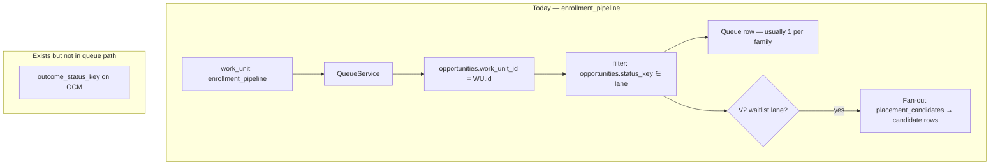

# Child Lifecycle + Work Unit Convergence — Closeout

**Path:** `docs/sprints/05_2026/completed/child_lifecycle_work_unit_convergence_closeout.md`  
**Status:** **CLOSED** (May 2026) — Cards 0–14C complete; strict-mode activation and Settings CRUD **deferred** to follow-on sprints.  
**Canonical supplements:** `docs/system/workspace-system.md`, `docs/product/crm-system.md`, `docs/core/glossary.md`, `docs/execution/roadmap-and-gaps.md`.

---

## Sprint completion summary (May 2026)

| Theme | Outcome |
|-------|---------|
| **Lifecycle convergence** | **Opportunity = household coordination case** (`status_key` trends to broad case states). **`opportunity_customer_members.outcome_status_key` = child enrollment lifecycle SoT** — siblings may differ on one case. |
| **Grain model** | **Case-primary** domains (new leads, tours, follow-up, forms) vs **child/candidate-primary** domains (waitlist, enrolling, enrolled). Queues declare **`grain`** in `queue_definition`; UI/KPI copy is grain-aware. |
| **`queue_definition` v2** | Single execution WU **`enrollment_pipeline`**; domains as **`ui.sections`**; legacy status-slice WUs converge via aliases — **not** canonical nav. Template: **`enrollmentPipelineQueueDefinitionV2.ts`** + DB migrations. |
| **Work-unit / domain convergence** | Operator header shows **Work Units** + **Needs Attention** pills (not lifecycle stages as separate WUs). `suppress_other_pill`, lifecycle panel, lane descriptions configurable via `ui` flags. |
| **Waitlist (candidate grain)** | `QueueService` v2 candidate rows, placement overrides, manual order, forecast hooks; membership from child lifecycle + `placement_candidates` — **not** opportunity-only truth. |
| **Enrollment (child grain)** | Enrolling / enrolled lanes project **child-primary** rows where configured; placement backfill eligibility tied to OCM lifecycle. |
| **Lifecycle mutations / events** | Child lifecycle writes via established admin paths; meaningful transitions emit workflow/events — no parallel mutation layer. |
| **Read-only case rollups** | Drawer/summary **child lifecycle rollup** for operators — display-only; does not replace per-child SoT. |
| **Filter / search UX** | Client-side record filters on loaded queue previews + URL sync (`q`, `rf_*`); compact toolbar (capped search, collapsible filters) — **no** membership or server query changes. |
| **Strict-mode readiness** | Audit + tooling for orgs to validate v2 config vs runtime; **`strict_mode` not activated** in this sprint (explicit follow-on). |
| **UI stabilization** | Cards 13–14: dept→WU queue selection, pill distribution, filter bar polish, suppress **Other** / lane description copy. |

### Future follow-on sprints (not in scope)

| Follow-on | Notes |
|-----------|--------|
| **Settings Config Management** | Rename/reorder/hide work-unit domains and Needs Attention buckets via admin UI — extend `work_units.queue_definition` + `metadata.opportunity_attention_rules` (Card 15 spec in § below). |
| **Waitlist Orchestration continuation** | Phase 2 pilot → production hardening, capacity/forecast engines — see [waitlist_orchestration_phase2_architecture.md](../waitlist_orchestration_phase2_architecture.md). |
| **Strict-mode activation** | Flip org/runtime gates after backfill + QA sign-off. |
| **Candidate / OCM cleanup** | Vocabulary aliases, backfill hardening, deprecate opportunity-only enrollment assumptions in seeds. |
| **Server-side queue filtering / search** | Move record filters from client preview page to API when scale requires. |
| **Waitlist forecasting / capacity** | Beyond Card 6 hint hooks — full capacity engine deferred. |

---

## Historical audit body (Cards 0–14)

**Status (implementation):** **Card 0 COMPLETE** · **Card 1 COMPLETE** · **Card 2 COMPLETE** · **Card 3 COMPLETE** · **Card 4 COMPLETE** · **Card 5 COMPLETE** (Supabase v2 config migration) · **Card 6 COMPLETE** (waitlist candidate-grain queue runtime) · **Card 7 COMPLETE** (grain-aware UI/KPI labels) · **Card 8 COMPLETE** (enrollment/offers child-grain runtime) · **Card 9 COMPLETE** (placement backfill eligibility + row context) · **Card 10 COMPLETE** (child lifecycle mutation paths) · **Card 11 COMPLETE** (read-only case rollup / child lifecycle summary) · **Card 12 COMPLETE** (strict-mode readiness audit) · **Card 13 COMPLETE** (UI / runtime QA checkpoint) · **Card 13C COMPLETE** (work unit navigation + config UI regression fix) · **Card 14A–14C COMPLETE** (enrollment WU config + filters + header polish)  
**Date:** 2026-05-27 (audit) · closeout May 2026 · Card 5 migrations 2026-06-01  
**Context:** Waitlist Orchestration Phase 2 is **pilot-ready** (`shadow_mode`, candidate-row waitlist, manual overrides, forecast hooks, V1 fallback). This sprint delivered **child-level enrollment lifecycle truth** and **work units as execution domains** — without moving **family/case coordination workflows** to child scope.

**Related:**

| Topic | Document / code |
|-------|-----------------|
| Waitlist Phase 2 | [waitlist_orchestration_phase2_architecture.md](../waitlist_orchestration_phase2_architecture.md), [pilot playbook](../waitlist_orchestration_phase2_pilot_playbook.md) |
| Work unit consolidation (May 2026) | [work_unit_runtime_consolidation_audit.md](../work_unit_runtime_consolidation_audit.md) |
| Enrollment pipeline canonical | [canonical_enrollment_operating_model_seed.md](../canonical_enrollment_operating_model_seed.md), `web/lib/config/enrollmentPipelineQueueDefinitionV2.ts` |
| CRM / workspace | `docs/product/crm-system.md`, `docs/system/workspace-system.md` |
| Intake case doctrine | [forms_intake_case_operational_model.md](../forms_intake_case_operational_model.md) |
| Placement facts | `web/lib/orchestration/placement/adapters/opportunityPlacementFacts.ts`, `placementCandidateFacts.ts` |
| Inquiry children | `supabase/migrations/20260430143000_opportunity_customer_members_outcome_status_key.sql`, `OpportunityInquiryChildrenSection.tsx` |

---

## Executive summary

| Question | Answer |
|----------|--------|
| **Does child inquiry status already exist?** | **Yes — partially.** Stored as **`opportunity_customer_members.outcome_status_key`**, labels from **`status_definitions`** where **`entity_type = 'opportunity_customer_members'`**. Operator UX calls it **inquiry child outcome** / **Inquiry status**; Settings label: **Opportunity Sub Statuses**. |
| **Is it usable as operational lifecycle SoT today?** | **No — not yet.** It is **editable in the drawer**, **indexed**, and **configurable**, but **not** wired to queues, workflows, placement backfill, tour transitions, or priority fact adapters. Vocabulary is **disposition-oriented** (interested, waitlisted, enrolled, …), not the full enrollment pipeline the product doctrine describes. |
| **What is authoritative for queues today?** | **`opportunities.status_key`** inside a single execution work unit (**`enrollment_pipeline`**) with **`queue_definition.queues[]`** status filters. Waitlist ordering uses **`placement_candidates`** (child × cohort) but **membership** still keys off **family-level** `status_key ∈ { waitlisted, ready_to_enroll }`. |
| **Recommended direction** | **Opportunity = household coordination case** (not every child’s lifecycle). **`outcome_status_key` = child enrollment lifecycle SoT**. **Work units = execution domains** — some **case-oriented**, some **child/candidate-oriented**. **Statuses = filters** inside domains. See **§ Card 0** (locked). |

---

## Card 0 — Doctrine + decision lock (COMPLETE)

**Card scope:** Architecture lock only — **no schema, code, or migrations.**

### 0.1 Core insight — not everything becomes child-level

Waitlist Phase 2 exposed a boundary: **child enrollment lifecycle** and **household coordination** are different concerns.

| Concern | Grain | Examples |
|---------|-------|----------|
| **Household / case coordination** | **Opportunity (family case)** | Tours, communications, forms/documents, parent conversations, reminders/follow-up, household coordination, BOS / Task Assist context |
| **Enrollment / placement operations** | **Child inquiry / placement candidate** | Waitlist, offers, enrollment lifecycle, classroom/program placement, sibling priority, enrollment state, placement forecasting |

**Anti-pattern (explicitly rejected):** Moving tours, comms, packets, and BOS to child-primary models “because waitlist is child-level.” That overcorrects and breaks how operators run real centers.

**Platform framing (unchanged):** case/container entity · participant/sub-entity lifecycle · operational work units · statuses as filter semantics · queue definitions as configured views.

### 0.2 Reference example — Hayes family

| Event | Grain | Locked behavior |
|-------|-------|-----------------|
| One family tour scheduled Saturday | **Opportunity** | Single `tour_bookings` row + case-oriented tour queue |
| Parent packet / forms | **Opportunity** | Packet session, comms thread, document tab |
| Liam enrolled | **Child (OCM)** | `outcome_status_key = enrolled`; may exit waitlist candidate set |
| Mia waitlisted | **Child (OCM + candidate)** | `outcome_status_key = waitlisted`; `placement_candidate` for ordering |
| Sophia new inquiry | **Child (OCM)** | `outcome_status_key = new_inquiry` while case remains **open** |

Opportunity status must **not** imply all three children share Mia’s waitlist state or Liam’s enrolled state.

### 0.3 Locked doctrine (8 points)

1. **Opportunity = household/family coordination case.** Container for parent/family coordination (comms, tours, packets, BOS). **Not** the primary lifecycle source for every child. **`opportunities.status_key` trends toward broad case states:** `open`, `closed`, `inactive`, `archived` (plus interim pipeline keys until migration — see Card 1). A optional **display rollup** may summarize children; it is not operational truth for child domains.

2. **`opportunity_customer_members.outcome_status_key` is the V1 child operational lifecycle field.** **Keep the column name** for V1. **Do not** create a parallel child lifecycle table or new lifecycle column unless a future migration explicitly requires it.

3. **Child lifecycle is SoT for child enrollment state.** Siblings on the same opportunity **may differ** (enrolled + waitlisted + touring + withdrawn concurrently).

4. **Not all workflows become child-scoped.** **Remain case-oriented:** tours, communications, forms/documents, reminders, parent coordination, BOS context — unless a **child-specific** reason exists (e.g. packet item for one child). **Become child/candidate-oriented:** waitlist, offers, enrollment lifecycle, placement, sibling priority, forecasting.

5. **`placement_candidates` = waitlist orchestration state only.** **Not** the global lifecycle model. Eligibility **derives from** child lifecycle (`outcome_status_key` ∈ waitlist-eligible set). Orchestration substates (`active` / `paused` / `withdrawn` / `placed`) stay separate from marketing lifecycle labels.

6. **Work units = operational execution domains** — not individual statuses. Domains may be **case-oriented** or **child/candidate-oriented**. Statuses are **queue/filter semantics** inside domains. **No new legacy multi-WU status cohorts.**

7. **Queue definitions = configured views** over lifecycle, status, date, and attention filters — not hardcoded business truth. Prefer config + registry over React/status literals in core engines.

8. **Needs Attention = overlay**, not a lifecycle status. Resolver membership may reference case or child gaps; it does not replace pipeline or child lifecycle.

### 0.4 V1 work-unit / domain model (locked)

**Structure:** One **execution work unit** per enrollment department (retain `enrollment_pipeline` key for V1 compatibility). Regroup **`queue_definition.ui.sections`** into domains. Domains declare **queue row grain** (case vs child).

#### Case-oriented domains

| Domain | Operator job | Queue row grain | Primary filters (V1) |
|--------|--------------|-----------------|----------------------|
| **New Leads** | First touch, qualify, schedule tour | **Opportunity-primary** | Case open + intake signals; child `new_inquiry` chips on row |
| **Tours** | Run tours, no-shows, post-tour follow-up | **Opportunity-primary** | `tour_bookings` + opportunity tour-stage filters |
| **Communications / Follow-up** | Threads, scheduled sends, callbacks | **Opportunity-primary** | Attention + comms metadata (may land as queue section or integrated filters — **Card 2**) |
| **Forms / Documents** | Packets, intake review | **Opportunity-primary** | Packet session / submission state |
| **BOS / Task Assist context** | Assist routing, drafts | **Opportunity-primary shell** | Child facts attached in payload where relevant (**§0.7 D12**) |

#### Child/candidate-oriented domains

| Domain | Operator job | Queue row grain | Primary filters (V1) |
|--------|--------------|-----------------|----------------------|
| **Waitlist** | Rank, offer seats, manual order | **Child-primary** (existing V2 candidate rows) | OCM `waitlisted` (+ `offer_pending` if waitlist-adjacent) → `placement_candidates` |
| **Enrollment / Offers** | Paperwork, accept/start | **Child-primary** (target) | OCM `offer_pending`, `enrolling`, `enrolled` |
| **Placement / Classroom readiness** | Readiness, cohort prep | **Child-primary** | Candidate + lifecycle substates (**future section** — may merge with Waitlist initially) |

#### Overlay

| Domain | Mechanism |
|--------|-----------|
| **Needs Attention** | Existing `needs_attention` queue + resolver + buckets; **case row** with child context |

### 0.5 Child lifecycle vocabulary (V1 target)

**Registry:** `status_definitions` where `entity_type = 'opportunity_customer_members'`.

#### Mapping: existing → V1 target

| Existing key | V1 disposition | Action |
|--------------|----------------|--------|
| `interested` | **`new_inquiry`** | **Alias then deprecate:** retain `interested` as inactive alias label in migration; new writes use `new_inquiry` |
| `waitlisted` | `waitlisted` | **Retain** |
| `enrolling` | `enrolling` | **Retain** |
| `enrolled` | `enrolled` | **Retain** |
| `not_enrolling` | `not_enrolling` | **Retain** (terminal — family chose not to enroll this child) |
| `deferred` | `deferred` | **Retain** |

#### New keys (require `status_definitions` seed — Card 1 migration)

| Target key | Label (default) | Notes |
|------------|-----------------|-------|
| `new_inquiry` | New inquiry | Canonical intake; replaces `interested` for new data |
| `tour_requested` | Tour requested | Child/family expressed tour interest; **case** still owns booking |
| `tour_scheduled` | Tour scheduled | Optional **child mirror** when ops track per-child attendance intent; **tour_bookings** remains schedule SoT |
| `tour_completed` | Tour completed | Post-tour child disposition; case may still be in tour follow-up |
| `offer_pending` | Offer pending | Replaces opportunity-level **`ready_to_enroll`** semantics at child grain |
| `withdrawn` | Withdrawn | Active exit from pipeline (distinct from `not_enrolling` / lost case) |

**Not duplicated on OCM for V1:** opportunity-only case keys (`contact_attempted`, `tour_no_show`, `follow_up_attempted`, `lost`) stay on **case** filters until a child-specific need is proven.

**Tour scheduling grain (locked):** **Opportunity-level by default** (`tour_bookings` + case status). Per-child tour association is **optional later** (metadata or junction) — not required for Card 1–4.

### 0.6 Decision log

Each item: **decision · rationale · implementation impact**

| ID | Decision | Rationale | Implementation impact |
|----|----------|-----------|------------------------|
| **D1** | **Keep `outcome_status_key`** | Column deployed, indexed, drawer + Settings wired; rename adds migration/contract churn without V1 benefit | Docs/UI use “inquiry child status”; no DDL rename in V1 |
| **D2** | **Split vocabulary** — case vs child registries | Case trends to `open`/`closed`/…; child carries enrollment pipeline. Shared *names* (`tour_scheduled`, `waitlisted`) allowed when semantics align but **different `entity_type`** | Card 1: two status_definition catalogs; queue filters declare which entity they target. Stop using opportunity pipeline keys as proxy for child state |
| **D3** | **Case rollup: manual first, computed later** | Operators need predictable behavior during migration; auto-rollup before child wiring would lie | V1: operators set case status explicitly where needed. Card 2 spec: optional computed rollup (display-only → authoritative phased). No auto-rollup in Card 4 |
| **D4** | **Deprecate `ready_to_enroll` on opportunity** | Child-level **`offer_pending`** is the operational truth for “seat offered / paperwork next” | Card 1: map existing rows; placement presets/KPIs referencing `ready_to_enroll` updated. Backfill gate moves to child `waitlisted` \| `offer_pending` |
| **D5** | **Split queue row grain by domain** | Matches operator mental model and Hayes example | **Child-primary:** Waitlist, Enrollment/Offers. **Opportunity-primary:** New Leads, Tours, Comms, Forms, BOS. QueueService projection mode per lane (extend config in Card 2) |
| **D6** | **Placement backfill must filter by child waitlist status before `shadow_mode: false`** | Prevents false candidates for enrolled/touring siblings | Card 4: backfill + runtime candidate create require OCM ∈ `{ waitlisted, offer_pending }` (configurable set). Pilot playbook gate updated in Card 7 |
| **D7** | **Tours remain opportunity-level by default** | One tour event is a family visit; booking SoT already on `tour_bookings` | No child tour table in V1. Optional child mirror statuses on OCM only. Tour queues stay case-primary |
| **D8** | **BOS: opportunity-level context shell; child facts where relevant** | Assist routes on case; enrollment answers may cite child lines | Task Assist / drawer handoff keep `opportunity_id` anchor; enrich with OCM/candidate summaries in Card 5–6. No child-primary BOS routing in V1 |
| **D9** | **Single execution WU per enrollment dept** | [Work unit consolidation audit](../work_unit_runtime_consolidation_audit.md) — avoid `work_unit_id` reassignment on status change | Domain = `queue_definition` sections, not new WU rows |
| **D10** | **`customer_members.status_key` stays separate** | Household member ≠ inquiry lifecycle | No merge with OCM in V1 |
| **D11** | **No parallel child lifecycle table** | OCM join already links opportunity ↔ child | Card 1 inventories writers only; schema additions deferred |
| **D12** | **Needs Attention unchanged as overlay** | Resolver doctrine already shipped | Case-row presentation; child gaps as reason codes / chips |

### 0.7 Still unresolved (explicit backlog)

| Topic | Why deferred | Owner card |
|-------|--------------|------------|
| **Computed case rollup algorithm** | Manual-first migration period | Card 2 design, Card 4+ optional implement |
| **Exact phasing: opportunity pipeline keys → case `open`/`closed`** | Tenant migration inventory needed | Card 1 + Card 3 |
| **Communications / Forms as separate UI sections vs filters inside New Leads/Tours** | UX design | Card 2 |
| **`enrollment_pipeline` WU rename** (`enrollment_operations`) | Cosmetic; URL/bookmark risk | Card 3 optional |
| **`offer_pending` vs future `accepted` split** | Offer acceptance workflow not fully built | Card 4 when offer mutator exists |
| **Per-child tour attendance junction** | Optional enhancement post-V1 | Tour Phase 2+ |
| **Placement / Classroom readiness as distinct section vs under Waitlist** | Operator validation | Card 2 |
| **Cross-vertical non-childcare case/participant pattern** | Document pattern only in V1 | Card 7 docs |

### 0.8 Card 1 handoff — completed (see §Card 1)

Card 1 deliverables are in **§Card 1** above. Summary:

1. ✅ Writer/reader inventory (§1.2–§1.3)
2. ✅ Canonical child lifecycle mapping (§1.4)
3. ✅ `ready_to_enroll` deprecation map (§1.6)
4. ✅ Conflict report (§1.8)
5. ✅ Dual-truth doctrine (§1.9)
6. ✅ No runtime wiring

**Next:** Card 6 — §Card 5 §5.8 handoff (grain-aware QueueService queries).

---

## Card 1 — Child status writer/reader inventory + canonical mapping (COMPLETE)

**Card scope:** Audit and mapping only — **no schema, code, queue behavior, or runtime wiring changes.**

**Method:** Repo-wide search for `outcome_status_key`, `opportunities.status_key`, `ready_to_enroll`, `placement_candidates`, queue definitions, and enrollment bootstrap configs. Files under `web/`, `supabase/migrations/`, and active sprint docs cross-checked.

**Headline risk (confirmed):** **`opportunities.status_key` is still operational lifecycle truth** for queues, attention, KPIs, intake routing, tour sync, placement backfill gates, and most admin actions. **`outcome_status_key` has one production write path** (drawer PATCH) and **zero queue/workflow/placement consumers.**

---

### 1.1 Existing child/member status model

| Aspect | Detail |
|--------|--------|
| **Column** | `opportunity_customer_members.outcome_status_key` (`text`, nullable) |
| **Registry** | `status_definitions` where `entity_type = 'opportunity_customer_members'` |
| **Settings entity** | `inquiry_child` field registry (`inquiryChildFieldRegistry.ts`); Statuses UI label **Opportunity Sub Statuses** (`StatusesClient.tsx`) |
| **Seeded keys** (migration `20260430143000`) | `interested`, `waitlisted`, `enrolling`, `enrolled`, `not_enrolling`, `deferred` |
| **Index** | `idx_opportunity_customer_members_org_outcome_status (org_id, outcome_status_key)` |

**UI / API usage today:**

| Surface | Behavior |
|---------|----------|
| Drawer | `OpportunityInquiryChildrenSection` — per-row `<select>`, debounced PATCH |
| Entity GET | `opportunityEntityRecord.ts` hydrates `outcome_status_key` + label from status_definitions |
| Queue compact | `inquiryChildrenHydration.ts` — passes through for child lines; **not** lifecycle filter |
| Attention styling | Heuristic `isWaitlistedInquiryOutcome()` on drawer row only |
| Forms outcome panel | **Opportunity** status labels only (`outcomeConfigLabelCatalog.ts`) — not OCM |

**Limitations:**

- No server validation against allowed keys on PATCH (any string or null accepted).
- No workflow events on OCM status change.
- Intake creates OCM rows **without** `outcome_status_key`.
- No transition rules for `entity_type = opportunity_customer_members` in runtime paths audited.
- **`customer_members.status_key`** is a separate household-member field (drawer on member entity) — not inquiry lifecycle.

---

### 1.2 Status writer inventory

#### Opportunity `status_key` writers

| Writer | File / location | Writes | Grain | Current behavior | Future behavior (Card 0) |
|--------|-----------------|--------|-------|------------------|---------------------------|
| Canonical status helper | `web/lib/opportunities/updateOpportunityStatusWithEvent.ts` | `opportunities.status_key` | Case | Update + `opportunity_status_changed` event | Case status only; stop encoding per-child lifecycle |
| Admin opportunity PATCH | `web/app/api/admin/opportunities/[id]/route.ts` | `status_key` | Case | Drawer/scalar save; transition validation; event emit | Case `open`/`closed`/… + legacy compat period |
| Admin drawer save | `web/components/admin/AdminEntityDrawer.tsx` | `status_key` | Case | PATCH opportunity including status field | Same — case-oriented |
| Drawer field save allowlist | `web/lib/admin/drawer/opportunityDrawerFieldSave.ts` | `status_key` | Case | Explicit scalar save path | Unchanged for case fields |
| Update Status action | `web/lib/admin/actions/executeAdminAction.ts` (`update_status`, `open_form` submit) | `status_key` | Case | Validates transition; emits event | Case transitions; child transitions separate (Card 4) |
| Update Status modal | `web/components/admin/opportunity/actions/UpdateStatusAddNoteModal.tsx` | `status_key` | Case | Invokes admin action | Case-only actions by default |
| Tour booking sync | `web/lib/tours/opportunity/tourBookingOpportunityIntegration.ts` | `status_key` + metadata mirror | Case | Sets `tour_scheduled` / `tour_completed` / `tour_no_show` on confirm/complete/no-show | **Stays case-oriented** (Card 0 D7) |
| Tour booking service | `web/lib/tours/bookings/tourBookingService.ts` | (indirect) | Case | Calls opportunity integration on lifecycle | Unchanged |
| Form intake (safe) | `web/lib/forms/intake/applyFormIntakeSafe.ts` | `status_key` on insert/update | Case | From link `default_opportunity_status_key` or hint | Sets case `open` + optional legacy key during transition |
| Form lead capture | `web/lib/forms/intake/applyFormLeadCaptureIntake.ts` | `status_key` on insert | Case | From intake hint / defaults | Same |
| Book-v2 confirm | `web/app/api/book-v2/confirm/route.ts` | `status_key` | Case | `updateOpportunityStatusWithEvent` (non-enrollment keys e.g. booked) | Vertical-specific; enrollment uses case keys today |
| Book-v2 quote start | `web/app/api/book-v2/quote-start/route.ts`, `specialty-quote-start/route.ts` | `status_key` | Case | `needs_a_quote` on reuse/create | Growth path — not enrollment child lifecycle |
| Workflows (generic) | `web/lib/workflowRun.ts` (`update_entity` step) | `status_key` in patch | Case | Template-driven opportunity patches | **Needs verification** per workflow template — audit templates in Card 4 |
| Demo / seed scripts | `seedRealisticChildcareDemoData.ts`, `seedEnrollmentPipelineDemoData.ts`, `seedChildcareDemo.ts`, `seedPlacementPriorityDemoPatch.ts`, `seedOneChildcareInquiryScenario.mjs`, `ensureChildcareOpportunityStatusesForDemoOrg.ts` | `status_key` | Case | Seeds pipeline keys incl. `ready_to_enroll`, `waitlisted` | Migrate seeds to case + OCM split (Card 3) |
| Vertical bootstrap | `childcareBootstrapV1.ts` (status_definitions only) | definitions, not rows | Config | Seeds opportunity status keys incl. `ready_to_enroll`, `contacted` | Align definitions with §1.4 mapping |
| Placement demo patch | `seedPlacementPriorityDemoPatch.ts` | `waitlisted` on opp | Case | Demo waitlist rows | Case `open` + child `waitlisted` |

#### OCM `outcome_status_key` writers

| Writer | File / location | Writes | Grain | Current behavior | Future behavior |
|--------|-----------------|--------|-------|------------------|-----------------|
| OCM PATCH API | `web/app/api/admin/opportunity-customer-members/[id]/route.ts` | `outcome_status_key` | Child | Only native server write path; no transition rules | Add validation + events (Card 4) |
| Drawer UI | `OpportunityInquiryChildrenSection.tsx` | via PATCH API | Child | Operator manual select | Primary lifecycle editor |
| OCM POST (link child) | `web/app/api/admin/opportunity-customer-members/route.ts` | — | Child | Insert join row; **does not set** outcome | Default `new_inquiry` on link (Card 4) |
| Form intake | `applyFormIntakeSafe.ts`, `applyFormLeadCaptureIntake.ts` | — | Child | Creates OCM without outcome | Optional default `new_inquiry` (Card 4) |
| Demo seed | `seedOneChildcareInquiryScenario.mjs` | `interested`, `waitlisted` | Child | Script-only | Use V1 keys per §1.4 |
| Migration seed | `20260430143000_*.sql` | status_definitions | Config | Seeds six OCM keys | Extend in Card 3 migration |

**No writers found for:** QueueService, placement backfill, workflows (OCM), tour integration, intake auto-status, BOS, attention resolver.

#### Placement candidate creators (orchestration, not lifecycle)

| Writer | File / location | Creates | Eligibility gate today | Future gate (Card 0 D6) |
|--------|-----------------|--------|------------------------|-------------------------|
| Backfill script | `placementCandidateBackfill.ts` → `runPlacementCandidateBackfill` | `placement_candidates` rows | Opp `status_key ∈ { waitlisted, ready_to_enroll }`; **all OCM** on opp | OCM `outcome_status_key ∈ { waitlisted, offer_pending }` |
| CLI | `web/scripts/backfillPlacementCandidatesV1.ts` | via backfill | Same | Same |
| QA gate | `qaWaitlistPlacementV2Gate.ts` | via backfill | Same | Same |
| Override / manual APIs | `manual-position`, `overrides` routes | overrides only | Existing candidate | No create |

**Candidate `status` column** (`active`/`paused`/`withdrawn`/`placed`) is set to `active` on backfill insert — **not** written from OCM lifecycle.

---

### 1.3 Status reader inventory

#### Opportunity `status_key` readers (lifecycle-assuming)

| Reader | File / location | Reads | Grain | Used for | Risk |
|--------|-----------------|-------|-------|----------|------|
| **QueueService** | `web/lib/queues/QueueService.ts` | `status_key` | Case | Lane filters `.in(status_key, …)`; needs_attention SQL branches; tour_date filters | **P0** — entire pipeline membership |
| Queue definition | `enrollmentPipelineQueueDefinitionV1.ts` | filter values | Case | Canonical lane status lists | **P0** — hardcoded status slices |
| Placement V1/V2 apply | `applyPlacementToOpportunityQueueRows.ts`, `applyPlacementV2ToOpportunityQueueRows.ts` | opp row + lane allowlist | Case | Which rows get placement enrichment | **P0** — waitlist lane gated on opp status |
| Placement backfill | `placementCandidateBackfill.ts` | opp `status_key` | Case | Candidate creation eligibility | **P0** — ignores child status |
| `WAITLIST_RELEVANT_*` | `placementCandidateTypes.ts` | constant keys | Case | Backfill + tests | Includes deprecated `ready_to_enroll` |
| Attention resolver | `opportunityAttentionResolver.ts` | `status_key` | Case | Reason codes, stale rules, lane exclusions | **P1** — case-only; misses mixed sibling states |
| QueueService (dup sets) | Same file stale/exclusion sets | `status_key` | Case | High-value stale, 7d stale, exclusions | Parity with resolver |
| Attention rules | `opportunityAttentionRules.ts` | `status_key` | Case | `stale_new_inquiry`, etc. | Case-only |
| Execution eligibility | `opportunityExecutionEligibility.ts` | `status_key` | Case | Terminal/active gating | Case terminal keys |
| Activity signals | `activitySignals.ts` | `status_key` | Case | Signal rule matching | Config rules reference opp status |
| Lifecycle KPIs | `computeOpportunityLifecycleKpis.ts` | `status_key` | Case | Dept KPI $ by stage | Counts families not children |
| Dept view model | `enrollmentDepartmentViewModel.ts` | summary by status | Case | Dept tiles (tours, waitlist counts) | **P1** — opp status histogram |
| KPI block | `KpiBlock.tsx` (`ready_waitlist`) | `ready_to_enroll`, `waitlisted` | Case | UI KPI | **P1** — deprecated key |
| WU view model | `enrollmentWorkUnitViewModel.ts` | queue summaries | Case | Quick actions keyed on status | **P2** |
| BOS recommendations | `buildOperationalRecommendationV1.ts`, adapters | `status_key` | Case | Grounding / stale fingerprints | Case shell (correct per Card 0) |
| Task Assist | `taskAssistOpportunityContext.ts`, search | `status_key` | Case | Context + disambiguation | Case shell |
| Compose templates | `opportunityComposeTemplates.ts` | `status_key` | Case | Template selection incl. `ready_to_enroll` | Case-appropriate |
| Lifecycle presentation | `opportunityLifecyclePresentation.ts`, `OpportunityLifecyclePanel.tsx` | `status_key` | Case | Drawer header / panel | Shows single family status |
| Status transition rules | `statusTransitionRules.ts` | from/to on opportunities | Case | PATCH/action guards | No OCM rules |
| Action resolution | `resolveActionsForContext.ts` | `status_key` | Case | Which actions visible | Case predicates |
| Growth queue (legacy) | `growthOpportunityQueueScope.ts`, `resolveOpportunityQueue.ts` | `status_key` | Case | Non–AdminV2 growth interpreter | Parallel engine — drift risk |
| Intake display | `outcomeConfigPresentation.ts` | opportunity status labels | Case | Form authoring “Inquiry status” label | Misleading name — opp only |
| Admin lists | `OpportunitiesClient.tsx`, dashboard | `status_key` | Case | Legacy admin tables | Case display |
| Related records API | `related/[entity]/[id]/route.ts` | `status_key` | Case | Preview cards | Low |
| Drawer bootstrap hints | `drawer-operational-bootstrap/route.ts` | hint from queue row | Case | Attention bootstrap | Propagates queue preview |
| Tests / seeds | Broad test suite | `status_key` | Case | Fixtures assume pipeline keys | Update with mapping |

#### OCM `outcome_status_key` readers

| Reader | File / location | Reads | Grain | Used for | Risk |
|--------|-----------------|-------|-------|----------|------|
| Entity GET / hydrate | `opportunityEntityRecord.ts` | `outcome_status_key` | Child | Drawer + API payload | Read-only display |
| Drawer rows | `inquiryChildrenDrawerRows.ts`, `inquiryChildrenHydration.ts` | outcome + label | Child | CRM compact child lines | **Not used for queue membership** |
| Drawer UI | `OpportunityInquiryChildrenSection.tsx` | outcome | Child | Edit + waitlist row styling | No downstream effects |
| OCM GET APIs | `opportunity-customer-members/*` routes | outcome | Child | PATCH response | — |
| Status definitions API | `GET /api/admin/status-definitions?entity_type=opportunity_customer_members` | registry | Config | Drawer select options | — |
| Verification script | `verifyChildcareInquiryLayoutAndChildren.mjs` | outcome | Child | Layout QA | Dev only |
| Demo seed readback | `seedOneChildcareInquiryScenario.mjs` | outcome | Child | Scenario validation | Dev only |
| Placement bulk load | `bulkLoadPlacementCandidatesByOpportunity.ts` | OCM join | Child | Display name / program on candidate | **Does not read outcome for eligibility** |
| QueueService OCM fetch | `QueueService.ts` (~L1050) | OCM rows | Child | `_child_desired_start_summary` enrichment | Program/start only, not lifecycle |

**No readers found for:** attention resolver, KPIs, workflows, placement facts (`buildPlacementCandidateFacts` uses opportunity metadata only).

#### Placement candidate readers

| Reader | File / location | Reads | Used for | Eligibility source |
|--------|-----------------|-------|----------|-------------------|
| Backfill | `placementCandidateBackfill.ts` | opp status, all OCM | Create rows | **Opportunity status only** |
| Bulk load (queues) | `bulkLoadPlacementCandidatesByOpportunity.ts` | candidates by opp id | V2 projection | Rows already exist |
| Load (drawer/API) | `loadOpportunityPlacementCandidates.ts` | candidates | GET placement-candidates | — |
| Apply V2 | `applyPlacementV2ToOpportunityQueueRows.ts` | candidates + opp | Sort / fan-out | Queue already filtered by opp status |
| Manual order API | `manual-position/route.ts`, override routes | candidate row | Mutations | — |
| QA scripts | `qaWaitlistPlacementV2Gate.ts`, `debugWaitlistHayesRenderTrace.ts` | candidates | Pilot validation | — |

**Candidate vs child lifecycle:** `placement_candidates.status` (`active`|`placed`|…) is **orchestration only** — never synced from `outcome_status_key`.

---

### 1.4 Canonical child lifecycle mapping

Target registry: `status_definitions` · `entity_type = 'opportunity_customer_members'`.

| Target child lifecycle key | Existing key? | Source today | Needed action | Notes |
|----------------------------|---------------|--------------|---------------|-------|
| `new_inquiry` | Partial (`interested`) | Migration seed `interested`; drawer/manual | **Add** `new_inquiry`; **deactivate** `interested`; data migration maps `interested` → `new_inquiry` | Card 3 seed |
| `tour_requested` | No | — | **Add** via status_definitions | Case owns tour booking; optional child mirror |
| `tour_scheduled` | No (OCM) | Opportunity + `tour_bookings` only | **Add** optional OCM key | Not required for tour queue membership |
| `tour_completed` | No (OCM) | Opportunity on tour complete | **Add** optional OCM key | Post-tour child disposition |
| `waitlisted` | **Yes** | Seeded + drawer | **Retain** | Waitlist-eligible |
| `offer_pending` | No | Opp `ready_to_enroll` | **Add**; absorb `ready_to_enroll` semantics at child grain | Card 0 D4 |
| `enrolling` | **Yes** | Seeded | **Retain** | Packet/paperwork phase |
| `enrolled` | **Yes** | Seeded | **Retain** | Terminal success per child |
| `not_enrolling` | **Yes** | Seeded | **Retain** | Terminal decline per child |
| `withdrawn` | No | — | **Add** | Active exit (distinct from `not_enrolling`) |
| `deferred` | **Yes** | Seeded | **Retain** | Paused intent |

**Rules:** New keys via **`status_definitions` only** — no TS enums in platform layers. Presets/queues reference keys by string.

---

### 1.5 Case status mapping

**Direction (Card 0):** `opportunities.status_key` becomes **broad case/container state** — not per-child enrollment truth.

| Target case status | Meaning | Source today (representative keys) | Migration note |
|------------------|---------|----------------------------------|----------------|
| `open` | Active household inquiry; coordination ongoing | `new_inquiry`, `contact_attempted`, `contacted`, `tour_scheduled`, `tour_completed`, `follow_up_attempted`, `waitlisted`, `ready_to_enroll`, `enrolling` | **Transitional:** keep legacy keys readable; new writes trend to `open` + child lifecycle (Card 3–4). Do **not** copy child statuses onto opportunity. |
| `closed` | Case resolved — lost or fully terminal | `lost` | Map `lost` → `closed` when phasing pipeline keys |
| `inactive` | Paused / dormant case | — (no first-class key) | **Add** when rollup/manual rules defined |
| `archived` | Historical record; hidden from default queues | — | **Add** for long-term retention |

**Interim (legacy pipeline keys on opportunity):** Remain in **`status_definitions` / queue filters** until Card 3 migrates queue_definition to domain + grain model. **`CANONICAL_ENROLLMENT_PIPELINE_STATUS_KEYS`** lists ten pipeline keys — **none** are case-only `open`/`closed`.

**Explicit non-goal:** Do not encode “Child A waitlisted, Child B enrolled” in `opportunities.status_key`.

---

### 1.6 `ready_to_enroll` inventory

| Category | Location | Usage |
|----------|----------|-------|
| **Status definition seed** | `childcareBootstrapV1.ts`, `ensureChildcareOpportunityStatusesForDemoOrg.ts` | Opportunity status_definitions |
| **Legacy WU filter** | `childcareBootstrapV1.ts` (`priced_followup` WU), `seedEnrollmentOpportunityQueuesV1.ts` (`ready_waitlist` queue) | Flat `status_keys` filter |
| **Canonical pipeline** | **Not** in `enrollmentPipelineQueueDefinitionV1.ts` or `20260430232500` migration canonical list | Drift — exists in bootstrap/KPI only |
| **Placement** | `placementCandidateTypes.ts` `WAITLIST_RELEVANT_OPPORTUNITY_STATUS_KEYS`; `childcareEnrollmentPlacementProfile.ts` `queue_keys`; `PlacementPrioritySettingsClient.tsx` optional lane | Backfill + evaluator cohort |
| **QueueService / attention** | `OPPORTUNITY_HIGH_VALUE_STALE_STATUS_KEY_SET` (QueueService + `opportunityAttentionResolver.ts`) | Stale / attention SQL |
| **KPI UI** | `KpiBlock.tsx` `ready_waitlist` | Groups with `waitlisted` |
| **Comms templates** | `opportunityComposeTemplates.ts` | Template branch |
| **Demo seeds** | `seedChildcareDemo.ts`, `seedEnrollmentPipelineDemoData.ts`, `debugEnrollmentWorkspaceLoad.ts` | Fixture data |
| **Tests** | `QueueService.test.ts`, `growthOpportunityQueueScope.test.ts`, placement config tests | Assertions |

**Deprecation path (locked Card 0 D4):**

1. Add child `offer_pending` in `status_definitions` (OCM).
2. Stop seeding `ready_to_enroll` on **opportunities** for new enrollment orgs.
3. Map existing opp `ready_to_enroll` → case `open` (or keep until manual cleanup) + set relevant children to `offer_pending`.
4. Remove from `WAITLIST_RELEVANT_OPPORTUNITY_STATUS_KEYS`; backfill uses OCM waitlist set only.
5. Update KPIs, placement presets, stale sets, bootstrap JSON, and tests.

---

### 1.7 Work units / queue definitions

#### Canonical single-WU enrollment pipeline

| Item | Detail |
|------|--------|
| **Work unit key** | `enrollment_pipeline` |
| **Config source** | `enrollmentPipelineQueueDefinitionV1.ts` + migrations `20260430232500`, `20260430234000` |
| **Shape** | `queues[]` with per-lane `{ type: status, operator: in, values: [...] }` |
| **Entity type** | `opportunity` for all lanes |
| **Sections** | `pipeline` (status-named queues) + `attention` (`needs_attention`) |

#### Legacy multi-WU status cohorts (childcare bootstrap)

| WU key | Status slice | Model |
|--------|--------------|-------|
| `pipeline_overview` | all (no status filter) | Legacy A |
| `early_inquiries` | `new_inquiry`, `contacted` | Legacy A |
| `quoting` | `tour_scheduled`, `tour_completed` | Legacy A |
| `priced_followup` | **`ready_to_enroll`, `waitlisted`** | Legacy A |
| `needs_attention` | standalone exception WU | Legacy A |

Requires `opportunities.work_unit_id` reassignment — **deprecated** per Card 0.

#### Queue grain classification (target)

| Queue / domain | Current grain | Target grain | Status filter entity |
|----------------|---------------|--------------|----------------------|
| `new_inquiry`, `contact_attempted` | Opportunity | **Case-primary** | Opportunity (→ case `open` + signals) |
| `tour_scheduled`, `tour_completed_follow_up` | Opportunity | **Case-primary** | Opportunity + `tour_bookings` |
| `enrolling`, `enrolled`, `lost` | Opportunity | Mixed: enrolling/enrolled → **child-primary**; lost → case `closed` | Split in Card 2 |
| `waitlisted` | Opportunity row → V2 **candidate** fan-out | **Child-primary** | **OCM** (not opp status) |
| `needs_attention` | Opportunity | **Case-primary** overlay | Resolver + case status |
| Comms / forms / BOS | (not separate queues today) | **Case-primary** | Card 2 design |

#### Hardcoded status slices (debt)

- `CANONICAL_ENROLLMENT_PIPELINE_STATUS_KEYS` — ten pipeline stages as queue keys.
- `QUEUE_LANE_EXCLUDED_STATUS_KEYS`, `QUEUE_LANE_MID_FUNNEL_STALE_STATUS_KEYS` — attention/resolver parity sets in code.
- `OPPORTUNITY_HIGH_VALUE_STALE_STATUS_KEY_SET` — includes `ready_to_enroll`.
- `WAITLIST_RELEVANT_OPPORTUNITY_STATUS_KEYS` — backfill gate.
- Bootstrap / seed queue JSON — flat `filters.status_keys`.

---

### 1.8 Conflict report

| Conflict | Example | Impact | Mitigation card |
|----------|---------|--------|-----------------|
| **Mixed sibling states invisible in queues** | Opp `tour_scheduled`, Mia `waitlisted`, Liam `enrolled` | Family stays in Tours lane; Mia not in Waitlist | Card 2 child filters; Card 4 wiring |
| **Whole-case waitlist gate** | Opp `waitlisted` → backfill all OCM children | Enrolled sibling gets placement_candidate | Card 4 backfill filter (D6) |
| **`ready_to_enroll` split brain** | KPI/placement use it; canonical pipeline does not | Count/orchestration drift | §1.6 deprecation |
| **Drawer vs queue truth** | Operator sets OCM `waitlisted`; opp still `tour_scheduled` | Queue lane wrong; drawer looks correct | Card 4 — no auto-sync unless designed |
| **Intake creates silent children** | OCM inserted without outcome | Null lifecycle until manual edit | Card 4 default `new_inquiry` |
| **Priority facts from metadata** | `flag_sibling_enrolled` on opp metadata | Wrong tier if sibling enrolled via OCM | Card 6 DB joins |
| **Synthetic placement fallback** | No OCM → synthetic candidate when opp waitlisted | Family-level waitlist without child | Accept interim; prefer child rows |
| **Status vocabulary drift** | Bootstrap `contacted` vs canonical `contact_attempted` | Filter misses on migrated orgs | Card 3 alignment script |
| **Two queue interpreters** | QueueService vs `resolveOpportunityQueueFromDefinition` | Growth vs AdminV2 divergence | Existing consolidation audit |

---

### 1.9 Transitional dual-truth doctrine

During migration (Cards 2–4):

1. **`opportunities.status_key`** remains **legacy-compatible** for **case-primary** queues (New Leads, Tours, Needs Attention) and tour sync.
2. **`outcome_status_key`** becomes **authoritative for child enrollment state** — waitlist, offers, enrolling, enrolled per child.
3. **Child-primary queues** (Waitlist, Enrollment/Offers) **must not** rely solely on `opportunities.status_key` once wired — filter on OCM (+ placement_candidates for ordering).
4. **Case-primary queues** may continue opportunity filters **plus** child summary chips (e.g. “2 waitlisted children”).
5. **No bidirectional auto-sync** between opp status and OCM status unless an explicit action/workflow is designed and audited.
6. **Rollups** (future case summary labels) are **derived display**, not lifecycle SoT — manual case status first (Card 0 D3).
7. **`placement_candidates`** remain orchestration — created/retired based on **child** waitlist eligibility, not opp-wide gate alone.

---

### 1.10 Card 2 handoff

Card 2 (**Work-unit / domain convergence design**) should use this inventory to decide:

| Decision | Inputs from Card 1 |
|----------|-------------------|
| Which queues stay **opportunity-primary** | §1.7 grain table; tour/booking readers §1.3 |
| Which queues become **child-primary** | Waitlist (done V2 fan-out), Enrollment/Offers; OCM readers empty today |
| How **`queue_definition` expresses grain** | New field vs convention per `queue_key`; projection mode for V2 |
| How filters express **child lifecycle vs case status** | New filter type `inquiry_child_status` joining OCM; case filter type `case_status` |
| Legacy WU convergence | §1.7 bootstrap WUs → single `enrollment_pipeline` sections |
| **`ready_to_enroll` removal from configs** | §1.6 full file list |
| Attention / KPI adjustments | §1.3 reader list — which rules need child-aware reasons |

**Card 2 outputs (expected):** domain section schema, filter DSL spec, URL/`?queue=` compat matrix, case vs child filter examples, no runtime code unless explicitly scoped.

**Status:** ✅ Delivered in **§Card 2** below.

---

## Card 2 — Work-unit / domain convergence + queue grain design (COMPLETE)

**Card scope:** Design and config-shape doctrine only — **no schema migrations, no QueueService changes, no runtime wiring.**

**Builds on:** Card 0 doctrine (§0.3–§0.4), Card 1 inventory (§Card 1).

**Design lock:** One execution work unit (`enrollment_pipeline`) · domains as **`ui.sections`** · queues declare **`grain`** + **grain-aware filters** · Needs Attention remains overlay · legacy status-slice WUs converge into domain queues with **URL aliases**.

---

### 2.1 Current work-unit model inventory

#### Pattern A — Canonical single execution WU

| Item | Detail |
|------|--------|
| **Work unit** | `enrollment_pipeline` (one row per enrollment dept) |
| **Config** | `enrollmentPipelineQueueDefinitionV1.ts` + DB migrations |
| **Shape** | `entity_type: opportunity` · `queues[]` with `{ type: status, operator: in, values }` · `ui.sections[pipeline]` lists status-named queue keys |
| **Assignment** | All in-pipeline opportunities share `opportunities.work_unit_id = enrollment_pipeline.id` |
| **Waitlist V2** | `waitlisted` lane fans out to **candidate rows** at projection time when placement V2 enabled — config still says `entity_type: opportunity` |

#### Pattern B — Legacy multi-WU status cohorts (`CHILDCARE_VERTICAL_BOOTSTRAP_V1`)

| WU key | Name | Filter |
|--------|------|--------|
| `pipeline_overview` | All inquiries | None (all opps on WU) |
| `early_inquiries` | New & contacted | `status_keys: [new_inquiry, contacted]` |
| `quoting` | Tours in progress | `status_keys: [tour_scheduled, tour_completed]` |
| `priced_followup` | Ready / waitlist | `status_keys: [ready_to_enroll, waitlisted]` |
| `needs_attention` | Needs attention | Standalone exception WU + metadata rules |

Requires **`work_unit_id` reassignment** on status change — deprecated.

#### Pattern C — Dev seed variant (`seedEnrollmentOpportunityQueuesV1.ts`)

Flat queues on one WU: `all`, `new_contacted`, `tours_in_progress`, `ready_waitlist`, `needs_attention` — same status-slice semantics as Pattern B with different keys.

#### Current unit/queue → future mapping

| Current unit/queue | Type today | Grain today | Filter today | Future domain | Future grain | Future filter | Action |
|--------------------|------------|-------------|--------------|---------------|--------------|---------------|--------|
| **`enrollment_pipeline`** (WU) | Execution WU | Mixed (config says opp) | `work_unit_id` FK | **Single execution WU** (keep key) | — | — | **Keep**; enrich `queue_definition` only |
| `pipeline_total` | Internal KPI queue | Case | No status filter | `pipeline_total` (internal) | **case** | `case_status` ∈ open/interim OR legacy status superset | **Keep** key; grain metadata |
| `new_inquiry` | Status lane | Case | `opportunities.status_key ∈ {new_inquiry}` | **New Leads** | **case** | `case_status` + legacy `new_inquiry`; child chips summarize `new_inquiry` | **Rehome** under domain section; alias key |
| `contact_attempted` | Status lane | Case | `status_key ∈ {contact_attempted}` | **New Leads** | **case** | Same + map bootstrap `contacted` alias | **Rehome**; alias `contacted` → filter value |
| `new_contacted` (seed) | Grouped status lane | Case | `new_inquiry`, `contacted` | **New Leads** | **case** | Merged into New Leads sub-filters | **Deprecate** key → alias |
| `tour_scheduled` | Status lane | Case | `status_key ∈ {tour_scheduled}` | **Tours** | **case** | `case_status` + **`tour_booking`** active confirmed; optional `metadata.tour_date` | **Rehome** |
| `tour_completed_follow_up` | Grouped status lane | Case | `tour_completed`, `follow_up_attempted`, `tour_no_show` | **Tours** | **case** | Case status + tour booking terminal states | **Rehome** |
| `tours_in_progress` (seed) | Grouped lane | Case | `tour_scheduled`, `tour_completed` | **Tours** | **case** | Split into scheduled vs follow-up sub-queues | **Deprecate** → aliases |
| `enrolling` | Status lane | Case | `status_key ∈ {enrolling}` | **Enrollment / Offers** | **child** | `child_lifecycle_status ∈ {enrolling}` | **Change grain** + filter entity |
| `waitlisted` | Status lane | Case → **candidate projection** | `status_key ∈ {waitlisted}`; V2 loads `placement_candidates` | **Waitlist** | **candidate** | `candidate_status ∈ {active,paused}` + `child_lifecycle_status ∈ {waitlisted,offer_pending}` | **Change filter**; keep V2 fan-out |
| `ready_to_enroll` | Legacy status / placement gate | Case | Opp status (bootstrap, placement, KPI) — **not** in canonical pipeline | **Enrollment / Offers** | **child** | `child_lifecycle_status = offer_pending` | **Remove** from opp filters; migrate key |
| `ready_waitlist` (seed) | Grouped lane | Case | `ready_to_enroll`, `waitlisted` | Split | **child** + **candidate** | See rows above | **Deprecate** composite |
| `enrolled` | Status lane | Case | `status_key ∈ {enrolled}` | **Enrollment / Offers** (history) | **child** | `child_lifecycle_status = enrolled`; case may be `open`/`closed` | **Change grain**; optional archive filter |
| `lost` | Terminal lane | Case | `status_key ∈ {lost}` | **Case closed** (not active domain) | **case** | `case_status = closed` (interim: `lost`) | **Rehome** as closed/archive view |
| `needs_attention` | Overlay queue | Case | `{ type: exception, operator: exists }` + resolver | **Needs Attention** (overlay) | **case** (V1) | Resolver membership; optional `attention_reason` filter | **Keep**; grain-aware resolver later |
| `all` (seed) | Overview | Case | None | **Pipeline total** / dept overview | **case** | Open cases | **Deprecate** or alias `pipeline_total` |
| **`early_inquiries`** (WU) | Legacy WU | Case | Flat `status_keys` | **New Leads** domain | **case** | Same filters as merged queues | **Deactivate WU**; migrate opps to `enrollment_pipeline` |
| **`quoting`** (WU) | Legacy WU | Case | Tour status slice | **Tours** domain | **case** | Tour filters | **Deactivate WU** |
| **`priced_followup`** (WU) | Legacy WU | Case | ready/waitlist slice | **Waitlist** + **Enrollment / Offers** | **candidate** + **child** | Split filters | **Deactivate WU** |
| **`pipeline_overview`** (WU) | Legacy WU | Case | Unfiltered | Dept overview | **case** | Open cases | **Deactivate WU** |
| **`needs_attention`** (standalone WU) | Legacy exception WU | Case | Resolver | Overlay inside `enrollment_pipeline` | **case** | Unchanged | **Deactivate WU**; use pipeline overlay |
| *(none today)* | — | — | — | **Communications / Follow-up** | **case** | Comms/thread signals, `follow_up_due_at` | **New** domain (Card 3 config) |
| *(none today)* | — | — | — | **Forms / Documents** | **case** | Packet session / submission state | **New** domain (Card 3 config) |
| *(none today)* | — | — | — | **Placement / Classroom readiness** | **candidate** | Cohort + readiness facts | **New** sub-domain under Waitlist initially |
| *(none today)* | — | — | — | **BOS / Task Assist** | **case** | Not a queue — context shell | **Not a queue**; drawer/command surface only |

**Filter sources today:** overwhelmingly **`opportunities.status_key`** via `{ type: status }`; needs_attention adds **resolver**; waitlist V2 adds **`placement_candidates`** at projection layer only; tours also use **`metadata.tour_date`** / **`tour_bookings`** in attention SQL, not queue filters yet.

---

### 2.2 Target domain model

**Container:** one **`enrollment_pipeline`** work unit per enrollment department (key unchanged for V1 compat).

**Navigation:** `queue_definition.ui.sections[]` lists **domains**, not lifecycle stages. Each domain contains one or more **queue keys** (tabs/pills). Domains may mix grains — **grain is per queue**, not per section.

```text
enrollment_pipeline (work unit)
├── ui.sections[]
│   ├── new_leads          [case]
│   ├── tours              [case]
│   ├── communications     [case]     ← new (Card 3)
│   ├── forms_documents      [case]     ← new (Card 3)
│   ├── waitlist             [candidate]
│   ├── enrollment_offers    [child]
│   ├── placement_readiness  [candidate] ← optional; may fold into waitlist V1
│   └── needs_attention      [overlay → case rows V1]
└── queues[]                 (each queue declares domain + grain + filters)
```

#### Case-primary domains

| Domain key | Label | Operator job | Default queue keys (V1) |
|------------|-------|--------------|-------------------------|
| `new_leads` | New Leads | First touch, qualify, schedule tour | `new_inquiry`, `contact_attempted` (aliases preserved) |
| `tours` | Tours | Run tours, no-shows, post-tour follow-up | `tour_scheduled`, `tour_completed_follow_up` |
| `communications` | Communications / Follow-up | Threads, callbacks, scheduled sends | `follow_up_due`, `waiting_on_family` (Card 3 — filter on comms metadata) |
| `forms_documents` | Forms / Documents | Packet review, intake completion | `packets_in_review`, `intake_pending` (Card 3) |
| `bos_context` | *(non-queue)* | Task Assist / BOS | **No queue row** — opportunity drawer + command surface |

#### Child/candidate-primary domains

| Domain key | Label | Grain | Operator job |
|------------|-------|-------|--------------|
| `waitlist` | Waitlist | **candidate** | Rank, offer seats, manual order, cohort scan |
| `enrollment_offers` | Enrollment / Offers | **child** | Paperwork, offer pending, enrolling, enrolled children |
| `placement_readiness` | Placement / Classroom readiness | **candidate** | Readiness chips, forecast hints (may merge into `waitlist` section initially) |

#### Overlay

| Domain key | Label | Behavior |
|------------|-------|----------|
| `needs_attention` | Needs Attention | **Not a lifecycle domain.** Resolver overlay; may filter case rows (V1) and later child/candidate rows when resolver is grain-aware. |

**Principle:** Domains do **not** all share row grain. UI groups domains; each queue declares its grain explicitly.

---

### 2.3 Queue grain taxonomy

| Grain | Primary row entity | Authority | Used for | Not used for |
|-------|-------------------|-----------|----------|--------------|
| **`case`** | `opportunities` (household inquiry) | Case coordination — tours, comms, forms, BOS, case status | New Leads, Tours, Comms, Forms; Needs Attention V1 | Per-child waitlist rank |
| **`child`** | `opportunity_customer_members` (+ member display) | **`outcome_status_key`** = child enrollment lifecycle SoT | Enrollment / Offers lanes | Waitlist ordering (use candidate) |
| **`candidate`** | `placement_candidates` | Orchestration — rank, overrides, forecast metadata | Waitlist ordering, placement readiness | Marketing lifecycle labels |

**Relationships:**

```text
case (opportunity)
  └── child (OCM) ──lifecycle──► outcome_status_key
         └── candidate (placement_candidate) ──orchestration──► status active|paused|withdrawn|placed
```

- **`child`** = lifecycle truth (Card 0).
- **`candidate`** = runtime orchestration row **derived from** child eligibility (`waitlisted`, `offer_pending`, …) + cohort — not a substitute for OCM status.
- **`case`** = family coordination truth — one tour booking, one packet thread, BOS context shell.

**Drawer open rule (preview):** row carries `entity_type` + `entity_id` for its grain; case context always includes `opportunity_id`; child/candidate rows also carry `opportunity_id` for household shell.

---

### 2.4 Proposed queue definition shape

**Approach:** Extend **`queue_definition` to version 2** (or v1.1 additive fields) — design only. Existing v1 documents remain valid during migration via **compat interpreter** (Card 3).

#### Types (design target)

```typescript
/** Design target — not implemented in Card 2 */
type QueueGrain = "case" | "child" | "candidate";

/** Overlay queues set overlay: true — grain describes row shape, not lifecycle domain */
type QueueFilter =
  | { type: "case_status"; operator: "in"; values: string[] }           // opportunities.status_key (interim) or case open/closed
  | { type: "child_lifecycle_status"; operator: "in"; values: string[] } // OCM.outcome_status_key
  | { type: "candidate_status"; operator: "in"; values: string[] }     // placement_candidates.status
  | { type: "tour_booking"; operator: "in"; values: string[] }         // tour_bookings.status_key
  | { type: "date"; field: string; operator: "today" | "past_due" }    // e.g. tour_date, follow_up_due
  | { type: "field"; field_key: string; operator: "eq" | "gt" | "lt"; value: unknown }
  | { type: "exception"; operator: "exists"; exception_types?: string[] }
  | { type: "attention_reason"; operator: "in"; values: string[] };

type QueueConfigV2 = {
  key: string;
  label: string;
  domain: string;                    // e.g. new_leads | tours | waitlist
  grain: QueueGrain;
  overlay?: boolean;                 // true for needs_attention
  filters: QueueFilter[];
  sort?: Array<{ field: string; direction: "asc" | "desc" }>;
  limit?: number;
  /** V1 compat: maps old queue key for ?queue= URLs */
  aliases?: string[];
  /** Placement V2: candidate_row when grain=candidate and profile enabled */
  projection?: { placement_engine?: "v2" | "off" };
};

type QueueDefinitionV2 = {
  version: 2;
  entity_type: "enrollment" | "opportunity"; // enrollment = multi-grain WU
  ui: {
    layout: "domain_with_attention";
    primary_total_label: string;
    primary_total_queue: string;
    sections: Array<{
      key: string;       // domain key
      label: string;
      tone?: "standard" | "attention" | "critical";
      queue_keys: string[];
    }>;
    row_preview_by_grain?: {
      case?: RowPreviewConfig;
      child?: RowPreviewConfig;
      candidate?: RowPreviewConfig;
    };
  };
  queues: QueueConfigV2[];
};
```

#### v1 → v2 compat rules (interpreter design)

| v1 pattern | v2 interpretation |
|------------|---------------------|
| `{ type: status, values: [...] }` | `{ type: case_status, ... }` + `grain: case` |
| Missing `grain` | Default **`case`** |
| `entity_type: opportunity` | All queues **`case`** unless key ∈ waitlist placement set |
| `waitlisted` + placement V2 metadata | **`grain: candidate`** + existing fan-out |
| `{ type: exception }` | `overlay: true`, `grain: case` (V1) |

#### Example queue mappings

**New Leads** (`new_leads_intake` — new key; alias `new_inquiry`)

```json
{
  "key": "new_leads_intake",
  "label": "New inquiry",
  "domain": "new_leads",
  "grain": "case",
  "aliases": ["new_inquiry"],
  "filters": [
    { "type": "case_status", "operator": "in", "values": ["new_inquiry", "open"] }
  ]
}
```

Child lifecycle may appear as **summary chips** on case row — not primary filter.

**Tours** (`tours_scheduled`; alias `tour_scheduled`)

```json
{
  "key": "tours_scheduled",
  "domain": "tours",
  "grain": "case",
  "aliases": ["tour_scheduled"],
  "filters": [
    { "type": "case_status", "operator": "in", "values": ["tour_scheduled"] },
    { "type": "tour_booking", "operator": "in", "values": ["confirmed", "rescheduled"] }
  ]
}
```

Primary filter is **tour booking + case mirror**, not child OCM status.

**Waitlist** (`waitlist_active`; alias `waitlisted`)

```json
{
  "key": "waitlist_active",
  "domain": "waitlist",
  "grain": "candidate",
  "aliases": ["waitlisted"],
  "projection": { "placement_engine": "v2" },
  "filters": [
    { "type": "candidate_status", "operator": "in", "values": ["active", "paused"] },
    { "type": "child_lifecycle_status", "operator": "in", "values": ["waitlisted", "offer_pending"] }
  ]
}
```

**Enrollment / Offers** (`enrollment_active` — new; absorbs `enrolling` + former `ready_to_enroll` semantics)

```json
{
  "key": "enrollment_active",
  "domain": "enrollment_offers",
  "grain": "child",
  "aliases": ["enrolling"],
  "filters": [
    { "type": "child_lifecycle_status", "operator": "in", "values": ["offer_pending", "enrolling"] }
  ]
}
```

**Needs Attention** (unchanged key)

```json
{
  "key": "needs_attention",
  "domain": "needs_attention",
  "grain": "case",
  "overlay": true,
  "filters": [{ "type": "exception", "operator": "exists" }]
}
```

Overlay may appear while viewing any domain; resolver must know **row grain** when child/candidate attention ships (Card 4+).

#### URL / `?queue=` compatibility matrix (design)

| Legacy `?queue=` key | Resolves to (V2 key) | Domain |
|----------------------|----------------------|--------|
| `new_inquiry` | `new_leads_intake` | new_leads |
| `contact_attempted` | `new_leads_contacted` | new_leads |
| `contacted` | `new_leads_contacted` (same filter values) | new_leads |
| `tour_scheduled` | `tours_scheduled` | tours |
| `tour_completed_follow_up` | `tours_follow_up` | tours |
| `waitlisted` | `waitlist_active` | waitlist |
| `enrolling` | `enrollment_active` | enrollment_offers |
| `enrolled` | `enrollment_enrolled` | enrollment_offers |
| `lost` | `case_closed` | *(archive)* |
| `ready_to_enroll` | `enrollment_active` (filter uses `offer_pending` on child) | enrollment_offers |
| `ready_waitlist` | **split** → prefer `waitlist_active` | — |
| `needs_attention` | `needs_attention` | overlay |

**Dept oper left rail:** renders **domain sections** with aggregate counts; expanding a domain shows queue pills — not one pill per legacy status stage at top level.

---

### 2.5 Legacy status-slice convergence plan

| Legacy WU / queue | Keep? | Converges to | Grain | Migration note |
|-------------------|-------|--------------|-------|----------------|
| WU `early_inquiries` | **No** (deactivate) | Domain **`new_leads`** | case | Reassign all opps → `enrollment_pipeline`; bookmark redirect |
| WU `quoting` | **No** | Domain **`tours`** | case | Same |
| WU `priced_followup` | **No** | **`waitlist`** + **`enrollment_offers`** | candidate + child | Split filters; remove `ready_to_enroll` opp filter |
| WU `pipeline_overview` | **No** | `pipeline_total` / dept overview | case | Overview = unfiltered open cases |
| WU `needs_attention` (standalone) | **No** | Overlay in `enrollment_pipeline` | case | `resolveDeptNeedsAttentionWorkUnit` already prefers pipeline WU |
| Queue `new_contacted` | **No** | `new_leads_*` queues | case | Alias map |
| Queue `tours_in_progress` | **No** | `tours_*` queues | case | Alias map |
| Queue `ready_waitlist` | **No** | Split | candidate + child | **Remove**; document operator comms |
| Queue `ready_to_enroll` | **No** | `enrollment_active` | child | **`offer_pending`** filter only |
| Queue `all` | **No** | `pipeline_total` | case | Alias |
| Queue `new_inquiry` … `lost` (canonical) | **Yes** (aliases) | Domain queues above | per mapping §2.1 | Stable URLs via `aliases[]` |
| Queue `needs_attention` | **Yes** | Overlay | case | Unchanged key |
| Placement `WAITLIST_RELEVANT_OPPORTUNITY_STATUS_KEYS` | **No** (runtime) | Child + candidate filters | candidate | Card 4 backfill; Card 3 remove from config constants |

**Tenant migration sequence (Card 3):**

1. Inventory orgs: Pattern A vs B vs C.
2. Collapse extra WU rows → deactivate (keep keys in redirect map).
3. Bulk-update `opportunities.work_unit_id` → `enrollment_pipeline`.
4. PATCH `queue_definition` to V2 shape with aliases.
5. Invalidate bootstrap session caches; run queue route authority tests.

---

### 2.6 KPI / left-nav / work-unit presentation doctrine

#### Principles

1. **KPI strip and dept oper left rail show execution domains** — not every status as a peer work unit.
2. **Counts are grain-aware** — label must say families vs children vs candidates.
3. **Needs Attention is an overlay lane** — not counted as a lifecycle stage peer to Waitlist.
4. **Side nav loads domains from `queue_definition.ui.sections`** — no hardcoded status-stage WUs in React.
5. **Internal keys may stay stable** (`waitlisted` alias) — operator labels use domain language.

#### Count semantics

| Domain | Count unit | Source (future) | Example label |
|--------|------------|-----------------|---------------|
| New Leads | **Families** (case) | Distinct `opportunity_id` matching filters | “12 families” |
| Tours | **Families** | Distinct opportunities with tour filters | “5 families” |
| Communications | **Families** | Cases with comms/follow-up signals | “3 families” |
| Forms / Documents | **Families** | Cases with open packet/submission work | “4 families” |
| Waitlist | **Children** (candidates) | Distinct `placement_candidate.id` (or OCM if pre-candidate) | “18 children” |
| Enrollment / Offers | **Children** | Distinct OCM rows matching lifecycle filter | “7 children” |
| Placement readiness | **Candidates** | Active candidates with readiness facts | “6 candidates” |
| Needs Attention | **Items** (cases V1) | Resolver unique inquiries in cap window | “9 items” |
| Pipeline total | **Families** | Open cases in WU scope | “Pipeline families: 42” |

#### Left-nav / dept oper layout (target)

```text
Enrollment Pipeline
├── New Leads          12 families
├── Tours               5 families
├── Waitlist           18 children      ← grain badge optional
├── Enrollment         7 children
├── Needs Attention     9 items         ← accent tone
└── (Forms / Comms when configured)
```

**Work-unit page:** domain header → queue pills inside domain → list at declared grain.

**Anti-patterns (reject):**

- Nav row per `new_inquiry`, `tour_scheduled`, … as if each were a work unit.
- Waitlist count labeled “families” when showing candidate rows.
- Summing child + case counts into one number without unit label.

---

### 2.7 Runtime boundary rules (implementation contract)

For Cards 3–6 implementation — **locked design rules:**

1. **Queue truth boundary** (unchanged): queues are **select/preview only**; mutations refetch authoritative entity before acting (`docs/system/workspace-system.md`).

2. **Row grain → refetch target:**

   | Grain | Primary refetch | Context also loaded |
   |-------|-----------------|---------------------|
   | `case` | `GET /api/admin/opportunities/:id` | customer, children summary |
   | `child` | OCM / entity GET with inquiry child surface | parent opportunity, household |
   | `candidate` | placement candidate + opportunity GET | OCM child, cohort, overrides |

3. **No bidirectional sync** between `opportunities.status_key` and `outcome_status_key` unless an explicit admin action/workflow declares grain + side effects.

4. **Case rollups** (e.g. “2 waitlisted children”) are **display summaries** on case rows — not lifecycle SoT until a future computed rollup card (Card 0 D3).

5. **Workflows / admin actions** that change status must declare **`target_grain: case | child | candidate`** in action config; default **`case`** for backward compat.

6. **Attention resolver** must accept **`row_grain`** and optional `ocm_id` / `candidate_id` before child/candidate-specific reason codes affect ordering; V1 overlay stays **case-primary**.

7. **Placement projection:** `grain: candidate` queues use existing V2 fan-out; eligibility must move to **child lifecycle filters** before `shadow_mode: false` (Card 0 D6).

8. **KPI APIs** must accept `grain` or derive from queue config — never assume opportunity-count for child-primary queues.

---

### 2.8 Card 3 handoff — queue config migration plan ✅ (see §Card 3)

Card 3 deliverables are in **§Card 3** below. This section retains the Card 2 design summary that informed the migration plan.

| Deliverable | Content |
|-------------|---------|
| **V2 JSON schema draft** | Zod schema extension in `queueDefinitionSchema.ts` (design copied from §2.4) |
| **Migration script spec** | `ensureEnrollmentPipelineDomainsV2.ts` — idempotent PATCH `work_units.queue_definition` |
| **Per-queue delta table** | Exact before/after for each canonical queue key |
| **Alias registry** | `queueKeyAliases.ts` for `workUnitQueueSelection` + dept oper |
| **`ready_to_enroll` removal checklist** | Files from Card 1 §1.6 → config-only changes in Card 3 |
| **Legacy WU deactivation** | SQL/script: deactivate WUs, reassign FKs, nav redirect map |
| **Rollback** | Store `queue_definition_version` + previous JSON snapshot on PATCH |
| **Tests to add** | Alias resolution, grain metadata on bootstrap, count unit in summaries |

#### Config deltas (summary for Card 3)

| Queue key (today) | Grain change | Filter change |
|-------------------|--------------|---------------|
| `new_inquiry`, `contact_attempted` | case → case | Add `case_status`; optional open; keep legacy values |
| `tour_*` | case → case | Add `tour_booking` filter; reduce reliance on status alone |
| `waitlisted` | case → **candidate** | Add `child_lifecycle_status` + `candidate_status`; drop opp-only gate over time |
| `enrolling` | case → **child** | `child_lifecycle_status ∈ {enrolling, offer_pending}` |
| `enrolled` | case → **child** | `child_lifecycle_status = enrolled` |
| `lost` | case → case | Trend toward `case_status = closed` |
| `needs_attention` | overlay case | Add `overlay: true`; no grain change V1 |
| *(remove)* `ready_to_enroll` | — | Absorbed into child `offer_pending` filter |

#### Navigation compat

- **`?queue=waitlisted`** continues to work via `aliases`.
- **Dept → WU deep links** preserve domain focus: optional `?domain=waitlist` (new, optional — prefer resolving domain from queue key).
- **Legacy WU URLs** (`/work-unit/early_inquiries`) → redirect to `enrollment_pipeline?queue=<alias>`.

**Card 3 explicitly does not:** wire QueueService filters, change backfill, or migrate live tenant data without operator sign-off.

**Status:** ✅ Delivered in **§Card 3** below.

---

## Card 3 — Config migration plan (COMPLETE)

**Card scope:** Supabase/config migration plan only — **no migrations authored in this card**, **no QueueService changes**, **no frontend behavior changes**.

**Storage note:** Alloy has **no separate `queue_definitions` table**. Queue config lives in **`work_units.queue_definition`** (JSONB). This plan uses “queue definition” to mean that JSON document unless a future DDL adds a dedicated table (deferred §3.2 #7).

**Applies to:** Enrollment department orgs (same cohort as `20260430232500_enrollment_pipeline_*` migrations — `departments.key = enrollment`).

**Companion apply path (post-migration):** Idempotent script **`web/scripts/ensureEnrollmentPipelineDomainsV2.ts`** (spec only — implement when migrations approved) mirrors SQL for dev/staging re-apply; must stay aligned with migration JSON.

**Card 2 vs Card 3 reconciliation:** Card 2 grouped `contact_attempted` under New Leads; **Card 3 locks** `contacted` / `contact_attempted` → **`communications_followup`** domain (migration authoritative).

---

### 3.1 Configuration-first doctrine

| Rule | Implication |
|------|-------------|
| **Work-unit/domain changes ship via Supabase migrations** | Domain sections, grains, and filters are **seeded/updated in SQL** for enrollment orgs — not toggled only in React or TS constants. |
| **Queue definitions are DB-driven** | **`work_units.queue_definition`** is runtime authority (`loadWorkUnitQueueDefinitionWithMeta`). `enrollmentPipelineQueueDefinitionV1.ts` becomes a **validated template** for migrations and new-org seeds — not the sole source for existing tenants. |
| **Status vocabulary from `status_definitions`** | Child lifecycle keys and case keys are **org-scoped rows** — not hardcoded enums in QueueService. Runtime may cache; it must not invent keys. |
| **Grain encoded in queue config** | Each queue entry carries **`grain: case \| child \| candidate`** — never inferred from queue key string (`waitlisted` ≠ automatically candidate without config). |
| **Filters in config, interpreted generically** | v2 filter types (`case_status`, `child_lifecycle_status`, …) are **declarative JSON**; interpreter lives in QueueService (Card 4). No `if (queueKey === 'waitlist')` in core. |
| **Child/candidate behavior from grain + filters** | Childcare waitlist is **`grain: candidate`** + filters — not a parallel queue engine. |
| **Legacy compat via aliases** | Old **`?queue=`** keys map through **`aliases[]`** on queue entries — **not** duplicate WUs or duplicate queue rows. |
| **Legacy WUs deactivated, not deleted** | Rollback = reactivate WU + restore prior `queue_definition` snapshot. |
| **Transitional dual-read** | Until Card 4 ships, migrated JSON may include **`interpretation: v2`** flag while runtime still uses v1 `{ type: status }` — config lands first, behavior follows. |

---

### 3.2 Target Supabase migration inventory

Recommended **ordered** migrations (filenames illustrative):

| Migration | Purpose | Tables / columns touched | Data only? | Runtime dependency |
|-----------|---------|--------------------------|------------|-------------------|
| **`20260601_child_lifecycle_status_definitions_v1.sql`** | Seed/extend OCM lifecycle keys for childcare enrollment orgs | `status_definitions` (`entity_type = opportunity_customer_members`) | **Yes** | Card 4+ for filters; drawer can read labels immediately |
| **`20260602_case_status_definitions_v1.sql`** | Seed broad case keys (`open`, `closed`, `inactive`, `archived`); keep legacy opp keys active | `status_definitions` (`entity_type = opportunities`) | **Yes** | Card 4+ for case filters; manual status PATCH works immediately |
| **`20260603_ocm_interested_to_new_inquiry_data.sql`** | Data: `UPDATE opportunity_customer_members SET outcome_status_key = 'new_inquiry' WHERE outcome_status_key = 'interested'` | `opportunity_customer_members` | **Yes** | Optional before deactivating `interested` def |
| **`20260604_deactivate_ocm_interested_status_def.sql`** | Set `interested` status_definition `is_active = false`; metadata alias → `new_inquiry` | `status_definitions` | **Yes** | Display only until Card 4 |
| **`20260605_enrollment_pipeline_queue_definition_v2.sql`** | PATCH **`work_units.queue_definition`** on `enrollment_pipeline` — v2 domains, grains, filters, aliases | `work_units.queue_definition`, optionally `work_units.metadata.convergence_v2` | **Yes** | **Card 4** to interpret v2; v1 interpreter until then |
| **`20260606_deactivate_legacy_enrollment_work_units.sql`** | Set `is_active = false` on status-slice WUs; metadata replacement pointer | `work_units.is_active`, `work_units.metadata` | **Yes** | Nav must read active WUs (already does); redirect map in Card 5 |
| **`20260607_reassign_opportunities_to_enrollment_pipeline.sql`** | Bulk-fix opps on legacy WUs → canonical `enrollment_pipeline.id` per org | `opportunities.work_unit_id` | **Yes** | Immediate — QueueService scope |
| **`20260608_deactivate_opportunity_ready_to_enroll_status.sql`** | Deactivate `ready_to_enroll` on **opportunities** entity (not delete); metadata notes child `offer_pending` | `status_definitions` | **Yes** | Card 4 placement/backfill constants |
| **`20260609_departments_attention_buckets_unchanged.sql`** | *(Optional no-op / comment)* — confirm `needs_attention_buckets` stay on department metadata | `departments.metadata` | **Yes** | None |
| **Deferred DDL** | Indexes/views for child-grain queue queries (e.g. OCM join matview) | TBD | **No** (schema) | Only if Card 4 profiling shows need |

**Not in scope for Card 3 migrations:** `placement_candidates` DDL (exists); `outcome_status_key` column (exists); new tables for aliases (use JSON in `queue_definition`).

**Rollback column strategy:** Each migration that PATCHes `queue_definition` should **read current JSON into** `work_units.metadata.queue_definition_rollback_v1` **once** (if absent) before overwrite.

---

### 3.3 Status definition migration plan

#### Child / member — `entity_type = opportunity_customer_members`

| Entity type | Key | Label (default) | Status | Action | Notes |
|-------------|-----|-----------------|--------|--------|-------|
| OCM | `waitlisted` | Waitlisted | active | **Retain** | Waitlist-eligible |
| OCM | `enrolling` | Enrolling | active | **Retain** | |
| OCM | `enrolled` | Enrolled | active | **Retain** | Terminal success per child |
| OCM | `not_enrolling` | Not enrolling | active | **Retain** | Terminal decline |
| OCM | `deferred` | Deferred | active | **Retain** | |
| OCM | `interested` | Interested | inactive | **Alias / deprecate** | After data migration → `new_inquiry`; `metadata.alias_of = new_inquiry` |
| OCM | `new_inquiry` | New inquiry | active | **Add** | Canonical intake; replaces `interested` for new writes |
| OCM | `tour_requested` | Tour requested | active | **Add** | Optional child mirror; case owns booking |
| OCM | `tour_scheduled` | Tour scheduled | active | **Add** | Optional child mirror |
| OCM | `tour_completed` | Tour completed | active | **Add** | Post-tour disposition |
| OCM | `offer_pending` | Offer pending | active | **Add** | Absorbs opp **`ready_to_enroll`** semantics |
| OCM | `withdrawn` | Withdrawn | active | **Add** | Active exit; distinct from `not_enrolling` |

**SQL pattern:** Same idempotent insert as `20260430143000_*` — childcare enrollment orgs only; `WHERE NOT EXISTS` per `(org_id, entity_type, status_key)`.

#### Opportunity / case — `entity_type = opportunities`

| Entity type | Key | Label (default) | Status | Action | Notes |
|-------------|-----|-----------------|--------|--------|-------|
| opportunities | `open` | Open | active | **Add** | Target case state — new writes trend here (Card 4+) |
| opportunities | `closed` | Closed | active | **Add** | Replaces `lost` over time |
| opportunities | `inactive` | Inactive | active | **Add** | Dormant case |
| opportunities | `archived` | Archived | active | **Add** | Historical |
| opportunities | `new_inquiry` | New Inquiry | active | **Retain (transitional)** | Legacy pipeline; maps to case `open` + domain New Leads |
| opportunities | `contact_attempted` | Contact Attempted | active | **Retain (transitional)** | |
| opportunities | `contacted` | Contacted | active | **Retain (transitional)** | Bootstrap alias; map to `contact_attempted` in filters |
| opportunities | `tour_scheduled` | Tour Scheduled | active | **Retain (transitional)** | Tours domain case filter |
| opportunities | `tour_completed` | Tour Completed | active | **Retain (transitional)** | |
| opportunities | `tour_no_show` | Tour No Show | active | **Retain (transitional)** | |
| opportunities | `follow_up_attempted` | Follow Up Attempted | active | **Retain (transitional)** | |
| opportunities | `waitlisted` | Waitlisted | active | **Retain (transitional)** | **Do not use** for child waitlist truth after Card 4; config migrates queue to candidate grain |
| opportunities | `ready_to_enroll` | Ready to enroll | inactive | **Deprecate** | **Never mirror on child** — use OCM `offer_pending` |
| opportunities | `enrolling` | Enrolling | active | **Retain (transitional)** | Child grain absorbs operational truth |
| opportunities | `enrolled` | Enrolled | active | **Retain (transitional)** | |
| opportunities | `lost` | Lost | active | **Retain (transitional)** | Maps to `closed` |

**Doctrine (locked):**

- Legacy opportunity statuses **remain active** during transition so existing rows and v1 interpreter keep working.
- **Child statuses must not be copied onto `opportunities.status_key`.**
- **`ready_to_enroll` deprecates to child `offer_pending`** — deactivate opp status_definition, remove from queue filters, keep alias on `enrollment_offers` queue.

---

### 3.4 Queue definition delta plan

Target document: **`work_units.queue_definition`** where `work_units.key = enrollment_pipeline` · **`version: 2`**.

#### Primary queue migrations

| Current queue key | Future key | Domain | Grain | Current filter | Future filter | Aliases | Migration action |
|-------------------|------------|--------|-------|----------------|---------------|---------|------------------|
| `pipeline_total` | `pipeline_total` | *(internal)* | case | `[]` | `{ type: case_status, in: [open, new_inquiry, … interim superset] }` | — | **Update** filters + add `grain` |
| `new_inquiry` | `new_leads` | `new_leads` | case | `status in [new_inquiry]` | `case_status in [new_inquiry, open]` | `[new_inquiry]` | **Replace** key in queues[]; add domain section |
| `contact_attempted` | `communications_followup` | `communications_followup` | case | `status in [contact_attempted]` | `case_status in [contact_attempted, contacted]` + optional follow-up field filters (Card 4) | `[contact_attempted, contacted]` | **Merge** into comms domain per Card 3 lock |
| `tour_scheduled` | `tours` | `tours` | case | `status in [tour_scheduled]` | `case_status in [tour_scheduled]` + `tour_booking in [confirmed, rescheduled]` | `[tour_scheduled]` | **Replace** key; primary tours execution queue |
| `tour_completed_follow_up` | `tours_follow_up` | `tours` | case | `status in [tour_completed, follow_up_attempted, tour_no_show]` | Same case statuses + tour terminal booking states | `[tour_completed_follow_up]` | **Sub-queue** under tours section |
| `enrolling` | `enrollment_offers` | `enrollment_offers` | child | `status in [enrolling]` | `child_lifecycle_status in [offer_pending, enrolling]` | `[enrolling, ready_to_enroll]` | **Change grain**; absorb ready_to_enroll alias |
| `waitlisted` | `waitlist` | `waitlist` | candidate | `status in [waitlisted]` | `candidate_status in [active, paused]` + `child_lifecycle_status in [waitlisted, offer_pending]` | `[waitlisted]` | **Change grain**; add projection hint |
| `enrolled` | `enrollment_completed` | `enrollment_offers` | child | `status in [enrolled]` | `child_lifecycle_status in [enrolled]` | `[enrolled]` | **History/active view** — see below |
| `lost` | `case_closed` | *(archive)* | case | `status in [lost]` | `case_status in [closed, lost]` | `[lost]` | **Archive lane** — not an execution domain |
| `needs_attention` | `needs_attention` | `needs_attention` | case | `exception exists` | same + `overlay: true` | — | **Add** overlay flag |
| *(none)* | `forms_documents` | `forms_documents` | case | — | Packet/submission filters (placeholder `[]` until Card 4) | — | **Add** queue; inactive until runtime |
| *(none)* | `communications_followup` | `communications_followup` | case | — | Comms/follow-up filters (placeholder) | `[new_contacted]` | **Add** if not merged solely into contact queue |

**`enrolled` queue policy (locked for migration):**

- Remains an **active child-grain queue** under **`enrollment_offers`** domain labeled **“Enrolled children”** — counts **children**, not families.
- It is a **completion/history execution view**, not proof the **case** is closed (siblings may still be waitlisted).
- Optional later: hide from default domain pills when all children terminal + case `closed`.

**Removed / deprecated queue keys (no row — alias only):**

| Deprecated key | Resolves via alias to |
|----------------|----------------------|
| `ready_to_enroll` | `enrollment_offers` |
| `ready_waitlist` | `waitlist` (prefer) or split note in operator docs |
| `new_contacted` | `communications_followup` or `new_leads` |
| `tours_in_progress` | `tours` |
| `all` | `pipeline_total` |

#### Target `ui.sections` (migration JSON)

```json
{
  "layout": "domain_with_attention",
  "primary_total_label": "Pipeline families",
  "primary_total_queue": "pipeline_total",
  "sections": [
    { "key": "new_leads", "label": "New Leads", "queue_keys": ["new_leads"] },
    { "key": "tours", "label": "Tours", "queue_keys": ["tours", "tours_follow_up"] },
    { "key": "communications_followup", "label": "Communications / Follow-up", "queue_keys": ["communications_followup"] },
    { "key": "forms_documents", "label": "Forms / Documents", "queue_keys": ["forms_documents"] },
    { "key": "waitlist", "label": "Waitlist", "queue_keys": ["waitlist"] },
    { "key": "enrollment_offers", "label": "Enrollment / Offers", "queue_keys": ["enrollment_offers", "enrollment_completed"] },
    { "key": "needs_attention", "label": "Needs Attention", "tone": "critical", "queue_keys": ["needs_attention"] }
  ]
}
```

#### Example migrated queue entry (`waitlist`)

```json
{
  "key": "waitlist",
  "label": "Waitlist",
  "domain": "waitlist",
  "grain": "candidate",
  "count_unit": "children",
  "aliases": ["waitlisted"],
  "overlay": false,
  "projection": { "placement_engine": "v2" },
  "filters": [
    { "type": "candidate_status", "operator": "in", "values": ["active", "paused"] },
    { "type": "child_lifecycle_status", "operator": "in", "values": ["waitlisted", "offer_pending"] }
  ],
  "sort": [{ "field": "updated_at", "direction": "desc" }],
  "limit": 50
}
```

**Transitional compat:** Migration may **also** include legacy `{ "type": "status", "operator": "in", "values": ["waitlisted"] }` in `filters_compat_v1` array for audit — runtime ignores until Card 4.

---

### 3.5 Work-unit migration plan

| Work unit key | Current role | Future role | Action | Replacement / pointer |
|---------------|--------------|-------------|--------|------------------------|
| **`enrollment_pipeline`** | Canonical execution WU; status-stage queues | **Single execution WU** with domain sections + v2 `queue_definition` | **Keep active**; PATCH config | — |
| `pipeline_overview` | Legacy “all inquiries” WU | Deprecated | **`is_active = false`** | `metadata.replaced_by_work_unit_key = enrollment_pipeline` |
| `early_inquiries` | Status slice: new/contacted | Deprecated | **`is_active = false`** | Same pointer |
| `quoting` | Status slice: tours | Deprecated | **`is_active = false`** | Same pointer |
| `priced_followup` | Status slice: ready/waitlist | Deprecated | **`is_active = false`** | Same pointer |
| `needs_attention` (standalone WU) | Exception WU | Deprecated | **`is_active = false`** | Overlay queue inside `enrollment_pipeline` |
| Bootstrap-only keys on demo orgs | Pattern B/C | Demo legacy | Deactivate **or** `metadata.demo_legacy = true` | Document in seed scripts |

**Rules:**

1. **No DELETE** on `work_units` in first pass.
2. **`opportunities.work_unit_id`** migration (`20260607_*`) runs **after** deactivation so no opp points at inactive WU.
3. **Route compat:** `/work-unit/:id` for inactive WU → server/bootstrap returns redirect hint `{ redirect_work_unit_key: enrollment_pipeline, queue_alias: … }` (Card 5 UI; metadata seeded in Card 3).
4. **Navigation** reads **active** WUs for dept; enrollment dept shows **one** execution WU with domain sections from config.
5. **`CHILDCARE_VERTICAL_BOOTSTRAP_V1`** JSON updated in separate PR to emit only `enrollment_pipeline` (bootstrap code change — planned, not in SQL migration).

**Metadata pointer shape (on deactivated WUs):**

```json
{
  "convergence_v2": {
    "deprecated_at": "2026-06-01",
    "replaced_by_work_unit_key": "enrollment_pipeline",
    "legacy_queue_key_map": {
      "early_inquiries": "new_leads",
      "quoting": "tours",
      "priced_followup": "waitlist"
    }
  }
}
```

---

### 3.6 Alias and rollback strategy

#### Alias rules

| Rule | Detail |
|------|--------|
| **Storage** | `aliases: string[]` on each queue object inside **`work_units.queue_definition.queues[]`** |
| **Resolution order** | Match `queues[].key` → else scan `queues[].aliases[]` → else legacy v1 status queue keys (Card 4 interpreter) |
| **`?queue=ready_to_enroll`** | Resolves to queue **`enrollment_offers`** |
| **`?queue=waitlisted`** | Resolves to queue **`waitlist`** |
| **`?queue=new_inquiry`** | Resolves to **`new_leads`** |
| **Deep links** | Stable for bookmarks; dept oper pills may show new labels while keys alias |
| **No duplicate WUs** | Aliases replace parallel work units |

**Central registry (optional TS mirror for tests — Card 4):** `web/lib/config/enrollmentQueueKeyAliasesV2.ts` generated from migration JSON or hand-maintained to match SQL — **must match** DB seed.

#### Rollback strategy

| Layer | Rollback mechanism |
|-------|-------------------|
| **`queue_definition`** | Restore from `work_units.metadata.queue_definition_rollback_v1` |
| **Legacy WUs** | `UPDATE work_units SET is_active = true WHERE key IN (...)` |
| **Status definitions** | Migrations only `is_active` toggles — reactivate `interested`, `ready_to_enroll` if needed |
| **OCM data** | `interested` → `new_inquiry` migration reversible via backup table or one-time reverse script |
| **Runtime** | Card 4: if `queue_definition.version !== 2` or missing `grain`, **fall back to v1 interpreter** (current behavior) |
| **Waitlist pilot** | **`shadow_mode: true`** remains until Card 4 child eligibility + Card 6 facts — config migration does not flip shadow |

**Additive-first:** Migrations ADD status_definitions and metadata; PATCH queue JSON; avoid DROP.

---

### 3.7 Runtime dependency notes (Card 4+ — not implemented in Card 3)

| Capability | Required for | Notes |
|------------|--------------|-------|
| Read **`queue_definition.version`** and **`queues[].grain`** | All v2 queues | Default `case` when absent |
| **Alias resolver** in `workUnitQueueSelection` | URL compat | Before QueueService |
| **v2 filter interpreter** | Domain filters | Maps `case_status` → SQL on opportunities; `child_lifecycle_status` → OCM join; `candidate_status` → placement_candidates |
| **Candidate-grain waitlist** | `waitlist` queue | Join `placement_candidates` + OCM + opportunity; retain V2 fan-out |
| **Child-grain enrollment** | `enrollment_offers` | Query OCM scoped to `work_unit_id` cohort via opportunity |
| **Grain-aware counts** | Dept oper, KPI strip | `count_unit` from config |
| **Drawer navigation** | Row click | Pass `row_grain` + entity ids |
| **Attention overlay** | `needs_attention` | Stays case-grain V1; grain-aware resolver before child overlay expansion |
| **Workflows / admin actions** | Status mutations | `target_grain` in action config |
| **Placement backfill constants** | Remove opp `ready_to_enroll` gate | Card 4 — not config migration alone |
| **Bootstrap TS constant** | New orgs without migration | Update `enrollmentPipelineQueueDefinitionV1.ts` → `V2` template in sync with SQL |

**Explicit gap until Card 4:** Migrated v2 JSON in DB **will not change operator-visible queue behavior** — only labels/metadata in bootstrap read path if exposed. Tenants stay on v1 interpretation until runtime ships.

---

### 3.8 Card 4 handoff — minimum generic runtime wiring

Card 4 (**Child-level status runtime wiring + queue interpreter v2 read path**) should implement **read/interpret only** first:

| Priority | Deliverable |
|----------|-------------|
| P0 | **`validateQueueDefinitionV2`** + normalize v1 → v2 in loader (grain default `case`) |
| P0 | **`resolveQueueKeyAlias(workUnitId, queueKey)`** used by `workUnitQueueSelection` |
| P0 | **Preserve v1 behavior** when `version < 2` or org not migrated |
| P1 | **Filter interpreter stubs** — `case_status` delegates to existing status filter; new types no-op with logged warning until fully wired |
| P1 | **Bootstrap payload** exposes `grain`, `domain`, `count_unit` per queue for UI (Card 5 consumes) |
| P2 | OCM PATCH validation against `status_definitions` |
| P2 | Default `new_inquiry` on OCM link/create |
| **Out of scope Card 4 initial slice** | Full child/candidate SQL joins, backfill eligibility, shadow_mode flip |

**Verification gates before Card 5 UI:**

- `workUnitQueueSelection.test.ts` — alias cases from §3.6
- `queueDefinitionSchema` — v2 fixtures validate
- Manual: migrated org bootstrap JSON shows domains; **list behavior unchanged** until filter interpreter complete

**Next:** Card 6 — §Card 5 §5.8 handoff (grain-aware QueueService queries).

---

## Card 4 — Runtime interpreter foundation (COMPLETE)

**Card scope:** Minimum generic runtime to **read/normalize v2 queue config** and **resolve aliases** — **no queue membership semantic changes**, **no child/candidate SQL**, **no UI layout changes**, **no status mutations**, **no Supabase migrations**.

**Config surface (locked):** `work_units.queue_definition` JSONB — no separate `queue_definitions` table.

---

### 4.1 Files changed

| File | Change |
|------|--------|
| **`web/lib/config/queueDefinitionV2Runtime.ts`** | **New** — normalize v1/v2 documents, alias resolver, filter stubs, v1 execution coercion |
| **`web/lib/queues/QueueService.ts`** | Load v2 via bundle; allow stored `version: 2`; alias resolution before `findQueueByKey`; optional summary metadata |
| **`web/lib/queues/types.ts`** | Optional `domain`, `grain`, `overlay`, `requested_queue_key`, `resolved_queue_key` on `QueueSummary` |
| **`web/lib/adminV2/workUnitQueueSelection.ts`** | Alias-aware `queueKeyDefinedOnWorkUnit`; export `resolveWorkUnitQueueKey` |
| **`web/tests/config/queueDefinitionV2Runtime.test.ts`** | **New** — v1/v2 normalize, alias, coercion, filter stub tests |
| **`web/tests/adminV2/workUnitQueueSelection.test.ts`** | Alias resolution cases for v2 fixture WU |

**Not changed:** frontend components, `enrollmentPipelineQueueDefinitionV1.ts`, placement backfill, `shadow_mode`, schema/migrations.

---

### 4.2 v2 config support added

| Capability | Implementation |
|------------|----------------|
| **Normalize document** | `normalizeQueueDefinitionDocument` — reads v1 + v2 from `work_units.queue_definition` |
| **Per-queue metadata** | `NormalizedQueueEntry`: `domain`, `grain` (default `case`), `overlay` (default `false`), `aliases[]` (default `[]`) |
| **Invalid grain** | Falls back to `case` — never throws |
| **Alias resolution** | `resolveQueueKeyFromDefinition` — exact → alias → fallback |
| **Execution coercion** | `coerceQueueDefinitionForExecution` — v2 → strict v1 for QueueService; `case_status` → `status`; uses `filters_compat_v1` when present; **ignores** non-executable v2 filters (`child_lifecycle_status`, `candidate_status`, …) |
| **Filter stubs** | `parseQueueFilterStub` — recognizes v2 filter fields; marks executable vs deferred |
| **Loader bundle** | `loadQueueDefinitionBundle` — `{ def, normalized }` shared by QueueService + selection |
| **Summary metadata** | `QueueSummary` may include `domain`, `grain`, `overlay` (non-breaking optional fields) |

**Alias examples (when v2 config present):**

| Requested `?queue=` | Resolves to |
|---------------------|-------------|
| `ready_to_enroll` | `enrollment_offers` |
| `waitlisted` | `waitlist` |
| `new_inquiry` | `new_leads` |

---

### 4.3 What remains v1 behavior

| Area | Still v1 |
|------|----------|
| **Queue membership / counts** | Opportunity-scoped SQL via `{ type: status }` filters only |
| **Waitlist grain** | Still case/opportunity rows — **not** candidate-grain query conversion |
| **Enrollment offers grain** | Still opportunity `status_key` — **not** OCM child lifecycle joins |
| **v2-only filters** | Parsed/stubbed only — **not applied** to SQL |
| **UI / dept oper layout** | Still status-lane pills from v1 `ui.sections` |
| **Production DB** | Tenants still on v1 `queue_definition` until Card 3 migrations run |
| **Placement backfill gate** | Still opp `waitlisted` \| `ready_to_enroll` |
| **OCM status writes** | Unchanged |

**Explicit:** Migrated v2 JSON with **only** child/candidate filters and **no** `filters_compat_v1` would produce **empty execution filters** — Card 3 migrations must include `filters_compat_v1` until grain SQL ships.

---

### 4.4 Membership semantics unchanged

Queue list contents, counts, and SQL query plans for existing v1 tenants are **unchanged**. Card 4 adds a read layer only:

- v1 documents → strict `validateQueueDefinition` path (unchanged keys/filters)
- v2 documents (tests/fixtures) → coerced to v1 execution shape before existing QueueService plan builders run
- Alias resolution changes **which queue config row** is selected when URL uses legacy key — **only when v2 config is loaded** and alias exists; with current v1 DB, `waitlisted` still matches queue key `waitlisted` directly

---

### 4.5 Tests added

| Test file | Coverage |
|-----------|----------|
| `queueDefinitionV2Runtime.test.ts` | v1 normalize (grain default `case`); v2 domain/grain/aliases; invalid grain fallback; exact beats alias; `waitlisted` → `waitlist`; `ready_to_enroll` → `enrollment_offers`; unknown fallback; v1 coercion unchanged; v2 coercion via `filters_compat_v1` + `case_status`; filter stub recognized/executable matrix |
| `workUnitQueueSelection.test.ts` | v2 WU alias resolution + authoritative queue key with alias URL |
| Regression | `QueueService.test.ts`, `QueueServiceOpportunityScoping.test.ts`, `queueDefinitionSchema.test.ts` — pass |

---

### 4.6 Card 5 handoff

**Recommendation:** Next card should implement **Card 3 Supabase migrations** (status definitions + `work_units.queue_definition` v2 PATCH + legacy WU deactivation) — **not** grain-aware QueueService queries yet.

**Rationale from Card 4:**

1. Runtime now **safely reads** v2 metadata, resolves aliases, and **coerces execution** via `filters_compat_v1` — migrations can land without breaking lists.
2. Grain-aware SQL (`child`, `candidate` filters) requires a **separate QueueService card** after config exists in DB.
3. UI domain layout (Card 5 in original roadmap) should follow **after** migrations + optional grain query slice — pills need real domain keys in bootstrap.

**Proposed Card 5 (implementation):**

| Deliverable | Notes |
|-------------|-------|
| Migrations `20260601`–`20260608` from §3.2 | Include `filters_compat_v1` on every queue with v2-only filters |
| `ensureEnrollmentPipelineDomainsV2.ts` | Idempotent dev/staging mirror |
| Verification | Alias URLs work; counts match pre-migration (compat filters) |

**Deferred to Card 6+ (rename/split as needed):**

- QueueService grain-aware query interpreter (`child_lifecycle_status`, `candidate_status`)
- UI domain sections / KPI count units
- OCM status setters, backfill eligibility, `shadow_mode` flip

**Next:** Card 6 — §Card 5 §5.7 handoff (grain-aware QueueService queries).

---

## Card 5 — Supabase config migration implementation (COMPLETE)

**Card scope:** Additive Supabase migrations + verification script — **config only**. **`filters_compat_v1`** preserves current opportunity-scoped queue execution. **No child/candidate SQL**, **no UI layout card**, **no status data backfill**, **no placement backfill changes**.

---

### 5.1 Migration files

| Migration | Purpose |
|-----------|---------|
| **`20260601100000_child_lifecycle_status_definitions_v2.sql`** | Seed OCM lifecycle keys; metadata-alias `interested` → `new_inquiry` |
| **`20260601110000_opportunity_case_status_definitions_v2.sql`** | Seed case keys `open`/`closed`/`inactive`/`archived`; metadata-deprecate `ready_to_enroll` |
| **`20260601130000_enrollment_pipeline_queue_definition_v2.sql`** | PATCH `enrollment_pipeline.queue_definition` to **version 2**; rollback snapshot in metadata |
| **`20260601140000_deactivate_legacy_enrollment_work_units_v2.sql`** | Deactivate legacy status-slice WUs; reassign opps to `enrollment_pipeline` |

**TS mirror (migration source of truth for JSON):** `web/lib/config/enrollmentPipelineQueueDefinitionV2.ts`

**Verification script:** `web/scripts/verifyEnrollmentPipelineQueueDefinitionV2.ts` (`DEV_QUEUE_ORG_ID`)

---

### 5.2 Statuses seeded

#### OCM — `entity_type = opportunity_customer_members` (enrollment orgs)

| Action | Keys |
|--------|------|
| **Retained** | `waitlisted`, `enrolling`, `enrolled`, `not_enrolling`, `deferred`, `interested` (not deleted) |
| **Added** | `new_inquiry`, `tour_requested`, `tour_scheduled`, `tour_completed`, `offer_pending`, `withdrawn` |
| **Alias metadata** | `interested.metadata.alias_of = new_inquiry`, `deprecated: true` |

#### Opportunities — `entity_type = opportunities` (enrollment orgs)

| Action | Keys |
|--------|------|
| **Added** | `open`, `closed`, `inactive`, `archived` |
| **Retained** | All legacy pipeline keys (`new_inquiry`, `contact_attempted`, …) — **not deactivated** |
| **Metadata** | `ready_to_enroll.metadata.child_lifecycle_replacement = offer_pending` |

---

### 5.3 Queue definition v2 shape summary

| Property | Value |
|----------|-------|
| **Storage** | `work_units.queue_definition` where `key = enrollment_pipeline` |
| **version** | `2` |
| **ui.layout** | `domain_with_attention` (runtime coerces to `pipeline_with_attention` for v1 UI loader) |
| **Domains** | `new_leads`, `tours`, `communications_followup`, `forms_documents`, `waitlist`, `enrollment_offers`, `needs_attention` |
| **Execution** | Every queue with v2-only filters includes **`filters_compat_v1`** matching pre-migration v1 behavior |

#### Queue key mapping

| Canonical v2 key | Grain | Aliases | filters_compat_v1 (execution) |
|------------------|-------|---------|-------------------------------|
| `new_leads` | case | `new_inquiry` | `status ∈ {new_inquiry}` |
| `communications_followup` | case | `contacted`, `contact_attempted` | `status ∈ {contact_attempted, contacted}` |
| `tours` | case | `tour_scheduled` | `status ∈ {tour_scheduled}` |
| `tours_follow_up` | case | `tour_completed_follow_up` | `status ∈ {tour_completed, follow_up_attempted, tour_no_show}` |
| `forms_documents` | case | — | `[]` (placeholder) |
| `waitlist` | candidate | `waitlisted` | `status ∈ {waitlisted}` |
| `enrollment_offers` | child | `ready_to_enroll`, `enrolling` | `status ∈ {enrolling, ready_to_enroll}` |
| `enrollment_completed` | child | `enrolled` | `status ∈ {enrolled}` |
| `case_closed` | case | `lost` | `status ∈ {lost}` |
| `needs_attention` | case (overlay) | — | `exception exists` |
| `pipeline_total` | case | — | `[]` |

---

### 5.4 Aliases added (URL compat)

| Legacy `?queue=` | Resolves to |
|------------------|-------------|
| `new_inquiry` | `new_leads` |
| `contacted` | `communications_followup` |
| `contact_attempted` | `communications_followup` |
| `tour_scheduled` | `tours` |
| `tour_completed_follow_up` | `tours_follow_up` |
| `waitlisted` | `waitlist` |
| `ready_to_enroll` | `enrollment_offers` |
| `enrolling` | `enrollment_offers` |
| `enrolled` | `enrollment_completed` |
| `lost` | `case_closed` |

---

### 5.5 Legacy work units deprecated

| Work unit key | Action | Replacement |
|---------------|--------|-------------|
| `pipeline_overview` | `is_active = false`, `metadata.deprecated = true` | `enrollment_pipeline` |
| `early_inquiries` | same | `enrollment_pipeline` / domain `new_leads` |
| `quoting` | same | `enrollment_pipeline` / domain `tours` |
| `priced_followup` | same | `enrollment_pipeline` / domain `waitlist` |
| `needs_attention` (standalone WU) | same | overlay on `enrollment_pipeline` |

**Rollback:** prior `queue_definition` stored once in `work_units.metadata.queue_definition_rollback_v1` on `enrollment_pipeline` before PATCH. Legacy WUs remain in DB — reactivate + restore opps if needed.

**Opportunities:** rows on legacy WUs reassigned to canonical `enrollment_pipeline.id` per org.

---

### 5.6 Validation performed

| Check | Result |
|-------|--------|
| `enrollmentPipelineQueueDefinitionV2.test.ts` | v2 bundle loads; compat filters match v1 for key lanes; alias map |
| `queueDefinitionV2Runtime.test.ts` | normalize/coerce/alias |
| `workUnitQueueSelection.test.ts` | alias resolution |
| `QueueService.test.ts`, `QueueServiceOpportunityScoping.test.ts` | regression pass |
| DB migration apply | **Not run locally** in this card — SQL + verification script provided |

**Post-migration verification (operator):**

```bash
cd web && DEV_QUEUE_ORG_ID=<uuid> npx tsx scripts/verifyEnrollmentPipelineQueueDefinitionV2.ts
```

**SQL spot checks** (embedded in each migration file):

- OCM + opportunity status rows exist for enrollment org
- `enrollment_pipeline.queue_definition->>'version' = '2'`
- Legacy WUs `is_active = false` with `metadata.deprecated = true`

---

### 5.7 Membership semantics unchanged

Migrations change **config shape only**. QueueService still executes **`filters_compat_v1`** (opportunity `status_key` filters) via Card 4 coercion path:

- Waitlist **metadata** is `grain: candidate` but **SQL** still filters `opportunities.status_key = waitlisted`
- Enrollment offers **metadata** is `grain: child` but **SQL** still filters opp `enrolling` / `ready_to_enroll`
- Placement backfill, `shadow_mode`, and OCM PATCH behavior **unchanged**

**UI note:** Dept oper may show new queue **labels/keys** from v2 config where bootstrap reads canonical keys — counts should match pre-migration when compat filters align.

---

### 5.8 Card 6 handoff — grain-aware QueueService queries

**Recommended first slice:** **Waitlist candidate grain** — safest incremental path because placement V2 fan-out already exists; wire `candidate_status` + `child_lifecycle_status` filters only when `grain = candidate` and v2 metadata present, with **`filters_compat_v1` fallback** until parity verified.

**Second slice:** **Enrollment child grain** — OCM join for `enrollment_offers` / `enrollment_completed`.

| Card 6 deliverable | Notes |
|--------------------|-------|
| v2 filter SQL interpreter | `child_lifecycle_status`, `candidate_status` in `QueueService` |
| Grain-aware counts | `count_unit` from config |
| Pilot gate | Compare compat vs grain query counts before dropping compat |
| **Out of scope** | UI domain pill redesign (can follow in same card or Card 7) |

---

## Card 6 — Waitlist candidate-grain queue runtime (COMPLETE)

**Card scope:** First grain-aware QueueService execution path — **waitlist candidate grain only**. Queries `placement_candidates` (not opportunity `status_key`) when v2 config + `grain: candidate` + domain/key resolves to waitlist. **`filters_compat_v1` preserved** for fallback; **`shadow_mode` unchanged**.

---

### 6.1 Files changed

| File | Change |
|------|--------|
| **`web/lib/queues/candidateGrainWaitlistQueue.ts`** | New — candidate-grain query helper, count/load, filter parsing, placement projection reuse |
| **`web/lib/queues/QueueService.ts`** | Branch in `getWorkUnitQueueSummaries` / `getWorkUnitQueueItems` before opportunity plan; placement config key alias for waitlist |
| **`web/tests/queues/candidateGrainWaitlistQueue.test.ts`** | Context resolution, alias, filter soft-match, v1 disable gate, case-grain separation |

---

### 6.2 Candidate-grain query behavior

**Activation gates (all required):**

- Queue definition **version 2** present
- Resolved queue entry **`grain === "candidate"`** and key/domain is **`waitlist`**
- **`ALLOY_QUEUE_WAITLIST_CANDIDATE_GRAIN_DISABLED` ≠ `1`** (env rollback)

**SQL source:** `placement_candidates` with `opportunities!inner` join scoped by `org_id` + `opportunities.work_unit_id`. Record-scope constraints applied via existing `applyRecordScopeConstraintsToQuery`.

**v2 filter interpretation:**

| Filter type | Behavior |
|-------------|----------|
| `candidate_status` `in` | Defaults `{active, paused}`; passed to `.in("status", …)` |
| `child_lifecycle_status` `in` | **Soft filter** — when OCM `outcome_status_key` present, must match; rows without OCM outcome still included |

**Row assembly:** Reuses Phase 2 placement V2 projection (`applyPlacementV2ToOpportunityQueueRows` → `expandOpportunityRowsToPlacementCandidateRows` → `sortPlacementCandidateQueueRows`). Filters expanded rows to candidate IDs from the grain query. Fallback stub rows when placement V2 disabled.

**Placement config key:** Maps canonical `waitlist` → legacy `waitlisted` for `resolvePlacementQueueConfig` / `queue_keys_enabled`.

---

### 6.3 Count semantics

- **Candidate-grain waitlist:** counts **placement candidates** matching filters (not opportunities).
- Summary exposes **`grain: candidate`**, **`domain: waitlist`** via `augmentQueueSummary`.
- Non-waitlist queues and case-grain lanes unchanged — still opportunity `status_key` via `filters_compat_v1`.

---

### 6.4 Fallback behavior

| Condition | Behavior |
|-----------|----------|
| v1 config / missing v2 | Skip candidate path; existing v1 compat execution |
| `ALLOY_QUEUE_WAITLIST_CANDIDATE_GRAIN_DISABLED=1` | Force v1 compat |
| Candidate query throws | `console.warn` + fall through to `filters_compat_v1` opportunity plan |
| `recordScopeImpossible` | Zero count / empty items (no org-wide leak) |

**Not changed:** `filters_compat_v1` removal, `shadow_mode` flip, placement backfill eligibility, lifecycle status mutation.

---

### 6.5 UI / navigation compatibility

Queue rows remain **opportunity-drawer compatible**:

- `opportunity_id` preserved on each row
- Synthetic row id `pcrow:{opportunity_id}:{candidate_id}` when placement expansion unavailable
- `row_grain` / `queue_grain: candidate` metadata
- `_placement_waitlist_row` projection payload for existing waitlist UI strips
- Drawer still opens opportunity-level shell; child/candidate context in row metadata

Legacy URL **`?queue=waitlisted`** resolves to **`waitlist`** via Card 4 alias layer (unchanged).

---

### 6.6 Tests run

```bash
cd web && npm run test -- tests/queues/candidateGrainWaitlistQueue.test.ts \
  tests/config/enrollmentPipelineQueueDefinitionV2.test.ts \
  tests/config/queueDefinitionV2Runtime.test.ts \
  tests/adminV2/workUnitQueueSelection.test.ts \
  tests/queues/QueueServicePlacementProjection.test.ts
cd web && npx tsc --noEmit
```

**Coverage:**

- `waitlisted` alias → `waitlist`
- Candidate-grain context enabled only for v2 waitlist
- v1 config / global disable → null context (v1 fallback path)
- Non-waitlist case queues unchanged
- Child lifecycle soft filter behavior
- Placement config key maps to `waitlisted`

---

### 6.7 Risks / follow-ups

| Risk | Mitigation |
|------|------------|
| Count parity vs compat path | Pilot compare candidate count vs opp `status_key=waitlisted` before dropping compat |
| OCM outcome missing on some rows | Soft filter includes candidates without OCM — may over-count vs strict child lifecycle |
| Performance on large waitlists | Candidate query loads all matching rows for count — consider SQL count-only path if needed |
| Enrollment/child grain not wired | Intentionally deferred — Card 7 |

---

### 6.8 Card 7 handoff

**Recommended next (pick one or split):**

1. **Child-grain enrollment/offers queue runtime** — OCM join for `enrollment_offers` / `enrollment_completed` (mirrors Card 6 pattern, `grain: child`).
2. **UI / KPI grain labeling** — if waitlist runtime exposes presentation gaps (count unit labels, domain pills, bootstrap `count_unit`).

**Still deferred:** Remove `filters_compat_v1`, flip `shadow_mode`, global placement_candidates as lifecycle SoT.

---

## Card 7 — Grain-aware UI/KPI presentation (COMPLETE)

**Card scope:** Presentation only — count labels and row context reflect queue `grain` / `domain` / `overlay` from v2 config. **No queue membership semantic changes.**

---

### 7.1 Files changed

| File | Change |
|------|--------|
| **`web/lib/ui-v2/queueGrainPresentation.ts`** | Config-driven count unit resolver + aria/caption formatters |
| **`web/lib/adminV2/routeShellPipeline/adapters/workUnit/buildWorkUnitAboveFoldRenderModel.ts`** | Grain metadata on queue pills |
| **`web/app/adminV2/components/workspace/WorkUnitAboveFoldHeaderChips.tsx`** | Count badge unit suffix + aria labels |
| **`web/app/adminV2/workspace/dept/.../work-unit/[workUnitId]/page.tsx`** | KPI context, lane captions, queue badge presentation |
| **`web/app/adminV2/components/workspace/blocks/QueueBlock.tsx`** | Lane count badge unit + aria |
| **`web/lib/kpi/baseline.ts`**, **`web/lib/kpi/resolver.ts`**, **`web/lib/kpi/contextKpiMetrics.ts`**, **`web/lib/kpi/surfaceContext.ts`** | Selected-queue KPI uses queue label + grain unit |
| **`web/lib/ui-v2/workspace-types.ts`** | `QueueVm.countBadgeUnit` / `countBadgeAriaLabel` |
| **`web/tests/ui-v2/queueGrainPresentation.test.ts`**, **`web/tests/adminV2/workUnitQueuePillPolish.test.ts`** | Grain label coverage |

---

### 7.2 Surfaces updated

| Surface | Behavior |
|---------|----------|
| **Queue pills (above-fold)** | Count badge shows number + unit (`18 children`); tooltip/aria uses grain phrase |
| **Work-unit lane header badge** | Same unit suffix + accessible label |
| **Lane interpretation caption** | `Queue: waitlist · 18 children` (not generic “items”) |
| **KPI strip (selected queue)** | Queue label as KPI title; `unit` field = `children` / `families` / `items` |
| **Waitlist rows** | Unchanged Card 6 path — `placementWaitlistCandidate` CRM compact shows child + family + cohort |

---

### 7.3 Count label rules

| Grain / overlay | Unit | Example |
|-----------------|------|---------|
| `case` (default) | families | `12 families` |
| `child` | children | `7 children` |
| `candidate` + domain `waitlist` | children (phrase: children on waitlist) | `18 children` |
| `candidate` (other domain) | entries | `5 entries` |
| `overlay: true` | items | `9 items` |
| Unknown grain | families (safe fallback) | |

Metadata source: API `QueueSummary.grain/domain/overlay` merged with `queue_definition` v2 entry when runtime summary omits grain (v1 compat execution).

---

### 7.4 Waitlist row display

- Candidate-grain rows continue using `_placement_waitlist_row` → `placementWaitlistCandidate` VM.
- CRM compact shows **family** (primary identity), **child name**, **cohort/program**, placement priority strip when enabled.
- Drawer still opens **opportunity-level shell** (`opportunity_id` anchor). **Follow-up:** pass `placement_candidate_id` into drawer intent for child-scoped scroll/highlight (not in Card 7).

---

### 7.5 What did not change

- Queue membership / SQL execution paths (Card 6 waitlist runtime unchanged).
- Enrollment/offers still opportunity/v1 compat execution.
- `shadow_mode`, `filters_compat_v1`, placement backfill.
- No child drawer introduced.

---

### 7.6 Tests run

```bash
cd web && npm run test -- tests/ui-v2/queueGrainPresentation.test.ts tests/adminV2/workUnitQueuePillPolish.test.ts
cd web && npx tsc --noEmit
```

---

### 7.7 Card 8 handoff

**Delivered in Card 8** — child-grain `enrollment_offers` runtime (see §Card 8).

---

## Card 8 — Enrollment / Offers child-grain queue runtime (COMPLETE)

**Card scope:** First child-grain QueueService path for **`enrollment_offers` only**. Queries `opportunity_customer_members` by `outcome_status_key`; one row per child. **`filters_compat_v1`** preserved for fallback. **`enrollment_completed`** remains v1 compat in this card.

---

### 8.1 Files changed

| File | Change |
|------|--------|
| **`web/lib/queues/childGrainEnrollmentQueue.ts`** | New — OCM query, count/load, row projection |
| **`web/lib/queues/QueueService.ts`** | Child-grain branches in summaries + items (after waitlist, before v1 plan) |
| **`web/lib/orchestration/placement/placementWaitlistCandidateRowProjection.ts`** | `readOpportunityIdFromQueueRow` handles `ocmrow:` ids |
| **`web/tests/queues/childGrainEnrollmentQueue.test.ts`** | Context, alias, sibling rows, drawer id, env gate |

---

### 8.2 Query behavior

**Activation gates (all required):**

- Queue definition **version 2**
- Resolved queue **`enrollment_offers`** with **`grain === "child"`**
- **`ALLOY_QUEUE_ENROLLMENT_CHILD_GRAIN_DISABLED` ≠ `1`**

**SQL source:** `opportunity_customer_members` with `opportunities!inner` on `work_unit_id` + `customer_members` join for display names.

**v2 filter:** `child_lifecycle_status` `in` — defaults `{offer_pending, enrolling}` from config.

**Scoping:** `org_id`, `opportunities.work_unit_id`, record-scope via `opportunities.work_unit_id` / `opportunities.location_id`.

**Mixed siblings:** Each OCM row is a separate queue row (no opportunity-level dedupe).

---

### 8.3 Count semantics

- **`enrollment_offers`** counts **OCM rows** (children), not opportunities.
- Summary exposes **`grain: child`**, **`domain: enrollment_offers`**.
- **`enrollment_completed`** still uses v1 compat (out of Card 8 scope).

---

### 8.4 Row shape

| Field | Purpose |
|-------|---------|
| `id` | `ocmrow:{opportunity_id}:{ocm_id}` |
| `row_grain` / `queue_grain` | `child` |
| `opportunity_id` | Drawer anchor (unchanged) |
| `opportunity_customer_member_id` | Child inquiry row |
| `child_lifecycle_status` | `outcome_status_key` |
| `opportunity_status_key` | Legacy opp context (secondary) |
| `_child_display_name` | CRM compact child column |
| `_crm_compact_children` | Single-child structured preview |
| `_child_lifecycle_grain_row` | Metadata for future drawer/assist |

No status mutation or opportunity rollup.

---

### 8.5 Fallback behavior

| Condition | Behavior |
|-----------|----------|
| v1 config / missing v2 | Skip child path → `filters_compat_v1` |
| `ALLOY_QUEUE_ENROLLMENT_CHILD_GRAIN_DISABLED=1` | Force v1 compat |
| Query throws | `console.warn` + v1 compat |
| `recordScopeImpossible` | Zero count / empty items |

---

### 8.6 Tests run

```bash
cd web && npm run test -- tests/queues/childGrainEnrollmentQueue.test.ts \
  tests/queues/candidateGrainWaitlistQueue.test.ts \
  tests/config/enrollmentPipelineQueueDefinitionV2.test.ts
cd web && npx tsc --noEmit
```

---

### 8.7 Risks / follow-ups

| Risk | Mitigation |
|------|------------|
| OCM `outcome_status_key` null while opp on `ready_to_enroll` | Child grain only sees OCM truth — pilot may need OCM backfill |
| `enrollment_completed` still v1 | Card 9+ or separate card for enrolled child-grain |
| Drawer child context | Opens opportunity shell; `placement_candidate_id` / OCM scroll not wired |

---

### 8.8 Card 9 handoff

**Recommended next:**

1. **Placement backfill eligibility** — gate on child `outcome_status_key` (waitlisted / offer_pending) before `shadow_mode: false`.
2. **Drawer / action context** — pass `opportunity_customer_member_id` on row open for child/candidate focus.

**Runtime convergence complete:** case-grain lanes · waitlist candidate-grain · enrollment_offers child-grain.

---

## Card 9 — Placement backfill eligibility + row context (COMPLETE)

**Card scope:** Align placement candidate **creation/backfill** with child lifecycle (`outcome_status_key`); improve child/candidate **queue row + drawer intent** metadata. **No** candidate deletes, **no** `shadow_mode` change, **no** case rollups, **no** opportunity status sync.

---

### 9.1 Audit — where opportunity status still gates candidates

| Path | Opportunity status gate | Child lifecycle gate (Card 9) |
|------|-------------------------|-------------------------------|
| **`placementCandidateBackfill.ts`** | Scans `status_key ∈ { waitlisted, ready_to_enroll }` to find opportunities | **Per-OCM** `isChildWaitlistEligibleForPlacementCandidate` before proposing rows |
| **`backfillPlacementCandidatesV1.ts` / `qaWaitlistPlacementV2Gate.ts`** | Invoke backfill (same rules) | Same |
| **`applyPlacementV2ToOpportunityQueueRows.ts`** | Reads existing candidates only — **no creation** | N/A |
| **`candidateGrainWaitlistQueue.ts`** | Indirect (candidates must exist) | Row projection includes OCM lifecycle |
| **Seeds / migrations** | Historical demo seeds may set opp status | No automatic candidate upsert in migrations |

**Remaining opp-level scan:** Backfill still **discovers** opportunities via `WAITLIST_RELEVANT_OPPORTUNITY_STATUS_KEYS`; strict mode prevents **fan-out** to ineligible children when OCM outcome is missing or non-waitlisted.

---

### 9.2 Eligibility rules

**Helper:** `web/lib/orchestration/placement/childWaitlistPlacementEligibility.ts` — `isChildWaitlistEligibleForPlacementCandidate({ outcomeStatusKey, opportunityStatusKey, compatMode })`

| Child `outcome_status_key` | Compat (default) | Strict (`ALLOY_PLACEMENT_CHILD_WAITLIST_ELIGIBILITY_STRICT=1`) |
|----------------------------|------------------|----------------------------------------------------------------|
| `waitlisted` | Eligible | Eligible |
| `offer_pending`, `enrolling`, `enrolled`, `not_enrolling`, `withdrawn` | Not eligible | Not eligible |
| null / missing | Eligible if opp `waitlisted` / `ready_to_enroll` (compat fallback; metadata flag) | **Not eligible** (opp-only insufficient) |

**Metadata on new backfill rows:** `eligibility_reason`, `eligibility_compat_opportunity_fallback`.

**Counts:** `skipped_ineligible_child`, `skipped_synthetic_opp_only_strict`, `compat_opportunity_fallback`.

---

### 9.3 Files changed

| File | Change |
|------|--------|
| **`web/lib/orchestration/placement/childWaitlistPlacementEligibility.ts`** | New — eligibility helper + env gate |
| **`web/lib/orchestration/placement/backfill/placementCandidateBackfill.ts`** | OCM `outcome_status_key` select; per-child filter; strict synthetic gate; eligibility metadata |
| **`web/lib/queues/queueRowGrainContext.ts`** | New — parse VM/raw row grain context + action payload |
| **`web/lib/ui-v2/workspace-types.ts`** | `QueuePreviewItemVm` grain fields |
| **`web/lib/admin/opportunityDrawerQueuePreviewSeed.ts`** | Drawer seed carries grain context |
| **`web/app/adminV2/components/workspace/blocks/QueueBlock.tsx`** | `open_record` action merges grain payload |
| **`web/app/adminV2/workspace/dept/.../work-unit/[workUnitId]/page.tsx`** | VM items populate grain fields from raw rows |
| **`web/tests/orchestration/placement/childWaitlistPlacementEligibility.test.ts`** | Eligibility matrix |
| **`web/tests/orchestration/placement/placementCandidateBackfill.test.ts`** | Mixed siblings, compat/strict, no deletes |
| **`web/tests/queues/queueRowGrainContext.test.ts`** | Row parse + drawer seed |

**Unchanged (already grain-aware from Cards 6–8):** `candidateGrainWaitlistQueue.ts`, `childGrainEnrollmentQueue.ts` row projection fields.

---

### 9.4 Row / drawer context

**Candidate rows** (`row_grain: candidate`):

- `placement_candidate_id`
- `opportunity_customer_member_id` (when linked)
- `child_lifecycle_status`
- `row_grain`

**Child rows** (`row_grain: child`):

- `opportunity_customer_member_id`
- `child_lifecycle_status`
- `row_grain`

**Drawer:** Opportunity shell unchanged; `OpportunityDrawerQueuePreviewSeed` + queue `open_record` payload carry grain context for follow-up (Card 10+).

---

### 9.5 Compat vs strict mode

| Env | Behavior |
|-----|----------|
| Default (unset) | **Compat** — missing OCM outcome may create candidate when opp is waitlist-relevant; counted as `compat_opportunity_fallback` |
| `ALLOY_PLACEMENT_CHILD_WAITLIST_ELIGIBILITY_STRICT=1` | **Strict** — only `outcome_status_key = waitlisted`; no synthetic opp-only rows |

Existing candidates are **never deleted** in this card.

---

### 9.6 Tests run

```bash
cd web && npm run test -- tests/orchestration/placement/childWaitlistPlacementEligibility.test.ts \
  tests/orchestration/placement/placementCandidateBackfill.test.ts \
  tests/queues/queueRowGrainContext.test.ts
cd web && npx tsc --noEmit
```

---

### 9.7 Risks / follow-ups

| Risk | Mitigation |
|------|------------|
| Pilot OCM outcomes not backfilled | Compat mode default preserves transitional fan-out; enable strict after OCM backfill |
| Opp-level scan still finds stale families | Card 10+ may narrow discovery to child lifecycle or add cleanup card |
| Drawer does not scroll to child | Seed context only — child-focused drawer deferred |
| Ineligible candidates already in DB | No delete in Card 9; optional cleanup card later |

---

### 9.8 Card 10 handoff

**Recommended next (pick one track):**

1. **Child lifecycle mutation paths** — admin actions / workflows that set `outcome_status_key` and emit placement side effects (create/pause candidate on waitlist transition).
2. **Case rollup / display summaries** — read-only opportunity header rollup from child statuses (not queue membership).

**Also follow-on:** Priority fact wiring (`placementCandidateFacts` DB joins), mixed-sibling QA, flip `shadow_mode` only after strict eligibility validated in pilot.

---

## Card 10 — Child lifecycle mutation paths (COMPLETE)

**Card scope:** Safe, explicit mutation of `opportunity_customer_members.outcome_status_key` via admin actions, drawer PATCH, and workflow `update_entity`. Distinct event semantics. **No** opportunity status sync, **no** rollups, **no** candidate deletes.

---

### 10.1 Audit — existing mutation paths

| Path | Grain today | Card 10 change |
|------|-------------|----------------|
| **`updateOpportunityStatusWithEvent`** | Case (`opportunities.status_key`) | Unchanged — case actions only |
| **`executeAdminAction` `update_status`** | Was case-only | Routes to child helper when `row_grain` is `child`/`candidate` + OCM id |
| **OCM PATCH `/api/admin/opportunity-customer-members/[id]`** | Raw DB update, no event | `outcome_status_key` → canonical child lifecycle helper + event |
| **Drawer inquiry child select** | Client PATCH (same API) | Inherits helper via API |
| **`workflowRun` `update_entity`** | Raw patch any table | Guardrails + OCM `outcome_status_key` → child helper |
| **Book-v2 / tour integration** | Opportunity status | Unchanged (case coordination) |
| **Placement candidate `status`** | Orchestration substate | Unchanged — lifecycle updates OCM, not candidate |

---

### 10.2 Mutation helper

**`web/lib/opportunities/updateOpportunityCustomerMemberLifecycleStatus.ts`**

- Validates OCM belongs to org + opportunity
- Validates `nextStatusKey` via `assertAllowedStatusKey(..., "opportunity_customer_members")`
- Updates `outcome_status_key` only — **does not** touch `opportunities.status_key`
- Emits `child_lifecycle_status_changed` (distinct from `opportunity_status_changed`)
- Returns `{ before, after, eventEmitted, placementHook? }`
- Optional idempotent placement candidate ensure on transition **to** `waitlisted` (`ALLOY_PLACEMENT_LIFECYCLE_CANDIDATE_HOOK_DISABLED=1` to skip)

---

### 10.3 Event semantics

**Event type:** `child_lifecycle_status_changed`  
**Entity:** `opportunity_customer_members` / OCM id

**Payload includes:** `opportunity_id`, `opportunity_customer_member_id`, `previous_status_key`, `next_status_key`, `source`, `actor_user_id`, optional `row_grain`, `placement_candidate_id`.

Workflows may subscribe to this event type separately from opportunity status.

---

### 10.4 Admin / action routing

**`resolveStatusMutationGrain`** parses `row_grain`, `opportunity_customer_member_id`, `placement_candidate_id` from action payload.

| `row_grain` | `update_status` target |
|-------------|------------------------|
| `child` / `candidate` | `updateOpportunityCustomerMemberLifecycleStatus` (requires OCM id; candidate may resolve OCM from `placement_candidate_id`) |
| `case` / missing | Existing `opportunities.status_key` path |

Rejects child/candidate grain without explicit OCM id (no infer-from-case).

---

### 10.5 Workflow guardrails

**`assertWorkflowStatusMutationGrain`** in `update_entity`:

- Rejects `outcome_status_key` patch on `opportunities` entity
- Rejects `status_key` on `opportunities` when payload `row_grain` is child/candidate
- Rejects `status_key`-only patch on `opportunity_customer_members` (must use `outcome_status_key`)
- OCM `outcome_status_key` patches route through child lifecycle helper (event + validation)

---

### 10.6 Files changed

| File | Change |
|------|--------|
| **`web/lib/opportunities/updateOpportunityCustomerMemberLifecycleStatus.ts`** | New — canonical OCM lifecycle mutation |
| **`web/lib/opportunities/emitChildLifecycleStatusChangedEvent.ts`** | New — distinct event + workflow fan-out |
| **`web/lib/admin/actions/resolveStatusMutationGrain.ts`** | New — grain parse + workflow guards |
| **`web/lib/orchestration/placement/placementCandidateLifecycleHook.ts`** | New — minimal waitlisted candidate ensure |
| **`web/lib/admin/actions/executeAdminAction.ts`** | Child/candidate `update_status` routing |
| **`web/app/api/admin/opportunity-customer-members/[id]/route.ts`** | Lifecycle PATCH via helper |
| **`web/lib/workflowRun.ts`** | OCM in ENTITY_TABLES; guarded `update_entity` |
| **`web/lib/admin/opportunityActivityTimelineFormat.ts`** | Child lifecycle event label |
| **`web/lib/admin/activityTimelineFormat.ts`** | previous/next status key display |
| **`web/lib/admin/activitySignals.ts`** | Child lifecycle signal summary |
| **Tests** | `updateOpportunityCustomerMemberLifecycleStatus.test.ts`, `resolveStatusMutationGrain.test.ts`, `executeAdminActionChildLifecycle.test.ts` |

---

### 10.7 What explicitly did not change

- `opportunities.status_key` sync from child statuses
- Case-grain queue membership (`filters_compat_v1`)
- Waitlist `shadow_mode`
- Placement candidate deletion
- Tour/form/comms grain
- Opportunity drawer shell (still opens case; child context in seed/payload only)

---

### 10.8 Tests run

```bash
cd web && npm run test -- tests/admin/actions/resolveStatusMutationGrain.test.ts \
  tests/opportunities/updateOpportunityCustomerMemberLifecycleStatus.test.ts \
  tests/admin/actions/executeAdminActionChildLifecycle.test.ts
cd web && npx tsc --noEmit
```

---

### 10.9 Risks / follow-ups

| Risk | Mitigation |
|------|------------|
| Queue quick actions still case-oriented by default | Wire grain context into action payloads from queue rows (Card 9 seed ready) |
| Workflow templates may still patch opportunity status for child intent | Guardrails reject ambiguous patches; migrate templates explicitly |
| No status_transition_rules for OCM yet | Helper validates status_definitions only; rules card optional |
| Ineligible existing candidates remain | No delete in this card |

---

### 10.10 Card 11 handoff

**Recommended next:**

1. **Read-only case rollup / display summaries** — opportunity header reflects child lifecycle mix without mutating case status or queue membership.
2. **Strict-mode readiness / candidate cleanup** — after OCM backfill, enable `ALLOY_PLACEMENT_CHILD_WAITLIST_ELIGIBILITY_STRICT=1` and optional ineligible candidate archival.

---

## Card 11 — Read-only case rollup / child lifecycle summary (COMPLETE)

**Card scope:** Compute **read-only** child lifecycle summaries from OCM `outcome_status_key` for operator display. **No** DB writes, **no** opportunity status sync, **no** queue membership changes.

---

### 11.1 Summary helper

**`web/lib/opportunities/buildOpportunityChildLifecycleSummary.ts`**

- Input: `opportunityId` + member rows (`outcome_status_key`, optional label)
- Output: counts, `is_mixed`, `display_summary`, `headline_label`, `short_summary`
- **`attachOpportunityChildLifecycleSummary`** sets `_child_lifecycle_summary` on entity payloads

**Display rules:**

| Condition | Summary |
|-----------|---------|
| No children | No summary (case status only) |
| All same status | `N children · all {status}` |
| Mixed siblings | `N children · 1 enrolled, 1 waitlisted` (stable order) |
| Missing OCM status | `status missing` counted quietly |
| Case vs children | Secondary note: case status = coordination; child summary = enrollment lifecycle |

---

### 11.2 Files changed

| File | Change |
|------|--------|
| **`web/lib/opportunities/buildOpportunityChildLifecycleSummary.ts`** | New — rollup helper + attach |
| **`web/components/admin/opportunity/OpportunityChildLifecycleSummaryStrip.tsx`** | New — drawer header strip |
| **`web/lib/admin/opportunityEntityRecord.ts`** | Attach summary after `_inquiry_children` (shell + full hydrate) |
| **`web/lib/queues/QueueService.ts`** | `_child_lifecycle_summary` on case-grain rows (from metadata inquiry children) |
| **`web/components/admin/AdminEntityDrawer.tsx`** | Header context band (both inquiry workflow modes) |
| **`web/app/adminV2/components/workspace/blocks/QueueBlock.tsx`** | Secondary CRM compact line |
| **`web/app/adminV2/workspace/.../page.tsx`** | `childLifecycleSummary` on queue VM |
| **`web/lib/ui-v2/workspace-types.ts`** | `childLifecycleSummary` slot |
| **`web/lib/admin/opportunityDrawerQueuePreviewSeed.ts`** | Bootstrap headline hint |
| **`web/tests/opportunities/buildOpportunityChildLifecycleSummary.test.ts`** | Summary rules |

---

### 11.3 Display surfaces

- **Opportunity drawer header** — `OpportunityChildLifecycleSummaryStrip` below case status / location (read-only)
- **Queue rows (case grain)** — subtle secondary line via `semanticCrmCompact.childLifecycleSummary` (primary labels unchanged)
- **Entity GET / BOS handoff** — `_child_lifecycle_summary` on overview payload (no schema migration)

---

### 11.4 What did not change

- `opportunities.status_key` writes or sync from child statuses
- Queue filters / membership semantics
- Mutation routing (Card 10)
- Persistent rollup columns or materialized views
- Case closure logic

---

### 11.5 Tests run

```bash
cd web && npm run test -- tests/opportunities/buildOpportunityChildLifecycleSummary.test.ts
cd web && npx tsc --noEmit
```

---

### 11.6 Card 12 handoff

**Recommended next:**

1. **Strict-mode readiness** — OCM outcome backfill + enable `ALLOY_PLACEMENT_CHILD_WAITLIST_ELIGIBILITY_STRICT=1` + optional ineligible candidate cleanup.
2. **Queue quick actions with child grain** — wire `row_grain` + OCM id into action definitions for waitlist/enrollment lanes.

---

## Card 12 — Strict-mode readiness / OCM backfill audit (COMPLETE)

**Card scope:** Read-only audit + optional dry-run OCM lifecycle backfill before enabling `ALLOY_PLACEMENT_CHILD_WAITLIST_ELIGIBILITY_STRICT=1`. **No** strict mode by default, **no** candidate deletion, **no** opportunity status sync.

---

### 12.1 Audit / report behavior

**Scripts:**

| Command | Behavior |
|---------|----------|
| `ORG_ID=<uuid> npm run audit:ocm-lifecycle-strict` | JSON report (exit 2 if not strict-ready) |
| `ORG_ID=<uuid> OUTPUT=csv npm run audit:ocm-lifecycle-strict` | CSV sections: counts, recommendations, candidate integrity |
| `ORG_ID=<uuid> npm run dev:backfill:ocm-lifecycle` | Dry-run apply (default) |
| `ORG_ID=<uuid> npm run dev:backfill:ocm-lifecycle -- --apply` | Apply safe recommendations via `updateOpportunityCustomerMemberLifecycleStatus` |

**Identifies:**

- OCM rows missing `outcome_status_key`
- OCM under `waitlisted` / `ready_to_enroll` opportunities
- Mixed sibling states / multiple missing children
- Placement candidates: ok, missing OCM link, missing lifecycle, ineligible, compat-fallback, cleanup review
- Opportunity case status vs child lifecycle summary conflicts

---

### 12.2 Recommendation rules

| Condition | Recommendation |
|-----------|----------------|
| Opp `waitlisted`, 1 missing child, not mixed | Suggest child `waitlisted` |
| Opp `ready_to_enroll`, 1 missing child, not mixed | Suggest child `offer_pending` |
| Opp `enrolled`, 1 missing child, not mixed | Suggest child `enrolled` |
| Mixed siblings + missing | `manual_review_mixed` |
| 2+ missing children | `manual_review_multiple_missing` |
| Candidate + child `enrolled`/`withdrawn`/etc. | `cleanup_review` (no delete in this card) |

Auto-apply (explicit `--apply` only) runs **suggest_*** recommendations; manual-review rows are skipped.

---

### 12.3 Strict-mode blockers

Report `strict_mode_ready: false` when any:

- OCM missing `outcome_status_key`
- Candidates in `compat_fallback_would_block`, `cleanup_review`, `missing_child_lifecycle`, `ineligible_child_lifecycle`
- Manual-review OCM recommendations remain
- Opportunity case/child lifecycle conflicts detected

Enabling strict mode remains **manual** (`ALLOY_PLACEMENT_CHILD_WAITLIST_ELIGIBILITY_STRICT=1`) after pilot review.

---

### 12.4 Files changed

| File | Change |
|------|--------|
| **`web/lib/opportunities/ocmLifecycleStrictModeReadiness.ts`** | Pure audit/recommendation/integrity logic |
| **`web/lib/opportunities/runOcmLifecycleStrictModeAudit.ts`** | DB loader + audit orchestration |
| **`web/scripts/auditOcmLifecycleStrictModeReadiness.ts`** | Read-only report CLI |
| **`web/scripts/backfillOcmLifecycleFromRecommendations.ts`** | Dry-run default; `--apply` for OCM updates |
| **`web/tests/opportunities/ocmLifecycleStrictModeReadiness.test.ts`** | Recommendation + integrity tests |
| **`web/package.json`** | `audit:ocm-lifecycle-strict`, `dev:backfill:ocm-lifecycle` |

---

### 12.5 What did not change

- Strict mode **not** enabled by default
- No placement candidate deletion
- No `opportunities.status_key` sync
- Queue membership / shadow_mode unchanged

---

### 12.6 Tests run

```bash
cd web && npm run test -- tests/opportunities/ocmLifecycleStrictModeReadiness.test.ts
cd web && npx tsc --noEmit
```

---

### 12.7 Card 13 handoff

**Superseded by Card 13 QA checkpoint** — see §Card 13 for evidence-based next step (pilot OCM backfill before strict mode or quick actions).

---

## Card 13 — UI / Runtime QA checkpoint (COMPLETE)

**Card scope:** Manual + automated QA checkpoint before more architecture. **No** new architecture, **no** quick actions, **no** strict mode enable, **no** status semantic changes, **no** backfill `--apply` unless explicitly approved.

**Pilot org:** Demo childcare `93667019-bd28-49b5-a688-acc9bb1e0a19` (`DEMO_CHILDCARE_ORG_ID` in `intakeRuntimeTestFixtures.ts`).

---

### 13.1 Migrations / config verification

| Step | Result |
|------|--------|
| `supabase db push` (Card 5 migrations `20260601100000`–`20260601140000`) | **Applied** after fixing CTE scope bug in `20260601140000` (see §13.6) |
| `DEV_QUEUE_ORG_ID=<uuid> npx tsx scripts/verifyEnrollmentPipelineQueueDefinitionV2.ts` | **47/47 passed** |

**Confirmed after migrations:**

- `enrollment_pipeline` `queue_definition` **version 2**
- OCM lifecycle statuses seeded (`waitlisted`, `enrolling`, `enrolled`, `offer_pending`, …)
- Opportunity **case** statuses seeded (`open`, `closed`, `inactive`, `archived`)
- Domain queues present: `new_leads`, `tours`, `communications_followup`, `forms_documents`, `waitlist`, `enrollment_offers`, `needs_attention`
- `filters_compat_v1` on waitlist / enrollment_offers / enrollment_completed
- Aliases resolve: `waitlisted` → `waitlist`, `ready_to_enroll` → `enrollment_offers`, `new_inquiry` → `new_leads`, …
- Legacy status-slice WUs: **not present** on demo org (skip) — migration is additive for orgs that still have them

---

### 13.2 Strict-mode readiness audit

```bash
cd web && ORG_ID=93667019-bd28-49b5-a688-acc9bb1e0a19 npm run audit:ocm-lifecycle-strict
# exit code 2 (not ready)
```

| Field | Value |
|-------|-------|
| `strict_mode_ready` | **false** |
| **Blocker summary** | 222 OCM rows missing `outcome_status_key`; 21 placement candidates `compat_fallback_would_block`; 116 OCM backfill rows need manual review |
| **OCM totals** | 224 total · 222 missing outcome · 21 under waitlisted opp · 0 under ready_to_enroll opp |
| **Recommendations** | `suggest_waitlisted`: 16 · `suggest_enrolled`: 11 · `manual_review_multiple_missing`: 116 · `no_recommendation`: 79 |
| **Candidate integrity** | 21 total · all 21 `compat_fallback_would_block` · 0 `ok_waitlisted` |
| **Opportunity conflicts** | 0 |

**Backfill not applied** (dry-run only per Card 13 scope). Strict mode (`ALLOY_PLACEMENT_CHILD_WAITLIST_ELIGIBILITY_STRICT=1`) remains **off**.

---

### 13.3 Automated test pass (convergence subset)

```bash
cd web && npm run test -- \
  tests/orchestration/placement/childWaitlistPlacementEligibility.test.ts \
  tests/opportunities/updateOpportunityCustomerMemberLifecycleStatus.test.ts \
  tests/opportunities/buildOpportunityChildLifecycleSummary.test.ts \
  tests/opportunities/ocmLifecycleStrictModeReadiness.test.ts \
  tests/queues/queueRowGrainContext.test.ts \
  tests/queues/candidateGrainWaitlistQueue.test.ts \
  tests/queues/childGrainEnrollmentQueue.test.ts \
  tests/ui-v2/queueGrainPresentation.test.ts
```

**42 tests passed** (6 files). TypeScript: run `cd web && npx tsc --noEmit` before merge.

---

### 13.4 UI / runtime QA checklist

**Method:** Code-path review + config verification + automated tests. **Browser manual pass:** recommended on demo org before enabling strict mode or shipping quick actions. No screenshots captured in this checkpoint.

#### 1. Work-unit page

| Check | Code / config evidence | Manual browser |
|-------|------------------------|----------------|
| Queue pills use grain-aware count units | `queueGrainPresentation.ts` — candidate/waitlist → **children**, child grain → **children**, default → **families**, overlay → **items** | **Pending** — verify pill copy feels natural |
| Counts / labels from v2 metadata | `work-unit/[workUnitId]/page.tsx` uses `formatQueueCountLabel` + `resolveQueueGrainPresentation` | **Pending** |
| Alias navigation `?queue=waitlisted`, `ready_to_enroll`, `new_inquiry` | v2 alias map verified in §13.1 | **Pending** — click-through |
| Waitlist lane reads as children/waitlist entries | waitlist domain `grain: candidate` in v2 definition | **Pending** |
| Enrollment / Offers reads as children | `childGrainEnrollmentQueue.ts` + child grain metadata | **Pending** |
| Case queues read as families | case grain on new_leads / tours / comms domains | **Pending** |

#### 2. Waitlist queue

| Check | Evidence | Manual browser |
|-------|----------|----------------|
| Rows child/candidate-specific | `candidateGrainWaitlistQueue.ts`, `_placement_waitlist_row` projection | **Pending** |
| Child name visible | `waitlistCandidate.childDisplayName` on work-unit VM | **Pending** |
| Family context visible | `waitlistHouseholdContext` / parent display name | **Pending** |
| Program/cohort/order details | cohort section + placement priority strip (V2) | **Pending** |
| Row click → drawer with candidate context | `queueRowGrainContext.ts` → drawer seed | **Pending** |

#### 3. Enrollment / Offers queue

| Check | Evidence | Manual browser |
|-------|----------|----------------|
| One row per child | `childGrainEnrollmentQueue.ts` | **Pending** |
| Mixed siblings separate rows | child-grain join on OCM | **Pending** |
| Child lifecycle status visible | `childLifecycleStatus` on row VM | **Pending** |
| Family context clear | opportunity / household fields on row | **Pending** |
| Row click → opportunity drawer | existing opportunity drawer path | **Pending** |

#### 4. Opportunity drawer

| Check | Evidence | Manual browser |
|-------|----------|----------------|
| Case status primary | drawer header unchanged; case status first | **Pending** |
| Child lifecycle summary strip | `OpportunityChildLifecycleSummaryStrip` on `AdminEntityDrawer` | **Pending** — likely sparse until OCM backfill (222/224 missing) |
| Mixed sibling summary | `buildOpportunityChildLifecycleSummary` mixed-state copy | **Pending** — demo has 0 mixed-state opps in audit |
| Child lifecycle activity | `child_lifecycle_status_changed` event + timeline formatters | **Pending** |
| Inquiry child PATCH | OCM PATCH route + Card 10 helper | **Pending** smoke test |
| No duplicate status labels | strip is secondary to case status | **Pending** |

#### 5. Actions / mutations smoke test

| Check | Evidence | Manual browser |
|-------|----------|----------------|
| Case status action → opportunity only | `resolveStatusMutationGrain.ts` case routing | **Not run** |
| Child lifecycle PATCH → OCM only | `updateOpportunityCustomerMemberLifecycleStatus.ts` | **Not run** |
| Event / activity appears | `emitChildLifecycleStatusChangedEvent.ts` | **Not run** |
| Opportunity status does not auto-sync | Card 10 guardrails + tests | **Verified in unit tests** |
| Waitlisted transition candidate ensure (no duplicates) | `placementCandidateLifecycleHook.ts` | **Not run** |

---

### 13.5 UX observations (from code + data, not browser)

1. **Child lifecycle strip will feel empty on demo** until OCM backfill — 99% of OCM rows lack `outcome_status_key`. Operator QA on lifecycle copy requires backfill or a curated test family first.
2. **Waitlist rows may still show compat-fallback behavior** — all 21 candidates fail strict integrity because linked OCM lifecycle is missing; ordering/placement UI should still render but strict eligibility would block backfill.
3. **Grain label model is coherent in code** — waitlist = children on waitlist, enrollment = children, case domains = families. Risk is copy drift on edge domains (e.g. `entries` fallback for unknown candidate domains).
4. **No architecture gaps found** in config/runtime wiring for v2 interpreter + grain queues.

---

### 13.6 Bugs found

| ID | Severity | Description | Resolution |
|----|----------|-------------|------------|
| B1 | **Blocker (fixed)** | `20260601140000_deactivate_legacy_enrollment_work_units_v2.sql` second `UPDATE` referenced CTE `legacy_wus` out of scope → `relation "legacy_wus" does not exist` | Re-declared CTEs on second statement; migration applied successfully |
| B2 | **Data (open)** | Demo org OCM lifecycle mostly unset (222/224) | Pilot backfill — not applied in Card 13 |
| B3 | **QA (open)** | Browser smoke tests for drawer/queue clicks not executed in this checkpoint | Operator manual pass recommended |

---

### 13.7 Screenshots

None captured in this checkpoint. Recommended manual capture targets after OCM backfill:

- Work-unit queue pills (waitlist + enrollment_offers + new_leads)
- Waitlist row with child name + family context
- Enrollment row with sibling split
- Drawer with child lifecycle summary strip populated

---

### 13.8 Recommended next card (evidence-based)

**Do not pile on architecture.** Choose one pilot path:

| Option | When | Rationale |
|--------|------|-----------|
| **A — Pilot OCM backfill (recommended)** | First | 222 missing OCM outcomes block meaningful UI QA, strict mode, and candidate integrity. Run audit → apply **safe** `suggest_*` recommendations only (27 rows) → re-audit → manual browser pass. |
| **B — Operator browser QA pass** | After A (or on curated test family) | Validate §13.4 checklist with real clicks; capture screenshots. |
| **C — Child-grain quick actions** | After A+B feel good | Queue actions with explicit `row_grain` + OCM/candidate ids. |
| **D — Enable strict mode** | After A + candidate integrity clean | `ALLOY_PLACEMENT_CHILD_WAITLIST_ELIGIBILITY_STRICT=1` only when audit reports `strict_mode_ready: true`. |

**Recommended next card title:** **Card 14 — Pilot OCM backfill + operator browser QA** (apply safe recommendations, re-audit, manual checklist closeout). Defer quick actions and strict mode until lifecycle data and UI coherence are validated.

---

## Card 13C — Work unit navigation + config UI regression fix (COMPLETE)

**Card scope:** Runtime display/navigation fixes from browser QA. **No** Card 14 backfill, **no** settings CRUD, **no** queue membership / DB / strict-mode changes.

### 13C.1 Fixes applied

| Bug | Fix |
|-----|-----|
| Placeholder pill crash (`sectionedSummaries.length` on undefined) | `buildWorkUnitAboveFoldPillSections` normalizes `sectionedSummaries ?? []`; placeholder builder accepts `sections` alias |
| Breadcrumb hydration mismatch (`Enrollment Pipeline` vs `Work unit`) | Shell title uses deterministic `WORK_UNIT_SHELL_DISPLAY_FALLBACK` on SSR/first paint; session cache read only in `useLayoutEffect` |
| Dept stale KPI copy (`Active inquiries`) | `resolveDeptWorkUnitDisplayLabel` — prefer `work_units.name` / configured label |
| Dept pipeline panel title | Prefer canonical work unit name over `primary_total_label` when pipeline lanes render |
| Pill unit noise | Unchanged from 13B — counts only in pills; grain units in aria/tooltip/lane caption |

### 13C.2 Future settings card (not in scope)

Full **create / edit / delete** of work units, queue domains, and needs-attention rules belongs in a future **Settings — Config Management** card. This card only fixes **runtime consumption and display** of existing `work_units.queue_definition` config.

### 13C.3 Tests

```bash
cd web && npm run test -- \
  tests/workspace/workUnitShellDisplayTitle.test.ts \
  tests/workspace/workUnitAboveFoldPillSections.test.ts \
  tests/workspace/extractPipelineExecutionLanes.test.ts \
  tests/adminV2/workUnitQueuePillPolish.test.ts
```

---

## Card 14A — Clean enrollment work unit configuration (COMPLETE)

**Card scope:** Simplify visible work-unit/domain labels after browser review. **No** queue runtime membership changes, **no** child/candidate grain changes, **no** strict mode, **no** OCM backfill, **no** Settings CRUD.

### 14A.1 Product changes

| Area | Before | After |
|------|--------|-------|
| Throughput section header | Pipeline families | **Work Units** |
| Communications / Follow-up | visible pill | **Follow Up** |
| Enrollment / Offers | visible pill | **Enrolling** |
| Enrolled children | visible pill | **Enrolled** |
| Forms / Documents | visible pill | **hidden** (execution queue retained) |
| Tour Completed / Follow-up | separate visible domain | **merged under Tours** (`tours_follow_up` queue retained; hidden from `ui.sections`) |
| Other unmapped pill | shown when overflow | **suppressed** via `ui.suppress_other_pill` |
| Lifecycle KPI copy below NA pills | shown | **suppressed** via `ui.suppress_lifecycle_panel` |

**Target visible work-unit pills:** New Leads, Tours, Follow Up, Waitlist, Enrolling, Enrolled — plus separate **Needs Attention** overlay.

### 14A.2 Source of truth + migration

| Artifact | Path |
|----------|------|
| TS config | `web/lib/config/enrollmentPipelineQueueDefinitionV2.ts` |
| UI flags helper | `web/lib/ui-v2/readQueueUiPresentationFlags.ts` |
| Migration | `supabase/migrations/20260602100000_enrollment_pipeline_queue_definition_v2_14a.sql` |

**Alias preservation (old deep links):**

| Legacy key | Resolves to |
|------------|-------------|
| `communications_followup` | `communications_followup` |
| `enrollment_offers` | `enrollment_offers` |
| `ready_to_enroll` | `enrollment_offers` |
| `tour_completed_follow_up` | `tours_follow_up` |

Historical status definitions and work unit rows were **not** deleted; hidden domains use inactive/deprecated metadata only where applicable.

### 14A.3 Tests

```bash
cd web && npm run test -- \
  tests/config/enrollmentPipelineQueueDefinitionV2.test.ts \
  tests/workspace/extractPipelineExecutionLanes.test.ts \
  tests/workspace/workUnitAboveFoldPillSections.test.ts
cd web && npx tsc --noEmit
```

---

## Card 14B — Work unit queue record filters UX (COMPLETE)

**Card scope:** Config-aware client-side filter bar for work-unit queue rows. **No** lifecycle architecture changes, **no** queue grain / membership changes.

### 14B.1 Filter surface

| Control | Behavior |
|---------|----------|
| Search | Name, contact, child, program, site text |
| Status | Case `status_key`; child lifecycle; candidate bucket |
| Date range | Filters on row `updated_at` (loaded page) |
| Site / location | From `location_id` / `_location_label` facets |
| Program / cohort | From `_requested_program` or waitlist cohort label |
| Owner | When present on row (`assigned_to`, metadata) |
| Needs-attention reason | When `needs_attention` lane; merges bootstrap bucket labels |
| Sort | Newest, oldest, follow-up due, tour date, priority/order (waitlist) |

Filters apply **client-side** to the current API page of previews (membership unchanged). URL params (`q`, `rf_*`) sync via `history.replaceState` — no full page refresh.

### 14B.2 Source modules

| Module | Role |
|--------|------|
| `web/lib/workspace/workUnitQueueRecordFilterTypes.ts` | Types |
| `web/lib/workspace/workUnitQueueRecordFilterConfig.ts` | Grain-aware field specs |
| `web/lib/workspace/workUnitQueueRecordFilterUrl.ts` | URL read/write |
| `web/lib/workspace/extractWorkUnitQueueRecordFilterFacets.ts` | Facets from loaded rows |
| `web/lib/workspace/applyWorkUnitQueueRecordFilters.ts` | Filter + sort |
| `web/components/admin/workspace/WorkUnitQueueRecordFilterBar.tsx` | UI |

### 14B.3 Tests

```bash
cd web && npm run test -- tests/workspace/workUnitQueueRecordFilters.test.ts
```

---

## Card 14C — Final work-unit UI polish (COMPLETE)

**Card scope:** Operator-facing polish from browser QA. **No** architecture, membership, grain, strict mode, OCM backfill, or Settings CRUD.

### 14C.1 UI changes

| Area | Change |
|------|--------|
| Filter bar | Compact primary row (search + Filters toggle + Clear); status/date/site/program/sort collapse behind **Filters** |
| Header copy | Removed lane description under pills (`suppress_active_queue_description` + chip render) |
| Work-unit pills | Equal-width grid distribution across available header width |
| Other pill | Honours `suppress_other_pill` in above-fold render model |
| Count display | Label + count only in visible pills; units remain in aria/tooltip |
| Filter toolbar polish | Capped search width (~20rem), 26px control height, collapsible advanced row — records-first layout |

### 14C.2 Config flags (enrollment v2 `ui`)

| Flag | Effect |
|------|--------|
| `suppress_other_pill` | Hides derived Other pill |
| `suppress_lifecycle_panel` | Hides lifecycle KPI coverage panel |
| `suppress_active_queue_description` | Hides queue lane description under pills (also implied when lifecycle panel suppressed) |

### 14C.3 Tests

```bash
cd web && npm run test -- \
  tests/adminV2/workUnitQueuePillPolish.test.ts \
  tests/config/enrollmentPipelineQueueDefinitionV2.test.ts
```

---

## Card 15 (recommended next) — Settings Config Management

**Not in Card 14C scope.** Future admin Settings surface should allow operators to manage work-unit presentation without code changes:

- Rename visible work-unit / domain labels
- Reorder work-unit header pills
- Hide or show domains in KPI/header surfaces
- Create / edit / deactivate work-unit domains where platform supports it
- Configure Needs Attention buckets and rules
- Rename Needs Attention bucket labels
- Choose which domains appear in department KPI / oper panels

Implementation should extend existing `work_units.queue_definition` + department `metadata.opportunity_attention_rules` — not parallel config stores.

---

## 1. Current state

### 1.1 Opportunity status model

| Aspect | Current reality |
|--------|-----------------|
| **Columns** | `opportunities.status_key` (primary), legacy `opportunities.status` (text, older rows) |
| **Registry** | Org-scoped **`status_definitions`** with **`entity_type = 'opportunities'`** |
| **Canonical enrollment keys** (migrations + `enrollmentPipelineQueueDefinitionV1.ts`) | `new_inquiry`, `contact_attempted`, `tour_scheduled`, `tour_completed`, `tour_no_show`, `follow_up_attempted`, `enrolling`, `waitlisted`, `enrolled`, `lost` |
| **Drift** | Childcare vertical bootstrap still seeds **`contacted`** (not `contact_attempted`) and **`ready_to_enroll`** (present in KPIs, placement presets, some queue seeds — **not** in canonical pipeline pills). Legacy demo work units (`pipeline_overview`, `early_inquiries`, …) use **flat** `queue_definition.filters.status_keys`. |
| **Work unit assignment** | `opportunities.work_unit_id` FK — **`QueueService`** always applies **`.eq('work_unit_id', workUnitId)`** before lane filters |
| **Tours** | **`tour_bookings`** are scheduling SoT; **`opportunities.status_key`** + **`metadata.tour_date` / `tour_time`** mirror for queues/attention. Tour lifecycle is **family-level**, not per child. |
| **Case semantics** | One **`status_key` per opportunity** — cannot represent “Child A enrolled + Child B waitlisted” accurately |

**Product role today:** Opportunity status is treated as **the entire family inquiry lifecycle** — intake, tours, waitlist gate, enrolled, lost — and drives **all** enrollment pipeline queue lanes.

### 1.2 Child inquiry / member status model

| Layer | Table / field | Purpose today |
|-------|---------------|---------------|
| **Inquiry child link** | `opportunity_customer_members` (OCM) | Join **opportunity ↔ customer_member**; per-child program/schedule/start, notes, metadata |
| **Child outcome / disposition** | **`opportunity_customer_members.outcome_status_key`** | Configurable per-org keys via **`status_definitions`** (`entity_type = 'opportunity_customer_members'`) |
| **Seeded OCM status keys** (childcare migration `20260430143000`) | `interested`, `waitlisted`, `enrolling`, `enrolled`, `not_enrolling`, `deferred` | **Disposition**, not tour/contact pipeline stages |
| **Fit** | `opportunity_customer_members.fit_status` | Free-text / operational fit — separate from outcome |
| **Household member** | `customer_members.status_key` | Member-level status (drawer on `customer_members` entity) — **not** inquiry lifecycle; different entity_type in settings |
| **Settings surface** | `inquiry_child` field registry; native key **`outcome_status_key`** | `web/lib/fields/inquiryChildFieldRegistry.ts` |

**Where OCM outcome is used:**

- **Drawer:** `OpportunityInquiryChildrenSection` — per-row select, debounced PATCH to `/api/admin/opportunity-customer-members/[id]`
- **Attention styling:** heuristic `isWaitlistedInquiryOutcome()` (key/label contains “waitlist”) for row highlight — **not** resolver membership
- **Entity GET hydration:** `opportunityEntityRecord.ts` / `inquiryChildrenHydration.ts`
- **Admin statuses UI:** `StatusesClient` lists **Opportunity Sub Statuses**
- **Demo/scripts:** `seedOneChildcareInquiryScenario.mjs`, verification scripts

**Where OCM outcome is NOT used:**

- **`QueueService`** lane selection (no `outcome_status` filter type)
- **Placement candidate backfill** (creates candidates for **all** OCM rows when opp `status_key` is waitlist-relevant)
- **Workflows / status_transition_rules** (rules target **`opportunities`**, not OCM)
- **Form intake** (`applyFormIntakeSafe` — no automatic `outcome_status_key` from submit)
- **Placement priority fact adapter** (facts read **`opportunities.metadata`**, not OCM or enrolled siblings in DB)

**Gap vs product doctrine:** Desired operational states (new inquiry, contacted, tour scheduled, toured, waitlisted, offered, accepted, enrolled, withdrawn, declined) **overlap in naming** with opportunity keys but **do not exist** as a dedicated child lifecycle registry today.

### 1.3 Placement candidate status model

| Aspect | Detail |
|--------|--------|
| **Table** | `placement_candidates` (Phase 2 migration — see [waitlist architecture](../waitlist_orchestration_phase2_architecture.md) §11) |
| **`status` values** | `active` \| `paused` \| `withdrawn` \| `placed` — **orchestration substate**, not enrollment marketing lifecycle |
| **Grain** | One row per **child (OCM) × `program_room_cohort_key`** (synthetic fallback when no children) |
| **Authority** | Waitlist **ordering** and manual pin overrides; **not** CRM lifecycle SoT |
| **Backfill gate** | Opportunity **`status_key ∈ { waitlisted, ready_to_enroll }`** — ignores per-child `outcome_status_key` |
| **Queue projection** | Waitlist lanes with V2: **`candidate_row`** (`_placement_waitlist_row`); other lanes remain **opportunity rows** |

### 1.4 Work unit model

| Model | Keys / shape | Tenants |
|-------|--------------|---------|
| **B — Canonical enrollment** | Single **`enrollment_pipeline`** WU; **`queue_definition.queues[]`** = status-filtered lanes + `needs_attention` overlay | Enrollment dept migrations, `ensureEnrollmentPipelineWorkUnitV1.ts` |
| **A — Legacy status cohort** | Multiple WUs (`pipeline_overview`, `early_inquiries`, `quoting`, …) with flat `filters.status_keys` | `CHILDCARE_VERTICAL_BOOTSTRAP_V1` onboarding JSON |
| **C — Jobs / cleaning** | `unassigned_jobs`, `todays_schedule`, growth flat filters | Non-enrollment verticals |

**Navigation:** Dept oper lane lists **queue keys** from `ui.sections[pipeline]` when `layout === pipeline_with_attention` — visually **status stages**, not named domains.

### 1.5 Queue / status relationship



| Concern | Authority |
|---------|-----------|
| Row appears in “Tour Scheduled” lane | **`opportunities.status_key === tour_scheduled`** |
| Row appears in “Waitlisted” lane | **`opportunities.status_key === waitlisted`** (then candidate projection) |
| Child marked waitlisted in drawer | **`outcome_status_key`** only — **does not** move queue lane by itself |
| Needs Attention | Resolver overlay — **any** pipeline status |

**Entity type in queue definition:** **`opportunity`** for all canonical lanes. **`placement_candidates`** are a **projection expansion**, not a separate queue entity_type in config.

---

## 2. Existing child inquiry status audit

### 2.1 Does child inquiry status already exist?

**Yes.** Implemented as **`outcome_status_key`** on **`opportunity_customer_members`**, introduced in migration **`20260430143000_opportunity_customer_members_outcome_status_key.sql`**.

Design intent from migration comments:

- Opportunity **`status_key`** = overall inquiry lifecycle (existing).
- Child disposition = **configurable** via **`status_definitions`**, entity type **`opportunity_customer_members`**.

### 2.2 Where is it stored?

| Store | Field / key |
|-------|-------------|
| **Primary** | `opportunity_customer_members.outcome_status_key` (nullable `text`) |
| **Labels / allowlist** | `status_definitions` where `entity_type = 'opportunity_customer_members'` |
| **Index** | `idx_opportunity_customer_members_org_outcome_status (org_id, outcome_status_key)` |
| **Operator config** | Settings → Fields → **`inquiry_child`**; Settings → Statuses → **Opportunity Sub Statuses** |

### 2.3 What values exist?

**Platform seed (childcare orgs, migration):**

| `status_key` | Label |
|--------------|-------|
| `interested` | Interested |
| `waitlisted` | Waitlisted |
| `enrolling` | Enrolling |
| `enrolled` | Enrolled |
| `not_enrolling` | Not enrolling |
| `deferred` | Deferred |

Orgs may add/customize keys in **`status_definitions`** (no DB enum).

**Not seeded today:** `new_inquiry`, `contacted`, `tour_scheduled`, `toured`, `offered`, `accepted`, `withdrawn`, `declined` as **OCM** keys — those exist only on **`opportunities`** (partial overlap by name only).

### 2.4 Is it used anywhere?

| Surface | Used? |
|---------|-------|
| Opportunity drawer child rows | **Yes** — read/write |
| Queue membership / filters | **No** |
| KPIs / dept bootstrap counts | **No** |
| Workflows / events | **No** |
| Placement backfill / candidate eligibility | **No** |
| Priority evaluator facts | **No** (metadata on opportunity only) |
| Intake / forms | **No** |
| Status transition rules | **No** (entity_type opportunities only in practice) |

### 2.5 Does it overlap with opportunity status?

**Conceptually yes; mechanically separate.**

| Dimension | Opportunity `status_key` | OCM `outcome_status_key` |
|-----------|-------------------------|---------------------------|
| **Cardinality** | 1 per family case | 1 per child on the inquiry |
| **Vocabulary** | Full pipeline + lost | Disposition subset |
| **Drives queues** | **Yes** | **No** |
| **Configurable** | `status_definitions` / opportunities | `status_definitions` / opportunity_customer_members |

**Risk:** Operators can set child **waitlisted** while opportunity remains **`tour_scheduled`** — no invariant enforcement.

### 2.6 Can it become the operational lifecycle source of truth?

**Yes — locked in Card 0 (§0.3 points 2–3).** Expand `status_definitions`, wire consumers in Cards 4–6; **do not** rename column or add parallel table in V1. **Do not** use `placement_candidates.status` as CRM lifecycle.

---

## 3. Misalignment analysis

### 3.1 Opportunity status doing child-level work

| Symptom | Impact |
|---------|--------|
| Single **`status_key`** represents whole family | Cannot queue “waitlisted child” while sibling still touring |
| **`waitlisted` / `ready_to_enroll`** gate placement backfill | All OCM children get candidates when **any** family gate passes |
| Tour stages on opportunity | Tour booked for family — **no** per-child tour state |
| **`enrolled` / `lost` on opportunity** | Implies whole case closed when one child enrolls or withdraws |
| Queue CRM compact “child” column | Shows **household `customer_members`**, not OCM lifecycle state |

### 3.2 Work units that are really status slices

| Pattern | Example | Debt |
|---------|---------|------|
| **Canonical (better)** | `enrollment_pipeline` + queues `new_inquiry`, `tour_scheduled`, … | Still **status-named** lanes inside one WU — operators perceive **stages**, not **domains** |
| **Legacy (worse)** | `early_inquiries`, `quoting` work units | **WU = status cohort** — requires **`work_unit_id` moves** on status change |
| **Dept oper left rail** | One row per **queue_key** | Reads as pipeline **status board**, not “Tours” / “Waitlist” domains |

**Waitlist Phase 2 doc** explicitly kept **one** `enrollment_pipeline` WU — domain convergence should **relabel and regroup queues**, not multiply WUs.

### 3.3 Waitlist expects child truth; upstream is family truth

| Component | Expects | Receives today |
|-----------|---------|----------------|
| **Placement evaluator** | Per-candidate facts, cohort, sibling link groups | Candidate row + **opportunity metadata** fact bag |
| **Queue fan-out** | One row per waitlisted **child × cohort** | All children on waitlisted opp (backfill) regardless of OCM outcome |
| **Sibling context chip** | Siblings on same opp | Derived from loaded candidates — not “sibling enrolled at site” from enrollment records |
| **Manual order** | Per `placement_candidate_id` | Works — but candidate set may be **too broad** |

### 3.4 Priority facts blocked by lack of child status

| Fact (childcare V1 contract) | Today | Blocked because |
|------------------------------|-------|-----------------|
| **`flag_sibling_enrolled`** | `opportunities.metadata` / `placement_fact_inputs_v1` | No query of **other children’s** `outcome_status_key` or enrollment records at site |
| **Sibling waitlisted** (implicit) | Partial — multiple candidates same opp | No OCM-level waitlist filter; family `status_key` only |
| **`flag_sister_center`** | Metadata only | No cross-location enrollment join |
| **`flag_employee_household` / staff / community** | Metadata only | Acceptable short-term; should attach to **case** or **household** facts |
| **Child-level waitlist ranking** | **Works** per `placement_candidate` | **Eligibility** still family-gated; priority tiers don’t see true enrolled sibling |
| **`wait_since` / `desired_start_date`** | Candidate + OCM columns | **Works** when populated — not blocked |

**Adapter comment** (`childcarePlacementFactContractV1.ts`): sibling flag “**may source from inquiry/outcomes**” — **not implemented** in `buildPlacementCandidateFacts` (inherits opportunity metadata bag only).

---

## 4. Target doctrine

> **Locked in Card 0 (§0.3).** This section summarizes; Card 0 is authoritative.

### 4.1 Layered model

```text
Customer (household)
  └── Opportunity (case — family coordination)
        │  case_status → open | closed | inactive | archived (target)
        │  tours, comms, forms, BOS, reminders → CASE-ORIENTED
        │
        ├── Opportunity_customer_member (inquiry child)
        │     outcome_status_key → CHILD ENROLLMENT LIFECYCLE SoT
        │     program interest, desired start, fit, notes
        │
        └── Placement_candidate (waitlist orchestration — child/candidate domain)
              status: active | paused | withdrawn | placed
              eligibility ← child waitlist-eligible statuses
              cohort, overrides, forecast metadata
```

### 4.2 Rules

| Layer | Owns | Does not own |
|-------|------|----------------|
| **Opportunity (case)** | Primary contact, tours (`tour_bookings`), comms, packets, BOS context, case flags, **manual** case status (rollup computed later) | Per-child waitlist rank, per-child enrolled truth |
| **OCM (inquiry child)** | **Enrollment lifecycle status** per child, per-child start/program | Family tour booking, household thread |
| **Placement candidate** | Waitlist ordering, pin overrides, cohort membership | Global lifecycle; tours; comms |
| **Work unit** | **Execution domain** (case-oriented or child-oriented) | Individual status values |
| **Queue definition** | Configured views — filters, sort, **row grain** | Business invariants |
| **Queue row** | Preview / selection | Authority for mutations |

### 4.3 Status vs work unit vs queue

- **Work unit** answers: *“What kind of work am I doing?”* (Tours, Waitlist, …)
- **Status** answers: *“Where is this case or child in that domain?”* — filter inside the WU
- **Queue row grain** answers: *“One row per family or per child?”* — **domain-dependent** (Card 0 D5)

**Invariant (locked):** Do not force case workflows (tours, comms, forms) to child-primary queues. Child-primary is required for waitlist/enrollment domains only.

---

## 5. Proposed childcare work-unit model (V1 target)

> **Locked in Card 0 (§0.4–§0.5).** Domain split: **case-oriented** vs **child/candidate-oriented**.

### 5.1 Domain catalog

| Domain | Orientation | Primary operator job |
|--------|-------------|----------------------|
| **New Leads** | Case | First touch, qualify, schedule tour |
| **Tours** | Case | Run tours, no-shows, post-tour follow-up |
| **Communications / Follow-up** | Case | Threads, callbacks, scheduled sends |
| **Forms / Documents** | Case | Packets, intake review |
| **Waitlist** | Child/candidate | Rank, offer seats, manual order |
| **Enrollment / Offers** | Child/candidate | Paperwork, accept/start |
| **Placement / Classroom readiness** | Child/candidate | Readiness, cohort prep (may merge with Waitlist in V1 UI) |
| **Needs Attention** | Overlay (case row) | Exceptions across domains |

### 5.2 Domain detail

#### New Leads (case-oriented)

| Item | Proposal |
|------|----------|
| **Queue row grain** | **Opportunity-primary** |
| **Case filters** | Case `open` + intake/tour-request signals |
| **Child context** | OCM `new_inquiry` (and aliases) shown as chips — not row grain |
| **KPI** | Families needing first touch; optional child count |

#### Tours (case-oriented)

| Item | Proposal |
|------|----------|
| **Queue row grain** | **Opportunity-primary** |
| **Schedule SoT** | **`tour_bookings`** + case status mirrors |
| **Child OCM** | Optional `tour_requested` / `tour_completed` per child — **not** required for tour queue membership |
| **KPI** | Tours this week; no-show rate |

#### Waitlist (child/candidate-oriented)

| Item | Proposal |
|------|----------|
| **Queue row grain** | **Child-primary** (V2 candidate rows — shipped) |
| **Child statuses** | `waitlisted`, `offer_pending` (waitlist-adjacent) |
| **Placement** | Candidates only when OCM ∈ waitlist-eligible set (**Card 0 D6**) |
| **KPI** | Candidates per cohort; median wait |

#### Enrollment / Offers (child/candidate-oriented)

| Item | Proposal |
|------|----------|
| **Queue row grain** | **Child-primary** (target — Card 2/5) |
| **Child statuses** | `offer_pending`, `enrolling`, `enrolled`, `withdrawn`, `not_enrolling` |
| **Case** | Packets/comms remain on opportunity |
| **KPI** | Starts this month; offer acceptance |

#### Needs Attention (overlay)

| Item | Proposal |
|------|----------|
| **Mechanism** | Unchanged — `needs_attention` queue + resolver + buckets |
| **Row grain** | **Case-primary** with child context chips |

### 5.3 Mapping: today → target (enrollment)

| Today (`enrollment_pipeline` queue key) | Target domain |
|---------------------------------------|---------------|
| `new_inquiry` | New Leads |
| `contact_attempted` | New Leads |
| `tour_scheduled` | Tours |
| `tour_completed_follow_up` | Tours |
| `enrolling` | Enrollment / Offers |
| `waitlisted` | Waitlist |
| `enrolled` | Enrollment / Offers (terminal success filter) |
| `lost` | Case closed (rollup / archive — not a domain) |
| `needs_attention` | Needs Attention (overlay) |

### 5.4 UI sketch (config, not implementation)

```json
{
  "ui": {
    "layout": "pipeline_with_attention",
    "sections": [
      { "key": "new_leads", "label": "New Leads", "queue_keys": ["new_inquiry", "contact_attempted"] },
      { "key": "tours", "label": "Tours", "queue_keys": ["tour_scheduled", "tour_completed_follow_up"] },
      { "key": "waitlist", "label": "Waitlist", "queue_keys": ["waitlisted"] },
      { "key": "enrollment", "label": "Enrollment / Offers", "queue_keys": ["enrolling", "enrolled"] },
      { "key": "attention", "label": "Needs Attention", "queue_keys": ["needs_attention"] }
    ]
  }
}
```

**Child-scoped filters (future queue_definition extension):** e.g. `{ "type": "inquiry_child_status", "operator": "in", "values": ["waitlisted"] }` scoped via OCM join — **design in Card 2–3**.

---

## 6. Priority fact implications

### 6.1 Unlocked by child-level lifecycle + joins

| Fact / behavior | Mechanism when wired |
|-----------------|---------------------|
| **Enrolled sibling same site** | Query household `customer_members` / OCM on same `customer_id` with `outcome_status_key = enrolled` (or future enrollment record) + `location_id` match |
| **Sibling waitlisted** | Count OCM / candidates on same opportunity with waitlist status |
| **Sister-center enrolled sibling** | Join enrollments across `locations` with org sister-center config |
| **Employee family** | Case/household metadata + optional HR flag — remains case-level |
| **Child-level waitlist ranking** | Already on **`placement_candidate`** — improve **eligibility** (only waitlisted children) and **facts** |

### 6.2 Availability matrix

| Fact | Available now | Requires child status wiring | Requires future enrollment/scheduling module |
|------|---------------|------------------------------|-----------------------------------------------|
| `wait_since` | Yes (metadata / candidate / OCM start) | Partial — prefer candidate.wait_since | — |
| `desired_start_date` | Yes (OCM column) | — | — |
| `program_room_cohort_key` | Yes (candidate) | — | Catalog-backed program/room |
| `flag_employee_household` | Metadata only | — | Optional HR integration |
| `flag_staff_household` | Metadata only | — | — |
| `flag_community_priority` | Metadata only | — | — |
| `flag_sibling_enrolled` | Metadata / demo patch | **Yes** — DB-derived | Definitive: **enrollment/seat** record |
| `flag_sister_center` | Metadata only | **Yes** — cross-site join | Enrollment history |
| Sibling waitlisted (coordination) | Same-opp candidates | **Yes** — OCM status | Link groups (Phase 2 shipped) |
| Capacity / forecast ordering | Forecast metadata hooks | — | **Capacity engine** (explicitly deferred Phase 2) |
| Accepted-not-started | Forecast contract field | — | Billing / attendance |

**Implementation note:** Extend **`buildPlacementCandidateFacts`** to merge **child + household + site** queries; keep **preset** rules generic; childcare predicates stay in profile JSON.

---

## 7. Generic platform framing

This correction is **industry-generic** if expressed as:

| Generic concept | Alloy mapping |
|-----------------|---------------|
| **Case / container entity** | `opportunities` (inquiry, job, etc.) |
| **Participant / sub-entity lifecycle** | `opportunity_customer_members` + configurable `status_definitions` |
| **Orchestration item** | Domain-specific (`placement_candidates` for waitlist; other verticals may use different tables) |
| **Work unit** | Operational **domain** within a department |
| **Status** | Filter dimension inside domain — keyed on sub-entity when ops are per-participant |
| **Queue definition** | View config over authoritative tables — not SoT |

**Childcare** supplies preset status labels, cohort keys, and placement profiles; **QueueService** stays ignorant of “Infant room” literals.

---

## 8. Implementation roadmap (cards)

> **No migrations or UI in this audit** unless explicitly approved per card.

### Card 0 — Decision log + doctrine lock ✅ COMPLETE

- Locked §0.3 doctrine, §0.4 domain model, §0.5 vocabulary, §0.6 decision log.
- **No schema/code changes** in this card.
- Topic doc updates deferred to Card 4+ when runtime wiring is approved.

### Card 1 — Child status source audit + mapping ✅ COMPLETE

- Writer/reader inventory — §Card 1 (this doc).
- Canonical child + case mapping tables — Card 1 §1.4–§1.5.
- `ready_to_enroll` deprecation inventory — Card 1 §1.6.
- Conflict report + dual-truth doctrine — Card 1 §1.8–§1.9.
- **No runtime wiring** in this card.

### Card 2 — Work-unit convergence design ✅ COMPLETE

- Current WU/queue inventory — Card 2 §2.1.
- Target domain model — §2.2.
- Queue grain taxonomy (`case` | `child` | `candidate`) — §2.3.
- Proposed `queue_definition` v2 shape + examples — §2.4.
- Legacy convergence plan — §2.5.
- KPI / nav presentation doctrine — §2.6.
- Runtime boundary rules — §2.7.
- **No code/schema/runtime changes** in this card.

### Card 3 — Queue config migration plan ✅ COMPLETE

- Configuration-first doctrine — §Card 3 §3.1.
- Target Supabase migration inventory (9 ordered migrations + deferred DDL) — §3.2.
- Status definition migration tables (OCM + opportunity) — §3.3.
- Per-queue delta plan with domains, grains, aliases — §3.4.
- Work-unit deactivation plan (legacy WUs → `enrollment_pipeline`) — §3.5.
- Alias + rollback strategy — §3.6.
- Runtime dependency notes (Card 4+) — §3.7.
- Card 4 handoff — §3.8.
- **No migrations authored, no QueueService changes, no frontend behavior changes** in this card.

### Card 4 — Runtime interpreter foundation ✅ COMPLETE

- v2 normalize/alias/coerce layer — §Card 4 §4.2.
- QueueService read path + summary metadata — §4.1.
- Filter interpreter stubs (no SQL) — `parseQueueFilterStub`.
- v1 behavior preserved — §4.3–§4.4.
- Tests — §4.5.
- **No membership semantic changes, no migrations, no UI changes.**

### Card 5 — Supabase v2 config migrations ✅ COMPLETE

- Migrations `20260601100000`–`20260601140000` — §Card 5 §5.1.
- OCM + opportunity status seeds — §5.2.
- `enrollment_pipeline` queue_definition v2 + `filters_compat_v1` — §5.3–§5.4.
- Legacy WU deprecation (not delete) — §5.5.
- Verification script + tests — §5.6.
- **Membership semantics unchanged** — §5.7.

### Card 6 — Waitlist candidate-grain queue runtime ✅ COMPLETE

- `candidateGrainWaitlistQueue.ts` + QueueService branch — §Card 6 §6.1–§6.5.
- Counts placement candidates; v1 compat fallback preserved — §6.3–§6.4.
- Tests — §6.6.

### Card 7 — Grain-aware UI/KPI presentation ✅ COMPLETE

- `queueGrainPresentation.ts` — §Card 7 §7.1–§7.3.
- Pills, lane badge, KPI strip — §7.2.
- Waitlist rows unchanged (Card 6 projection) — §7.4.

### Card 8 — Enrollment / Offers child-grain queue runtime ✅ COMPLETE

- `childGrainEnrollmentQueue.ts` + QueueService branch — §Card 8 §8.1–§8.5.
- OCM child counts; mixed siblings as separate rows — §8.2–§8.4.
- Tests — §8.6.

### Card 9 — Placement backfill eligibility + row context ✅ COMPLETE

- Child lifecycle eligibility helper + env strict gate — §Card 9 §9.2–§9.5.
- Backfill filters per OCM; compat fallback preserved — §9.1–§9.3.
- Queue row + drawer seed grain context — §9.4.
- Tests — §9.6.

### Card 10 — Child lifecycle mutation paths ✅ COMPLETE

- OCM lifecycle helper + `child_lifecycle_status_changed` event — §Card 10 §10.2–§10.3.
- Admin action + workflow + drawer PATCH routing — §10.4–§10.5.
- Tests — §10.8.

### Card 11 — Read-only case rollup / child lifecycle summary ✅ COMPLETE

- `buildOpportunityChildLifecycleSummary` + drawer/queue display — §Card 11 §11.1–§11.3.
- Tests — §11.5.

### Card 12 — Strict-mode readiness / OCM backfill audit ✅ COMPLETE

- Audit scripts + recommendation/integrity logic — §Card 12 §12.1–§12.3.
- Dry-run OCM backfill script — §12.1.
- Tests — §12.6.

### Card 13 — UI / Runtime QA checkpoint ✅ COMPLETE

- Migrations applied + v2 config verified (47/47) — §Card 13 §13.1.
- Strict-mode audit captured — §13.2.
- UI checklist (code + data review; browser pass pending) — §13.4–§13.5.
- Migration CTE bug fixed — §13.6 B1.

### Card 14 — Pilot OCM backfill + operator browser QA (recommended next)

- Apply safe `suggest_*` backfill recommendations → re-audit → manual browser checklist (§13.4).
- Then choose quick actions (Card 15) or strict mode enable based on evidence.

### Card 15+ — Priority fact wiring + QA closeout (follow-on)

- `buildPlacementCandidateFacts`: DB joins for sibling enrolled, sister center, employee flags.
- Mixed sibling QA scripts; waitlist pilot prerequisites.
- `tsc`, vitest, manual AdminV2 checklist; mark sprint complete.

---

## 9. Decision index

All open decisions from the initial audit are **resolved in Card 0 (§0.6)** except items listed in **§0.7 Still unresolved**.

| ID | Summary | Status |
|----|---------|--------|
| D1–D12 | Column name, vocabulary split, rollup phasing, `ready_to_enroll`, queue grain, backfill gate, tour grain, BOS grain, single WU, member status, no parallel table, NA overlay | **Locked** |
| §0.7 items | Rollup algorithm, WU rename, `accepted` split, per-child tours, etc. | **Deferred** |
| Card 2 resolved | Comms/forms as domains (§2.2); placement_readiness fold into waitlist V1 | **Locked** in Card 2 |

---

## 10. Files inspected (audit trail)

**Schema / migrations:** `supabase_schema_columns.csv`, `20260430143000_opportunity_customer_members_outcome_status_key.sql`, `20260430232500_enrollment_pipeline_statuses_and_queue_buckets_v1.sql`, `20260430234000_enrollment_pipeline_queue_definition_grouped_buckets.sql`, `20260601100000`–`20260601140000` (convergence v2 config), waitlist Phase 2 architecture §11

**Runtime:** `QueueService.ts`, `queueDefinitionV2Runtime.ts`, `enrollmentPipelineQueueDefinitionV2.ts`, `enrollmentPipelineQueueDefinitionV1.ts`, `workUnitQueueSelection.ts`, `placementCandidateBackfill.ts`, `placementCandidateFacts.ts`, `opportunityPlacementFacts.ts`, `placementCandidateTypes.ts`, `OpportunityInquiryChildrenSection.tsx`, `inquiryChildFieldRegistry.ts`, `childcareBootstrapV1.ts`

**Docs:** `crm-system.md`, `workspace-system.md`, `entity-model.md`, `work_unit_runtime_consolidation_audit.md`, `waitlist_orchestration_phase2_architecture.md`, `forms_intake_case_operational_model.md`, `canonical_enrollment_operating_model_seed.md`

---

*Card 0–13 complete — Card 14 (pilot OCM backfill + operator browser QA) is recommended next; defer quick actions and strict mode until lifecycle data and UI coherence are validated.*
