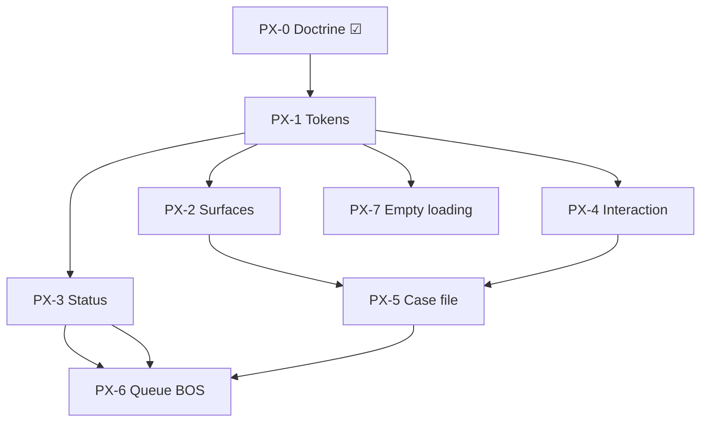

# Alloy — Operational Visual System Foundation (Product Experience Refresh)

**Path:** `docs/sprints/05_2026/forms_documents_product_experience_refresh.md`  
**Date:** May 2026  
**Status:** **PX-0 complete** · **PX-1 shipped** · **PX-2 shipped** (operational surface + card refinement)  
**Scope:** Alloy-wide operational surfaces — Forms/Documents are the **first adopter** and **reference interaction model**, not the only consumer.

**Binding inputs:**

| Program | Document |
|---------|----------|
| Interaction doctrine (canonical) | [`forms_documents_operational_experience_hardening.md`](./forms_documents_operational_experience_hardening.md) § Unified BOS Operational Interaction Doctrine |
| Phase 2 MVP (architecture) | [`forms_documents_phase_2_packet_review_mvp.md`](./forms_documents_phase_2_packet_review_mvp.md) |
| BOS presentation Phase 2 | [`bos_operational_recommendation_phase2_operational_ux.md`](./bos_operational_recommendation_phase2_operational_ux.md) |
| AdminV2 workspace | `web/app/adminV2/components/workspace/workspace.css`, workspace blocks |
| Forms review primitives (seed) | `web/lib/forms/review/formsReviewClassTokens.ts`, `formsReviewBadgeStyles.ts` |
| Product | [`docs/product/documents-and-forms.md`](../../product/documents-and-forms.md) |

**Influences (target consumers):** Forms/Documents, BOS drawer/queue/handoff, work-unit review, operational cards, drawers, future workflow/review systems.

**Workspace layer (sibling sprint):** [`forms_operational_workspace_redesign.md`](./forms_operational_workspace_redesign.md) — Forms hub, form detail, packet definitions, sessions/submissions navigation (OW-0–OW-7). Addresses the “modern review vs legacy admin” fracture PX-1/PX-2 exposed.

---

## Overview

### Sprint objective

Establish a **shared operational visual system** so Alloy reads as premium workflow infrastructure — calm, trustworthy, intelligently assisted — rather than bootstrap admin tooling or an AI gimmick platform.

**Architecture is ahead of visuals.** Recent work shipped operational cognition hierarchy, deterministic insight (`PacketReviewInsightV1`), case-file layout, provenance grouping, and human-authority-first BOS doctrine. PX-0 defines **how that intelligence should look and feel** across the product.

### Success statement

Operators perceive one product family: consistent typography rhythm, restrained surfaces, unified readiness grammar, calm interaction feedback, and integrated (not bolted-on) operational intelligence — whether in Forms review, AdminV2 workspace, or entity drawer.

### Explicit non-goals

| Forbidden | Notes |
|-----------|-------|
| Full product redesign | Operational surfaces only |
| Giant one-off page rewrites | Token + incremental adoption |
| Backend / rollup / insight contracts | Presentation only |
| Migrations, workflow semantics | Out of scope |
| Public embed rebrand | Deferred |

### Card map (this program)

| Card | Phase | Deliverable |
|------|-------|-------------|
| **PX-0** | Planning ☑ | Audit + doctrine + PX-1–7 plan (this doc) |
| **PX-1** | Implementation ☑ | Typography + spacing token consolidation |
| **PX-2** | Implementation ☑ | Operational surface / card refinement |
| **PX-3** | Implementation | Status / badge grammar unification |
| **PX-4** | Implementation | Interaction / motion / feedback polish |
| **PX-5** | Implementation | Case-file visual refinement |
| **PX-6** | Implementation | Queue / work-unit / BOS alignment |
| **PX-7** | Implementation | Loading / empty / error polish |

---

## Part 1 — Visual system audit

Evidence: code walkthrough May 2026 — `web/app/admin/forms/**`, `web/app/adminV2/**`, `web/components/forms/review/**`, `web/components/admin/**`, `OperationalAttentionHeaderStrip`, `QueueBlock`, `workspace.css`.

### 1.1 Typography

| Finding | Evidence | Impact |
|---------|----------|--------|
| **Dual type systems** | Forms legacy: `#31394d`, `#59678b`, `text-xs font-bold uppercase` in `FormDetailClient`, `FormSubmissionDetailClient`; AdminV2/Forms review: `alloy-midnight`, `formsCaseFileRegionTitle` | Module boundary visible; weak brand cohesion |
| **Admin-heavy sizing** | `SectionCard` headers: `text-sm font-semibold tracking-wider text-alloy-muted`; workspace CRM titles at 11px/800 weight in CSS vars | Reads as internal tooling, not editorial |
| **Weak page-level hierarchy** | Forms hub: no single page title scale; form detail: many equal `<details>` summaries | No clear H1 → region → body ladder |
| **Excessive monospace exposure** | Technical panels, submission IDs in linkage workflows, schema workspace keys | Debug tone in primary flow |
| **Scanability gaps** | Queue rows: multiple 11–12px lines; drawer strip: dense text without title-led hierarchy | Hard to skim under load |

**Severity:** High — affects every operational surface.

### 1.2 Surface hierarchy

| Finding | Evidence | Impact |
|---------|----------|--------|
| **Equal-weight cards** | `SectionCard` + nested `border-[#e6e8ec]` panels in submission detail; case-file regions all use similar white + border | Box fatigue |
| **Nested bordered boxes** | `FormDetailClient` accordion stacks; `Outcome summary` inside SectionCard inside page | Cognitive load |
| **Accordion overload** | Form detail, forms hub setup, packet definition — `<details>` as primary layout | No operational “workspace” |
| **Poor grouping rhythm** | 16px case-file stack vs 5px SectionCard padding vs workspace 8/12/16/20 scale — not one rhythm | Fragmented vertical flow |
| **Positive seed** | `workspace.css` documents “operating surface, not generic card soup”; `IntakeCaseFileLayout` region order | Architecture right; visuals not yet aligned |

**Severity:** High.

### 1.3 Density

| Finding | Evidence | Impact |
|---------|----------|--------|
| **Cramped operational rows** | Queue row min-height 50px + multiple hint lines + priority strip | Row feels busy |
| **Oversized admin panels** | Form schema workspace full-width; wide gray callouts in hub | Ops actions buried |
| **Inconsistent spacing** | Forms `space-y-4` vs AdminV2 `--ws-dept-section-gap: 16px` vs legacy 4px/8px ad hoc | Unpolished |
| **Modal vs page** | Packet review modal uses `compact` flag but same border weight as page | Modal not meaningfully denser |
| **Visual fragmentation** | Drawer chrome vs Forms review page vs legacy admin forms routes | Same task, different product |

**Severity:** Medium-high.

### 1.4 Status grammar

| Finding | Evidence | Impact |
|---------|----------|--------|
| **Multiple badge systems** | `FormsReviewBadge` + tones in `formsReviewBadgeStyles.ts`; `StatusBadge` + `getStatusVariant` in `StatusBadge.tsx`; queue urgency tiers; resolver labels | Color competition |
| **Inconsistent severity** | `attention` vs `warning` both ember; `StatusBadge` `gold` variant unused in forms path | Unpredictable meaning |
| **Weak readiness semantics** | Forms: `PacketReviewInsightV1.readiness_state` + checklist; drawer: urgency fields often not rendered (Phase 2 gap) | Confidence not visible at scan depth |
| **Too many chips per row** | Queue: attention reason + suggestion preview + operational summary + priority | Recommendation overload risk |
| **Positive seed** | `FormsReviewBadgeTone` maps cleanly to operational states | Extend, don’t replace |

**Severity:** High for BOS + Forms alignment.

### 1.5 Interaction language

| Finding | Evidence | Impact |
|---------|----------|--------|
| **Weak hover feedback** | Legacy forms tables: minimal row hover; artifact lists static | Feels inert |
| **Inconsistent button hierarchy** | `PrimaryButton` / `SecondaryButton` in admin; case-file uses text links + bordered buttons mixed | Unclear primary action |
| **Abrupt loading** | `FormsReviewStatePanel` text-only; workspace skeleton patterns differ | Unpolished wait states |
| **Disclosure transitions** | Native `<details>` without shared chevron/motion token | Jarring expand |
| **Positive seed** | `formsCaseFileActionLink` focus ring; review actions band surface | Reuse globally |

**Severity:** Medium.

### 1.6 Operational rhythm

| Finding | Evidence | Impact |
|---------|----------|--------|
| **No narrative flow** | Hub → table only; form detail → schema before ops | Operator must infer journey |
| **Sections compete equally** | Submission detail: Outcome summary vs Needs attention vs case header — similar weight | Wrong priority |
| **Action placement inconsistent** | Approve/reject in band (good) vs generate doc mid-page vs drawer draft popover | Hunt for actions |
| **Weak visual narrative** | BOS strip: “What BOS has to say” + Sparkles icon vs Forms “Review assist” calm band | Split personality |
| **Positive seed** | Case-file region order (header → assist → changed → attention → forms → documents → actions) | Preserve order; tune weight |

**Severity:** High on Forms; medium on AdminV2.

### 1.7 BOS alignment

| Finding | Evidence | Impact |
|---------|----------|--------|
| **Intelligence not visually integrated** | Drawer strip text-only; canonical recommendation fields unused at L1 | Backend stronger than UI |
| **Recommendation overload risk** | Queue row stacks 3–4 operational lines | Scan lane noise |
| **Framing drift** | “Alloy suggestion”, Sparkles, “What BOS has to say” vs Forms “Review assist” | Multiple BOS personalities |
| **Reference model underused** | `BosReviewSummaryPlaceholder` + `PacketReviewInsightV1` anatomy | Should drive drawer + queue grammar |
| **Positive seed** | Unified interaction doctrine; deterministic insight contract | Visual layer must catch up |

**Severity:** Critical for cross-program coherence.

### 1.8 Surface-specific notes (adoption targets)

| Surface | Priority | Key visual debt |
|---------|----------|-----------------|
| Forms hub | P1 | README + table; legacy hex |
| Form detail | P1 | Accordion layout |
| Packet review / modal | P0 showcase | Flat cards; assist band needs accent |
| Submission detail | P2 | Legacy SectionCard + hex |
| AdminV2 queue row | P0 | Line stacking; chip framing |
| Drawer BOS strip | P0 | Must match Review assist |
| Work-unit above fold | P2 | Chip density |
| Operational proposal cards | P3 | Governed proposal frame separate from insight |

---

## Operational Visual System Foundation

**Authority:** This section is the **visual companion** to the Unified BOS Operational Interaction Doctrine in [`forms_documents_operational_experience_hardening.md`](./forms_documents_operational_experience_hardening.md). Interaction defines *what* to say; this defines *how it looks*.

**Implementation home (PX-1):** `web/lib/operational/ui/operationalVisualTokens.ts`, `operationalVisualSpacing.ts`. Forms `formsReviewClassTokens.ts` re-exports shared tokens — not a parallel hex system.

### Typography doctrine

| Role | Token (planned) | Spec | Use |
|------|-----------------|------|-----|
| **Page title** | `opPageTitle` | `text-xl font-semibold text-alloy-midnight tracking-tight` | One per route |
| **Page lead** | `opPageLead` | `text-sm text-alloy-midnight/70 max-w-prose` | One support line under title |
| **Region title** | `opRegionTitle` | `text-sm font-semibold text-alloy-midnight` | Case-file / drawer section |
| **Region lead** | `opRegionLead` | `text-xs leading-snug text-alloy-midnight/65` | One line under region |
| **Body** | `opBody` | `text-sm leading-relaxed text-alloy-midnight/85` | Answers, lists |
| **Meta** | `opMeta` | `text-xs text-alloy-midnight/60` | Timestamps, provenance |
| **Label caps** | `opLabelCaps` | `text-[11px] font-semibold uppercase tracking-wide text-alloy-midnight/50` | Groups, checklist headers |
| **Confidence emphasis** | `opConfidenceTitle` | Region title + paired readiness chip only | Never headline-sized |

**Rules:**

- Max **one** page title per viewport.  
- Monospace **only** in technical disclosure / IDs.  
- No `tracking-wider` on operational headers (settings/admin legacy) in new work.  
- Summary bullets use `opBody` list rhythm — not smaller than meta.

### Surface doctrine

| Layer | When to use | Treatment | When NOT to use |
|-------|-------------|-----------|-----------------|
| **Page ground** | All operational routes | AdminV2 ambient / `bg-alloy-stone/10` | N/A |
| **Orientation band** | Case header, WU above-fold | White, light shadow, single border | Inside every subsection |
| **Region band** | Case-file regions, drawer sections | Title + lead + content; **no card** unless grouping list | Wrapping every paragraph |
| **Grouped list** | Artifacts, steps, table bodies | One border, `divide-y` | Card per row |
| **Intelligence band** | Review assist, drawer L1 insight | `opIntelligenceSurface` — white, subtle left accent (stone/blue 3%), no gradient | Full-page panels |
| **Action band** | Approve/reject, primary CTAs | Tinted border (`alloy-blue/25`); max one per viewport | Inline with body copy |
| **Technical** | Collapsed disclosure only | No elevation; `opMeta` typography | Primary flow |

**Grouping rhythm:** Spacing scale **8 · 12 · 16 · 20 · 24** only (align AdminV2 workspace). Between regions: **16px** (20px page-level). Inside region: **8–12px**.

**Border/shadow restraint:** Prefer **border XOR shadow**, not both. Max **two** bordered ancestors visible in one viewport column.

### Status doctrine

Map all operational readiness to **one tone enum** (extend `FormsReviewBadgeTone` → `OperationalReadinessTone`):

| Semantic | Tone | Label examples | Use |
|----------|------|----------------|-----|
| Ready | `success` | Ready for review, Approved, OK | Checklist, chip |
| Needs attention | `warning` | Needs attention, Review hint | Warnings, linkage |
| Incomplete | `info` | Incomplete, In progress | Progress |
| Blocked | `error` | Blocked, Rejected | Cancelled session |
| Awaiting correction | `warning` | Awaiting correction | Review state |
| Neutral meta | `neutral` | Draft, Submitted | Non-decision states |

**Rules:**

- **One readiness chip** per surface at L1 (drawer strip, assist header).  
- Queue L0: urgency band color OR chip, not both + three text lines.  
- No `gold`, no rainbow SLA colors in new operational UI — map SLA to band + single hint line.  
- Artifact kind: **text label** (UX-F) preferred over second badge when kind already shown in group header.

**Unify consumers:** `FormsReviewBadge`, drawer strip, queue preview, `OperationalProposalCardFrame` risk badges (governed proposals only — separate vocabulary).

### Interaction doctrine

| Pattern | Spec | Avoid |
|---------|------|-------|
| **Hover** | Tables/lists: `bg-alloy-stone/15`; links: underline; cards: no hover unless clickable | Layout shift |
| **Click feedback** | `active:opacity-90`; focus: `outline-alloy-blue/40` (existing link token) | Double borders on focus |
| **Loading** | `opLoadingSurface` — muted text + optional 2-line skeleton; same min-height as loaded | Blank flash |
| **Disclosure** | `transition-[grid-template-rows] duration-150 ease-out` or chevron rotate 150ms | Height animation >200ms |
| **Primary action** | One filled button per viewport; secondary = outline or link | Multiple filled buttons |
| **Sticky review actions** | Page-only; `position: sticky; bottom: 0` inside scroll container with backdrop blur — **test modal** | Sticky in modal |

Must feel: **premium, calm, responsive, operational** — not flashy consumer UI, not bootstrap defaults, not gimmicky motion.

### BOS visual doctrine

Operational intelligence is **integrated, contextual, concise, trustworthy, secondary to human authority**.

| Principle | Forms reference (`UX-H` + P2-5) | AdminV2 target |
|-----------|----------------------------------|----------------|
| **One intelligence band** | `BosReviewSummaryPlaceholder` region 3 | Drawer L1 strip = same anatomy |
| **Title** | “Review assist” | Not “What BOS has to say” / not Sparkles-led |
| **Structure** | Summary bullets → checklist → key changes → attention → focus → paths → authority note | Same order, density-adjusted |
| **Readiness** | Chip top-right of band | `urgency_label` rendered, same colors |
| **No AI marketing** | No purple gradient, no pulse, no chat bubbles | Handoff seeds text only |
| **Human authority** | Footer note always visible | No auto-apply affordance styling |

**Avoid:** giant AI cards, chatbot styling, recommendation spam, rainbow callouts, per-row “suggestion” chips when canonical recommendation exists.

**Queue scan lane:** One merged line: `{readiness} · {primary focus}` — detail in drawer.

---

## Part 3 — Implementation cards (PX-1 → PX-7)

**Prerequisite:** PX-0 doctrine approved. **Do not** change review contracts or insight builders in PX-1–PX-7.

### PX-1 — Typography + spacing token consolidation ☑

**Goal:** Single source of truth for operational typography and spacing; eliminate new hex in route clients.

**Shipped (May 2026):**

| Area | Path |
|------|------|
| Canonical tokens | `web/lib/operational/ui/operationalVisualTokens.ts` |
| Spacing helpers | `web/lib/operational/ui/operationalVisualSpacing.ts` |
| Forms re-exports | `web/lib/forms/review/formsReviewClassTokens.ts` |
| Page header (foundation) | `web/components/operational/ui/OperationalPageHeader.tsx` |
| Tests | `web/tests/operational/operationalVisualTokens.test.ts` |

**Tokens introduced:** `opPageTitle`, `opPageSubtitle`, `opSectionTitle`, `opSectionSupport`, `opCaseFileTitle`, `opContextLabel`, `opContextValue`, `opConfidenceTitle`, `opMetadata`, `opMutedMeta`, `opInsightSummary`, `opInsightSupport`, `opAttentionText`, spacing stack (`opStackRegion`, `opStackSection`, …), surface rhythm (`opOrientationSurface`, `opIntelligenceSurface`, …).

**Adoption surfaces (proof of concept):** `IntakeCaseFileLayout`, `PacketCaseFileHeader`, `BosReviewSummaryPlaceholder`, `CaseFileSection`, `PacketIntakeContextPanel`, `DocumentsRecordsPanel`, `ArtifactsPanel`, `IntakeArtifactCard`, `FormsProvenanceDetail`, `TechnicalDetailDisclosure` (+ JSON block). `PacketReviewRollupView` inherits via layout children.

**Tests run:** `operationalVisualTokens.test.ts`, `formsReviewComponents.test.tsx`, `bosReviewAssistPanel.test.tsx`, `packetReviewCaseFileLayout.test.tsx` — targeted.

**Remaining drift (PX-2+):** Legacy Forms admin routes (`web/app/admin/forms/**` hex), `SectionCard`, AdminV2 queue/drawer BOS strip, `EntityDocumentsSection` partial re-export usage, settings typography.

**Acceptance criteria:**

- [x] Doctrine roles map to exported constants.  
- [x] Zero new `#e6e8ec` / `#59678b` in PX-1 touched files.  
- [x] Forms review surfaces consume shared tokens (AdminV2 global conversion deferred per scope).

**Sequencing:** **Blocker** for PX-2–PX-7 — satisfied.

---

### PX-2 — Operational surface / card refinement ☑

**Goal:** Reduce box fatigue; layered hierarchy; visibly premium packet review composition.

**Shipped (May 2026):**

| Change | Detail |
|--------|--------|
| Case-file canvas | `opCaseFileCanvas` + `opRegionSeparator` in `IntakeCaseFileLayout` |
| Region bands | `OperationalRegionBand`, `CaseFileSection` default `layout="band"` + tonal tints |
| Grouped lists | Single `opGroupedSurface` for submitted forms, what-changed, needs-attention |
| Surfaces refined | Orientation (soft ring lift), intelligence (gradient band + left accent), review actions (anchored top border), technical (low elevation) |
| Actions | `CaseFileReviewActions` + `PacketReviewActionsForm` button rhythm |
| Tests | `web/tests/forms/packetReviewSurfaces.test.tsx` |

**Surfaces updated:** `IntakeCaseFileLayout`, `CaseFileSection`, `OperationalRegionBand`, `PacketCaseFileHeader`, `BosReviewSummaryPlaceholder`, `PacketSubmittedFormsPanel`, `DocumentsRecordsPanel`, `ArtifactsPanel`, `NeedsAttentionPanel`, `WhatChangedPanel`, `CaseFileReviewActions`, `TechnicalDetailDisclosure`, `PacketReviewRollupView` (via children).

**Visual changes:** Stone canvas ground; regions separated by hairline dividers; no per-step bordered cards; warning/attention rows inside one grouped container; BOS band softer with gradient; review decision band elevated.

**Remaining visual debt (PX-3+):** Legacy `web/app/admin/forms/**` pages, `SectionCard` in submission detail beyond case-file, AdminV2 queue/drawer BOS, badge grammar unification, motion/loading polish, forms hub/detail accordions.

**Acceptance criteria:**

- [x] No triple-nested bordered panels in packet review primary path.  
- [x] Case-file regions without “card in card in card”.  
- [x] `workspace.css` references operational visual tokens.

**Sequencing:** After PX-1; parallel with PX-3.

---

### PX-3 — Status / badge grammar unification

**Goal:** One readiness vocabulary across Forms, BOS drawer, queue preview.

**Target surfaces:** `formsReviewBadgeStyles.ts`, `StatusBadge.tsx` (operational mapping), `OperationalAttentionHeaderStrip`, `QueueBlock` preview, `BosReviewSummaryPlaceholder`.

**Tasks:**

1. Export `OperationalReadinessTone` + label map shared with insight `readiness_state`.  
2. Wire drawer strip to render readiness chip + urgency from canonical recommendation.  
3. Queue: render `urgency_band` once; demote duplicate lines (coordinate BOS Phase 2).  
4. Deprecate ad hoc amber/green divs in operational paths.

**Risks:** CRM status keys ≠ review readiness — keep `StatusBadge` for entity lifecycle; don’t force-merge unrelated domains.

**Acceptance criteria:**

- [ ] Forms assist + drawer strip use same chip classes and labels for `needs_attention`.  
- [ ] Queue row shows at most one urgency indicator + one operational line at L0.  
- [ ] Tests snapshot chip class names.

**Sequencing:** After PX-1; **before or with** BOS Phase 2 presentation PRs.

---

### PX-4 — Interaction / motion / feedback polish

**Goal:** Calm, consistent hover, focus, loading, disclosure motion.

**Target surfaces:** `FormsReviewStatePanel`, `TechnicalDetailDisclosure`, tables in Forms hub, queue row hover, primary/secondary buttons in review actions.

**Tasks:**

1. `opRowHover`, `opDisclosureTransition` tokens.  
2. Standardize loading panel min-height.  
3. Review actions: single primary button style from AdminV2.  
4. Optional page-only sticky action bar behind feature flag or scroll test.

**Risks:** Sticky actions in modal — **page only**.

**Acceptance criteria:**

- [ ] Disclosure panels use shared transition token.  
- [ ] Focus visible on all operational links/buttons in touched surfaces.  
- [ ] No layout shift on queue row hover.

**Sequencing:** After PX-1; can parallel PX-2/3.

---

### PX-5 — Operational case-file visual refinement

**Goal:** Premium case-file — the showcase for the visual system.

**Target surfaces:** `PacketCaseFileHeader`, `BosReviewSummaryPlaceholder`, `CaseFileReviewActions`, `IntakeCaseFileLayout`, opportunity modal `placement="modal"`.

**Tasks:**

1. Apply `opIntelligenceSurface` accent to assist band.  
2. Increase inter-region spacing; modal `compact` typography scale.  
3. Action band prominence (PX-4 button tokens).  
4. Documents/artifacts inherit PX-2 grouped list tokens.

**Risks:** Modal scroll + sticky interaction — test explicitly.

**Acceptance criteria:**

- [ ] Packet review screenshot defensible as premium case file.  
- [ ] Review actions visible without expanding technical.  
- [ ] Assist band visually distinct from body without AI gimmicks.

**Sequencing:** After PX-1–3; highest demo impact.

---

### PX-6 — Queue / work-unit / BOS operational alignment

**Goal:** AdminV2 scan surfaces match Forms Review assist grammar.

**Target surfaces:** `OperationalAttentionHeaderStrip.tsx`, `QueueBlock.tsx`, `buildQueueOperationalAttentionPresentation`, work-unit header chips, `operationalProposalPresentation.ts` (labels only).

**Tasks:**

1. Replace Sparkles-led / “What BOS has to say” with Review assist anatomy (density-adjusted).  
2. Merge queue operational lines per BOS visual doctrine.  
3. Render canonical recommendation fields at L1.  
4. Work-unit chips: max 2 readiness-related chips visible.

**Risks:** BOS Phase 2 scope overlap — coordinate in one PR train with [`bos_operational_recommendation_phase2_operational_ux.md`](./bos_operational_recommendation_phase2_operational_ux.md).

**Acceptance criteria:**

- [ ] Side-by-side: drawer L1 and Forms assist feel same family.  
- [ ] No “Alloy suggestion” chip in queue when recommendation present.  
- [ ] Handoff seed unchanged functionally; calmer presentation.

**Sequencing:** After PX-3; coordinate with BOS Phase 2.

---

### PX-7 — Loading / empty / error operational polish

**Goal:** Trust-building empty/loading/error states — intentional, not broken.

**Target surfaces:** `FormsReviewStatePanel`, `ArtifactsPanel` empty states, `EntityDocumentsSection`, hub empty, drawer attention errors, queue fetch errors.

**Tasks:**

1. `opEmptyState`, `opErrorState`, `opLoadingState` tokens (copy + spacing).  
2. Unify dashed-border empty pattern.  
3. Error bands: amber for recoverable, red for hard fail — one pattern each.  
4. Hub + packet list empty copy pass (presentation only).

**Risks:** Over-copy — keep one sentence + optional action link.

**Acceptance criteria:**

- [ ] All touched surfaces use shared empty/error/loading components.  
- [ ] Empty states explain what will appear, not “No data”.  
- [ ] Retry actions styled consistently.

**Sequencing:** After PX-1; can ship incrementally per surface.

---

## Part 4 — Recommended sequencing



| Wave | Cards | Notes |
|------|-------|-------|
| **0** | PX-0 ☑ | This document |
| **1** | PX-1 | Blocker — shared `operationalVisualTokens.ts` |
| **2** | PX-3 + PX-2 | Status + surfaces in parallel |
| **3** | PX-4 + PX-7 | Interaction + states |
| **4** | PX-5 | Case-file showcase |
| **5** | PX-6 | With BOS Phase 2 presentation |
| **Ongoing** | Legacy Forms hub/detail | Adopt tokens opportunistically in PX-2/7 — no monolithic rewrite card |

**Do not start implementation** until PX-0 doctrine is merged and BOS interaction doctrine link is acknowledged in BOS Phase 2 doc.

---

## Verification (when PX-1–PX-7 ship)

```bash
cd web && npx tsc --noEmit
cd web && npm run lint
cd web && npm run test -- tests/forms/formsReviewComponents.test.tsx tests/forms/bosReviewAssistPanel.test.tsx tests/admin/opportunity/OpportunityPacketReviewModalBody.test.tsx tests/bos/bosCapabilityRegistry.test.ts
```

**Visual QA (cross-product):**

1. Packet review page + modal — case-file showcase  
2. Opportunity drawer L1 — matches Review assist  
3. Queue scan row — one operational line + one urgency signal  
4. Forms hub — no legacy hex in primary path  
5. Side-by-side AdminV2 workspace + Forms review — one family  

---

## Risks / follow-ups

| Risk | Mitigation |
|------|------------|
| Token sprawl | `operationalVisualTokens.ts` owns hex; consumers import roles only |
| Merging StatusBadge with review readiness | Domain split: entity lifecycle vs review readiness |
| BOS Phase 2 double work | Single PR train for PX-3 + PX-6 + Phase 2 selectors |
| Scope creep | No public embed; no hub aggregate API in this program |
| Page rewrites | Explicit anti-goal in every card |

**Follow-on (out of program):** PX-8 public embed branding; aggregate hub counts API; settings panel typography (separate from operational).

---

## Suggested commit message (PX-0 doc-only)

```
docs: PX-0 operational visual system foundation (audit + doctrine + PX-1–7 plan)

Alloy-wide operational visual audit; unified typography/surface/status/BOS
visual doctrine; implementation cards for product experience refresh.
```

---

## Cursor execution order

1. Read interaction doctrine: [`forms_documents_operational_experience_hardening.md`](./forms_documents_operational_experience_hardening.md).  
2. Implement **PX-1** (tokens) — blocker.  
3. **PX-3 + PX-2** in parallel.  
4. **PX-4 + PX-7**.  
5. **PX-5** (case-file).  
6. **PX-6** with BOS Phase 2.  
7. Do **not** change insight contracts or workflow semantics.
