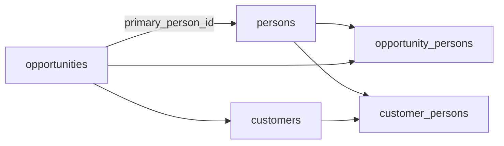

# Pass B — Person Convergence & Lifecycle Gate Alignment v1

**Path:** `docs/sprints/05_2026/pass_b_person_convergence_v1.md`  
**Status:** Shipped (May 2026)  
**Builds on:** `lifecycle_information_matrix_v1.md`, Pass A (`AddInquiryChildModal`)

---

## Doctrine (unchanged)

Requirements belong to **lifecycle progression**, not to forms, actions, or capture surfaces. Information may arrive via public form, packet, AI intake, API, or manual entry; the system evaluates **what exists** when advancing stages.

**Person** is the canonical human entity (`persons` + `customer_persons`). Avoid product-facing “Contact” where Person is meant.

---

## Person convergence audit

| Entry point | Registry key | Prior UX | Pass B |
|-------------|--------------|----------|--------|
| Family contacts section | `add_family_member` | `AddFamilyMemberModal` → execute | **`AddPersonModal`** + `submitAddPersonFromDrawer` |
| Customer booking (legacy layout) | `add_related_person` | `AddRelatedPersonModal` → execute | Same modal + routing |
| Registry `open_form` (header/section) | both keys | `setActionFormState` → dual modals | `openAddPerson` / `ADMINV2_OPEN_ADD_PERSON_MODAL` |
| Create lead (WU / dept page) | `create_lead` | `CreateLeadModal` | Unchanged path; copy → Person; validation aligned |

**Competing implementations removed from drawer:** two modals collapsed to **`AddPersonModal`**. Deprecated re-exports: `AddFamilyMemberModal.tsx`, `AddRelatedPersonModal.tsx`.

**Server:** `add_family_member` and `add_related_person` share **`upsertAndLinkPersonForAdmin`** — on opportunity, links **`customer_persons`** (when `customer_id` on file) **and** **`opportunity_persons`**. Fixes prior gap where `add_family_member` only wrote `opportunity_persons`.

---

## Canonical Add Person path

| Layer | Module |
|-------|--------|
| Modal | `web/components/admin/opportunity/actions/AddPersonModal.tsx` |
| Client routing | `web/lib/admin/actions/addPersonActionClient.ts` |
| Submit | `web/lib/admin/actions/submitAddPersonFromDrawer.ts` |
| Server link | `web/lib/admin/person/upsertAndLinkPersonForAdmin.ts` |
| Execute | `executeAdminAction` (`form_key` `add_family_member` \| `add_related_person`) |

**Runtime kind:** capture-first — **no** `LIFECYCLE_PREFLIGHT_ACTION_KEYS`.

### Submit-time validation (person only)

| Block | Allow (lifecycle-owned) |
|-------|-------------------------|
| Missing first/last name | Missing child |
| Missing phone **and** email | Missing program / schedule / classroom |

---

## Create lead minimum doctrine

| Field | Required | Exists |
|-------|----------|--------|
| First name | Yes | Yes (`executeCreateLeadAction` + modal) |
| Last name | Yes | Yes |
| Phone **or** email | Yes | Yes |
| Child | **No** | Yes — lead creates opportunity + primary person only |
| Source / location / notes | Optional | Partial — source on execute; location via context; notes not on modal |

**Gap (P2):** `CreateLeadModal` does not expose source/location/notes fields; server accepts `source` and `location_id` in merged payload when provided.

---

## Relationship model (runtime)

| Link | Purpose |
|------|---------|
| `opportunities.primary_person_id` | Case primary person (household-scoped) |
| `customer_persons` | Household membership + role (`primary_contact`, `parent`, …) |
| `opportunity_persons` | Adults linked to this inquiry/case |
| `customer_members` + OCM | Children on inquiry (Pass A) |

**Primary contact:** `customer_persons` with `role_type = primary_contact` and `is_primary`; drawer resolves via `resolveLeadSummaryPrimaryPersonId`. Adding a person with role **Primary person** sets `is_primary` on insert when role implies primary.

**Gap (P1):** Adding `primary_contact` does not auto-update `opportunities.primary_person_id` if unset — operator may still set primary via household API / card edit.

---

## UI after save

- `refetch()` + `relatedPeopleRefreshKey` increment
- `adminv2:opportunity-updated` event
- Success feedback via `setRegistryActionFeedback`
- Person appears in family contacts via merged `_opportunity_persons` + `_customer_persons`

---

## Lifecycle gaps (remaining)

| Gap | Priority |
|-----|----------|
| `move_to_waitlist` inactive in registry | P0 |
| Waitlist preflight missing schedule/start vs doctrine | P1 |
| Create task modal | P1 |
| Set `primary_person_id` when adding primary role person | P1 |
| Create lead optional fields in modal | P2 |
| Customer-only drawer (no opportunity) Add Person event | P2 |

---

## Tests

- `web/tests/admin/person/upsertAndLinkPersonForAdmin.test.ts`
- `web/tests/admin/actions/submitAddPersonFromDrawer.test.ts`
- `web/tests/admin/actions/addPersonActionClient.test.ts`
- `web/tests/admin/actions/applyRegistryAddPerson.test.ts`
- `web/tests/admin/actions/addPersonConvergence.contract.test.ts`
- `entryLifecycleActions.test.ts` (create lead copy)

---

## Suggested next pass

**Pass C** — Send form / comms demo surfaces (per `lifecycle_information_matrix_v1.md`), then **Pass E** waitlist activation.
