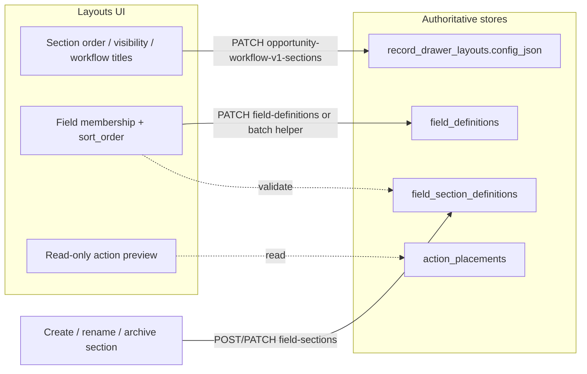

# Sprint: Record Experience Builder — Phase 1

**Path:** `docs/sprints/05_2026/record_experience_builder_phase_1.md`  
**Status:** **In progress — Cards 0–4 complete (checkpoint); Cards 5–9 deferred**  
**Prerequisites:** `docs/sprints/05_2026/settings_record_ux_parity_sprint.md` (closed), `docs/system/configuration-system.md`, `docs/system/record-system.md`, `docs/system/actions-and-workflows.md`, `docs/execution/operating-doctrine.md`  
**Program framing:** Extend the **four-plane Settings control plane** so **Layouts** is the operator-facing **drawer composition** surface — **not** a no-code builder, second layout SoT, or raw JSON editor. Align with **BOS** (`docs/product/bos-foundation.md`) as orchestration intelligence over the same validated Settings APIs.

---

## BOS alignment (Record Experience Builder)

**BOS** = Business Orchestration System — Alloy’s unified orchestration intelligence layer (`docs/product/bos-foundation.md`).

| Rule | Record Experience Builder stance |
|------|----------------------------------|
| Control plane | Layout composition is a **Settings/config** capability, not a separate AI config stack |
| Primary BOS capability | **`config_layout_assist`** — do not add a new capability unless explicitly justified |
| Proposals | Native `ConfigurationProposalV1` payloads; wrap with `BosProposalEnvelopeV1` only at safe boundaries (`web/lib/bos/bosProposalEnvelope.ts`, adapters) |
| Apply | Human approval + validated admin PATCH / existing apply catalog — **no autonomous apply** |
| APIs | Same routes as operators: workflow v1 sections, field-sections, field-definitions batch-placement — **no** `/api/admin/ai` rename, **no** `web/lib/agent/**` migration in this sprint |
| Storage | **No** raw `config_json` editor, **no** hidden AI-only tables, **no** duplicate field order in layout JSON |
| Registry | Capability gates in `web/lib/adminV2/layouts/layoutCompositionCapabilities.ts` document what BOS may propose vs read-only surfaces |

---

## 1. Sprint goal

Make **Settings → Layouts** the coherent place operators compose **what appears in the record drawer** and **in what order**, while preserving existing storage and PATCH boundaries.

Operators should complete drawer composition tasks **without** opening raw `config_json`, inventing runtime sections, or duplicating field-order storage.

**Primary editable target:** **Opportunity** with `inquiry_drawer_mode: workflow_v1`.  
**Job / schedule:** effective preview + read-only composition messaging unless a card explicitly expands support.

---

## 2. Why this matters

The **Settings + Record UX Parity** sprint (May 2026) shipped the four-plane control plane and opportunity **workflow v1** section editor (reorder, show/hide, restore hidden, rename workflow virtual titles). Operators still split work across **Layouts**, **Field grouping**, and **Fields** without a single composition mental model.

Phase 1 closes that gap **on existing tables and APIs** — aligned with roadmap item “Record Experience Builder” in `docs/execution/roadmap-and-gaps.md` and deferred work in `docs/system/configuration-system.md` § Next strategic layers.

---

## 3. Core doctrine (unchanged)

| Plane | Owns | Storage / APIs |
|-------|------|----------------|
| **Fields** | Registry + policies | `field_definitions` (+ policies) |
| **Field grouping** | Catalog taxonomy labels | `field_section_definitions` |
| **Layouts** | Drawer composition | `record_drawer_layouts.config_json`, `overview_*`, `inquiry_workflow_sections` |
| **Actions** | Placement | `action_placements.section_key` |
| **Automations** | Execution | `executeAdminAction`, workflows — **out of scope** |

**Queues remain preview-only** — `docs/system/record-system.md`.

---

## 4. Current state summary (Card 0 audit — 2026-05-18)

| Capability | State | Evidence |
|------------|--------|----------|
| Layouts composition workspace | **Shipped (Cards 2–4)** | `RecordDrawerCompositionWorkspace.tsx`, `LayoutsSettingsHubClient.tsx` |
| Composition capability module | **Shipped (Card 1)** | `web/lib/adminV2/layouts/layoutCompositionCapabilities.ts` |
| Opportunity section reorder / visibility / workflow rename | **Shipped** | `OpportunityWorkflowV1SectionsEditor.tsx`, `PATCH …/opportunity-workflow-v1-sections` |
| Restore hidden drawer sections | **Shipped** | `overview_hidden_sections` via same PATCH |
| Catalog section create / rename / retire from Layouts | **Shipped (Card 3)** | `LayoutCatalogSectionsPanel.tsx`, `field-sections` POST/PATCH |
| Field assign + reorder in Layouts | **Shipped (Card 4)** | `LayoutSectionFieldsPanel.tsx`, `PATCH …/field-definitions/batch-placement` |
| Effective drawer preview | **Shipped** | `effective-preview/route.ts`, `EffectiveDrawerLayoutPreviewPanel.tsx` |
| Layout integrity panel | **Shipped** | `LayoutIntegrityReportPanel.tsx` |
| Preview actions per drawer section | **Missing (Card 5)** | No `action_placements` join in layout settings |
| Deep-link Layouts → Actions | **Missing (Card 5)** | Actions hub filter not implemented |
| Job / schedule composition editor | **Read-only** | `resolveLayoutCompositionCapabilities` + preview banner |
| Field grouping UI (parallel) | **Shipped** | `FieldSectionsClient.tsx` — still valid for bulk catalog edits |
| Fields UI assign `section_key` | **Shipped** | `EntityFieldsClient.tsx` — parallel path |
| SoT: no `sort_order` in `config_json` | **Verified** | `recordDrawerLayoutPersist.ts` only merges layout chrome; field order via `field_definitions` |
| `is_archived` in field-sections UI (Field grouping) | **Still missing there** | Layouts panel exposes retire/restore |
| Linked-record PATCH | **Out of scope** | No Layouts mutation path |
| Raw `config_json` editor | **None** | Grep `adminV2/settings/layouts` — clean |
| Config/Layout Assist drawer JSON apply | **Deferred** | `configuration_layout_assist_v1.md` — `move_field_to_section` partial; no raw JSON apply |

### Card 0 — canonical section keys

`listOpportunityWorkflowV1CanonicalSectionKeys` (`effectiveDrawerLayoutPreview.ts`) builds the allowed permutation from `computeOpportunityOverviewSectionsLikeDrawer` with **no saved** `overview_section_order`. Operators may **restore hidden** keys via `overview_hidden_sections`; they **cannot** add workflow virtuals with new `field_keys` in Phase 1.

### Card 0 — admin routes (layout composition)

| Route | Class |
|-------|-------|
| `PATCH /api/admin/record-drawer-layouts/opportunity-workflow-v1-sections` | A |
| `PATCH /api/admin/field-definitions/batch-placement` | B |
| `POST/PATCH/DELETE /api/admin/field-sections` | C (DELETE blocked when fields assigned) |
| `PATCH /api/admin/field-definitions/[id]` | B (single-field, parallel) |
| `GET /api/admin/record-layouts/effective-preview` | Read |

### Card 0 — go / no-go

**Go** for Cards 1–4. **Hold** Cards 5–6 until checkpoint review (action preview contract + linked primitive types only).

### Source-of-truth preservation (must not violate)

| Concern | Canonical store | Layouts may |
|---------|-------------------|-------------|
| Field membership & order within catalog section | `field_definitions.section_key`, `field_definitions.sort_order` | PATCH via existing field-def API only |
| Catalog section labels | `field_section_definitions` | POST/PATCH field-sections API |
| Drawer section order & visibility | `record_drawer_layouts.config_json` (`overview_section_order`, `overview_hidden_sections`) | Existing workflow v1 PATCH helpers |
| Workflow virtual section titles & field_keys | `inquiry_workflow_sections` in `config_json` | Rename titles only; **no** new arbitrary virtuals with custom `field_keys` |
| Action buttons in sections | `action_placements` | Read-only preview + deep link; edits on Actions plane |

---

## 5. Scope

1. **Layouts composition workspace** — unified operator UX on `/adminV2/settings/layouts` for opportunity workflow v1: sections + per-section field list + save boundaries.
2. **Catalog section operations** — create catalog-backed section, rename label, soft-retire (`is_archived`) from Layouts **or** deep-linked Field grouping flows (same APIs).
3. **Field assignment & within-section reorder** — mutate only `field_definitions.section_key` / `sort_order` (validated against `field_section_definitions`).
4. **Preview enhancements** — drawer structure + **read-only** action placements per section; deep-link to Actions settings with `section_key` (and entity) query params.
5. **Capability matrix** — `layoutCompositionCapabilities.ts` (or extend `layoutSettingsCapabilities.ts`) for entity/layout-type gates; job/schedule remain preview-first.
6. **Linked-record layout primitives (definition only)** — document preview kinds for linked person block, linked customer block, open-linked-record affordance, future inline edit — **no** linked PATCH fanout.
7. **Tests + active doc updates** for behavior-changing cards.

---

## 6. Non-scope

- Full no-code / drag-and-drop builder (no new DnD library unless Card 2 proves Up/Down insufficient at scale)
- Raw `config_json` editing in UI
- Arbitrary runtime sections or custom schema injection
- Duplicate field-order storage in `config_json`
- Destructive section delete that orphans fields (keep `assertSectionSafeToDelete` / archive-only)
- Linked-record PATCH / `editable_through_related_record` write routing
- Changes to `executeAdminAction` semantics
- Duplicate action definition editor on Layouts plane
- New workflow virtual sections with operator-defined `field_keys` (restore hidden + rename only)
- `record_actions` migration
- Config/Layout Assist apply-catalog expansion (program pause)
- Person / location / customer layout editors (catalog entities without drawer layout row today)

---

## 7. Safe mutation model (design lock — implement in Card 1)

### 7.1 Mutation classes



| Class | Allowed body fields | Server validation | Persist |
|-------|---------------------|-------------------|---------|
| **A — Drawer chrome** | `overview_section_order`, `section_visibility[]`, `workflow_section_titles[]` | Canonical key set from effective preview; `workflow_v1` only | `persistOpportunityDrawerLayoutConfig` |
| **B — Field placement** | `section_key`, `sort_order` (per field or batch) | `validateFieldSectionAssignment`; archived section blocked | `field_definitions` |
| **C — Catalog section** | `label`, `description`, `sort_order`, `is_archived` | `section_key` immutable after create; regex on create | `field_section_definitions` |
| **D — Actions** | — (read-only on Layouts) | Org-scoped GET | — |

### 7.2 PATCH boundaries (hard rules)

1. **Never** write `field_definitions.sort_order` into `config_json`.
2. **Never** create `inquiry_workflow_sections[]` entries with operator-supplied `field_keys` in Phase 1.
3. **Never** DELETE `field_section_definitions` when `field_definitions` count &gt; 0 — use `is_archived: true`.
4. **Never** PATCH linked person/customer fields through opportunity body from Layouts (display primitives only).
5. All Layouts mutations: `getAdminContextCached` + **`ctx.role === "admin"`** (match field-sections / workflow v1).
6. Reuse **`applyOpportunityWorkflowV1SectionPatches`** and **`validateOpportunityWorkflowV1SectionOrder`** — do not fork layout merge logic.

### 7.3 Proposed batch helper (Card 4)

`PATCH /api/admin/field-definitions/reorder` (or `…/batch-placement`) — body:

```json
{
  "entity_type": "opportunity",
  "updates": [{ "id": "uuid", "section_key": "inquiry", "sort_order": 20 }]
}
```

- Validates all rows belong to `org_id` + `entity_type`.
- Validates each `section_key` against non-archived `field_section_definitions`.
- Assigns contiguous `sort_order` gaps (10, 20, …) when only order changes within one section.
- **Alternative (smaller scope):** sequential single PATCH from UI with shared helper — prefer batch if &gt;3 fields move per save.

---

## 8. Capability matrix by entity / layout type

| Entity | Layout resolution | Section editor | Catalog section CRUD | Field assign/reorder | Action preview | Notes |
|--------|-------------------|----------------|------------------------|----------------------|----------------|-------|
| **opportunity** + `workflow_v1` | Org override or global template | **Full** (existing + composition shell) | **Yes** (via field-sections APIs) | **Yes** | **Read-only** | Primary target |
| **opportunity** without `workflow_v1` | Template only | **Read-only** | Link to Fields / Field grouping | Fields hub only | Optional read-only | Explain seed/migration path |
| **job** | `record_drawer_layouts` or `record_layouts` | **Read-only** | Field grouping for `job` | Fields hub | **Deferred** | `preview_fidelity: presentation_ordered_skeleton` |
| **schedule** | Same | **Read-only** | Field grouping | Fields hub | **Deferred** | v2 `layout_blocks` — no section editor |
| **person / customer / …** | N/A in layouts hub | — | Field grouping only | Fields hub | — | Out of Phase 1 hub tabs |

Capability flags (implement in `web/lib/adminV2/layoutCompositionCapabilities.ts`):

- `canEditDrawerSections`
- `canManageCatalogSections`
- `canAssignFieldsInLayouts`
- `canPreviewActionsInLayouts`
- `fidelity: opportunity_runtime_mirror | presentation_ordered_skeleton`

---

## 9. UI ownership boundaries

| Surface | Owns UI | Does not own |
|---------|---------|--------------|
| **Layouts** | Drawer section list, per-section field roster, drawer preview, action placement preview chips, links to other planes | Field policies, action definition create, `condition_config`, raw JSON |
| **Field grouping** | Global catalog table per entity, bulk section metadata | Drawer visibility, workflow virtual titles |
| **Fields** | Field registry, policies, create field, option sets | Drawer section order |
| **Actions** | Enable, label override, surface/slot/section/order | Execution, workflow wiring |
| **Drawer runtime** | `AdminEntityDrawer` | Settings mutations |

**Copy rule:** Layouts intro states: “Composition only — field rules on Fields; catalog names on Field grouping; button placement on Actions.”

---

## 10. Linked-record layout primitives (Phase 1 — define only)

No linked PATCH. Add preview + documentation types only.

| Primitive | Preview `kind` (proposed) | Runtime behavior (today) | Phase 1 Layouts |
|-----------|---------------------------|--------------------------|-----------------|
| **Linked person block** | `linked_person_block` | Household / primary person panels | Read-only badge in section detail |
| **Linked customer block** | `linked_customer_block` | Customer summary on opportunity | Read-only badge |
| **Open linked record** | `link_affordance` | `renderHint: link` on field defs | Shown on field rows in preview |
| **Future inline edit** | — | `editable_through_related_record` policy | Tooltip: “Edit on linked record — coming later” |

Implement as extensions to `DrawerLayoutPreviewSection` / `editor_sections` metadata — **no** new DB columns.

---

## 11. Phase plan

| Phase | Cards | Outcome |
|-------|-------|---------|
| **Phase 0** | Card 0 | Audit locked; capability matrix verified against code |
| **Phase 1a** | Cards 1–2 | Mutation model + Layouts composition shell (IA, capabilities, empty states) |
| **Phase 1b** | Cards 3–4 | Catalog sections + field assign/reorder in Layouts |
| **Phase 1c** | Cards 5–6 | Action preview + deep links; linked primitives in preview |
| **Phase 1d** | Cards 7–9 | Job/schedule read-only UX, tests, docs |

---

## 12. Card breakdown

### Card 0 — Current-state audit checkpoint

**Purpose:** Lock boundaries, file index, and gap list for implementers.

**Work:**

- Confirm §4 table against repo (`rg`, read APIs, Layouts/Field grouping clients).
- Document exact canonical section key sources: `listOpportunityWorkflowV1CanonicalSectionKeys`.
- List all admin routes touching layout/section/field placement.
- Confirm job/schedule preview fidelity strings and empty states.
- Record **no-code** enforcement: no `config_json` textarea in `web/app/adminV2/settings/layouts/**`.
- Append audit date to §4.

**Acceptance:**

- [x] §4 updated with Card 0 date (2026-05-18) and corrections.
- [x] BOS alignment section added.
- [x] Appendix A file index verified (see §20 + new paths below).
- [x] Card 0 doc-only; implementation in Cards 1–4.

---

### Card 1 — Mutation model + capability module

**Purpose:** Single server/client capability source for Layouts composition.

**Work:**

- Add `layoutCompositionCapabilities.ts` (or extend `layoutSettingsCapabilities.ts`) with matrix in §8.
- Export helpers used by Layouts hub + preview panels.
- Unit tests for capability gates per entity + `workflow_v1_configured`.
- Document mutation classes §7 in `docs/system/configuration-system.md` (short subsection).

**Files:**

- `web/lib/adminV2/layouts/layoutCompositionCapabilities.ts`
- `web/lib/adminV2/layouts/layoutMutationClasses.ts`
- `web/tests/adminV2/layoutCompositionCapabilities.test.ts`
- `docs/system/configuration-system.md`

**Acceptance:**

- [x] Opportunity `workflow_v1` exposes edit flags; job/schedule read-only.
- [x] Tests cover `workflow_v1_configured: false` → read-only.

---

### Card 2 — Layouts composition workspace shell

**Purpose:** Replace split “editor above / preview below” with one **composition** panel for opportunity.

**Work:**

- New `RecordDrawerCompositionClient.tsx` (or refactor hub): left/right or stacked **Sections** + **Selected section detail**.
- Wire existing `OpportunityWorkflowV1SectionsEditor` section list into shell (or inline equivalent).
- Section select drives field roster panel (Card 4 can populate; stub empty state in Card 2).
- Preserve integrity `details` panel and cross-links to Fields / Field grouping / Actions.
- Up/Down section reorder (existing pattern — **no** DnD library).

**Acceptance:**

- [x] One visual “Drawer composition” region on opportunity tab.
- [x] Saving section order/visibility still uses existing PATCH route.
- [x] `canMutate` / admin gate unchanged.

---

### Card 3 — Catalog section operations from Layouts

**Purpose:** Create catalog-backed sections, rename labels, soft-retire without leaving composition flow.

**Work:**

- “Add section” → `POST /api/admin/field-sections` (slug from label).
- Rename label → `PATCH /api/admin/field-sections/[id]`.
- Soft-retire → `PATCH { is_archived: true }`; hide from assign dropdown; show restore.
- After create, optionally add section to drawer visibility (if hidden by default, prompt “Show in drawer?” → class A PATCH).
- Surface `FieldSectionsClient` archive behavior if duplicating — prefer shared `web/lib/fields/sectionManagement.ts` helpers.

**Acceptance:**

- [x] Cannot hard-delete section with assigned fields (409) — API unchanged; Layouts uses retire not delete.
- [x] Archived section cannot receive new field assignments (`validateFieldSectionAssignment`).
- [x] Catalog label rename does not mutate `inquiry_workflow_sections` titles.

---

### Card 4 — Field assignment + within-section reorder

**Purpose:** Operators assign and reorder fields inside a drawer section from Layouts.

**Work:**

- Field roster per selected `section_key`: list `field_definitions` for entity filtered by section.
- Move field to another section (dropdown) → PATCH `section_key` with validation.
- Reorder within section → batch PATCH helper (§7.3) or documented sequential PATCH.
- “Move to section” blocked for system/deferred keys per `fieldSettingsOperatorUi` / policy warnings (read-only chip).
- Refresh effective preview on save.

**Acceptance:**

- [x] Only `section_key` and `sort_order` change — no `config_json` field order.
- [x] Assignment rejected for archived / unknown `section_key`.
- [x] Unit tests for batch validator (`fieldPlacementBatch.test.ts`).

---

### Card 5 — Action preview + deep link to Actions settings

**Purpose:** Operators see which actions appear in each drawer section; jump to placement editor.

**Work:**

- Extend `GET /api/admin/record-layouts/effective-preview` (or sibling GET) with `section_actions: { section_key, placements[] }` from org `action_placements` where `surface` in record drawer surfaces.
- Layouts UI: chips per section (label, slot, enabled); link `/adminV2/settings/actions?entity=opportunity&section_key=…`.
- Actions hub: honor `section_key` filter query param (read-only filter, no new editor).
- Copy: “Change placement on Actions” — no inline enable/disable on Layouts.

**Acceptance:**

- [ ] Preview is read-only; placement PATCH only on Actions route.
- [ ] Deep link opens filtered inventory/placement view.
- [ ] No `executeAdminAction` changes.

---

### Card 6 — Linked-record layout primitives (preview-only)

**Purpose:** Safe primitive definitions for BOS/AI and operator clarity.

**Work:**

- Extend `effectiveDrawerLayoutPreview.ts` / preview panel to tag sections/fields with linked primitive metadata (§10).
- Static copy for future inline edit; no PATCH path.
- Tests for preview classification on sample field defs (person link fields).

**Acceptance:**

- [ ] No new mutation routes.
- [ ] `layoutIntegrityValidator` unchanged unless adding informational codes (optional).

---

### Card 7 — Job / schedule read-only composition UX

**Purpose:** Clear limitations; avoid false affordances.

**Work:**

- Job/schedule tabs: expanded effective preview + copy referencing global template / `layout_blocks`.
- Link to Fields + Field grouping for entity.
- Capability flags disable save buttons.

**Acceptance:**

- [ ] No job/schedule PATCH to `record_drawer_layouts` from Layouts in Phase 1.
- [ ] Preview loads without opportunity-only queries breaking schedule.

---

### Card 8 — Tests + regression manifest

**Work:**

- Vitest: capabilities, section PATCH validation, field batch placement, action preview serializer.
- Manifest file `web/tests/sprints/recordExperienceBuilderPhase1Regression.test.ts` listing paths.
- Commands in §14.

**Acceptance:**

- [ ] `npx tsc --noEmit` clean.
- [ ] Targeted test bundle passes.

---

### Card 9 — Documentation + roadmap

**Work:**

- Update `docs/system/configuration-system.md` — Layouts composition scope, mutation classes, linked primitives deferred.
- Update `docs/system/record-system.md` — drawer composition operator path.
- Update `docs/execution/roadmap-and-gaps.md` — Phase 1 shipped vs Phase 2 builder items.
- This sprint doc status line per card.

**Acceptance:**

- [ ] Active topic files updated in same PR as final card.
- [ ] Shipped vs deferred explicit.

---

## 13. Sprint-level acceptance criteria

- [ ] Layouts is the primary **drawer composition** surface for opportunity workflow v1 (sections + fields + preview).
- [ ] All mutations respect §7 SoT table — no duplicate storage.
- [ ] Catalog sections: create, rename label, soft-retire without orphaning fields.
- [ ] Fields assignable/reorderable within sections from Layouts.
- [ ] Drawer preview shows structure and read-only action placements; deep-link to Actions works.
- [ ] Linked-record primitives documented and visible in preview — **no** linked PATCH.
- [ ] Job/schedule remain read-only with honest copy.
- [ ] No raw `config_json` editor; no new drag-and-drop dependency.
- [ ] Tests + docs per Cards 8–9.

---

## 14. Test strategy

| Layer | Focus | Tools |
|-------|--------|-------|
| **Unit** | Capabilities, `applyOpportunityWorkflowV1SectionPatches`, field section assignment, batch reorder normalizer | Vitest `web/tests/adminV2/`, `web/tests/fields/` |
| **Route** | workflow v1 PATCH 400/200; field batch PATCH; effective-preview action payload | Vitest route tests (repo patterns) |
| **Component** | Minimal — composition shell smoke if RTL added | Optional RTL |
| **Manual** | End-to-end: reorder section → assign field → preview actions → open Actions filtered | QA checklist §16 |
| **E2E** | Not required | — |

**Regression focus:** Existing `opportunity-workflow-v1-sections` tests; `settingsRecordUxParityRegression` unaffected.

**Commands (after implementation):**

```bash
cd web && npx tsc --noEmit
cd web && npm run lint
cd web && npm run test -- tests/adminV2/layoutCompositionCapabilities.test.ts tests/sprints/recordExperienceBuilderPhase1Regression.test.ts
# Expand paths in manifest as cards land
```

---

## 15. Risk table

| Risk | Likelihood | Impact | Mitigation |
|------|------------|--------|------------|
| Operators confuse workflow virtual rename vs catalog label | Medium | Medium | Copy + disable title edit on `field_section_ref` rows (existing) |
| Batch field PATCH partial failure | Medium | High | Single transaction or all-or-nothing batch route; idempotent sort gaps |
| Action preview drifts from runtime drawer | Medium | Medium | Reuse `resolveActionsForContext` filters; document surface/slot keys |
| `workflow_v1` not configured for org | Low | Medium | Clear empty state; no save affordances |
| Accidental `config_json` escape hatch | Low | High | Code review + Card 0 grep gate |
| Layouts scope creep into action editor | Medium | High | Card 5 read-only; PR checklist |
| Integrity report noise after moves | Low | Low | Re-run integrity from panel; existing validator |
| 13k-line drawer coupling | Low | Medium | Settings-only changes; preview uses `effectiveDrawerLayoutPreview` |

---

## 16. QA checklist (manual)

- [ ] Opportunity tab: reorder sections, hide, restore hidden, rename workflow section title — reload preview matches drawer.
- [ ] Create catalog section from Layouts; assign field; reorder within section; field appears in drawer under correct group.
- [ ] Archive section with fields blocked; archive empty section succeeds; retired section hidden from assign list.
- [ ] Action chips visible per section; deep link opens Actions with correct filter; enable/disable only on Actions page.
- [ ] Job/schedule tabs: preview only, no save on section list.
- [ ] Non-admin cannot save (403 / disabled UI).
- [ ] Layout integrity report runs after composition changes; no new critical errors for expected configs.

---

## 17. Schema / API impact analysis

### Schema

| Table / column | Phase 1 change |
|----------------|----------------|
| `record_drawer_layouts` | **None** — use existing `config_json` |
| `field_section_definitions` | **None** — use `is_archived`, existing columns |
| `field_definitions` | **None** |
| `action_placements` | **None** — read for preview |
| Migrations | **Not expected** unless batch route needs DB function (unlikely) |

### APIs

| Route | Change |
|-------|--------|
| `PATCH …/opportunity-workflow-v1-sections` | **Reuse** |
| `GET …/record-layouts/effective-preview` | **Extend** — `section_actions`, optional `editor_fields` |
| `POST/PATCH …/field-sections` | **Reuse** from Layouts UI |
| `PATCH …/field-definitions/[id]` | **Reuse** |
| `PATCH …/field-definitions/reorder` (proposed) | **New** — Card 4 |
| `GET …/actions` / inventory | **Optional** filter by `section_key` |
| `executeAdminAction` | **No change** |

### RLS / auth

- Admin-only writes unchanged (`ctx.role === "admin"`).
- No service-role client exposure to browser.

---

## 18. Documentation update checklist

| File | When |
|------|------|
| `docs/system/configuration-system.md` | Cards 1, 3–5, 9 — composition model, Layouts scope |
| `docs/system/record-system.md` | Card 9 — operator composition path |
| `docs/execution/roadmap-and-gaps.md` | Card 9 — Record Experience Builder Phase 1 status |
| `docs/system/actions-and-workflows.md` | Card 5 — only if action preview documents new query contract |
| This sprint doc | Each card — status + checkboxes |

---

## 19. Cursor implementation protocol

1. **One card per PR** when practical.
2. **Order:** `0 → 1 → 2 → 3 → 4 → 5 → 6 → 7 → 8 → 9` (Cards 5–6 may parallel after 4).
3. Read `docs/execution/operating-doctrine.md` before coding.
4. Handoff must include: files changed, acceptance mapping, tests, commands, risks, docs, next card.

---

## 20. Appendix A — Key file index

| Concern | Path |
|---------|------|
| Layouts hub | `web/app/adminV2/settings/layouts/LayoutsSettingsHubClient.tsx` |
| Composition workspace | `web/components/adminV2/settings/RecordDrawerCompositionWorkspace.tsx` |
| Catalog sections panel | `web/components/adminV2/settings/LayoutCatalogSectionsPanel.tsx` |
| Section fields panel | `web/components/adminV2/settings/LayoutSectionFieldsPanel.tsx` |
| Section editor | `web/components/adminV2/settings/OpportunityWorkflowV1SectionsEditor.tsx` |
| Composition capabilities | `web/lib/adminV2/layouts/layoutCompositionCapabilities.ts` |
| Field batch placement | `web/app/api/admin/field-definitions/batch-placement/route.ts`, `web/lib/fields/fieldPlacementBatch.ts` |
| Capabilities (legacy section editor) | `web/lib/adminV2/layoutSettingsCapabilities.ts` |
| Entity tabs | `web/lib/adminV2/layoutsSettingsEntities.ts` |
| Workflow PATCH | `web/app/api/admin/record-drawer-layouts/opportunity-workflow-v1-sections/route.ts` |
| Section config helpers | `web/lib/admin/opportunityWorkflowV1SectionConfig.ts` |
| Persist layout | `web/lib/admin/recordDrawerLayoutPersist.ts` |
| Effective preview | `web/lib/recordChrome/effectiveDrawerLayoutPreview.ts` |
| Preview API | `web/app/api/admin/record-layouts/effective-preview/route.ts` |
| Field sections API | `web/app/api/admin/field-sections/route.ts`, `[id]/route.ts` |
| Field defs API | `web/app/api/admin/field-definitions/[id]/route.ts` |
| Section management | `web/lib/fields/sectionManagement.ts` |
| Field grouping UI | `web/app/admin/system/field-sections/FieldSectionsClient.tsx` |
| Fields UI | `web/components/admin/EntityFieldsClient.tsx` |
| Actions placements | `web/lib/admin/actions/actionPlacementMutation.ts` |
| Layout integrity | `web/lib/config/layoutIntegrityValidator.ts` |
| Prior sprint | `docs/sprints/05_2026/settings_record_ux_parity_sprint.md` |

---

## 21. Card 0 — Cursor-ready prompt (run first)

Copy the block below into a **new Cursor task** (read-only audit preferred for Card 0):

```markdown
You are implementing **Card 0** of sprint `docs/sprints/05_2026/record_experience_builder_phase_1.md`.

## Task
Perform a **read-only audit** that locks the sprint baseline. Update **§4 Current state summary**, **Appendix A**, and Card 0 acceptance checkboxes in that sprint doc. Do **not** change product code in Card 0.

## Load order
1. `docs/README.md`
2. `docs/execution/operating-doctrine.md`
3. `docs/system/configuration-system.md`
4. `docs/system/record-system.md`
5. `docs/sprints/05_2026/settings_record_ux_parity_sprint.md` §12–§13
6. `docs/sprints/05_2026/record_experience_builder_phase_1.md` (full)

## Audit checklist
1. **Layouts UI** — List all files under `web/app/adminV2/settings/layouts/` and `web/components/adminV2/settings/*Layout*` / `*Workflow*`. For each operator action (reorder, hide, restore, rename, preview), note component + API route.
2. **SoT grep** — Confirm no code path writes field `sort_order` into `record_drawer_layouts.config_json`. Search `overview_section_order`, `inquiry_workflow_sections`, `field_definitions.sort_order`.
3. **Field grouping** — `FieldSectionsClient.tsx` + `field-sections` routes: document create, PATCH fields, DELETE guard, whether `is_archived` is exposed in UI.
4. **Fields plane** — How `EntityFieldsClient` sets `section_key` / `sort_order`; list constraints for system fields.
5. **Actions** — Whether `action_placements.section_key` is surfaced anywhere in Layouts preview; grep `action_placements` in layout settings.
6. **Job / schedule** — `layoutSettingsCapabilities`, effective-preview fidelity for non-opportunity entities.
7. **Linked record** — `editable_through_related_record` usage; confirm no Layouts PATCH to related entities.
8. **Config assist overlap** — Note deferred apply kinds from `configuration_layout_assist_v1.md` that would duplicate this sprint.
9. **Canonical section keys** — Trace `listOpportunityWorkflowV1CanonicalSectionKeys` and document rules for hidden restore vs new virtuals.

## Deliverables
- Updated sprint doc §4 with audit date **2026-05-18** (or today) and corrected rows.
- Short **Card 0 findings** subsection at end of sprint doc (gaps confirmed vs new discoveries).
- Verified Appendix A paths exist.
- Explicit **go / no-go** for Card 1 (mutation model) based on findings.

## Out of scope
- Implementation PRs, migrations, new APIs, UI changes.

## Response format
1. Files inspected
2. Audit findings table (capability → state → evidence path)
3. Sprint doc edits made
4. Risks for Card 1–4
5. Recommended commit message: `docs: Record Experience Builder phase 1 Card 0 audit`
```

---

## 22. Suggested commit messages (implementation cards)

| Card | Message |
|------|---------|
| 0 | `docs: Record Experience Builder phase 1 Card 0 audit` |
| 1 | `feat(settings): layout composition capability matrix` |
| 2 | `feat(settings): opportunity drawer composition shell` |
| 3 | `feat(settings): catalog section ops from layouts` |
| 4 | `feat(settings): assign and reorder fields in layout sections` |
| 5 | `feat(settings): read-only action preview in layouts` |
| 6 | `feat(settings): linked-record layout preview primitives` |
| 7 | `feat(settings): job/schedule read-only layout composition UX` |
| 8 | `test: Record Experience Builder phase 1 regression manifest` |
| 9 | `docs: Record Experience Builder phase 1 closeout` |
