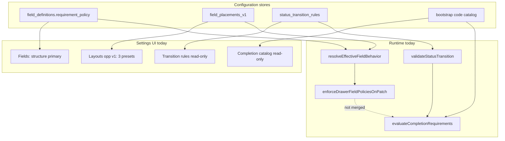

# Requirement + Workflow Configuration Schema Audit

**Path:** `docs/sprints/05_2026/requirement_workflow_configuration_schema_audit.md`  
**Status:** Audit complete — **no code changes**  
**Date:** 2026-05-30  
**Goal:** Before implementing admin-configured requirement rules, inventory where policies can live today (schema + runtime) and recommend the smallest config model that supports layout requirements, conditional requirements, transition blockers, workflow automations, and BOS explanations.

**Related (prior work):**

- `docs/sprints/05_2026/required_fields_completion_guardrails_audit.md` — Sprint B foundation inventory
- `docs/sprints/05_2026/required_fields_completion_guardrails_policy.md` — requirement vocabulary + deferred product rules
- `docs/sprints/05_2026/layout_field_behavior_semantics_v1.md` — opportunity `field_placements_v1` control plane
- `docs/sprints/05_2026/person_layout_completion_reconciliation.md` — Sprint A + B wiring
- `docs/system/configuration-system.md` — four-plane Settings model

---

## Executive summary

Alloy already has **three parallel policy planes** for “what must be true before save/transition/action,” plus a **fourth execution plane** for workflow side effects. They are not unified in Settings or in a single runtime evaluator.

| Plane | Primary store | Operator-editable today? | Runtime enforced? |
|-------|---------------|--------------------------|-------------------|
| **Field / layout requiredness** | `field_definitions.requirement_policy` + `record_drawer_layouts.config_json.field_placements_v1` | Partial — opportunity workflow v1 Layouts only (3 presets) | Yes — opportunity/job PATCH via `enforceDrawerFieldPoliciesOnPatch` |
| **Completion guardrails** | Code bootstrap in `web/lib/completion/` | Read-only catalog in Settings | Yes — person PATCH, opportunity status transition (bootstrap + bridge) |
| **Status transition guardrails** | `status_transition_rules` | Read-only reference UI; rows seeded/migrated | Yes — `validateStatusTransition` in admin actions + some PATCH paths |
| **Workflow automations** | `workflows`, `workflow_actions`, `workflow_conditions` | Automations hub (definitions) | Yes — `executeWorkflowRun` after `emitEvent` |
| **Action surfacing** | `action_definitions`, `action_placements` | Settings → Action buttons (placement V1) | Render-time visibility only; execution via `executeAdminAction` |

**Recommendation:** Do **not** add a new requirement table in the first implementation phase. Extend the **existing JSON policy model** (`FieldRequirementPolicyV1` on definitions + layout placements), keep **`status_transition_rules`** for transition-scoped payload/metadata gates, and make **`evaluateCompletionRequirements`** the single runtime orchestrator that merges effective field policies + transition rules + (eventually) retires bootstrap code. BOS already has a structured consumption path (`RequirementValidationResult`, `toBosCompletionRequirementPayload`).

---

## Schema inventory

### `field_definitions`

| Column | Role for requirements |
|--------|----------------------|
| `is_required` | Legacy boolean; synced from simple policy modes for API compat |
| `requirement_policy` | JSON v1 — canonical shape in `web/lib/fields/fieldRequirementPolicy.ts` |
| `interaction_policy` | Editability (orthogonal to requiredness) |
| `section_key`, `sort_order` | Catalog placement (Class B mutation) — not requirement semantics |
| Visibility flags | Presentation; integrity checks pair with layout requiredness |

**Policy modes (parsed + evaluated in code):**

`required` · `optional` · `required_on_save` · `conditionally_required` · `required_before_status_change` · `required_before_action`

**Conditional predicate (v1):** single `{ field_key, op: eq|neq|empty|not_empty, value? }` on `requirement_policy.condition`.

**DB enforcement:** none — application code only.

**Migration:** `supabase/migrations/20260523120000_field_policy_and_section_v1.sql` (columns + optional backfill from `is_required`).

---

### `field_section_definitions`

| Column | Role |
|--------|------|
| `section_config` | Versioned layout visibility hints (`FieldSectionConfigV1`) |
| `is_archived` | Hide from new placements |

**No requirement semantics** at section level today. Sections group fields for Settings and drawer composition; they do not express “this section must be complete.”

---

### `field_placements_v1` (JSON on `record_drawer_layouts.config_json`)

Not a table. Array keyed by `field_key`:

```json
{
  "field_placements_v1": [
    {
      "field_key": "notes",
      "surfaces": {
        "drawer_overview": {
          "requirement": { "version": 1, "mode": "required_on_save", "validation_scope": "save" },
          "interaction": { "version": 1, "editability_mode": "editable" }
        }
      }
    }
  ]
}
```

| Fact | Detail |
|------|--------|
| **Surface scope (v1)** | `drawer_overview` only (`FIELD_BEHAVIOR_SURFACE_DRAWER_OVERVIEW`) |
| **Entity scope (Settings + runtime)** | Opportunity when `inquiry_drawer_mode === workflow_v1` |
| **Write API** | `PATCH /api/admin/record-drawer-layouts/opportunity-workflow-v1-field-placements` — layout JSON only; **does not** mutate `field_definitions` (G2/G3) |
| **Resolution** | `resolveEffectiveFieldBehavior`: placement → definition → `drawerFieldPolicyAdapter` preset caps |
| **Person layouts** | `person_layout_variants` in `config_json` has section order/visibility keys only — **no** `field_placements_v1` in the typed schema or Settings UI |

Parser: `web/lib/fields/fieldPlacementV1.ts`.

---

### `record_drawer_layouts`

| `config_json` key | Requirement relevance |
|-------------------|----------------------|
| `field_placements_v1` | Per-field requirement + interaction overlay (opportunity v1) |
| `inquiry_drawer_mode` | Gates whether opportunity workflow v1 behavior applies |
| `person_drawer_mode` / `person_layout_variants` | Sprint A runtime composition (child/parent/generic) — **composition only**, not field requiredness |
| Section order / hidden sections | Integrity: `required_on_layout_not_visible` when layout-required field absent from preview |

Org-scoped rows; templates in `record_layouts`. Effective config resolved at drawer open and Settings preview.

---

### `status_transition_rules`

| Column | Role |
|--------|------|
| `entity_type` | e.g. `opportunities`, `jobs`, `schedules` |
| `department_id`, `work_unit_id` | Optional scope (specificity scoring at match time) |
| `action_key` | Optional — rule applies only when transition initiated via that admin action |
| `from_status_key` | Optional filter |
| `to_status_key` | **Required** — target status |
| `required_metadata_fields` | JSON string array — keys must be non-empty on entity metadata |
| `required_payload_fields` | JSON string array — keys must be present in transition PATCH/action payload |
| `blocked` | When true, transition is denied (rule match) |
| `message` | Operator-facing denial copy |
| `is_active` | Soft delete |

**Migration + seed:** `supabase/migrations/20260430231000_status_transition_rules_v1.sql` (enrollment WU → `tour_scheduled` requires `tour_date`, `tour_time` in payload).

**Settings:** `/adminV2/settings/status-transition-rules` — **read-only reference** (GET only; no author UI).

**Runtime:** `web/lib/admin/statusTransitionRules.ts` → `validateStatusTransition`; call sites include `executeAdminAction.ts`, tour booking integration, opportunity status transition (via completion bridge).

---

### `action_definitions`

| Column | Role |
|--------|------|
| `key`, `action_type` | Handler routing in `executeAdminAction` |
| `payload_schema` | Form/modal shape for `open_form`, `start_workflow`, etc. |
| `condition_config` | **Visibility** predicates at resolve time (merged with placement) — not save/transition requiredness |
| `workflow_id` | Links UI action to a workflow definition for `start_workflow` paths |
| `required_permissions` | RBAC gate |

Platform (`org_id` null) + org-scoped rows. Settings may PATCH org-owned **label** only — not handlers or `condition_config`.

---

### `action_placements`

| Column | Role |
|--------|------|
| `surface` | `record_header`, `record_section`, `right_rail`, `queue_row` |
| `slot`, `section_key`, `order_index` | Placement chrome |
| `condition_config` | Per-placement visibility overlay (same limited schema as definitions) |
| `entity_type`, `department_id`, `work_unit_id` | Scope |

**Does not define requirements.** Defines where an approved action button appears. Workflow-generated dynamic buttons (creating placement rows at runtime) **do not exist**.

---

### Workflow tables

| Table | Role |
|-------|------|
| `workflows` | Event subscription (`event_type`, `entity_type`, `enabled`, `org_id`) |
| `workflow_conditions` | Trigger gating: `{ field, operator, value }` per workflow |
| `workflow_actions` | Ordered side effects (`action_type`, `payload`, `target_entity`) |
| `workflow_events` | Canonical event log (`emitEvent`) |
| `workflow_runs`, `workflow_action_runs` | Execution audit |

**Relationship to requirements:** workflows **react** to business facts (status changed, tour booked, message sent). They may **set** status or fields but do not replace field-policy or transition-rule enforcement on admin PATCH paths.

**Relationship to actions:** `action_definitions.workflow_id` + `action_type` such as `start_workflow` / `open_form` with `submit_action_type: start_workflow` connect operator buttons to workflow execution — configured via seeds/migrations and Automations hub, not generated from requirement rules.

---

## Runtime capability review

### Completion guardrails (`web/lib/completion/`)

| Module | Role |
|--------|------|
| `evaluateCompletionRequirements` | Orchestrator by `entity_type` |
| `evaluatePersonCompletionRequirements`, `evaluateOpportunityCompletionRequirements`, `evaluateHouseholdCompletionRequirements` | Bootstrap business rules (code) |
| `enforcePersonCompletionOnPatch` | Server hard/soft block on person PATCH |
| `enforceOpportunityCompletionOnStatusTransition` | Bootstrap + `validateStatusTransitionStructured` merge |
| `validateStatusTransitionStructured` | Bridges `status_transition_rules` → `RequirementValidationResult` |
| `requirementValidationTypes.ts` | Canonical structured output (BOS-ready) |
| `bosIntegration.ts` | Export surface for assist / transition denial |
| `completionBootstrapRulesCatalog.ts` | Read-only Settings catalog |
| `completionGuardrailsCopy.ts` | Operator disclaimer copy |

**Critical gap:** evaluators **do not read** `field_placements_v1` or `field_definitions.requirement_policy` today (except transition bridge). Bootstrap code and DB transition rules are parallel to layout policy enforcement.

### Field policy enforcement (`web/lib/fields/`)

| Module | Role |
|--------|------|
| `fieldRequirementPolicy.ts` | Parse + evaluate all policy modes including conditional |
| `resolveEffectiveFieldBehavior.ts` | Placement → definition → preset |
| `enforceDrawerFieldPoliciesOnPatch.ts` | Opportunity (layout-aware) + job (definition-only) PATCH |
| `drawerFieldPolicyAdapter.ts` | System caps (`never_policy_controlled`, etc.) |

### Person layout runtime

| Module | Role |
|--------|------|
| `personDrawerLayoutRuntime.ts` | Resolves variant from `person_layout_variants` + profile |
| `personDrawerLayoutCompletionBridge.ts` | Maps variant → `layout_variant_key` on completion context |
| `PersonRuntimeV1LayoutPreviewPanel.tsx` | Settings read-only preview |

Person drawer: **Assist preview** shows bootstrap completion; **no** layout-level requiredness from config.

### Settings layout UI

| Surface | Capability |
|---------|------------|
| **Layouts → Opportunity** (workflow v1) | Editable section composition; **Required on this layout** + **Editability here** per field (`LayoutFieldBehaviorControls`) — presets: `optional`, `required`, `required_on_save` only |
| **Layouts → Person** | Read-only runtime variant preview; `layoutCompositionCapabilities` sets `isReadOnly: true` |
| **Layouts → all entities** | `CompletionGuardrailsSettingsPanel` — read-only bootstrap rule catalog |
| **Fields** | Structure + visibility; opportunity/job Required/Editability **de-emphasized** (link to Layouts) |
| **Workflow automation rules** | Read-only `status_transition_rules` table |
| **Actions** | Placement create/edit; not requirement authoring |

Advanced requirement modes in stored JSON (`conditionally_required`, `required_before_status_change`, …) render as **locked** in Layouts UI when detected (`isAdvancedRequirementPolicyForSettings`).

---

## Audit answers

### 1. Where can layout-level requiredness live today?

| Location | Maturity | Notes |
|----------|----------|-------|
| **`record_drawer_layouts.config_json.field_placements_v1`** | **Production (opportunity workflow v1 only)** | Primary operator control plane for drawer overview requiredness. Settings writes via dedicated PATCH; runtime via `resolveEffectiveFieldBehavior` + `enforceDrawerFieldPoliciesOnPatch`. |
| **`field_definitions.requirement_policy`** | **Compatibility default** | Full JSON schema; overridden by placements on opportunity drawer. Job drawer uses definitions only (no placement plane). |
| **`field_definitions.is_required`** | Legacy | Derived from simple modes; not primary for opportunity drawer after Phase 1 semantics sprint. |
| **Forms / `form_definition_versions`** | Separate product surface | `required` on form fields — not drawer layout. |
| **Person `person_layout_variants`** | **Not available** | Section composition only; no per-field requirement overlay in schema or UI. |

**Verdict:** Layout-level requiredness **lives today** in `field_placements_v1` for **one surface** (`drawer_overview`) on **one entity** (opportunity workflow v1). Everywhere else, requiredness is either definition-default, code bootstrap, forms, or absent.

---

### 2. Where can conditional requiredness live today?

| Location | Configurable? | Enforced? | Limitation |
|----------|-------------|-----------|------------|
| **`requirement_policy.mode = conditionally_required`** + `condition` | JSON/manual/seed only — **not** Settings UI | Evaluated in `isFieldRequiredInContext` on opportunity/job PATCH when policy present | Single predicate on one field; no AND/OR groups |
| **`requirement_policy.required_by_role` / `required_by_status`** | JSON only | Evaluated in field policy path | Not exposed in Settings |
| **`action_definitions` / `action_placements` `condition_config`** | Seed/migration only | Button **visibility** (`status_key_equals`, `status_key_not_equals`) | Not field requiredness |
| **`workflow_conditions`** | Automations hub | Workflow **trigger** matching | Not drawer save validation |
| **Completion bootstrap code** | Code only | Person/opportunity cross-field rules (email OR phone, guardians → primary contact, status sets) | Not org-configurable |

**Verdict:** Conditional requiredness **can** live in `field_definitions.requirement_policy` / `field_placements_v1` JSON **today at the schema level**, but operators **cannot author** it, and the completion layer **does not consume** it. Rich conditional rules (multi-field, cross-entity) are **code-only** in `web/lib/completion/`.

---

### 3. Where can transition blockers live today?

| Location | Mechanism | Settings |
|----------|-----------|----------|
| **`status_transition_rules`** | `required_metadata_fields`, `required_payload_fields`, `blocked`, scoped match | Read-only reference |
| **`field_requirement_policy` `required_before_status_change`** + `status_keys` | Field empty check when `phase === status_change` | Not in Layout presets |
| **Completion bootstrap** | Hard blocks before specific `status_to` values (tour, enrollment, person lifecycle) | Read-only catalog |
| **`executeAdminAction` + entity PATCH** | Calls `validateStatusTransition` before applying status change | N/A |
| **`enforceOpportunityCompletionOnStatusTransition`** | Merges bootstrap + structured transition rules | N/A |

**Verdict:** Transition blockers live in **two config stores** (`status_transition_rules` for payload/metadata lists; field policy JSON for per-field gates) plus **code bootstrap**. There is **no single Settings authoring surface** and **no unified evaluator** — though `validateStatusTransitionStructured` begins bridging DB rules into `RequirementValidationResult`.

---

### 4. Where can workflow-generated actions live today?

Clarify “workflow-generated actions” — two meanings:

| Meaning | Where it lives today | Configurable? |
|---------|---------------------|---------------|
| **Operator buttons that start workflows** | `action_definitions` (`workflow_id`, `action_type`) + `action_placements` (where shown) | Placement: Settings V1. Definition/handler: platform seeds + Automations |
| **Side effects inside a workflow run** | `workflow_actions` rows on `workflows` | Automations hub / migrations |
| **Dynamically created buttons from workflow output** | **Does not exist** | N/A |

Workflows **do not** insert `action_placements` or mutate `field_placements_v1`. Event-driven status updates (e.g. tour date set → Tour Scheduled) are **`workflow_actions`**, documented separately from `status_transition_rules` (guardrails vs automation).

**Verdict:** Workflow-linked **operator actions** live in the **action registry + placements** model. Workflow **execution steps** live in **`workflow_actions`**. There is no config path for “workflow emits a new requirement” or “workflow creates a drawer action row” without code/migration.

---

### 5. What is already configurable?

| Capability | Store | Settings entry | Enforcement |
|------------|-------|----------------|-------------|
| Field structure, labels, types, visibility | `field_definitions` | Fields | Presentation + partial PATCH policy (job; opp defs as fallback) |
| Drawer section order / show-hide (opp v1) | `record_drawer_layouts.config_json` | Layouts | Drawer render |
| **Layout requiredness (3 presets) + editability** | `field_placements_v1` | Layouts → Opportunity | Opportunity PATCH + GET `_field_policy_resolved` |
| Catalog section labels / archive | `field_section_definitions` | Field grouping | Layout composition |
| Action button placement | `action_placements` | Actions | `resolveActionsForContext` |
| Action labels (org-owned) | `action_definitions` | Actions | Display |
| Workflow definitions | `workflows` + children | Automations | `executeWorkflowRun` |
| Status display names | `status_definitions` | Statuses | Labels |
| Transition guardrails (view) | `status_transition_rules` | Workflow automation rules (read-only) | `validateStatusTransition` |
| Completion bootstrap (view) | Code catalog mirror | Layouts panel (read-only) | Person/opp PATCH |
| Forms required fields | form schema | Forms hub | `validateFormPayload` |
| Layout integrity diagnostics | derived | Layouts panel | Read-only |

---

### 6. What is code-only?

| Area | Examples |
|------|----------|
| **Completion bootstrap rules** | Identity, household primary, opp tour/enrollment matrix — `web/lib/completion/evaluate*.ts` |
| **Cross-entity requirements** | Inquiry children count, email-or-phone, per-child enrolled fields |
| **Policy preset caps** | `drawerFieldPolicyAdapter` — fields that can never be policy-controlled |
| **Action execution semantics** | `executeAdminAction` handlers, payload validation beyond transition rules |
| **Workflow action implementations** | `workflowRun.ts` action_type handlers |
| **`condition_config` authoring** | Runtime supports limited keys; Settings has no editor |
| **Advanced requirement modes in UI** | `conditionally_required`, `required_before_status_change`, role/status gates — parse/evaluate yes, Settings no |
| **Person layout field behavior** | No PATCH API, no placement overlay |
| **BOS full consumption** | Payload helpers exist; Task Assist does not fully consume `toBosCompletionRequirementPayload` yet |
| **Unified requirement orchestrator** | Field policy PATCH and completion evaluator are separate code paths |
| **DB triggers on required fields** | None |

---

### 7. What new table/metadata is needed, if any?

**Short answer: none for Phase 1 of requirement rules implementation.**

Existing stores are sufficient if product accepts:

- JSON policies on **`field_definitions`** + **`field_placements_v1`** (same `FieldRequirementPolicyV1` shape)
- Transition lists on **`status_transition_rules`**
- Structured runtime output on existing **`RequirementValidationResult`** type (not a table)

| Need | Recommendation |
|------|----------------|
| Layout-level requirements | Extend **`field_placements_v1`** to person variants + additional surfaces — still JSON on `record_drawer_layouts` |
| Conditional requirements | Extend **`FieldRequirementPolicyV1.condition`** (or small `conditions[]` v2) in JSON — avoid new table until predicate complexity exceeds JSON ergonomics |
| Transition blockers | Author **`status_transition_rules`** via Settings PATCH (table exists; UI missing) |
| Audit / bulk query of rules | **Deferred:** normalized `field_placement_policies` or `completion_requirement_rules` table (Phase 2 backlog in `layout_field_behavior_semantics_phase_2.md` P2-5) |
| BOS explanations | **No table** — consume structured evaluation output; optional `rule_key` / `source` fields on violations |

**Do not duplicate** requirement truth in workflow metadata, action payloads, or opportunity JSON metadata.

---

### 8. Smallest config model supporting the full matrix

Target capabilities:

| Capability | Smallest config home | Runtime merge point |
|------------|---------------------|---------------------|
| Layout-level requirements | `field_placements_v1.surfaces.{surface}.requirement` | `resolveEffectiveFieldBehavior` → unified evaluator |
| Conditional requirements | Same JSON: `mode: conditionally_required`, `condition: { field_key, op, value? }` (+ optional `required_by_status`, `required_by_role`) | `fieldRequirementPolicy.isFieldRequiredInContext` + completion orchestrator for cross-field rules |
| Status transition requirements | **A)** `status_transition_rules` for payload/metadata gates **B)** field policy `required_before_status_change` + `status_keys` for per-field emptiness | `evaluateCompletionRequirements` merges field policies + `validateStatusTransitionStructured` |
| Workflow automations | Unchanged: `workflows` / `workflow_actions` / `workflow_conditions` | `emitEvent` → `executeWorkflowRun` |
| BOS explanations | Violation objects: `{ label, requirement_type, blocking_level, missing_reason, context }` | `toBosCompletionRequirementPayload(result)` |

**Minimal unified model (conceptual):**

```
EffectiveRequirementRule =
  source: placement | definition | transition_rule | bootstrap_code
  entity_type, field_key?, scope dimensions…
  policy: FieldRequirementPolicyV1 OR transition_rule slice
  blocking_level: hard_block | soft_warning | recommendation
```

**Storage (no new table):**

1. **`field_placements_v1`** — primary for layout/surface requiredness (extend entity/surface coverage).
2. **`field_definitions.requirement_policy`** — fallback + non-drawer surfaces (job, future).
3. **`status_transition_rules`** — transition-specific payload/metadata/block flags.
4. **`web/lib/completion/`** — orchestrator only; bootstrap retired field-by-field as config wired.

**Settings UX (smallest):**

- Layouts: expand requirement presets OR “Advanced…” panel writing full policy JSON through validated PATCH (same APIs).
- New **Transition requirements** editor (author `status_transition_rules`) — table exists.
- Keep Automations separate — workflows are effects, not requirement storage.

---

## Policy flow (current vs target)



**Target (recommended):** single orchestrator `evaluateCompletionRequirements` (or renamed `evaluateEffectiveRequirements`) loads effective policies from REB + STR, applies blocking levels, feeds PATCH/status paths **and** BOS — `enforceDrawerFieldPoliciesOnPatch` becomes a thin adapter or delegates to the same core.

---

## Recommended implementation path

Audit-only — sequencing for a follow-on **Requirement Rules** sprint.

### Phase 0 — Product + policy (no schema)

1. Approve which bootstrap rules become **hard_block** vs **soft_warning** (see policy doc § Requirement Rules Definition Needed).
2. Decide org-overridability vs platform-invariant rules per vertical.
3. Align forms requiredness vs drawer requiredness for intake fields.

### Phase 1 — Unify runtime (no new table)

1. **Wire completion orchestrator to effective field policies** — on person/opportunity PATCH and status transition, evaluate `resolveEffectiveFieldBehavior` policies (including `required_before_status_change`) in addition to bootstrap slices.
2. **Merge enforcement paths** — opportunity PATCH should not double-violate via separate field-policy and completion checks; one structured result shape.
3. **Map Layout presets → completion types** — `required` → `always_required`, `required_on_save` → `required_on_save`, with blocking level from product defaults.
4. **BOS** — consume `toBosCompletionRequirementPayload` on transition denial and Assist panels; add `source` + `rule_key` on violations when moving from bootstrap to config.

### Phase 2 — Settings authoring (still no new table)

1. **Person layouts** — add `field_placements_v1` (or per-variant overlay) + PATCH API mirroring opportunity; enable Layouts field behavior controls when `person_drawer_mode === runtime_v1`.
2. **Expand Layout requirement UI** — guided editor for `conditionally_required` (field picker + op + value) and `required_before_status_change` (status multi-select) writing validated JSON through existing placement PATCH.
3. **Transition rules editor** — promote `status_transition_rules` from read-only to editable Settings (POST/PATCH admin API + form).
4. **Retire bootstrap** — remove code rules as each is represented in config; keep catalog as provenance until empty.

### Phase 3 — Optional normalization (only if needed)

1. Evaluate **`field_placement_policies`** table if JSON audit/query/Agent apply volume demands it (Phase 2 backlog P2-5).
2. Cross-entity requirement rules (household, inquiry children) may need either **composite rule rows** or remain **platform code** with config toggles — product decision.

### Explicit non-goals (near term)

- Workflow table changes for requirements.
- Encoding requiredness only in `action_definitions.payload_schema`.
- DB CHECK constraints on field non-null (keep server validation).
- Broad new hard blocks without product sign-off.

---

## Gap matrix (summary)

| Question | Today | Gap |
|----------|-------|-----|
| Layout-level requiredness | Opp workflow v1 `field_placements_v1` | Person, job, other surfaces |
| Conditional requiredness | JSON schema + evaluator | No Settings; completion ignores config |
| Transition blockers | `status_transition_rules` + code | No author UI; parallel to field policies |
| Workflow-generated actions | Registry + placements + workflow_actions | No dynamic placement generation |
| BOS explanations | Structured types shipped | Full Assist consumption incomplete |
| Single source of truth | **No** — 3 planes + bootstrap | Need orchestrator merge |

---

## Files inspected (audit scope)

**Schema / migrations**

- `docs/supabase/reference/supabase_schema_columns.csv`
- `supabase/migrations/20260430231000_status_transition_rules_v1.sql`
- `supabase/migrations/20260523120000_field_policy_and_section_v1.sql`

**Policy + layout runtime**

- `web/lib/fields/fieldRequirementPolicy.ts`, `fieldPlacementV1.ts`, `resolveEffectiveFieldBehavior.ts`, `enforceDrawerFieldPoliciesOnPatch.ts`
- `web/lib/recordChrome/types.ts`, `web/lib/admin/person/personDrawerLayoutRuntime.ts`
- `web/lib/admin/statusTransitionRules.ts`
- `web/lib/adminV2/layouts/layoutFieldBehaviorUi.ts`, `layoutCompositionCapabilities.ts`

**Completion**

- `web/lib/completion/*` (evaluators, types, BOS bridge, bootstrap catalog, copy)

**Settings UI**

- `web/components/adminV2/settings/RecordDrawerCompositionWorkspace.tsx`
- `web/components/adminV2/settings/LayoutFieldBehaviorControls.tsx`
- `web/components/adminV2/settings/PersonRuntimeV1LayoutPreviewPanel.tsx`
- `web/components/adminV2/settings/CompletionGuardrailsSettingsPanel.tsx`
- `web/app/adminV2/settings/status-transition-rules/page.tsx`

**Docs**

- `docs/system/configuration-system.md`, `docs/system/actions-and-workflows.md`
- Sprint B + layout semantics docs (listed above)

---

## Acceptance

- [x] Schema and runtime surfaces inventoried
- [x] Eight audit questions answered explicitly
- [x] Smallest config model documented
- [x] Recommended implementation path (phased, no new table Phase 1–2)
- [x] **No application code or migration changes in this deliverable**
