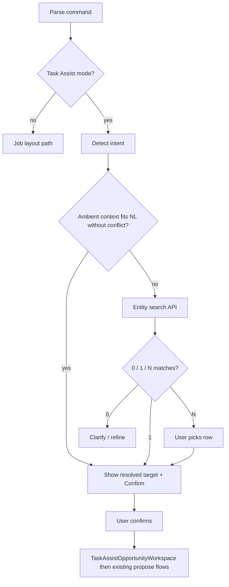

# Sprint: Task Assist V1.1 — Durable proposals, scheduling, reminders

**Path:** `docs/sprints/05_2026/task_assist_v1_1.md`  
**Status:** **Task Assist V1.1 complete** (Cards **0–9**, including **9b** entity search + **9c** intent routing). **Interaction Layer V1** (Cards **1–7** in **`agent_interaction_layer_v1.md`**) superseded Card 9 **UX** — **Orchestrator** command bar with thread + action cards; **backend routes unchanged**. **Agent #2 (Task Assist)** is a **specialist** routed from the Orchestrator — action cards + **`TaskAssistOpportunityWorkspace`**, not the whole command bar. The bar itself is **Orchestrator**, not Task Assist.  
**Prerequisite (shipped):** `docs/sprints/05_2026/task_assist_v1.md` (V1 — ephemeral proposal, send-now, opportunities, SMS/email, **`executeCommunicationsSend`**).  
**Non-goals:** Workflow configuration (Agent #3), bulk/mass send, autonomous agents, legacy **`public.messages`** / **`messages_outbox`**, bypassing **`enqueueCanonicalOutboundMessage`**.

**Sources of truth:** `docs/product/communications.md`, `docs/product/ai-system.md`, `docs/system/actions-and-workflows.md`, `docs/execution/operating-doctrine.md`, `web/lib/communications/executeCommunicationsSend.ts`, `web/lib/communications/canonicalOutboundEnqueue.ts`, `web/lib/communications/communicationScheduledSendsService.ts`, `docs/supabase/reference/*.csv`.

### V1.1 shipped behavior summary (operator-facing)

- **Orchestrator command bar (Card 9 + Interaction Layer V1)** — **`AICommandSurfaceShell`** is the **Orchestrator Agent** surface (always visible). **Single input**, **no mode tabs**; **`routeCommandSurface`** orchestrates Task Assist vs job layout vs Workflow Assist notice. Orchestrator thread shows user turns, search candidates, and target confirm — **Task Assist** action cards mount **`TaskAssistOpportunityWorkspace`** behind **Review & approve**. **`GlobalAssistantProvider`** holds context + session thread. Gated by **`NEXT_PUBLIC_TASK_ASSIST_V1_ENABLED`**.
- **Ambient context (9b)** — Drawer **`TaskAssistOpportunityLauncher`** or open opportunity sets **`currentContext`**. Commands like “send **them** a reminder” resolve to the current opportunity after **Confirm target** (pronoun / deictic heuristics).
- **Explicit search context (9b + slot extract)** — Commands naming a family/opportunity (e.g. “Mitchell family”) call **`GET /api/admin/ai/task-assist/entity-search`** with slot-extracted **`entity_search_text`** (not the full sentence), show **0 / 1 / N** candidates in the thread, and require **Confirm target** before action cards.
- **Deterministic intent routing (9c + unified router)** — **`parseTaskAssistCommandIntent`** + **`commandSurfaceSlotExtract`** (no LLM) infer **draft_message**, **schedule_message**, or **create_reminder** + channel/timing/goal; after target confirm, action card prefills **`TaskAssistOpportunityWorkspace`**. **Ask** / **Enter** never auto-sends or auto-proposes.
- **Workflow Assist notice (Orchestrator routing)** — Workflow/automation NL routes to **Workflow Assist notice** in the thread (specialist not built); Orchestrator does **not** proceed on Task Assist path; no workflow config.
- **Never auto-send / no bulk / no workflow config** — Search and routing resolve **context** only; **propose**, **apply**, schedule create, and task create remain explicit operator actions with existing server gates.
- **Opportunity context, not drawer-owned UI** — Drawer communications tab: **`TaskAssistOpportunityLauncher`** + **`CommunicationsDrawerSection`** (threads) only; Task Assist specialist UI in Orchestrator thread action cards.
- **Distinct from AI log** — bottom bar = **Orchestrator**; **AI log** = apply history.
- **Send now (V1 preserved)** — operator-approved payload → **`POST /api/admin/ai/task-assist/apply`** → **`executeCommunicationsSend`** (canonical **`communication_messages`** enqueue).
- **Save draft** — durable row in **`task_assist_proposals`** via **`POST /api/admin/ai/task-assist/proposals`**; list drafts for the opportunity; **approve** / **reject** on **`draft`** only — **approve does not send** (explicit operator send or schedule step).
- **Schedule send** — from an approved/edited draft: **single recipient**, final body (and email subject when channel is email), **`scheduled_for` in the future** → **`POST /api/admin/communication-scheduled-sends`** creates **`pending`** snapshot rows only. **Delivery** happens when **`POST /api/admin/communication-scheduled-sends/process-due`** runs (cron with **`INTERNAL_CRON_TOKEN`** or admin-scoped run), which claims due rows and calls **`executeCommunicationsSend`**. Operators may **`PATCH`** cancel while **`pending`**.
- **Reminder / operational task** — **`POST /api/admin/operational-tasks`** with **`source: task_assist`**, title + future **`due_at`**; list and **`PATCH`** complete/cancel for **`open`** tasks. **`opportunities.metadata.next_follow_up_at`** is **not** auto-synced from tasks in V1.1 (Card 0 — optional app-layer follow-up later).
- **Proposal generation** — **`POST /api/admin/ai/task-assist/propose`** remains **deterministic** (`buildDeterministicTaskAssistSuggestionV1`); org **`ai_policy`** may allow **`openai`** for permission alignment, but **this route does not call a live LLM** (see route comment). Optional **`persist: true`** on propose inserts a proposal row without send.

### Staging / demo org policy (reproducible)

- **Migration:** `supabase/migrations/20260522180000_staging_demo_org_ai_policy_task_assist_draft.sql` merges **`task_assist_draft`** into **`org_settings.metadata.ai_policy.allowed_features`**, sets **`enabled: true`**, and sets **`provider: stub`** only when provider is absent/blank — for org **`93667019-bd28-49b5-a688-acc9bb1e0a19`** (same staging tenant as other repo seeds). **Skips** if no **`org_settings`** row exists (no INSERT).
- **Env (stub path):** deployments must set **`AI_ENRICHMENT_STUB_ENABLED=true`** for **`POST .../task-assist/propose`** when org policy uses **`provider: stub`**; see **`docs/product/ai-system.md`** (Vercel / runtime env table).

### Permission matrix (Task Assist specialist)

| Action | Org policy | User / portal gate | Route / helper |
|--------|------------|--------------------|----------------|
| Entity search (Orchestrator) | — | **`requireAdminOrOps`** + access scope | `GET .../task-assist/entity-search` |
| Deterministic draft (propose) | `ai_policy.enabled`, `task_assist_draft`, `provider` + env stub/openai | **`resolveAiEnrichmentPortalAccess`** (`ai.enrichment.use` when strict, else portal **admin or ops**) + openai branch needs **`ai.enrichment.use`** when env strict | `POST .../task-assist/propose` |
| Send now (apply) | — | **`requireAdminOrOps`** + **`assertCommunicationsSendAllowed`** (`communications.send` or `ops.messaging.write` or admin/ops role bypass) | `POST .../task-assist/apply` |
| Save / approve / reject proposal | — | **`requireAdminOrOps`** | `POST/GET .../task-assist/proposals`, approve/reject |
| Schedule create / cancel | — | **`requireAdminOrOps`** + **`assertCommunicationsSendAllowed`** (same as send — no separate schedule key today) | `POST .../communication-scheduled-sends`, `PATCH .../[id]` |
| Process due (worker / admin) | — | **`x-cron-token`** **or** **`requireAdminOrOps`** + org filter | `POST .../communication-scheduled-sends/process-due` |
| Operational tasks | — | **`requireAdminOrOps`** only (no separate task permission key yet) | `GET/POST .../operational-tasks`, `PATCH .../[id]` |

Full cross-agent matrix: **`docs/product/ai-system.md`**.

---

## Card 0 — locked decisions (2026-05-21)

Execution constraint: **Cards 2+ must not contradict this section without a new Card 0 amendment.**

| Decision | Locked choice |
|----------|----------------|
| **Primary entity** | **Opportunities only** for V1.1 (same as V1); **`jobs`** / other anchors **deferred**. |
| **Durable proposals table** | **`public.task_assist_proposals`** — **not** a generic **`agent_proposals`** table in V1.1. |
| **Scheduled communications** | **`public.communication_scheduled_sends`** — approved snapshot + worker claim + single enqueue via **`executeCommunicationsSend`** (application/worker code in Card 5). **No** `communication_messages` row at schedule-create time. |
| **Reminders / tasks** | **`public.operational_tasks`** with **`source = 'task_assist'`**. |
| **Canonical send** | All outbound sends remain **`executeCommunicationsSend`** → **`enqueueCanonicalOutboundMessage`**; **no** legacy **`public.messages`** / **`messages_outbox`**. |
| **Worker idempotency** | **`SKIP LOCKED`** / **`claim_token`** + **`claimed_at`** on **`communication_scheduled_sends`**; partial unique index **one pending/claimed row per `proposal_id`** when set. |
| **`next_follow_up_at` sync** | **Deferred to Card 3 (application layer)** — **no** DB trigger writing **`opportunities.metadata`** from **`operational_tasks`** in Card 1 (avoids interaction with **`set_updated_at_opportunities`** and keeps migration narrow). Product may set **`metadata.next_follow_up_at`** when creating/updating follow-up tasks via existing PATCH paths later. |
| **V1 HTTP compatibility** | Keep **`POST /api/admin/ai/task-assist/propose`** and **`POST .../apply`** until Card 2+ adds proposal routes; no breaking removal in Card 1. |

**Card 0 exit checklist**

- [x] **`task_assist_proposals`** (not generic **`agent_proposals`**).
- [x] **`communication_scheduled_sends`** + worker claim fields + idempotency index.
- [x] **`operational_tasks`**; **`next_follow_up_at`** sync **deferred** to app (Card 3).
- [x] V1 **`/propose`** + **`/apply`** kept (no route changes in Card 1).
- [x] No workflow / bulk / legacy / auto-send triggers.

---

## Step 0.5 — Schema / design audit (2026-05-14)

### 0.5.1 Existing patterns (do not ignore)

| Pattern | Implication for V1.1 |
|---------|----------------------|
| **`agent_v0_proposals`**, **`agent_v1_record_layout_proposals`**, **`agent_v2_field_visibility_proposals`** | Per-feature tables with **`proposal_id`**, org scoping, RLS, often **DEFINER RPC** apply + audit rows. **Not** a single polymorphic “all agents” proposal store today. |
| **`communication_messages`** | Canonical outbound lifecycle **`queued` → sent/delivered**; **no** `scheduled_at` / `send_after` column in current foundation migration. **`metadata`** exists but **must not** be the sole scheduling truth without a **worker-safe claim** contract (see §2.2). |
| **`opportunities.metadata`** | **`next_follow_up_at`** already used for attention / queue signals. **Viable for minimal reminders** without a new table — **but** does not give assignee, title, audit trail, or “task completed” semantics. |
| **Task Assist V1 routes** | **`POST .../propose`**, **`POST .../apply`** — apply already enforces **`assertCommunicationsSendAllowed`** + **`executeCommunicationsSend`**. V1.1 must **extend**, not fork, canonical send. |

### 0.5.2 Generic `agent_proposals` vs `task_assist_proposals`

| Option | Pros | Cons |
|--------|------|------|
| **Single `agent_proposals`** (polymorphic JSON + `agent_key` + `proposal_type`) | One RLS story; cross-agent analytics. | No second consumer in V1.1; polymorphic indexes + validation sprawl; does not match existing **`agent_v*_*_proposals`** shape; easy to overbuild. |
| **`task_assist_proposals` (recommended for V1.1)** | Narrow scope; columns match Task Assist payload + lifecycle; clear FK to org/user; can still set **`agent_key = 'task_assist'`** for logs. | Second table if Workflow Assist later wants identical lifecycle — mitigated by **documented merge path** after second consumer exists. |

**Locked recommendation (pending Card 0 sign-off):** **`public.task_assist_proposals`** for V1.1. **Defer** generic **`agent_proposals`** until a **second** agent needs the **same** draft → approve → apply → expire lifecycle with identical columns (revisit in Agent #3 cross-cutting card).

### 0.5.3 Scheduled send — metadata-only vs table

| Approach | Verdict |
|----------|---------|
| **`communication_messages.metadata` only** (“fake scheduling”) | **Reject** for V1.1 product scheduling: row implies message exists; **`queued`** early would confuse threads; **no** worker claim / cancel semantics. |
| **New `communication_scheduled_sends` (recommended)** | Holds **approved snapshot** + **`scheduled_for`** + **`status`**; worker **creates** canonical enqueue **once** at fire time (or Next cron calls **`executeCommunicationsSend`** with snapshot). **Single progression:** pending → (claimed) → queued (stores **`communication_message_id`**) → terminal. |

**Locked recommendation:** **`public.communication_scheduled_sends`** (tenant-scoped name; not `task_assist_scheduled_sends` so other surfaces could reuse **`source`** + **`metadata`** later). **`communication_message_id` nullable** until enqueue succeeds.

### 0.5.4 Tasks / reminders — metadata vs table

| Approach | Verdict |
|----------|---------|
| **`opportunities.metadata.next_follow_up_at` only** | Fast; already indexed in queue paths. **Weak** for “reminder task” product: no assignee, title, completion, cancel audit. |
| **`operational_tasks` (recommended)** | **`public.operational_tasks`** (avoid reserved word **`tasks`** as table name unless repo standard says otherwise): lightweight rows, **`source = 'task_assist'`**, **`due_at`**, status, assignee nullable. Aligns with “human approval before create”. |

**Locked recommendation:** **`public.operational_tasks`** for V1.1 **reminder/follow-up** created from Task Assist (approved path). Optional **sync** of **`due_at`** into **`opportunities.metadata.next_follow_up_at`** for existing attention rules — **Card 0** decides “dual write vs tasks-only” to avoid two sources of truth.

---

## 1. V1.1 scope (narrow operational layer)

### 1.1 In scope

| Capability | Requirement |
|------------|-------------|
| **Save / review AI-generated drafts** | Persist **`TaskAssistSuggestionV1`**-shaped (or strict subset) **`payload`** + **`validation_errors`**, **`warnings`**, status lifecycle. |
| **Human approval** | **No** row transitions to **applied**, **queued** schedule, or **open** operational task without explicit **approve** (or combined **approve+apply** where product allows one step). |
| **Send now** | Reuse **`executeCommunicationsSend`**; proposal row records **`applied_at`**, **`applied_by`**, link to **`communication_message_id`** in **`metadata` or dedicated column**. |
| **Scheduled one-time send** | **`communication_scheduled_sends`** + worker/cron path; **one** enqueue per row (idempotent). |
| **Reminders / follow-up** | **`operational_tasks`** from approved proposal intent; single assignee optional. |
| **Canonical only** | All sends: **`executeCommunicationsSend`** → **`enqueueCanonicalOutboundMessage`**. **No** legacy stack. |

### 1.2 Explicitly out of scope

- Workflow graph configuration, NL → workflow, **`workflows`** mutations (Agent #3).
- Bulk / multi-recipient / BCC lists.
- Autonomous cron that **creates** sends without a persisted **approved** schedule row.
- **`jobs`** / other entities — **defer** to V1.2 unless Card 0 expands (mirror V1 “opportunities first”).

---

## 2. Schema decisions (draft DDL intent — Card 1 materializes)

### 2.1 `task_assist_proposals`

| Column | Type | Notes |
|--------|------|--------|
| `id` | uuid PK | |
| `org_id` | uuid FK → orgs | RLS |
| `actor_user_id` | uuid | Creator |
| `agent_key` | text | **`task_assist`** (constant for future merge) |
| `proposal_type` | text | e.g. **`draft_sms`**, **`draft_email`**, **`schedule_send`**, **`reminder`** — enum/check in migration |
| `entity_type` | text | V1.1: **`opportunities`** only |
| `entity_id` | uuid | |
| `status` | text | **`draft` \| `approved` \| `rejected` \| `expired` \| `applied`** |
| `payload` | jsonb | Frozen **`TaskAssistSuggestionV1`** + optional **`operator_edit`** snapshot at save/approve |
| `validation_errors` | jsonb | Server validation snapshot |
| `warnings` | jsonb | |
| `expires_at` | timestamptz | nullable |
| `approved_at` / `approved_by` | timestamptz / uuid | nullable |
| `rejected_at` / `rejected_by` | timestamptz / uuid | nullable |
| `applied_at` / `applied_by` | timestamptz / uuid | nullable |
| `applied_result` | jsonb | e.g. **`{ "communication_message_id", "operational_task_id", "scheduled_send_id" }`** |
| `created_at` / `updated_at` | timestamptz | |

Indexes: **`(org_id, entity_type, entity_id, status)`**, **`(org_id, expires_at)`** where status draft.

### 2.2 `communication_scheduled_sends`

| Column | Type | Notes |
|--------|------|--------|
| `id` | uuid PK | |
| `org_id` | uuid | |
| `proposal_id` | uuid FK → **task_assist_proposals** nullable | If schedule created from proposal |
| `entity_type` / `entity_id` | text / uuid | opportunities |
| `recipient_person_id` | uuid | single recipient |
| `channel` | text | sms \| email |
| `subject_snapshot` | text | nullable (email) |
| `body_snapshot` | text | **approved** body |
| `binding_id` | uuid | nullable FK to bindings |
| `scheduled_for` | timestamptz | |
| `status` | text | **`pending` \| `claimed` \| `queued` \| `sent` \| `canceled` \| `failed`** |
| `approved_at` / `approved_by` | timestamptz / uuid | Required before worker fires |
| `communication_message_id` | uuid nullable | Set when **`executeCommunicationsSend`** succeeds |
| `source` | text | **`task_assist`** |
| `metadata` | jsonb | idempotency keys, error messages |
| `claimed_at` / `claim_token` | timestamptz / text | Worker single-flight |
| `created_at` / `updated_at` | timestamptz | |

**Invariant:** No insert into **`communication_messages`** until transition to **fire** (or use **`queued`** only after successful enqueue — **Card 0** picks exact state machine).

### 2.3 `operational_tasks`

| Column | Type | Notes |
|--------|------|--------|
| `id` | uuid PK | |
| `org_id` | uuid | |
| `entity_type` / `entity_id` | text / uuid | |
| `assigned_to_user_id` | uuid nullable | |
| `created_by` | uuid | |
| `title` | text | |
| `description` | text | nullable |
| `due_at` | timestamptz | |
| `status` | text | **`open` \| `completed` \| `canceled`** |
| `source` | text | **`task_assist`** |
| `proposal_id` | uuid nullable FK | |
| `metadata` | jsonb | |
| `created_at` / `updated_at` | timestamptz | |

---

## 3. Migrations needed (summary)

| Migration | Purpose |
|-----------|---------|
| **M1–M4** | **M1–M3** delivered as **`supabase/migrations/20260521103000_task_assist_v1_1_foundation.sql`**: **`task_assist_proposals`**, **`communication_scheduled_sends`**, **`operational_tasks`**, RLS, indexes, org-integrity triggers, **`set_updated_at`** on all three. **M4:** **`supabase/migrations/20260522140000_claim_due_communication_scheduled_sends.sql`** — RPC **`claim_due_communication_scheduled_sends`** (`FOR UPDATE SKIP LOCKED`), **`REVOKE ALL … FROM PUBLIC`**, **`GRANT EXECUTE … TO service_role`** only. |
| **M4 (optional)** | **Not in Card 1** — **`next_follow_up_at`** sync is **Card 3** application-layer only (Card 0). |

Reference CSVs after migrations: regenerate or hand-update **`docs/supabase/reference/*.csv`** per repo practice.

---

## 4. Route contracts (admin, org-scoped)

**Card 7 shipping checklist:** consolidated method/path list in **§12** (same routes as below).

**Proposal + task routes** use **`getAdminContextCached`** + **`requireAdminOrOps`**. **`POST /api/admin/ai/task-assist/propose`** still uses the V1 portal/policy gate (**`getAdminAccessContextCached`**) unchanged for generation.

| Method | Path | Purpose |
|--------|------|---------|
| **POST** | **`/api/admin/ai/task-assist/proposals`** | Create durable proposal (validated payload). |
| **GET** | **`/api/admin/ai/task-assist/proposals`** | List by **`entity_type`**, **`entity_id`**. |
| **POST** | **`/api/admin/ai/task-assist/proposals/[id]/approve`** | **draft → approved** (no send). |
| **POST** | **`/api/admin/ai/task-assist/proposals/[id]/reject`** | **draft → rejected**. |
| **GET** | **`/api/admin/operational-tasks`** | List **`operational_tasks`** for an opportunity. |
| **POST** | **`/api/admin/operational-tasks`** | Create task (**`source: task_assist`**). |
| **PATCH** | **`/api/admin/operational-tasks/[id]`** | **`status`: `completed` \| `canceled`** (open only). |
| **GET** | **`/api/admin/communication-scheduled-sends`** | List scheduled sends for an opportunity. |
| **POST** | **`/api/admin/communication-scheduled-sends`** | Create **pending** row (approved snapshot; **no send**). |
| **PATCH** | **`/api/admin/communication-scheduled-sends/[id]`** | **`{ "status": "canceled" }`** — **pending → canceled** only. |
| **POST** | **`/api/admin/communication-scheduled-sends/process-due`** | Worker/cron: claim due rows, **`executeCommunicationsSend`**, finalize **queued** / **failed**. |
| **POST** | **`/api/admin/ai/task-assist/propose`** (V1) | Optional **`persist: true`** to insert **`task_assist_proposals`** when valid. |
| **POST** | **`/api/admin/ai/task-assist/apply`** (V1) | Send-now apply (**unchanged**). |

**`POST …/communication-scheduled-sends/process-due` — auth**

- **`x-cron-token`** header must **exactly** match env **`INTERNAL_CRON_TOKEN`** (timing-safe compare; env must be non-empty) → processor may claim rows **across all orgs** (`p_org_id` null on RPC).
- Otherwise: **`requireAdminOrOps`** + **`getAdminContextCached`** → claim is **scoped to that org** only.

**Deprecation note:** **Card 0 locked:** keep **`POST .../propose`** and **`POST .../apply`**; durable proposal HTTP lives alongside (no removal in Card 1).

---

## 5. UI — **Card 6 (logic shipped) + Card 8 (global shell placement)**

**Card 9 (current UI):** Full UI in **`TaskAssistOpportunityWorkspace`** (`web/components/admin/taskAssist/TaskAssistOpportunityWorkspace.tsx`), mounted from **`AICommandSurfaceShell`** when **`commandSurfaceMode === 'task_assist'`**, with client helpers **`web/lib/agent/taskAssist/taskAssistV11OpportunityApi.ts`**. Drawer: **`TaskAssistOpportunityLauncher`** only (sets context + focuses command bar). **Card 8** slide-over shell removed.

**Capabilities (unchanged from Card 6):**

1. **Save draft for review** — **`POST /api/admin/ai/task-assist/proposals`** after a valid on-screen draft exists.
2. **List saved proposals** — **`GET`** same route with **`entity_type=opportunities`** + **`entity_id`**; **approve** / **reject** for **`draft`** via **`POST …/[id]/approve`** / **`reject`** (no send on approve).
3. **Send now** — unchanged **`POST /api/admin/ai/task-assist/apply`** when the operator sends the current draft.
4. **Schedule send** — form gated on recipient + final body + future **`scheduled_for`**; **`POST /api/admin/communication-scheduled-sends`**; list + cancel **`pending`** via **`PATCH`**; UI copy states the **worker sends later**.
5. **Reminder / task** — title + future **`due_at`**; **`POST /api/admin/operational-tasks`**; list + complete/cancel **`open`** via **`PATCH`**.

**Gates:** **`NEXT_PUBLIC_TASK_ASSIST_V1_ENABLED`**; no workflow UI or vocabulary.

---

## 6. Worker model — scheduled sends

**Goal:** Pending approved rows become **exactly one** canonical outbound enqueue via **`executeCommunicationsSend`** (no legacy **`messages`** / **`messages_outbox`**).

| Step | Behavior (implemented) |
|------|--------------------------|
| **Claim** | Postgres RPC **`claim_due_communication_scheduled_sends`** (`supabase/migrations/20260522140000_claim_due_communication_scheduled_sends.sql`): rows **`pending`**, **`scheduled_for <= p_now`**, **`communication_message_id IS NULL`**, optional org filter; **`FOR UPDATE SKIP LOCKED`**; sets **`claimed`**, **`claim_token`**, **`claimed_at`**. **`GRANT EXECUTE`** → **`service_role`** only. |
| **Send** | **`executeCommunicationsSend`** using **`body_snapshot`**, **`subject_snapshot`**, **`recipient_person_id`**, optional binding id; metadata includes **`communication_scheduled_send_id`**. |
| **Success** | **`status = queued`**, **`communication_message_id`** set; update requires **`communication_message_id IS NULL`** to avoid double-attaching. |
| **Failure** | **`status = failed`**, **`metadata.last_process_error`**. |
| **Cancel** | Operator **`PATCH`** sets **`canceled`** from **`pending`** only; worker only claims **`pending`**. |

### Idempotency caveat (known)

If **`executeCommunicationsSend`** succeeds but the final **`queued`** update fails or races, a **second** enqueue is **theoretically** possible on a later retry. Guards (**`claim_token`**, **`communication_message_id IS NULL`** on success update) reduce risk but **do not mathematically eliminate** all interleavings.

### Stuck **`claimed`** rows (known gap)

If the worker **crashes after claim** and **before** enqueue, or the success-path DB update is lost, rows can remain **`claimed`** with **`communication_message_id` null**. **`processDueCommunicationScheduledSends`** does **not** pick **`claimed`** rows.

**Current V1.1 operational handling**

1. **Detect** rows **`status = claimed`**, **`communication_message_id IS NULL`**, **`claimed_at`** older than an agreed quiet window (e.g. **≥ 30 minutes**).  
2. **Recover** using **`releaseStaleClaimedCommunicationScheduledSends`** in **`web/lib/communications/communicationScheduledSendsService.ts`** (separate cron step or one-off ops script). It returns rows to **`pending`** only when **`claimed_at < olderThan`** and **`now − olderThan`** meets **`STALE_CLAIM_RELEASE_MINIMUM_AGE_MS`**. It is **not** called from **`process-due`** automatically.  
3. **Re-run** **`POST /api/admin/communication-scheduled-sends/process-due`** so the SKIP LOCKED claim can pick them up again.

**Follow-up (optional)**  

- DB-native reclaim RPC, terminal **`failed`** for “abandoned claim”, or correlation with **`communication_messages`** metadata — add if stale **`claimed`** volume or compliance needs stronger guarantees than the app-layer minimum-age gate.

**Deployment:** **`POST …/process-due`** with **`x-cron-token: INTERNAL_CRON_TOKEN`** for multi-tenant runs; align with **`INTERNAL_MESSAGES_PROCESS_URL`** / **`triggerBackendMessagesQueue`** patterns in **`docs/product/communications.md`**.

---

## 7. Safety rules (enforced in code + DB checks)

1. **No auto-send** — `communication_scheduled_sends` worker only processes **`approved_at` not null** and **`status = pending`** (or explicit **`approved`** sub-state if split).
2. **Scheduled send requires approval** — same as above.
3. **Reminders require approval** — **`operational_tasks`** created only from **`apply`** on **approved** proposal or dedicated approved mutation.
4. **Canceled** schedules never enqueue.
5. **Single recipient** — enforce in validators + DB CHECK or app.
6. **No workflow keys** on any JSON body — reuse V1 **`validateTaskAssistV1ParsedJsonNoForbiddenWorkflowKeys`** family.
7. **No legacy stack** — only **`executeCommunicationsSend`** for outbound.
8. **Snapshot at approve** — copy **`body_snapshot`**, **`subject_snapshot`**, **`recipient_person_id`** at **approve** time; apply uses snapshots, not client-trusted live fields.

---

## 8. Implementation cards (Cursor order)

| Card | Name | Exit criteria |
|------|------|----------------|
| **0** | **Schema / route / worker lock** | **Done** — see §Card 0 above. |
| **1** | **Supabase migrations + RLS** | **Done** — `20260521103000_task_assist_v1_1_foundation.sql`, **`20260522140000_claim_due_communication_scheduled_sends.sql`**, reference CSVs (incl. **`supabase_functions.csv`** for claim RPC). |
| **2** | **Proposal persistence + HTTP** | **Done** — POST/GET proposals, approve/reject; tests + validators. |
| **3** | **Operational tasks** | **Done** — POST/GET/PATCH **`/api/admin/operational-tasks`**; **`proposal_id`** validation. |
| **4** | **Scheduled send HTTP** | **Done** — GET/POST **`/api/admin/communication-scheduled-sends`**, PATCH cancel **`pending`** only; **no send** on create. |
| **5** | **Scheduled send worker** | **Done** — RPC claim + **`processDueCommunicationScheduledSends`** + **`POST …/process-due`**; tests; **Card 5 hardening** adds **`releaseStaleClaimedCommunicationScheduledSends`** + sprint §6 recovery notes. |
| **6** | **UI extension** | **Done (drawer-embedded)** — Full panel in **`AdminEntityDrawer`**; superseded by **Card 8** placement. Logic + tests remain valid; **mount point moves**. |
| **7** | **Docs + references** | **Done** — This sprint doc completion checklist, **`docs/product/ai-system.md`**, **`docs/product/communications.md`**, **`docs/product/crm-system.md`** pointer, **`task_assist_v1.md`** V1.1 forward pointer; Supabase reference CSVs verified for V1.1 tables + claim RPC. |
| **8** | **Global assistant shell pivot** | **Superseded (UI)** by **Card 9** — shipped **`GlobalAssistantShell`** then removed; context provider retained. See §Card 8 (historical) + §Card 9. |
| **9** | **Command bar assistant pivot** | **Done** — Task Assist home = **`AICommandSurfaceShell`**; **`focusCommandBar`** event; drawer launcher; no right rail. **No backend changes** in the pivot. See §Card 9 (§9.1–9.7). |
| **9a** | **Command bar — ambient + confirm** | **Done (merged into 9b/9c)** — Ambient pronoun path + mandatory **Confirm target** before workspace; drawer launcher sets context. See §9.8–9.11. |
| **9b** | **Command bar — entity search API** | **Done** — **`GET /api/admin/ai/task-assist/entity-search`**; opportunities by **`name`/`title`**; optional **customer→opportunity** when dept/site scope is **all**; **`requireAdminOrOps`** + access scope. **Persons** deferred. See §9.12. |
| **9c** | **Command bar — intent routing** | **Done** — **`parseTaskAssistCommandIntent`** + workspace bootstrap; workflow phrase block; 0/1/N candidate UX; no LLM. See §9.9–9.11, §9.13. |

---

## 9. Risks

| Risk | Mitigation |
|------|------------|
| **Two truths** (proposal `payload` vs snapshot) | Approve locks **snapshot** columns on schedule/task rows; apply reads snapshots only. |
| **Worker / Next drift** | Single module **`executeCommunicationsSend`**; worker calls same code path as routes (shared package or internal API with service auth). |
| **RLS mistakes** | Follow **`agent_v1_record_layout_proposals`** policy style; service_role for worker with explicit org filter in query. |
| **Scope creep** | Card 0 freezes **`opportunities`** only for V1.1 unless explicit amendment. |
| **Dual `next_follow_up_at`** | Card 0 chooses tasks-only vs metadata sync. |
| **Stuck `claimed` scheduled sends** | Ops runbook: §6 **Stuck `claimed` rows** + **`releaseStaleClaimedCommunicationScheduledSends`**; optional future DB reclaim RPC. |

---

## 10. Environment, policy, and cron (V1.1)

| Gate | Purpose |
|------|---------|
| **`NEXT_PUBLIC_TASK_ASSIST_V1_ENABLED`** | Client + **`isTaskAssistV1UiEnabled()`** — Task Assist mode tabs + tray + drawer launcher + header focus control. |
| **`metadata.ai_policy`** on **`org_settings`** | **`enabled`**, **`provider`** (`stub` \| `openai`), **`allowed_features`** must include **`task_assist_draft`** for **`POST /api/admin/ai/task-assist/propose`** (and the same portal / permission pattern as AI enrichment where applicable). |
| **`AI_ENRICHMENT_STUB_ENABLED`** | Required **`true`** when org policy uses **`provider: stub`** for routes that use the stub guard (including Task Assist **propose** on the stub branch). |
| **`AI_ENRICHMENT_USE_PERMISSION_REQUIRED`** + **`ai.enrichment.use`** | When strict enrichment permission mode is on, Task Assist **propose** follows the same **`computeOpenAiLiveInvocationPermitted`** / portal checks as enrichment (see **`docs/product/ai-system.md`**). |
| **`OPENAI_API_KEY`**, **`OPENAI_MODEL`** (optional **`OPENAI_BASE_URL`**) | Needed for orgs with **`provider: openai`** on **other** gated live routes; **propose** still does **not** invoke OpenAI (deterministic body only). |
| **`INTERNAL_CRON_TOKEN`** | Must match **`x-cron-token`** on **`POST /api/admin/communication-scheduled-sends/process-due`** for **cross-org** scheduled-send processing; without it, callers need admin session and runs are **org-scoped**. |

---

## 11. V1.1 limitations (explicit)

| Limitation | Notes |
|------------|--------|
| **Opportunities only** | **`entity_type`** enforced to **`opportunities`** in migrations, validators, and UI. |
| **Single recipient** | One **`recipient_person_id`** per send / schedule row; no bulk or BCC lists. |
| **No bulk** | No multi-select or campaign semantics. |
| **No workflow config** | No **`workflows`** / NL→workflow / Agent #3 surfaces in Task Assist. Command bar **blocks** workflow-like NL with a clear message (9c). |
| **Command bar heuristics only (9c)** | Intent + entity binding use **deterministic** rules — not an LLM. Misclassification possible; operator confirms target and uses workspace controls. |
| **Persons search deferred (9b)** | **`entity-search`** returns **opportunities** (direct + optional customer→opp). **Persons** not queried in V1.1 command bar. |
| **Timing hints approximate (9c)** | Parsed “tomorrow”, “at 9”, etc. prefill **`datetime-local`** best-effort; operator must verify before schedule/reminder submit. |
| **Scheduled sends require worker/cron** | **`pending`** rows do not enqueue **`communication_messages`** until **`process-due`** claims and runs **`executeCommunicationsSend`**. Align deployment with **`INTERNAL_CRON_TOKEN`** (see **`docs/product/communications.md`**). |
| **No live LLM on Task Assist propose** | **`POST …/propose`** builds proposals **deterministically**; **`openai`** in policy does **not** enable model sampling on that route today. |
| **Stuck `claimed` rows** | Recovery is **manual / secondary cron** via **`releaseStaleClaimedCommunicationScheduledSends`** (see §6) — not automatic inside **`process-due`**. |

---

## 12. Routes shipped (admin HTTP checklist)

All under **`web/app/api/admin/`** unless noted. Auth follows each route’s **`getAdminContextCached`** / **`requireAdminOrOps`** / cron-token branch as implemented.

| Method | Path |
|--------|------|
| **POST** | **`/api/admin/ai/task-assist/propose`** (V1; optional **`persist: true`**) |
| **POST** | **`/api/admin/ai/task-assist/apply`** (V1 send-now) |
| **POST** | **`/api/admin/ai/task-assist/proposals`** |
| **GET** | **`/api/admin/ai/task-assist/proposals`** |
| **POST** | **`/api/admin/ai/task-assist/proposals/[id]/approve`** |
| **POST** | **`/api/admin/ai/task-assist/proposals/[id]/reject`** |
| **GET** | **`/api/admin/operational-tasks`** |
| **POST** | **`/api/admin/operational-tasks`** |
| **PATCH** | **`/api/admin/operational-tasks/[id]`** |
| **GET** | **`/api/admin/communication-scheduled-sends`** |
| **POST** | **`/api/admin/communication-scheduled-sends`** |
| **PATCH** | **`/api/admin/communication-scheduled-sends/[id]`** |
| **POST** | **`/api/admin/communication-scheduled-sends/process-due`** |
| **GET** | **`/api/admin/ai/task-assist/entity-search`** (Card **9b** — read-only; **`q`**, optional **`entity_type`**, **`limit`**) |

---

## 13. Manual QA checklist (staging / pilot)

Use after migrations **`20260521103000_task_assist_v1_1_foundation.sql`** and **`20260522140000_claim_due_communication_scheduled_sends.sql`** are applied.

**A. Flags and policy**

- [ ] **`NEXT_PUBLIC_TASK_ASSIST_V1_ENABLED`** is **`true`** / **`1`** on the web deployment under test.
- [ ] Pilot org **`org_settings.metadata.ai_policy`** includes **`task_assist_draft`** in **`allowed_features`**, with **`provider: stub`** or **`openai`** as intended.
- [ ] If **`provider: stub`**, **`AI_ENRICHMENT_STUB_ENABLED=true`** in server env.
- [ ] If using strict enrichment RBAC, confirm portal user can pass **`resolveAiEnrichmentPortalAccess`** for **propose** (same pattern as **`docs/product/ai-system.md`** staging checklist).

**B. Command bar + header (Card 9)**

- [ ] With flag on, **Assistant** appears in **`TopNavBar`** (distinct from **AI log**).
- [ ] Click **Assistant** scrolls the bottom **`AICommandSurfaceShell`** into view and focuses the input; with opportunity context, bar is in **Task Assist** mode (or switches via **`preferMode`**).
- [ ] **Job layout** tab still runs overview layout preview/apply when selected; **Task Assist** tab shows the tray + workspace when context **`entity_id`** is set.
- [ ] **Escape** from an expanded job layout panel still collapses it; **Escape** in Task Assist mode returns to **Job layout** tab (does not clear context).
- [ ] Navigate workspace → settings; header **Assistant** + launcher still set/focus context as expected.

**C. Opportunity drawer launcher**

- [ ] Open opportunity **communications** tab; **full Task Assist workspace is not embedded** in the drawer.
- [ ] **Use assistant for this opportunity** launcher appears when flag on; focuses command bar, sets **Task Assist** mode, loads workspace for correct **`entity_id`** / label.
- [ ] **`CommunicationsDrawerSection`** (threads) still works unchanged beside the launcher.

**D. Draft and send-now (Task Assist tray)**

- [ ] **Draft with Task Assist** returns a valid SMS or email draft; operator can edit body (and subject for email) and select **one** eligible recipient.
- [ ] **Send approved draft** enqueues via canonical path (thread + **`communication_messages`** **`queued`**); no legacy **`messages`** from Task Assist.

**E. Durable proposal (V1.1)**

- [ ] **Save draft for review** creates a row; **Saved proposals** lists it with status **`draft`**.
- [ ] **Approve** moves status to **`approved`** and **does not** send or enqueue by itself.
- [ ] **Reject** moves status to **`rejected`**.
- [ ] Approve/reject controls are absent or inactive for non-draft rows as implemented.

**F. Scheduled send**

- [ ] Schedule UI stays disabled without recipient, body, and a **future** **`scheduled_for`**.
- [ ] **Create scheduled send** inserts **`pending`**; list shows the row; copy indicates **worker/cron sends later**.
- [ ] **`POST …/communication-scheduled-sends/process-due`** with valid **`x-cron-token: INTERNAL_CRON_TOKEN`** processes due rows (or org-scoped admin path in dev).
- [ ] **Cancel** works only for **`pending`**; canceled rows are not claimed by the worker.

**G. Operational tasks**

- [ ] Create task requires **title** and **future** **`due_at`**; appears in the task list with **`open`** status.
- [ ] **Complete** / **Cancel** work from **`open`** via **`PATCH`** as implemented.

**H. Safety copy**

- [ ] UI does not introduce **workflow** vocabulary for these controls.
- [ ] No hidden recipients — selected person matches visible radios.
- [ ] Task Assist copy distinguishes itself from **layout assistant** (bottom bar) and **AI log**.

**I. Command bar — search, intent, confirm (Cards 9b + 9c)**

- [ ] With **no** drawer context, **`text Smith family about missing forms`** → **Find target** / **Enter** runs search, shows candidate(s), **Confirm target** required before workspace; instruction prefilled with “missing forms”; SMS channel hint.
- [ ] **`email Smith family tomorrow about tour next steps`** → schedule intent after confirm; email channel; schedule panel opens with approximate tomorrow time (operator verifies).
- [ ] **`remind me to follow up with Smith tomorrow`** → reminder intent after confirm; reminder title/due prefilled (operator verifies).
- [ ] **`when forms complete move them to ready to enroll`** → blocked: **“That sounds like Workflow Assist, not Task Assist”** — no search, no workspace mount from Enter alone.
- [ ] **Exactly one** search match still shows **Confirm target**; **`Draft with Task Assist`** does not run until operator clicks it in workspace.
- [ ] **Multiple** matches require row pick + confirm.
- [ ] **Zero** matches show clarify copy (no silent fallback).
- [ ] **Ambient** “text **them** about …” with drawer opportunity open → ambient confirm; confirm before workspace.
- [ ] Search results respect org + permissions (restricted operators: opportunity-scoped only; no customer bridge when dept/site restricted).

**J. Regression**

- [ ] **`cd web && npx tsc --noEmit`**
- [ ] **`cd web && npm run test -- tests/agent/taskAssist/`**

---

## Card 8 — Global Assistant Shell Pivot (2026-05-15) — **superseded by Card 9 (UI placement)**

**Note:** Card 8 shipped a **right slide-over** **`GlobalAssistantShell`**. **Card 9** removes that shell and moves Task Assist into **`AICommandSurfaceShell`**. The audit and component list below remain **historical context**; do not re-mount **`GlobalAssistantShell`** without a new product decision.

**Problem (resolved in Card 8, placement revised in Card 9):** Task Assist V1.1 UI was initially mounted **inside** **`AdminEntityDrawer`**. Product direction: the assistant is **global** — it travels with the operator across AdminV2 routes; the drawer **supplies context** or **launches** the assistant but does not host the full proposal/review/schedule/task surface.

**Shipped constraints:** **No backend changes** (routes, validators, worker, migrations unchanged). **No** autonomous send, workflow config, or bulk. **`NEXT_PUBLIC_TASK_ASSIST_V1_ENABLED`** remains the UI gate. **Opportunities-only** scope unchanged. **AdminV2 only** — legacy **`/admin`** layout has no global provider (launcher no-ops without provider).

### 8.1 Audit findings — AdminV2 shell (files inspected)

| Area | File(s) | Finding |
|------|---------|---------|
| **Root layout** | `web/app/adminV2/layout.tsx` | Wraps all AdminV2 pages in **`AdminV2Shell`**. |
| **App shell** | `web/app/adminV2/components/AdminV2Shell.tsx` | Single client shell for workspace, settings, forms, workflows, ai-activity, and legacy canvas. Mounts **`Sidebar`**, **`TopNavBar`**, content column, and **bottom** **`AICommandSurfaceShell`** (+ **`RecentAiActionsStrip`**) at **`z-20`**, with **`pb-[96px]`** content reserve. **Best single mount point for a global assistant provider + panel.** |
| **Header** | `web/app/adminV2/components/TopNavBar.tsx` | Primary chrome: search placeholder, Overview / Queue / **Messages** / **AI log**, sign-out. **No Task Assist control today.** Natural home for **“Assistant”** header trigger (parallel to Messages modal pattern). |
| **Bottom AI bar** | `web/app/adminV2/components/aiCommandSurface/AICommandSurfaceShell.tsx` | **Different product:** job **overview layout** semantic preview/apply (`runOverviewLayoutSemanticPreview`, job overview config). **Not Task Assist.** **Do not embed Task Assist here** — would duplicate AI surfaces and confuse operators. |
| **Legacy bottom bar** | `web/app/adminV2/components/AICommandBar.tsx` | Fallback when command surface disabled; same placement. |
| **Workspace providers** | `web/app/adminV2/workspace/AdminV2WorkspaceClientProviders.tsx` | Auth, labels, timezone, **`AdminDrawerProvider`**, scroll surface, **`AdminEntityDrawer`**. Drawer is **workspace-only** — settings/forms **do not** mount the drawer today. |
| **Settings providers** | `web/app/adminV2/settings/AdminV2SettingsClientProviders.tsx` | Auth + labels only — **no drawer**. Global assistant must live **above** this subtree. |
| **Drawer context** | `web/contexts/AdminDrawerContext.tsx` | Stack, entity type/id, opportunity workspace hints — usable for **launcher** to read active opportunity, not for hosting full Task Assist UI. |
| **Legacy admin** | `web/components/admin/AdminLayout.tsx` | Also mounts **`AdminEntityDrawer`**. Card 8 **phase 1 targets AdminV2**; legacy `/admin` parity is a **follow-up** (shared provider extracted to a thin wrapper both layouts import). |
| **Task Assist UI (shipped)** | `web/components/admin/taskAssist/TaskAssistOpportunityWorkspace.tsx` | Full propose / send-now / V1.1 save / approve / schedule / tasks UI + exported **`compute*Disabled`** helpers. **`TaskAssistV1OpportunityPanel.tsx`** is a thin compat re-export. |
| **Task Assist API client** | `web/lib/agent/taskAssist/taskAssistV11OpportunityApi.ts` | Fetch wrappers — **keep as-is**. |
| **Drawer integration (shipped)** | `web/components/admin/AdminEntityDrawer.tsx` | **`TaskAssistOpportunityLauncher`** on communications tab only; **`CommunicationsDrawerSection`** unchanged. No full workspace in drawer. |
| **Feature gate** | `web/lib/agent/taskAssist/taskAssistV1UiGate.ts` | **`NEXT_PUBLIC_TASK_ASSIST_V1_ENABLED`** — reuse for global shell visibility. |
| **Inspector / canvas** | `web/app/adminV2/components/InspectorPanel.tsx` | Mock command-center rail on **non-workspace canvas** route — **not** a production Task Assist host. |

### 8.2 Recommended global mount point

**Primary (locked for Card 8 implementation):**

1. **`GlobalAssistantProvider`** — wrap **`AdminV2Shell`** inner tree once (all route branches), sibling to or above route-specific children so context survives **workspace ↔ settings ↔ forms** navigation.
2. **`GlobalAssistantShell`** — **right-side slide-over panel** (fixed, **`z-index` above drawer**, e.g. `z-[60]`+), mounted **once** in **`AdminV2Shell`**, gated by **`isTaskAssistV1UiEnabled()`** (same flag).
3. **Header trigger** — **`TopNavBar`** button **“Assistant”** (or icon + label) calls **`openAssistant()`** / toggles panel; shows badge when context is set.
4. **Contextual launcher** — thin **`TaskAssistOpportunityLauncher`** in drawer (replaces full panel) calls **`openAssistantWithContext({ entity_type, entity_id, label, … })`**.

**Explicitly not the mount point:**

- **`AICommandSurfaceShell`** — job layout agent; keep separate until a future unified “AI modes” product spec exists.
- **Inside `AdminEntityDrawer`** — remove full panel; launcher only.
- **`InspectorPanel`** — mock / canvas-only.

**Layout interaction:** Bottom **`AICommandSurfaceShell`** stays unchanged. Global assistant uses **vertical right rail** (or full-height sheet) so it does not fight **`pb-[96px]`** bottom reserve.

### 8.3 Target architecture

```
AdminV2Layout
└── AdminV2Shell
    ├── GlobalAssistantProvider          ← NEW (context store)
    │   ├── Sidebar + TopNavBar        ← header “Assistant” trigger
    │   ├── {children}                 ← workspace / settings / …
    │   ├── GlobalAssistantShell       ← NEW (single panel host)
    │   └── AICommandSurfaceShell      ← unchanged (job overview)
    └── …

AdminV2WorkspaceClientProviders
└── AdminEntityDrawer
    └── TaskAssistOpportunityLauncher    ← NEW (replaces full panel)
```

**Context model (`GlobalAssistantContextV1`):**

| Field | Type | Notes |
|-------|------|--------|
| **`entity_type`** | `"opportunities"` (V1.1) | Extensible later; validators still opportunities-only. |
| **`entity_id`** | `string` | Required when Task Assist mode active. |
| **`label`** | `string` | Human label for panel header (“Inquiry #1234 · Smith”). |
| **`source_surface`** | `"opportunity_drawer" \| "header" \| "queue" \| …` | Passed through to propose payload / telemetry. |
| **`available_actions`** | optional enum list | e.g. `draft_sms`, `draft_email`, `schedule`, `reminder` — UI hints only; server re-validates. |

**Provider API (sketch):**

- **`context: GlobalAssistantEntityContext | null`**
- **`isOpen: boolean`**
- **`openAssistant()`** — open with last context or empty state (“select an opportunity”).
- **`openAssistantWithContext(ctx)`** — set context + open.
- **`setAssistantContext(ctx)`** — update without toggling open (drawer open sync optional).
- **`closeAssistant()`**

**Behavior rules:**

- Drawer opening an opportunity **may** call **`setAssistantContext`** (optional, **do not auto-open** by default).
- Launcher **always** **`openAssistantWithContext`**.
- Panel **closes** on Escape; **does not** clear context unless drawer closes and product chooses stale-context policy (recommend: **keep context** until operator clears or switches entity).
- **`active`** for list fetches: panel **`isOpen && context.entity_id`** (replaces drawer tab **`active`** prop).

### 8.4 Shipped component map

| Component | Path | Role |
|-----------|------|------|
| **`GlobalAssistantProvider`** | `web/contexts/GlobalAssistantContext.tsx` | Context store: **`isOpen`**, **`currentContext`**, **`openAssistant`**, **`closeAssistant`**, **`setAssistantContext`**, **`openAssistantWithContext`**. |
| **`GlobalAssistantShell`** | `web/app/adminV2/components/globalAssistant/GlobalAssistantShell.tsx` | Right slide-over panel (z-index above drawer); backdrop + Escape close; empty state when no context. |
| **`GlobalAssistantPanelRouter`** | `web/app/adminV2/components/globalAssistant/GlobalAssistantPanelRouter.tsx` | Routes by **`entity_type`** → **`TaskAssistOpportunityWorkspace`** for opportunities. |
| **`TaskAssistOpportunityWorkspace`** | `web/components/admin/taskAssist/TaskAssistOpportunityWorkspace.tsx` | Full V1 + V1.1 Task Assist UI (draft, send-now, save, approve, schedule, tasks). |
| **`TaskAssistOpportunityLauncher`** | `web/components/admin/taskAssist/TaskAssistOpportunityLauncher.tsx` | Drawer CTA: “Open assistant for this opportunity” → **`openAssistantWithContext`**. |
| **`TaskAssistV1OpportunityPanel`** | `web/components/admin/taskAssist/TaskAssistV1OpportunityPanel.tsx` | Thin compat re-export of workspace (tests / legacy imports). |

**Keep unchanged (no moves):**

- `web/lib/agent/taskAssist/**` (validators, persistence helpers, types, **`taskAssistV11OpportunityApi.ts`**)
- All **`web/app/api/admin/**`** Task Assist / proposals / scheduled-sends / operational-tasks routes
- `web/lib/communications/communicationScheduledSendsService.ts` worker path
- Feature flag **`taskAssistV1UiGate.ts`**

### 8.5 Drawer refactor (what to remove / replace)

**Remove (when flag on):**

- `AdminEntityDrawer.tsx` ~L9719–9721 — full **`TaskAssistV1OpportunityPanel`** on communications tab.
- `AdminEntityDrawer.tsx` ~L10761–10763 — full panel on opportunity overview.

**Replace with:**

- Single **`TaskAssistOpportunityLauncher`** per surface (or one launcher in drawer header / comms section only — product choice: **prefer one launcher** in communications + optional link in **`OperationalAttentionHeaderStrip`** later, not two full panels).

**Keep in drawer:**

- **`CommunicationsDrawerSection`** (canonical thread UI) — unchanged.
- **`OperationalAttentionHeaderStrip`** / enhance draft — unchanged (separate Agent #1 path).

### 8.6 Migration / refactor steps (implementation order)

1. **Add `GlobalAssistantProvider` + `GlobalAssistantShell`** to **`AdminV2Shell`**; empty panel + header button behind flag.
2. **Extract** panel body from **`TaskAssistV1OpportunityPanel`** → **`TaskAssistOpportunityWorkspace`**; mount inside shell via router; wire **`entityId`** from context.
3. **Add launcher**; wire drawer to **`openAssistantWithContext`** using **`useAdminDrawer()`** + entity GET label (or existing header title).
4. **Remove** drawer panel mounts; verify comms tab layout without duplicate Task Assist block.
5. **Update tests:** move panel markup tests to workspace component; add context + launcher + shell contract tests; keep API client tests unchanged.
6. **Docs pass:** update **`docs/product/ai-system.md`**, **`docs/product/crm-system.md`**, Card 6 §5 wording (drawer → global shell).
7. **Optional phase 2:** shared provider wrapper for legacy **`AdminLayout`** if `/admin` drawer must keep parity.

### 8.7 Tests needed (Card 8)

| Test | Intent |
|------|--------|
| **`GlobalAssistantContext.test.tsx`** | `openAssistantWithContext`, close, context persistence. |
| **`GlobalAssistantShell.test.tsx`** | Renders behind flag; hidden when flag off. |
| **`TaskAssistOpportunityLauncher.test.tsx`** | Click sets context + opens shell (mock provider). |
| **Move existing** `taskAssistV1OpportunityPanel.test.tsx` | Target **`TaskAssistOpportunityWorkspace`**; keep **`compute*Disabled`** cases. |
| **`taskAssistV1PanelSourceContract.test.ts`** | Drawer source **must not** import full panel; launcher only. |
| **`taskAssistNoLegacyMessagesStack.test.ts`** | Add new workspace path; drop drawer panel path if removed. |
| **Regression** | `tests/agent/taskAssist/**` full suite + `tsc --noEmit`. |

### 8.8 Risks

| Risk | Mitigation |
|------|------------|
| **Two AI surfaces** (bottom job bar vs global Task Assist) | Distinct labels: “Layout assistant” vs “Task Assist”; document in UI copy. |
| **Z-index / focus** with **`AdminEntityDrawer`** modal | Panel above drawer; trap focus in panel when open; Escape closes panel first. |
| **Stale context** when drawer closes | Default: keep context in header chip; launcher overwrites on new opportunity. |
| **Settings/forms without drawer** | Header trigger still opens assistant with last context or empty state. |
| **Legacy `/admin` layout** | Phase 2 or shared provider; Card 8 acceptance = **AdminV2** paths. |
| **Duplicate panel during migration** | Feature flag sub-gate **`NEXT_PUBLIC_TASK_ASSIST_GLOBAL_SHELL`** optional for staged rollout (only if needed). |

### 8.9 Card 8 exit checklist

- [x] **`GlobalAssistantProvider`** mounted in **`AdminV2Shell`** (all AdminV2 routes).
- [x] **`GlobalAssistantShell`** + **`TopNavBar`** **Assistant** trigger behind **`NEXT_PUBLIC_TASK_ASSIST_V1_ENABLED`**.
- [x] **`TaskAssistOpportunityWorkspace`** hosts full V1 + V1.1 UI (moved from drawer panel).
- [x] Drawer: **launcher only** on communications tab; **no** full panel in **`AdminEntityDrawer`**.
- [x] **No backend route / validator / worker changes** in Card 8.
- [x] Tests updated; **`tests/agent/taskAssist/`** green.
- [x] Product docs updated for global placement (Card 8 doc alignment).

---

## Card 9 — Command Bar Assistant Pivot (2026-05-15) — **shipped** (9 pivot + **9b** search + **9c** intent)

**Problem:** The right-side **`GlobalAssistantShell`** was closer to product than drawer-embedded UI, but AdminV2 already dedicates persistent chrome to the **bottom** **`AICommandSurfaceShell`**. Operators should not chase a second slide-over rail for Task Assist.

**Constraints (locked for pivot §9.1–9.7):** **No** backend route, schema, worker, or validator changes for the **placement pivot** alone. **No** auto-send, bulk, or workflow configuration surfaces. **Canonical** send/schedule/task routes only. **`NEXT_PUBLIC_TASK_ASSIST_V1_ENABLED`** remains the UI gate.

**Shipped sub-cards:** **9b** (`entity-search` + candidate UX), **9c** (`parseTaskAssistCommandIntent` + workspace bootstrap + workflow block). **9a** ambient confirm merged into 9b/9c. Optional future: LLM extract-only (not in V1.1), persons search, layout orientation toggle (§9.2).

### 9.1 Audit findings

| Area | File(s) | Finding |
|------|---------|---------|
| **Bottom command surface** | `web/app/adminV2/components/aiCommandSurface/AICommandSurfaceShell.tsx` | Already the persistent AI chrome (`data-adminv2-ai-command-surface`), job overview preview/apply, expand/collapse, success strip. Natural **single home** for a second “mode” (Task Assist) without a new panel. |
| **Shell layout** | `web/app/adminV2/components/AdminV2Shell.tsx` | Mounts **`AICommandSurfaceShell`** with content **`pb-[96px]`** reserve — Task Assist should consume **this** footprint, not add a right overlay. |
| **Context** | `web/contexts/GlobalAssistantContext.tsx` | **`GlobalAssistantProvider`** is the right layer for **`currentContext`** + **`commandSurfaceMode`**; slide-over **`isOpen`** state is unnecessary once the bar is the host. |
| **Focus contract** | `web/lib/adminV2/aiCommandSurface/adminV2CommandBarEvents.ts` | CustomEvent **`alloy-adminv2-focus-command-bar`** + **`preferMode`** lets drawer/header focus the bar without importing the shell. |
| **Right rail (removed)** | ~~`GlobalAssistantShell`~~ / ~~`GlobalAssistantPanelRouter`~~ | Duplicated AI chrome; **deleted** after Card 9. |
| **Workspace** | `web/components/admin/taskAssist/TaskAssistOpportunityWorkspace.tsx` | Unchanged API; **`source_surface`** includes **`command_bar`** for provenance. |
| **Launcher** | `web/components/admin/taskAssist/TaskAssistOpportunityLauncher.tsx` | Calls **`openAssistantWithContext`** → sets context, **`task_assist`** mode, **`focusCommandBar`**. |

### 9.2 Recommended architecture

1. **`GlobalAssistantProvider`** — unchanged mount in **`AdminV2Shell`**; exposes **`commandSurfaceMode`**, **`setCommandSurfaceMode`**, **`focusCommandBar`**, **`openAssistantWithContext`**, **`setAssistantContext`**, **`closeAssistant`** (returns bar to **Job layout** tab without clearing context).
2. **`AICommandSurfaceShell`** — when flag + provider exist: **mode tabs** (**Task Assist** \| **Job layout**). **Task Assist** shows an **anchored tray** above the input with **`TaskAssistOpportunityWorkspace`** (`active` when mode + **`entity_id`**). Job overview preview/apply **disabled** in Task Assist mode (no accidental layout runs from the same field).
3. **Header** — **`TopNavBar`** **Assistant** calls **`focusCommandBar()`** (scroll into view + focus); optional **`preferMode`** from **`openAssistant()`** when context is an opportunity.
4. **Drawer** — launcher copy **“Use assistant for this opportunity”**; no embedded workspace.

**Future layout (not implemented):** A user preference could move the “assistant block” between **bottom row** (current) and **right column** orientation. Card 9 keeps **bottom-only**; any dock/orientation switch would reuse the same **`commandSurfaceMode`** + workspace component, wrapped in a layout shell.

### 9.3 What to remove / keep from Card 8

| Remove (Card 9) | Keep from Card 8 |
|-----------------|------------------|
| **`GlobalAssistantShell.tsx`**, **`GlobalAssistantPanelRouter.tsx`** | **`GlobalAssistantProvider`**, entity context types, **`openAssistantWithContext`**, **`setAssistantContext`**, drawer **launcher-only** rule |
| Right slide-over, backdrop, shell-specific z-index | **`TaskAssistOpportunityWorkspace`**, **`taskAssistV11OpportunityApi.ts`**, all admin API routes |
| Tests tied to shell DOM | Context + command surface **source contract** tests |

### 9.4 How Task Assist routes through the command bar

- **Context = opportunity** (`currentContext.entity_type === 'opportunities'` + **`entity_id`**): **`openAssistantWithContext`** sets **`commandSurfaceMode: task_assist`** and dispatches **`focusCommandBar({ preferMode: 'task_assist' })`**. **`AICommandSurfaceShell`** listens and applies mode, **`scrollIntoView`** on the footer ref.
- **Header “Assistant”**: **`focusCommandBar()`** with **`preferMode: task_assist`** only when **`currentContext`** is an opportunity; otherwise job overview focus only.
- **Route change** (pathname): shell resets **`commandSurfaceMode`** to **`job_overview`** (existing pattern extended).
- **Propose/apply** unchanged — workspace still calls the same client helpers and canonical routes.

### 9.5 Component plan

| Piece | Role |
|-------|------|
| **`adminV2CommandBarEvents.ts`** | Event name + **`AdminV2FocusCommandBarDetail`**. |
| **`GlobalAssistantContext.tsx`** | State + **`focusCommandBar`** dispatcher. |
| **`AICommandSurfaceShell.tsx`** | Mode tabs, tray, Task Assist placeholder/guards, Escape to exit Task Assist mode, pathname reset. |
| **`TopNavBar.tsx`** | **`focusCommandBar`** trigger. |
| **`TaskAssistOpportunityLauncher.tsx`** | CTA + **`openAssistantWithContext`**. |
| **`AdminV2Shell.tsx`** | Provider only — **no** **`GlobalAssistantShell`**. |

### 9.6 Test plan

| Test | Intent |
|------|--------|
| **`globalAssistantContext.test.tsx`** | Default **`job_overview`**; exports **`focusCommandBar`**, **`commandSurfaceMode`**. |
| **`aiCommandSurfaceTaskAssistContract.test.tsx`** | Shell imports workspace, tray **`data-*`**, focus listener, **`command_bar`** source. |
| **`taskAssistOpportunityLauncher.test.tsx`** | Copy + **`openAssistantWithContext`** contract. |
| **`topNavBarAssistantTrigger.test.tsx`** | **`focusCommandBar`** in header. |
| **`tests/agent/taskAssist/**`** + **`tsc --noEmit`** | Regression |

### 9.7 Card 9 exit checklist

- [x] **`GlobalAssistantShell`** / **`GlobalAssistantPanelRouter`** removed; **`AdminV2Shell`** does not mount them.
- [x] Task Assist primary UI in **`AICommandSurfaceShell`** tray; job layout preserved on **Job layout** tab.
- [x] Drawer launcher focuses bar + sets context; no full panel in drawer.
- [x] **No** backend / schema / worker / validator edits in **Card 9 pivot** (§9.1–9.7).
- [x] Product + sprint docs aligned.

### 9.8 Extension — Dual context: **ambient** + **explicit search** (follow-on)

**Product vocabulary (required):** This pipeline is **operator-assistive** interpretation and record **lookup**. It is **not** an **autonomous agent** (no unsupervised loops, no “act while away,” no self-chaining sends). The operator submits text from the command bar; the system may **propose** targets and **must** obtain **explicit confirmation** before any Task Assist **`propose`** call or outbound **`apply`**. **No auto-send**; all communications remain **draft / propose → review → approve** (or explicit operator **send now** inside the workspace) per existing Task Assist rules.

#### Ambient context

- When the user is **on or inside** an opportunity (drawer open, opportunity-scoped route, queue selection that sets assistant context), the surface calls **`setAssistantContext`** / **`openAssistantWithContext`** so **`GlobalAssistantContext.currentContext`** carries **`entity_type`**, **`entity_id`**, **`label`**, **`source_surface`**.
- Commands that omit a named entity (e.g. “send **them** a reminder”) may bind **`them`** to **`currentContext`** **only when** `currentContext.entity_type === 'opportunities'` and the detected intent is in scope for Task Assist V1.1. If **`currentContext`** is **null** or **wrong type**, **do not** invent an entity — proceed to **search or clarification** (§9.10).
- **Conflict rule:** If NL contains a **different** proper name than `currentContext.label`, treat as **explicit search** (or clarification), not silent ambient override.

#### Explicit search context

- If the utterance includes a **family / customer / person / opportunity** fragment that is not resolved by ambient rules, the command bar **searches** org-scoped, permissioned records and shows **candidates** before any **`POST /api/admin/ai/task-assist/propose`** or **`apply`**.
- The user **must** select or confirm a target record **even when exactly one** high-confidence match exists: show a **resolved-context** summary and a **Confirm** control before wiring **`TaskAssistOpportunityWorkspace`** to that **`entity_id`**.
- **0 matches** → short **clarify** message (“No match for ‘…’ — try a legal name or open the opportunity”) + optional refine field; **N matches** → disambiguation list.

### 9.9 Search + interpretation architecture (layered; LLM not mandatory for V1)

| Layer | Responsibility | Notes |
|-------|----------------|-------|
| **L0 — Parse** | Normalize text, length limits, strip mode routing (Task Assist vs job layout already separated). | Deterministic first: quoted strings, “for [Name]”, obvious patterns. |
| **L1 — Intent** | Coarse bucket: e.g. `draft_message`, `schedule_send`, `reminder_task`, `needs_entity`, `unsupported`. | May be **rules** or a **small structured classifier**; **must not** enqueue sends or call **`apply`**. |
| **L2 — Entity binding** | Prefer validated **ambient** `currentContext`; else extract **search query strings** (names/titles). | Optional **gated** **`openai`** **extract-only** JSON (no tools) **only** if heuristics fail — same org **`ai_policy`** / portal gates as enrichment; **never** skip §9.11 confirm. |
| **L3 — Search** | Server queries with **identical org + permission** posture to existing admin list/search routes. | See §9.12. |
| **L4 — Confirm** | UI sets **confirmed** `GlobalAssistantEntityContext` (may mirror ambient after explicit **Confirm**). | **`TaskAssistOpportunityWorkspace`** `entityId` updates **only** after this step. |
| **L5 — Task Assist** | Unchanged **`propose`** / drafts / approve / schedule / task flows. | Telemetry: add **`resolution: ambient \| search`** + **`confirmed: true`** in client metadata where useful; **`source_surface`** stays **`command_bar`**. |

Internal engineering docs: prefer **“structured interpretation”** or **“assistive resolution”** over marketing **“AI agent”** for this pipeline.

### 9.10 Context resolution flow (target)

1. **Parse** user command.  
2. **Detect action intent** (L1).  
3. **Detect / resolve entity context** — ambient vs conflicting vs missing.  
4. If **no** confirmed entity → **search** records (§9.12) or ask **clarification** without search when query empty.  
5. **User selects / confirms** target (**required** for search path; **recommended** one-click **Confirm** even for ambient when NL-driven).  
6. **Route to Task Assist** — mount workspace / enable **`propose`** only for **confirmed** `entity_id`.



### 9.11 Candidate selection UX (command bar)

- **Placement:** Reuse the **anchored tray** above the input (same real estate as **`TaskAssistOpportunityWorkspace`**) or a **stacked** sub-panel: **resolution strip** → **candidate list** → **workspace** after confirm — avoid a second modal where possible.
- **List row:** type badge (Opportunity / Customer / Person), **primary label**, **subtitle** (status, site, primary person), stable **`id`**.
- **Single match:** Still show **full resolved row** + **Confirm target** (no auto-run **`propose`**).
- **Keyboard:** arrows + Enter to highlight; **Esc** clears candidate state without side effects.
- **Chips:** When drawer has set context, show **“Use open opportunity”** vs **“Search instead”** if NL implies a different name.

### 9.12 Minimal search API (V1)

| Approach | Detail |
|----------|--------|
| **Recommended** | **`GET /api/admin/task-assist/entity-search`** (name TBD) with **`q`**, optional **`types=opportunities,customers,persons`**, **`limit`≤20**. Handler uses **`getAdminContextCached`** + **`requireAdminOrOps`** (or **stricter** read key if product requires). Implementation composes **existing** query helpers or thin SQL with **parameterized** `ilike` — **no** raw string SQL. |
| **MVP fallback** | Three parallel client fetches to existing admin list endpoints — only if server aggregation slips schedule; watch for **inconsistent** permission errors and over-fetch. |

**V1 match scope (simple):**

| Kind | Minimal match |
|------|----------------|
| **Opportunities** | Title / display fields already used in admin opportunity lists (align with actual columns + indexes). |
| **Customers** | Family / account name fields exposed on existing admin customer search. |
| **Persons** | First / last / full name **only if** a supported admin/CRM search exists — **reuse**; do not ship net-new person SQL without schema + RLS review. |

**Invariants:** **Org-scoped**; respect **site / department** filters **where list UIs do today**; **403 or empty** when the actor cannot read the row class; **no** cross-tenant data.

### 9.13 Safety requirements (extension)

| Rule | Detail |
|------|--------|
| **Not autonomous** | No cron, no background chain, no “auto-run on idle.” Every search and propose is **user-initiated** from the bar. |
| **No auto-send** | **`executeCommunicationsSend`** only after existing operator-approved **apply** path inside workspace. |
| **No bulk** | One **confirmed** `entity_id` per resolution cycle; no multi-select campaigns. |
| **No workflow NL config** | Out of scope; no **`workflows`** writes from this path. |
| **Canonical routes only** | After confirm, only documented admin Task Assist + comms + task routes. |
| **Injection / abuse** | Treat command text as **untrusted**; bound length; parameterized DB; never echo unsanitized HTML into admin chrome. |
| **Audit** | Correlate search **`request_id`** with subsequent **`propose`** logs (extend existing patterns). |

### 9.14 Implementation cards (split — recommended)

| Sub-card | Scope | Suggested exit |
|----------|--------|----------------|
| **9a** | Ambient + **confirm strip** | Resolved **`currentContext`** always visible in Task Assist mode; **Confirm** gates **`propose`** when binding is NL-derived; optional drawer → **`setAssistantContext`** sync. |
| **9b** | **Entity search API** | §9.12 route + tests + permission parity with list APIs; opportunities + customers + persons **as available**. |
| **9c** | **Parse + intent + candidate UX** | **`parseTaskAssistCommandIntent`**, workflow block, workspace **`command_bootstrap`**, tray 0/1/N + confirm — **shipped**. |

**Key implementation files (Card 9 handoff):**

| File | Role |
|------|------|
| `web/lib/adminV2/aiCommandSurface/adminV2CommandBarEvents.ts` | **`alloy-adminv2-focus-command-bar`** event |
| `web/lib/agent/taskAssist/taskAssistEntitySearchService.ts` | Org-scoped search logic |
| `web/lib/agent/taskAssist/taskAssistCommandIntent.ts` | Intent parser + bootstrap builder |
| `web/lib/agent/taskAssist/taskAssistCommandBarResolution.ts` | Ambient vs search heuristics |
| `web/app/api/admin/ai/task-assist/entity-search/route.ts` | **`GET entity-search`** |
| `web/tests/agent/taskAssist/aiCommandSurfaceTaskAssistContract.test.tsx` | Shell contract |
| `web/tests/agent/taskAssist/taskAssistEntitySearchRoute.test.ts` | Route tests |
| `web/tests/agent/taskAssist/taskAssistCommandIntent.test.ts` | Parser tests |

### 9.15 Doc / QA (shipped)

- [x] **`docs/product/ai-system.md`**, **`crm-system.md`**, **`communications.md`** — command bar Task Assist + **`entity-search`**.
- [x] **§13 Manual QA** — example NL commands (§I).

### 9.16 Extension — test plan (9b + 9c — shipped)

| Area | Cases |
|------|--------|
| **Ambient** | With `currentContext` set, “remind them” resolves only for **opportunities**; wrong entity type → clarification, not silent bind. |
| **Conflict** | Drawer context “Smith”; command “for Jones” → **search**, not Smith. |
| **Search API** | Org A cannot see org B rows; missing `q` returns **400**; `limit` capped; SQL injection strings return safe empty/error. |
| **UX** | 0 / 1 / N match states; **Confirm** required for single match; **Esc** clears candidates; keyboard selection. |
| **Regression** | After confirm, existing **`propose`** / proposal / apply tests unchanged; no **`apply`** without workspace approval path. |

---

## 15. V1.1 completion checklist (Cards 0–9)

- [x] Schema + RLS + claim RPC (Cards 0–1).
- [x] Proposal, operational task, scheduled send HTTP + worker (Cards 2–5).
- [x] Task Assist UI flows (Card 6 logic; Card 8 then **Card 9** command bar placement).
- [x] Docs + reference CSVs (Card 7).
- [x] Global assistant shell + drawer launcher (**Card 8**, superseded by **Card 9** for placement).
- [x] **Command bar Task Assist home** (**Card 9** pivot, §9.1–9.7).
- [x] **Card 9b** — Entity search **`GET /api/admin/ai/task-assist/entity-search`** + command bar resolution UX.
- [x] **Card 9c** — Deterministic intent routing + workspace bootstrap + workflow phrase block.
- [ ] **Operational follow-ups (post-V1.1):** cron for **`process-due`** in each deployment; optional **`next_follow_up_at`** sync from **`operational_tasks`**; persons search; legacy **`/admin`** provider parity.

---

## 14. Card 7 exit checklist

- [x] Sprint doc: Card **6** marked complete; **V1.1 summary**, **routes**, **env/policy**, **limitations**, **manual QA** recorded (§1 header + §10–§13).
- [x] **`docs/product/ai-system.md`** — Task Assist V1.1 routes, flags, propose deterministic note.
- [x] **`docs/product/communications.md`** — scheduled sends + **`process-due`** + canonical send link.
- [x] **`docs/product/crm-system.md`** — one-line pointer for opportunity-scoped tasks (optional file touch).
- [x] **`docs/sprints/05_2026/task_assist_v1.md`** — forward pointer to V1.1 sprint.
- [x] **`docs/supabase/reference/*.csv`** — **`task_assist_proposals`**, **`communication_scheduled_sends`**, **`operational_tasks`**, **`claim_due_communication_scheduled_sends`** present (verified Card 7; regenerate via **`npm run export:supabase-schema`** when DB drifts).

---

## 15. References

- `docs/sprints/05_2026/task_assist_v1.md`
- `docs/sprints/05_2026/ai_agents_v1.md` §8
- `docs/product/communications.md`
- `docs/product/ai-system.md`
- `supabase/migrations/20260413100000_agent_v1_record_overview_layout_audit.sql` (RLS / proposal pattern)
- `supabase/migrations/20260430254100_communications_v1_foundation.sql`
- `supabase/migrations/20260521103000_task_assist_v1_1_foundation.sql`
- `supabase/migrations/20260522140000_claim_due_communication_scheduled_sends.sql`

---

## Card 0 exit checklist (copy into PR)

- [x] **`task_assist_proposals`** approved (not generic **`agent_proposals`** for V1.1) **or** amendment recorded.
- [x] **`communication_scheduled_sends`** state machine + worker owner documented.
- [x] **`operational_tasks`** vs **`metadata.next_follow_up_at`** sync decision recorded (**deferred to Card 3 app layer**).
- [x] V1 **`/propose`** + **`/apply`** compatibility strategy chosen (keep vs deprecate) — **keep** for now.
- [x] No workflow / bulk / legacy paths in acceptance criteria.
