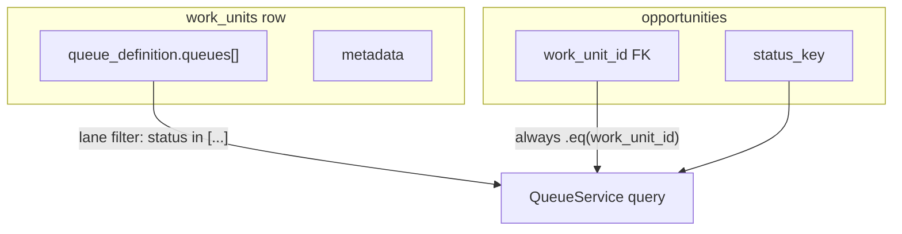
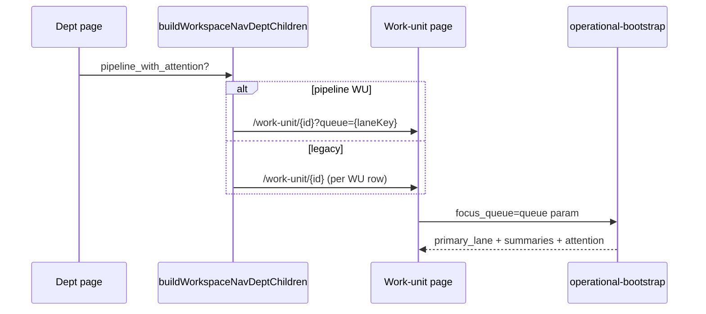
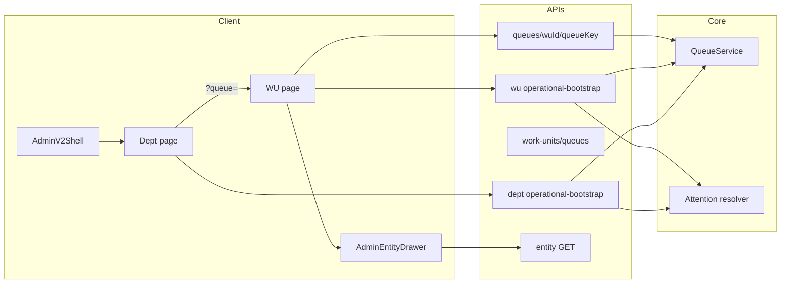

# Work Unit Runtime Consolidation V1 — Full Audit

**Date:** 2026-05-23  
**Phase:** AUDIT ONLY (no implementation)  
**Next phases:** DESIGN → IMPLEMENT (separate docs)  
**Sprint objective (target state):** Move from **status-driven work units** (one WU per status cohort) to **operational-domain work units** (e.g. All, Pipeline, Touring, Enrolling, Needs Attention) where **statuses become filters**, not top-level navigation surfaces.

**Canonical references loaded for this audit:** `docs/system/workspace-system.md`, `docs/product/crm-system.md`, `docs/sprints/05_2026/adminv2_dept_runtime_closeout_handoff.md`, `docs/sprints/05_2026/adminv2_work_unit_runtime_cards_1_3_plan.md`, `docs/sprints/05_2026/canonical_enrollment_operating_model_seed.md`, `docs/sprints/05_2026/adminv2_performance_closeout.md`.

---

## Executive summary

Alloy’s Admin V2 work-unit runtime is **not one model** today. Three overlapping patterns coexist:

| Model | Typical shape | Primary scoping | Maturity |
|-------|----------------|-----------------|----------|
| **A. Multi–work-unit / status cohort** | `pipeline_overview`, `early_inquiries`, `quoting`, … | `opportunities.work_unit_id` + optional legacy flat `filters.status_keys` | Bootstrap + childcare vertical seed |
| **B. Single pipeline WU / multi-queue** | `enrollment_pipeline` + `queue_definition.queues[]` | Same `work_unit_id` for all pipeline rows; lanes = `status` filters per queue key | Canonical for enrollment (migrations + code) |
| **C. Job / ops WU** | `unassigned_jobs`, `needs_attention` (jobs) | `jobs.work_unit_id` | Cleaning org seed; department registry layouts |

The **enrollment canonical path (B)** already matches much of the sprint target (domains as **queues** inside one execution WU). The **legacy childcare bootstrap (A)** and **cleaning growth WUs (A/C hybrid)** still treat **work unit ≈ status slice**, which is the main consolidation debt.

**Highest-risk coupling:** `QueueService` always scopes opportunity lists with `.eq("work_unit_id", workUnitId)` **before** applying queue lane filters. Operational domains that span statuses **require** either (1) a single execution WU with many queues, or (2) a deliberate change to cohort assignment / query semantics.

---

## 1. Current work-unit definitions

### 1.1 Database (`work_units`)

| Column | Role |
|--------|------|
| `id`, `org_id`, `department_id` | Tenant + hierarchy |
| `key`, `name`, `description`, `sort_order`, `is_active` | Operator identity + nav ordering |
| `queue_definition` | JSONB — **lane/filter authority** for queues (v1) |
| `metadata` | Attention rules, activity signals, nav overrides, placement flags |

**Table comment (schema):** “Operational queue/cohort within a department.”

**Related FKs:** `opportunities.work_unit_id`, `jobs.work_unit_id`, `workspace_kpi_placement.work_unit_id`, `action_placements.work_unit_id`, `status_transition_rules.work_unit_id`.

### 1.2 Code-first classification

| Source | Purpose |
|--------|---------|
| `web/lib/workspace/workUnitKinds.ts` | `WorkUnitKind`: `throughput` \| `exception` \| `standard`; constant `NEEDS_ATTENTION_WORK_UNIT` |
| `web/lib/workspace/registry.ts` | Department **layout blocks** (operations signals, queue entries, dept routes) — cleaning vertical |
| `web/lib/config/enrollmentPipelineQueueDefinitionV1.ts` | **Canonical** enrollment pipeline queues + UI (`pipeline_with_attention`) |
| `web/lib/admin/verticalBootstrap/childcareBootstrapV1.ts` | Onboarding JSON — **legacy multi-WU** enrollment demo |

### 1.3 Known work-unit keys (by vertical / seed)

**Enrollment (canonical, post-migration):**

- `enrollment_pipeline` — single execution WU; queues: `new_inquiry`, `contact_attempted`, `tour_scheduled`, `tour_completed_follow_up`, `enrolling`, `waitlisted`, `enrolled`, `lost`, `pipeline_total`, `needs_attention`

**Childcare bootstrap (legacy demo — still in code):**

- `pipeline_overview`, `early_inquiries`, `quoting`, `priced_followup`, `needs_attention` (standalone exception WU)

**Cleaning org seed (`20260409090000_*`):**

- Operations: `unassigned_jobs`, `todays_schedule`, `needs_attention`
- Growth: `new_leads`, `unbooked_quotes` (legacy flat opportunity `queue_definition` via `20260414140000_*`)
- Finance / CX / System: job-oriented WUs

**Growth opportunity WUs** use **legacy** `queue_definition` shape (`filters.status_keys`, `quote_state`) documented in `web/lib/rrs/queue/queueDefinitionV1.ts` — distinct from workspace `queues[]` schema.

### 1.4 Entity assignment doctrine (opportunities)

- `opportunities.work_unit_id` (nullable FK, org integrity trigger) is the **cohort gate** for `QueueService` opportunity queries.
- Queue lane filters (e.g. `status in [enrolling]`) apply **inside** that cohort.
- **Implication:** Multi-WU status model **requires** opportunities to be placed on the correct WU row; single-pipeline model **requires** all in-pipeline opportunities on `enrollment_pipeline`.



---

## 2. Queue definition authority

### 2.1 Authority stack (highest wins for runtime reads)

| Layer | Location | Notes |
|-------|----------|-------|
| **Stored truth** | `work_units.queue_definition` | Written via admin API, migrations, scripts, agent apply |
| **Strict workspace schema** | `web/lib/config/queueDefinitionSchema.ts` | `queues[]`, per-queue `filters[]`, `ui` (`pipeline_with_attention`, sections, row_preview) |
| **Legacy parse/write** | `web/lib/rrs/queue/queueDefinitionV1.ts` | Flat job/opportunity docs; bridges to workspace schema when `queues` present |
| **Canonical enrollment constant** | `enrollmentPipelineQueueDefinitionV1.ts` | Validated; mirrored by migrations `20260430232500`, `20260430234000` |
| **Apply / concurrency** | `applyWorkUnitQueueDefinitionUpdate.ts` | `expected_queue_definition_version` optimistic locking |

**QueueService** loads definition via `loadWorkUnitQueueDefinitionWithMeta` → `validateQueueDefinition` (workspace shape). Legacy growth documents must be migrated or normalized before workspace UI can interpret them.

### 2.2 UI derivation (not a second engine)

| Helper | Role |
|--------|------|
| `getQueueUiConfig` / `partitionQueueUiSections` | `web/lib/ui-v2/queueUiConfig.ts` |
| `extractPipelineExecutionLanes` | Dept oper **left lane** labels/order from `ui.sections[pipeline]` |
| `findAllRecordsQueueKey`, `workUnitScopeTotalFromSummaries` | “All” / KPI total lane |
| `shouldSuppressWorkUnitKpiStrip` | Hide generic KPI when pills already summarize |

### 2.3 Dual schema risk

```txt
Workspace v1 (target):  { version, entity_type, queues: [{ key, filters: [{ type: status, ... }] }], ui }
Legacy Growth v1:       { version, entity_type, filters: { status_keys }, sort, limit }
Legacy bootstrap JSON:  invalid for QueueService until converted
```

**Coupling risk:** Admin Settings `WorkUnitsClient` validates with `validateQueueDefinition`, but **stored rows** may still be legacy on older orgs. `getQueueDefinitionStoredVersion` distinguishes shapes for PATCH.

---

## 3. KPI authority

### 3.1 Code-owned metrics

- **Registry:** `web/lib/kpi/registry.ts` — `metric_key` definitions, allowed surfaces (`workspace`, `department`, `work_unit`).
- **Doctrine:** `docs/sprints/05_2026/kpi_config.txt` — config chooses **which** metric; code owns calculation; V1 = **context-derived** from same batches as the surface.

### 3.2 Config-owned placements

| Table | Scope columns |
|-------|----------------|
| `workspace_kpi_placement` | `org_id`, `surface`, `department_id?`, `work_unit_id?`, `metric_key`, `sort_order`, … |

**Loaders:**

- `loadDepartmentKpiPlacementsServer.ts`
- `loadWorkUnitKpiPlacementsServer.ts`
- API: `GET/POST/PATCH/DELETE /api/admin/workspace-kpi-placements`

**Settings UI:** `/adminV2/settings/kpis` (`KpiPlacementsSettingsClient.tsx`).

### 3.3 Runtime resolution

- **Dept bootstrap:** bundles `kpi_placements` in `operational-bootstrap`; may **synthesize** WU summaries via `synthesizeDeptKpiWorkUnitSummaries` when pipeline WU summaries skipped.
- **WU bootstrap:** KPI placements **deferred** on reveal path (`kpi_placements_deferred_on_route`) — must not block TTFB.
- **Resolver:** `resolveKpisForDepartment` / context reducers (`contextReducerRegistry.ts`) consume queue summaries + lifecycle data.

**Coupling risk:** KPIs keyed by `work_unit_id` align with **WU rows**, not **queue keys**. Domain consolidation may need **placement surface** extensions (queue-scoped metrics) or explicit “pipeline WU only” doctrine.

---

## 4. Queue summary APIs

| Route | Purpose |
|-------|---------|
| `GET /api/admin/work-units/[id]/queues` | Per-WU queue summaries (+ previews optional) |
| `GET /api/admin/departments/[departmentId]/work-unit-queue-summaries` | Batch summaries for all WUs in dept |
| `GET /api/admin/work-units/[id]/operational-bootstrap` | **Bundled** summaries + primary lane + attention |
| `GET /api/admin/departments/[departmentId]/operational-bootstrap` | Dept summaries + attention + pipeline_surface + KPI/actions |
| `GET /api/admin/queues/[workUnitId]/[queueKey]` | Paginated queue **items** (rows) |

**QueueService entry points:**

- `getWorkUnitQueueSummaries` — counts + optional preview rows per queue key
- `getWorkUnitQueueItems` — full list for one queue
- `getDepartmentWorkUnitQueueSummaries` — parallel per-WU batch
- `loadOpportunityNeedsAttentionRows` — resolver-backed NA cohort

**Summary modes:** `all` \| `priority` \| `partial` — dept cards default `priority`; WU reveal uses `priority` + `focus_queue` budget.

---

## 5. Queue routing logic

### 5.1 URL contract (work-unit route)

**Path:** `/adminV2/workspace/dept/[departmentId]/work-unit/[workUnitId]`

**Query params (authoritative selection — `workUnitQueueSelection.ts`):**

| Param | Maps to |
|-------|---------|
| `queue` | Primary lane / API `focus_queue` |
| `attention_bucket` / `bucket` | NA bucket lens |
| `status_keys` | Optional status drill (encoded filter) |
| `attention_reason` / `attention_reason_code` | Deep-link explainability |
| `activity_signal_key` | Activity signal lanes |
| `unmapped` | Unmapped overflow pill |
| `workspace_site_id` | Record scope (sticky site filter) |

**Doctrine (May 2026 closeout):** Explicit `?queue=` from dept oper **must** win over bootstrap `primary_lane` default (`resolveAuthoritativeWorkUnitQueueKey`). Bootstrap cache key includes `focusQueue` + `attentionBucket` (`workUnitBootstrapOwnershipKey`).

### 5.2 Sidebar navigation

`buildWorkspaceNavDeptChildren`:

- If `pickDeptPipelineWorkUnit` finds `pipeline_with_attention` → **one nav row per pipeline queue key** (same WU id, different `?queue=`).
- Else → **one row per work unit** (excluding standalone `needs_attention` key).

**Coupling:** Nav models **domains as queues** only when pipeline layout exists; otherwise nav models **domains as work units**.

### 5.3 Dept → WU navigation

- Dept oper left lane: `extractPipelineExecutionLanes` or per-WU cards (`resolveDeptPipelineExecSurface`).
- Hrefs: `workspaceDeptQueueNavHref` + `appendWorkspaceSiteToPath`.
- Prefetch: `prefetchWorkUnitOperationalBootstrapFromDept`, `prefetchVisibleWorkUnitBootstrapsFromDept`.



---

## 6. Needs Attention integration

### 6.1 Resolution doctrine

`resolveDeptNeedsAttentionWorkUnit` / `resolveWorkUnitNeedsAttentionExecution`:

1. Standalone `work_units.key === needs_attention`
2. Else pipeline WU (prefers `enrollment_pipeline`) with `needs_attention` in `queue_definition.queues`

**Not** the same as `right_rail_work_unit_id` (actions only).

### 6.2 Runtime surfaces

| Surface | Mechanism |
|---------|-----------|
| Dept right lane | `buildWorkUnitScopedNeedsAttentionLaneBuckets` — bucket counts from resolver |
| WU queue tab | `queue=needs_attention` + optional `attention_bucket` |
| All pipeline queues | `enrichOpportunityRows` adds `_needs_attention` styling |
| Drawer | `_operational_attention` on entity GET — header strip |

### 6.3 Config authority

- **Buckets (lenses):** `metadata.opportunity_attention_rules.needs_attention_buckets` — dept → WU precedence; **no platform default** (`DEFAULT_NEEDS_ATTENTION_BUCKETS` empty).
- **Reason codes:** platform catalog + resolver (`opportunityAttentionResolver.ts`).
- **Childcare demo seed:** `enrollmentNeedsAttentionBucketsSeed.ts` via `ensureEnrollmentPipelineWorkUnitV1.ts`.
- **Settings:** `/adminV2/settings/attention-sla-rules`.

### 6.4 Count semantics (trust boundaries)

Documented in `workspace-system.md`: caps differ (`500` org preview vs `5000` WU-scoped). Dept fallback `department_attention_preview` only when **no** NA queue in any WU `queue_definition`.

**Coupling risk:** NA is an **overlay queue** inside pipeline WU in canonical model, but a **separate WU** in legacy bootstrap — migration must unify resolution paths.

---

## 7. Runtime assumptions

| Assumption | Where enforced |
|------------|----------------|
| Queue rows = preview only | `workspace-system.md`, QueueService enrichment |
| One `loadAdminRouteGate` per bootstrap HTTP | operational-bootstrap routes |
| Shell-first reveal; oper-region loader only | dept/WU pages, reveal gates |
| WU page **freezes** URL params on mount (no Next searchParams subscription) | `work-unit/.../page.tsx` |
| Primary lane ≤ ~8–20 rows in bootstrap | loader limits |
| Attention resolver **once** per bootstrap | `loadWorkUnitOperationalBootstrap` |
| Pipeline WU skips duplicate dept card summaries | `pickDeptPipelineWorkUnit` in dept loader |
| Enrollment dept uses paired oper reveal | `DeptPageLoadingGate`, `WorkspacePairedOperPanel` |

---

## 8. URL contract assumptions

- **Stable:** `departmentId`, `workUnitId` path segments identify bootstrap scope.
- **Volatile (frozen at mount):** query string drives lane selection; changing query without navigation may not re-read on client (by design for RSC churn control).
- **Cross-route:** `workspace_site_id` merged by `adminV2CommitNavigation` and `appendWorkspaceSiteToPath`.
- **Drawer deep links:** `queue=needs_attention` + `attention_reason_code` (+ legacy label param).

---

## 9. Filter assumptions

### 9.1 Queue definition filters (workspace schema)

Types: `status`, `field`, `date`, `assignment` (jobs), `exception` (jobs / legacy NA SQL).

Opportunity lanes overwhelmingly use **`status` `in` `[keys]`**.

### 9.2 URL-level filters

- `status_keys` on WU URL → selection metadata / fetch hints (`workUnitQueueSelection`).
- `unmapped=1` → derived overflow when ∑(status lanes) < all-records lane (`computeUnmappedOverflowCount`).

### 9.3 Record scope

- `resolveQueueRecordScopeConstraints` + `workspace_site_id` → location/site narrowing on **same** `work_unit_id` cohort.

### 9.4 Status definitions

- `status_definitions` (org, entity_type=`opportunities`) provide labels; queue filters reference **keys**, not IDs.
- Enrollment canonical keys in `CANONICAL_ENROLLMENT_PIPELINE_STATUS_KEYS` — must exist before applying pipeline queue_definition script.

---

## 10. Cache assumptions

| Cache | Key dimensions | Invalidation |
|-------|----------------|--------------|
| `workUnitBootstrapClientSession` | dept, wu, site, **focusQueue**, attentionBucket | Nav away / entity update events |
| `workUnitOperationalBootstrapServerCache` | scope + summaries mode + queue scope | TTL / loader flags |
| `workUnitOperBootstrapLaneCache` | summaries + primary rows | Bootstrap phases |
| `adminV2WorkspaceSessionCache` (dept) | departmentId, site | Dept nav |
| `rightRailActionsBundleCache` | dept, wu, surface | Action config changes |
| `workspaceAdminFetchDedupe` | URL + init | Shared fetch dedupe |
| Entity labels / admin shell context | org | Separate TTL caches |

**Coupling risk:** Caches keyed on **work unit id**, not **operational domain**. Renaming/consolidating WUs requires cache key migration or session clears.

---

## 11. Bootstrap assumptions

### 11.1 Dept bootstrap payload

`loadDeptOperationalBootstrap` →

- `department`, `work_units[]`, `summaries.work_units[]`, `attention`, `pipeline_surface`
- Extras: `kpi_placements`, `right_rail_actions`

### 11.2 WU bootstrap payload

`loadWorkUnitOperationalBootstrap` →

- `department`, `work_unit`, `queue.summaries`, `queue.primary_lane`, `queue.attention?`
- Route bundles deferred: primary rows, KPI, right rail (depending on `defer_bundle`)

### 11.3 Shared computation context

`WorkUnitOperBootstrapContext` doctrine (cards 1–3 plan):

- Single `buildQueueSummariesSharedBootstrap`
- Shared `recordScopeConstraints`, status defs, attention `resolved_by_id`
- **Must not** re-run NA resolver on lane switch

---

## 12. Primary lane assumptions

- **Authority:** `resolveWorkUnitBootstrapPrimaryQueueKey` → `resolveAuthoritativeWorkUnitQueueKey` (explicit URL queue if defined on WU, else UI order, else `findAllRecordsQueueKey`).
- **Bootstrap field:** `queue.primary_lane.queue_key` + optional `items` / `rows_deferred`.
- **Client:** Row fetch may start before summaries return (`page.tsx` early queue GET).
- **Not authoritative for:** drawer truth, mutations, workflow side effects.

---

## 13. Drawer assumptions

| Concern | Behavior |
|---------|----------|
| Open path | Entity GET + `loadOpportunityDrawerOperationalBootstrap` |
| Queue context | `work_unit_id` + `queue_key` from drawer host / workspace scope |
| Prev/next | `opportunityDrawerQueueNavigator` — **filtered queue page** only (`opportunityDrawerNavigatorMatchesWorkUnitSelection`) |
| Prefetch | Adjacent rows + adjacent queue pills (`workUnitQueuePillPrefetch`) |
| Attention UI | `OperationalAttentionHeaderStrip` — not queue row JSON |

**Coupling risk:** Drawer navigation indexes **current queue items fetch**, not “all opportunities in domain.” Domain consolidation must preserve **queue-scoped** navigator semantics or redefine it.

---

## 14. Selection / refetch doctrine dependencies

| Event | Expected behavior |
|-------|-------------------|
| Dept oper lane click | Navigate with `?queue=`; bootstrap with `focus_queue` |
| WU pill click | `workUnitQueueSelectionFromPillKey`; may use synthetic `__attn_bucket__` keys |
| Site filter change | Invalidate queues (scope change) — by design |
| `adminv2:opportunity-updated` | `fetchQueueItems(..., { force: true })` |
| Lane switch after bootstrap | Client state + optional row fetch; **no** second attention resolver pass |
| Opportunity PATCH status | May require **work_unit_id** reassignment in multi-WU model — **verify** workflow hooks |

**Key modules:** `workUnitQueueSelection.ts`, `workUnitLaneQueryUrl.ts`, `workUnitBootstrapPrefetchFromDept.ts`, `adminV2CommitNavigation.ts`.

---

## 15. Config tables involved

| Table | Work-unit relevance |
|-------|---------------------|
| `work_units` | Core |
| `departments` | Parent; attention buckets often on `departments.metadata` |
| `status_definitions` | Filter labels/keys for opportunity queues |
| `status_transition_rules` | Optional `work_unit_id` scope |
| `workspace_kpi_placement` | Per-surface metrics |
| `action_placements` | Right-rail / record actions scoped to WU |
| `opportunities` | `work_unit_id`, `status_key` |
| `jobs` | `work_unit_id` for ops WUs |
| `pipeline_stages` | Legacy growth quote filters |
| `user_access_profiles` | Dept/site visibility |

---

## 16. Settings pages related to work units

| Route | Component | Mutability |
|-------|-----------|------------|
| `/adminV2/settings/work-units` | `WorkUnitsClient` (adminV2 chrome) | CRUD WU + JSON `queue_definition` |
| `/admin/system/work-units` | Same client | Legacy admin entry |
| `/adminV2/settings/kpis` | `KpiPlacementsSettingsClient` | KPI placements |
| `/adminV2/settings/attention-sla-rules` | Attention / SLA metadata | Dept (WU override read-only note) |
| `/adminV2/settings/placement-priority` | Placement orchestration | Opt-in WU feature |
| `/adminV2/settings/statuses` | Status definitions | Feeds queue filters |
| `/adminV2/settings/departments` | Department metadata | Attention buckets seed location |

---

## 17. Read-only configuration surfaces

- `RuntimeMetadataReadOnlyPanel` in Work Units settings — surfaces `metadata` (attention rules, signals) without full editor.
- Work unit list API returns `metadata` for inspection.
- Config proposals / agent v0 queue-definition route — proposed patches, human apply.

---

## 18. BOS / config alignment

- **BOS capabilities** (`bosCapabilityRegistry.ts`): orchestrator reads `workspace_metadata`; no dedicated “work unit domain” capability.
- **Agent v0:** `applyWorkUnitQueueDefinitionUpdate` + `/api/admin/agent/v0/queue-definition` — mutates `queue_definition` under human approval patterns.
- **Workflow Assist:** inherits `GlobalAssistantContext.workspaceScope` (`department_id`, `work_unit_id`) from route.
- **Paused expansion:** BOS must not own queue ordering or NA membership (workspace-system.md).

**Alignment gap:** BOS/agent can patch **queue_definition** but not **operational domain taxonomy** as a first-class object — domains are implicit in JSON.

---

## 19. Status / queue / work-unit coupling map

### 19.1 Correctly layered (canonical enrollment)

```txt
work_unit (enrollment_pipeline)
  └── queue new_inquiry      → filter status ∈ { new_inquiry }
  └── queue enrolling        → filter status ∈ { enrolling }
  └── queue needs_attention  → resolver overlay (any status)
```

Status changes **move rows between queues** without changing `work_unit_id`.

### 19.2 Incorrect / high-debt coupling

| Issue | Symptom | Risk |
|-------|---------|------|
| **WU = status cohort** | `early_inquiries` WU with `filters.status_keys` | Requires `work_unit_id` reassignment on status change |
| **Dual NA models** | Standalone `needs_attention` WU vs pipeline queue | Dept attention resolution fallback paths |
| **Legacy growth JSON** | Flat `filters` not `queues[]` | QueueService validation failures or skipped UI |
| **Nav splits models** | Pipeline nav uses queues; legacy uses WUs | Operator mental model drift |
| **KPI per WU** | `dept.wu_queue.total_per_work_unit` | Domains as queues invisible to KPI placements |
| **View model by WU key** | `enrollmentWorkUnitViewModel` quick actions keyed on `workUnitKey` | Breaks when consolidating keys |
| **RRS growth scope** | `growthOpportunityQueueScope` **org-scoped**, no `work_unit_id` | Differs from QueueService — parallel system |
| **Childcare bootstrap statuses** | `contacted` vs canonical `contact_attempted` | Seed/migration drift |

### 19.3 `opportunities.work_unit_id` coupling

**QueueService (authoritative for Admin V2):**

```sql
WHERE org_id = ? AND work_unit_id = ? AND status_key IN (...)
```

**Migration implication:** Target domains (Touring, Enrolling, …) as **filters** only work without FK changes if:

- All in-domain opportunities share one **execution** `work_unit_id`, **or**
- Product accepts **reassignment** workflows when crossing domains, **or**
- Query layer is extended to support **department-scoped** domains (larger change).

---

## 20. Runtime flow (end-to-end)



---

## 21. Authority mapping (summary table)

| Concern | System of record | Interpreter | UI consumer |
|---------|------------------|-------------|-------------|
| Work unit existence | `work_units` | Admin API | Nav, routes, settings |
| Lane definitions | `queue_definition` | `queueDefinitionSchema` + QueueService | Pills, dept oper, summaries |
| Status labels | `status_definitions` | status resolve helpers | Row preview, KPIs |
| NA membership | Resolver + rules metadata | `opportunityAttentionResolver` | Lanes, strip, styling |
| NA lenses | `needs_attention_buckets` metadata | `needsAttentionBuckets.ts` | Dept tiles, WU chips |
| Row membership (opp) | `opportunities` + `work_unit_id` | QueueService SQL | Lists, drawer index |
| KPI visibility | `workspace_kpi_placement` | KPI resolver | KPIBlock |
| Actions | `action_placements` + registry | right rail loaders | ActionsBlock |
| Site scope | session + URL | `resolveQueueRecordScopeConstraints` | All queue APIs |

---

## 22. Coupling risks (prioritized)

| P | Risk | Impact |
|---|------|--------|
| P0 | `work_unit_id` gate on all opportunity queues | Blocks domain = filter without single execution WU |
| P0 | Legacy multi-WU tenants + bootstrap seeds | Wrong nav + empty lanes after partial migration |
| P1 | Dual queue_definition schemas | Settings save vs runtime load failures |
| P1 | KPI / actions scoped to WU not queue | Domains invisible to config surfaces |
| P1 | Bootstrap cache keys omit future domain keys | Stale oper after consolidation |
| P2 | Growth RRS vs QueueService semantic split | Confusion if reviving growth routes |
| P2 | View models keyed by `workUnitKey` | UI regressions on rename |
| P2 | Count cap mismatches across surfaces | False “parity” bugs in QA |

---

## 23. Migration concerns (audit-only)

1. **Inventory tenants** by model: A (multi-WU), B (pipeline), C (jobs).
2. **Data migration:** Collapse WUs → single execution WU; merge `queue_definition` queues; reassign `opportunities.work_unit_id`.
3. **Deactivate** redundant `work_units` rows (keep keys mapped for bookmarks).
4. **Normalize** legacy JSON to `queues[]` shape.
5. **Align** `status_definitions` with filter keys (childcare bootstrap drift).
6. **Re-seed** attention buckets at dept level (precedence).
7. **Update** nav builder + dept oper cards to always use pipeline lane model.
8. **Revisit** KPI placements + metric reducers for queue-scoped domains.
9. **Invalidate** session caches; run regression suite (`adminV2WorkUnitQueueRouteAuthority`, bootstrap tests).
10. **Docs:** update `workspace-system.md` when schema/version changes (per doc guardrails).

---

## 24. Recommended refactor boundaries (for DESIGN phase)

| Boundary | Keep stable | Allow to change |
|----------|-------------|-----------------|
| **QueueService contract** | Preview vs truth, allowlists | Optional dept-scoped cohort mode (new API flag) |
| **queue_definition schema** | v1 `queues[]` + `ui` | New `ui.layout` values for domain tabs |
| **URL contract** | `?queue=` as lane key | Add `?domain=` only if needed — prefer reusing `queue` |
| **Attention** | Resolver + bucket metadata | Remove standalone NA WU special cases |
| **Bootstrap bundles** | Single gate, shared context | Payload shape for domain-first summaries |
| **Settings** | work_units table | Domain editor = queue section editor |
| **Nav** | `buildWorkspaceNavDeptChildren` pipeline branch | Deprecate per-status WU rows |

**Suggested slice order:**

1. **Enrollment orgs already on B** — rename queues to domain language; no FK change.
2. **Legacy childcare demo** — migrate `CHILDCARE_VERTICAL_BOOTSTRAP_V1` to single pipeline WU + script.
3. **Cleaning growth** — convert flat filters → `queues[]`; single growth execution WU.
4. **KPI/actions** — optional queue_key dimension on placements (design decision).
5. **Query layer** — only if product requires cross-WU domains without reassignment.

---

## 25. Performance implications

| Area | Observation |
|------|-------------|
| Bootstrap | Dept attention + multi-WU summaries dominate; pipeline skip helps |
| WU bootstrap | Priority summary budget + deferred rows/KPI/rail — preserve in consolidation |
| Lane switch | Client reuse of attention metadata — do not reintroduce resolver per tab |
| Queue GET | `enrichment_ms` hotspot — domain consolidation does not fix without slimmer preview |
| Caching | More queue keys on one WU → larger summary fan-out — tune `priority_budget` |
| Nav prefetch | Fewer WU rows but same queue count — net neutral if single WU |

---

## 26. Config implications

- **Operators** edit domains via `queue_definition` JSON or future structured editor — not separate table today.
- **Statuses** remain `status_definitions`; domain filters reference keys.
- **Attention** remains metadata-driven; consolidating WUs does not remove resolver.
- **Placement priority** (`metadata` + settings) stays opt-in per WU.
- **Agent/BOS** patches must respect `expected_queue_definition_version`.

---

## 27. Test / regression anchors

| Test | Covers |
|------|--------|
| `adminV2WorkUnitQueueRouteAuthority.test.ts` | URL → bootstrap `focus_queue` / primary lane |
| `workUnitQueueSelection.test.ts` | Selection authority, pill keys |
| `workUnitOperationalBootstrap.test.ts` | Attention block shape |
| `resolveDeptNeedsAttentionWorkUnit.test.ts` | NA execution WU resolution |
| `workUnitBootstrapPrefetchFromDept.test.ts` | Dept href → prefetch ownership |
| `adminV2WorkUnitRouteLoadConsolidation.test.ts` | Load path / dedupe |
| `opportunityDrawerQueueNavigator.test.ts` | Drawer queue index |
| `prefetchWorkUnitOperationalBootstrap.test.ts` | Prefetch contracts |

---

## 28. Files inspected (audit trail)

**Docs:** `docs/system/workspace-system.md`, `docs/product/crm-system.md`, `docs/sprints/05_2026/adminv2_*`, `docs/sprints/05_2026/canonical_enrollment_operating_model_seed.md`, `docs/archive/.../workspace-work-unit-scope-doctrine.md`

**Schema / migrations:** `work_units` table, `20260430232500_enrollment_pipeline_*`, `20260414140000_growth_*`, `20260409090000_cleaning_*`, `20260427173000_opportunities_work_unit_id.sql`

**Core runtime:** `QueueService.ts`, `loadWorkUnitOperationalBootstrap.ts`, `loadDeptOperationalBootstrap.ts`, `resolveDeptNeedsAttentionWorkUnit.ts`, `pickDeptPipelineWorkUnit.ts`, `workUnitQueueDerived.ts`, `workUnitQueueSelection.ts`, `enrollmentPipelineQueueDefinitionV1.ts`, `queueDefinitionSchema.ts`, `queueDefinitionV1.ts`

**Routes / UI:** `adminV2/workspace/dept/.../page.tsx`, `adminV2/workspace/dept/.../work-unit/.../page.tsx`, `buildWorkspaceNavDeptChildren.ts`, `WorkUnitsClient.tsx`, operational-bootstrap API routes

**Supabase reference:** `docs/supabase/reference/supabase_tables.csv`, `supabase_schema_columns.csv` (FK columns)

---

## 29. Open questions for DESIGN (not answered in audit)

1. Should **domain** be purely `queue_definition.ui` presentation, or a new config entity?
2. Is **`opportunities.work_unit_id`** still the cohort assigner, or becomes optional under domain-first model?
3. How do **jobs** and **opportunities** unify under “operational domain” language?
4. Cross-department opportunities — in or out of scope?
5. Migration strategy for orgs with **custom** `work_units` created in Settings?

---

## 30. Suggested commit message (when implementing DESIGN doc only)

```txt
docs: add work unit runtime consolidation V1 audit (AUDIT phase)

Captures authority boundaries, dual models, coupling risks, and migration
concerns before operational-domain work unit design.
```

---

**Status:** Audit complete. **Do not implement** runtime changes until DESIGN sign-off.
