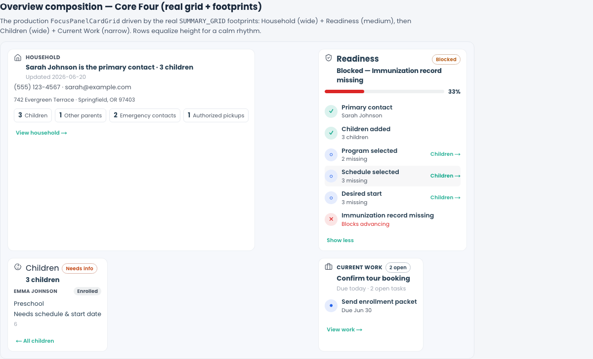
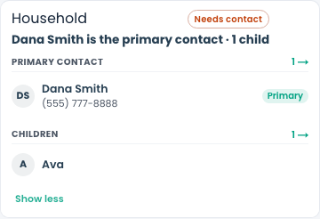
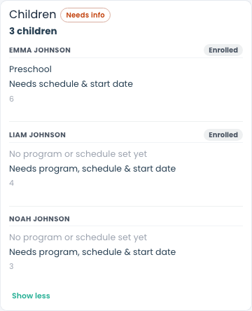
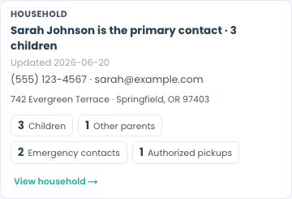
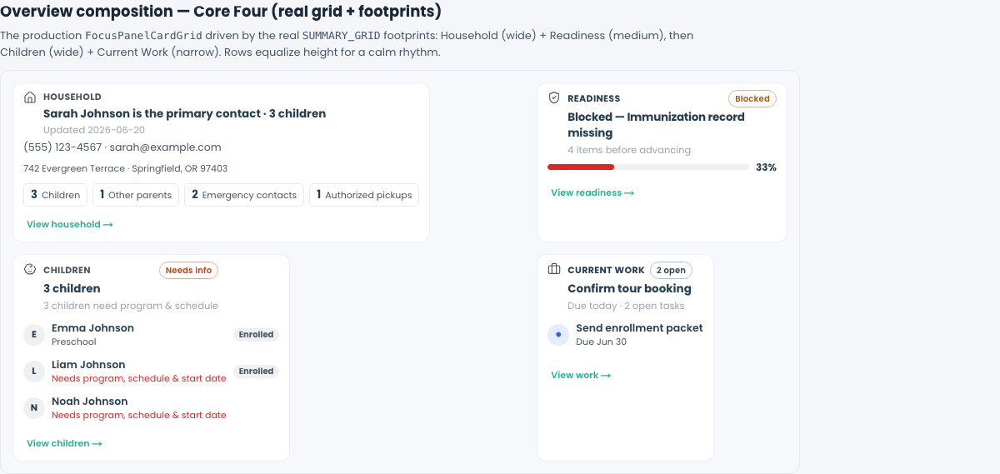

# Core Four Coherence Pass

**Sprint:** Alloy OS — Core Four Coherence Pass
**Date:** June 2026
**Status:** Complete — recommend **one short visual-parity follow-up** (see end), otherwise production-ready.

The architecture, interaction model, and card system are frozen. This pass added
**no cards, no primitives, no architecture.** It made the four cards read as one
continuous operational conversation instead of four separate widgets.

---

## 1. What changed (at a glance)

| Theme | Before | After |
| --- | --- | --- |
| **Ownership** | Readiness restated facts as if it owned them | Readiness *references* — each incomplete factor points to its **owner card** |
| **Handoffs** | Cards were islands; clicking a gap did nothing cross-card | Clicking a Readiness gap **arrives at the card that owns the truth** (Perspective Change) |
| **Formatting** | Labeled field grids (`Program: …`, `Schedule: …`) | **Operational sentences** — answer first, evidence second, metadata last |
| **Duplication** | Household repeated the primary name in answer *and* row; Current Work repeated its one item | Answer (insight) owns the name/primary; body shows the *next* fact only |
| **Chrome** | Heavy borders, 3px tier rails, slab footers | Hairline borders, thin accent rails, quiet inline footers, lighter header band |

---

## 2. Card ownership (one owner per fact)

Every operational fact now has exactly one owner; other cards reference it.

| Fact | Owner | References it |
| --- | --- | --- |
| Primary / emergency contacts, address, channel | **Household** | Readiness ("Primary contact"), Current Work ("Contact family") |
| Children, program, room, schedule, desired start | **Children** | Readiness ("Program / Schedule / Desired start") |
| Open work, due, next action | **Current Work** | Readiness ("blocks advancing") |
| Readiness verdict (derived) | **Readiness** | — diagnoses only, never edits |

Implementation: `ReadinessFactor` now carries `ownerCard` + `ownerFocus`
(`buildReadinessCardEvidence.ts`). Readiness holds **no verbs** — it points.

---

## 3. Cross-card handoffs

A new orchestration seam (`focusPanelCoordination.ts`) lets a *referencing* card
ask the *owner* card to open a Perspective. **It is not a new primitive** — it
coordinates the local expand/focus state the Core Four already own. No fetch, no
route, no Subject Change.

**Readiness → Children** (the canonical example):

> Readiness shows `Schedule selected · Children →`. Clicking it scrolls to the
> Children card and opens **Emma Johnson** focused — "Preschool / Needs schedule &
> start date." Readiness referenced; Children owns; the action arrived at the owner.

**Household self-handoff** (missing emergency contact → owner card opens to resolve):

The host (`OpportunityFocusPanelModeGrid.tsx`) records the request with a monotonic
nonce, scrolls the owner card into view, and the owner applies the focus.

---

## 4. Formatting — sentences, not field lists

Cards stopped reading like forms. Children and Current Work now emit one
operational sentence (present facts only) plus a quiet "what's missing" diagnosis.

- "Preschool · North Room · M–F · starts Aug 2026" replaces a `Program / Room /
  Schedule / Start` grid.
- Attention children lead with **"Needs program, schedule & start date"** instead of
  blanks.
- Readiness leads with **what** is missing ("Schedule and start date needed"),
  not a percentage; the score lives only in the gauge.
- Blocked reads as a **diagnosis**: "Blocked — Immunization record missing."

---

## 5. Household de-duplication + reachability

The answer line (insight) owns the primary contact name. Collapsed evidence shows
**reachability** (how to reach them) and the address — never repeating the name.

---

## 6. Core Four together — one operating system

Read top-to-bottom this is now one situation, not four widgets:

- **Household** — "Sarah Johnson is the primary contact · 3 children" (who)
- **Readiness** — "Blocked — Immunization record missing" (can we advance)
- **Children** — three children, two needing schedule & start (what's in flight)
- **Current Work** — "Confirm tour booking · Due today" + next item (what to do)

Shared rhythm: equal-height rows, hairline borders, thin accent rails, consistent
answer→evidence→metadata hierarchy, quiet inline footers.

---

## 7. Shell

- Header band flattened (transparent, 48px) so cards lead, not chrome.
- Mode switch tightened (smaller tabs).
- Grid keeps the calm 14px gutters + equal-height Overview rows from the prior pass.

---

## 8. Files changed

**Runtime / model**
- `web/lib/adminV2/runtime/focusPanel/focusPanelCoordination.ts` *(new — orchestration seam)*
- `web/lib/adminV2/runtime/focusPanel/readiness/buildReadinessCardEvidence.ts` *(owner pointers + diagnosis copy)*
- `web/lib/adminV2/runtime/focusPanel/children/buildChildrenCardEvidence.ts` *(sentence + missing-line)*

**Cards**
- `web/components/admin/focusPanel/cards/ReadinessCard.tsx` *(emits handoffs, pointer affordance)*
- `web/components/admin/focusPanel/cards/ChildrenCard.tsx` *(receives handoffs, sentence evidence)*
- `web/components/admin/focusPanel/cards/HouseholdCard.tsx` *(receives handoffs, channel-first de-dup, clickable missing state)*
- `web/components/admin/focusPanel/cards/CurrentWorkCard.tsx` *(receives handoffs, de-dup, sentence focus)*
- `web/components/admin/focusPanel/FocusPanelCardRenderer.tsx` *(threads `coordination`)*
- `web/components/admin/focusPanel/OpportunityFocusPanelModeGrid.tsx` *(host coordination state + scroll)*

**Style**
- `web/app/adminV2/components/alloyOsRuntime.css` *(coherence-pass block: hierarchy, calmer chrome, sentence evidence, pointer, shell)*

**Harness / tests**
- `web/app/dev/household-card-verify/HouseholdCardVerify.tsx` *(live coordination demo)*
- `web/tests/adminV2/runtime/readinessCardEvidence.test.ts`, `childrenCardEvidence.test.ts` *(ownership + sentence coverage)*
- `web/playwright/tests/core-four-coherence-pass.spec.ts` *(screenshot capture)*

**Validation:** `npx tsc --noEmit` clean for all changed files; 95 Core-Four /
composition unit tests pass.

---

## 9. Recommendation

**One final visual-parity follow-up, then production.**

The Core Four now behave like one operating system: single ownership, visible
handoffs, sentence formatting, calmer chrome. The remaining gap is **width**, not
coherence — the live operator Focus Panel is a narrow center column, so the
footprint widths (Household wide / Readiness medium) only express at the harness
width shown here. That is the same product decision flagged in the Composition
Review and is best resolved **inside Experience Builder** (which owns surface
width), not by more card polish.

→ Proceed to Experience Builder and compose surfaces with the approved card system.
