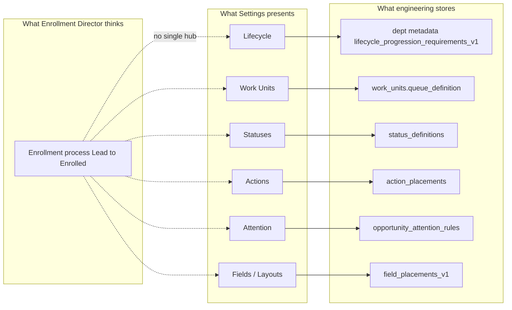

# Enrollment Operations Configuration UX Audit

**Path:** `docs/sprints/06_2026/enrollment_operations_configuration_ux_audit.md`  
**Status:** Audit + recommendations only (no implementation in this pass)  
**Date:** May 2026  
**Audience:** Product, design, engineering — framed for an **Enrollment Director** configuring Lead → Enrolled  

**Related:**  
- `settings_configuration_ia_cleanup_pass.md`  
- `lifecycle_runtime_configuration_alignment_sprint.md`  
- `lifecycle_configuration_requirements_design_package_v1.md`  
- `docs/system/configuration-system.md`  
- `enrollmentPipelineQueueDefinitionV2.ts` (canonical pipeline shape)

---

## Executive summary

Alloy’s enrollment stack is **architecturally capable** but **experientially fragmented**. An Enrollment Director today must visit six Settings areas—Lifecycle, Work Units, Statuses, Action Buttons, Attention & SLA, and Fields/Record Layouts—each backed by different storage, vocabulary, and editability. None of them is wrong in isolation; together they read as **separate admin systems** because there is **no single organizing object**: the **enrollment process** from Lead → Enrolled.

**Core diagnosis:** This is a **UX architecture** problem, not a lifecycle-rules problem. Lifecycle is the right *concept* for the organizing spine; Work Units and queue definitions are the wrong *primary* mental model for operators.

**Recommendation:** Treat **Enrollment Operations** (or **Enrollment Process**) as the future top-level Settings experience. Lifecycle configuration is the **source of truth for the journey**; Work Units, status groupings, default action visibility, and attention lenses should be **derived or guided** from that spine—not hand-maintained in parallel.

---

## 1. The Enrollment Director question

> *“How do I configure my enrollment process from Lead → Enrolled?”*

### What they mean (operator mental model)

| They say | They mean |
|----------|-----------|
| “Lead” | New families enter; we need a contact to respond |
| “Qualification” | We’re learning fit—child, program, timing |
| “Tour” | Visit scheduled and completed |
| “Waitlist” | Want care, no seat yet—schedule and start date matter |
| “Enrollment” | Paperwork and placement toward a start |
| “Enrolled” | Confirmed start; steady-state profile |

They do **not** mean:

- `work_units.queue_definition` version 2  
- `filters_compat_v1` vs `case_status`  
- `action_placements.surface = queue_row`  
- `departments.metadata.opportunity_attention_rules`  
- `field_placements_v1` on `opportunity_workflow_v1`

### What they need to configure (outcomes, not artifacts)

1. **What must be true** before staff move a family forward at each stage  
2. **Where staff work** each stage in the workspace (lanes / queues)  
3. **What the pipeline is called** (status labels families and reports see)  
4. **What buttons staff see** (and where) to advance the process  
5. **When the system flags** “needs attention”  
6. **What fields staff fill in** on person, child, and inquiry records—and whether those fields are required on save vs only before an action  

Today these six outcomes are split across six surfaces with weak coupling.

---

## 2. Current state — six systems, one journey

### 2.1 Unified journey map (Lead → Enrolled)

| Operator stage | Primary workspace lane (canonical pipeline) | Typical status keys (CRM) | Primary actions (examples) | Needs attention (examples) | Data the process cares about |
|----------------|---------------------------------------------|---------------------------|----------------------------|----------------------------|------------------------------|
| **Lead** | New Leads | `new_inquiry`, `open`, `new` | Create lead, message, mark lost | New inquiry — first response overdue | Person (contact) |
| **Qualification** | Follow Up | `contact_attempted`, `contacted`, `qualification` | Add child, schedule tour, move to waitlist | Qualification — follow-up overdue | Child, program, timing |
| **Tour** | Tours (+ post-visit lane) | `tour_scheduled`, `tour_completed`, `tour_no_show`, `follow_up_attempted` | Schedule/confirm tour, record outcome | Tour — outcome needed | Tour date/time, outcome |
| **Waitlist** | Waitlist | `waitlisted` | Move to waitlist, adjust position | Waiting on family/staff | Schedule, start date, program |
| **Enrollment** | Enrolling | `enrolling`, `ready_to_enroll` | Approve enrollment, assign classroom, send packet | Waiting on documents/staff | Classroom, schedule, start |
| **Enrolled** | Enrolled | `enrolled` | Message, documents | (steady-state; fewer stage-specific lenses) | Enrollment date, placement |

**Important:** Operator **Lifecycle** stages (six) are **not identical** to `status_definitions.metadata.lifecycle_stage` (intake, qualification, execution, decision, success, failure). Settings and runtime must not conflate them in copy or UI.

### 2.2 Where each system lives today

| System | Settings route | What it actually controls | Operator understands it as… | Editability today |
|--------|----------------|---------------------------|-----------------------------|-------------------|
| **Lifecycle** | `/adminV2/settings/lifecycle` | Dept overrides: stage required/recommended **objects** (Person, Child, Program…); preflight merge; nested field **guidance** (display-only) | “What we need before moving forward” | **Partial** — stage toggles yes; nested fields no |
| **Work Units** | `/adminV2/settings/work-units` | `work_units` rows + `queue_definition` JSON; optional bucket editor beta | “Queues” / technical pipeline | **Partial** — name/key/dept; lanes via JSON/advanced |
| **Statuses** | `/adminV2/settings/statuses` | `status_definitions` labels, order, metadata | “Status names in the CRM” | **Yes** — labels/order |
| **Actions** | `/adminV2/settings/actions` | `action_placements` (where buttons show) | “Buttons on drawer and workspace” | **Yes** — surfaces; not stage `condition_config` |
| **Needs Attention** | `/adminV2/settings/attention-sla-rules` | `departments.metadata.opportunity_attention_rules` | “SLA and attention buckets” | **Yes** — buckets, thresholds |
| **Fields** | `/adminV2/settings/fields` + **Record Layouts** | `field_definitions`, `field_placements_v1`, drawer requiredness | “Field labels and what’s required on the form” | **Yes** — labels; requiredness on **layouts** |
| **Capture rules (hidden)** | (no dedicated enrollment hub) | `completionBootstrapRulesCatalog`, person/child save guards | — | **Read-only** in practice |

### 2.3 Why it feels disconnected

**Coupling gaps:**

1. **Lifecycle → Work Units:** “Where this stage appears” is **reference copy** from canonical pipeline, not live org config. Changing queues does not flow from Lifecycle; changing Lifecycle does not regenerate queues.  
2. **Lifecycle → Fields:** Stage requirements name **Person/Child**; field-level rules live in **completion bootstrap** and **layouts**—operators see nested hints on Lifecycle but cannot edit them there (correct technically, confusing experientially).  
3. **Statuses → Lifecycle:** Status keys drive stage resolution in code; `lifecycle_stage` on status metadata is a **second** lifecycle vocabulary.  
4. **Actions → Lifecycle:** Placements are edited independently; stage gating (`condition_config`) is migration/code.  
5. **Attention → Lifecycle:** Buckets are enrollment-themed in seeds but configured on a separate page with CRM reason codes.

---

## 3. Requirement ownership — what belongs where

### 3.1 Principle: three layers of “required”

| Layer | Question | Canonical owner | Must not live in |
|-------|----------|-----------------|------------------|
| **A. Process / stage** | “Before we treat this family as at Waitlist, what objects must exist?” | **Lifecycle** (enrollment process) | Fields modal, queue JSON |
| **B. Entity capture** | “When saving a person/child, what fields are required?” | **Fields** (+ person/child profiles) | Lifecycle stage toggles |
| **C. Surface / layout** | “On this drawer layout, what’s required before save?” | **Record Layouts** (`field_placements_v1`) | Lifecycle |
| **D. Action gate** | “Before Approve enrollment runs, what blocks?” | **Lifecycle** merged with action catalog (today) | Duplicate per-action forms |
| **E. Automation** | “When workflow X fires, what status is allowed?” | **Workflows** + transition rules (Advanced) | Lifecycle checkboxes |

**Current bug in UX (not logic):** Layer A and B are **shown together** on Lifecycle (object checkbox + nested field list). Operators infer they configure field rules on Lifecycle; they do not—and should not.

### 3.2 Recommended ownership matrix

| Concern | Belongs under **Lifecycle / Enrollment Process** | Belongs under **Fields & Record Layouts** | Belongs under **Work Units** | Belongs under **Statuses** | Belongs under **Actions** | Belongs under **Needs Attention** | **Advanced / generated** |
|---------|---------------------------------------------------|-------------------------------------------|------------------------------|----------------------------|---------------------------|-----------------------------------|---------------------------|
| Stage list Lead → Enrolled | **Primary** | — | — | Informs mapping | — | — | Platform-owned list; dept overrides optional |
| Required/recommended **objects** per stage | **Primary** | — | — | — | — | — | — |
| Required **fields** per person/child | Link-out only | **Primary** | — | — | — | — | Bootstrap catalog reference |
| Drawer field requiredness | Link-out | **Primary** (layouts) | — | — | — | — | — |
| Which **lane** shows a stage | Summary + link | — | **Derived display** | Feeds filters | — | — | **Generate** from lifecycle↔status map |
| Status **display names** | Read-only summary | — | — | **Primary** | — | — | — |
| Status ↔ stage binding | **Primary** (future) | — | — | **Primary** (`metadata.lifecycle_stage` or new) | — | — | Suggest defaults from platform |
| Button **visibility** by surface | Defaults + link | — | Queue row is a surface | — | **Primary** | — | **Default placements** from lifecycle stage |
| Button **behavior** / new actions | — | — | — | — | Platform registry | — | Engineering |
| When record is **stale / stuck** | Which stages | — | — | — | — | **Primary** | Reason codes platform; thresholds dept |
| Tour bookable windows | — | — | — | — | — | — | **Tour availability** (related tile) |
| Waitlist **ranking** | — | — | Partial (metadata) | — | — | — | **Waitlist ranking** tile |
| `queue_definition` JSON | — | — | — | — | — | — | **Advanced only** |
| `status_transition_rules` | — | — | — | — | — | — | **Advanced** (diagnostics) |
| `condition_config` on placements | — | — | — | — | — | — | **Advanced** or auto from stage |

---

## 4. Target operator mental model — one spine

### 4.1 Proposed top-level concept: **Enrollment Process**

Single Settings entry (future): **Enrollment Process** or **Enrollment Operations** — not replacing underlying tables, **reframing** the UX.

**Spine:** Six stages (same as Lifecycle today).

**Per stage, one screen section:**

1. **Requirements** — objects required/recommended (editable; dept scope)  
2. **Capture detail** — read-only nested fields with **Edit in Fields** / **Edit in Layouts** links (never checkboxes here)  
3. **Workspace** — which lane(s) and status groupings (mostly **generated**; link to Work Units for exceptions)  
4. **Staff actions** — typical actions + link to Action Buttons (default placements optional)  
5. **Attention** — stage-relevant buckets/thresholds + link to Attention & SLA for detail  

**Global (process-level) sections:**

- **Statuses & naming** — map status keys to stages  
- **Forms & tours** — existing tiles (forms, tour availability)  
- **Waitlist policy** — ranking tile  

### 4.2 Journey-first configuration flow (Enrollment Director)

| Step | Question | Surface (today → target) |
|------|----------|-------------------------|
| 1 | What stages do we use? | Fixed six (platform) → same |
| 2 | At each stage, what must we have? | **Lifecycle** → **Process / stage** tab |
| 3 | What do we call statuses on reports? | **Statuses** → linked from same hub |
| 4 | Where do staff work each stage? | **Work Units** → **generated lanes**; advanced override |
| 5 | What can staff click? | **Actions** → defaults from stage + placement editor |
| 6 | When should records surface as urgent? | **Attention** → stage-grouped presets |
| 7 | What fields on person/child/inquiry? | **Fields / Layouts** → linked from capture detail |

---

## 5. What to hide under Advanced

Hide from default Enrollment Director path (keep for implementers / support):

| Item | Why Advanced |
|------|----------------|
| `queue_definition` raw JSON | Implementation artifact; breaks easily |
| `work_units.metadata` runtime keys | Activity signals, placement priority subtree |
| `status_transition_rules` editor | Workflow/automation coupling |
| `action_placements.condition_config` | Expression-level gating |
| `field_section_definitions` bulk | Catalog grouping, not process |
| Runtime metadata read-only panels | Diagnostics |
| Queue bucket editor “beta” | Acceptable power-user tool **inside** Work Units Advanced, not default |
| Platform action registry / new action types | Engineering |

**Work Units default UI should show:** department, name, description, active, **lane list (read-only generated)**, “Reset lanes from enrollment process,” not JSON.

---

## 6. What should be generated from lifecycle configuration

When dept (or org) saves **Enrollment Process / Lifecycle** configuration, the platform **may** propose or apply (operator confirms):

| Generated artifact | Input | Output | Notes |
|------------------|-------|--------|-------|
| **Pipeline lane labels & status filters** | Stage ↔ status map + required stages enabled | `queue_definition` v2 domains/queues | Regenerate only for `enrollment_pipeline` WU; never silent overwrite without confirm |
| **Default action placements** | Stage typical actions catalog | Rows for `record_header`, `queue_row` per action | Merge with existing placements; don’t delete custom |
| **Attention bucket enablement** | Stage + enabled requirements | Enable/disable canonical buckets | Thresholds still on Attention page |
| **Status suggestions** | New vertical bootstrap | `status_definitions` seeds | One-time bootstrap, not continuous regen |
| **BOS / preflight** | Merged lifecycle requirements | Already runtime — keep | Not “generated,” **consumed** |

**Do not generate:** field_definitions, field_placements_v1 (too layout-specific), workflow definitions, communication templates.

---

## 7. Per-system recommendations (keep / move / merge)

### 7.1 Lifecycle (keep as spine — rename in UX)

**Keep:**

- Six-stage model and dept overrides (`lifecycle_progression_requirements_v1`)  
- Runtime merge for preflight and progression messaging  
- “Where this stage appears” **if** wired to live `queue_definition` + statuses (today: canonical reference only)

**Move out of Lifecycle UI:**

- Nested field checkboxes (never)  
- Long doctrine paragraphs (tooltips / “Learn more”)  
- Duplicate “typical actions” chips if Actions defaults exist

**Rename in Settings:**

- Tile: **Enrollment Process** or **Lifecycle** with subtitle *Configure your Lead → Enrolled journey*  
- Group: **Enrollment Operations** (already done)

### 7.2 Work Units (demote — operational view, not primary config)

**Belongs here:**

- Assigning **which department** owns the pipeline work unit  
- Activating/deactivating optional work units (non-pipeline)  
- **Advanced:** JSON, bucket editor, queue preview diagnostics  

**Should not be primary:**

- Defining what “Qualification” means for the business (that’s Lifecycle)  
- Defining required fields (that’s Fields)  

**Target:** Work Units becomes **“Workspace lanes”** under Enrollment Process — read-only mirror + “Open advanced lane editor.”

### 7.3 Statuses (supporting — vocabulary & binding)

**Belongs here:**

- Display labels and sort order  
- Binding status key → **operator stage** (extend metadata beyond CRM `lifecycle_stage` enum)  

**Link from Lifecycle:**

- Per stage: list statuses included (editable link to Statuses filtered view)

### 7.4 Actions (supporting — affordances)

**Belongs here:**

- Enable/disable placement per surface (drawer, queue row, rail)  
- Ordering  

**Generated from Lifecycle:**

- Suggested default placements per stage when org enables an action  

**Platform-owned:**

- Handler logic, payload schema, new action keys  

### 7.5 Needs Attention (supporting — urgency)

**Belongs here:**

- Bucket labels, enablement, thresholds, SLA hours  
- Reason code overrides  

**Lifecycle link:**

- Per stage: which attention lenses apply (read-only + shortcut to edit thresholds)

### 7.6 Fields & Record Layouts (foundational — capture)

**Belongs here:**

- All **field-level** requiredness and labels  
- Person vs child vs opportunity scope  
- Drawer section order and per-layout required flags  

**Lifecycle link:**

- Under each object (Person, Child): “Fields included in this requirement” as **read-only** with deep links  

**Clarify in copy:**

- “Lifecycle controls whether a **child** is required before waitlist; **Fields** controls whether **date of birth** is required when saving the child.”

---

## 8. Current vs target — Enrollment Director walkthrough

| Task | Today (steps) | Friction | Target (steps) |
|------|---------------|----------|----------------|
| Require program before waitlist | Lifecycle → Waitlist → toggles | OK after MVP | Enrollment Process → Waitlist → Requirements |
| Require DOB on child profile | Hunt Fields / Layouts; Lifecycle shows hint only | **High** — wrong surface implied | Lifecycle links → Fields; edit there |
| Rename “Qualification” status | Statuses (unlinked from stage context) | Medium | Enrollment Process → Qualification → Statuses |
| Change follow-up lane name | Work Units → JSON or beta editor | **High** — technical | Enrollment Process → Qualification → Lanes (generated) or Advanced |
| Hide button on workspace rail | Action Buttons (no stage context) | Medium | Stage panel → Actions shortcut with filter |
| Stale inquiry alert | Attention & SLA (no stage context) | Medium | Stage panel → Attention presets |
| See where tour stage lives | Lifecycle reference card | Low | Live from org queue_definition |

---

## 9. Gaps blocking unified UX (no implementation in this pass)

| Gap | Type | Priority |
|-----|------|----------|
| No single **Enrollment Process** hub route | UX | P0 |
| Operator lifecycle stages ≠ `status_definitions.metadata.lifecycle_stage` | Vocabulary | P0 — unify binding model |
| Work Units not generated from lifecycle/status map | Automation | P1 |
| Lifecycle field detail is display-only but looks editable | UX copy | P1 — **done partially**; need stronger “Edit in Fields” |
| `condition_config` not editable | Feature | P2 |
| Status transition rules read-only | Feature | P2 |
| Per-org pipeline mapping in Lifecycle (live, not canonical doc) | Data | P1 |
| Action default placements not seeded from stage | Automation | P2 |

---

## 10. Recommended implementation sequence (when building)

1. **Vocabulary & hub shell** — Enrollment Process route; stage tabs; consolidate links (no new engine).  
2. **Status ↔ stage binding** — one metadata field operators understand; show on both Statuses and Process.  
3. **Fields separation** — Lifecycle shows objects only; nested fields = guidance panel with mandatory links.  
4. **Live workspace mapping** — Lifecycle reads org `enrollment_pipeline` queue_definition + statuses.  
5. **Generate lane proposal** — diff + confirm from stage map.  
6. **Default action placements** — optional apply per stage.  
7. **Advanced escape hatches** — JSON, transition rules, condition_config behind Advanced.

---

## 11. Deliverable checklist (this audit)

| Question | Answer |
|----------|--------|
| How does an Enrollment Director configure Lead → Enrolled? | Today: six Settings tiles + implicit engineering defaults; **target:** one **Enrollment Process** spine with six stages and linked sub-surfaces. |
| What belongs under Lifecycle? | Stage requirements (objects), preflight policy, status/lane **summary**, links to other surfaces. |
| What belongs under Work Units? | Dept assignment, lane **runtime** view, advanced queue editing—not process definition. |
| What belongs under Fields? | All field-level capture, labels, layout requiredness. |
| What belongs under Advanced? | JSON queue_definition, transition rules, condition_config, runtime metadata, catalog bulk tools. |
| What should be auto-generated? | Pipeline queues/filters from stage↔status map; suggested action placements; optional attention bucket enablement. |
| Field-level on Lifecycle editable? | **No** — display-only guidance; edit on Fields / Layouts. |
| What remains read-only? | Platform action handlers, tour outcome gate (action-intrinsic), locked stage items, canonical pipeline reference until live binding ships. |

---

## 12. References (code & docs)

| Area | Primary locations |
|------|-------------------|
| Lifecycle doctrine + merge | `lifecycleProgressionRequirementsCatalog.ts`, `lifecycleProgressionRequirementsConfig.ts`, `lifecycleActionRequirementCatalog.ts` |
| Field detail (display) | `lifecycleRequirementFieldDetail.ts` |
| Stage ↔ workspace (reference) | `lifecycleStageWorkspaceMapping.ts`, `enrollmentPipelineQueueDefinitionV2.ts` |
| Settings UI | `LifecycleStagesRequirementsHub.tsx`, `WorkUnitsClient.tsx` |
| Attention | `opportunity_attention_rules`, `enrollmentNeedsAttentionBucketsSeed.ts` |
| Capture bootstrap | `completionBootstrapRulesCatalog.ts` |
| Configuration doctrine | `docs/system/configuration-system.md` |

---

**Suggested follow-on doc (when implementing):** `enrollment_process_configuration_hub_spec_v1.md` — wireframe-level spec for the unified hub, without building a parallel rules engine.
