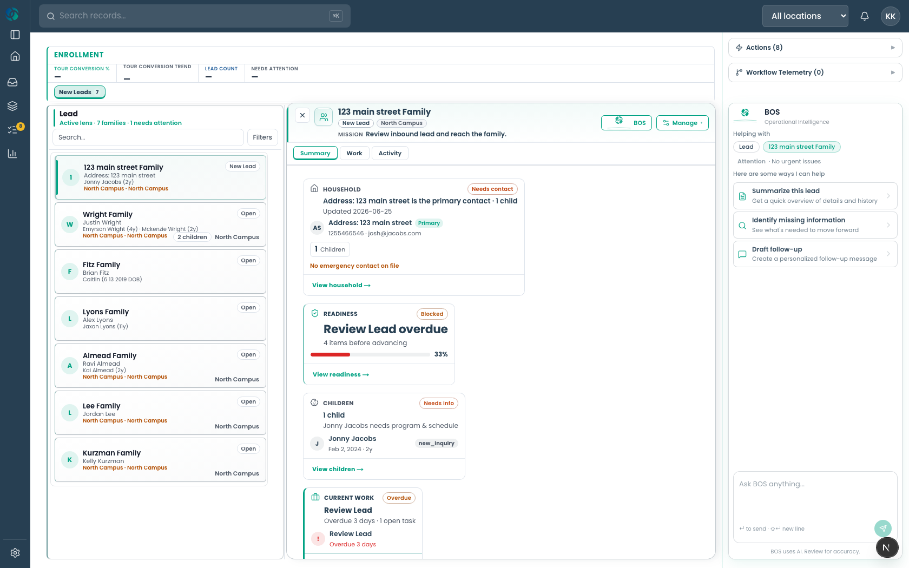
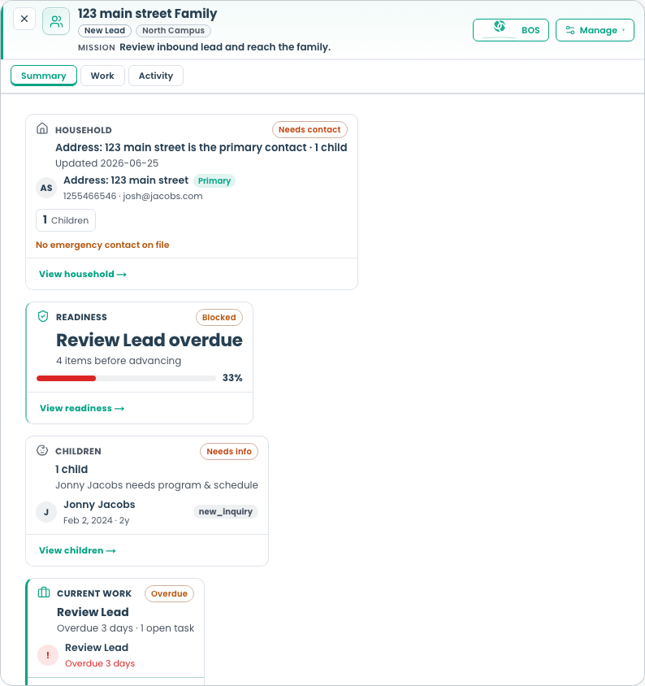
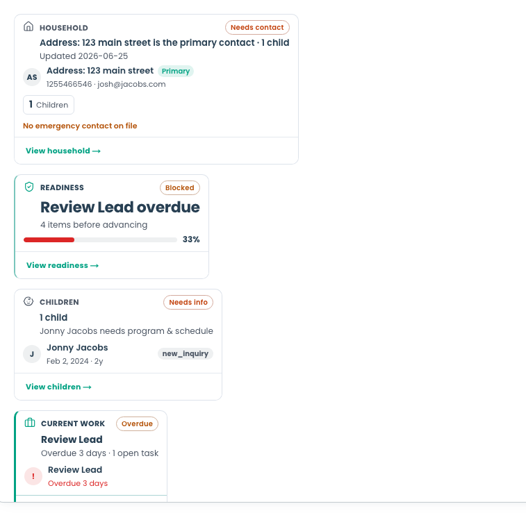
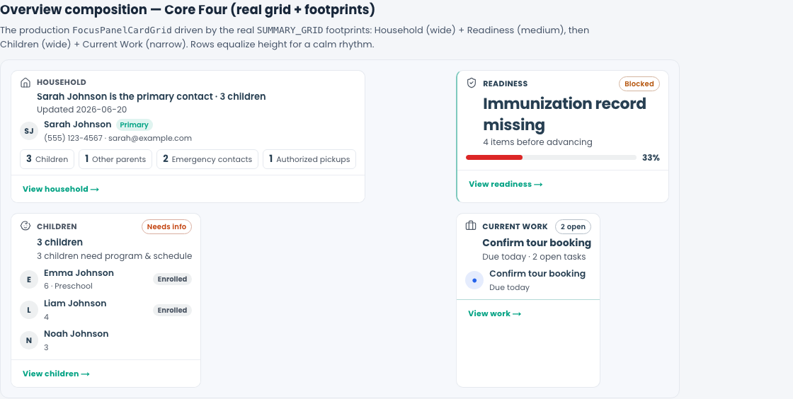

# Focus Panel Composition Review — Core Four

Sprint: **Alloy OS — Focus Panel Composition Review (Core Four)** · June 2026

Goal: make the **active operator Focus Panel** begin to feel like the operating
system defined by the approved card language — without adding cards or redesigning
the architecture. This is a review + targeted composition pass, not a rebuild.

---

## 1. Screenshots of the active Focus Panel

### Operator surface (real, authenticated record)

Route verified: `/workspace/work-unit/lifecycle-lead/<recordId>` →
`123 main street Family` (live enrollment lead, real Operational Context).



The Focus Panel now renders **exactly the Core Four** and nothing else. The
runtime probe of the live grid confirmed the cells:

```json
[{"key":"household","span":"2"},
 {"key":"readiness_kpi","span":"1"},
 {"key":"children","span":"2"},
 {"key":"current_work","span":"1"}]
```





### Composition preview (real grid + footprints, wider width)

Same production `FocusPanelCardGrid` + `SUMMARY_GRID` footprints + production
pure cards, rendered at a width that reaches three columns (fixture data):



> Reproduce: `/dev/household-card-verify` (top “Overview composition” section).

---

## 2. The central finding (read this first)

**“Three-column layout” = Queue ▸ Focus Panel ▸ BOS** — the operator shell, not
the card grid. The Focus Panel is the **narrow center column (~440px)**.

At ~440px the responsive card grid computes **one column**
(`computeFocusPanelGridColumns < 560 → 1`), so every cell renders full width and
the Core Four **stack vertically**. The footprint widths (wide / medium / narrow)
are therefore **invisible in the default operator shell today** — Household and
Children look the same width as Current Work and Readiness.

The footprint system itself is correct: when the same grid gets ≥820px (see
preview `10-…png`), Household + Readiness and Children + Current Work form two
**equal-height, aligned rows** — calm, not masonry. The constraint is *width*,
not the composition logic.

**Decision needed (no code change made yet — out of “do not redesign” scope):**

| Option | What it means | Tradeoff |
| --- | --- | --- |
| **A. Single-column stack is canonical** (recommended near-term) | Accept that the Focus Panel center column is ~440px and the Core Four stack. Footprints apply only to *expanded / immersive* perspectives and any future wide Focus Panel surface. Matches the approved Household mocks, which were drawn at ~360–440px. | Footprints are “design intent for later”, not visible day-one. |
| **B. Let the Focus Panel reclaim width** | When BOS is collapsed (or on wide monitors) allow the center column to grow past 560/820px so footprints express. | Touches the verified 3-pane shell sizing; bigger change, needs its own pass. |

This review implements everything that is safe under Option A and leaves Option B
as an explicit recommendation, because widening the shell would “redesign the
verified three-column layout”, which the sprint forbids.

---

## 3. Proposed footprint recommendations by archetype

A footprint = the **default width intent** of an archetype on a *width-bearing*
Overview (≥820px). Implemented as `system5FootprintForCard()` +
`footprintToGridSpan()` in `system5OperationalSurfaceSpec.ts`.

| Archetype / card | Footprint | Grid span (today) | Rationale |
| --- | --- | --- | --- |
| Household (Identity) | **Wide** | 2 | Identity + multi-group evidence needs two columns |
| Children (Collection) | **Wide** | 2 | Per-child rows read better wide |
| Communications | **Wide** | 2 | Thread/summary density |
| Current Work (Work) | **Narrow** | 1 | One question: “what’s next” |
| Tour (Process) | **Narrow** | 1 | Single scheduled fact |
| Readiness (Intelligence) | **Medium** | 1\* | Verdict + a few factors |
| Billing (Financial) | **Medium** | 1\* | Balance + a couple lines |
| Timeline / Activity | **Full** | row | Chronological, full bleed |

\* **Prototype limitation:** the active grid only expresses three integer widths
(`1`, `2`, `"row"`), so **`narrow` and `medium` both collapse to one column**.
To make `medium` sit visually *between* narrow and wide, move the grid base from
`{1, 2, row}` to a **6-unit fractional base** (narrow = 2/6, medium = 3/6,
wide = 4/6, full = 6/6). That is a deliberate follow-up (it touches the shared
responsive engine used by Work/Activity) and is **not** implemented here.

---

## 4. Composition recommendations

Implemented now:

- **Overview = Core Four only.** `SUMMARY_GRID` is scoped to Household, Readiness,
  Children, Current Work. The grid is driven by `footprintToGridSpan()` rather
  than a flat `span: 1`.
- **Paired rows for width-bearing layouts.** Row 1 = Household (wide) + Readiness
  (medium); Row 2 = Children (wide) + Current Work (narrow). At ≥3 columns these
  are two clean, full rows; at 1 column they stack (the real operator case).

Recommended next (needs a product decision, not done here):

- If staying single-column (Option A), the **linear stack order** is what matters.
  Current stack order is `Household → Readiness → Children → Current Work`
  (identity → verdict → collection → action). An alternative is
  `Household → Children → Current Work → Readiness` (identity grouped, then
  action, then verdict). Pick one against the approved interaction story.
- Keep all suppressed cards in the **Experience Builder catalog** so operators can
  re-add Communications / Documents / Tour later — they are suppressed, not gone.

---

## 5. Spacing / height review

- Grid gutter + padding raised from **12px → 14px** for a calmer rhythm.
- **Row rhythm fix:** the grid was `align-items: start` (content-sized cells →
  ragged bottoms = masonry feel). Overview now uses **`align-items: stretch`**, so
  cards in the same row equalize height. Work mode keeps `start` (it evolves on
  its own cadence). Visible in `10-…png`: Readiness stretches to Household’s
  height; Current Work stretches to Children’s.
- Tradeoff: stretch introduces some empty space below the shorter card in a row.
  This is the intended cost of “aligned rows, no masonry”.
- At 1 column (operator default) there is no masonry to fix — the stack is
  inherently aligned; the stretch rule only engages at ≥2 columns.

---

## 6. Summary cleanup

Removed from the Overview grid (card **models still built**, used by Work /
Activity / catalog — **not deleted**):

- Why Now (`attention`)
- Current Mission (`current_mission`)
- Enrollment Health (`health`)
- Tour (`tour_summary`)
- Communications (`communications`)
- Documents (`documents`)

Remaining in Overview: **Household · Readiness · Children · Current Work**.

---

## 7. Remaining differences vs approved mocks

- **Data quality, not layout:** the test lead’s primary contact name is literally
  `"Address: 123 main street"`, so the Household headline reads oddly
  (“Address: 123 main street is the primary contact”). Cosmetic to the record, not
  the card — will resolve with a clean real lead.
- **Width:** mocks imply visible wide/narrow contrast; the live narrow column hides
  it (see §2). Closes under Option B or in expanded perspectives.
- **Medium ≠ narrow:** not yet distinguishable (see §3 follow-up).
- Card chrome, status pills, dividers, evidence rows, and the Readiness gauge now
  match the approved direction (compare `02-…png` / `10-…png` to the Household
  mock set).

---

## Files changed

- `web/lib/adminV2/runtime/focusPanel/system5OperationalSurfaceSpec.ts` — footprint vocabulary + `system5FootprintForCard` / `footprintToGridSpan`.
- `web/lib/adminV2/runtime/focusPanel/deriveOpportunityFocusPanelCards.ts` — `SUMMARY_GRID` scoped to Core Four, footprint-driven spans.
- `web/app/adminV2/components/alloyOsRuntime.css` — grid gutter/padding + Overview row-rhythm stretch.
- `web/app/dev/household-card-verify/HouseholdCardVerify.tsx` — real-grid Overview composition preview.
- `web/playwright/tests/focus-panel-composition-review.spec.ts` — screenshot capture (gated by `PLAYWRIGHT_COMPOSITION_REVIEW=1`).
- Tests updated: `focusPanelCardPresentation`, `deriveOpportunityFocusPanelCards`, `focusPanelCardGrid` (footprint coverage).
