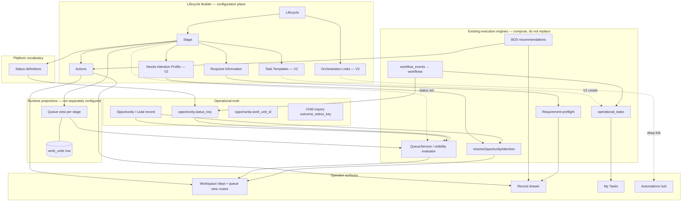

# Lifecycle Builder Hardening + Lifecycle V2 Canonical Model

**Path:** `docs/sprints/06_2026/lifecycle_builder_hardening_and_v2_canonical_model.md`  
**Status:** Discovery, hardening audit, and operating-model freeze — **do not implement** from this document  
**Date:** 2026-06-02  
**Prerequisite:** [`lifecycle_v2_discovery_and_operating_model.md`](./lifecycle_v2_discovery_and_operating_model.md) (domain architecture for NA, Tasks, Orchestration, status ownership)

**Goal:** Freeze architecture and hardening priorities **before** Lifecycle V2 implementation. No migrations, no new tables, no runtime behavior changes in this sprint.

---

## Executive summary

Lifecycle Builder V1 is **functionally complete for greenfield enrollment setup** but carries **UX friction**, **terminology debt**, and **architectural duplication** from rapid iteration (May–June 2026). The runtime execution plane is sound; the configuration plane needs hardening before adding V2 sections (Needs Attention authoring, Task templates, Orchestration linkage).

| Finding | Severity | V2 disposition |
|---------|----------|----------------|
| Three independent saves per stage (Required Info → Statuses → Queue) | High UX friction | **Merge** into single “Save stage” with ordered server transaction (pattern exists: `saveLifecycleStageRuntimeConfig`) |
| “Work Unit Queue” exposed as peer setup step | High conceptual | **Rename/reframe** as “Queue view” — output of stage, not separate object |
| Dual builder surfaces (Activation board vs Legacy hub) | Medium | **Retire** legacy hub; one primary surface |
| Duplicate field-rules stores | Medium | **Consolidate** builder-stage rules into one canonical path |
| `(config only)` / implementation leaks in Required Info | Medium | **Remove**; use enforcement-level language |
| Status draft sync complexity | Medium (mitigated) | **Harden** — keep reducer; reduce refetch invalidation |
| `enrollment-process/*` API naming vs lifecycle | Low–medium | **Alias/rename** routes in V2; keep handlers |
| `lifecycle_activation_v1` overlaps builder state | Low | **Demote** to audit pointer only |
| BOS not in builder | By design | **Link-out** in Orchestration section |

---

## 1. Current-State Audit

### 1.1 Existing architecture

```
┌─────────────────────────────────────────────────────────────────────────┐
│ Settings: /adminV2/settings/lifecycle                                    │
│  LifecycleBuilderPrimary → LifecycleActivationBoard (PRIMARY)            │
│  LifecycleHubClient (LEGACY — Advanced / legacy setup)                   │
└───────────────────────────────┬─────────────────────────────────────────┘
                                │
        ┌───────────────────────┼───────────────────────┐
        ▼                       ▼                       ▼
┌───────────────┐     ┌─────────────────┐     ┌──────────────────┐
│ Dept metadata │     │ work_units rows │     │ Global registries │
│ (JSON v1 keys)│     │ lifecycle_wu_*  │     │ status_definitions│
└───────────────┘     │ queue_definition│     │ action_*          │
        │             └─────────────────┘     └──────────────────┘
        │                       │
        └───────────┬───────────┘
                    ▼
┌─────────────────────────────────────────────────────────────────────────┐
│ Runtime (unchanged by builder alone)                                     │
│  lifecycleVisibilityEvaluator → QueueService → workspace routes          │
│  resolveActionsForContext · lifecycleFieldRuleEvaluator (preflight)       │
│  resolveOpportunityAttention · operational_tasks · workflow_events       │
└─────────────────────────────────────────────────────────────────────────┘
```

**Primary operator path today:**

1. Select or create lifecycle (catalog → department row).
2. Add/reorder stages (`lifecycle_builder_v1`).
3. Per stage — **guided board** four cards: Required Information → Statuses → Work Unit Queue → Validation slot.
4. Department-level **Actions Matrix** (separate from guided board).
5. Run activation validation; open workspace `/dept` → per-stage work unit pills.

### 1.2 Existing metadata structures

All durable builder config lives on **`departments.metadata`** unless noted.

| Metadata key | Purpose | Written by |
|--------------|---------|------------|
| `lifecycle_builder_v1` | Process + stages (id, key, label, order, active) | `PATCH …/lifecycle-builder` |
| `lifecycle_builder_owned_v1` | Canonical marker: dept created by builder | Department POST / repair |
| `lifecycle_activation_v1` | Last-touch activation audit (stage, WU id, status keys snapshot) | Activation board saves |
| `lifecycle_progression_requirements_v1` | Operator-stage field rules + legacy object labels | `PATCH …/lifecycle-requirements` |
| `lifecycle_builder_stage_field_rules_v1` | Per-**builder**-stage-key field rules (custom stages) | Same requirements API |
| `lifecycle_actions_matrix_order_v1` | Persisted row order for Actions Matrix | `PATCH …/lifecycle-actions-matrix` |
| `opportunity_attention_rules` | NA buckets, thresholds (not builder-authored today) | Attention & SLA settings / seeds |

**Work unit row (`work_units`):**

| Field / metadata | Purpose |
|------------------|---------|
| `key` | `lifecycle_wu_{stageKey}` — stable identity |
| `name` | Operator display name for queue view tab |
| `sort_order` | Synced from builder stage order |
| `queue_definition` | Status filters, grain, row preview, UI sections |
| `metadata.lifecycle_stage_key` | Back-link to builder stage |
| `metadata.status_keys` | Denormalized status filter list |
| `metadata.lifecycle_builder_owned_v1` | Builder-owned WU marker |

**Status definitions:**

| Field | Purpose |
|-------|---------|
| `status_definitions.metadata.enrollment_operator_stage` | Legacy operator-stage bucket (enrollment seed) |
| Status-stages API buckets | **Authoritative** stage ↔ status assignment for builder |

**Actions:**

| Store | Purpose |
|-------|---------|
| `action_definitions` | Handler + label (org or platform) |
| `action_placements` | Surface, slot, order; may tag `lifecycle_operator_stage` |

### 1.3 Existing runtime behavior

| Behavior | Mechanism |
|----------|-----------|
| **Stage visibility** | `opportunities.status_key` ∈ stage’s configured status set (`lifecycleVisibilityEvaluator`) |
| **Builder-owned WU queues** | No `work_unit_id` gate for membership — visibility lens only |
| **Assignment home** | `opportunities.work_unit_id` — execution routing; separate from visibility |
| **Queue generation** | Upsert `lifecycle_wu_{stage}` + write `queue_definition` filters from saved status keys |
| **Required info enforcement** | `runtime_enforced` rules only → action preflight + forms submit |
| **Actions on WU/drawer** | Placements filtered by `lifecycleBuilderActionVisibility` + stage key from WU metadata |
| **Needs Attention** | `resolveOpportunityAttention` — dept-wide, not stage-scoped in engine |
| **Tasks** | `operational_tasks` — not created by builder or workflows |
| **Workflows** | Not created by builder; fire on status/form/child events elsewhere |
| **BOS** | Runtime recommendations on GET; not configured in builder |
| **Activation validation** | `validateLifecycleActivationRuntime` — structural proof, read-only |

**Key APIs (configuration):**

| API | Role |
|-----|------|
| `GET/PATCH …/lifecycle-builder` | Process/stage CRUD |
| `GET/PATCH …/lifecycle-requirements` | Required Information |
| `GET/PATCH …/enrollment-process/status-stages` | Status ↔ stage assignment |
| `POST …/enrollment-process/stage-runtime-config` | **Canonical** atomic save: statuses + WU + queue filters |
| `GET …/enrollment-process/stage-work-unit` | WU snapshot + identity + `needs_sync` |
| `GET …/lifecycle-builder/stage-bootstrap` | Aggregated stage payload (cache on client) |
| `GET/PATCH …/lifecycle-actions-matrix` | Department actions matrix |
| `GET …/lifecycle-activation/validate` | Go-live validation |

### 1.4 Existing user workflows

**Greenfield administrator (happy path):**

1. Settings → Lifecycle → Create lifecycle → name appears on workspace as department tile.
2. Stages listed in nav (Enrollment template: Lead → … → Enrolled, or custom stages).
3. For each stage: set required fields → assign statuses → save work unit queue → check validation.
4. Configure Actions Matrix (enable actions, labels, placements, stage restrictions).
5. Open workspace → `/dept/{lifecycle}` → click stage pill → operate queue.

**Friction paths (observed):**

- Saves statuses but forgets Work Unit Queue save → empty or stale queue until repair.
- Custom stage (`enrolling`) requires builder-stage APIs — fixed but operators don’t know alias rules.
- Legacy hub still reachable — different step order and duplicate cards.
- `(config only)` on required fields → distrust of “Required” toggle.
- `needs_sync` / `conflict` on work unit card → implementation states visible to operators.

### 1.5 Existing lifecycle terminology

| Term in product | Technical meaning | Operator mental model |
|-----------------|-------------------|------------------------|
| **Lifecycle** | Department + `lifecycle_builder_v1` process | “My enrollment process” |
| **Stage** | Builder stage record | “Step families go through” |
| **Status** | `status_key` on opportunity | “Where this lead is in CRM” |
| **Work Unit** | `work_units` row + route | Often confused with stage or department |
| **Work Unit Queue** | Queue view config card | Sounds like separate product object |
| **Required Information** | Field rules metadata | “What we need to collect” |
| **Actions Matrix** | Placement editor | “Buttons staff see” |
| **Needs Attention** | Attention overlay + buckets | “Overdue / blocked work” |
| **Activation** | Validation + audit metadata | Unclear vs “publish” |
| **Operational Queue** | Deprecated label | Removed in stabilization — still in old docs |
| **Lead** | `primary_record_label` default | Entity label for opportunity |

---

## 2. UX Audit

### 2.1 Confusing terminology

| Issue | Example | Recommendation |
|-------|---------|----------------|
| **Work Unit vs Stage** | “Save Work Unit Queue” after configuring a **stage** | Rename to **“Queue view”** or **“Stage queue”** |
| **Work Unit vs Department** | Workspace “department tile” = lifecycle | Clarify: **Lifecycle** = workspace tile name |
| **Activation vs Go live** | “Activation validation” | **“Ready check”** or **“Publish checklist”** |
| **Status vs Stage** | Stage named “Tour”; status `tour_scheduled` | Inline helper: “Statuses are labels on each lead; stages group them for your team” |
| **Required vs Enforced** | “Required” + `(config only)` | **Required (guidance)** vs **Required (blocks actions)** |
| **Enrollment Process API paths** | `/enrollment-process/…` for all lifecycles | Rename to `/lifecycle/…` in V2 (aliases) |
| **Config only** | Implementation flag in UI | **Remove** from operator UI entirely |

### 2.2 Duplicate concepts

| Duplication | Locations | V2 action |
|-------------|-----------|-----------|
| **Two builder UIs** | `LifecycleActivationBoard` vs `LifecycleHubClient` | Remove legacy hub from default nav |
| **Two field-rule stores** | `lifecycle_progression_requirements_v1` vs `lifecycle_builder_stage_field_rules_v1` | Single writer; merge read path (already partially unified in API payload) |
| **Object labels vs field rules** | `required_labels` derived from `field_rules` | Stop surfacing object labels in builder; field-level only |
| **activation_v1 vs builder_v1** | Activation stores last stage snapshot | Keep activation as audit only; don’t duplicate editable state |
| **enrollment_operator_stage vs status-stages buckets** | Status row metadata vs API buckets | Status-stages API is authoritative; migrate off row metadata over time |
| **Legacy `enrollment_pipeline` WU vs `lifecycle_wu_*`** | Old tenants | Repair/converge; builder-owned uses per-stage WUs only |
| **QueueService NA vs attention resolver** | Lane overlay vs v2 resolver | Document single resolver as truth; deprecate lane duplicate long-term |
| **Actions: guided “Actions” step removed vs Actions Matrix** | Stabilization removed per-stage actions | One **Actions** section at lifecycle or stage level — not both patterns |

### 2.3 Builder friction

| Friction | Detail |
|----------|--------|
| **Three saves per stage** | Required Info, Statuses, Work Unit Queue are separate buttons with ordering dependencies |
| **Save order enforced by UI** | Queue save disabled until statuses saved — easy to think stage is “done” after statuses |
| **Actions Matrix is elsewhere** | Not in guided board; department-level only |
| **No single “stage complete” indicator** | Four card statuses — no rollup |
| **Stage switch refetch** | Bootstrap + status-stages reload on every stage change |
| **Custom stage palette** | Custom keys use reduced palette — not obvious |
| **Repair flows exposed** | Catalog repair, WU repair, visibility repair — admin-only should stay dev/support |

### 2.4 Excessive clicks

| Task | Clicks / steps today | Target (V2 hardened) |
|------|----------------------|----------------------|
| Configure one stage fully | 3 saves + possible queue name edit + scroll 4 cards | 1 **Save stage** + optional expand advanced |
| Toggle one required field | 1 toggle + Save Required Information | Auto-save field rules or batch in Save stage |
| Assign 5 statuses | 5 toggles + Save Statuses + Save Work Unit Queue | Same save as above |
| Enable action on drawer | Leave builder → Actions Matrix → find row → save | Stage **Actions** subsection or link with return path |
| Understand NA for stage | Read card → link to Attention & SLA | Inline summary + edit in builder V2 |

### 2.5 Save / reload issues

Documented fixes (June 2026 — [`lifecycle_builder_configuration_completion_fixes.md`](./lifecycle_builder_configuration_completion_fixes.md)):

| Issue | Root cause | Current mitigation |
|-------|------------|-------------------|
| Status selections cleared after click | Bootstrap overwrote dirty draft | `lifecycleStatusDraftReducer` + dirty guards |
| Save Statuses but queue empty | Separate save paths; stale payload | `saveLifecycleStageRuntimeConfig` atomic path |
| Complete shown but DB empty | Metadata normalizer stripped custom stage keys | Fixed in status save path |
| Pipeline null wiped WU after save | Guided board called `onPipelineUpdated(null)` | Fixed — don’t pass stale null |
| Double submit | Rapid clicks | `savingRef` guards |

**Remaining reload issues:**

| Issue | Behavior |
|-------|----------|
| Field requirements reload after save | Full `loadConfig` when not using prefetch — card flash |
| Bootstrap cache | Module-level cache in `useLifecycleStageBootstrap` — can show stale data until `force` refresh |
| Stage switch | `bootLoading` / multiple parallel fetches — header flicker |
| Actions Matrix | Full reload on mount every time department changes |
| Workspace tile cache | Requires manual bust event after lifecycle create — fixed but implicit |

### 2.6 Visual instability

| Area | Issue |
|------|-------|
| Guided cards | Fixed `380px` height — cramped for long status lists |
| Required info scroll | Nested scroll inside card |
| Status / Complete badges | State transitions on async save completion |
| Work unit identity states | Amber `needs_sync`, conflict messages — technical |
| Debug panels | `NEXT_PUBLIC_LIFECYCLE_DEBUG_UI` — must not ship to prod operators |

### 2.7 Implementation details leaking into UX

| Leak | Where | Fix |
|------|-------|-----|
| `(config only)` | `LifecycleStageFieldRequirementsEditor` | Enforcement level labels |
| `needs_sync` / `not_created` | `LifecycleStageWorkUnitCard` | Operator copy: “Queue not published yet” / “Update needed” |
| `lifecycle_wu_*` keys | Validation messages, debug | Never show internal keys |
| `work_unit_id` | Validation compact rows | Say “queue view” |
| Explicit-only vs bucket status keys | Handoff errors | Single user message: “Save statuses again to refresh queue” |
| Enrollment pipeline snapshot | Legacy pipeline load in board | Hide when builder-owned |

### 2.8 Focused evaluations

#### Work Unit configuration

- **Today:** Third guided card; operator names queue; save upserts `lifecycle_wu_{stage}`; shows sync state.
- **Problems:** Sounds like configuring a separate product object; “Save Work Unit Queue” after statuses feels redundant; pipeline snapshot concept from legacy enrollment.
- **V2:** Collapse into stage save; show read-only preview: “Records with statuses X, Y, Z appear here”; optional display name field only.

#### Required Information experience

- **Today:** Entity dropdown + Off/Rec/Req toggles; waitlist helper text; bootstrap prefetch.
- **Problems:** `(config only)` undermines Required; no forms coverage inline in activation board (legacy hub had forms card).
- **V2:** Enforcement tiers; forms coverage badge per field where supported; link to Form Detail.

#### Actions Matrix experience

- **Today:** Department-wide table; enable, label, placements checkboxes, stage restriction multi-select, row reorder.
- **Problems:** Disconnected from stage context; uses operator stage keys only in restriction UI (custom stages partially unsupported); save reloads entire matrix.
- **V2:** Stage-scoped **Actions** tab with “also edit in full matrix” link; preserve department matrix for power users.

#### Lifecycle save behavior

- **Today:** Multiple PATCH endpoints; atomic `stage-runtime-config` exists but guided board still uses separate saves for required info.
- **V2 hardened:** One **Save stage** → server transaction: field rules + status assignment + queue upsert + optional activation audit bump.

---

## 3. Work Unit Doctrine

### 3.1 What is a Work Unit today?

In builder-owned lifecycle mode, a **work unit** is:

1. A **database row** (`work_units`) keyed `lifecycle_wu_{stageKey}` within a department.
2. A **workspace route** (`/adminV2/workspace/dept/{deptId}/work-unit/{wuId}`).
3. A **queue definition** (`queue_definition`) declaring which opportunity statuses appear in that view.
4. A **nav pill** on the department shell (sibling stage queues + Needs Attention row).

It is **generated and synchronized from stage configuration**, not independently authored.

### 3.2 Is it a first-class lifecycle object?

**No — not for operators.** It is a **runtime projection** of a stage. Evidence:

- Created by stage save / `saveLifecycleStageRuntimeConfig`, not by “Create work unit” intent.
- Metadata always includes `lifecycle_stage_key`.
- Visibility evaluator treats it as a **lens anchor**, not an ownership container.
- Sort order mirrors builder stage order (`syncWorkUnitSortOrderFromBuilder`).

Internal platform code correctly treats WU as infrastructure; **operator UI incorrectly elevates it** to a guided-board step equal to Required Information and Statuses.

### 3.3 Is it a runtime queue generated from a stage?

**Yes.** Queue membership = `opportunity.status_key` matches stage’s assigned status set (builder-owned mode). Display name, row preview fields, and presentation mode are presentation concerns on the same row.

### 3.4 Should V2 expose it differently?

**Yes.**

| Today | V2 recommendation |
|-------|-------------------|
| “Work Unit Queue” card | **“Queue view”** subsection under Stage — preview + display name |
| Separate save button | Included in **Save stage** |
| `needs_sync` states | **“Publish queue view”** / **“Out of date — save stage again”** |
| System `/admin/system/work-units` | Unchanged for non-lifecycle WUs; lifecycle WUs **not editable** there |
| Workspace label “Work Units” pill row | **Stage names** as pills (already mostly true) — NA row stays separate overlay |

**Doctrine statement (canonical):**

> **Stage** is what administrators configure. **Queue view** is what staff use to work records in that stage. Internally this maps to a work unit row; operators should not need the term “work unit” in Lifecycle Builder.

---

## 4. Lifecycle V2 Canonical Model

### 4.1 Entity relationships

```
Lifecycle (1) ──contains──▶ Stage (N)
                              │
                              ├──defines──▶ Status set (which CRM statuses = in stage)
                              ├──defines──▶ Required Information (field rules)
                              ├──defines──▶ Action placements (surfaces)
                              ├──defines──▶ Task templates (V2 — on entry)
                              ├──defines──▶ Attention profile slice (V2 — which signals matter)
                              └──projects──▶ Queue view (1 per stage — runtime WU)

Status (global CRM vocabulary) ──assigned to──▶ Stage
Record (Opportunity) ──has──▶ Status ──determines──▶ visible in Queue view(s)

Needs Attention ──overlays──▶ Queue views / dept lane (not a stage)
Task ──attached to──▶ Record (opportunity); may be suggested by Stage template
Workflow ──listens to──▶ Events (status, form, child); not owned by Lifecycle config
BOS ──reads──▶ Runtime signals; proposes Actions / Tasks / Workflows (human apply)
```

### 4.2 Cardinality rules

| Relationship | Cardinality | Notes |
|--------------|-------------|-------|
| Lifecycle → Stage | 1:N | Ordered |
| Stage → Queue view | 1:1 | Auto-provisioned; internal WU row |
| Stage → Status keys | N:M | Typically many statuses one stage; one primary stage per status is convention |
| Record → Assignment home | 1:1 | `work_unit_id` — execution default |
| Record → Visible queue views | 0:N | Via status + lenses; not assignment |
| Stage → Required field rules | 1:N | Required + recommended |
| Stage → Task template | 0:N | V2 |
| Lifecycle → NA buckets | 1:N | Dept-scoped; overlay |

### 4.3 Canonical diagram



### 4.4 What survives into V2

| V1 artifact | V2 status |
|-------------|-----------|
| `lifecycle_builder_v1` | **Keep** — core process/stage store |
| `lifecycle_builder_owned_v1` | **Keep** |
| Per-stage queue via `lifecycle_wu_*` | **Keep** — implementation of Queue view |
| `lifecycleVisibilityEvaluator` | **Keep** |
| `saveLifecycleStageRuntimeConfig` | **Keep** — expand to include field rules in one save |
| Status-stages API | **Keep** — rename path optional |
| Actions Matrix | **Keep** — add stage-scoped entry point |
| Field rules catalog + bindings | **Keep** — expand enforcement |
| Activation validation | **Keep** — rename operator copy |
| `lifecycle_activation_v1` | **Demote** — audit trail only |
| Legacy hub UI | **Remove** from default IA |
| `(config only)` UX | **Remove** |
| Separate Work Unit Queue save step | **Remove** — merge into Save stage |
| `lifecycle_progression_requirements_v1` vs builder stage split | **Consolidate** writes |

### 4.5 Rename / relocate / simplify / remove

| Item | Action |
|------|--------|
| Work Unit Queue (label) | **Rename** → Queue view |
| Work unit (operator docs) | **Remove** → Stage queue / queue view |
| LifecycleHubClient | **Relocate** → Advanced only, then **remove** |
| `(config only)` | **Remove** |
| Object-level required labels in builder | **Remove** from UI (keep derived for legacy evaluators until unified spine) |
| Operational Queue | **Remove** (already deprecated) |
| enrollment-process API segment | **Rename** → lifecycle-process (alias) |
| Debug panels in production | **Remove** / gate behind dev role |
| LifecycleNeedsAttentionCard | **Relocate** → full NA section in V2 |
| Three per-stage saves | **Simplify** → one Save stage |
| Pipeline snapshot load on board | **Remove** for builder-owned depts |

---

## 5. Lifecycle V2 Information Architecture

### 5.1 Navigation structure (recommended)

```
Settings → Lifecycles
├── Lifecycle picker (catalog list)
└── Lifecycle workbench
    ├── Header: lifecycle name · Add stage · Delete · Ready check
    ├── Stage nav (left rail or horizontal tabs)
    └── Stage workspace (main)
        ├── [Stage name] summary strip (status count, queue preview, completeness)
        ├── Sections (accordion or vertical nav):
        │   1. Overview (purpose, typical actions — read-only hints)
        │   2. Required Information
        │   3. Statuses
        │   4. Queue view (preview + display name)
        │   5. Actions
        │   6. Tasks (V2)
        │   7. Needs Attention (V2)
        │   └── Advanced ▸ Forms coverage · Orchestration links
        └── Primary CTA: Save stage
    └── Lifecycle-wide sections (top-level tabs):
        ├── Actions Matrix (power view)
        ├── Needs Attention (lifecycle profile — V2)
        ├── Orchestration (links — V2)
        └── Ready check (validation)
```

### 5.2 Section organization principles

1. **Stage-first** — all stage-scoped config lives under the selected stage.
2. **One primary save** per stage for Required Info + Statuses + Queue view.
3. **Lifecycle-wide** only for cross-cutting: Actions Matrix, NA profile, Orchestration, Ready check.
4. **Advanced** tucks forms coverage, API debug, repair tools.

### 5.3 Progressive disclosure

| Level | Audience | Surfaces |
|-------|----------|----------|
| **Essential** | Center director | Stages, Required Info, Statuses, Queue preview, Save stage |
| **Standard** | Admin lead | + Actions, Ready check |
| **Advanced** | Implementer / support | Actions Matrix full, Orchestration, Attention thresholds, repair |

### 5.4 Terminology updates (operator glossary)

| Old | New |
|-----|-----|
| Work Unit Queue | **Queue view** |
| Work unit | *(internal only)* |
| Activation validation | **Ready check** |
| Required (config only) | **Recommended** or **Required — guidance** |
| Primary record | **[Entity label]** e.g. Lead |
| Status key | **Status** |
| lifecycle_wu_* | *(never shown)* |
| Automations | **Automations** (unchanged — familiar) |
| Orchestration | **Connections** or **Automations & follow-up** (avoid collision with Automations hub) |

Optimize copy for **non-technical administrators**: describe outcomes (“Families with these statuses appear here”) not mechanisms (“queue_definition status filter”).

---

## 6. Builder Hardening Plan

**Scope:** Configuration plane only — no QueueService or visibility semantic changes.

### 6.1 Trust issues (prioritized)

| Issue | User impact | Recommended fix |
|-------|-------------|-----------------|
| Required fields don’t block | Operator sets Required; actions still run | Enforcement level badges + tooltips; expand enforced catalog deliberately |
| Save appears done but queue empty | Statuses saved without queue sync | Single Save stage using `saveLifecycleStageRuntimeConfig` + include field rules PATCH in transaction |
| Status selections “jump” | Lost trust on custom stages | Keep reducer; add optimistic UI lock during save; no bootstrap sync while `saving` |
| Stale counts on workspace | Tile cache | Auto-bust workspace dept cache on any stage save success |
| Actions don’t appear on WU rail | Matrix saved but wrong stage filter | Post-save smoke hint in Ready check; stage-scoped preview |

### 6.2 Save flashes and reload behavior

| Fix | Implementation note |
|-----|---------------------|
| **Optimistic saved state** | After PATCH success, patch bootstrap cache via `useLifecycleStageBootstrap.patch()` — already exists; use consistently for all three domains |
| **Avoid full reload** | Field requirements: merge PATCH response into local state instead of `loadConfig()` |
| **Skeleton only on first load** | Stage switch: show prior stage until fetch completes (stale-while-revalidate) |
| **Debounced dirty** | Field toggles: optional 300ms debounce before enabling Save — or auto-save |
| **Single flying save** | Extend `savingRef` pattern to board-level Save stage mutex |

### 6.3 State resets

| Scenario | Guard |
|----------|-------|
| Stage switch while dirty | Confirm dialog: “Unsaved changes on {stage}” |
| Catalog refresh | Don’t reset `stageKey` if still valid |
| Bootstrap race | `shouldSyncStatusDraftForStage` / `shouldApplyServerStatusKeysForStage` — keep; add integration test |
| Process switch | Clear drafts keyed by process id |

### 6.4 Excessive re-fetching

| Source | Recommendation |
|--------|----------------|
| `useLifecycleStageBootstrap` on every stage change | Keep cache; invalidate key on save for that stage only |
| Full status-stages reload | PATCH response merges into local payload |
| Actions Matrix reload | Return updated rows from PATCH; no full GET |
| Department list on every save | Only on create/delete/rename lifecycle |

### 6.5 Missing optimistic updates

| Surface | Recommendation |
|---------|----------------|
| Required info toggles | Local draft immediate; save confirms |
| Status checkboxes | Already local draft — commit on save |
| Queue display name | Local until Save stage |
| Actions matrix enable toggle | Row-level optimistic with rollback on error |

### 6.6 Hardening acceptance criteria (Phase 1)

- [ ] One **Save stage** persists field rules + statuses + queue view atomically.
- [ ] No `(config only)` or internal keys in operator UI.
- [ ] Stage switch never silently discards dirty draft.
- [ ] Bootstrap cache invalidated surgically after save — no full-card flash.
- [ ] Ready check passes imply workspace queue counts match status assignment (existing validation + manual QA).
- [ ] Legacy hub hidden from default Settings path.
- [ ] All hardening tests green: status draft, runtime config contract, WU identity, builder configuration completion.

---

## 7. V2 Implementation Roadmap

### Phase 1: Lifecycle Builder Hardening

**Goal:** Trustworthy single-stage save; terminology cleanup; retire dual UI.

| Work item | Type |
|-----------|------|
| Unified Save stage (field rules + `saveLifecycleStageRuntimeConfig`) | UX + API composition |
| Rename Work Unit Queue → Queue view | Copy |
| Remove `(config only)`; enforcement level labels | Copy + API payload |
| Bootstrap cache surgical invalidation | Client |
| Dirty-stage switch guard | Client |
| Hide legacy `LifecycleHubClient` from default nav | IA |
| Workspace cache bust on stage save | Client event |
| Consolidate field rules write path | Server metadata |

**Exit:** Operator configures stage in one save; Ready check trustworthy; no implementation leaks.

---

### Phase 2: Required Information V2

**Goal:** Clear enforcement; forms integration in builder.

| Work item | Type |
|-----------|------|
| Enforcement level model (guidance vs enforced) | Catalog + UI |
| Inline forms coverage badges on fields | UI + existing coverage API |
| Bridge enforced gaps → Needs Attention reason (stub config) | Metadata + docs |
| Promote additional catalog rules to `runtime_enforced` | Platform catalog |

**Exit:** Administrators understand what Required means; forms alignment visible in builder.

---

### Phase 3: Needs Attention

**Goal:** Lifecycle-level attention profile authoring (compose existing resolver).

| Work item | Type |
|-----------|------|
| `lifecycle_attention_profile_v1` metadata schema | Config |
| Builder NA section: bucket enablement + threshold links | UI |
| Stage → signal mapping (read-only preview → editable) | UI |
| New platform codes: `missing_required_info`, `operational_task_overdue` | Resolver (future runtime — spec only in this freeze) |

**Exit:** NA configurable per lifecycle without new rules engine.

---

### Phase 4: Task Templates

**Goal:** Stage entry task defaults via existing `operational_tasks`.

| Work item | Type |
|-----------|------|
| `lifecycle_stage_task_templates_v1` metadata | Config |
| Builder Tasks section (template CRUD) | UI |
| `create_task` action → create modal on opportunity | Action UX |
| Stage-entry hook or workflow action spec | Orchestration spec |

**Exit:** Templates defined in builder; creation path documented and partially wired.

---

### Phase 5: Orchestration

**Goal:** Link builder to Automations without embedding workflow editor.

| Work item | Type |
|-----------|------|
| Orchestration card: suggested triggers per stage | UI read-only |
| Health: enabled workflows for dept scope | UI |
| Optional `requirement_satisfied` event spec | Platform doc + registration plan |
| Deep links to `/adminV2/workflows` | IA |

**Exit:** Operators understand side effects live in Automations; builder shows connections.

---

### Phase 6: Child-Grain Lifecycle Expansion

**Goal:** Waitlist/enrollment stages filter on child disposition where appropriate.

| Work item | Type |
|-----------|------|
| Dual status picker: case vs child grain per stage | Builder UX |
| Queue view `grain` configuration in stage save | Config |
| Candidate-grain NA reasons (spec) | Resolver |
| Rollup workflow templates (disabled seeds) | Automations |
| Mixed-household operator copy in Ready check | Validation messaging |

**Exit:** Child-specific enrollment stages configurable without breaking case-coordination stages.

---

## Appendix A — Architectural duplication matrix

| Concept | Store A | Store B | Canonical | Action |
|---------|---------|---------|-----------|--------|
| Stage list | `lifecycle_builder_v1` | — | A | — |
| Field rules (operator stage) | `lifecycle_progression_requirements_v1` | — | A | Merge custom into B below |
| Field rules (builder stage key) | — | `lifecycle_builder_stage_field_rules_v1` | B for custom | Unified API writer |
| Last edited stage | `lifecycle_activation_v1` | Builder stages | Builder | Demote activation |
| Status assignment | status-stages API | `enrollment_operator_stage` on rows | API | Deprecate row metadata |
| Queue filters | `queue_definition` | `metadata.status_keys` | Both synced | Single save |
| NA buckets | dept metadata | WU metadata | Dept → WU precedence | Lifecycle profile |
| Attention evaluation | `resolveOpportunityAttention` | `QueueService.opportunityNeedsAttention` | Resolver | Lane parity tests |

---

## Appendix B — BOS interactions (current)

| Touchpoint | Behavior |
|------------|----------|
| Lifecycle Builder | **No BOS authoring** — by design |
| Actions Matrix | `ask_bos` may be placed via Settings; not lifecycle-specific |
| Workspace queue row | Ask BOS handoff when placement exists |
| Drawer | Operational recommendation from resolver |
| Task Assist | Creates tasks/comms from opportunity context — not lifecycle-stage-aware |
| Workflow Assist | Scaffolds workflows in Automations — not linked from builder |

**V2:** Orchestration section links to Automations; BOS remains runtime-only. Optional: BOS proposes task template text when Phase 4 templates exist.

---

## Appendix C — Files inspected

| Area | Key paths |
|------|-----------|
| Primary UI | `LifecycleBuilderPrimary.tsx`, `LifecycleActivationBoard.tsx`, `LifecycleStageGuidedBoard.tsx`, `LifecycleHubClient.tsx` |
| Stage config | `LifecycleStageConfiguration.tsx`, `LifecycleStatusesCard.tsx`, `LifecycleStageFieldRequirementsEditor.tsx`, `LifecycleStageWorkUnitCard.tsx` |
| Actions | `LifecycleActionsMatrix.tsx`, `lifecycleActionsMatrix.ts` |
| State / save | `lifecycleStatusDraftReducer.ts`, `saveLifecycleStageRuntimeConfig.ts`, `useLifecycleStageBootstrap.ts` |
| Metadata | `lifecycleBuilderConfig.ts`, `lifecycleActivationConfig.ts`, `lifecycleBuilderStageFieldRules.ts` |
| Runtime | `lifecycleVisibilityEvaluator.ts`, `lifecycleStageWorkUnit.ts`, `validateLifecycleActivationRuntime.ts` |
| Sprint history | `lifecycle_builder_configuration_completion_fixes.md`, `lifecycle_builder_stabilization_pass.md`, `lifecycle_builder_ux_coherence_pass_2.md` |

---

## Appendix D — Decision log (freeze)

1. **Stage is the operator primary concept; queue view is its runtime projection.**
2. **One Save stage** is the hardening north star before V2 feature sections.
3. **No parallel workflow or attention engines** — metadata + links only.
4. **Legacy hub retires** from default IA after hardening.
5. **Child-grain expansion is Phase 6** — after builder trust is restored.
6. **Implementation must not change runtime visibility semantics** during Phase 1 hardening — config plane and copy only unless explicitly a bugfix with tests.

---

*End of document — architecture frozen for V2 implementation planning.*
