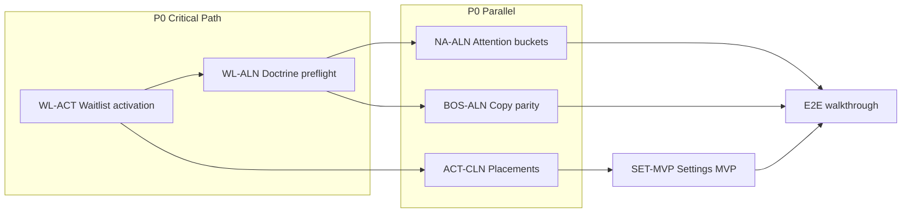

# Lifecycle Runtime & Configuration Alignment Sprint

**Path:** `docs/sprints/06_2026/lifecycle_runtime_configuration_alignment_sprint.md`  
**Status:** In progress (May 2026) — Phase 1–6 implemented; Phase 7 manual walkthrough pending on pilot org  
**Prior sprint:** Lifecycle Configuration & Requirement Engine — **CLOSED**

**Doctrine (canonical):** Lead → Qualification → Tour → Waitlist → Enrollment → Enrolled

**Deliverables:**

1. [Lifecycle Runtime Alignment Matrix v1](./lifecycle_runtime_alignment_matrix_v1.md) — Phase 1
2. Action Placement Audit — Phase 2 (this doc §2)
3. Settings Alignment Audit — Phase 3 (this doc §3)
4. P0 Runtime Alignment Backlog — Phase 4 (this doc §4)
5. Recommended implementation order — Phase 5 (this doc §5)

**Inputs:** `lifecycle_sprint_final_coverage_closeout_audit_v1.md`, `adminv2_action_runtime_audit_and_plan_v1.md`, `lifecycle_information_matrix_v1.md`, `action_button_lifecycle_alignment_audit.md`, `configuration-system.md`, runtime code paths listed in matrix references.

**Guardrails (this sprint):**

- Do **not** build recurring tasks, checklist templates, workflow builders, new settings frameworks, or new lifecycle engines.
- Prefer existing layouts, placements, statuses, work units, and Settings infrastructure.
- Objective: **alignment and configuration exposure**, not platform expansion.

---

## Phase 2 — Action Placement Audit

**Method:** Cross-reference action inventory (closeout § Part 2), lifecycle matrix, and action runtime audit. Classify every high-traffic action by should-exist, runtime type, placement, status, and configurability. Flag duplicates, hidden actions, placeholders, misplaced actions, and lifecycle mismatches.

**Runtime type legend:** Capture First | Execute Now | Open Modal | Communication | Open Record | Open Drawer

**Placement legend:** Header | Section | Queue | Needs Attention | BOS | Other (tour bar, shell chrome, inline PATCH)

**Status legend:** Working | Partial | Placeholder | Deprecated

---

### 2.1 Lifecycle transition & tour actions

| Action key | Should exist | Runtime type | Placement | Status | Configurable | Lifecycle stage(s) | Finding |
|------------|--------------|--------------|-----------|--------|--------------|-------------------|---------|
| `create_lead` | Yes | Capture First | Other (WU right rail) | Working | Yes | Lead (entry) | OK |
| `move_to_qualification` | Yes | Execute Now | Header, Queue | Working | Yes | Lead → Qualification | OK; no child gate by design |
| `mark_lost` | Yes | Open Modal | Header overflow, Queue | Working | Yes | All pre-enrolled | OK |
| `schedule_tour` | Yes | Open Modal | Header, Section | Working | Yes | Qualification, Tour, Waitlist | Preflight on execute only — correct |
| `reschedule_tour` | Yes | Open Modal | Header, Other (tour bar) | Partial | Yes | Tour | **Duplicate path** with tour bar |
| `confirm_tour` | Yes | Execute Now | Section, Other (tour bar) | Working | Yes | Tour | **Duplicate path** — acceptable for demo |
| `record_tour_outcome` | Yes | Open Modal | Header, Other (tour bar) | Working | Yes | Tour | OK |
| `move_to_waitlist` | Yes | Execute Now | Header | **Placeholder** | Yes (when active) | Qualification, Tour, Enrollment | **P0 gap** — inactive definition |
| `approve_enrollment` | Yes | Execute Now | Header overflow | Working | Yes | Enrollment | **Misplaced** when visible in Tour/Qualification overflow |
| `remove_from_waitlist` | Yes | Execute Now | Header, Queue | Placeholder | Yes | Waitlist | Stub only |
| `reopen_lead` | Yes | Execute Now | Overflow | Placeholder | Yes | Lost | Stub only |
| `reserve_spot` | Yes (P2) | Execute Now | Section | Placeholder | Yes | Enrollment | Deferred |
| `mark_won` | **No** | Execute Now | — | Deprecated | — | — | **Remove/hide** — use `approve_enrollment` |
| `qualify_opportunity` | **No** | Execute Now | — | Deprecated | — | — | **Remove/hide** — use `move_to_qualification` |
| `contact_attempted` | **No** | Open Modal | Legacy org | Deprecated | — | — | Legacy status conflation |

---

### 2.2 Record creation & household actions

| Action key | Should exist | Runtime type | Placement | Status | Configurable | Lifecycle stage(s) | Finding |
|------------|--------------|--------------|-----------|--------|--------------|-------------------|---------|
| `add_child` | Yes | Capture First | Section, Other (shell chrome) | Working | Yes | Lead → Enrollment | Pass A converged |
| `add_sibling` | Yes | Capture First | Section, Other (shell chrome) | Working | Yes | Lead → Enrollment | Same modal as add_child |
| `add_family_member` | Yes | Capture First | Section (`family_contacts`) | Working | Yes | Lead → Enrollment | Pass B canonical |
| `add_related_person` | Yes | Capture First | Section (legacy placement often off) | Partial | Yes | Lead → Enrollment | Same modal; placement drift |
| `assign_classroom` | Yes | Open Record | Section | Working | Yes | Qualification → Enrollment | Focus/scroll only — OK |
| `assign_schedule` | Yes | Open Record | Section | Working | Yes | Qualification → Enrollment | OK |
| `set_start_date` | Yes | Open Record | Section | Working | Yes | Qualification → Enrollment | OK |
| `add_note` | Yes | Capture First | Header overflow | Working | Yes | Universal | OK |
| `upload_document` | Yes | Open Drawer | Optional header | Partial | Yes | Enrollment+ | **Hidden** unless placed |
| `review_enrollment_packet` | Yes | Open Modal | Header overflow | Working | Yes | Enrollment | OK |
| `request_missing_information` | Yes | Communication | Section | Working | Yes | Enrollment | Alias to send_form — OK |
| Inline field PATCH | Yes | Capture First | Layout | Working | Partial (layouts) | All | Not an action key — OK |

---

### 2.3 Communication & forms

| Action key | Should exist | Runtime type | Placement | Status | Configurable | Lifecycle stage(s) | Finding |
|------------|--------------|--------------|-----------|--------|--------------|-------------------|---------|
| `send_email` | Yes | Communication | Queue, optional header | Working | Yes | Universal | Header default off |
| `send_sms` | Yes | Communication | Queue, optional header | Working | Yes | Universal | Same |
| `call_parent` | Yes | Communication | Optional | Working | Yes | Universal | tel: link |
| `send_form` | Yes | Communication | Settings-addable | Partial | Yes | Universal | **Hidden** if no placement |
| `send_enrollment_packet` | Yes | Communication | Settings-addable | Working | Yes | Tour, Enrollment | OK when placed |
| `quick_message` | **No** | Communication | Queue | Deprecated | Yes | Universal | **Duplicate** of send_email/sms |
| `contact_family` | Yes (P2) | Communication | Section | Missing | Yes | Waitlist | Use comms today |

---

### 2.4 Task & platform actions

| Action key | Should exist | Runtime type | Placement | Status | Configurable | Lifecycle stage(s) | Finding |
|------------|--------------|--------------|-----------|--------|--------------|-------------------|---------|
| `create_task` | Yes | Open Modal | Overflow | **Partial** | Yes | Universal | **Opens panel only** — weak demo |
| `complete_task` | Yes | Execute Now | Other (operational strip) | Partial | No | Universal | **Not in registry** |
| `reschedule_task` | Yes | Open Modal | Other (comms popover) | Partial | No | Universal | **Hardcoded** — not cataloged |
| `open_record` | Yes | Open Drawer | Queue | Working | Yes | Universal | OK |
| `ask_bos` | Yes | Open Modal | Header primary | Working | Yes | Universal | OK |
| `view_needs_attention` | Yes | Open Record | Other (right rail) | Working | Yes | Platform | Not stage-scoped |
| `update_status_add_note` | Partial | Open Modal | Queue | Partial | Yes | Legacy | Generic escape hatch — de-emphasize |
| `create_inquiry` | **No** | — | Other (ui_intent alert) | Placeholder | — | — | Replace with `create_lead` |

---

### 2.5 Non-registry surfaces (parallel paths)

| Surface | Should exist | Runtime type | Placement | Status | Configurable | Finding |
|---------|--------------|--------------|-----------|--------|--------------|---------|
| Tour booking bar | Yes | Mixed | Other (tour block) | Working | No | Parallel to registry — document, don't block demo |
| Inquiry shell chrome (Add child) | Yes | Capture First | Other | Working | No | Converged to Pass A event — OK |
| Waitlist queue position adjust | Yes | Execute Now | Queue | Working | Partial (ranking policy) | Not catalog action — OK for now |
| BOS catalog recommendation keys | Yes | Mixed | BOS | Partial | Partial (attention SLA) | Not all map to `action_definitions` |

---

### 2.6 Audit findings summary

| Category | Count (approx.) | Examples |
|----------|-----------------|----------|
| **Working + correctly placed** | ~22 | create_lead, add_child, schedule_tour, approve_enrollment, comms |
| **Partial** | ~12 | create_task, send_form placement, dual tour paths, approve visible too early |
| **Placeholder / inactive** | 5 | move_to_waitlist, remove_from_waitlist, reopen_lead, reserve_spot, create_inquiry |
| **Deprecated / duplicate** | 5 | mark_won, qualify_opportunity, quick_message, contact_attempted, start_quote |
| **Missing (doctrine)** | 4 | contact_family, withdraw_child, waitlist fee actions, tour-not-confirmed signal action |
| **Not cataloged** | 3 | complete_task, reschedule_task, queue position |

**Top mismatches to fix (alignment sprint):**

1. **`move_to_waitlist` inactive** — blocks Waitlist stage in doctrine path.
2. **`approve_enrollment` visible before Enrollment** — stage-scoped placement / condition_config gap.
3. **`send_form` / `create_task` hidden or weak** — operator cannot demo universal actions without Settings steps.
4. **Deprecated actions still in catalog** — operator confusion (`mark_won`, `qualify_opportunity`).
5. **Waitlist exit actions missing** — no `remove_from_waitlist` / offer-spot catalog execute.
6. **Task complete/reschedule outside registry** — inconsistent action system story.

---

## Phase 3 — Settings Alignment Audit

**Goal:** Prefer exposing existing configuration rather than creating new systems. Map each domain to Editable / Read Only / Missing for lifecycle alignment work.

**Reference:** `docs/system/configuration-system.md`, `settings_control_plane_closeout.md`, closeout audit § Part 4.

---

### 3.1 Lifecycle & statuses

| Surface | Route / store | Editable | Read only | Missing | Notes |
|---------|---------------|----------|-----------|---------|-------|
| Status labels & order | `/adminV2/settings/statuses` → `status_definitions` | **Yes** | — | Stage doctrine editor (six-stage model) | Tour substates remain status keys, not separate Settings "stages" |
| Status transition rules | `/adminV2/settings/status-transition-rules` | — | **Yes** | Editable transition UI | Rules drive some blocks (e.g. lost reason) |
| Lifecycle stage grouping | — | — | — | **Yes** | Operator sees queues (domains), not Settings lifecycle editor |
| `qualification` status | Seeded migration | **Exists** | — | — | Shipped Phase 1B |

---

### 3.2 Work units & queues

| Surface | Route / store | Editable | Read only | Missing | Notes |
|---------|---------------|----------|-----------|---------|-------|
| Work unit list & metadata | Settings work-units | **Yes** | — | Per-stage WU wizard | Single `enrollment_pipeline` is doctrine |
| Queue definition v2 | `work_units.queue_definition` | Partial (advanced JSON) | Domain structure in code | **Settings CRUD** for rename/reorder/hide domains | Card 15 deferred from child-lifecycle closeout |
| Needs Attention overlay queue | `queue_definition` + resolver | — | Overlay behavior | Stage-scoped NA presentation | Overlay is cross-cutting by design |
| Legacy multi-WU bootstrap | `childcareBootstrapV1.ts` | — | — | **Migration** to single pipeline | Onboarding debt |

---

### 3.3 Actions & placements

| Surface | Route / store | Editable | Read only | Missing | Notes |
|---------|---------------|----------|-----------|---------|-------|
| Org action placements | `/adminV2/settings/actions` | **Yes** | — | — | Surface, slot, section, order, enabled |
| Platform-global placements | Actions UI | — | **Yes** (view + Add org placement) | — | `org_id` null rows |
| Action labels (org-owned defs) | Actions UI | **Yes** | — | — | |
| `condition_config` (stage gating) | `action_placements` / definitions | — | **Yes** | **Builder UI** | Critical for stage-scoped visibility |
| New execution handlers | — | — | **Yes** (platform code) | — | Placements only in Settings V1 |
| Activate `move_to_waitlist` | `action_definitions.is_active` | — | — | **Migration/seed** | Not achievable via Settings alone |

---

### 3.4 Requirement policies

| Surface | Route / store | Editable | Read only | Missing | Notes |
|---------|---------------|----------|-----------|---------|-------|
| Layout field requiredness | Layouts → `field_placements_v1` | **Yes** | — | — | Drawer PATCH enforcement |
| Completion guardrails panel | Settings diagnostics | — | **Yes** (bootstrap catalog) | — | Read-only preview |
| Lifecycle preflight catalog | `lifecycleActionRequirementCatalog.ts` | — | **Yes** (code) | **Settings authoring MVP** | Seeded TS is runtime truth for execute keys |
| Transition requirement rules | `status_transition_rules` | — | **Yes** | Editable UI | Parallel to preflight |
| Packet-required on approve | — | — | — | **Yes** | Policy deferred |

---

### 3.5 Layouts

| Surface | Route / store | Editable | Read only | Missing | Notes |
|---------|---------------|----------|-----------|---------|-------|
| Drawer section order & visibility | `/adminV2/settings/layouts` | **Yes** | — | — | Opportunity workflow v1 |
| Field order & placement | Layouts batch + Fields | **Yes** | — | — | |
| Per-stage layout presets | — | — | — | **Yes** | Single layout today; stage emphasis via fields/actions |
| Layout integrity report | Layouts panel | — | **Yes** | — | Diagnostic |
| Job/schedule drawer | Layouts | — | **Yes** | — | Out of enrollment scope |

---

### 3.6 BOS & Needs Attention

| Surface | Route / store | Editable | Read only | Missing | Notes |
|---------|---------------|----------|-----------|---------|-------|
| Attention SLA rules | Settings → Attention & SLA | **Yes** | — | — | `departments.metadata.opportunity_attention_rules` |
| NA bucket lenses | Same metadata | **Yes** | — | Stage-specific bucket presets | Demo seed in `enrollmentNeedsAttentionBucketsSeed.ts` |
| Reason code definitions | Platform catalog | — | **Yes** | — | `attentionPlatformCatalog.ts` |
| BOS recommendation copy | `operationalRecommendationCatalog.ts` | — | **Yes** (code) | Operator copy editor | 8 Phase-1 keys |
| `recommended_action_preflight` linkage | BOS runtime | Partial | — | Full parity with preflight panel | Enrollment approve shipped |
| Waitlist-specific BOS signals | — | — | — | **Yes** | Opening available, fee unpaid |

---

### 3.7 Related hubs (lifecycle-adjacent)

| Surface | Editable | Read only | Missing |
|---------|----------|-----------|---------|
| Forms & packets (`/adminV2/forms`) | **Yes** | — | Link forms to lifecycle requirements |
| Tour availability | **Yes** | — | — |
| Waitlist Ranking Policy V2 | **Yes** | — | Waitlist fee policy |
| Relationships / person roles | **Yes** | — | Primary person auto-sync on role |
| Entity labels | **Yes** | — | — |

---

### 3.8 Settings leverage matrix (alignment sprint)

| Goal | Achievable via existing Settings | Requires code/migration |
|------|----------------------------------|-------------------------|
| Show/hide actions per surface | **Yes** — placements | Stage `condition_config` presets |
| Change button labels | **Yes** | — |
| Change drawer required fields | **Yes** — `field_placements_v1` | Evaluator must read same policies (partial today) |
| Tune stale inquiry / qualified thresholds | **Yes** — Attention SLA | — |
| Configure NA bucket lenses | **Yes** | — |
| Activate waitlist button | **No** | `move_to_waitlist` `is_active = true` + placements seed |
| Change lifecycle execute hard blocks | **No** | Requirement policy UI + wire to catalog |
| Change transition allowed paths | **Partial** | Editable `status_transition_rules` UI |
| Rename/reorder pipeline domain pills | **No** (today) | Settings queue CRUD (deferred) |
| BOS waitlist "opening available" | **No** | Resolver + catalog entries |

---

## Phase 1 — Implementation summary (shipped)

| Item | Delivered |
|------|-----------|
| WL-ACT | `20260603100000_activate_move_to_waitlist_lifecycle.sql` — active definition, placements, placeholder retired |
| WL-ALN | Preflight extended: **Desired schedule**, **Desired start date** on `move_to_waitlist` |
| Tests | `lifecycleActionsRuntimePreflight`, `evaluateEffectiveRequirements` updated |

## Phase 2 — Implementation summary (shipped)

| Item | Delivered |
|------|-----------|
| ACT-CLN | `20260603110000_lifecycle_action_placement_alignment.sql` — approve gating, deprecated actions inactive |
| Matrix | [`action_placement_alignment_matrix_v1.md`](./action_placement_alignment_matrix_v1.md) |

## Phase 3 — Implementation summary (shipped)

| Item | Delivered |
|------|-----------|
| NA buckets | `enrollmentNeedsAttentionBucketsSeed.ts` — lifecycle lenses; quote bucket removed |
| Progression evaluator | `lifecycleProgressionRequirementsCatalog.ts` for stage missing labels |

## Phase 4 — Implementation summary (shipped)

| Item | Delivered |
|------|-----------|
| BOS | Existing `enrichOperationalRecommendationWithActionPreflight` uses unified evaluator (includes waitlist fields) |

## Phase 5–6 — Implementation summary (shipped)

| Item | Delivered |
|------|-----------|
| Settings | `LifecycleProgressionRequirementsSettingsPanel` on opportunity Layouts |
| UX review | [`configuration_ux_review_v1.md`](./configuration_ux_review_v1.md) |

## Phase 7

See [`lifecycle_walkthrough_validation_v1.md`](./lifecycle_walkthrough_validation_v1.md).

---

## Phase 4 — P0 Runtime Alignment Backlog (historical planning)

**Scope:** Original backlog from planning pass — items below marked done where shipped.

Priority order matches sprint goal:

1. Waitlist activation  
2. Waitlist lifecycle alignment  
3. Needs Attention lifecycle alignment  
4. BOS lifecycle alignment  
5. Settings authoring MVP  
6. Action placement cleanup  

---

### P0-1 — Waitlist activation

| ID | Work item | Acceptance | Depends on |
|----|-----------|------------|------------|
| WL-ACT-1 | Migration: `move_to_waitlist` `is_active = true` (global + enrollment org) | Definition resolves in `resolveActionsForContext` | **Done** |
| WL-ACT-2 | Seed org placements: header secondary on Qualification, Tour, Enrollment | Operator sees button in drawer header when status allows | WL-ACT-1 |
| WL-ACT-3 | Verify handler path: status → `waitlisted`, `waitlist_date` stamp, placement candidate | E2E on pilot org | WL-ACT-1 |
| WL-ACT-4 | Verify `ActionPreflightBlockedPanel` on failed execute | Same UX as approve_enrollment | Existing preflight |
| WL-ACT-5 | Demo walkthrough: Lead → … → Waitlist → Enrollment → Enrolled | Documented script; one org proof | WL-ACT-1–4 |

**Risk:** Activating without placements surfaces button in catalog only — placements are required for operator UX.

---

### P0-2 — Waitlist lifecycle alignment

| ID | Work item | Acceptance | Depends on |
|----|-----------|------------|------------|
| WL-ALN-1 | Extend `move_to_waitlist` preflight: `desired_schedule_type`, `desired_start_date` per doctrine | Blocked panel shows schedule/start fields | WL-ACT-1 |
| WL-ALN-2 | Align waitlist queue grain with case transition (status + candidate rows) | No orphan case on waitlist queue | WL-ACT-3 |
| WL-ALN-3 | Document offer-spot / enrollment handoff (queue + status path until catalog stub) | Operator runbook | — |
| WL-ALN-4 | Evaluate `remove_from_waitlist` stub — activate vs defer | Decision recorded | P1 if deferred |

---

### P0-3 — Needs Attention lifecycle alignment

| ID | Work item | Acceptance | Depends on |
|----|-----------|------------|------------|
| NA-ALN-1 | Audit reason codes vs stage: add `stale_qualified` to demo buckets | Qualification stale visible in NA lenses | Settings metadata |
| NA-ALN-2 | Review `high_value_stale` / `mid_funnel_stale` status allow-lists vs six-stage doctrine | Enrolled records excluded; waitlist included appropriately | Code review |
| NA-ALN-3 | Add waitlist-oriented bucket seed (optional): long wait / opening available placeholder | Config-only if resolver code missing | WL-ALN + BOS |
| NA-ALN-4 | Deep-link `attention_reason_code` copy aligned to stage next-step | Drawer + queue explain strings match doctrine | `operationalAttentionExplain.ts` |
| NA-ALN-5 | Deprecate quote-era bucket `quote_follow_up_overdue` for enrollment-only orgs | Seed cleanup or disabled bucket | Settings |

---

### P0-4 — BOS lifecycle alignment

| ID | Work item | Acceptance | Depends on |
|----|-----------|------------|------------|
| BOS-ALN-1 | Map stage → catalog keys: Lead (`stale_new_inquiry`), Tour (`tour_date_passed`), Qualification (`stale_qualified` via attention) | Drawer scan uses catalog copy | Existing catalog |
| BOS-ALN-2 | `recommended_action_preflight` for `move_to_waitlist` when activated | BOS handoff shows same fields as blocked panel | WL-ACT-1, preflight |
| BOS-ALN-3 | Enrollment: preflight parity for `approve_enrollment` (shipped) — extend to schedule/start labels | Label match with `actionPreflightPresentation.ts` | Exists — verify |
| BOS-ALN-4 | Waitlist BOS entries (opening available, contact after opening) — **spec only** if resolver missing | Catalog stubs + backlog P1 | WL-ALN |
| BOS-ALN-5 | Remove generic copy drift vs `ActionPreflightBlockedPanel` | Single vocabulary for blocked execute | Copy pass |

---

### P0-5 — Settings authoring MVP

**Minimal scope:** expose what exists; no new framework.

| ID | Work item | Acceptance | Depends on |
|----|-----------|------------|------------|
| SET-MVP-1 | Document pilot org Settings checklist: send_form, create_task placements, attention buckets | Operator doc in sprint folder | — |
| SET-MVP-2 | Attention SLA: expose `stale_qualified`, `stale_new_inquiry` thresholds in UI (already metadata) | Verify editable surfaces | Exists |
| SET-MVP-3 | **Requirement policy read-only expansion**: show lifecycle preflight rules in Settings diagnostics (from TS catalog) | Operators see why execute blocks | No authoring yet |
| SET-MVP-4 | Stage-scoped placement **presets** (seed script per org): Qual/Tour/Enrollment header sets | Reduces wrong-stage approve | Placements API |
| SET-MVP-5 | Defer full `requirement_policy` authoring UI to P1 — record gap | Backlog item | Design package Phase 2 |

---

### P0-6 — Action placement cleanup

| ID | Work item | Acceptance | Depends on |
|----|-----------|------------|------------|
| ACT-CLN-1 | Hide/deactivate deprecated defs: `mark_won`, `qualify_opportunity`, `quick_message` placements | Not visible on enrollment org | Migration or Settings |
| ACT-CLN-2 | Gate `approve_enrollment` placement to Enrollment statuses only | condition_config or placement seed | ACT-CLN-4 if no UI |
| ACT-CLN-3 | Default pilot placements: `send_form` (section or overflow), `create_task` (overflow) | Demo without manual Settings | Seed |
| ACT-CLN-4 | `create_task` modal or task-assist create flow | Capture-first task creation | Task audit |
| ACT-CLN-5 | Document tour bar vs registry dual path | Training doc | — |
| ACT-CLN-6 | Catalog decision: `complete_task` / `reschedule_task` register or document as non-registry | Record in action audit | Task audit |

---

### Out of scope (explicit)

- Recurring tasks, checklist templates, workflow builders  
- New settings frameworks or lifecycle engines  
- Financial actions (waitlist fee, deposit, registration) — P2  
- `withdraw_child`, `reopen_lead` full implementation — P2  
- Queue definition Settings CRUD (domain rename/reorder) — P1/P2  
- Tour bar consolidation — optional P2  

---

## Phase 5 — Recommended implementation order

Execute as **stage-complete slices** — each slice should leave one lifecycle stage demo-ready before moving on.

| Order | Slice | Backlog IDs | Delivers | Est. dependency |
|-------|-------|-------------|----------|-----------------|
| **1** | **Waitlist activation** | WL-ACT-1 → WL-ACT-5 | Canonical Waitlist stage in doctrine path | None — **start here** |
| **2** | **Waitlist doctrine alignment** | WL-ALN-1 → WL-ALN-3 | Preflight matches schedule/start; queue truth | After 1 |
| **3** | **Action placement cleanup (demo blockers)** | ACT-CLN-3, ACT-CLN-4, ACT-CLN-1, ACT-CLN-2 | send_form, create_task, hide deprecated, gate approve | Parallel with 2 |
| **4** | **Needs Attention alignment** | NA-ALN-1 → NA-ALN-5 | Stage-appropriate buckets and copy | After 1–2 |
| **5** | **BOS alignment** | BOS-ALN-1 → BOS-ALN-5 | Preflight parity + catalog copy | After 1–2 |
| **6** | **Settings authoring MVP** | SET-MVP-1 → SET-MVP-5 | Expose config; placement presets; read-only requirement view | After 3 |
| **7** | **E2E doctrine walkthrough** | WL-ACT-5 + regression script | Lead → Qualification → Tour → Waitlist → Enrollment → Enrolled | After 1–6 |
| **8** | **Waitlist exit / P1 stubs** | WL-ALN-4, remove_from_waitlist, BOS-ALN-4 | Offer spot handoff | After 7 |

### Parallel workstreams

### Success criteria (sprint close)

- [ ] Operator completes **full six-stage walkthrough** including Waitlist on pilot org  
- [ ] `move_to_waitlist` active with placements and preflight panel  
- [ ] No deprecated lifecycle actions visible on enrollment template org  
- [ ] `approve_enrollment` not visible before Enrollment stage  
- [ ] NA buckets and BOS copy reference stage-appropriate reasons  
- [ ] Settings checklist documents minimum placements + attention tuning without code changes  
- [ ] Matrix v1 **Exists** columns updated for shipped items  

---

## References

| Doc | Path |
|-----|------|
| Runtime alignment matrix | `lifecycle_runtime_alignment_matrix_v1.md` |
| Information matrix | `../05_2026/lifecycle_information_matrix_v1.md` |
| Closeout audit | `../05_2026/lifecycle_sprint_final_coverage_closeout_audit_v1.md` |
| Action runtime audit | `../05_2026/adminv2_action_runtime_audit_and_plan_v1.md` |
| Configuration system | `../../system/configuration-system.md` |
| Workspace / NA semantics | `../../system/workspace-system.md` |
| BOS foundation | `../../product/bos-foundation.md` |
