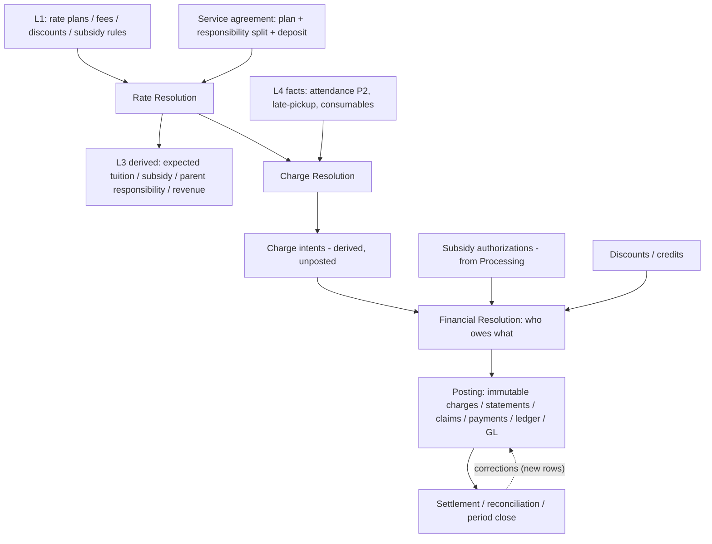

# Operational Execution P3 — Financial Resolution (planning memo)

**Status:** Planning only (June 2026). **No code, no migrations, no runtime, no UI.** Defines the backend doctrine + technical plan for resolving **financial truth from operational truth** as **L5 Operational Consequences** in the truth-flow axis. P1/P1.1 (config rules), P2/P2.1 (attendance facts + actual compliance) are complete; this memo sequences P3.

**Inputs reviewed:** `docs/platform/operational-truth-flow-doctrine.md`; `docs/platform/modules/billing-financials-platform.md`; `docs/product/billing-and-financials.md`; `docs/sprints/06_2026/operational_execution_phase1_backend_building_blocks.md`; P1 config code (`web/lib/childcareOperational/config/*`), P2/P2.1 attendance code (`web/lib/childcareOperational/attendance/*`); existing financial schema (`supabase/migrations/20260331120000_charges_receivables_foundation.sql`, `docs/supabase/reference/supabase_schema_columns.csv`).

> **This is not "billing UI."** P3 is the backend resolution chain that turns rules + commitments + facts into *who owes what*. Posting (invoices/claims/payments/ledger/GL) is the **last** boundary, not the model.

---

## 1. Executive summary

Alloy already has a financial **posting** stack (`charges`, `charge_line_items`, `payment_allocations`, `payments`, `ledger_transactions`, `gl_*`) — but it is welded to the **jobs/services vertical** and, critically, it has **no resolution layer**. Today a charge *is* the model: amounts are computed (job pricing), a `charges` row is written against a `job_id`, and money flows. There is no separation between *what pricing applies*, *what should become a charge*, *who should owe it*, and *what gets posted*.

P3's thesis: **insert a resolution chain in front of posting**, and **generalize the posting stack off `job_id`** so childcare (enrollment agreement + attendance facts) is a first-class billable source. The chain has four distinct stages that must not collapse:

| Stage | Question | Layer | Output |
|-------|----------|-------|--------|
| **Rate Resolution** | What pricing logic applies? | L1 (read) | resolved rate plan + components for an agreement/program/date |
| **Charge Resolution** | What financial events should become charges? | L4→L5 (derive) | charge *intents* (not yet posted) from facts/periods |
| **Financial Resolution** | Who should owe what, given current truth? | L3/L5 (derive) | net responsibility split (parent / subsidy / other) after discounts/credits |
| **Posting** | What is written? | L5 (write) | immutable charges, statements, claims, payments, ledger, GL |

The first three are **pure/derived** (testable, recomputable, non-authoritative until posted), exactly like P1 expectations and P2.1 compliance. Posting is the only stage that writes authoritative financial rows, and it follows the **immutability + reversal** discipline already half-present in `charges.source_charge_id`.

**Single biggest blocker:** `charges.job_id` is `NOT NULL`. **Single biggest risk:** the existing `charges` table is **mutable** (in-place status/amount edits via `FOR UPDATE` RLS + `set_updated_at`), which contradicts the L5 immutability law. Both are addressed in P3.1 before any childcare money is modeled.

**Subsidy is designed-for but not built in P3.** Processing owns external intake; P3 only defines the *seam* (subsidy authorizations consumed by Financial Resolution; expected subsidy stays L3-derived, never booked as AR before a claim fact).

---

## 2. Canonical vocabulary

Terms are deliberately distinct. Collapsing any two of these is the failure mode this memo exists to prevent.

- **Rate plan** — a named pricing product (e.g. "Infant Full-Day, Monthly"). Carries cadence + basis + components. L1 config catalog.
- **Rate component** — a priced element within a plan (base tuition, registration, diaper/consumable fee). Plans are composed of components.
- **Rate rule / rate assignment** — the scoped, effective-dated row that *selects* which rate plan applies for a scope (org/site/program/room/age-group), resolved most-specific-wins (same engine as P1 capacity/ratio/schedule rules).
- **Fee schedule** — definitions for non-tuition charges: one-time, deposit, consumable, late-pickup. L1 config.
- **Discount definition** — sibling/staff/promotional reductions (% or fixed), scoped + effective-dated.
- **Service agreement (financial terms)** — the financial commitment binding an *enrollment agreement* to a rate plan + responsibility split + deposit terms, effective-dated. **Distinct from** the operational `child_enrollment_agreements` row (L2 operational commitment).
- **Financial responsibility** — the obligation to pay. Split across **responsibility parties** (parent/guardian payer, subsidy agency, third party). A share of a resolved charge.
- **Subsidy authorization** — an external agency commitment to cover a portion of care for a child over a period. **Owned by Processing intake**; *consumed* by Financial Resolution. Not a receivable.
- **Billable source** — the polymorphic `{type, id}` a charge derives from. `job` (services vertical) and `enrollment_agreement` (childcare, + the attendance/schedule facts that triggered it) are two kinds; neither is privileged.
- **Charge** — an immutable, posted receivable line. Corrections are new linked rows (reversal/adjustment via `source_charge_id`), never in-place edits.
- **Charge intent** — the *derived, unposted* proposal that a fact/period should become a charge. Output of Charge Resolution; input to Posting.
- **Credit / adjustment / reversal** — append-only corrections. Credit = customer-favorable balance; adjustment = amount change via new row; reversal = void via offsetting row.
- **Settlement / reconciliation** — matching expected vs received (subsidy remittances, payments) and closing a service period.
- **Posting** — writing authoritative financial rows: charges, statements/invoices, subsidy claims, payments, ledger transactions, GL entries.
- **Expected tuition / subsidy / revenue** — **L3 derived projections**. Never stored as authoritative rows.

---

## 3. Financial Resolution lifecycle

**Walkthrough**

1. **Configure (L1):** rate plans, components, fee schedules, discount definitions — first-class, effective-dated, scoped. (Subsidy rules later, via Processing.)
2. **Commit terms:** a service agreement binds an enrollment agreement to a resolved rate plan + responsibility split (parent vs subsidy share) + deposit terms.
3. **Rate Resolution (pure):** for an agreement/program/date, resolve the applicable plan + components (most-specific-wins, effective-dated).
4. **Expected projections (L3 derived):** expected tuition, expected subsidy, expected parent responsibility, expected revenue — recomputable, non-authoritative.
5. **Facts accrue (L4):** attendance events (P2) are the keystone; late-pickup and consumable usage are additional fact kinds (future). Schedule-based plans need *no* attendance fact to bill; attendance-based plans bill per attended day.
6. **Charge Resolution (derive):** decide which facts/periods become **charge intents**, honoring cadence (advance vs arrears), basis (schedule vs attendance), proration, deposits, one-time/recurring.
7. **Financial Resolution (derive):** given charge intents + subsidy authorizations + discounts + credits, compute the **net responsibility split** — what the parent owes, what the agency is expected to cover, any third-party share.
8. **Posting (write):** materialize immutable charges with `billable_source`, group into statements/invoices, create subsidy claims, apply payments/credits, write ledger + GL.
9. **Settlement/reconciliation:** match subsidy remittances and payments to expected; close the service period; produce expected-vs-actual revenue variance (observational, like P2.1).
10. **Corrections:** after invoice/payment, corrections are **new reversal/adjustment rows** (re-resolution feeds new postings); history is never overwritten.

Timing variants (`billing before service period`, `billing after`, `settlement after close`) are **policies inside Charge Resolution and Settlement**, not new tables.

---

## 4. Proposed backend primitives

Grouped by truth-flow layer. (Names indicative; grain is an open question in §10. All childcare config follows the P1 pattern: effective-dated, scoped `org > site > program > room`, `has_org_role` RLS, shared scope-validation trigger.)

**L1 — Financial configuration (first-class, code-owned invariants)**
- `rate_plans` — catalog: `cadence ∈ {annual, monthly, weekly, daily, hourly}`, `basis ∈ {schedule_based, attendance_based}`, `program_day_count` variant (full/half/3/4/5-day), currency.
- `rate_plan_components` — priced elements per plan (base tuition, registration, diaper/consumable), each with amount + cadence.
- `rate_rules` (rate assignments) — scoped, effective-dated selection of a plan for a scope (reuses the P1 resolver: `resolveConfigRule` most-specific-wins).
- `fee_schedules` — one-time / deposit / consumable / late-pickup definitions.
- `discount_definitions` — sibling/staff/promo (% or fixed), scoped + effective-dated.
- *(later, Processing-owned)* `subsidy_program_rules` — agency rules. **Not built in P3.**

**L1/L2 — Financial commitment**
- `service_agreements` — bind `child_enrollment_agreements.id` → rate plan + deposit terms, effective-dated; **separate from** the operational enrollment agreement.
- `financial_responsibility_assignments` — per agreement, the responsibility **split** across parties (payer percentages / fixed shares); a party is a `customer_member`/`person` (parent) or an external subsidy authorization.
- *(consumed, not authored here)* `subsidy_authorizations` — external; referenced by responsibility assignments. Stub interface in P3, populated by Processing later.

**L3 — Derived (NO tables; pure read models, like P2.1)**
- expected tuition / expected subsidy / expected parent responsibility / expected revenue, by agreement and by site/period.
- Built from L1 (rate resolution) + L2 (service agreements) + (for forecasting) L4 facts. Recomputable; never authoritative.

**L4 — Facts (reuse P2; add kinds later)**
- `child_attendance_events` (P2) is the keystone billable fact stream.
- Future fact kinds (own tables/streams, append-only): late-pickup facts, consumable usage facts. **Out of P3 scope; design seam only.**

**L5 — Resolution + posting**
- **`billable_source`** abstraction: `billable_source_type` + `billable_source_id` columns on `charges` (and the ledger/GL dimension), with `job` and `enrollment_agreement` as kinds. Relaxes `charges.job_id` to nullable.
- **Charge Resolution service** (pure): facts/periods + resolved rates → **charge intents**.
- **Financial Resolution read model** (derive): charge intents + subsidy authorizations + discounts/credits → net responsibility split.
- **Posting services**: charge materialization (immutable, reversal/adjustment via `source_charge_id`), statement/invoice grouping, subsidy claim creation, payment/credit application, ledger + GL writes (existing stack, with an agreement dimension added).
- **Settlement/reconciliation service**: expected-vs-received matching, period close, revenue variance read model.

---

## 5. What reuses existing financial tables

Reuse the posting stack; do **not** fork it.

- **`charges`** — reuse as the single receivable table. `source_charge_id` (self-FK, already present) is the **existing hook for reversals/adjustments/credit notes** — leverage it rather than adding a new corrections table.
- **`charge_line_items`** — reuse for line detail (tuition/fee/discount lines on one charge).
- **`payments` / `payment_allocations`** — reuse for tender + allocation. `payment_allocations.charge_id` (nullable, already added) is the charge-level allocation path; childcare uses it instead of `target_entity_type/id` job-level allocation.
- **`ledger_transactions`** — reuse the single ledger. `job_id` is already **nullable**; add an enrollment/agreement (billable_source) dimension rather than a second ledger.
- **`gl_accounts` / `gl_account_mappings` / `gl_journal_entries` / `gl_journal_lines`** — reuse the single GL; `gl_journal_lines.job_id` is already nullable. Add tuition/subsidy account mappings + agreement dimension.
- **`post_ledger_transaction`** (DB function) and `web/app/api/admin/financials/**` read APIs — reuse the posting/read path.

---

## 6. What must be generalized away from `job_id`

Concrete, repo-grounded changes (P3.1, before any childcare charges):

1. **`charges.job_id NOT NULL` → nullable** (`supabase/migrations/20260331120000_charges_receivables_foundation.sql` line 13). Add `billable_source_type` + `billable_source_id`; add a CHECK that a source identity is present (job XOR enrollment_agreement). Backfill existing rows to `billable_source_type='job'`, `billable_source_id = job_id`.
2. **`charges.charge_type` CHECK `{service, fee, adjustment}` is too narrow** (line 29-31). Childcare needs tuition / deposit / consumable_fee / late_pickup / one_time / discount / credit. **Recommend an additive `charge_category` column** (childcare vocabulary) rather than overloading `charge_type` and risking the job vertical's assumptions. Challenge in §10.
3. **`charges` mutability conflicts with the L5 immutability law.** Today: `FOR UPDATE` RLS policy + `trg_charges_updated_at` + in-place `status`/`voided_at`. For posted charges, **amount corrections must be new linked rows** (via `source_charge_id`), not in-place edits. A draft→posted lifecycle is acceptable state; post-posting financial mutation is not. Requires a write-discipline decision (trigger or service guard) — §10.
4. **RLS/role posture mismatch.** `charges` use `current_org_id()` with broad `authenticated` INSERT/UPDATE; P1/P2 childcare tables use `has_org_role(... owner/admin/ops/manager)` + server-only writes. Childcare charge writes must be **server-side + role-gated** (money is never computed in the browser). Reconcile the posture for the generalized table.
5. **`ledger_transactions` + `gl_journal_lines` lack an enrollment/agreement dimension.** Both already allow null `job_id`; add a `billable_source` (or `enrollment_agreement_id`) dimension so childcare posts to the same ledger/GL with proper analytics — **not** a second ledger.
6. **`charge_line_items.job_line_item_id`** is a job-vertical provenance link; childcare lines leave it null and carry their own provenance (rate component / fact ref) in metadata or a typed column.

---

## 7. What remains off-limits

Unchanged from truth-flow + billing doctrine; reaffirmed for P3:

- **No childcare billing before the core is generalized off `job_id`** (P3.1 gates everything else).
- **No job-vertical reuse:** `schedules`, `assignments`, `recurrence_plans`, `customer_subscriptions`, `placement_candidates`, `pricing_*` / `service_pricing_rules`, and job pricing helpers (`web/lib/pricing/*`) are the services vertical. Do not bill childcare through them; do not wrap an enrolled child in a `job`.
- **No second ledger/GL or parallel charges model** for childcare.
- **No deriving charges from enrollment/intent.** Charges derive from **facts** (attendance) or **schedule-based plan periods**, never from the act of enrolling, and never from the OCM proposal or `opportunities.location_id`.
- **No storing "expected tuition/subsidy/revenue" as authoritative rows.** L3 is derived (materialized cache allowed only as non-authoritative + recomputable).
- **No `inquiry_child` extension.** Billing data lives on its own billing-child context per `child_namespace_decision.md` §6.
- **No payment processing / Stripe / webhooks in P3.** No invoice UI, no payment UI. No money computed in the browser.
- **No subsidy implementation** beyond the consumption seam (§8).
- **No in-place editing of posted financial rows.** Corrections are append-only reversals/adjustments.

---

## 8. How subsidy fits without being built yet

Subsidy is the strongest test of the four-stage separation. P3 builds only the **seam**.

- **Processing owns external intake.** Agency documents, authorization letters, and rule sources are ingested by Processing — the external-truth intake plane — not by Financial Resolution.
- **Agencies have rules; BOS may monitor + propose; humans approve.** Rule changes flow: Processing/BOS detect → **propose** → human approval updates operational/financial truth (L1 config). Financial Resolution never silently adopts an agency rule change.
- **Financial Resolution *consumes* subsidy authorizations + rules.** A `subsidy_authorization` (child, agency, period, covered amount/percent, status) is an input to the responsibility split: it reduces expected parent responsibility and produces **expected subsidy** (L3 derived).
- **Expected subsidy is never a receivable.** Before a claim fact exists, expected subsidy is L3 only. It is **not** booked as AR. This prevents booking revenue Alloy has not earned/claimed.
- **Posting (later) creates claims/payments/ledger entries.** A subsidy **claim** is an L4/L5 artifact created at posting; the agency **remittance** is a payment fact; **settlement** reconciles expected vs received and closes the period. Corrections post-claim follow the reversal discipline.
- **P3 deliverable:** a typed `SubsidyAuthorization` interface consumed by Financial Resolution, with a stub/placeholder source (mirroring how P2.1 left `staffOnHandByRoomDate` as a placeholder until staff scheduling exists). No subsidy tables, intake, or claim posting in P3.

---

## 9. Phase P3 implementation proposal

Each sub-phase is independently reviewable and stops for sign-off. Nothing here is authorized by this memo.

- **P3.0 — Doctrine + decisions (this memo).** Resolve §10 open questions; update `billing-financials-platform.md` with the resolution-chain doctrine. *(doc only)*
- **P3.1 — Generalize the financial core (no childcare money yet).** `billable_source` on `charges` (+ relax `job_id`, additive `charge_category`, source-XOR CHECK, backfill `job`); add ledger/GL agreement dimension; decide + enforce posted-charge immutability (reversal-only); align RLS to server-side + role-gated writes for the generalized path. Tests: backfill correctness, job-flow regression, immutability guard. *(migration + runtime; gates everything else)*
- **P3.2 — L1 rate config + Rate Resolution (pure).** `rate_plans`, `rate_plan_components`, `rate_rules`, `fee_schedules`, `discount_definitions` (P1 pattern); pure `resolveRatePlan` (most-specific-wins, effective-dated) reusing `resolveConfigRule`. No charges yet.
- **P3.3 — Service agreement + responsibility split.** `service_agreements` (bind enrollment agreement → plan + deposit terms) + `financial_responsibility_assignments`; subsidy-authorization interface stub.
- **P3.4 — Charge Resolution + L3 expectations (derive).** Pure charge-intent derivation from attendance facts (P2) + schedule-based plan periods (cadence/basis/proration/deposits); expected tuition/revenue read models (mirrors P2.1 compliance read models). No posting.
- **P3.5 — Financial Resolution read model (derive).** Net responsibility split from charge intents + subsidy authorizations + discounts/credits. Still derive-only; observational expected-vs-actual revenue.
- **P3.6 — Posting boundary.** Materialize immutable childcare charges (`billable_source='enrollment_agreement'`) via the existing stack; statement/invoice grouping; charge-level payment allocation; ledger + GL posting with tuition account mappings. No subsidy claim posting, no UI.
- **Later (post-P3, Processing-dependent):** subsidy intake, authorization storage, claim posting, remittance + settlement; statements/AR-aging surfaces; any operator UI.

---

## 10. Open questions before implementation

Resolve these (decision-memo style, like the P1 grain memo) before authorizing P3.1.

1. **Service-agreement grain — per child or per household?** Sibling discounts and split responsibility imply household-level resolution. Is the financial agreement 1:1 with `child_enrollment_agreements`, or household-scoped covering multiple children? *(Recommend: agreement per enrollment, with household-level resolution overlay for discounts/responsibility.)*
2. **Responsibility party model.** Reuse `customer_members`/`persons` as payer parties? How is an agency represented as a non-tender payer party? Does split responsibility need its own party table or can it live on responsibility assignments?
3. **Rate-plan vs program-day-count modeling.** Are full/half/3/4/5-day plans distinct `rate_plans`, or one plan with components keyed to `schedule_patterns` (P1) day-count? How does cadence (monthly) interact with day-count (3-day week)?
4. **Charge cadence/timing + proration.** Is advance-vs-arrears a rate-plan property or an org policy? Proration rules for mid-period start/withdrawal, closures, and absences (excused vs unexcused — note P2.1 classification carries *no* billing meaning yet; P3 decides if/how it does).
5. **`charge_category` additive column vs expanding `charge_type` CHECK.** Additive is safer for the job vertical but adds a second categorization axis. Confirm the approach and the childcare vocabulary set.
6. **Posted-charge immutability cutover.** Existing job billing edits charges in place (status/void). Freezing posted charges to reversal-only — acceptable for current job flows, or scoped to `billable_source='enrollment_agreement'` first? Migration/runtime blast radius.
7. **RLS/role posture for the generalized `charges`.** Move to `has_org_role` + server-only writes everywhere, or only for the childcare path? Impact on existing job-billing UI write paths.
8. **Invoice/statement modeling.** Introduce a first-class `invoices` table now (the current "ghost" entity type), or keep charges-as-lines with a lightweight statement grouping? Affects payment allocation + AR aging.
9. **Ledger/GL dimension.** Add `enrollment_agreement_id` (or generic `billable_source`) to `ledger_transactions` + `gl_journal_lines`, plus tuition/subsidy GL account mappings. Confirm dimension shape and mapping ownership.
10. **Subsidy boundary confirmation.** Confirm expected subsidy stays L3 (never AR pre-claim); confirm subsidy rule storage is L1 config updated via human-approved Processing/BOS proposals (not auto-adopted). Confirm the P3 stub interface shape.
11. **Currency.** `charges.currency_code` / `ledger_transactions.currency` exist. Single-currency assumption for P3, or must rate plans carry currency from day one?
12. **Deposits.** Model a deposit as a `charge_category` with credit-on-withdrawal, or as a held-liability GL position? Interplay with the existing `payments.deposit_batch_id`.

---

## Challenged assumptions (call-outs)

- **"Service agreement" is a new entity, not the enrollment agreement.** Overloading `child_enrollment_agreements` with rate plan + responsibility + deposit couples operational and financial truth and breaks mid-enrollment rate changes. Keep them separate + effective-dated.
- **"Rate plan" ≠ "rate rule."** The doctrine says "rate rules (L1)"; the prompt says "rate plans." They are different: plan = the priced product; rule/assignment = the scoped, effective-dated selection of a plan. Both are needed.
- **Charges are currently mutable — the doctrine says they must not be.** This is a real, existing conflict (`FOR UPDATE` RLS + `set_updated_at` + in-place void). P3.1 must resolve it; `source_charge_id` already exists to support reversal-based corrections.
- **The ledger is *already* polymorphic-ish.** `ledger_transactions.job_id` / `gl_journal_lines.job_id` are nullable today — the hard NOT NULL conflict is only on `charges`. Generalization is smaller than the billing doctrine's framing implies for ledger/GL, but those tables still lack an agreement dimension.
- **Expected subsidy must not be booked.** The intuitive "we expect $X from the agency" is an L3 projection, not a receivable. Booking it pre-claim would overstate AR and revenue.

---

## 11. Decision memo — P3 implementation gates

> **Ratified (June 2026):** The five P3.1-gating decisions (Q5, Q6, Q7, Q9, Q11) are **locked into doctrine** at [`../../platform/modules/billing-financials-platform.md`](../../platform/modules/billing-financials-platform.md) → "Ratified P3.1 implementation gates." That doctrine is canonical; this memo retains the full rationale, alternatives, and migration/back-compat analysis. Deferred items (invoices, subsidy, deposits, responsibility parties, cadence/proration, statement grouping) remain open per the gating table below.

Resolves the §10 open questions into ratifiable decisions. Format per question: **Recommended decision · Alternatives · Doctrine fit · Migration impact · Backward-compat impact · Risks/tradeoffs · Decision language** (the last is drop-in text for the planning/doctrine doc). The three focus questions (#5, #6, #7) carry the preferred direction supplied with this prompt.

### Gating summary (read first)

| # | Question | Gate | Kind |
|---|----------|------|------|
| 5 | `charge_category` additive taxonomy | **Required before P3.1** | Backend foundation |
| 6 | Posted-charge immutability | **Required before P3.1** | Backend foundation |
| 7 | Server-side + role-gated writes | **Required before P3.1** | Backend foundation / security |
| 9 | Ledger/GL agreement dimension | **Required before P3.1** | Backend foundation |
| 11 | Currency assumption | **Required before P3.1** | Backend foundation |
| 2 | Responsibility party model | Defer to P3.3 | Backend foundation |
| 1 | Service-agreement grain | Defer to P3.3 | Backend foundation |
| 3 | Rate-plan vs day-count modeling | Defer to P3.2 | Backend foundation |
| 10 | Subsidy boundary confirmation | Defer to P3.5 (seam only) | Backend foundation |
| 12 | Deposits modeling | Defer to P3.6 | Backend + product policy |
| 4 | Cadence/timing + proration | Defer to P3.4 | **Product policy** (backend honors it) |
| 8 | Invoice/statement modeling | Defer to P3.6 | **Product policy** (backend honors it) |

**Why only 5 gate P3.1:** P3.1 generalizes the *posting substrate* (`charges`, ledger, GL). Anything that changes the shape, write-discipline, security, dimensionality, or currency of those tables must be decided before the generalization migration, because reversing them later is a second breaking migration. Everything about *rates, agreements, resolution, cadence, invoices, subsidy, deposits* sits **above** the substrate and can be decided as its sub-phase lands.

---

### Q5 — `charge_category` additive taxonomy *(REQUIRED before P3.1)*

- **Recommended decision:** Add a nullable `charge_category` text column with its own CHECK vocabulary (`tuition, deposit, consumable_fee, late_pickup, one_time, discount, credit, adjustment, subsidy_offset`). **Leave `charge_type` and its existing `{service, fee, adjustment}` CHECK untouched** for legacy job compatibility. New childcare charges set `charge_category` (and a compatible `charge_type`, e.g. `service`/`fee`/`adjustment`, for legacy consumers). `charge_category` becomes the canonical financial taxonomy going forward; `charge_type` is frozen legacy.
- **Alternatives considered:** (a) Expand the `charge_type` CHECK to add the new values — rejected: mutates a constraint every job-vertical reader/writer assumes, and conflates two different axes (job "service/fee/adjustment" vs financial "what kind of money"). (b) A `charge_categories` lookup table — rejected for P3.1 as over-engineered; a CHECK is enough and matches the P1/P2 controlled-vocabulary pattern. Promotable later.
- **Doctrine fit:** "Code owns invariants"; additive taxonomy avoids overloading a shared compliance-bearing field. Matches the P2.1 controlled-vocabulary approach (absence reasons) — a code-owned CHECK, promotable to config later.
- **Migration impact:** One additive nullable column + one CHECK + index `(org_id, charge_category)`. No change to `charge_type`. No backfill required (legacy rows leave it null).
- **Backward-compat impact:** None for job flows — they neither read nor write the new column and the `charge_type` CHECK is unchanged.
- **Risks/tradeoffs:** Two categorization axes coexist (mild cognitive overhead); risk of drift if future readers key off `charge_type` instead of `charge_category`. Mitigate by documenting `charge_category` as canonical and adding a (deferred) validation that childcare rows always set it.
- **Decision language:** *"Charges gain an additive, nullable `charge_category` (CHECK: tuition/deposit/consumable_fee/late_pickup/one_time/discount/credit/adjustment/subsidy_offset) as the canonical financial taxonomy. The legacy `charge_type` and its CHECK are frozen for job compatibility; childcare charges set `charge_category` and a compatible `charge_type`."*

---

### Q6 — Posted-charge immutability *(REQUIRED before P3.1)*

- **Recommended decision:** Adopt **post/lock immutability**, scoped initially to the new childcare path, with a clear lifecycle: **`draft` charge intents may be recalculated/replaced freely; once a charge is `posted` it is never updated in place.** Corrections after posting are **new linked rows** — reversal (offsetting), credit (customer-favorable), or replacement charge — via the existing `source_charge_id` self-FK. Enforce with a `BEFORE UPDATE` trigger that, for `billable_source_type='enrollment_agreement'`, blocks mutation of financial columns (`amount_cents`, `charge_category`, `billable_source_*`, `service_date`) once `status` has reached `posted` (status may still advance to `partially_paid`/`paid` and allocation/payment metadata may update). Job-vertical rows remain under today's behavior in P3.1 (cutover for jobs is a separate, later decision).
- **Alternatives considered:** (a) Full immutability for *all* charges immediately — rejected for P3.1: breaks existing job billing edit/void flows; too large a blast radius for the gate migration. (b) Keep charges fully mutable and track corrections in metadata — rejected: violates the L5 immutability law and destroys auditability. (c) A separate `charge_corrections` table — rejected: `source_charge_id` already exists for exactly this.
- **Doctrine fit:** Directly satisfies law #4 (facts/consequences immutable; corrections are new effective-dated rows) and the billing-doctrine "reversals/credit notes are new entries, not in-place edits."
- **Migration impact:** A `BEFORE UPDATE` guard trigger/function scoped by `billable_source_type` and `status`. No data change. (Optionally a `posted`/`locked` boolean is redundant given `status` + `posted_at` already exist.)
- **Backward-compat impact:** Zero for jobs in P3.1 (guard is scoped to enrollment-agreement source). The existing `trg_charges_updated_at` and `FOR UPDATE` policy remain; the guard narrows *what* may change for childcare rows.
- **Risks/tradeoffs:** Two write-disciplines on one table until jobs cut over (documented, intentional). Reversal/credit/replacement semantics must be precisely specified (when to use which) — a P3.6 sub-decision. Operators lose "just fix the number" on posted childcare charges (correct, by design).
- **Decision language:** *"Charge intents in `draft` are freely recomputable; a `posted` charge is immutable. Post-posting corrections are new rows linked by `source_charge_id` (reversal, credit, or replacement) — never in-place edits. A status-scoped `BEFORE UPDATE` guard enforces this for `billable_source_type='enrollment_agreement'`; the job vertical's existing mutability is unchanged until a separate cutover."*

---

### Q7 — Server-side + role-gated childcare financial writes *(REQUIRED before P3.1)*

- **Recommended decision:** All childcare financial writes (charges, allocations, claims, ledger, GL) are **server-side only** through trusted admin paths and **role-gated** via `has_org_role(org_id, ARRAY['owner','admin','ops','manager'])`, aligning with the P1/P2 posture. **No broad `authenticated` client writes for money.** Concretely: childcare charge INSERTs go through a server service (admin client / `service_role`) that checks role; do not grant `authenticated` direct INSERT/UPDATE on childcare financial rows. The existing `charges` `authenticated` policies stay for the job vertical in P3.1 but new childcare write paths never rely on them.
- **Alternatives considered:** (a) Reuse the existing `current_org_id()` + broad `authenticated` INSERT/UPDATE policies for childcare — rejected: lets the browser write money, violating "money is never computed in the browser." (b) Immediately tighten `charges` RLS for *all* rows to role-based — rejected for P3.1: regresses job-billing UI write paths; do it as a later, deliberate cutover.
- **Doctrine fit:** Guardrails: "no direct Supabase service-role or privileged writes from client code," "run financial side effects server-side with org scoping and audit trails." Matches P1/P2 `has_org_role` + server-only.
- **Migration impact:** New childcare financial tables get `has_org_role` RLS (SELECT for org; INSERT for owner/admin/ops/manager; `service_role` ALL; no UPDATE/DELETE grants beyond the immutability guard). No change to existing `charges` policies in P3.1.
- **Backward-compat impact:** None for jobs (their policies unchanged). Childcare write paths are new, so there is nothing to break.
- **Risks/tradeoffs:** Mixed RLS posture on shared `charges` until a job cutover (documented). Server-only writes mean no optimistic client-side charge creation for childcare (correct). Future customer-portal payment UX needs its own least-privilege design (out of scope, consistent with `customer_payment_methods` deny-by-default).
- **Decision language:** *"Childcare financial writes are server-side and role-gated (`has_org_role` owner/admin/ops/manager), never broad `authenticated` client writes. New childcare financial tables adopt the P1/P2 RLS posture (org SELECT, role INSERT, service_role ALL, no UPDATE/DELETE grants). Existing job `charges` policies are unchanged in P3.1."*

---

### Q9 — Ledger/GL agreement dimension *(REQUIRED before P3.1)*

- **Recommended decision:** Add a **generic billable-source dimension** (`billable_source_type` + `billable_source_id`) to `ledger_transactions` and `gl_journal_lines` (both already have nullable `job_id`), rather than a childcare-specific `enrollment_agreement_id`. Add tuition/subsidy GL accounts + mappings as data (not schema) in a later sub-phase. One ledger, one GL.
- **Alternatives considered:** (a) Add `enrollment_agreement_id` specifically — rejected: re-creates the per-vertical-column smell that `job_id` already caused; the generic dimension future-proofs other billable sources. (b) Rely only on `charge_id` linkage and derive dimension via join — rejected: ledger/GL analytics and GL line dimensions need the dimension on-row for reporting without a charge join.
- **Doctrine fit:** "One ledger, one GL"; billable source is polymorphic and not job-anchored.
- **Migration impact:** Two additive nullable columns on each of `ledger_transactions` and `gl_journal_lines`, plus indexes. No backfill required (job rows keep `job_id`; can optionally be mirrored into the generic dimension later).
- **Backward-compat impact:** None — additive nullable columns; existing `job_id`-keyed reads keep working.
- **Risks/tradeoffs:** Temporary redundancy between `job_id` and the generic dimension for job rows until/if mirrored. GL account-mapping design (tuition/subsidy/deposit-liability accounts) is deferred but must be reserved.
- **Decision language:** *"`ledger_transactions` and `gl_journal_lines` gain a generic, nullable `billable_source_type`/`billable_source_id` dimension (one ledger, one GL). No childcare-specific FK is added; GL account mappings for tuition/subsidy/deposit are reserved for a later sub-phase."*

---

### Q11 — Currency *(REQUIRED before P3.1)*

- **Recommended decision:** **Single-currency per org for P3**, but **rate plans carry an explicit `currency_code` from day one** (matching `charges.currency_code` / `ledger_transactions.currency`). No multi-currency conversion logic in P3; a mismatch between a rate plan's currency and the org default is a validation error.
- **Alternatives considered:** (a) Omit currency from rate plans and inherit from charges — rejected: leaves currency implicit and blocks any future multi-currency without a breaking change. (b) Full multi-currency (FX, conversion) now — rejected: out of scope, no requirement.
- **Doctrine fit:** Minimal, reversible, config-driven; carries the field without building the feature.
- **Migration impact:** `currency_code` on `rate_plans` (P3.2), defaulting to org currency. None for P3.1 substrate (charges/ledger already have currency).
- **Backward-compat impact:** None.
- **Risks/tradeoffs:** Carrying a field we don't fully exercise (negligible). Validation must reject cross-currency composition.
- **Decision language:** *"P3 assumes a single currency per org. Rate plans carry an explicit `currency_code` (default = org currency) to avoid a future breaking change; cross-currency composition is a validation error. No FX/conversion in P3."*

---

### Q1 — Service-agreement grain *(defer to P3.3)*

- **Recommended decision:** **One `service_agreement` per `child_enrollment_agreements` row (per-child), with a household-level resolution overlay** for sibling discounts and shared responsibility. The agreement is the unit of rate binding; household effects are computed at Financial Resolution, not by collapsing agreements.
- **Alternatives considered:** (a) Household-level agreement covering multiple children — rejected: breaks per-child effective-dated rate changes and per-child withdrawal; misaligns with the per-child enrollment foundation. (b) Per-child only, no household overlay — rejected: cannot express sibling discounts.
- **Doctrine fit:** Mirrors the committed enrollment foundation (per-child agreement/placement) and keeps resolution derived.
- **Migration impact:** `service_agreements.enrollment_agreement_id` FK (P3.3). Household linkage resolved via existing customer/household relationships.
- **Backward-compat impact:** None (new tables).
- **Risks/tradeoffs:** Household resolution needs a reliable household/sibling grouping source; if absent, sibling discounts are blocked until that grouping exists.
- **Decision language:** *"A service agreement is per enrollment agreement (per child); household-level effects (sibling discounts, shared responsibility) are computed at Financial Resolution via a household overlay, not by merging agreements."*

---

### Q2 — Responsibility party model *(defer to P3.3)*

- **Recommended decision:** Model responsibility as `financial_responsibility_assignments` rows on a service agreement, each naming a **party** by `{party_type, party_id}` where `party_type ∈ {customer_member, person, subsidy_authorization, external}`. Parent payers reference `customer_member`/`person`; agencies reference a `subsidy_authorization` (a non-tender party). Shares are percentage or fixed, effective-dated, must sum to 100% (or fixed total) at resolution time.
- **Alternatives considered:** (a) A dedicated `payer_parties` table — rejected for P3 as premature; the polymorphic reference reuses existing identity. (b) Single payer only (no split) — rejected: split responsibility and subsidy are explicit requirements.
- **Doctrine fit:** Reuses `persons`/`customer_members` identity; treats subsidy as a party without making it a tender/payment method.
- **Migration impact:** `financial_responsibility_assignments` table (P3.3) with polymorphic party reference + share columns + a resolution-time sum invariant (code-owned).
- **Backward-compat impact:** None (new tables).
- **Risks/tradeoffs:** Polymorphic party references need careful validation; the 100%/fixed-sum invariant must be enforced in code at resolution, not just by CHECK.
- **Decision language:** *"Financial responsibility is a set of effective-dated assignments per agreement, each naming a polymorphic party (`customer_member`/`person`/`subsidy_authorization`/`external`) with a percentage or fixed share; shares must reconcile at resolution. Subsidy agencies are non-tender parties."*

---

### Q3 — Rate-plan vs program-day-count modeling *(defer to P3.2)*

- **Recommended decision:** Day-count (full/half/3/4/5-day) is a **property of the rate plan** (`program_day_count` / `day_part`), not a separate component axis. Rate Resolution selects the plan whose day-count matches the child's committed schedule (from `schedule_patterns`/`schedule_assignments`, P1/foundation). Cadence (annual/monthly/weekly/daily/hourly) is an independent plan property.
- **Alternatives considered:** (a) One plan with components keyed to schedule-pattern day-count — rejected: makes a single "plan" mean different prices, complicating rate resolution and statements. (b) Encode day-count only in schedule, infer price — rejected: pricing invariants must be code/config-owned, not inferred.
- **Doctrine fit:** First-class rate config; day-count is a pricing dimension, resolved deterministically against committed schedule.
- **Migration impact:** `rate_plans.cadence`, `rate_plans.basis`, `rate_plans.program_day_count`/`day_part` (P3.2).
- **Backward-compat impact:** None (new tables).
- **Risks/tradeoffs:** Plan proliferation (cadence × day-count × age-band) — acceptable and explicit; mitigated by scoped rate rules selecting the right plan.
- **Decision language:** *"Day-count (full/half/3/4/5-day) and cadence are properties of a rate plan; Rate Resolution matches the plan to the child's committed schedule. A plan never carries ambiguous per-schedule prices."*

---

### Q4 — Charge cadence/timing + proration *(defer to P3.4 — product policy)*

- **Recommended decision:** Treat advance-vs-arrears and proration as **Charge-Resolution policy inputs**, defaulting from the rate plan with org-level override, **not** new tables. Backend exposes the policy hooks (cadence anchor, proration method, mid-period start/withdrawal/closure handling); the *chosen values* are a product/operator decision. Note: P2.1 absence classification (excused/unexcused) still carries **no** billing meaning until this decision explicitly grants it.
- **Alternatives considered:** (a) Hard-code monthly-in-advance — rejected: too rigid for the cadence matrix required. (b) Per-charge manual timing — rejected: not scalable, not deterministic.
- **Doctrine fit:** Charge Resolution is the stage that owns "what becomes a charge, when"; keeping timing as policy preserves the four-stage separation.
- **Migration impact:** Policy fields on `rate_plans`/org settings (P3.4); no substrate change.
- **Backward-compat impact:** None.
- **Risks/tradeoffs:** Proration rules are notoriously fiddly (closures, holidays, mid-period changes, absence credits); under-specifying them produces disputes. Requires an explicit product policy table of cases before P3.4 build.
- **Decision language:** *"Charge cadence (advance/arrears) and proration are Charge-Resolution policies defaulted by rate plan with org override, not new tables. Absence classification gains billing meaning only if this policy explicitly assigns it. Proration cases require a product-policy specification before P3.4 implementation."*

---

### Q8 — Invoice/statement modeling *(defer to P3.6 — product policy)*

- **Recommended decision:** **Do not introduce a first-class `invoices` table in P3.** Keep charges as the receivable unit and add a **lightweight statement grouping** (a `statement_id`/period grouping over charges) for presentation/AR aging when P3.6 needs it. Revisit a first-class invoice entity only if/when product requires immutable issued invoices distinct from charges.
- **Alternatives considered:** (a) Build `invoices` now (resolve the "ghost" entity type) — rejected for P3: adds a posting concept before there is a consumer; risks modeling invoices before product defines issuance/locking semantics. (b) No grouping at all — rejected: AR aging and parent statements need a grouping.
- **Doctrine fit:** "Invoice/statement grouping if needed" (billing doctrine sequencing); avoid premature posting structure.
- **Migration impact:** Optional `statement` grouping in P3.6; none in P3.1.
- **Backward-compat impact:** The "ghost" invoice entity type in existing CHECK constraints stays unused; no change.
- **Risks/tradeoffs:** If product later needs legally-issued invoices (locked, numbered), a statement grouping may need to be upgraded to a first-class entity — a known, bounded future migration.
- **Decision language:** *"P3 does not introduce a first-class `invoices` table; charges remain the receivable unit with an optional statement/period grouping for AR aging and parent statements (P3.6). A first-class invoice entity is deferred until product defines issuance semantics."*

---

### Q10 — Subsidy boundary confirmation *(defer to P3.5 — seam only)*

- **Recommended decision:** **Confirmed:** expected subsidy stays **L3-derived and is never booked as AR before a claim fact**; subsidy **rules live in L1 config, updated only via human-approved Processing/BOS proposals** (never auto-adopted). P3 ships only a typed `SubsidyAuthorization` consumption interface (a placeholder source, like P2.1's `staffOnHandByRoomDate`); no subsidy tables, intake, claims, or settlement.
- **Alternatives considered:** (a) Book expected subsidy as a receivable at authorization — rejected: overstates AR/revenue before a claim exists. (b) Let Financial Resolution read agency rules directly from Processing — rejected: bypasses human approval into financial truth.
- **Doctrine fit:** Truth-flow (expectations derived; consequences from facts) + the stated subsidy architecture (Processing intake → propose → human approval → consume).
- **Migration impact:** None in P3 beyond the interface type (no tables).
- **Backward-compat impact:** None.
- **Risks/tradeoffs:** The interface shape must anticipate real authorization fields (agency, period, covered amount/percent, status) to avoid churn when Processing lands.
- **Decision language:** *"Expected subsidy is L3-derived and never an AR pre-claim. Subsidy rules are L1 config updated only via human-approved Processing/BOS proposals. P3 provides a `SubsidyAuthorization` consumption interface only — no subsidy tables, intake, claims, or settlement."*

---

### Q12 — Deposits *(defer to P3.6 — backend + product policy)*

- **Recommended decision:** Model a deposit as a **`charge_category='deposit'` charge** that posts to a **held-liability GL account** (not revenue), with refund/forfeiture handled as **credit/adjustment rows** on withdrawal. Keep it independent of the payments-side `deposit_batch_id` (a tender-batching concept). Recognize revenue (move liability→revenue) only on the policy event (e.g. enrollment completion/forfeiture).
- **Alternatives considered:** (a) Deposit as a plain revenue charge — rejected: misstates the books (a refundable deposit is a liability, not earned revenue). (b) A dedicated `deposits` table — rejected: a deposit is a charge with a liability GL mapping; no new table needed.
- **Doctrine fit:** One ledger/GL; deposits as charge category + GL mapping; corrections via append-only credits.
- **Migration impact:** Deposit-liability GL account mapping (P3.6); reuses the `charge_category` from Q5.
- **Backward-compat impact:** None; `payments.deposit_batch_id` remains a separate tender concept.
- **Risks/tradeoffs:** Liability→revenue recognition timing is a product/accounting policy (forfeiture rules, partial refunds). Misclassifying deposits as revenue is an audit risk — hence the explicit liability mapping.
- **Decision language:** *"Deposits are `charge_category='deposit'` charges mapped to a held-liability GL account; refunds/forfeitures are append-only credit/adjustment rows; revenue recognition occurs only on the policy event. Independent of `payments.deposit_batch_id`."*

---

### Cross-cutting note — challenged assumptions in this memo

- **"Generalization is one big migration" is wrong.** Only 5 decisions gate P3.1, and most are *additive nullable columns + a scoped guard* — low blast radius. The risky part is not size but **write-discipline** (Q6/Q7), which is deliberately scoped to the childcare path first to avoid regressing job billing.
- **"Immutability means a new corrections table" is wrong.** `source_charge_id` already exists; the discipline is a trigger + service convention, not new structure.
- **"We must build invoices/subsidy/deposits now" is wrong.** All three are deferable; forcing them into P3.1 would model posting concepts before product defines their semantics.
- **Two RLS/write postures on `charges` is intentional, not debt to fix immediately.** Childcare adopts the strict posture now; the job-vertical cutover is a separate, explicit decision so it is never an accidental regression.

---

## 12. P3.1 status — built (June 2026)

The five gating decisions (§11 Q5/Q6/Q7/Q9/Q11) are **implemented** as additive substrate generalization. Authoritative as-built lives in [`../../platform/modules/billing-financials-platform.md`](../../platform/modules/billing-financials-platform.md) → "P3.1 as-built". Summary:

- **Migration:** `supabase/migrations/20260630120000_financial_substrate_generalization_p3_1.sql` — applies cleanly + idempotently; functionally verified on a local DB (job compat, draft recalc, post, blocked mutation/void/delete, status advance, `source_charge_id` correction, `source_present`/`charge_category`/`billable_source_type` CHECKs).
- **Tables generalized:** `charges`, `ledger_transactions`, `gl_journal_lines` (generic `billable_source_*`); `charges` also gains additive `charge_category`. **One ledger, one GL** — no new financial tables.
- **`charges.job_id` relaxed to nullable** + backfilled to `('job', job_id)`; `charges_source_present_chk` keeps a source identity mandatory.
- **Immutability:** `enforce_childcare_charge_immutability` trigger (childcare + posted only); job rows unaffected.
- **Write posture:** `RESTRICTIVE` `*_childcare_write_rolegate` policies on the three tables; server-only service `web/lib/financials/childcareChargeService.ts` (no client money-write path).
- **Currency:** substrate already carries currency; no structural change; rate-plan `currency_code` lands with P3.2.
- **Tests:** `web/tests/financials/financialSubstrateGeneralizationMigration.test.ts` + `web/tests/financials/childcareChargeService.test.ts` (15 cases, green).

Deferred sub-phases unchanged: rate plans (P3.2), service agreements / responsibility parties (P3.3), cadence/proration (P3.4), subsidy seam (P3.5), invoices/deposits (P3.6).

---

## 13. P3.2 status — built (June 2026)

Rate configuration + **Rate Resolution** (pure read model) are **implemented**. Authoritative as-built lives in [`../../platform/modules/billing-financials-platform.md`](../../platform/modules/billing-financials-platform.md) → "P3.2 as-built". Summary:

- **Migration:** `supabase/migrations/20260701120000_childcare_rate_plans_p3_2.sql` — applies cleanly + idempotently; functionally verified on a local DB (scope inheritance, vocab CHECKs, scope-shape, rule/plan org consistency, effective-range, hook vocab).
- **Tables:** `childcare_rate_plans` (scoped, effective-dated, explicit `currency_code`, `billing_basis`, `calculation_strategy`, nullable proration/cadence hooks) and `childcare_rate_rules` (priced lines keyed by `schedule_basis` × `rate_basis`, currency inherited from plan). Reuses the P1 scope model + `validate_childcare_config_scope`. Config-posture RLS.
- **Resolver (pure, no IO):** `web/lib/financials/rates/{rateTypes,resolveRate,rateConfigService}.ts`. `resolveRate` answers "given org/site/program/room/age-group/schedule basis/date → which plan + rule, at what amount/currency/basis", delegating plan precedence to the shared config resolver.
- **Tests:** `web/tests/financials/rates/{resolveRate,rateConfigMigration}.test.ts` (19 cases, green): effective dating, inheritance/override, 3/4/5-day, full/half-day, weekly/monthly/annual/hourly/session, currency inheritance, no-plan/no-rule, age-group narrowing, and migration boundary guards (no charges/ledger/GL/AR/invoice writes, no job coupling).

**Hard boundary held:** Rate Resolution ≠ Charge Resolution. Nothing in P3.2 writes `charges`, posts, or creates AR; proration/cadence/discounts/credits/subsidy are reserved hooks only.

Deferred sub-phases unchanged: **Charge Resolution** (emits draft childcare charges through the P3.1 service — recommended P3.3), service agreements / responsibility parties (P3.3), cadence/proration (P3.4), subsidy seam (P3.5), invoices/deposits (P3.6).

---

## 14. P3.3 status — built (June 2026)

Draft **Charge Resolution** + a **minimum responsibility shape** are **implemented**. Authoritative as-built lives in [`../../platform/modules/billing-financials-platform.md`](../../platform/modules/billing-financials-platform.md) → "P3.3 as-built". Summary:

- **No migration.** P3.3 adds no schema. It composes existing substrate (`charges.metadata`, `charge_category='tuition'`, `billable_source_type='enrollment_agreement'`, `currency_code`, `service_date`) and committed-enrollment relationships. Responsibility is resolved from the agreement's canonical household/account (`customer_id`, falling back to `customer_member_id`) and stamped on `charge.metadata.responsibility`.
- **Pure read model:** `web/lib/financials/chargeResolution/{scheduleBasis,billableQuantity,responsibility,resolveDraftCharges}.ts`. Maps `schedule_pattern → schedule_basis`, derives billable quantity per `rate_basis` × `calculation_strategy` (`scheduled` from schedule intent, `attendance_actual` from P2 facts, `hybrid` = scheduled fallback flagged, `fixed` = flat, `hourly` requires explicit hours), and composes a deterministic `DraftChargeIntent` with `resolution_key = tuition:{agreement}:{period}:{schedule_basis}:{rate_rule}`.
- **Service (DB):** `web/lib/financials/chargeResolution/draftChargeResolutionService.ts` — idempotent upsert through `childcareChargeService`: create draft → recalc draft in place when amount changes → `unchanged` when identical → **`skipped_posted`** (posted charges never mutated). Non-billable resolutions return a structured `unresolved` reason and write nothing.
- **Tests:** `web/tests/financials/chargeResolution/{resolveDraftCharges,draftChargeResolutionService}.test.ts` (28 cases, green): scheduled monthly/daily tuition, 3/4/5-day & full/half-day rule selection, monthly/daily/hourly basis handling, idempotency, draft recalculation, posted-not-modified, `attendance_actual` from facts, responsibility attribution, and boundary guards (no charge when unresolved, no job coupling in metadata).

**Hard boundary held:** Charge Resolution emits **draft** charges only; no invoices, AR, ledger, payments, subsidy/expected-subsidy AR, UI, or job coupling. Financial Resolution stays separate from Posting.

### P3.3.1 — Financial Charge Preview API (read-only, June 2026)

A no-write preview path so future Configuration / Focus Panel surfaces can show financial resolution **before** posting. Named generically (financial, not childcare): the childcare/enrollment billable source is a billable-source-specific input, and the DTO names it generically (`billableSource.type = "enrollment_agreement"`).

- **Service:** `previewDraftChargeForAgreementPeriod` (in `draftChargeResolutionService.ts`) performs the full resolution but writes nothing; `resolveDraftChargeForAgreementPeriod` (the write path) is refactored to build on it, so preview and write can never diverge. Preview also reports an advisory `wouldWrite` (`create | recalculate | unchanged | skipped_posted`).
- **Presentation:** pure `buildDraftChargePreviewDto` (`previewDraftChargePresentation.ts`) → stable DTO with resolved rate, schedule basis, quantity, amount, currency, responsibility, resolution key, `wouldWrite`, existing-charge summary, and unresolved reasons.
- **Route:** `GET /api/admin/financial-charge-preview` — financial role-gated (`requireAdminOrOps`) and org-scoped (`getAdminContextCached`); accepts `enrollment_agreement_id` (billable-source-specific) + `period_start` / `period_end` (+ optional `period_key`, `as_of`, `plan_key`, `age_group_key`). Read-only.
- **Tests:** `web/tests/financials/chargeResolution/{previewDraftCharge,financialChargePreviewRoute}.test.ts` (10 cases, green): resolved preview shape, unresolved preview, **no writes** (charges store stays empty), no job coupling, and authorization posture (403 forbidden / 401 unauthenticated, write path never invoked).

**Hard boundary held:** preview is read-only — no posting, invoices, AR, ledger/GL, payments, or UI; the drafting (write) path remains the separate, explicit surface.

Deferred sub-phases: **Financial Resolution depth** — split / subsidy / guardian-specific responsibility and a first-class `service_agreement` / `responsibility_party` table (later P3.3+/P3.5); cadence/proration policy (P3.4); subsidy seam (P3.5); invoices/deposits and Posting (P3.6).

---

## When this memo must be updated

Open questions §10 are resolved (recorded in §11); the resolution-chain doctrine is promoted into `billing-financials-platform.md`; or any P3 sub-phase moves from plan to implementation (record the as-built there).
